# Visibility into the EBS Stack

## Introduction

In this lab, you will explore OCI Stack Monitoring for an Oracle E-Business Suite (EBS) environment. Stack Monitoring provides a monitoring and alarm management for unified, full stack view of your EBS environment by gathering key health metrics, and surfacing anomalies for proactive issue detection and resolution.

Estimated time: 10 minutes

### Objectives

* Use Stack Monitoring to view resources, availability, and metrics for EBS components
* Explore Monitoring Templates & Alarms
* View data for user-defined Metric Extensions

## Task 1: Enterprise Health and Alarms

1. Login to the Oracle Cloud Console and change the selected region to **US East (Ashburn)** region as shown. 

     

2. Click on the **Navigation Menu** in the upper left, navigate to **Observability & Management**, and select **Stack Monitoring** (under the Application Performance Monitoring section). 

     

3. The **root** compartment is selected by default in the Compartment field. Set the compartment to **EBS Demo** (emdemo -> eStore -> EBS_Demo).

     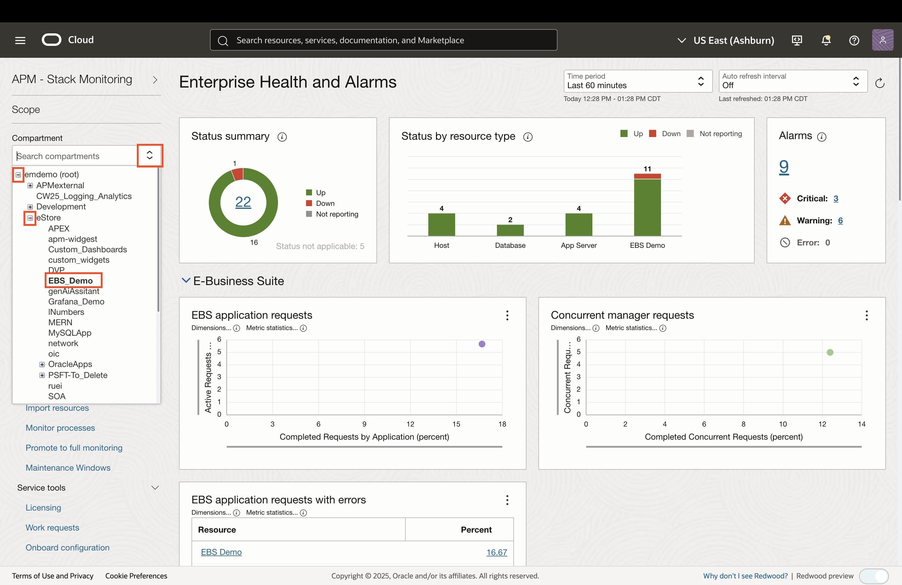

4. The Enterprise Health and Alarms provides an overall health and performance of your entire enterprise. The top tier enables you to quickly identify then triage resources that are **Down** or **Not Reporting** as well as a summary of open alarms across your enterprise.

     The **Status by resource** type chart enables you to easily identify what tier of your application has availability issues. Each bar represents each tier of the application stack, (e.g., host, database, application server). Using the status colors, you can quickly assess if all resources within that tier are up or identify the tier that has a resource outage. Reporting of an application stack, such as E-Business Suite, PeopleSoft, and Oracle Database systems are unique. Each bar represents an application and its components, this allows you to identify if any individual component of an application is down or not reporting. Should you identify an area of concern with an application, clicking the bar will navigate you to that resource's homepage. 

     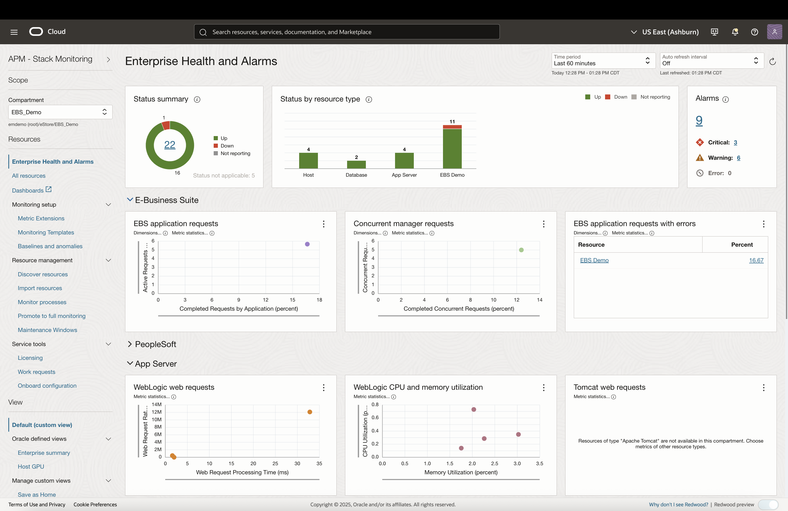

5. Click on the number hyperlink under the **Alarms** widget. The Alarms region provides a summary of open alarms by severity across the enterprise.

     For all of your monitored resources, Stack Monitoring provides quick access to all open alarms. The **Alarms** region provides a total count of open alarms, as well as a count of alarms by severity. Clicking on a count of alarms invokes a slide-out. 

     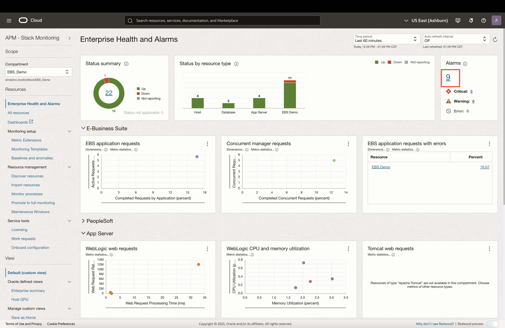

6. The Alarms slide-out provides greater details of the open alarms and is filtered by the severity count selected. The alarm slide-out provides details of open alarms. 

     These details include the severity, trigger time, resource name, metric name, dimension of the metric in a firing state, current value, and alarm name. The **current value** and **severity** can help DevOps teams prioritize the order the open alerts should be triaged. The table can be ordered by selecting the column title. Clicking the **Resource Name** will navigate you to the resource’s home page to investigate the alarm. Click **Close** to return to the Enterprise Health and Alarms summary.

     
     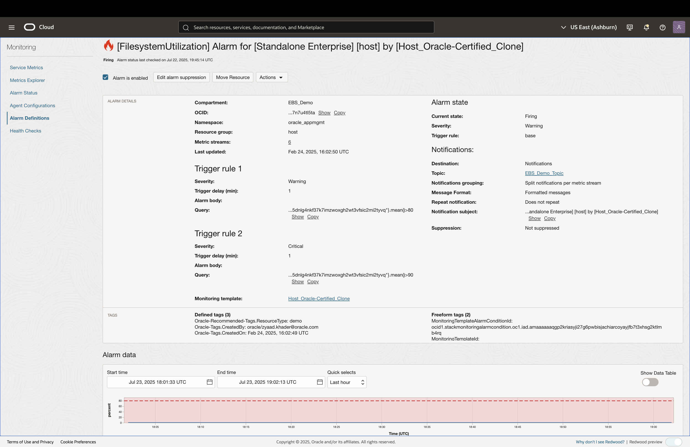

7. The Enterprise Health and Alarms summary is broken down in to tiers. The upper tier, E-Business Suite, provides quick access to key metrics for EBS such as **Completed Requests by Application**, **Concurrent Manager Requests completing with Errors**, and more. 

     Clicking any plot point invokes a slide-out provides historical performance information as well as a link to the resource to continue the investigation. Further down the page, additional resource types are shown such as WebLogic Servers, Oracle Databases, and hosts.
     
     Any of the charts can be quickly swapped then saved to always show the metrics and resources most important to your organization.

     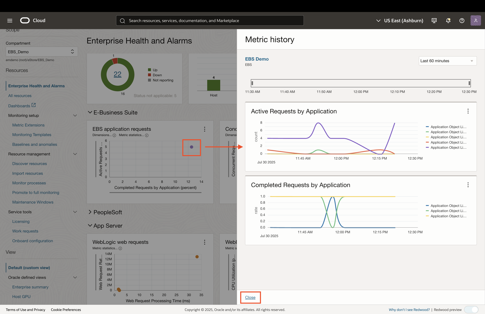

## Task 2: Viewing EBS Resource Details

1. Let’s take a closer look at and EBS application stack by clicking EBS Demo in the Status by resource type and navigating to its home page. Click the EBS Demo in the status by resource type.

     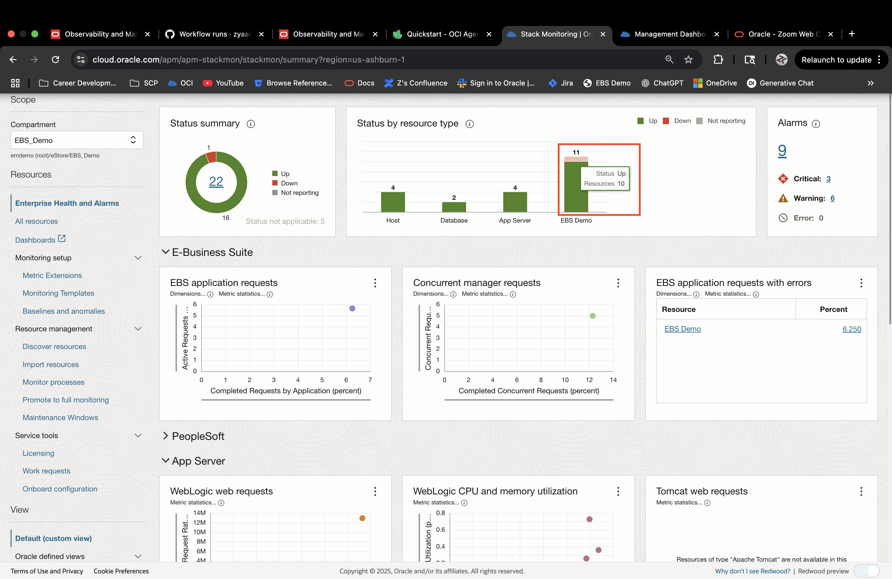

2. The Resource home page provides visual indication of the availability of EBS and its underlying components as well as a summary of open alarms across the entire EBS application. The EBS home page also includes key metrics such as availability history, completed requests by application, and executed programs by running time. A feature unique to Stack Monitoring is the Stack View. Stack View highlights key performance metrics across the entire application stack, click Stack View to view.

     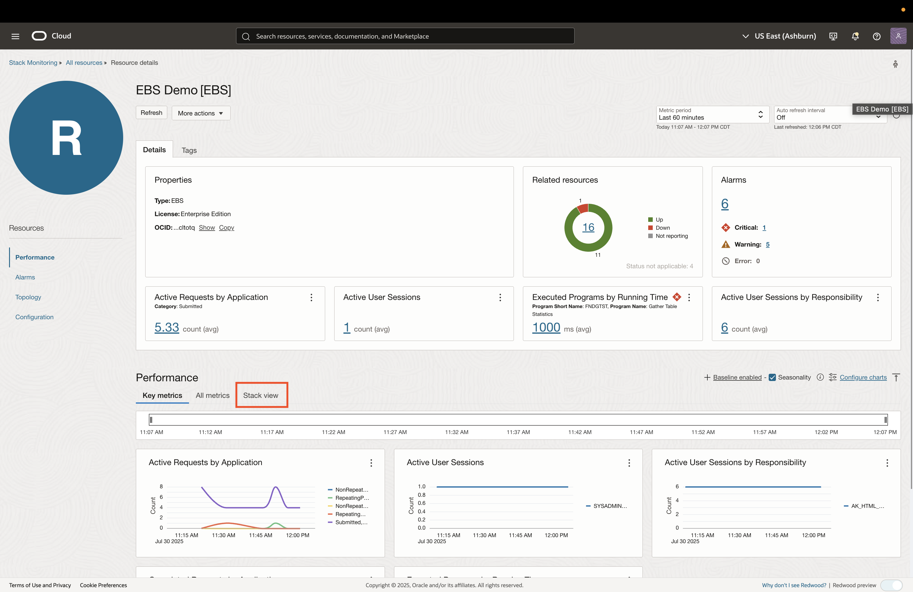
     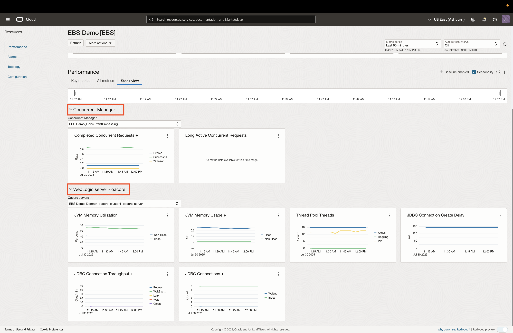

3. The EBS Stack view provides rapid insight into critical KPIs across EBS and its underlying stack.  For example, the running times of the top EBS programs can be reviewed to ensure they are within expected timeframes. The Completed Concurrent Manager Requests can be monitored and verified as successfully completed. The JVM Heap Utilization of the underlying oacore WebLogic Managed Server can be checked to ensure it is not in danger of maxing out on heap. The JDBC connection and failure rates can also be monitored to ensure programs can connect successfully to the underlying Oracle Database. Speaking of database, you can also see transactions by status and wait times. Finally review host performance to quickly determine if your hosts are running out of CPU or memory.

     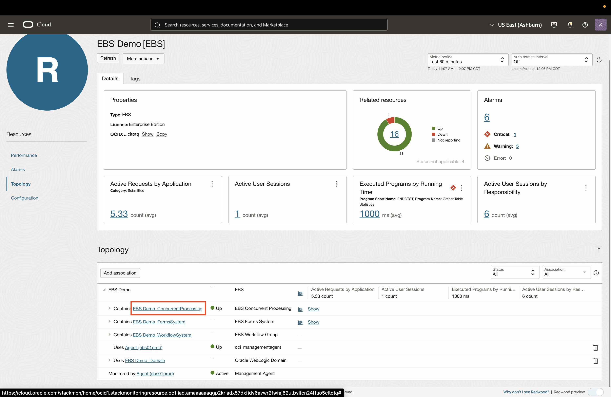

4. The Resource Details page provides triggered alarms for that resource, availability history, and key metric charts.

     
     

5. To view the alarms that are triggered by this resource, click **Alarms** on the left pane.
     
     

6. A topology view is also available for each resource and can be accessed by clicking **Topology** on the left pane.
     

## Task 3: Simplify Alarm Management with Reusable Templates

1. Getting started with monitoring an EBS is easy with out-of-the-box Monitoring Templates. To get started, begin by navigating to the Enterprise Health and Alarms Summary by clicking **Stack Monitoring** in the upper left of the home page.

     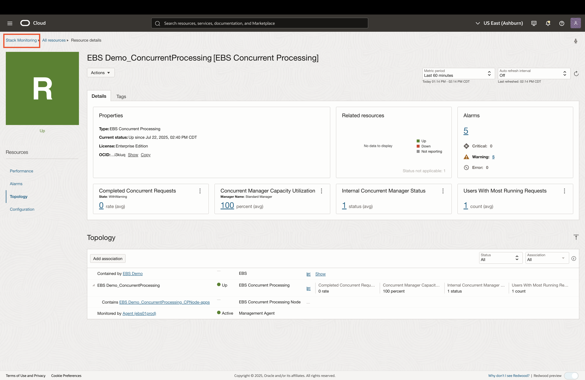

2. From the Enterprise Health and Alarms page, select **Monitoring Templates**. To view the Oracle-certified templates ensure the check-box is selected. Stack Monitoring provides templates with predefined thresholds for all of the out-of-the-box resource types such as EBS, WebLogic, Oracle Database system, hosts and more.  Let’s take a closer look at the E-Business Suite Oracle-Certified Monitoring Template. 

     Uncheck the *Include Oracle certified templates* checkbox in order to view the templates applied to this demo environment.

     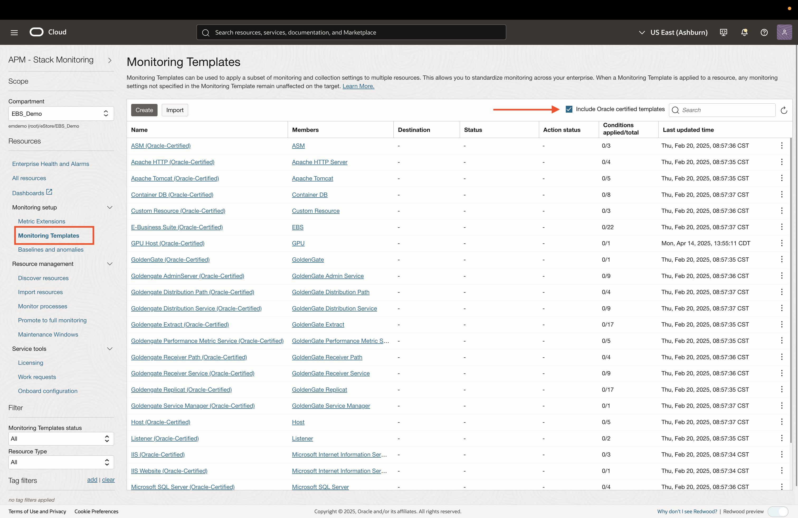

3. Uncheck the *Include Oracle certified templates* checkbox in order to view the applied templates only.

     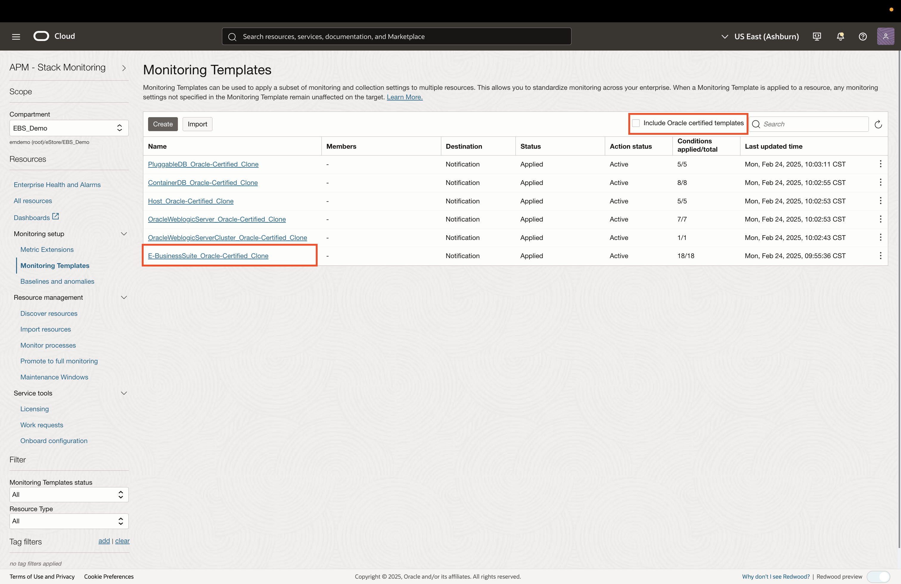

3. Click on the **E-Business Suite Oracle-Certified Clone**. This provides a table of pre-defined alarm conditions that are specific to EBS. Each row item outlines the following:

     * **Metric**: Metric name
     * **Interval**: Cadence at which the metric is collected
     * **Statistic**: Statistical operation to apply to the metric values
     * **Operator**: Comparison operator to apply for the thresholds
     * **Warning Threshold**: Value at which an alarm with Warning serverity is triggered
     * **Critical Threshold**: Value at which an alarm with Critical serverity is triggered

     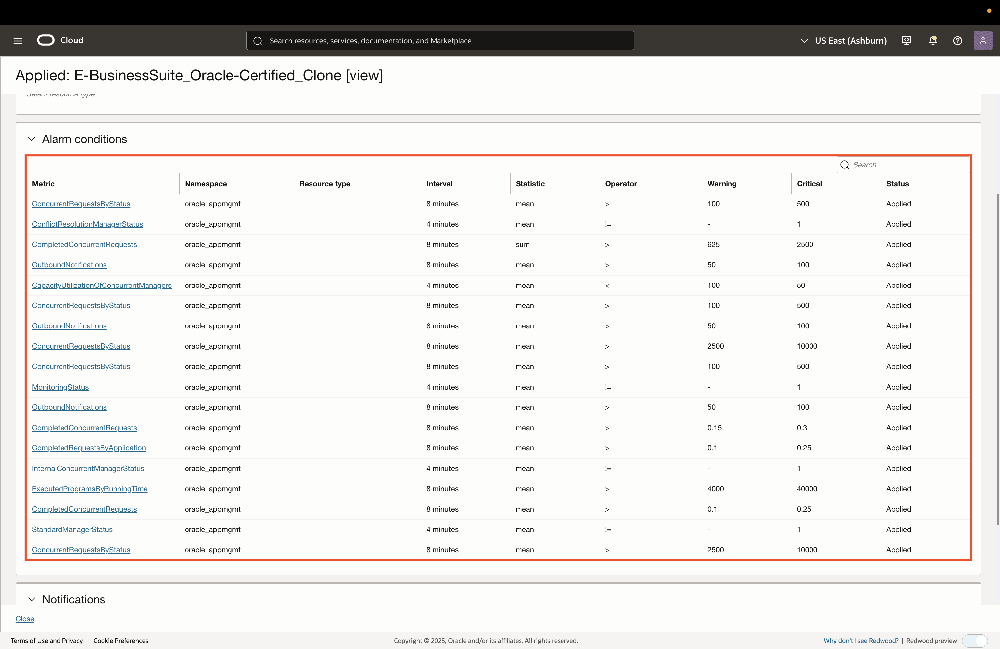

     *Note:* Alarm notifications can be configured to send notifications through the following channels:
          * Email
          * SMS
          * HTTPS Webhook
          * OCI Functions (to trigger code execution)
          * PagerDuty
          * Slack

4. To view other Monitoring Templates that are enabled for this EBS environment, click **Close** on the bottom-left and select a different template.

     **WebLogic Server Monitoring Template**

     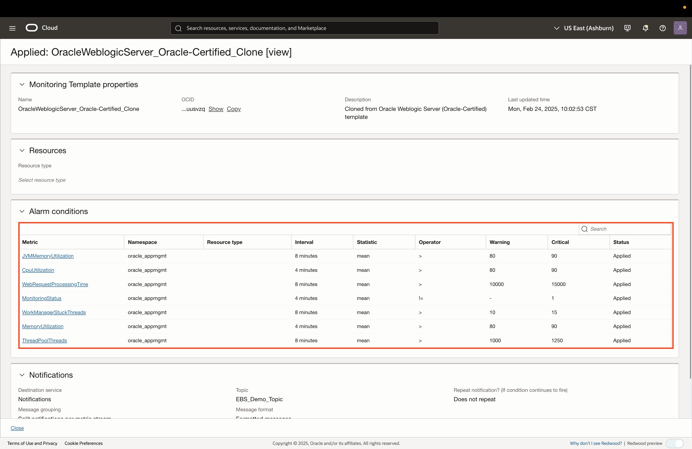

     **Host Monitoring Template**

     

     **Container DB Monitoring Template**

     

## Task 4: Custom Metrics from EBS Resources

1. Stack Monitoring Metric Extensions extend the out-of-the-box metrics, to help meet any unique business requirements. Let’s review an example Metric Extension by clicking **Metric Extensions** in the left pane.

     

2. Now select **ME_LRConcRequest1m**.

     This Metric Extension returns all of the long-running Concurrent Requests in EBS. A Metric Extension is created by providing the command to collect the information, in this case SQL, as well as the metrics and dimensions returned by command. 

     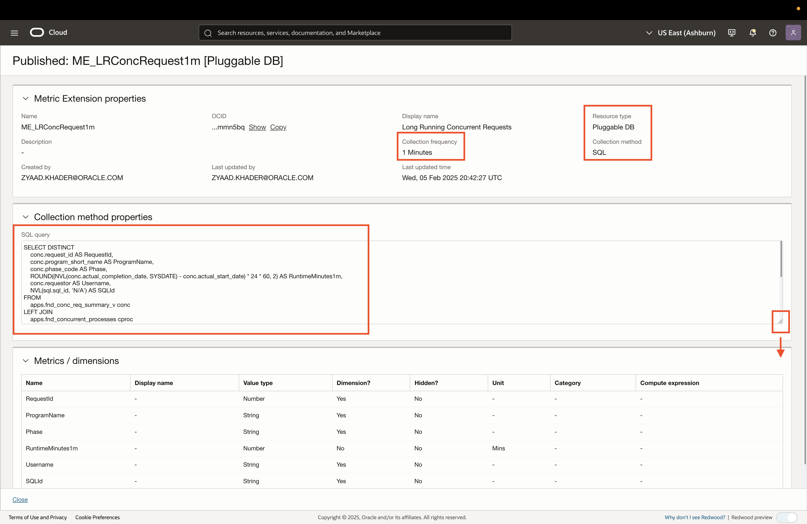

3. Click **Close** on the bottom to exit the Metric Extension details panel.

## Acknowledgements

* **Author** - Zyaad Khader, Principal Member of Technical Staff
* **Contributors** - Zyaad Khader
* **Last Updated By/Date** - Zyaad Khader, July 2025
