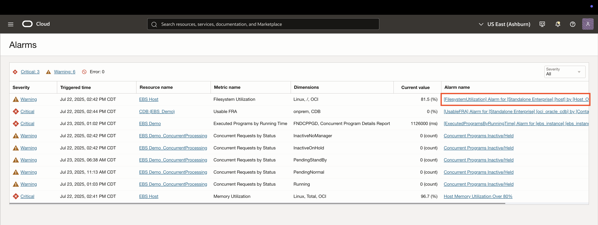
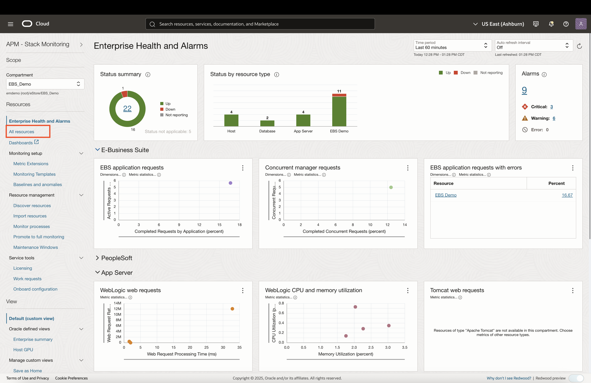
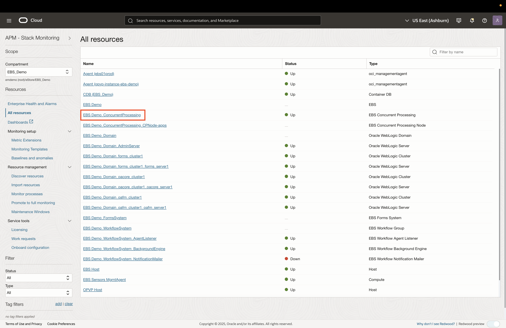
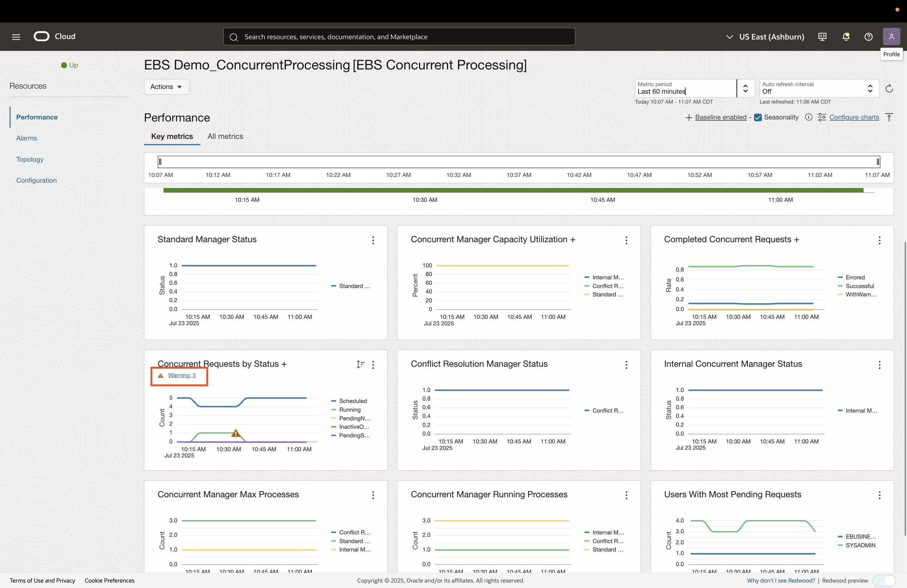
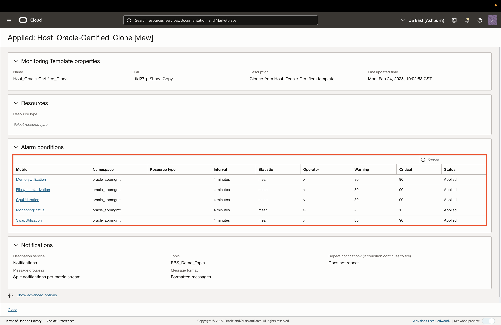
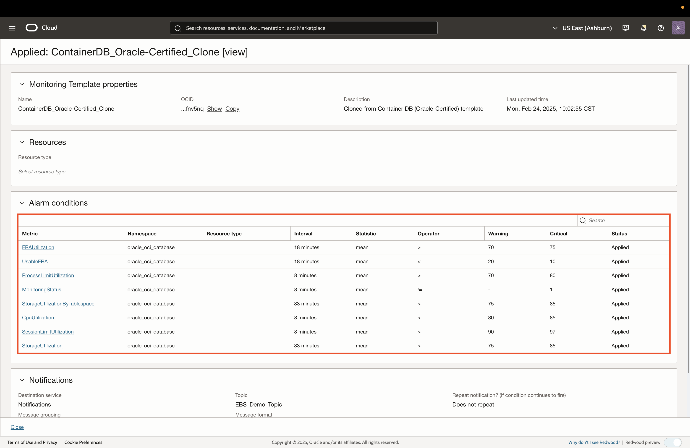

# Visibility into the EBS Stack

## Introduction

In this lab, you will explore OCI Stack Monitoring for an Oracle E-Business Suite (EBS) environment. Stack Monitoring provides a unified, full‑stack view of your EBS environment by gathering key health metrics, and surfacing anomalies for proactive issue detection and resolution.

Estimated time: 10 minutes

### Objectives

* Use Stack Monitoring to view resources, availability, and metrics for EBS components
* Explore Monitoring Templates & Alarms
* View data for user-defined Metric Extensions

## Task 1: EBS Resources Dashboard

1. Click on the **Navigation Menu** in the upper left, navigate to **Observability & Management**, and select **Stack Monitoring**.

     

2. The **root** compartment is selected by default in the Compartment field. Set the compartment to **EBS Demo** (emdemo -> eStore -> EBS_Demo).

     

3. In the Enterprise Summary page, you can view EBS resource status, metrics, and triggered alarms.

     

4. To view the currently triggered alarms, click on the number hyperlink under the **Alarms** widget.

     

5. The window provides a summary table of all the **Critical** and **Warning** alarms that are currently firing, along with the resource and metric details. Click on one of the hyperlinks under the Alarm Name column.

     

6. This opens the Alarm Defenition page, where it provides the alarm details, along with the historical data for that alarm.

     

## Task 2: Viewing EBS Resource Details

1. To view the list of discovered resources for this environment, click on **All Resources** on the left pane.

     

2. Click on the **EBS Demo ConcurrentProcessing** resource.

     

3. The Resource Details page provides triggered alarms for that resource, availability history, and key metric charts.

     
     

3. To view the alarms that are triggered by this resource, click **Alarms** on the left pane.
     
     

4. A topology view is also available for each resource and can be accessed by clicking **Topology** on the left pane.
     

## Task 3: Templates for Alarms and Thresholds

1. Use the breadcrum link on the top-left of the page to navigate back to Stack Monitoring.

     

2. Click on Monitoring Templates on the left pane. This will provide a list of templates that can be automatically applied to discovered resources. Uncheck the *Include Oracle certified templates* checkbox in order to view the applied templates.

     

3. Uncheck the *Include Oracle certified templates* checkbox in order to view the applied templates only.

     

3. Click on the **E-Business Suite Oracle-Certified Clone**. This provides a table of pre-defined alarm conditions that are specific to EBS. Each row item outlines the following:

     * **Metric**: Metric name
     * **Interval**: Cadence at which the metric is collected
     * **Statistic**: Statistical operation to apply to the metric values
     * **Operator**: Comparison operator to apply for the thresholds
     * **Warning Threshold**: Value at which an alarm with Warning serverity is triggered
     * **Critical Threshold**: Value at which an alarm with Critical serverity is triggered

     

     *Note:* Alarm notifications can be configured to send notifications through the following channels:
          * Email
          * SMS
          * HTTPS Webhook
          * OCI Functions (to trigger code execution)
          * PagerDuty
          * Slack

4. To view other Monitoring Templates that are enabled for this EBS environment, click **Close** on the bottom-left and select a different template.

     **WebLogic Server Monitoring Template**

     

     **Host Monitoring Template**

     

     **Container DB Monitoring Template**

     

## Task 4: Custom Metrics from EBS Resources

1. To view user-defined metrics which Stack Monitoring collects, click on the **Metric Extensions** link on the left pane.

     

2. Click on the Metric Extension named **ME_LRConcRequest1m**

     Stack Monitoring allows users to collect custom metrics from discovered resources. In our case, we are collecting a Metric from the EBS database. The following are needed in order to create a metric extension:

     * Resource
     * Collection method - In our case, we use an SQL query
     * Collection frequency
     * Mapping of metrics and dimensions

     

3. You can also choose a time period from the last **60 minutes, 24 hours, or 7 days** to view the metrics.

     

4. Click **Close** on the bottom to exit the Metric Extension details panel.

## Acknowledgements

* **Author** - Zyaad Khader, Principal Member of Technical Staff
* **Contributors** - Zyaad Khader
* **Last Updated By/Date** - Zyaad Khader, July 2025
