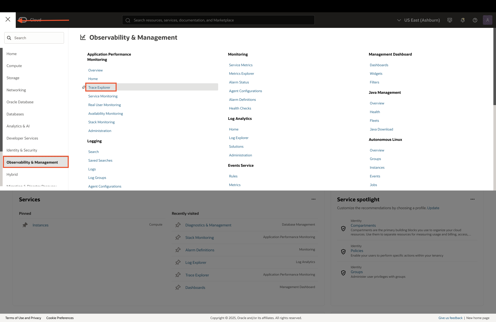
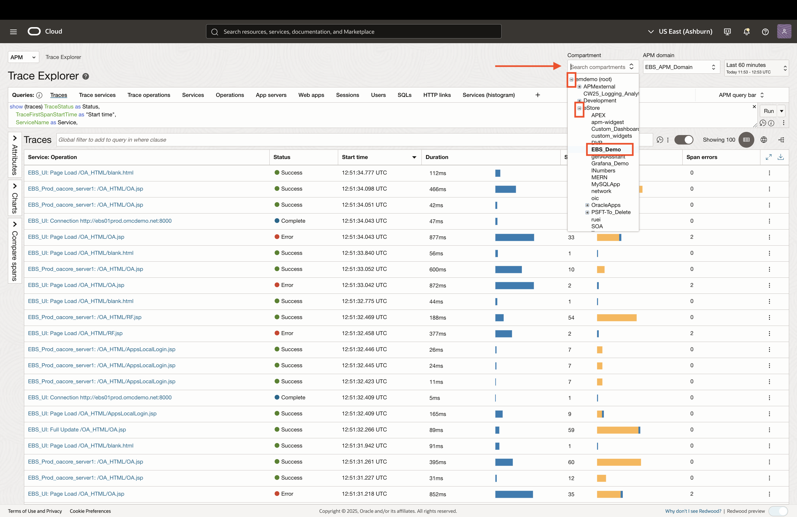
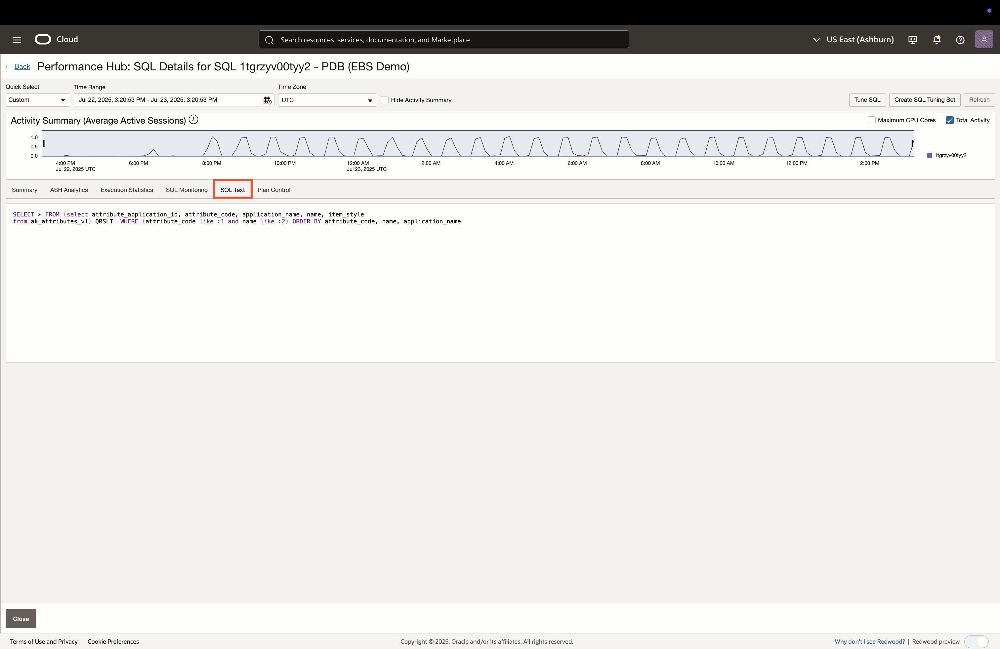
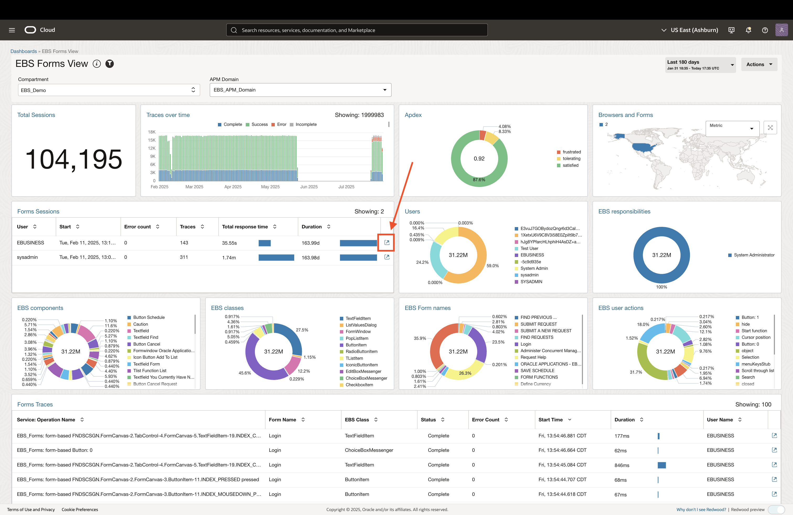
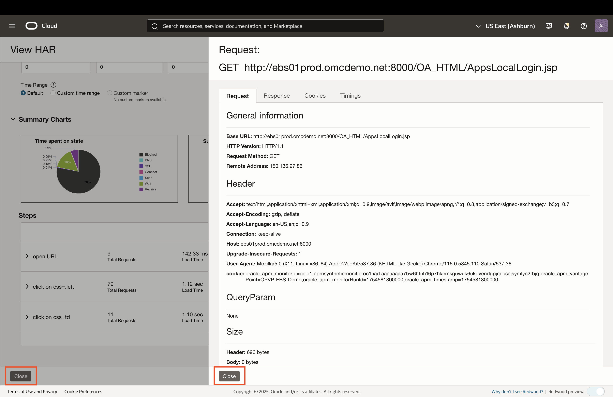
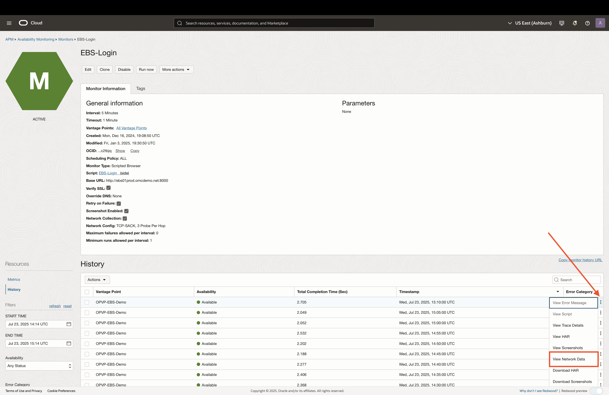

# EBS Application Performance Management

## Introduction

In this lab, you will explore OCI Application Performance Monitoring (APM) for an Oracle E-Business Suite (EBS) environment. APM provides end-to-end tracing of EBS transactions, user experience, and EBS Forms, revealing performance bottlenecks and errors. It can also proactively test components of an EBS environment. 

Estimated time: 10 minutes

### Objectives

* View transactions for EBS services, user sessions, and SQL calls
* Visualize the end-user experience
* Monitor availability of EBS services and user flows

## Task 1: Viewing EBS Application Transactions

1. Login to the Oracle Cloud Console and change the selected region to **US East (Ashburn)** region as shown. 

     

2. Click on the **Navigation Menu** in the upper left, navigate to **Observability & Management**, and select **Trace Explorer** (under the Application Performance Monitoring section). 

      

3. The **root** compartment is selected by default in the Compartment field. Set the compartment to **EBS Demo** (emdemo -> eStore -> EBS_Demo).

      

4. APM displays a table of all the application transactions (called traces) that it has collected from EBS. Each trace is comprised of the applications calls that are being made (called spans). Spans and traces have various attributes such as call duration, error details, EBS action details, SQL information, user information, and more.

      

5. Click on the three dots to the right of a row item to view the details for that trace, then click **Show trace details**. In this case, we chose an **Error** trace. If you don't see Error traces, you can proceed with any trace in the table.

      

6. The Trace Details page provides a topology view of the calls made in that trace. Hover over the topology items and arrows to view metrics regarding services used and call duration.

      

7. Below the topology view, is a waterfall view of all the spans for that trace. Scroll through the spans until you find the one which errored. Error spans have a red exclamation icon which identifies them. Click on the hyperlink for the erroring span. If you chose a trace that does not have any error spans, proceed with any of the spans listed in the table.

      

8. This opens the Span Details page, highlighting important attributes for that specific span. Scroll down the table until you see the **ErrorMessage** attribute, which shows more details about that error. 

      

9. Close the Span Details and Trace Details by clicking **Close** on the bottom-left. 

      

10. The Trace Explorer has multiple out-of-box queries that you can view at the top of the Trace Explorer. Click on the **Operations** query to see a view of traces grouped by the the operation performed in the EBS environment. Click on the count hyperlink to view all the spans for that specific operation. Click on any of the spans to view the span details, which will show you the same view as *Step 8*.
      
      

## Task 2: Viewing SQL Performance from Application Transactions

1. Users can set up drilldowns in APM that use hyperlinks, with context from span attributes. In this example, we will look at linking to Performance Hub in OCI Database Management, with the SQL ID in-context. We start by viewing the SQL calls that are captured in APM by clicking the **SQLs** tab at the top of the Trace Explorer. Next, click on count hyperlink for the row item with the **1tgrzyv00tyy2** SQL ID. 
      For more information on Performance Hub and OCI Database Management, refer to the *Managing SQL and Database Performance* lab.
      

2. Click on any of the spans, then click the button **SQL ID in DBM**. This will link to Performance Hub and filter by that specific SQL ID. 

      

3. Notice how the Performance Hub has applied a filter for that specific SQL ID. Next, we will drill down into a user session that used this SQL ID by click on the hyperlink of any of the user sessions.

      

4. Once the session information loads, click on ASH Analytics to select the SQL ID.

      

5. An SQL Summary page is opened, which provides and overview of the specified SQL, the source of its execution, and the associated plan metrics.

      

6. Navigate to the **Execution Statistics** tab to view a detailed breakdown of the SQL performance. The **Information** column provides links to view details such as filter predicates and access predicates.

      
      

7. Click on the **SQL Text** tab to reveal the SQL statement.

      

8. Close the browser tab which was opened for Performance Hub and close the SQL span details view in the APM browser tab.  

      

## Task 3: Understanding the End-User Experience

1. To view user session traces, click on the **User Sessions** query at the top of Trace Explorer. This will give a breakdown of traces, grouped by session.

      

2. To view a specific user session, click on **Traces** count hyperlink for any of the sessions row items. This will provide you with all the traces collected for that session.

      

3. You can view trace and span information in dashboards for quicker analysis. APM provides some out-of-box dashboards to help you get started. Navigate to the Real User Monitoring dashboard by clicking the navigation dropdown on the top-left of the screen, then select **Real User Monitoring**. 

      

4. The Real User Monitoring dashboard provides useful wigets for to analyze the user experience. You can click on any of the hyperlinks in the widget to view relevant information in Trace Explorer. 

      

## Taks 4: Exploring EBS Forms Transactions

1. APM is also capable of capturing EBS Forms transactions via the Real User Experience Insights (RUEI) tool. Lets view some EBS form data by clicking on the **Dashboards** link in the left pane to view APM dashboards.

      

2. In the Management Dashboard page, ensure the compartment is set to **EBS Demo** (emdemo -> eStore -> EBS_Demo), and click on the **EBS Forms View** Dashboard.

      

3. Once the dashboard loads, select the following filters in order to view the Forms data:

      * **Compartment**: EBS Demo (emdemo -> eStore -> EBS_Demo)
      * **APM Domain**: EBS APM Domain
      * **Time Filter**: Set to last 180 days. Open the time dropdown on the top-right, click on **Custom**, then set it to 180 days.

      
      

4. The EBS Forms dashboard should now display data in all the widgets. To view traces for a particular Forms session, click on the drill-down icon to the right of the **Forms Sessions** row item.

      
      

5. Close the newly opened tab for viewing EBS Forms session traces. To view spans grouped by EBS Form name, click on the **EBS Form Names** wigdet link. Once the grouped EBS Form names load, click on the span count hyperlink to drill down into those spans. This will show the spans for the selected EBS Form name.

      
      

6. Select any of the spans to view more information. Notice all the EBS-specific attributes that are being collected in APM.

      
      

7. Close the Span Details page by clicking the **Close** button on the bottom.
      

## Taks 5: Service Availability Monitoring

1. You can also run procative synthetic tests (called Availability Monitors) to monitor your EBS environment at a specific cadence (eg. every 5 minutes). These Availability Monitors can run from OCI data centers accross the world or within your virtual network. Use the APM navigation dropdown to navigate to the **Availability Monitoring** dashboard for this EBS environment.
      
      

1. The Availability Monitoring dashboard provides availability metrics, errors information, and latency for the active monitors. To view a specific monitor, click on the hyperlink in the Availability table. In this case, we will explore the **EBS-Login** monitor. 

      
      
2. The Monitor Details page provides an overview of the monitor setup (in the **Monitor Information** section), along with a history of the test executions that it ran. For each of the monitor executions in the history table, you can view important details such:

      * Traces for that specific execution
      * HTTP Archive (HAR) breakdown
      * Screenshots taken during the test
      * Network data

      

3. Click on **View Trace Details** to view the traces collected for a specific monitor execution.

      
      

4. Click on **View HAR** to open the HTTP Archive viewer for the monitor execution. The HAR viewer provides charts for time spent, content types, and data transfer information. Below the charts is view of all the steps taken. Expand the steps to view details of requests made.

      
      

5. This waterfall view provides request, response, and time taken. Click on a request to view more details.
      
      

6. Click on **View Screenshots** to view the captured screenshots for the monitor execution.

      
      

7. Click on **View Network Data** to view the network hops for the monitor execution. You can click on any of the hops to view more network information.

      
      

8. Each monitor has a set of metrics that are collected for its executions. Click on **Metrics** in the left pane to view the metrics for this monitor.

      

9. The metrics view provides important information such as availability, execution failures, latency, and more. Users are able to create alarms for those metrics to recieve proactive alerts and implement remediation steps.

      
      

## Acknowledgements

* **Author** - Zyaad Khader, Principal Member of Technical Staff
* **Contributors** - Zyaad Khader
* **Last Updated By/Date** - Zyaad Khader, July 2025