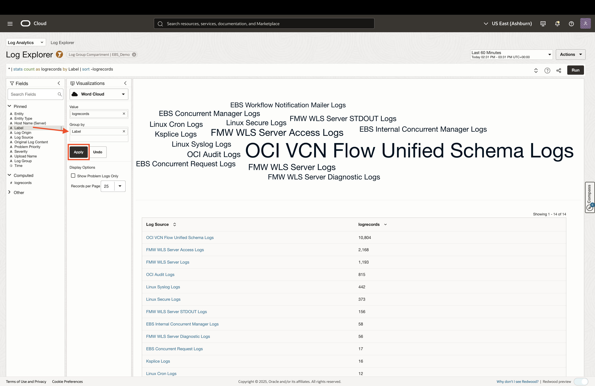
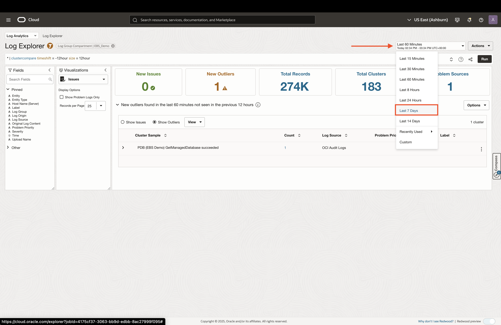
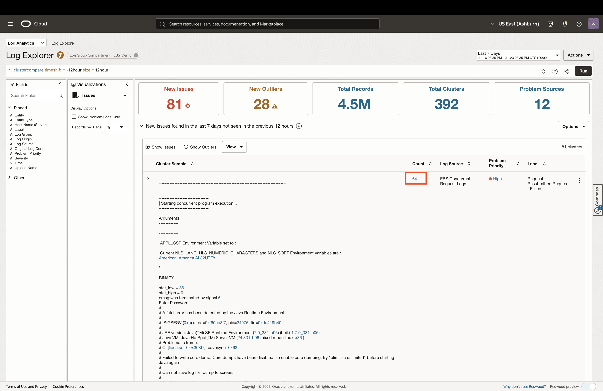
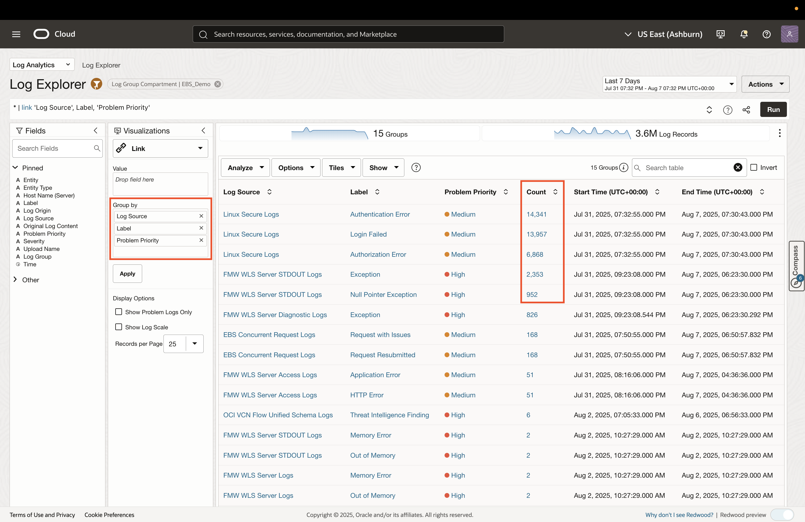
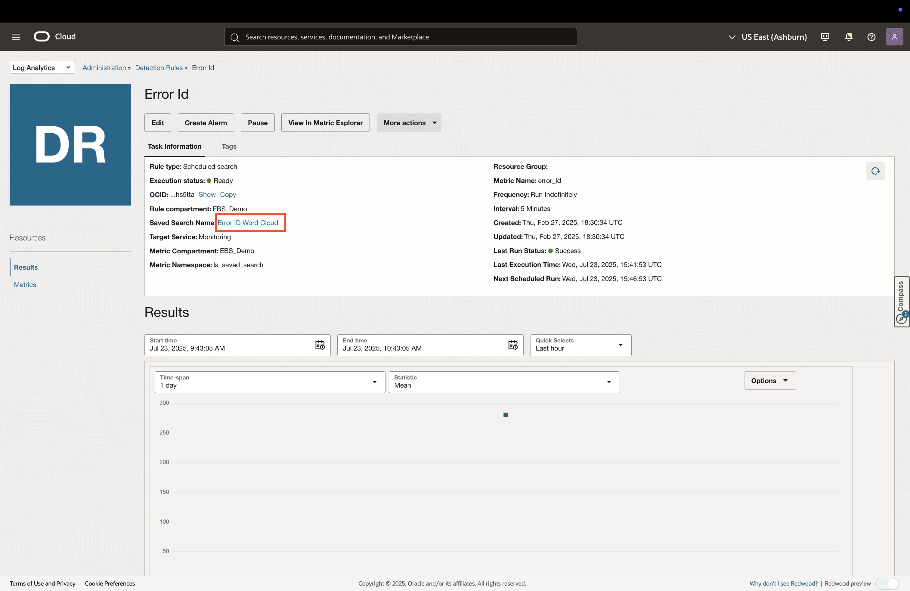
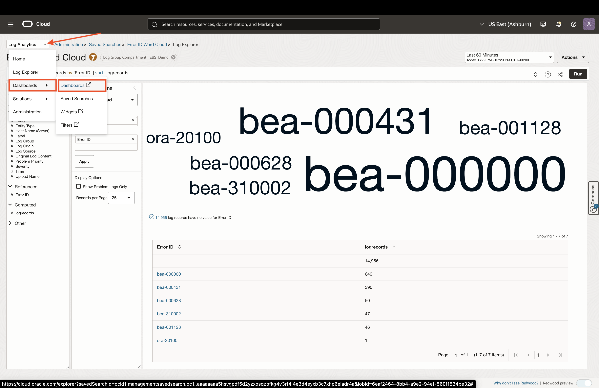
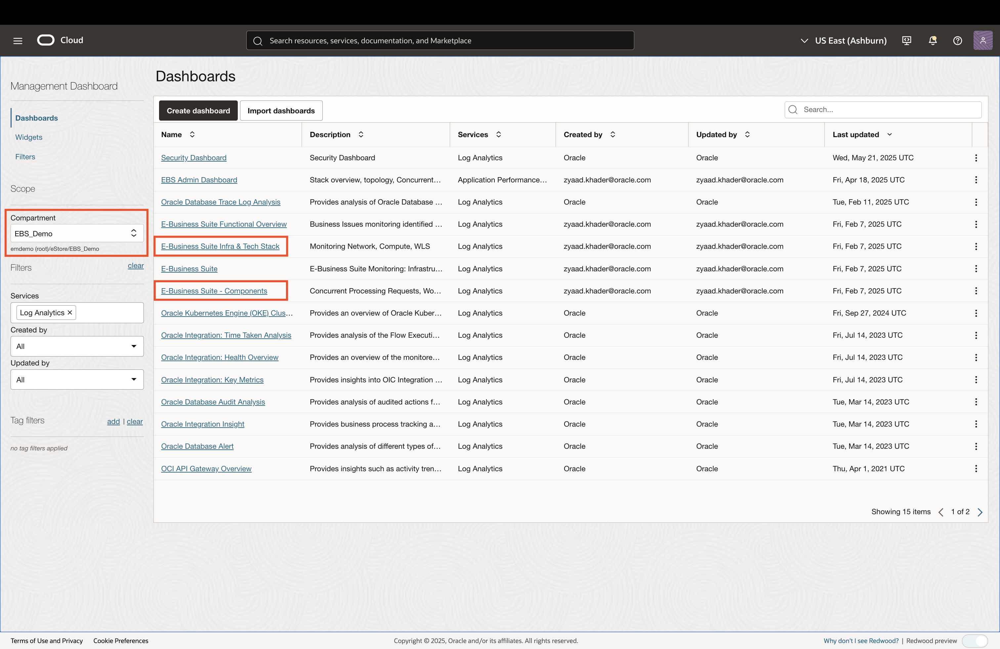

# Analyzing EBS Logs

## Introduction
* In this lab, you will explore OCI Log Analytics for Oracle E-Business Suite (EBS) logs. Log Analytics indexes, enriches, aggregates, and correlates logs from EBS application servers, middleware, and databases—providing ML-powered dashboards and detection for rapid troubleshooting and operational insights

### Objectives

* Visualize EBS log data
* View alarms that look for specific log data
* Review out-of-box dashboards for EBS logs

## Task 1: Visualizing EBS Log Data

1. Login to the Oracle Cloud Console and change the selected region to **US East (Ashburn)** region as shown. 

     

2. Click on the **Navigation Menu** in the upper left, navigate to **Observability & Management**, and select **Log Explorer** (under the Log Analytics section). 

    

3. The **root** compartment is selected by default in the Compartment field. Click on the filter icon, set the compartment to **EBS Demo** (emdemo -> eStore -> EBS_Demo), and click **Apply**.

    

4. The Log Explorer allows users to query and visualize log data from various log sources. By default, logs will be grouped by source in a pie chart visualization. To explore other visualizations, click the dropdown under the **Visualizations** section to the left. Click on the **Word Cloud** visualizaiton. 

    

5. This will visualize log data as a word cloud, grouped by log source. In our case, we want to see a word cloud of the errors that show up in the logs. To do this, we can substitute log source with error labels. Remove **Log Source** from the **Group by** input, then drag and drop the **Label** field to the **Group by** input.

    

6. To look into a specific error label, click on the link of that error in the table, then click **Drill down**. You can do this with any of the errors that show up.

    

7. This will provide a histogram of the log record occurance for that specific error, along with a table of the log records that were collected. You can expand the log records to view all the fields that were parsed from the log files. Log Analytics does this parsing automatically for many sources, including EBS and WebLogic logs.

    
    

## Task 2: ML-Based Log Analysis

1. There are powerful machine-learning visualization in Log Analytics which can help with identifying issues from all the logs collected. To view the ML-based visualization, clear out the query on top, and click **Run**. Then click on the visualizations and select the **Issues** visualization.

    
    

2. Change the time window to **7 Days**. The Issues visualization will go through all the log records and categorize the logs in the following ways:

    * Newly surfaced issues
    * Outlier log entries

    
    

3. Click on the **Count** hyperlink for one of the highlighted issues to drill-down further. This will tak you to the relevant log records for further exploration.

    
    

4. Next, we will create a linked view across various log fields. Click on the the visualizations and select the **Link** visualization.

    

5. Drag and drop the **Label** and **Problem Priority** fields into the **Group by** box, then click **Apply**. This will create a linked view accross the 3 fields selected. To drill down into the individual log records for a given row item, click on the **Count** hyperlink for that row.

    
    

6. Finally, we will look at the Cluster visualization, which uses clustering algorithms to group log data. Click on the the visualizations and select the **Cluster** visualization.

    

7. Select the **Show Problem Logs Only** checkbox, to focus on problematic logs. To drill down into the individual log records for a given cluster, click on the **Count** hyperlink for that row.

    

## Task 3: Automatically Detecting Error Logs

1. Log Analyics allows users to save log queries and use them for custom dashboard visualization. Users can also create rules to detect when a saved log query returns results for a given time window (eg. check every 5 minutes). Let's explore a detection rule by clicking the navigation dropdown on the top-left and selecting **Administration**. In the Administration page, click on the number hyperlink under **Detection Rules**.

    
    

2. Click the **Error Id** link to open the detection rule details. This detection rule has been set up to look for errors in the log data. 

    
    

3. To view the metric history of this detection rule, click on the **View In Metric Explorer** button. This will open a new tab in OCI Monitoring's Metric Explorer. Once the metric chart loads, change the time window to last 30 days. The chart shows the number of error log occurrences for the past 30 days. 
    
    *Note:* Alarms can be set up on detection rules to notify users when detection reaches a defined threshold. In this case, it can either be for the total number of occurrences of errors, or the number of occurrences for a specific error.

    
    
    

4. Return to the detection rule tab and click on the **Error ID Word Cloud** hyperlink to view the saved search query used for the detection rule. 

    

5. You can view the log records retrieved from the search query by clicking the **View In Log Explorer** button.

    *Note:* Saved search queries can be imported into custom dashboards and would show up as widgets that mimic the visualization in Log Analytics

    
    

## Task 4: EBS Log Dashboards

1. Log Analytics provides EBS-specific dashboards that can help with monitoring the health of EBS stack component, Concurrent Processing, and WorkFlow Notification Mailer.

    
    

2. Explore the following EBS dashboards and ensure the correct compartment is selected:

    #### E-Business Suite Infra & Tech Stack
    

    #### E-Business Suite - Components
    
    

## Acknowledgements

* **Author** - Zyaad Khader, Principal Member of Technical Staff
* **Contributors** - Zyaad Khader
* **Last Updated By/Date** - Zyaad Khader, July 2025