# Application Performance Insights

## Introduction

In this lab, you will explore OCI Application Performance Monitoring (APM) for an Oracle E-Business Suite (EBS) environment. APM provides end-to-end tracing of EBS transactions, user experience, and EBS Forms, revealing performance bottlenecks and errors. It can also proactively test components of an EBS environment. 

Estimated time: 10 minutes

### Objectives

* View transactions for EBS services, user sessions, and SQL calls
* Visualize the end-user experience
* Monitor availability of EBS services and user flows

## Task 1: Viewing EBS Application Transactions

1. Login to the Oracle Cloud Console and change the selected region to **US East (Ashburn)** region as shown. 

     

2. Click on the **Navigation Menu** in the upper left, navigate to **Observability & Management**, and select **Trace Explorer** (under the Application Performance Monitoring section). 

      

3. The **root** compartment is selected by default in the Compartment field. Set the compartment to **EBS Demo** (emdemo -> eStore -> EBS_Demo).

      

4. APM displays a table of all the application transactions (called traces) that it has collected from EBS. 

      

5. Click on the three dots to the right of a row item to view the details for that trace, then click **Show trace details**. In this case, we chose an **Error** trace. If you don't see Error traces, you can proceed with any trace in the table.

      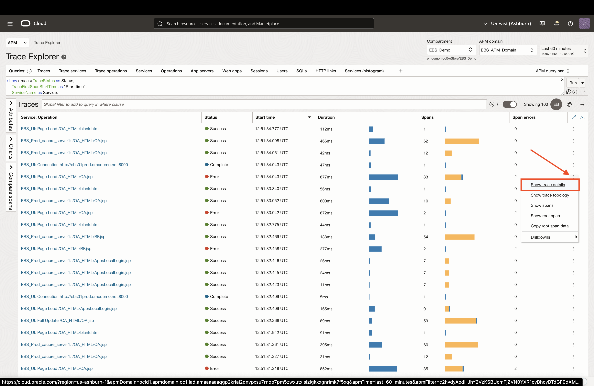

6. The Trace Details page provides a topology view of the calls made in that trace. Hover over the topology items and arrows to view metrics regarding services used and call duration.

      

7. Below the topology view, is a waterfall view of all the calls made within the trace (called spans). Scroll through the spans until you find the one which errored. Error spans have a red exclamation icon which identifies them. Click on the hyperlink for the erroring span.

      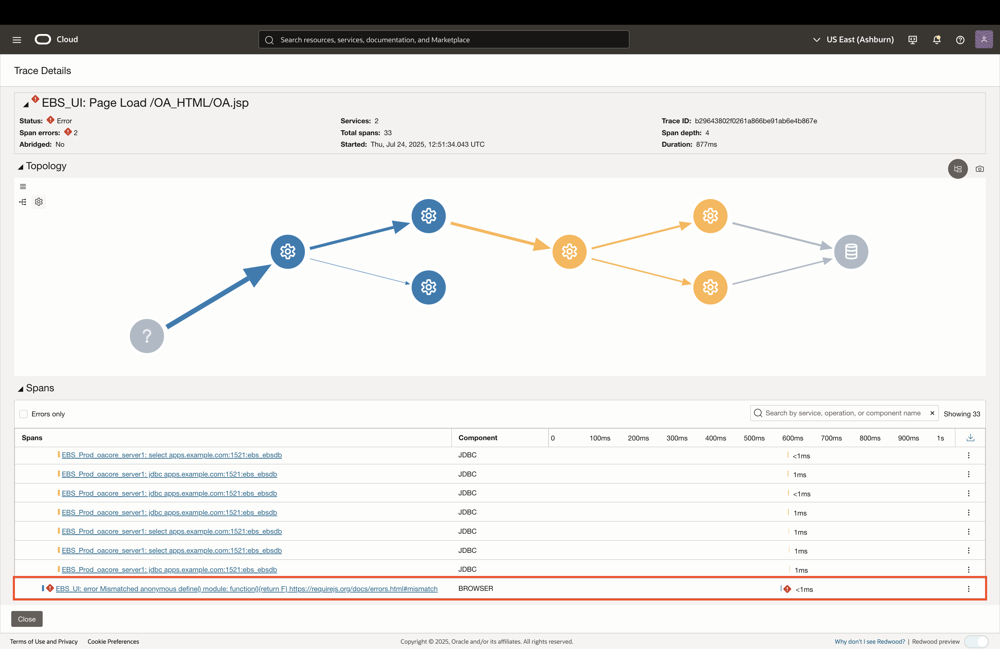

8. This opens the Span Details page, highlighting important attributes for that specific span. Scroll down the table until you see the **ErrorMessage** attribute, which shows more details about that error. 

      

9. Close the Span Details and Trace Details by clicking **Close** on the bottom-left. The Trace Explorer has multiple out-of-box queries that you can view at the top of the Trace Explorer. Click on the **Operations** query to see a view of traces grouped by the the operation performed in the EBS environment. Click on the count hyperlink to view all the spans for that specific operation.

      
      
      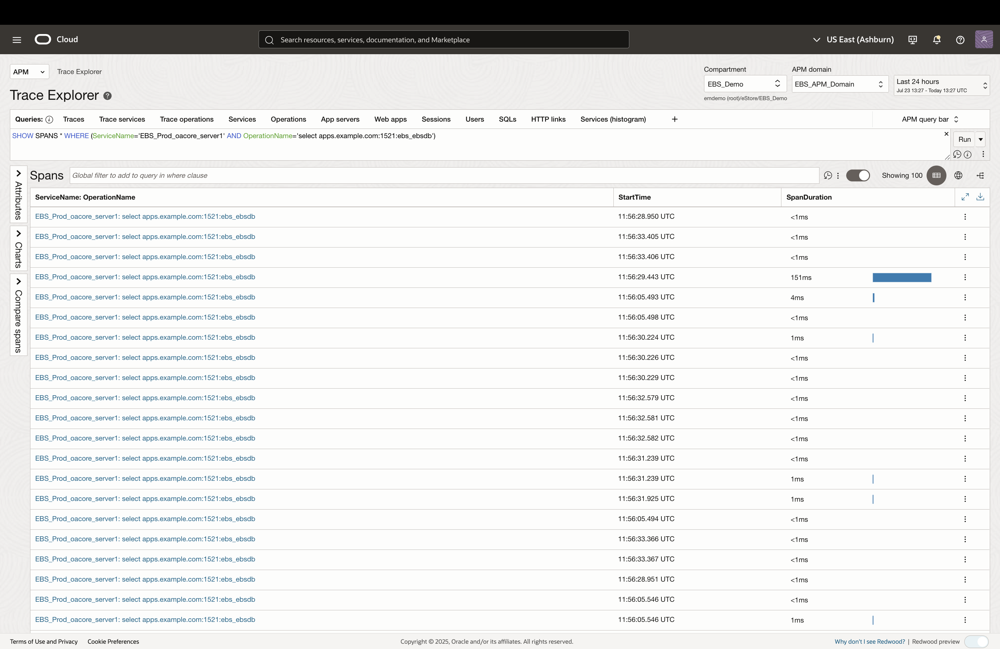

## Task 2: Understanding the End-User Experience

1. To view user session traces, click on the **User Sessions** query at the top of Trace Explorer. This will give a breakdown of traces, grouped by session.

      

2. To view a specific user session, click on **Traces** count hyperlink for any of the sessions row items. 

      

3. Navigate to the Real User Monitoring dashboard by clicking the navigation dropdown on the top-left of the screen, then select **Real User Monitoring**. 

      

4. This will display a dashboard of useful user session information. You can click on any of the hyperlinks in the widget to view relevant information in Trace Explorer. 

      

## Taks 3: Exploring EBS Forms Transactions

1. Click on the **Dashboards** link in the left pane to view APM dashboards.

      

2. In the Management Dashboard page, ensure the compartment is set to **EBS Demo** (emdemo -> eStore -> EBS_Demo), and click on the **EBS Forms View** Dashboard.

      

3. Once the dashboard loads, select the following filters in order to view the Forms data:

      * **Compartment**: EBS Demo (emdemo -> eStore -> EBS_Demo)
      * **APM Domain**: EBS APM Domain
      * **Time Filter**: Set to last 180 days. Open the time dropdown on the top-right, click on **Custom**, then set it to 180 days.

      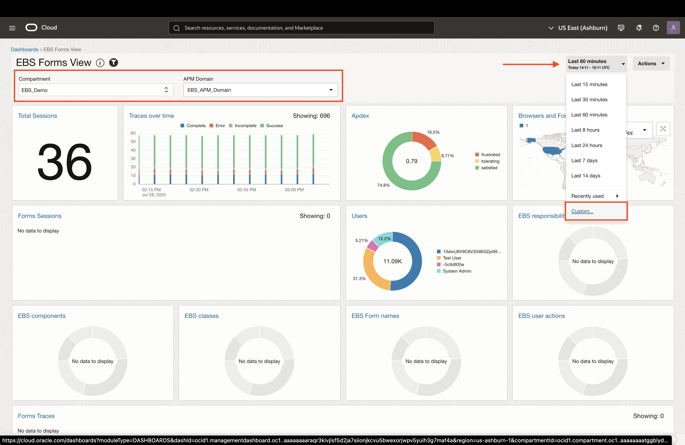
      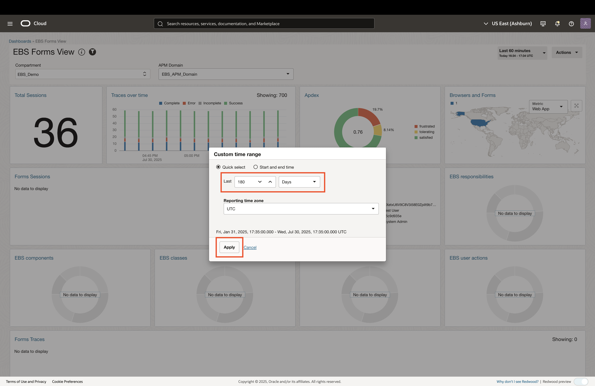

4. The EBS Forms dashboard should now display data in all the widgets. To view transactions (traces) for a particular Forms session, click on the drill-down icon to the right of the **Forms Sessions** row item.

      
      

5. Close the newly opened tab for viewing session traces. To view tansactions grouped by form name, click on the **EBS Form names** wigdet link. Once the grouped Form names load, click on the span count hyperlink to drill down into those transactions.

      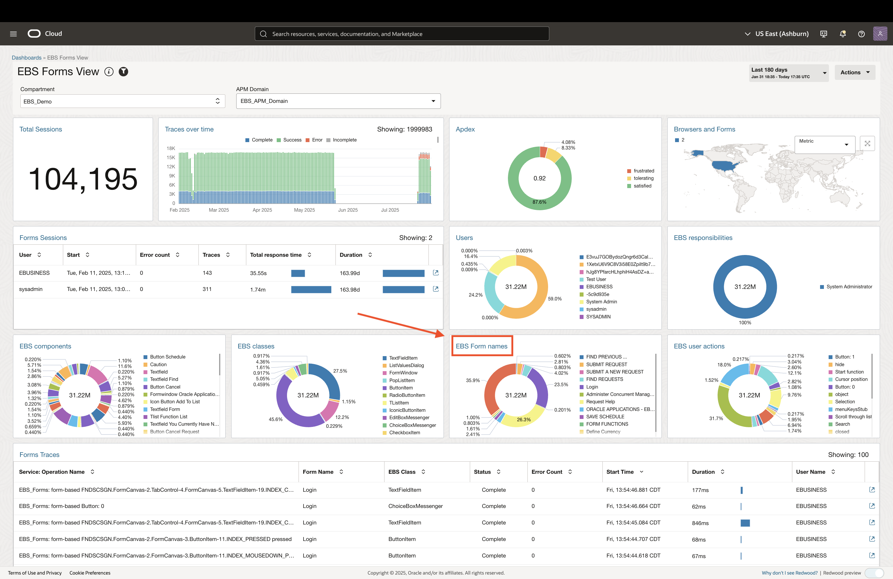
      

6. Select any of the spans to view more information. Notice all the EBS-specific attributes that are being collected in APM.

      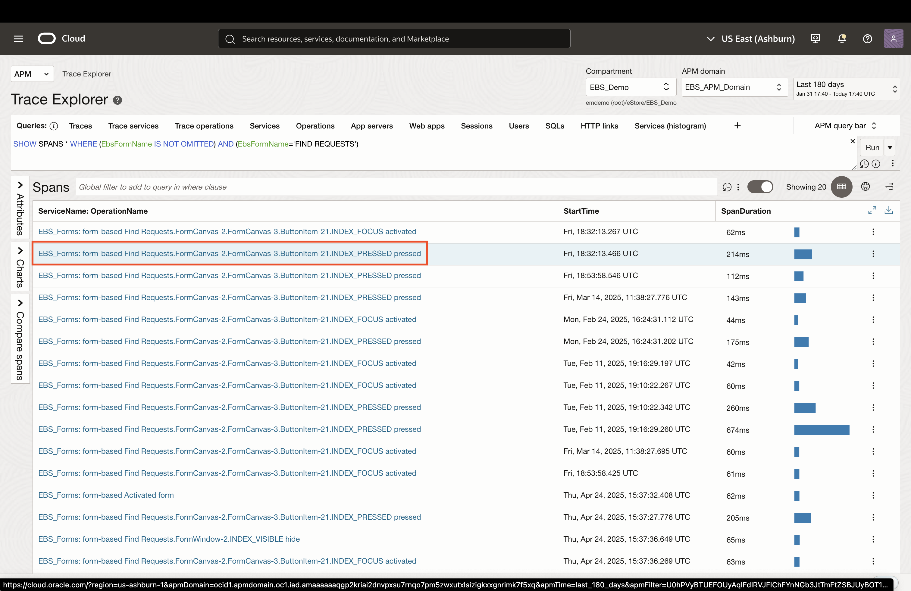
      

## Taks 4: Service Availability Monitoring

1. Close the Span Details page and use the APM navigation dropdown to navigate to the dashboard of synthetic tests (called monitors) in this EBS environment.

      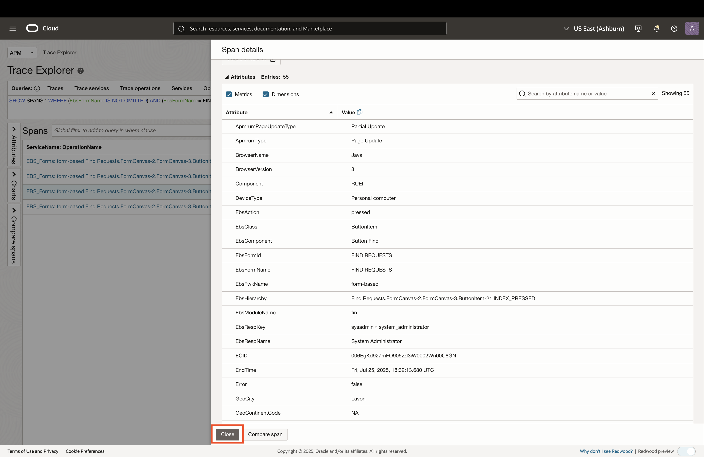
      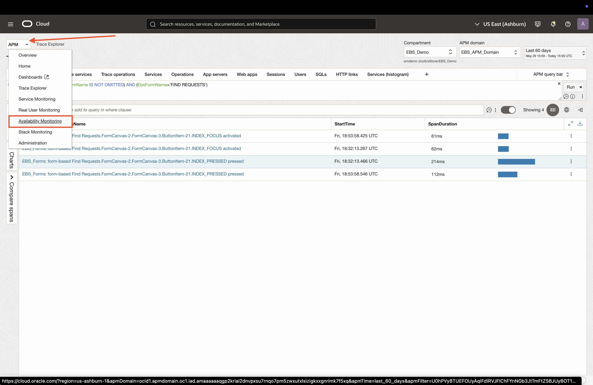

1. To view a specific monitor, click on the hyperlink in the Availability table. In this case, we will explore the **EBS-Login** monitor. 

      
      
2. The Monitor Details page provides an overview of the monitor setup along with a history of the test exetions that it ran. For each of the monitor executions in the history table, you can view important details such:

      * Traces for that specific execution
      * HTTP Archive (HAR) breakdown
      * Screenshots taken during the test
      * Network data

      

3. Click on **View Trace Details** to view the traces for the monitor execution.

      
      

4. Click on **View HAR** to open the HTTP Archive viewer for the monitor execution.

      
      

5. Click on **View Screenshots** to view the captured screenshots for the monitor execution.

      
      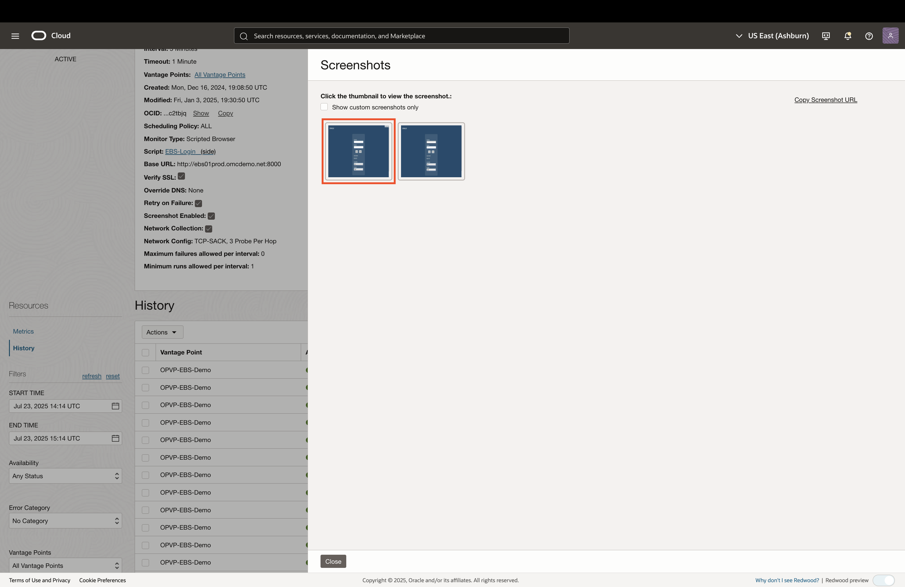

6. Click on **View Network Data** to view the network details for the monitor execution.

      
      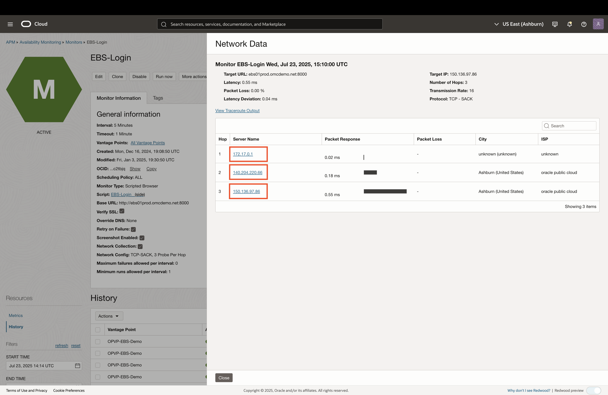

7. To view metrics for the monitor, click on **Metrics** in the left pane.

      

8. The metrics view provides important information such as availability, execution failures, latency, and more. Users are able to create alarms for those metrics to recieve proactive alerts and implement remediation steps.

      
      

## Acknowledgements

* **Author** - Zyaad Khader, Principal Member of Technical Staff
* **Contributors** - Zyaad Khader
* **Last Updated By/Date** - Zyaad Khader, July 2025