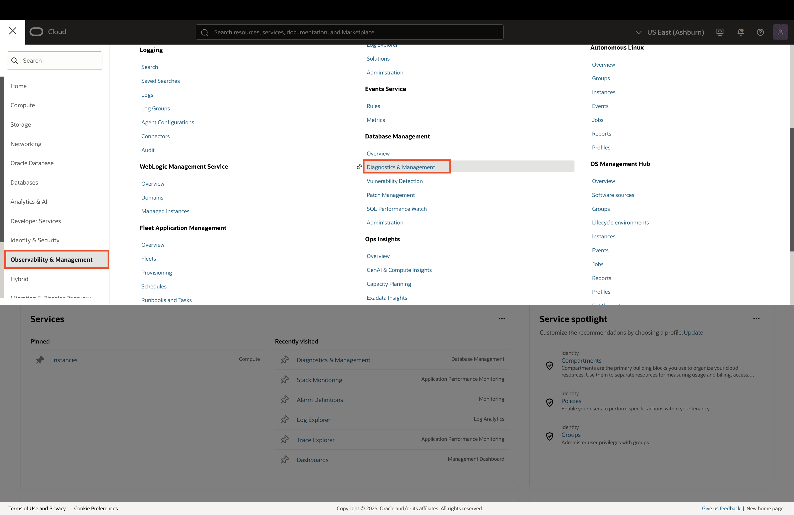
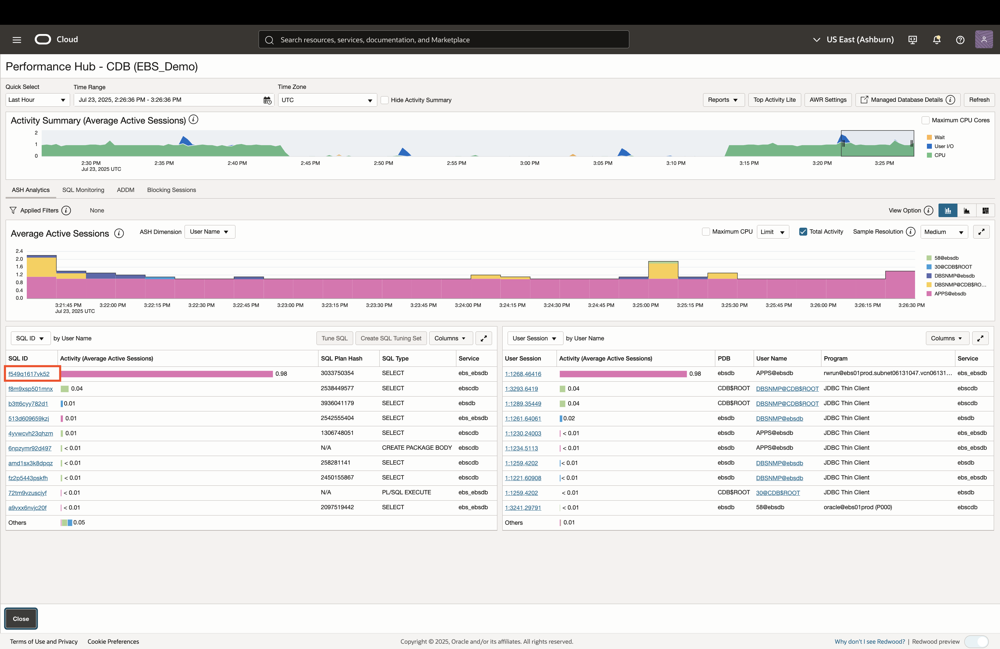
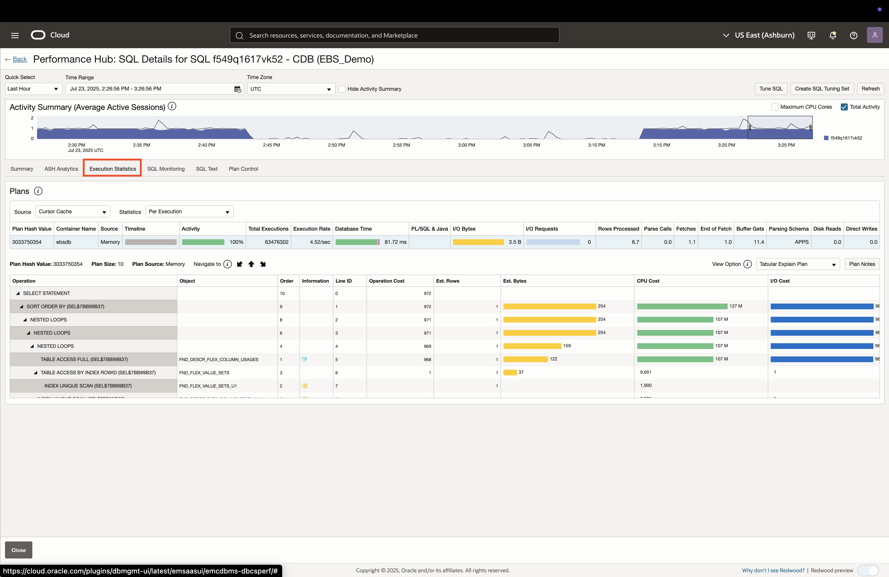
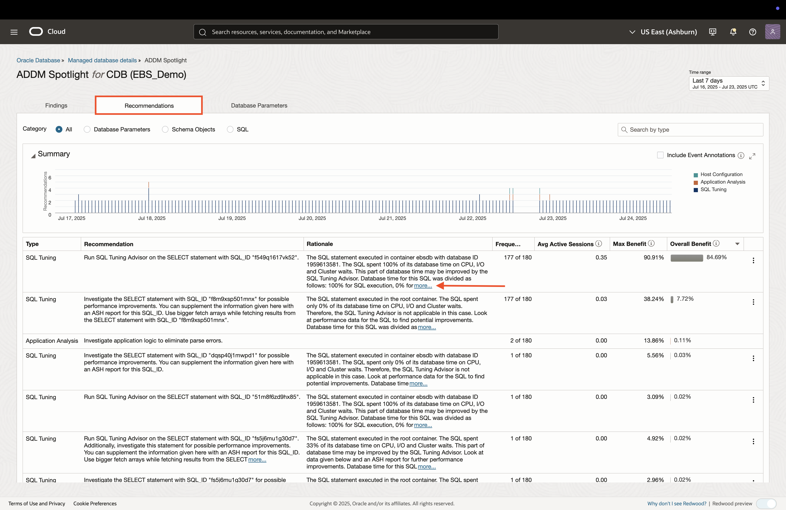

# Managing SQL and Database Performance

## Introduction
* In this lab, you will explore OCI Database Management for Oracle E-Business Suite (EBS) databases. Database Management offers a unified, cloud-native console for managing EBS databases (cloud and on-prem), delivering real-time diagnostics, workload insights, and automated tuning for optimal query performance.

### Objectives

* Analyze database sessions and SQL performance 
* Reveal database ineffeciencies and remediation recommendations
* Drill down from application traces to SQL performance

## Task 1: Database Overview

1. Click on the **Navigation Menu** in the upper left, navigate to **Observability & Management**, and select **Diagnostics & Management**. 

    

2. The **root** compartment is selected by default in the Compartment field. Set the compartment to **EBS Demo** (emdemo -> eStore -> EBS_Demo).

    

3. This is the Fleet Summary page, which provides an overview of the database fleet being monitored. Click on **CDB EBS Demo** to open the database details for the Container Database. 

    

4. The Database Details page provides a summary of the monitored database in addition to links for additional insights.

    

## Task 2: Analyzing SQL Performance

1. In the Database Details page, click on the **Performance Hub** button to analyze SQL performance.

    

2. The Performance Hub provides details on long-running SQL queries, database sessions and blocking sessions. Click on an SQL ID hyperlink to view more information.

    

3. An SQL Summary page is opened, which provides metrics and statistics for that specific SQL.

    

4. Navigate to the **Execution Statistics** tab to view a detailed breakdown of the SQL performance.

    

5. Click on **SQL Text** to reveal the SQL statement.

    

## Task 3: Viewing SQL Performance from Application Transactions

## Task 4: Insights into Database Performance

1. Click the **Close** button at the bottom of Performance Hub to return to the database details. 

    

2. In the Database Details page, click on the **ADDM Spotlight** button to view findings provided by the OCI Ops Insights service.

    

5. Adjust the time window to **7 days** and review any findings. You can also view recommendations by clicking the **Recommendations** tab on top.

    
    

6. Click the **Managed database details** breadcrum link on top to return to the database overview page. 
    

## Task 5: Analyzing Database Performance Trends

## Acknowledgements

* **Author** - Zyaad Khader, Principal Member of Technical Staff
* **Contributors** - Zyaad Khader
* **Last Updated By/Date** - Zyaad Khader, July 2025