# Managing SQL and Database Performance

## Introduction
* In this lab, you will explore OCI Database Management and OCI Ops Insights for Oracle E-Business Suite (EBS) databases. These services offer a offers a unified, cloud-native console for managing EBS databases (cloud and on-prem), delivering real-time diagnostics, workload insights, and automated tuning for optimal query performance.

### Objectives

* Analyze database sessions and SQL performance 
* Reveal database ineffeciencies and remediation recommendations
* Drill down from application traces to SQL performance

## Task 1: Database Overview

1. Click on the **Navigation Menu** in the upper left, navigate to **Observability & Management**, and select **Diagnostics & Management**. 

    

2. The **root** compartment is selected by default in the Compartment field. Set the compartment to **EBS Demo** (emdemo -> eStore -> EBS_Demo).

    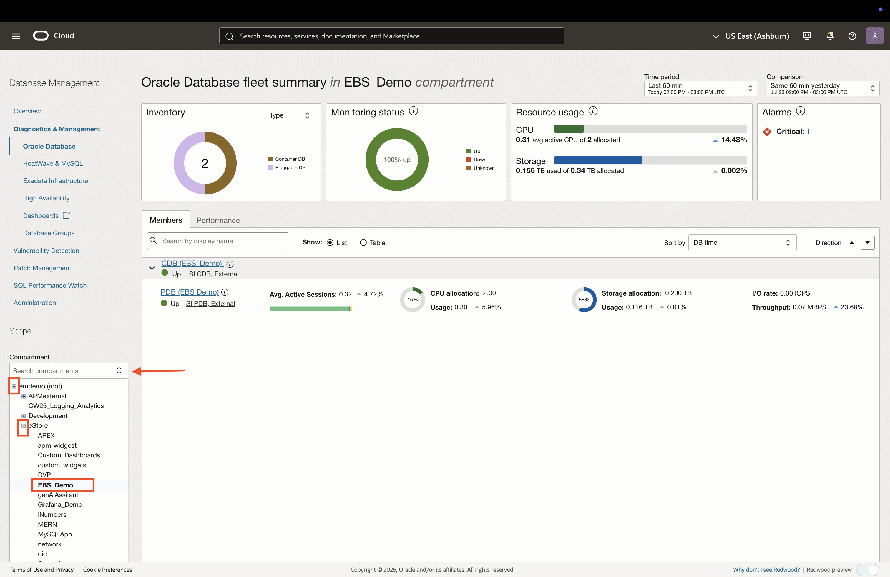

3. This is the Fleet Summary page, which provides an overview of the database fleet being monitored. Click on **CDB EBS Demo** to open the database details for the Container Database. 

    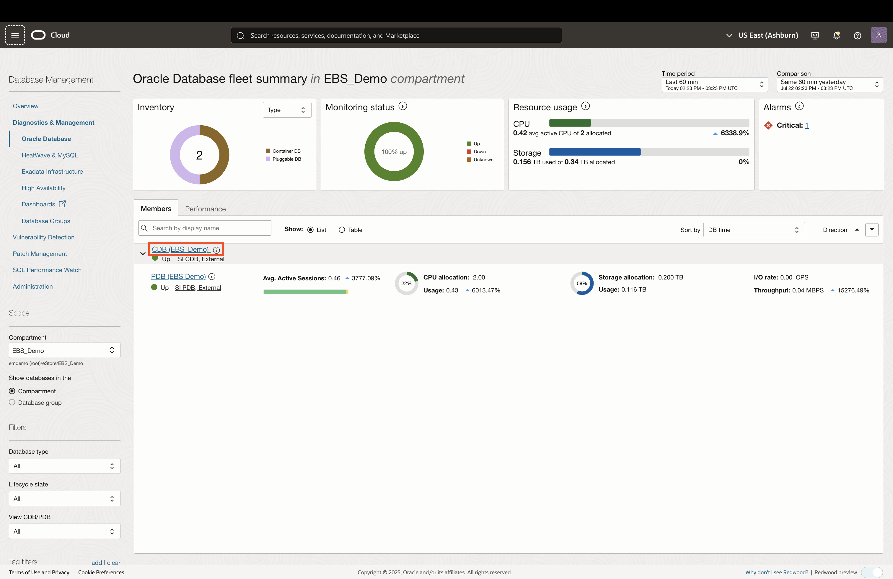

4. The Database Details page provides a summary of the monitored database in addition to links for additional insights.

    

## Task 2: Analyzing SQL Performance

1. In the Database Details page, click on the **Performance Hub** button to analyze SQL performance.

    

2. The Performance Hub provides details on long-running SQL queries, database sessions and blocking sessions. Click on an SQL ID hyperlink to view more information.

    

3. An SQL Summary page is opened, which provides metrics and statistics for that specific SQL.

    

4. Navigate to the **Execution Statistics** tab to view a detailed breakdown of the SQL performance.

    

5. Click on the **SQL Text** tab to reveal the SQL statement.

    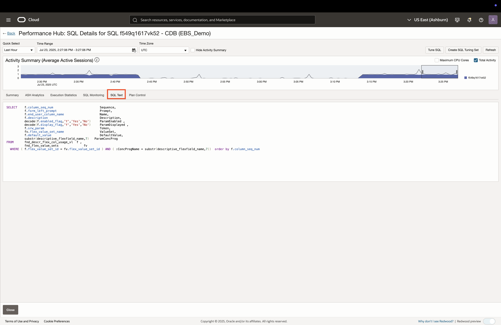

6. Click the **Close** button at the bottom of Performance Hub to return to the database details. 

    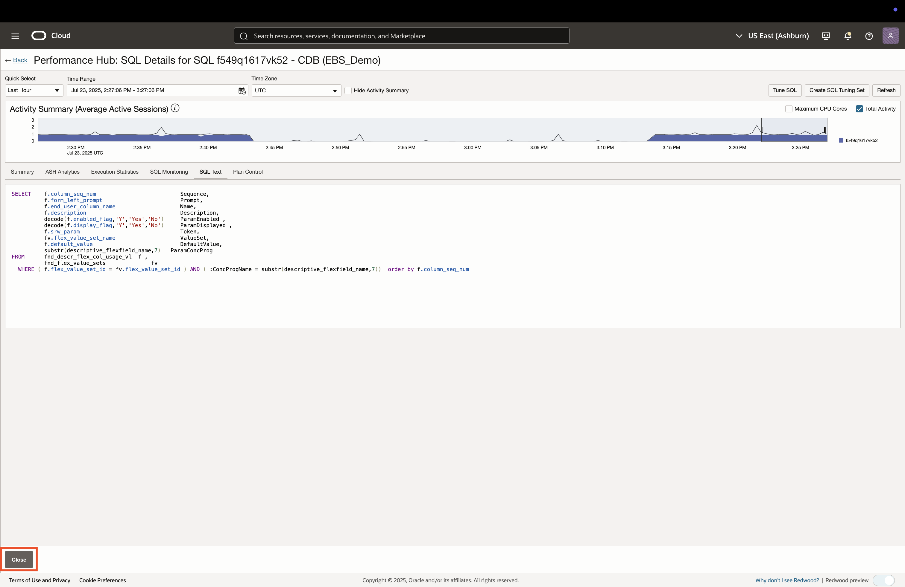

## Task 3: Viewing SQL Performance from Application Transactions

1. Use the **Navigation Menu** in the upper left, navigate to **Observability & Management**, and select **Trace Explorer**. For more information on Trace Explorer, please refer to the *Application Performance Management* lab.

    

2. Click the **SQLs** tab at the top of the Trace Explorer, then click on count hyperlink for the row item with the **1tgrzyv00tyy2** SQL ID. 

    

3. Click on the hyperlink of any of the spans, then click the button **SQL ID in DBM**. This will link to Performance Hub and filter by that specific SQL ID. 

    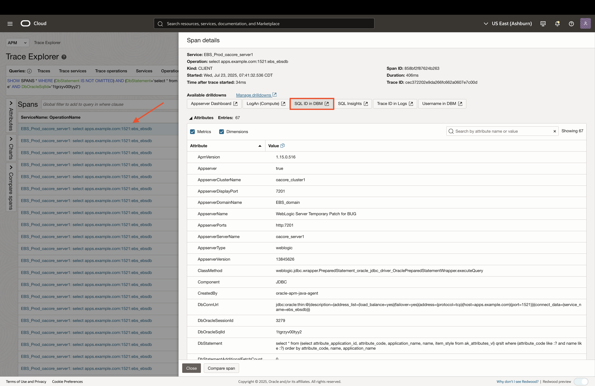

4. To view a user session that used this SQL ID, click on the hyperlink of any of the user sessions.

    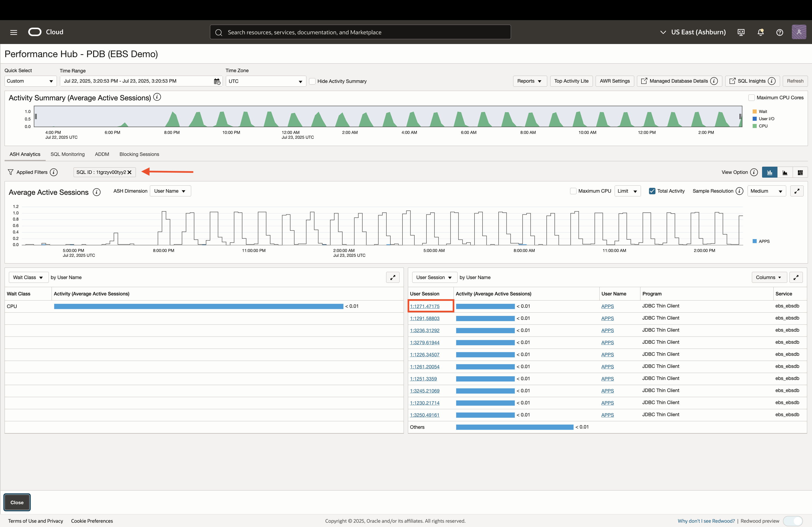

5. Click on ASH Analytics to select the SQL ID that you would like to further analyze.

    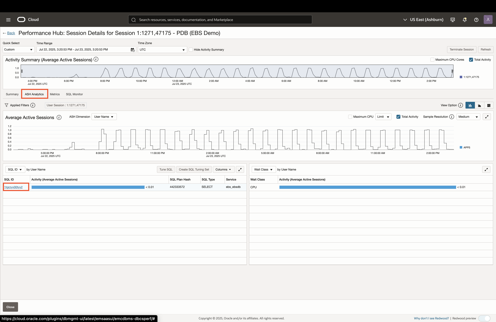

6. We follow the same flow here as we did in *Task 2*, starting with the SQL summary.

    

7. Navigate to the **Execution Statistics** tab to view a detailed breakdown of the SQL performance.

    

8. Click on the **SQL Text** tab to reveal the SQL statement.

    

9. Click the **Close** button at the bottom of Performance Hub to return to the database details. 

    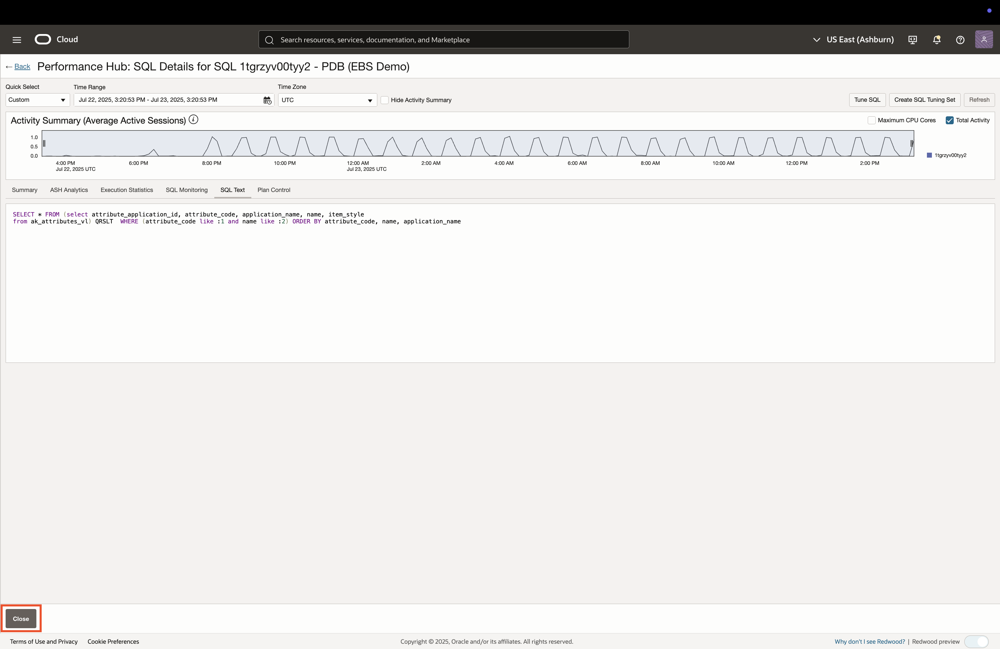

## Task 4: Insights into Database Performance

1. In the Database Details page, click on the **ADDM Spotlight** button to view findings provided by the OCI Ops Insights service.

    

2. Adjust the time window to **7 days** and review any findings. You can also view recommendations by clicking the **Recommendations** tab on top.

    
    

3. Click the **Managed database details** breadcrum link on top to return to the database overview page. 
    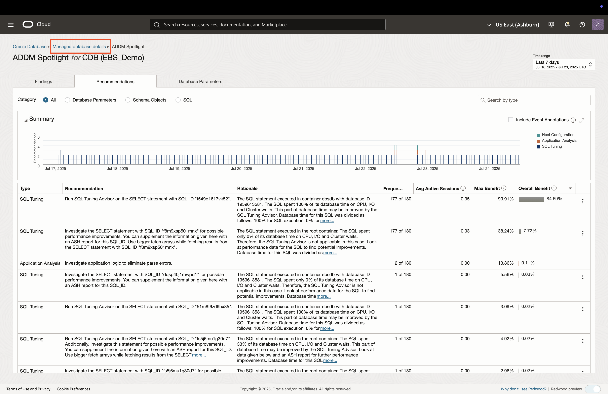

## Task 5: Analyzing Database Performance Trends

1. In the Database Details page, click on the **AWR Explorer** button to view database performance trends.

    

2. View the various sections of AWR Explorer:
    * ### Load Profile
    

    * ### Metrics
    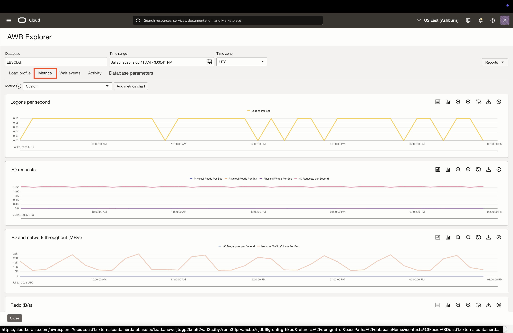

    * ### Wait Events
    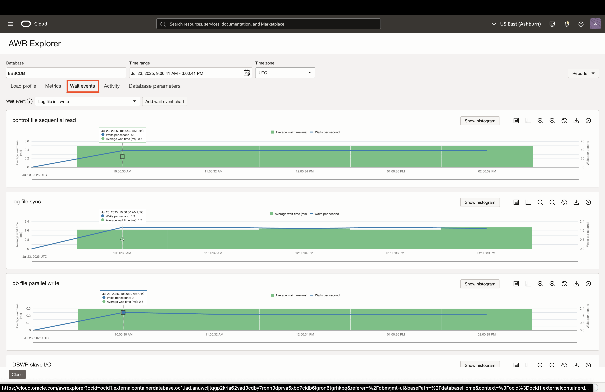

    * ### Activity
    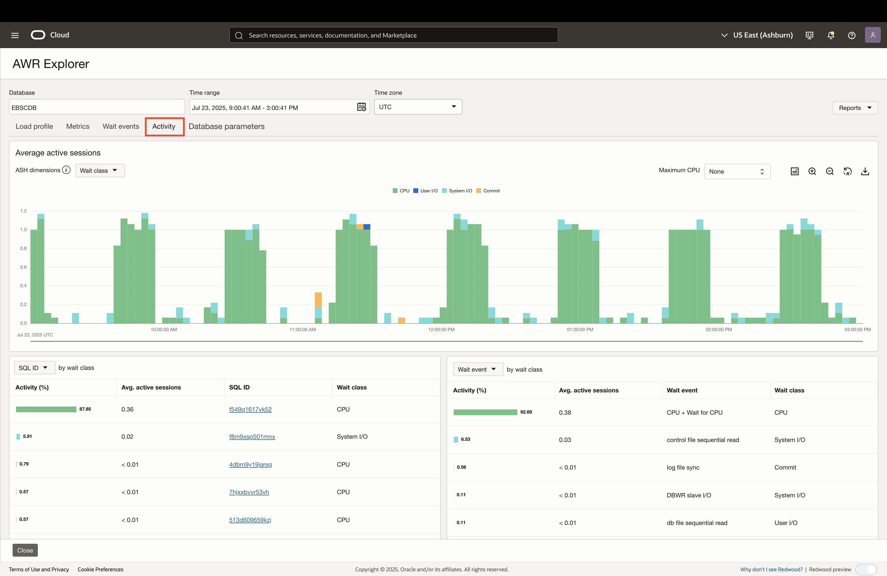

## Acknowledgements

* **Author** - Zyaad Khader, Principal Member of Technical Staff
* **Contributors** - Zyaad Khader
* **Last Updated By/Date** - Zyaad Khader, July 2025