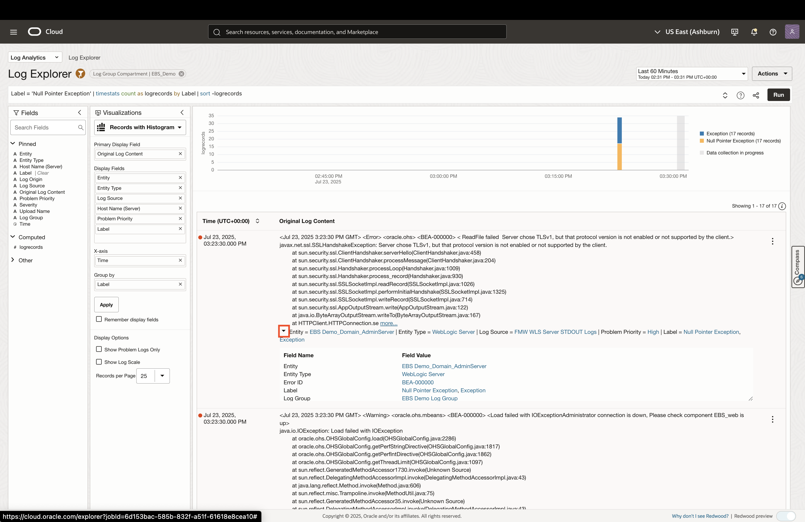
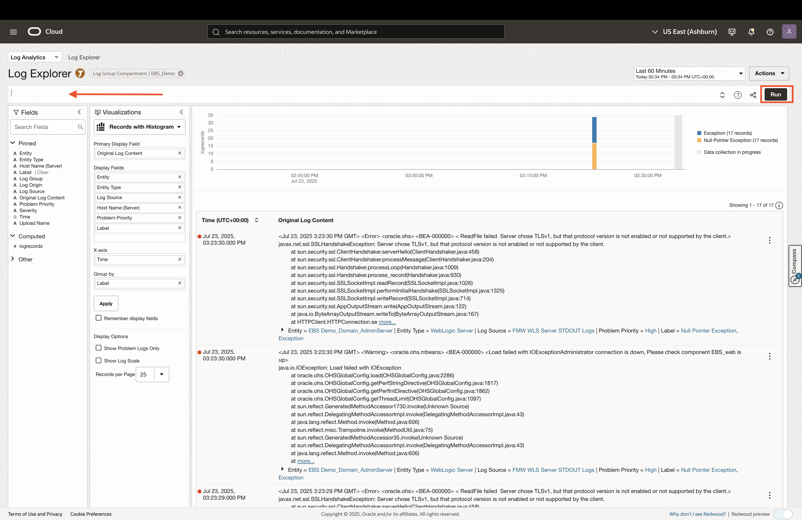
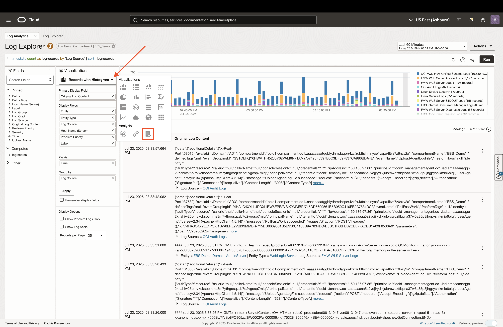
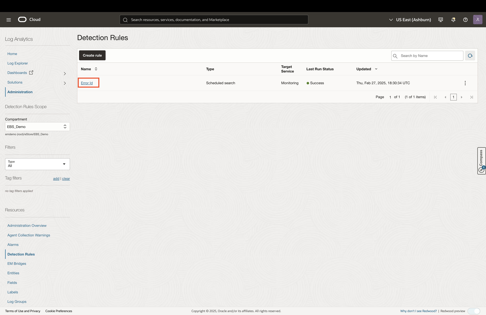
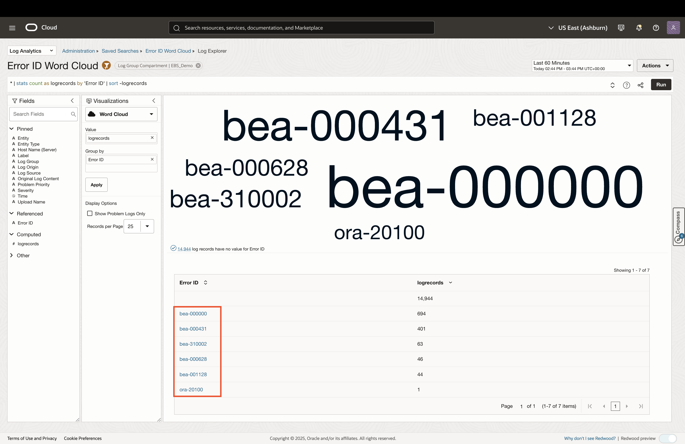
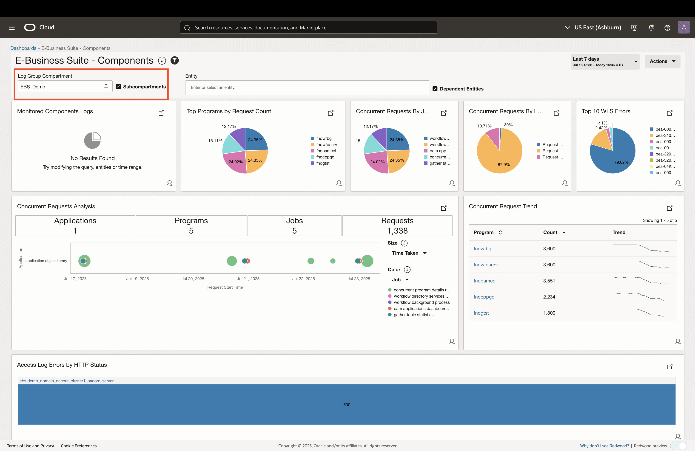

# Analyzing EBS Logs

## Introduction
* In this lab, you will explore OCI Log Analytics for Oracle E-Business Suite (EBS) logs. Log Analytics indexes, enriches, aggregates, and correlates logs from EBS application servers, middleware, and databases—providing ML-powered dashboards and detection for rapid troubleshooting and operational insights

### Objectives

* Visualize EBS log data
* View alarms that look for specific log data
* Review out-of-box dashboards for EBS logs

## Task 1: Visualizing EBS Log Data

1. Login to the Oracle Cloud Console and change the selected region to **US East (Ashburn)** region as shown. 

     

2. Click on the **Navigation Menu** in the upper left, navigate to **Observability & Management**, and select **Log Explorer** (under the Log Analytics section). 

    

3. The **root** compartment is selected by default in the Compartment field. Click on the filter icon, set the compartment to **EBS Demo** (emdemo -> eStore -> EBS_Demo), and click **Apply**.

    

4. The Log Explorer allows users to query and visualize log data from various sources. By default, logs will be grouped by source in a pie chart visualization. To explore other visualizations, click the dropdown under the **Visualizations** section to the left. Click on the **Word Cloud** visualizaiton. 

    

5. This will visualize log data as a word cloud, grouped by log source. We can substitute log source with error labels. To do this, remove **Log Source** from the **Group by** input, then drag and drop the **Label** field to the **Group by** input.

    

6. To look into a specific error label, click on the link of that error in the table, then click **Drill down**. You can do this with any of the errors that show up.

    

7. This will provide a table of log records for that specific error. You can expand the log records to view more information.

    
    

8. To try out one of the ML-based visualization, clear out the query on top, and click apply. Now, click on the visualizations and select the **Issues** visualization

    
    

9. Change the time window to **7 Days**. The Issues visualization will go through all the log records and find the following from all the collected log records:

    * Newly surfaced issues
    * Outlier log entries
    * Clusters of log regords
    * Problem sources

    
    

10. Click on the count hyperlink for one of the highlighted issues to drill-down further. This will tak you to the relevant log records.

    
    

## Task 2: Automatically Detecting Error Logs

1. Navigate to the Detection Rule in Log Analytics by clicking the navigation dropdown on the top-left, then click **Administration**. In the Administration page, click on the number hyperlink under **Detection Rules**.

    
    

2. Click the **Error Id** link to open the detection rule details.

    
    

3. To view the metric history of this detection rule, click on the **View In Metric Explorer** button. This will open a new tab in OCI Monitoring's Metric Explorer. Once the metric chart loads, change the time window to last 30 days. 

    
    
    

4. Return to the detection rule tab and click on the **Error ID Word Cloud** hyperlink to view the search query used for the detection rule. 

    

5. You can view the log records retrieved from the search query by clicking the **View In Log Explorer** button.

    
    

*Note:* Alarms can be set up on detection rules to notify users when detection reaches a defined threshold

## Task 3: EBS Log Dashboards

1. Navigate to the Detection Rule in Log Analytics by clicking the navigation dropdown on the top-left, then click **Administration**. In the Administration page, click on the number hyperlink under **Detection Rules**.

    
    

2. Explore the following EBS dashboards by clicking on their links:

    #### E-Business Suite Infra & Tech Stack
    

    #### E-Business Suite - Components
    
    

## Acknowledgements

* **Author** - Zyaad Khader, Principal Member of Technical Staff
* **Contributors** - Zyaad Khader
* **Last Updated By/Date** - Zyaad Khader, July 2025