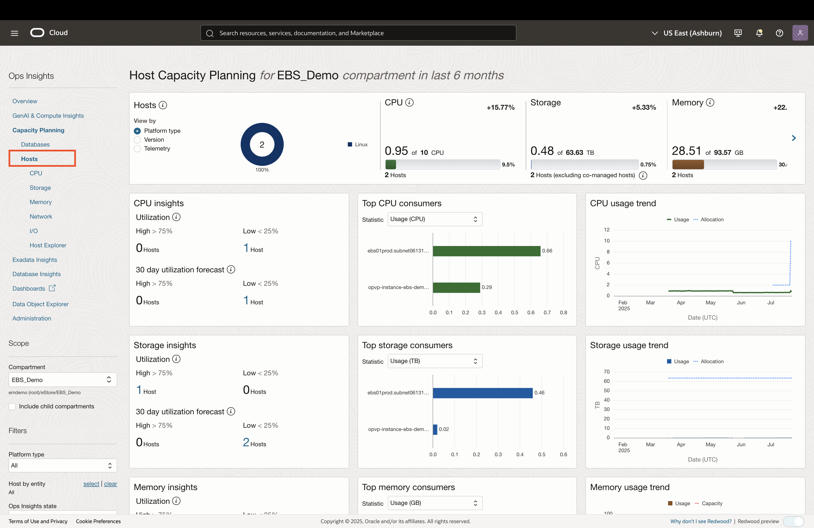
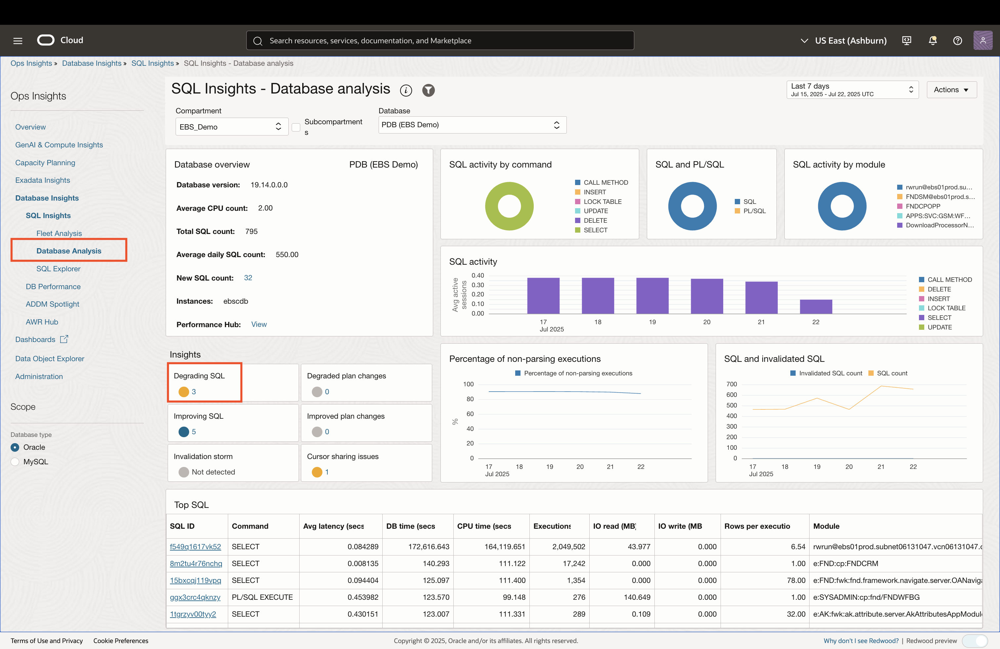
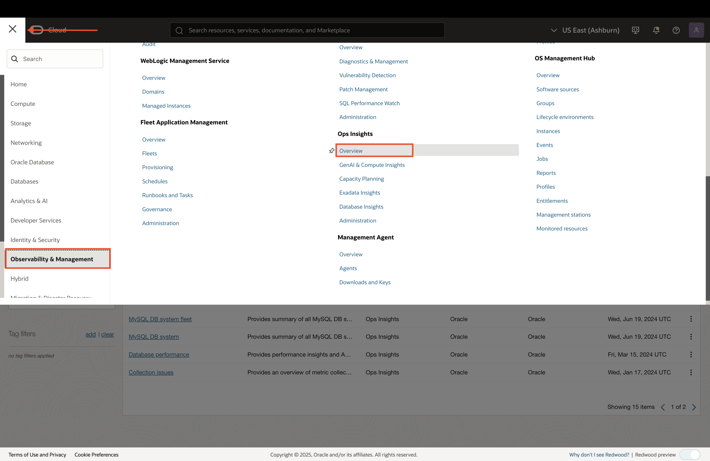
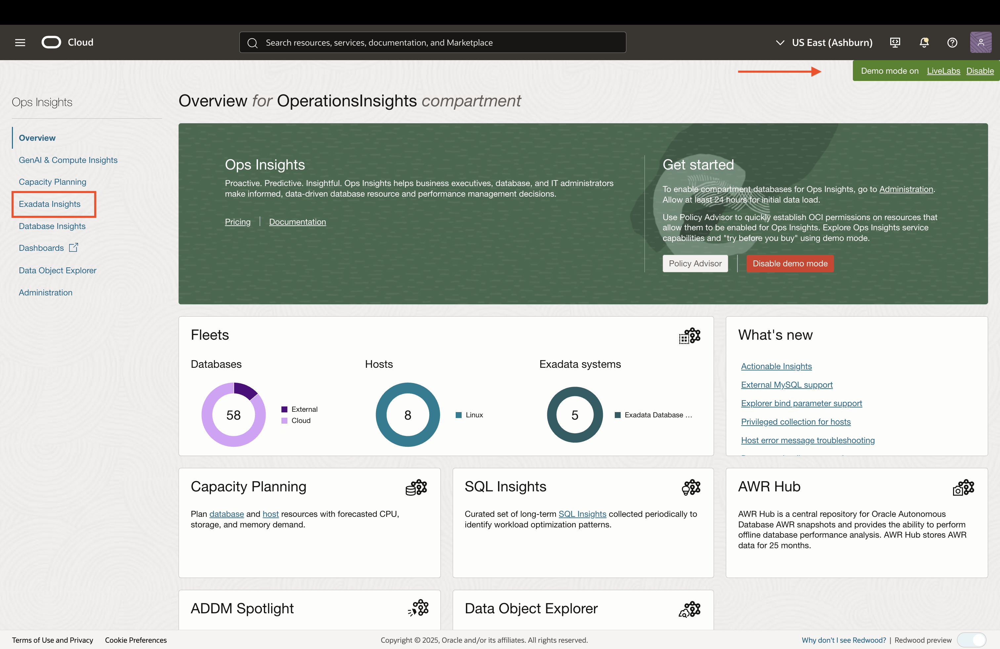

# Capacity Planning for EBS Resources

## Introduction
* In this lab, you will explore OCI Ops Insights for Oracle E-Business Suite (EBS) resources. Ops Insights delivers capacity planning and resource utilization insights for EBS infrastructure using ML-driven analytics and host/database telemetry—helping you forecast growth, identify hotspots, and optimize deployments

### Objectives

* Analyze host and database capacity trends
* Gain insights into historical SQL performance
* View resource utilization though out-of-box dashboards

## Task 1: Database and Host Resource Planning

1. Login to the Oracle Cloud Console and change the selected region to **US East (Ashburn)** region as shown. 

     

2. Click on the **Navigation Menu** in the upper left, navigate to **Observability & Management**, and select **Capacity Planning** (under the Ops Insights section). 

    

    **Note:** You can also navigate to Capacity Planning from OCI Database Management, as discussed at the end of the *Managing SQL and Database Performance* lab.

    

3. The **root** compartment is selected by default in the Compartment field. Click on the filter icon, set the compartment to **EBS Demo** (emdemo -> eStore -> EBS_Demo), and click **Apply**.

    

4. The Capacity planning page provides a snapshot of resource utlization for databases and hosts (databases are selected by default). To view specific utilization trends and forecasts, click on any of the sub-categories (CPU, Storage, Memory, I/O). In this example, we will look at CPU.

    

5. Click on **CPU** to view a trend and forecast chart based on historical utilization data. Change the period to **Last 6 months** on the left to see longer-term trends. 

    
    

    *Note:* for seasonal resource utilization, you can click the **Seasonality aware** radio button at the top of the chart. Since this is a demo environment, there won't be much change based on seasonality. 

6. You can perform the same analysis and forecasting on hosts. Click the **Hosts** link on the left pane to veiw capacity for hosts. You can explore CPU, Storage, Memory, I/O forecasting by clicking any of them below the Hosts link.

    

## Task 2: EBS SQL Perfromance Tuning

1. To view SQL performance insights for the entire database fleet, click on the **Fleet Analysis** on the left pane. This demo environment only has 1 database, so this view would become more powerful with multiple databases.

    

2. To view a more detailed analysis of SQL performance for a specific database, click on the **Database Analysis** link on the left pane. This page provides valuable information regarding SQL activity, insights into SQL performance. We can take a look at the SQLs which are degrading over time by click on the number hyperlink under **Degrading SQL**.

    

3. Click on an SQL ID to view perfromance trends and statatistics in the SQL Insights page.
    

## Task 4: Dashboards for EBS Resource Capacity

1. Ops Insights provides out-of-box dashboards to visualize database performance trends, capacity, and insights. We will take a look at the Capacity Dashbord, as an example. Click on the **Dashboards** link on the left pane. Once you see the list of dashboards, you can search for and click on **OPSI capacity dashboard**. Ensure that the correct compartment is set (emdemo -> eStore -> EBS_Demo). 

    
    

2. You can explore other Ops Insights demo dashboards by searching for **Demo** in the Management Dashboards page - *Optional*

    

    #### Database Performance Dashboard

    

    #### Configuration Dashboard

    

## Task 5: Capacity Planning for Exadata (Optional)

1. Ops Insights provides visibility into capacity for shared Exadata systems either in OCI or monitored by Enterprise Manager. Since our EBS Demo environment is not set up with Exadata, we can activate the Ops Insights **Demo Mode** to view what this would look like. Click on the **Navigation Menu** in the upper left, navigate to **Observability & Management**, and select **Overview** (under the Ops Insights section). 

    

2. Click on **Enable demo mode**. Notice how the top-right shows a green bar that indicates demo mode is active. Next, click on **Exadata Insights** on the left pane.

    
    

3. In the Exadata Insights page, you will find the utilization and forecast for all Exadata System. Lets drill down into one of the Exadata systems by clicking on its link.

    

4. The Exadata System Details page provides key metrics for the system's CPU, memory, IOPS, and storage, along with a forecast of when the metrics will reach high utilizations. Let's drill down into specific databases and view their capacity trends. Click on the **Metrics by database** link on the left pane.

    

5. Here, we can see the CPU capacity trends and forecasts for all the databases. To view the capacity of a specific database, click on the database's box on top. 

    

6. Similarly, we can look at storage, memory, and I/O trends.

    

7. We can also drill down into specific hosts to view their capacity trends. Click on the **Metrics by host** link on the left pane.

    

8. To view Storage, IOPS, and throughput details for an Exadata storage server, click on **Exadata storage server**.

    

9. Disable Demo Mode by clicking on the **Disable** link on the top-right.

    

## Acknowledgements

* **Author** - Zyaad Khader, Principal Member of Technical Staff
* **Contributors** - Zyaad Khader
* **Last Updated By/Date** - Zyaad Khader, July 2025