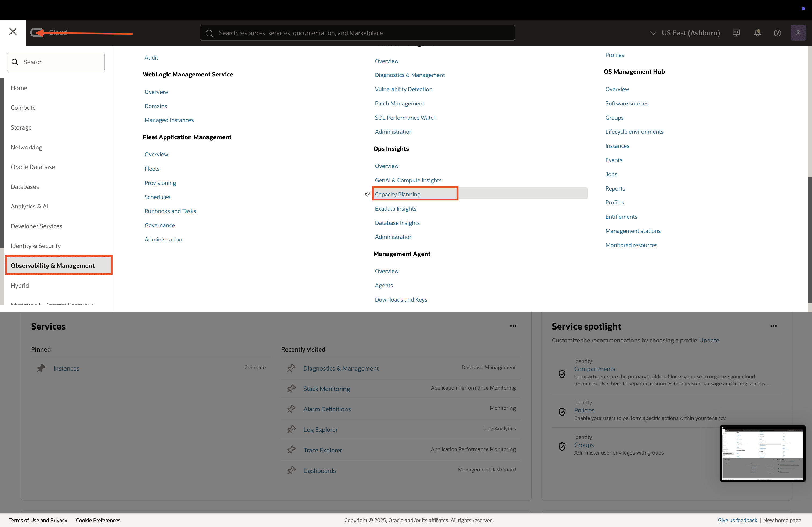
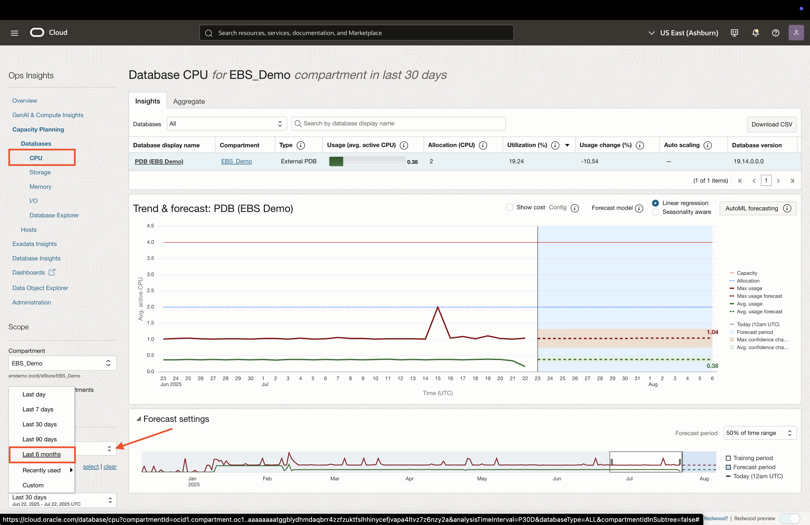
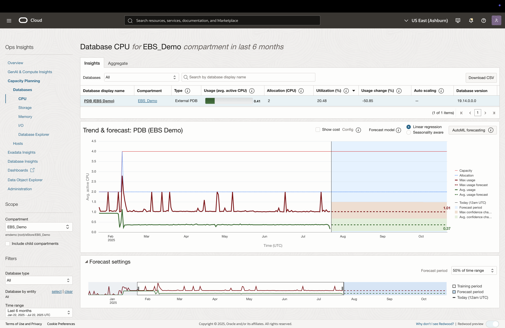
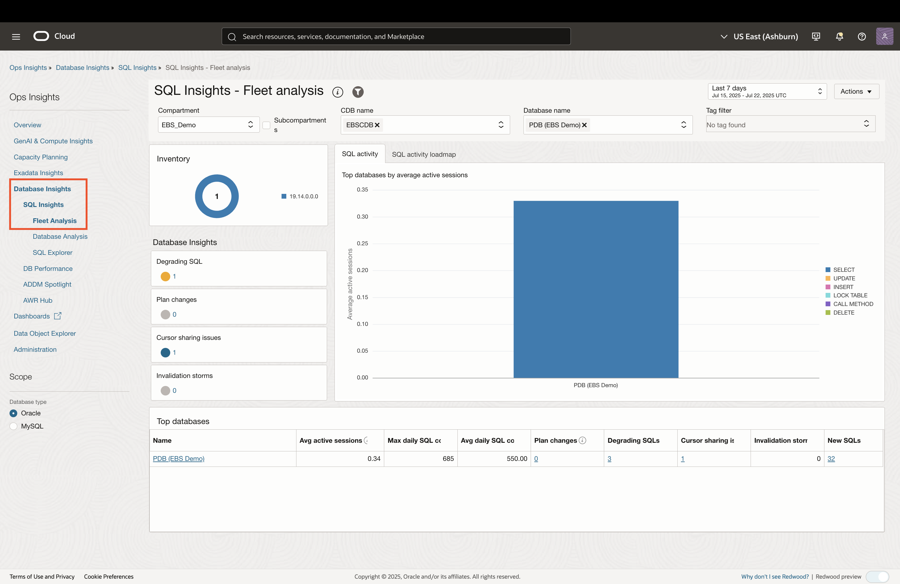
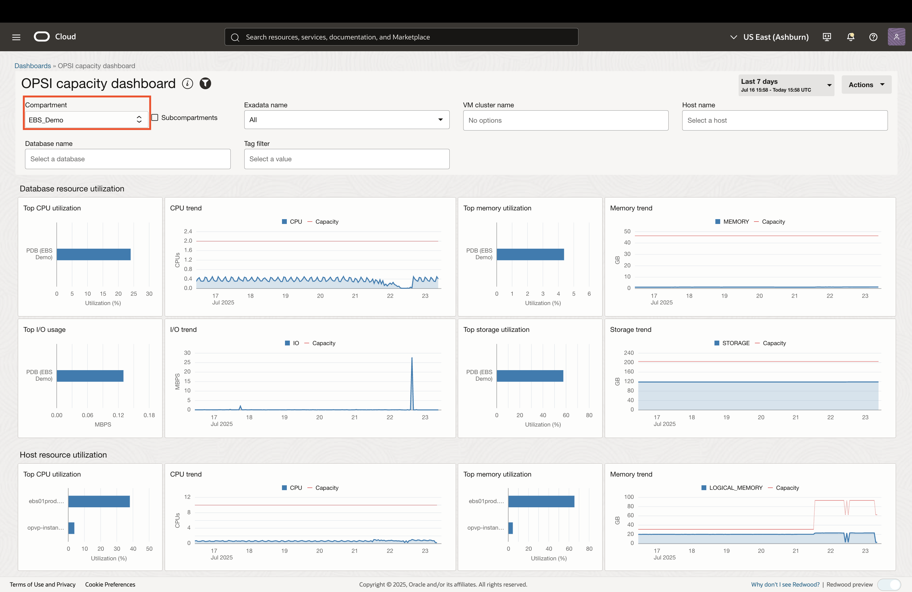

# Capacity Planning for EBS Resources

## Introduction
* In this lab, you will explore OCI Ops Insights for Oracle E-Business Suite (EBS) resources. Ops Insights delivers capacity planning and resource utilization insights for EBS infrastructure using ML-driven analytics and host/database telemetry—helping you forecast growth, identify hotspots, and optimize deployments

### Objectives

* Analyze host and database capacity trends
* Gain insights into historical SQL performance
* View resource utilization though out-of-box dashboards

## Task 1: Database and Host Resource Planning

1. Click on the **Navigation Menu** in the upper left, navigate to **Observability & Management**, and select **Capacity Planning** (under the Ops Insights section). 

    

2. The **root** compartment is selected by default in the Compartment field. Click on the filter icon, set the compartment to **EBS Demo** (emdemo -> eStore -> EBS_Demo), and click **Apply**.

    

3. The Capacity planning page provides a snapshot of resource utlization for databases and hosts (databases are selected by default). To view specific utilization trends and forecasts, click on any of the sub-categories (CPU, Storage, Memory, I/O). In this example, we will look at CPU.

    

3. This provides a trend and forecast chart based on historical utilization data. Change the period to **Last 6 months** on the left to see longer-term trends. 

    
    

    *Note:* for seasonal resource utilization, you can click the **Seasonality aware** radio button at the top of the chart. Since this is a demo environment, there won't be much change based on seasonality. 

4. You can perform the same analysis and forecasting on hosts. Click the **Hosts** link on the left pane to veiw capacity for hosts.

    

## Task 2: EBS SQL Perfromance Tuning

1. To view details about the database fleet, click on the **Fleet Analysis** on the left pane.

    

2. To view a more detailed analysis of SQL performance, click on the **Database Analysis** link on the left pane.

    

3. This page provides valuable information regarding SQL activity, as well as valuable insights. Click on the number hyperlink under **Degrading SQL**.

    

## Task 3: EBS Capacity Forecasting Dashboards

1. To view the Capacity Dashbord, click on the **Dashboards** link on the left pane. Once you see the list of dashboards, you can search for and click on **OPSI capacity dashboard**.

    
    

2. You can explore other Ops Insights demo dashboards by searching for **Demo** in the Management Dashboards page (Optional)

    

## Acknowledgements

* **Author** - Zyaad Khader, Principal Member of Technical Staff
* **Contributors** - Zyaad Khader
* **Last Updated By/Date** - Zyaad Khader, July 2025