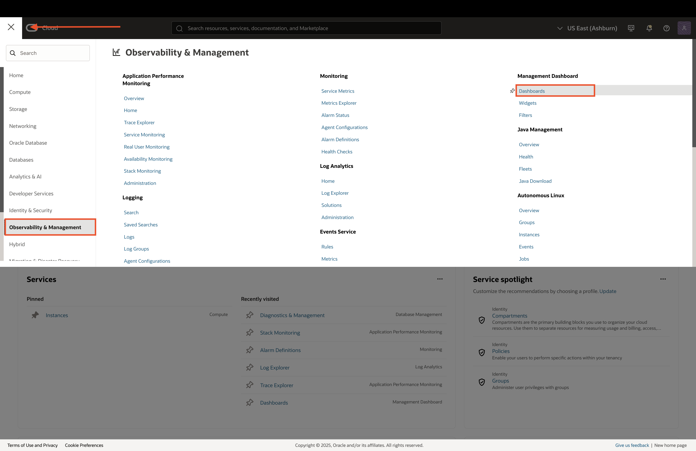
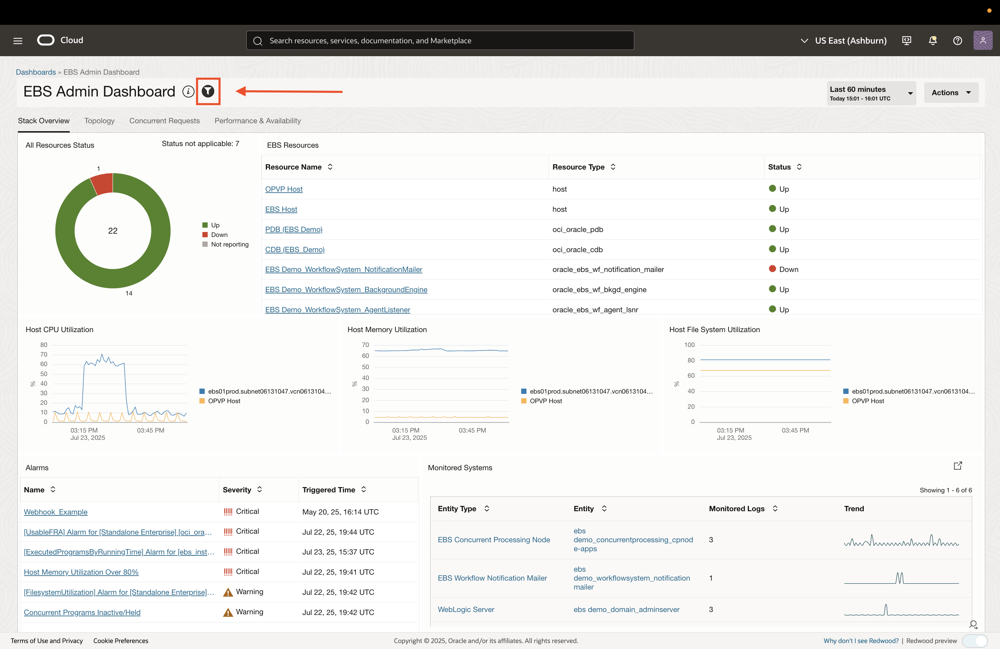
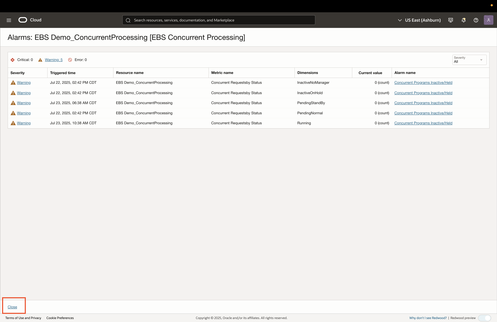
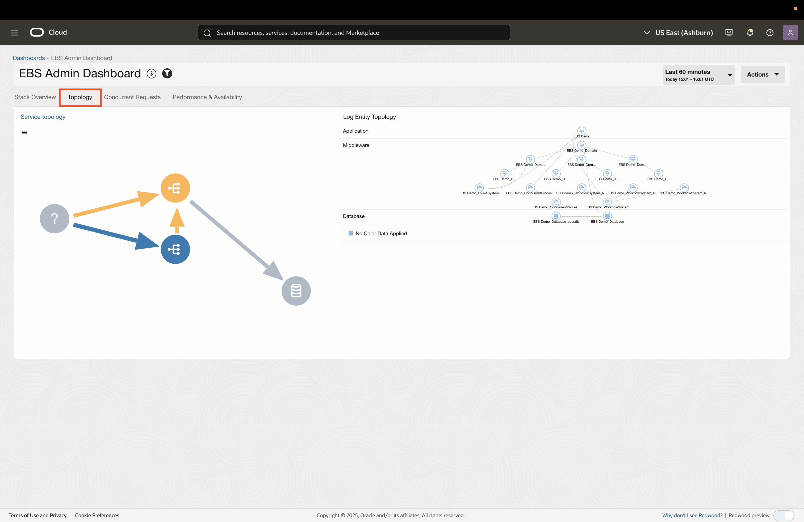
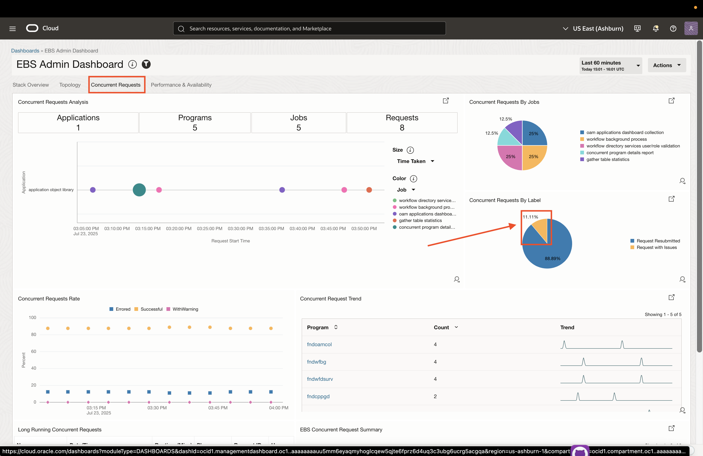
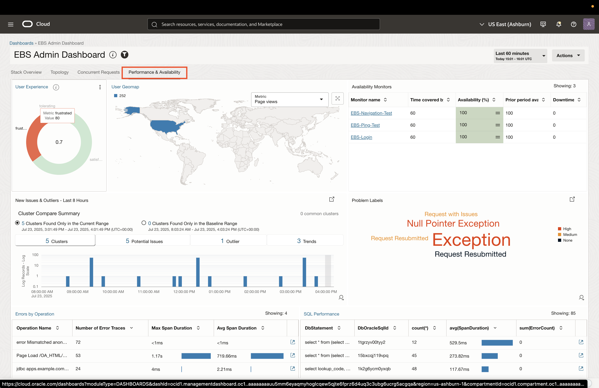
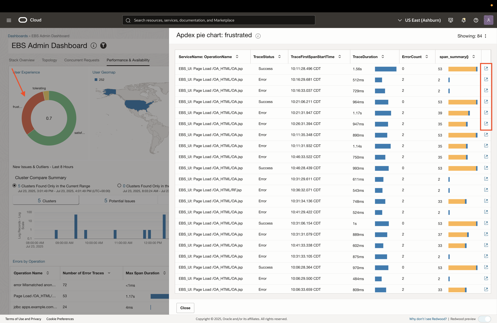

# EBS Admin Dashboard

## Introduction
* In this lab, you will explore custom OCI Management Dashboards for Oracle E-Business Suite (EBS). Management Dashboards allow users to combine trace, log, and metric data into a single pane-of-glass, providing quick and powerful insights into all the components of an EBS environment.  

### Objectives

* Visualize how trace, log, and metric data can be combined into a single dashboard.

## Task 1: View EBS Metrics, Traces, and Logs in a Dashboard

1. Login to the Oracle Cloud Console and change the selected region to **US East (Ashburn)** region as shown. 

     

2. Click on the **Navigation Menu** in the upper left, navigate to **Observability & Management**, and select **Dashboards** (under the Management Dashboards section). 

    

3. The **root** compartment is selected by default in the Compartment field. Set the compartment to **EBS Demo** (emdemo -> eStore -> EBS_Demo).

    

4. Click on the **EBS Admin Dashboard** and ensure all the filters match the following:

    * **Compartment:** EBS Demo (emdemo -> eStore -> EBS_Demo)
    * **APM domain:** EBS APM Domain
    * **Web application:** All web applications
    * **Topology entity:** EBS Demo
    * **Log group compartment:** EBS Demo (emdemo -> eStore -> EBS_Demo)
    * **Database:** PDB (EBS Demo)

    

5. Collapse the filters by clicking the filter icon. This dashboard has 4 sections highlighted as tabs at the top. There are various hyperlinks availble in the dashboard that drill down into different observability services in OCI. The first sections shows an EBS Stack Overview. 

    

6. To view details on a given EBS resource, click on a link in the **EBS Resources**. In this case, we will *right click* and open a new tab for  **EBS Demo ConcurrentProcessing**. This will take us to the resource details page where we can view metrics, alarms, and topology for the resource.

    
    

7. Similar to the *Visibility into the EBS Stack* lab, we will view additional resource details. Scroll to view resource metrics
    

8. To view the alarms that are triggered by this resource, click **Alarms** on the left pane.
    
    

9. A topology view is also available for each resource and can be accessed by clicking **Topology** on the left pane.
    

10. Return to the Dashboard browser tab and click on the **Topology** tab at the top of the dashboard. Here you will find a breakdown of topology based on the collected traces (left) and the fully discovered EBS resource topology (right).

    

11. Click on the **Concurrent Requests** tab at the top of the dashboard. This will show multiple widgets which analyze concurrent request logs and metrics. We can drill down into the log data for problematic concurrent requests by clicking the **Requests with Issues** portion of the pie chart called Concurrent Requests by Label. 

    

12. This will open a new tab which will show the problematic concurrent request log records

    

13. Return to the Dashboard browser tab and scroll to the bottom of the screen in the **Concurrent Requests** tab of the dashboard. At the bottom-left, you will see the **Long Running Concurrent Requests**. This is the custom metric we viewed in the *Visibility into the EBS Stack* lab, which collects data on long-running concurrent requests from the database. It has links in each row item that can take you to log records or database sessions for further analysis.

    

14. Click on the **Performance & Availability** tab at the top of the dashboard. This view shows application transactions, end-user experience, and service availability monitors. Click on the **Frustrated** portion of the Apdex widget. 

    
    

15. Scroll down to the EBS calls (spans) tables. We can go directly to spans in OCI Application Performance Monitoring from here. In this case we will click on one of the row item is the **Errors by Operation** table.

    
    

## Acknowledgements

* **Author** - Zyaad Khader, Principal Member of Technical Staff
* **Contributors** - Zyaad Khader
* **Last Updated By/Date** - Zyaad Khader, July 2025