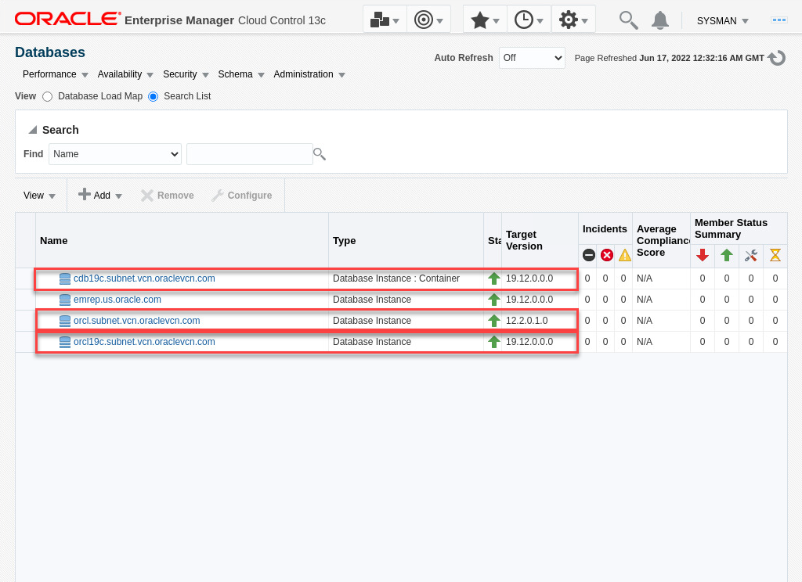

# Migration Workbench - On-Premises Destinations

## Introduction

You can use the database migration workbench to migrate your on-premises databases to new destinations in your data center or to Autonomous Database (ADB) in Oracle Cloud Infrastructure (OCI). This lab demonstrates using Migration Workbench for **on-premises** to **on-premises** migrations. Note since this workshop is fully contained on a single VM, the source and destination databases are on the same host, but the same instructions can be used to migrate databases to new hosts.

*Estimated Lab Time:* 25 minutes

### About Migration Workbench

Oracle Enterprise Manager Database Migration Workbench provides an accurate approach to migration and consolidation by eliminating human errors allowing you to easily move your on-premises databases to Oracle Cloud, Multitenant architecture or upgrade your infrastructure. Advantages of using Database Migration Workbech include: Near Zero Downtime, Assured Zero Data Loss, seamless on-premises or Cloud migrations and, MAA and Cloud Security compliant.

### Objectives

In this lab you will perform the Tasks below. The pre-requisites in task have already been performed in a terminal window, but we'll use the Enterprise manager console for the migration tasks. In each of the migration tasks you will create a migration activity, add details, and learn about the various configuration options. After the migration is complete, you will validate the destination database and compare performance before and after the migration.

| Task No.                                      | Description                                                                 | Approx. Time | Details                                                                                                                                                                                    |
|-----------------------------------------------------------|-------------------------------------------------------------------------|--------------|--------------------------------------------------------------------------------------------------------------------------------------------------------------------------------------------|
| 1 | Review Pre-Requisites completed in advance| 5 minutes | Review pre-requisites required on the source and destination databases, hosts, and in Enterprise Manager |
| 2 | Migrate and upgrade a 12c non-container database to a new pdb in a 19c container database | 10 minutes | Source database: orcl, destination pdb: cdb19c/orclpdb
| 3 | Migrate and upgrade a 12c non-container database to 19c in a new destination | 10 minutes   | Source database: orcl, destination database: orcl19c |

### Prerequisites

- A Free Tier, Paid or LiveLabs Oracle Cloud account
- You have completed:
  - Lab: Prepare Setup (*Free-tier* and *Paid Tenants* only)
  - Lab: Environment Setup
  - Lab: Initialize Environment

*Note*: This lab environment is setup with Enterprise Manager Cloud Control Release 13.5 RU7, and database 19.12 as Oracle Management Repository.

## Task 1: Review Pre-Requisite Tasks Completed in Advance

In the interest of simplifying the setup and save time, the following steps were completed in advance and covered in this lab. Please review accordingly for reference:

### **Source and destination targets are discovered in Enterprise Manager**

1. On the browser window on the right preloaded with *Enterprise Manager*, if not already logged in, click on the *Username* field and login with the credentials provided below.

    ```
    Username: <copy>sysman</copy>
    ```

    ```
    Password: <copy>welcome1</copy>
    ```

    

2. Click on "Targets"->"Databases":

- orcl is our source database
- cdb19c is our destination container database in task 2
- orcl19 is our destination database in task 3
  

### **Export and Import User Requirement**

- For the source database (orcl), an export user (EXP_USER) was created with password "welcome1" and the required privileges
- For migrating the database to a new pdb in a container database, the import must be done as user SYS, so there are no additional user requirement
- For migrating the database to a new non-container database, an import user (IMP_USER) was created in the target database (orcl19c) with password "welcome1" and the required privileges
- To learn more about the the required privileges review "[Database Migration Prerequisites](https://docs.oracle.com/en/enterprise-manager/cloud-control/enterprise-manager-cloud-control/13.5/emmwb/database-migration-workbench.html#GUID-3FB0F7B7-F221-43BE-8D29-E36A18EF45C0)" in the Enterprise Manager documentation

### **Named Credential Requirement**

- Named credentials "EXP\_USER" and "IMP\_USER" created in Enterprise Manager for users "EXP\_USER" and "IMP\_USER" on databases "orcl" and oracl19c respectively
- To review the credentials in OEM console, navigate to "Setup"->"Security"->"Named Credentials"
- To learn more about named credentials review "[Named Credentials](https://docs.oracle.com/en/enterprise-manager/cloud-control/enterprise-manager-cloud-control/13.5/emsec/security-features.html#GUID-345595B0-3FA4-4F2C-A606-596B1A10A13E)" in the Enterprise Manager documentation

### **Data Pump Directory Requirement**

- Migration workbench requires local directories on the source and target databases with sufficient space to host the data pump dump files. In our workshop both the source and target databases are running on the same host:
- Created the following directory on the host: /u01/app/oracle/migration_workbench
- Created directory object "MWB_DIR" in both source and target databases pointing to this directory
- Granted read and write privileges on the directory object in each database to the corresponding user (exp\_user in source database and imp\_user in target database)

## Task 2: Migrate and Upgrade a 12c Non-Container Database to a New PDB in a 19c Container Database

### **Overview**

In this task we'll migrate and upgrade an Oracle 12c database to a 19c PDB in a container database. Our source database is "orcl" and our target container database is "cdb19c". We'll name the PDB "orclpdb". We'll use the Transportable Tablespaces (TTS) migration method in this task. Note with TTS you must do the migration as a user with SYSDBA privileges on both source and destination databases.

### **Execution**

1. Log into your Enterprise Manager as sysman as indicated in task 1 if not already done
2. From the Enterprise menu, navigate to "Migration and Consolidation"->"Database Migration Workbench"
3. On the "Database Migration" page, expand the "Getting Started" section if collapsed. Examine the Migration Workbench workflow, then click on "Create Migration Activity"
4. On the Create Migration Activity screen:
    - Activity Name:

        ```
        <copy>Database Migration ORCL to cdb19c/orclpdb</copy>
        ```

    - Migrate: Expand the drop-down list. Note the options are "Full Database", "Schemas", and "Tablespaces". We'll choose "Full Database" in this workshop
    - Select Source Database: Click inside the field and select "orcl.subnet.vcn.oraclevcn.com" from the drop-down list
    - Select Destination Database: Click inside the field and select "Create Pluggable Database" from the drop-down list
    - On the "Create a New Pluggable Database" pop-up window, enter:
        - Container Database: Select "cdb19c" from the drop-down list
        - Name:

            ```
            <copy>orclpdb</copy>
            ```

        - Administrator Name:

            ```
            <copy>pdbadmin</copy>
            ```

        - Administrator Password:

            ```
            <copy>welcome1</copy>
            ```

          

        - Click OK
    - Click Continue
5. On the Add Details screen:
    - Source:
        - Database Credentials: SYS (Named). Ignore the error message since we will choose Transportable Tablespace for migration method
        - Host Credential: Normal Host Credentials (Preferred)
    - Destination:
        - Database Credential: SYS (Named). Ignore the error message since we will choose Transportable Tablespace for migration method
        - Agent Host Credential: Normal Host Credentials (Preferred)
    - Action:
        - Migration Method: Transportable Tablespace
        - Compare Performance After Migration: Checked (default)
        - Keep the next 3 fields at default values
        - Click Next

      

    - Click Next
6. On the Customize screen do not make any modifications. Note Migration Workbench allows you to do the migration in phases, where you create an RMAN backup in the first phase, update the backup with incremental backups as needed, then complete the migration in the final phase. This allows you to do the migration with minimal downtime. For this workshop however we'll do the migration in a single phase.

  

    - Click Review

7. On the Review & Submit screen, review your entries and click Validate:

    

8. Validation checks run for a few minutes and the result shows all checks passed and 2 ware skipped as they don't apply to this migration. If your results are different check your previous steps, fix the error and revalidate:

    

    - Click "Close & Submit"
9. On the Submit Activity screen, click submit, then click "Close and Go Back to Activities Page".

10. On the activity page, change the Auto Refresh to every minute:

    

11. Click on the "Running" link under Status to go to the procedure activity page. Choose Show: "Steps Not Skipped":

    

12. When the procedure completes, it will most likely show there were some errors. We'll check those when we analyze the migration:

    

13. From the Enterprise Menu, click "Migration and Consolidation"->"Database Migration Workbench" to check the activity page. The procedure status is now "Succeeded". Click on the View Analysis link from the drop-down menu on the right.
14. On the "View Analysis" page, examine the errors. You should be able to ignore most of these, but those that need to be addressed are generally specific to the database being migrated and should be addressed by the database administrator as appropriate:

 

15. Go back to the activity page and click on the "Compare Performance" link.
16. Examine the Performance Comparison report to analyze the database performance before and after the migration:

 

17. Valiate the new PDB has been created. In EM console, navigate to "Targets"->"Databases", and expand "cdb19c" container database:

 

18. Navigate back to "Enterprise"->"Migration and Consolidation"->"Database Migration Workbench". On the activity page click on the drop-down list at the end of the row for your activity and click "Mark as Completed"

You have now completed this task.

## Task 3: Migrate and Upgrade a 12c Non-Container Database to 19c in a New Destination (Optional)

### **Overview**

**Note: This is an optional task. Consider completing the next lab (Migrating to Autonomous) then return here if you still have time**
In this task we'll migrate and upgrade an Oracle 12c database to version 19c in a new destination. This would be the case when refreshing hardware and/or moving the database to a new host in your data center. Our source database is "orcl" and our target container database is "orcl19c".

For this use case Migration Workbench supports using Data Pump only as of EM 13.5 RU7.

### **Execution**

1. Log into your Enterprise Manager as sysman as indicated in task 1 if not already done
2. From the Enterprise menu, navigate to "Migration and Consolidation"->"Database Migration Workbench"
3. On the "Database Migration" page, expand the "Getting Started" section if collapsed. Examine the Migration Workbench workflow, then click on "Create Migration Activity"
4. On the Create Migration Activity screen:
    - Activity Name:

        ```
        <copy>Database Migration ORCL to ORCL19c</copy>
        ```

    - Migrate: Expand the drop-down list. Note the options are "Full Database", "Schemas", and "Tablespaces". We'll choose "Full Database" in this workshop
    - Select Source Database:  Click inside the field and select "orcl.subnet.vcn.oraclevcn.com" from the drop-down list
    - Select Destination Database:  Click inside the field and select "orcl19c.subnet.vcn.oraclevcn.com" from the drop-down list

      

    - Click Continue
5. On the Add Details screen:

    Source:
    - Database Credentials: EXP_USER (Named Credential)
    - Host Credential: ORACLE (Named Credential)

    Destination:
    - Database Credential: IMP_USER (Named Credential)
    - Agent Host Credential: ORACLE (Named Credential)

    Action:
    - Migration Method: Data Pump (default)
    - Recompile Invalid Objects After Migration: Unchecked (default)
    - Compare Performance After Migration: Checked (default)
    - Source Data Pump Directory: MWB_DIR
    - Destination Data Pump Directory: MWB_DIR
    - Encryption Password:

          ```
          <copy>welcome1</copy>
          ```
      

    - Click Next

6. On the Customize screen:
    - Examine the various options you can configure for Export and Import. For the purpose of this lab we'll go with the defaults shown
    - Under "Transfer options": Check the "Datapump Directory is shared" checkbox

    

    - Click Review

7. On the "Review & Submit" screen:
    - Review your entries and click "Analyze Source" in the Source column. The analysis will open in a new browser tab and will take a few minutes to complete
    - When the analysis is complete review CPAT Results. The blocker with regards to Multimedia Types being desupported in 19c can be ignored. Tables with Multimedia objects in 12c will not be migrated to 19c. The 3 warnings can also be ignored for the purpose of this lab:

      

    - Click on the previous tab to continue with the migration process.

      

    - Click Validate

8. Validation checks run for a few minutes and all checks should pass. If not check your previous steps, fix the error and revalidate

    

    - Click "Close & Submit"

9. On the Submit Activity screen, click submit, then click "Close and Go Back to Activities Page"
10. On the activity page, change the Auto Refresh to every minute

    

11. Click on the "Running" link under Status to go to the procedure activity page. Choose Show: "Steps Not Skipped"

    

12. When the procedure completes, it will most likely show there were some errors. We'll check those when we analyze the migration:
 
13. From the Enterprise Menu, click "Migration and Consolidation"->"Database Migration Workbench" to check the activity page. Click on the View Analysis link from the drop-down menu on the right of the activity row
14. On the "View Analysis" page, examine the errors. You should be able to ignore most of these, but those that need to be addressed are generally specific to the database being migrated and should be addressed by the database administrator as appropriate.
 
15. Go back to the activity page and click on the "Compare Performance" link from the drop-down menu on the right of the activity row
16. Examine the Performace Comparison report to analyze the database performance before and after the migration
 
17. Navigate back to "Enterprise"->"Migration and Consolidation"->"Database Migration Workbench". On the activity page click on the drop-down list at the end of the row for your activity and click "Mark as Completed"

You have now completed this task.

This completes the Lab!

You may now [proceed to the next lab](#next).

## Learn More

- [Oracle Enterprise Manager](https://www.oracle.com/enterprise-manager/)
- [Enterprise Manager Documentation Library](https://docs.oracle.com/en/enterprise-manager/index.html)
- [Database Lifecycle Management](https://docs.oracle.com/en/enterprise-manager/cloud-control/enterprise-manager-cloud-control/13.4/lifecycle.html)

## Acknowledgements

- **Author** - Amine Tarhini, Systems Management Specialist, Oracle Platform Solution Engineering
- **Contributors** -  Harish Niddagatta, Oracle Enterprise Manager Product Management
- **Last Updated By/Date** - Amine Tarhini, June 2022
