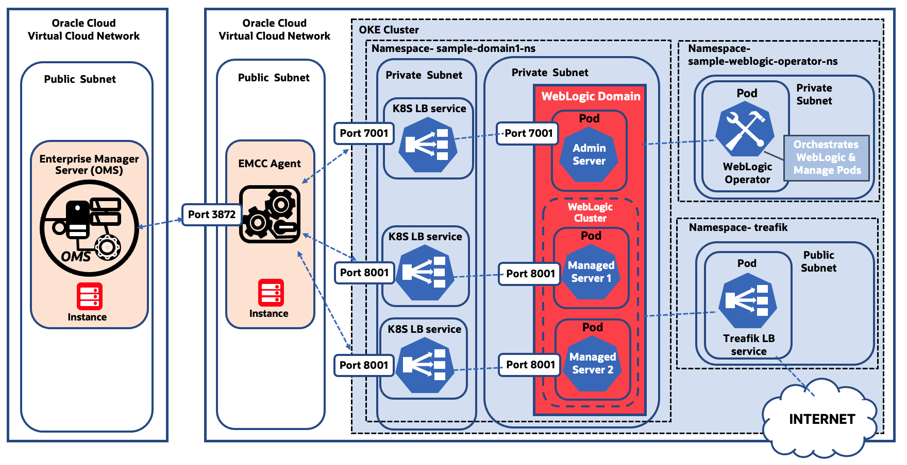

# Introduction

## About this Workshop

This workshop provides step-by-step instructions on how to set up monitoring of WebLogic Server on Kubernetes using **Oracle Enterprise Manager Cloud Control (EMCC/EM)**.

As a prerequisite for this lab, the WebLogic domain setup used in the workshop was provisioned by the **WebLogic Kubernetes Operator** and deployed on **Oracle Container Engine for Kubernetes (OKE)** in the Oracle Cloud. That can be accomplished following these three steps:

*	Step 1: Set up Kubernetes load balancer service in a private subnet for each WebLogic Server, allowing TCP communication within the **Virtual Cloud Network (VCN)**.
*	Step 2: Install an EM agent in the same VCN with the Kubernetes cluster. Here you need to create a compute instance in the Oracle Cloud to install the agent. Also, create a public subnet in the VCN and configure security rules, allowing traffic from/to the **Oracle Management Service (OMS)**, which is set up in a different VCN.
*	Step 3: Use the EM console to remotely discover the WebLogic domain, using the EM agent created in step 2, connecting to the IP of the load balancer service.

For more information on the WebLogic Kubernetes Operator, refer to the **[WebLogic Kubernetes Operator documentation](https://oracle.github.io/weblogic-kubernetes-operator/)**.

Although OKE is used as the example in this workshop, the approach of using the Kubernetes load balancer service to monitor WebLogic Server with EM, could also be used in hosted solutions on other cloud platforms, such as the Azure Kubernetes Service (AKS).

  
  
  

### Prerequisites

* This workshop uses a simple WebLogic web application running on a Kubernetes cluster as the target application to trace the user transactions. Before starting this workshop, you need to first complete Labs 1-4 in the  **[Migrating WebLogic Server to Kubernetes on OCI](https://apexapps.oracle.com/pls/apex/dbpm/r/livelabs/view-workshop?wid=567)** workshop.
* The workshop assumes you have set up Oracle Enterprise Manager Cloud Control 13c in the Oracle Cloud. You can either manually install EM to a compute instance, or provision **[Oracle Enterprise Manager App](https://blogs.oracle.com/observability/post/oracle-enterprise-manager-is-now-available-on-oracle-cloud-marketplace)** from the **[Oracle Cloud Marketplace](https://cloudmarketplace.oracle.com/marketplace)**.
* An Oracle Free Tier with 30-day free trial or Paid Cloud Account - Please view this workshop's LiveLabs landing page to see which environments are supported.

>**Note:** If you have a **Free Trial** account, when your Free Trial expires, your account will be converted to an **Always Free** account. You will not be able to conduct Free Tier workshops unless the Always Free environment is available.
**[Click here for the Free Tier FAQ page.](https://www.oracle.com/cloud/free/faq.html)**

### Objectives - How to use this workshop

Two types of use cases are considered.

1. Complete the tutorials as hands-on lab exercise. In this use case, you will first need to go to the **[Migrating WebLogic Server to Kubernetes on OCI](https://apexapps.oracle.com/pls/apex/dbpm/r/livelabs/view-workshop?wid=567)** workshop, and create a lab environment with a sample WebLogic domain deployed on OKE. You will then follow the tutorials in this workshop to configure the lab environment to enable the monitoring of the sample WebLogic Servers using your EM.

2. Use as reference documentation for an existing setup of WebLogic on Kubernetes. In this use case, you have a WebLogic domain deployed on a hosted Kubernetes service, and want to monitor it with EM. You can refer to the instructions in the workshop as needed, and learn about the general approach in order to use EM to monitor WebLogic Servers on Kubernetes.

Estimated Workshop Time: 100 minutes

## Setup Details

The WebLogic domain was provisioned in OKE following the steps described in the **[Migrating WebLogic Server to Kubernetes on OCI](https://apexapps.oracle.com/pls/apex/dbpm/r/livelabs/view-workshop?wid=567)** workshop. Access to the WebLogic pods is restricted in the private subnet.

To enable the communication between the WebLogic Servers and the EM Agent in the VCN, the Kubernetes load balancer service was set up in a private subnet and connected to each WebLogic Server pod. Each load balancer service has an external IP (private IP), allowing access from the same VCN. Ports (7001 for admin server, and the port 8001 for managed servers) were opened in the load balancers to bridge the communication between the WebLogic Server services and the EM Agent.

Within the VCN, a new compute instance was created in a public subnet for the EM agent installation, and the firewall was configured to communicate with the Oracle Management Service (OMS) instance. OMS is the central piece of EM and runs in a different VCN in the Oracle Cloud.

Finally, the EM Agent was pushed from the OMS and installed in the agent compute instance. WebLogic domain and related targets were discovered from the Middleware home page in the EM console, using the ports and the external IPs of the load balancer as discovery parameters.

The block diagram below explains the above-mentioned details.  

  

## Limitations

Because EM monitors the WebLogic Servers remotely through the Kubernetes load balancer, it is crucial to know that certain limitations exist. For example, shell-script-based metrics or file-based metrics cannot be monitored, for both WebLogic target metrics and configurations. This is because an EM agent does not exist in the target host in this model, while script or file-based metrics require a local agent.

However, considering that the out-of-box metrics included in the EM’s WebLogic Server management are predominantly JMX based, the method described in this document is considered as an effective monitoring solution to the WebLogic on Kubernetes, when the exceptions are understood. Known limitations when monitoring WebLogic using this model:

*	Out-of-the-box WebLogic target metrics are collected only for the JMX-based.
*	Corrective actions that need to log on to the target host are not supported.
*	WebLogic configurations are collected only for the JMX-based. File-based configurations are not available. E.g., bin/startWebLogicServer.sh or config/config.xml.
*	Features that require OMS to log on to the target host are not available. They include starting and stopping WebLogic Servers, patch automation, provisioning and WLST job submission. With respect to the lifecycle management features, it is recommended to use options provided by the WebLogic Kubernetes Operator. Refer to the **[WebLogic Kubernetes Operator documentation](https://oracle.github.io/weblogic-kubernetes-operator/)** for more details.
*	EM features which require OMS to directly log on to the WebLogic administration console are not available. In this model, the agent can log on to the WebLogic admin server, but the OMS cannot. The features include the Logs, JDBC data sources, System MBean Browser, and the options listed under **WebLogic Server** > **Administration** menu item. However, you can directly log on to the WebLogic administration console web application to use these features.
*	**JVM Diagnostics (JVMD)** can be set up manually however redeployment is required when the pods are regenerated. Please see the Tutorial 8 for more details.

In short, using this model, most of the WebLogic Server target metrics are available to monitor with EM. You can configure alerts to these metrics and receive notifications using the EM’s monitoring functionalities. JVMD can be set up for the performance diagnostics, and a limited set of WebLogic configurations are collected. On the other hand, any option that requires OMS to log on to the target host, or to the WebLogic admin console, are not supported.

## Learn More
### Reference
*  Oracle LiveLabs **[Migrating WebLogic Server to Kubernetes on OCI](https://apexapps.oracle.com/pls/apex/dbpm/r/livelabs/workshop-attendee-2?p210_workshop_id=567&p210_type=2&session=102696148940850)** workshop

### Oracle Cloud APM Workshops
-	**[Monitor Traces for Oracle WebLogic Server on Kubernetes Using Oracle Application Performance Monitoring](https://apexapps.oracle.com/pls/apex/dbpm/r/livelabs/view-workshop?wid=932)** Workshop
-	**[Use OpenTracing for Microservices with Helidon Utilizing Oracle Application Performance Monitoring](https://apexapps.oracle.com/pls/apex/dbpm/r/livelabs/view-workshop?wid=917&clear=180&session=14244965892057)**  Workshop
-	**[Trace a Native Cloud App Utilizing Oracle Application Performance Monitoring](https://apexapps.oracle.com/pls/apex/dbpm/r/livelabs/view-workshop?wid=916&clear=180&session=101657907800993)** Workshop

## Acknowledgements

* **Author** - Yutaka Takatsu, Product Manager, Enterprise and Cloud Manageability
- **Contributors** -
Renjit Clement, Principal Member Technical Staff,  
Rupesh Kumar, Consulting Member of Technical Staff,  
Ravi Mohan, Senior Software Development Manager,  
Adrian Padilla Duarte, Principal Member of Technical Staff,  
Monica Riccelli, WebLogic Server Product Manager,  
Steven Lemme, Senior Principal Product Manager,  
Mahesh Sharma, Consulting Member of Technical Staff,  
Avi Huber, Senior Director, Product Management
* **Last Updated By/Date** - Yutaka Takatsu, March 2022
