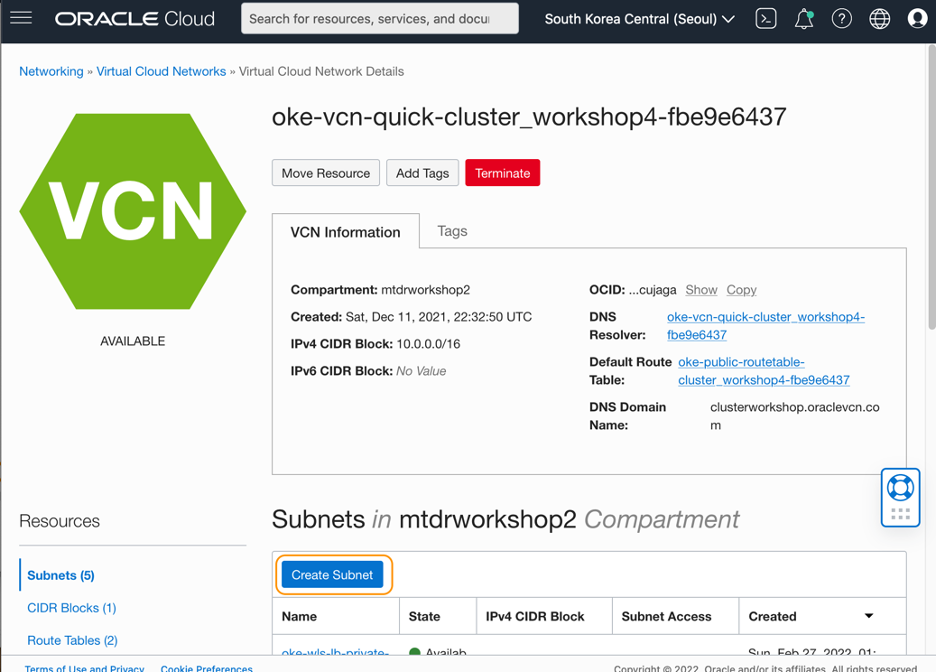
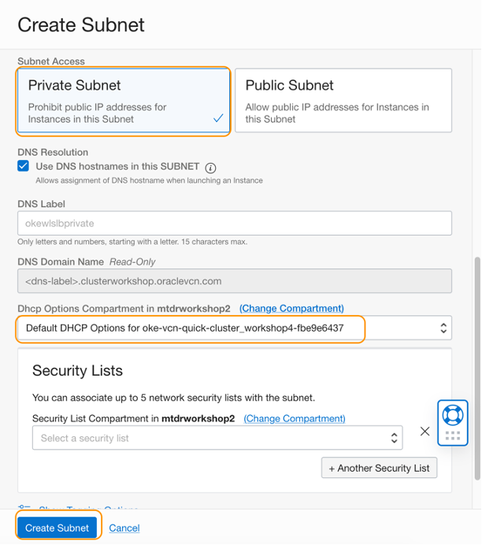
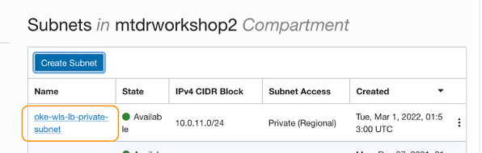
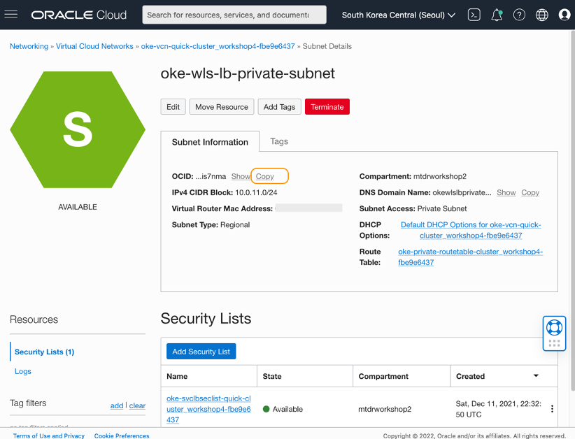

# Create a private subnet for load balancer services

## Introduction

In preparation for creating Kubernetes load balancer services, you will need a private subnet set up in the VCN. You can create a new subnet or use an existing private subnet. This tutorial describes how you can create a new subnet in the same VCN where the Kubernetes cluster is running.

Estimated time: 5 minutes

### Prerequisites

* Completion of the **[Migrating WebLogic Server to Kubernetes on OCI](https://apexapps.oracle.com/pls/apex/dbpm/r/livelabs/view-workshop?wid=567)** workshop, labs 1, 2, 3 and 4.

### Objectives
* Create a private subnet for load balancer services

## **Task 1**: Create a private subnet

1. From the Oracle Cloud navigation menu, select **Developer Services** > **Kubernetes Clusters (OKE)**.

   

2. Locate the compartment you created the Kubernetes cluster when you performed the prerequisite **[Migrating WebLogic Server to Kubernetes on OCI](https://apexapps.oracle.com/pls/apex/dbpm/r/livelabs/workshop-attendee-2?p210_workshop_id=567&p210_type=2&session=102696148940850)** workshop. Then click the name of the VCN.

   

3.	In the Virtual Cloud Network Details page, click **Create Subnet**.

   

4. Enter the values to the fields and select options as in below:
     *	Name: **oke-wls-lb-private-subnet**
     *	Create In Compartment:  leave as default
     *	Subnet Type: **Regional**
     *	CIDR Block: **10.0.11.0/24**
     *	Route Table: select **oke-private-routable-&lt;cluster_name&gt:**
     *	Subnet Access: select **Private Subnet**
     *	DHCP options: select **Default DHCP Options for the VCN**
     *	Leave the Security List blank

   Click **Create Subnet**.

      

      

5.	In the **Virtual Cloud Network Details** page, **Subnet** section, verify that a new subnet is created. Click the link to the subnet just created.

      

6.	In the Subnet Details page, click **Copy** next to the OCID. Save the value to a text file. You will need this value in the next Tutorial, when create load balancer services.

      

You may now **proceed to the next tutorial**.

## Acknowledgements

* **Author** - Yutaka Takatsu, Product Manager, Enterprise and Cloud Manageability
- **Contributors** -
Renjit Clement, Principal Member Technical Staff,  
Rupesh Kumar, Consulting Member of Technical Staff,  
Ravi Mohan, Senior Software Development Manager,  
Steven Lemme, Senior Principal Product Manager,  
Mahesh Sharma, Consulting Member of Technical Staff,  
Avi Huber, Senior Director, Product Management
* **Last Updated By/Date** - Yutaka Takatsu, March 2022
