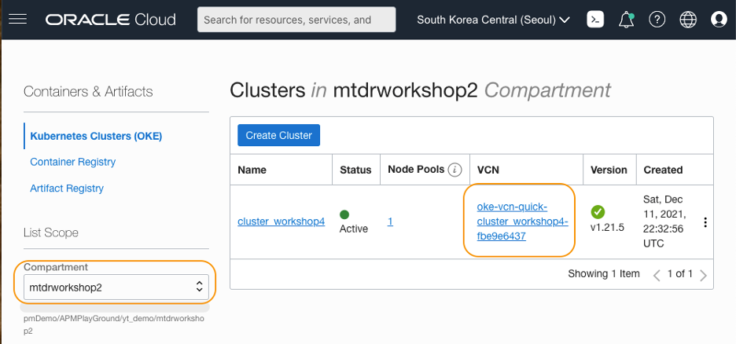
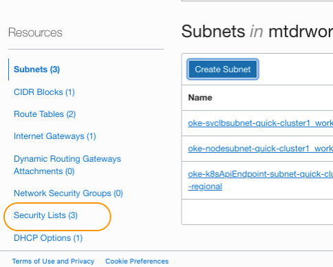
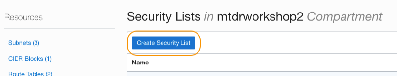
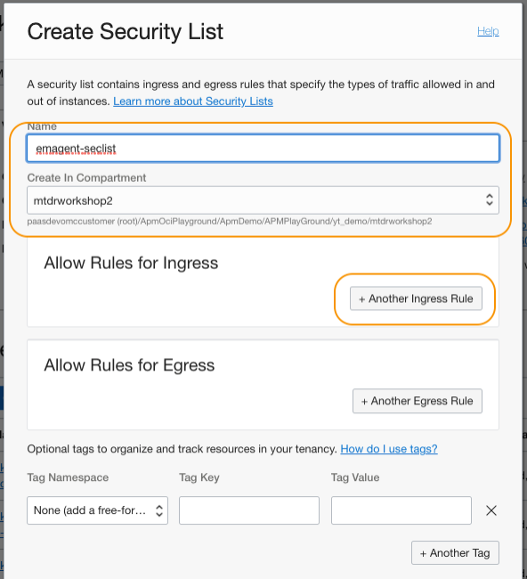
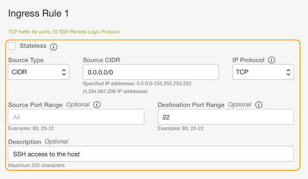
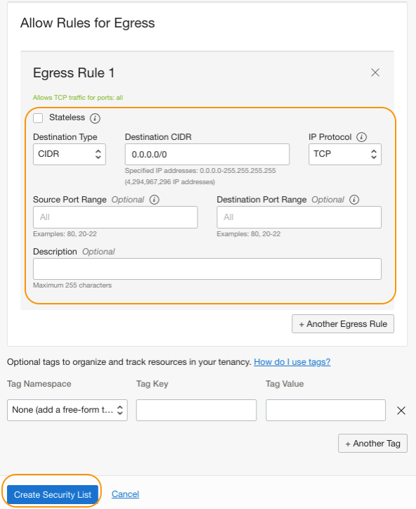
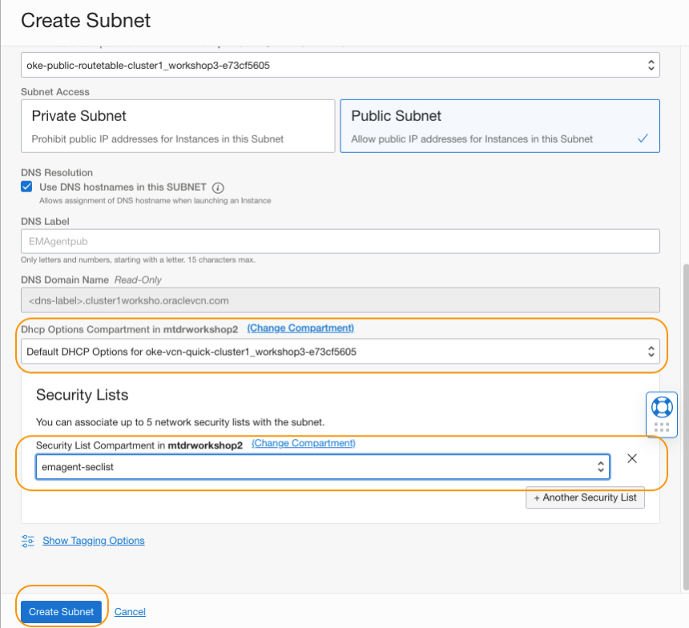
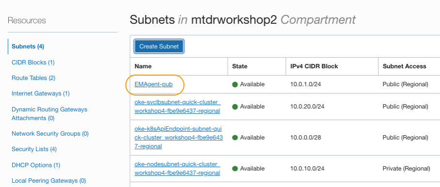

# Create a public subnet for EM agent

## Introduction

Now you have the kubernetes load balance services configured for the WebLogic Servers. Next, you will need to set up an EM agent that can communicate to the load balancer services. In this tutorial, you will create a public subnet that will be used by the EM agent, in the same VCN which the cluster uses.

Estimated time: 5 minutes

* Completion of the **[Migrating WebLogic Server to Kubernetes on OCI](https://apexapps.oracle.com/pls/apex/dbpm/r/livelabs/view-workshop?wid=567)** workshop, labs 1, 2, 3 and 4.
* Completion of the preceding tutorials in this workshop

### Objectives
* Create a public subnet for EM agent

## **Task 1**: Create Security rules

1. From the Oracle Cloud navigation menu, select **Developer Services** > **Kubernetes Clusters (OKE)**.

   

2. Locate the compartment you created the Kubernetes cluster when you performed the prerequisite **[Migrating WebLogic Server to Kubernetes on OCI](https://apexapps.oracle.com/pls/apex/dbpm/r/livelabs/workshop-attendee-2?p210_workshop_id=567&p210_type=2&session=102696148940850)** workshop. Then click the name of the VCN.

   

3. In the **Virtual Cloud Network Details** page, scroll down to locate a link to the **Security Lists** at the left side of the page. Click the link.

   

4. In the **Security Lists** section, click **Create Security List**.

   

5. In the **Create Security List** window, enter **emagent-seclist** as a name of the security list and select the compartment where you have the VCN. Click **+Another Ingress Rule** button.

   

6. Create two Ingress Rules with the information shown below.  As for the **Ingress Rule 2**, replace the CIDR with the **public IP of the OMS instance** to allow access only from the OMS host.  

    > **NOTE:**  Ask your EM Administrator if you do not know the IP address of the OMS host/compute instance.

  * Ingress Rule 1:
      * Stateless: **No**
      * Source CIDR: **0.0.0.0/0**
      * IP Protocol: **TCP**
      * Source Port Range: **All**
      * Destination Port Range: **22**
      * Description: **SSH access to the host**

  * Ingress Rule 2:
      * Stateless: **No**
      * Source CIDR: **&lt;IP of the OMS instance&gt;/32**
      * IP Protocol: **TCP**
      * Source Port Range: **All**
      * Destination Port Range: **3872**
      * Description: **access to EM Agent port**

   
   

   > **NOTE:** You can also restrict the SSH access to enhance the security in the Ingress Rule 1. For example, if you have a Bastion host in the VCN, you can limit the access to the port 22 only from the OMS and the Bastion host. You can still connect to the EM agent instance through the bastion host, using two-step-SSH connection for development and maintenance purposes.

7. In the same **Create Security List** window, click **+Another Egress Rule** button, create an Egress rule with the following information. Then click **Create Security List**.

    * Egress Rule 1:
         * Stateless: **No**
         * Source CIDR: **0.0.0.0/0**
         * IP Protocol: **TCP**
         * Source Port Range: **All**
         * Destination Port Range: **All**

    

8. In the **VCN Details** page, verify that the security list is added to the table. Click **Subnets** from the left side of the screen.

    

## **Task 2**: Create a Subnet

1. In the **Subnet** section, click **Create Subnet** button.

    

2. In the **Create Subnet** window, enter the following information.

    * Name: **EMAgent-pub**
    * Compartment: Select a compartment where you have the cluster
    * Subnet Type: **Regional**
    * CIDR Block: **10.0.1.0/24**
    * Route Table: Select a public route table
    * Subnet Access: **Public**

    

3. Scroll down the page and enter the following information. Then click **Create Subnet**.

    * DHCP options: Select the default DHCP option
    * Security List: Select the security list created in the steps above

    

4. In the **VCN Details** page, verify the subnet is created. You should see it in the **Subnets** table as in the image below.

    

You may now **proceed to the next tutorial**.

## Acknowledgements

* **Author** - Yutaka Takatsu, Product Manager, Enterprise and Cloud Manageability
- **Contributors** -
Renjit Clement, Principal Member Technical Staff,  
Rupesh Kumar, Consulting Member of Technical Staff,  
Ravi Mohan, Senior Software Development Manager,  
Steven Lemme, Senior Principal Product Manager,  
Mahesh Sharma, Consulting Member of Technical Staff,  
Avi Huber, Senior Director, Product Management
* **Last Updated By/Date** - Yutaka Takatsu, March 2022
