# Set up EM Agent

## Introduction

In this tutorial, you will create a compute instance using the public subnet created in the previous tutorial, configure firewall settings, and install EM agent to the compute from the EM console.


Estimated time: 15 minutes

* Completion of the **[Migrating WebLogic Server to Kubernetes on OCI](https://apexapps.oracle.com/pls/apex/dbpm/r/livelabs/view-workshop?wid=567)** workshop, labs 1, 2, 3 and 4.
* Completion of the preceding tutorials in this workshop


### Objectives
* Set up EM Agent

## **Task 1**: Create a compute instance


1. From the Oracle Cloud Shell navigation menu, select **Compute** > **Instances**.

   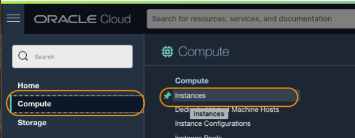

2. In the **Instances** page, Click **Create Instance**.

   

3.  In the **Create Compute Instance** window, enter the following information to create a compute instance.

     * Name: **EMAgent**
     * Compartment: Select the same compartment where you have the cluster
     * Availability domain: Select a default AD

   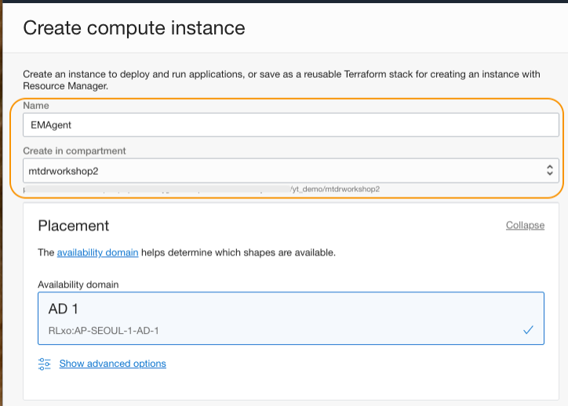


     * Image: Select **Oracle Linux 7.9** to best go with the steps in this workshop.
     * Shape: Select a minimum shape (1 or 2 OCPU, 16MB memory) for the workshop use. VM.Standard 2.1 is selected in the example.

    > **NOTE:** In production, OCPUs 4, Memory 16GB and Boot volume 70GB at minimum is recommended, as you will typically install target application or database in the host to monitor with the EM agent.

   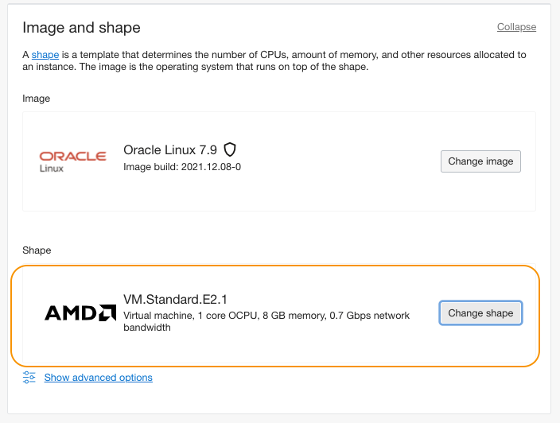


     * Primary network: Select the option, **Select existing virtual cloud network**. Then select a VCN, which is used by the OKE cluster
     * Subnet: Select the option, **Select existing subnet**. Then select the subnet created in the previous tutorial
     * Public IP address: Select the option, **Select Assign a public IPv4 address**

   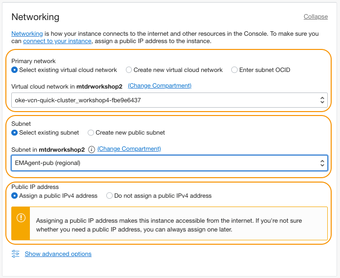


     * Add SSH keys: Select any option to add SSH keys. Upload public key file was selected in the example
     * Boot volume size: **70(GB)**

    Click **Create** button.

   

4. Wait for few minutes for the provisioning to complete.

   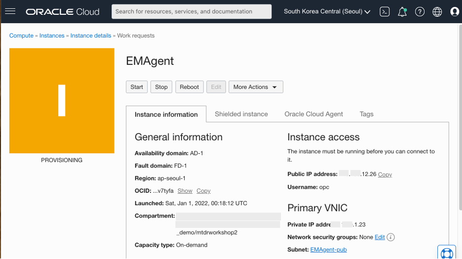


5.  Ensure the Instance is in the RUNNING state. Click **Copy** next to the **Public IP address**, then save the value to a text file on your computer. Also click **Copy** next to the **Internal FQDN** and save the value to the text file.

   


## **Task 2**: Preparing for the agent installation


1. Open a terminal window (or a Putty connection) on your computer, type the following command to open an SSH connection to the Agent host. Replace the **Agent-Instance-Public-IP** with the value copied in the previous step (Tutorial 5, Task 1, Step 5).

    ``` bash
    <copy>
    ssh opc@<Agent-Instance-Public-IP> -i "<path-to-the-private-key>/id_rsa"
    </copy>
    ```

    E.g., $ ssh opc@123.456.12.26 -i "/Users/labuser/rsa/id_rsa"

2.  Open the ***hosts*** file with the following command.

    ``` bash
    <copy>
    sudo vi /etc/hosts
    </copy>
    ```

3. Add the following entries to the ***hosts*** file.

    a)  Kubernetes load balancer IPs and the matching WebLogic Server names saved in the Tutorial 3, Task 3, Step 3.

        E.g.,)
        10.0.x.248 sample-domain1-admin-server
        10.0.x.252 sample-domain1-managed-server1
        10.0.x.156 sample-domain1-managed-server2


    b)  **Public IP** and the **hostname (FQDN)** of the EM server (OMS) computer instance, in the below format.

        <Public IP address of the OMS host> <FQDN of the OMS host>

    > **NOTE:**
    - Ask your EM Administrator if you do not know the IP address and the FQDN of the OMS host/compute instance.
    - If you use EM app on Oracle Cloud Marketplace, the hostname of the OMS host can be different from the FDQN displayed on the Compute Instance home page. You can verify the hostname by running **hostname -f** command in the OMS host. Below image shows **oms1** as a hostname for an host provisioned by the EM app.      

   


   Save the file with ***esc + :wg***.

4.  While still in the EM Agent host, enter the following commands in the terminal to configure firewall settings to allow traffic on the agent port 3872 and http communication with the OMS.

    ``` bash
    <copy>
    sudo firewall-cmd --zone=public --permanent --add-port=3872/tcp
    sudo firewall-cmd --permanent --add-service=https
    sudo firewall-cmd --permanent --add-service=http
    sudo firewall-cmd --reload
    exit
    </copy>
    ```

5. Ensure that you exited from the EM agent host. In the same terminal window (or open another terminal window), type the following to open an SSH connection to the EM Server (OMS) host.

    ``` bash
    <copy>
    ssh opc@<OMS-Host-Public-IP> -i "<path-to-the-private-key>/id_rsa"
    </copy>
    ```

    

6. Open the hosts file with the following command.

    ``` bash
    <copy>
    sudo vi /etc/hosts
    </copy>
    ```
    Add the Public IP and the host name of the EM Agent to the ***hosts*** file, in the below format.   


        <Public IP address of the EM Agent host> <FQDN of the EM Agent host>

   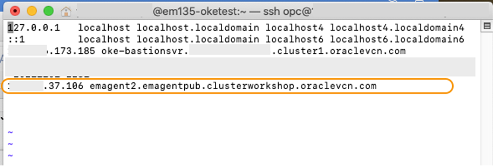

    > **NOTE:**
      - If you do not have permission to access the OMS host, please ask your EM administrator to add the EM Agent information to the hosts file in the OMS host.
      - Do ***NOT*** close the terminal window that connected to the OMS host. You will need to use it in the Task 3.


## **Task 3**: Install EM agent in the compute instance


1. Launch your Enterprise Manager Cloud Control 13.5 in a browser. Log on with your credentials.

   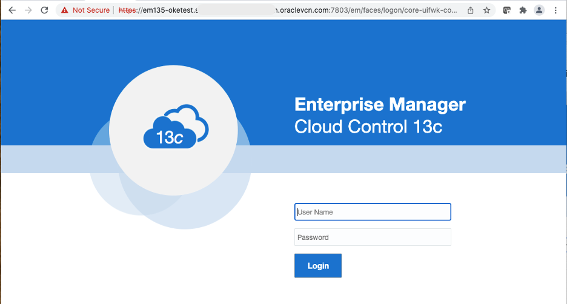

  > **NOTE:** Ask your EM Administrator if you do not know the login credentials of the Enterprise Manager.

2. From the Enterprise Manager page menu bar, navigate to the **Setup** (a gear icon) **Add Target** > **Add Targets Manually**.

   

3. In the  **Add Target Manually** page, click  **Install Agent on Host**.

   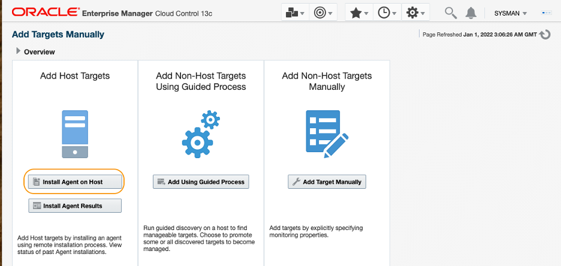

4.  In the **Add Target** page, click **Add**. Enter the FQDN of the EM Agent compute instance, saved in the Tutorial 5, Task 1, Step 5.  Click **Next**.

   

5.  Enter the directory where the agent files will be installed. **/home/opc/agent** is specified in the image below, as an example. Select **SSH Key based named credentials** that can access the Oracle Cloud compute instance.

    > **NOTE:** If you have not created a SSH based named credential, go to **Setup** > **Security** > **Named Credentials**. Please refer to the EMCC Security Guide documentation > ***[Configuring and Using Target Credentials](https://docs.oracle.com/en/enterprise-manager/cloud-control/enterprise-manager-cloud-control/13.5/emsec/security-features.html#GUID-E2792E49-FBF5-4A25-837B-4225CFD16012)*** for how to create SSH key based named credentials.

   Leave the other fields with the default values, then click **Next**.

   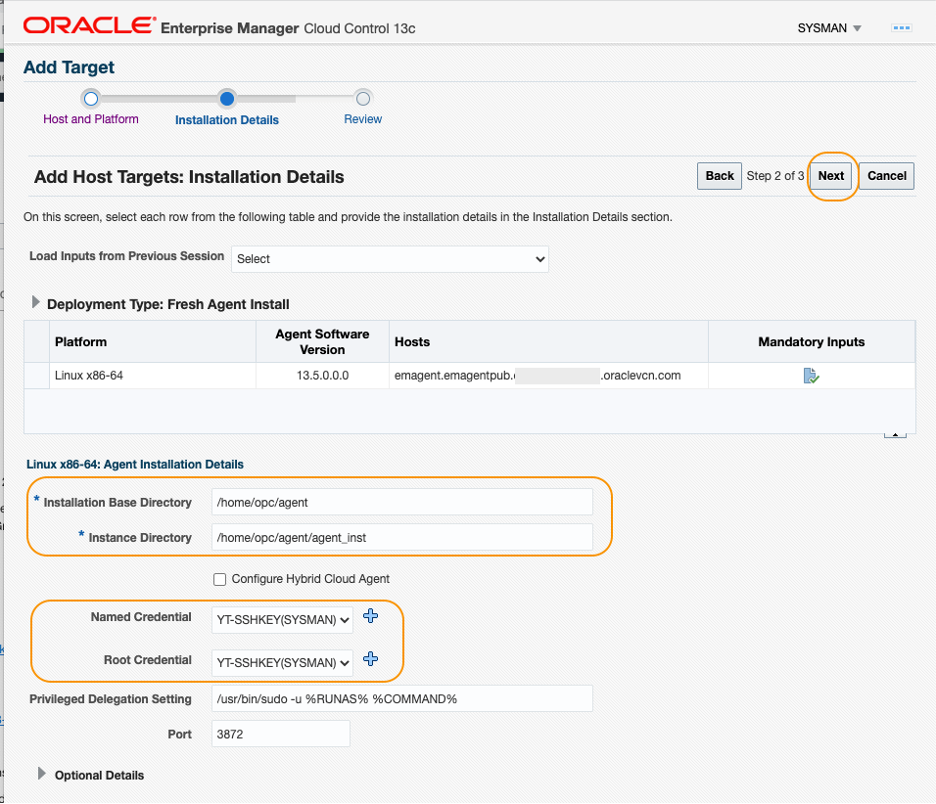

6.  Locate the **OMS Upload Port** in the **Review** page. In many cases, the value is 4903, but it can be different as in the image below. Write the port number to a text file.

    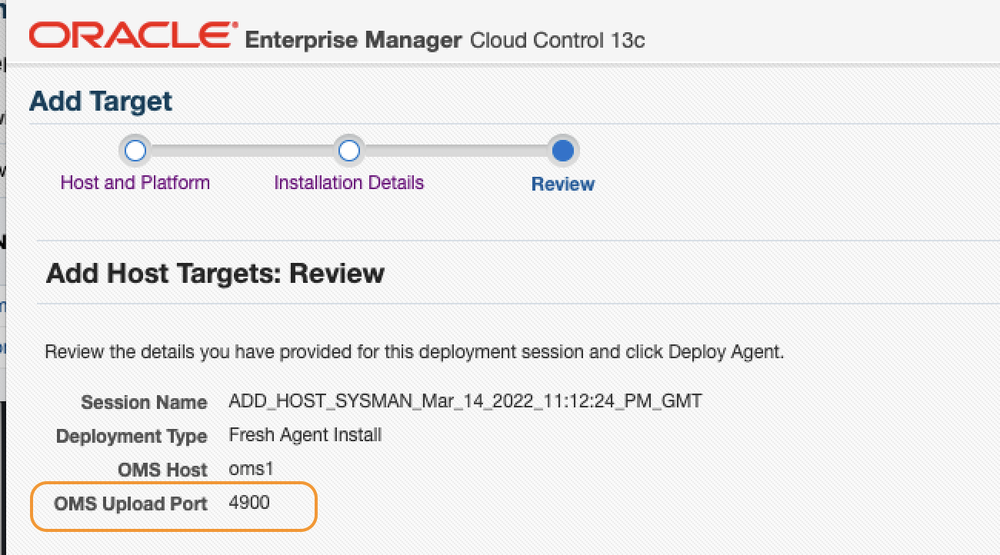


7.  Go to the terminal window that you opened in the Tutorial 5, Task2, Step 5, to access the EM Server (OMS) host. If you have already closed the terminal, re-open it, and type the following to open an SSH connection to the OMS host.

    ``` bash
    <copy>
    ssh opc@<OMS-Host-Public-IP> -i "<path-to-the-private-key>/id_rsa"
    </copy>
    ```

8. Type the following to ensure the OMS Upload port is open in the firewall settings.


    ``` bash
    <copy>
    sudo firewall-cmd --zone=public --permanent --add-port=<OMS UPLOAD PORT NUMBER>/tcp
    sudo firewall-cmd --reload
    </copy>
    ```

    > **NOTE:** Please also make sure that an ingress rule for the OMS Upload Port (E.g., 4903) is created in the security list in the VCN, which is used by the OMS host. This is required for the EM agent to upload any data to the OMS. To create a security rule, please refer to the Tutorial 4, Task 1.


9. In the Review page in the EM console, click **Deploy Agent**. The EM agent installation takes about 10 minutes.

   


10.  Once the installation is succeeded, you will see a screen similar to the image below. Click **Done** to exit the wizard.

   

    > **NOTE:** In case the wizard returns warnings for missing packages, update the package in the EM agent host, and try the agent install again. E.g., if the warning is: "Checking for libnsl-2.28-18 Not found", run **sudo yum install libnsl**. For other Agent installation issues, please refer to the doc **[EM 12c, EM 13c: Known Issues and Troubleshooting Enterprise Manager Cloud Control Management Agent Installation Issues (Doc ID 1396675.1)](https://support.oracle.com/knowledge/Enterprise%20Management/1396675_1.html)** or contact My oracle Support.

11.  From the menu bar, select **Setup** > **Manage Cloud Control** > **Agents**. Confirm the agent is added, and the status shows green UP arrow icon.

   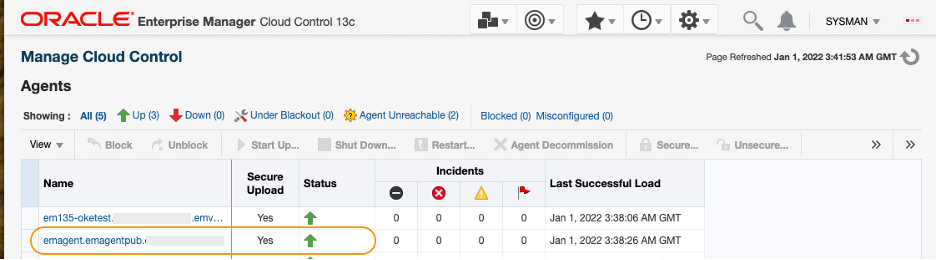


You may now **proceed to the next tutorial**.


## Acknowledgements

* **Author** - Yutaka Takatsu, Product Manager, Enterprise and Cloud Manageability
- **Contributors** -
Renjit Clement, Principal Member Technical Staff,  
Rupesh Kumar, Consulting Member of Technical Staff,  
Ravi Mohan, Senior Software Development Manager,  
Steven Lemme, Senior Principal Product Manager,  
Mahesh Sharma, Consulting Member of Technical Staff,  
Avi Huber, Senior Director, Product Management
* **Last Updated By/Date** - Yutaka Takatsu, March 2022
