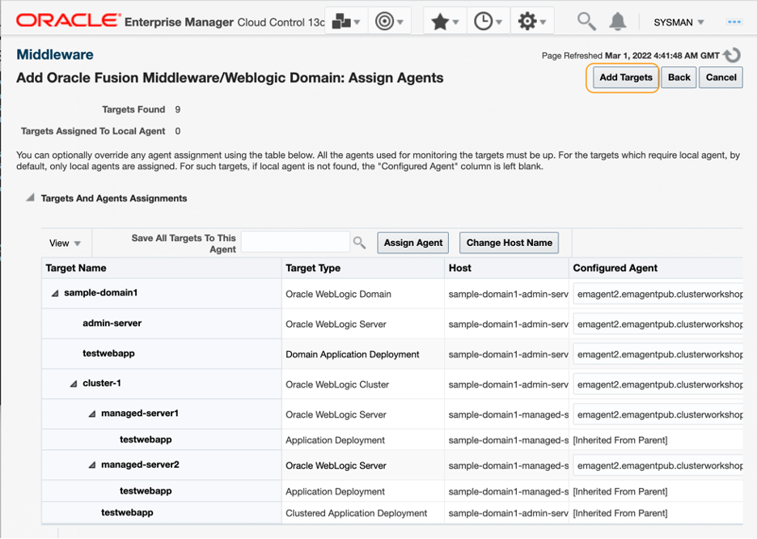
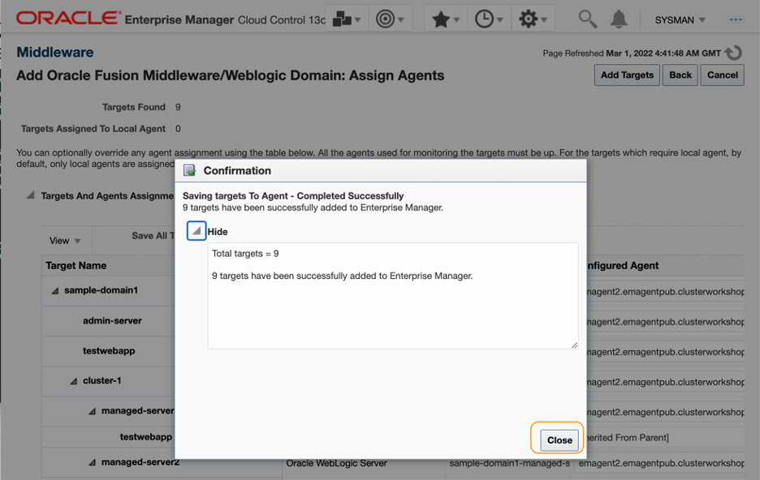
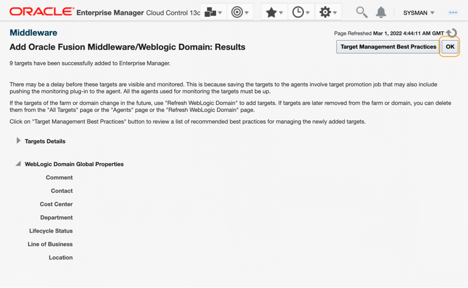
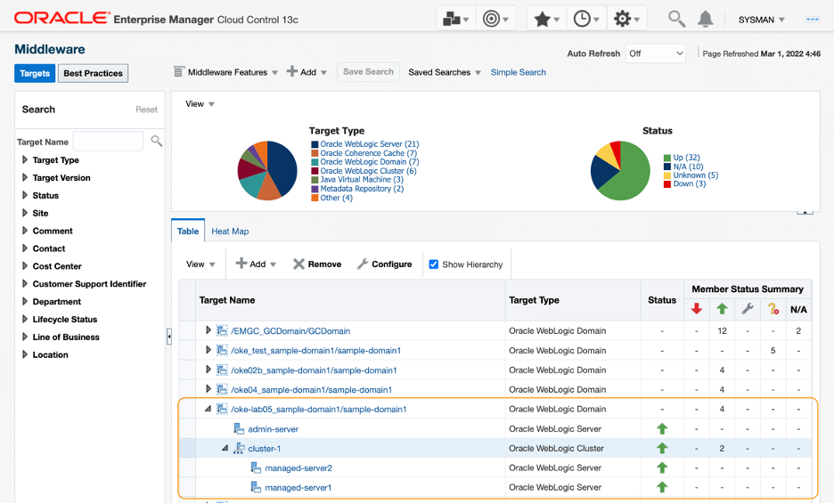

# Discover WebLogic Servers as managed targets

## Introduction

Now you have the EM agent running in the same VCN with the Kubernetes cluster. In this tutorial, using the EM agent that you set up in the previous tutorial, you will use EM console to discover the WebLogic Server as a managed target type, and verify the metric data collected from the targets in the Middleware target home page.

Estimated time: 20 minutes

* Completion of the **[Migrating WebLogic Server to Kubernetes on OCI](https://apexapps.oracle.com/pls/apex/dbpm/r/livelabs/view-workshop?wid=567)** workshop, labs 1, 2, 3 and 4.
* Completion of the preceding tutorials in this workshop

### Objectives
* Discover WebLogic Servers as managed targets

## **Task 1**: Discover WebLogic Domain

1.  From the menu bar in the EM console, select **Targets** (A double ring icon) > **Middleware** to navigate to the Middleware home page.

   

2. In the **Middleware** home page, click **Add** > **Oracle Fusion Middleware/WebLogic Domain**

   

3. In the **Add Oracle Fusion Middleware/WebLogic Domain: Find Targets** page, enter the following information in the fields. Then click **Continue**.

    * Administration Server Host: External-IP of the Load Balancer that is mapped to the admin server, saved in the Tutorial 3, Task 3
    * Port: **7001**
    * Username: **weblogic**
    * Password: The password generated in the **[Migrating WebLogic Server to Kubernetes on OCI](https://apexapps.oracle.com/pls/apex/dbpm/r/livelabs/workshop-attendee-2?p210_workshop_id=567&p210_type=2&session=102696148940850)** workshop, Lab 4, Step 1
    * Unique Domain Identifier: **OKE-WLS**
    * Agent: Select the EM agent created in the previous tutorial

    > **NOTE:** You can run **kubectl get svc -n sample-domain1-ns** in the Cloud Shell to find the External-IP of the load balancer service for the Admin Server.

   

4. Confirmation window appears upon successful completion on the search. Click **Close**.

   

5. In the **Assign Agents** page, review the targets found, then click **Add Targets**.

   

6.  **Confirmation** window shows up. Click **Close**.

   

7. In the **Results** page, click **OK**.

   

## **Task 2**: Validate the WebLogic Server metrics

1.  In the **Middleware** home page, confirm the WebLogic Domain, WebLogic Servers and the WebLogic cluster were added to the Target section. Refresh the page to see the status updated. It may take few minutes to see the targets fully in the running status.

   

2.  Click the **WebLogic Domain** target link from the table view.

   

3.  Domain Home page opens. Click **Servers**.

   

4.  In the domain home page, observe the status and performance information of the WebLogic servers displayed. Click ***managed-server1*** link.

    > **NOTE:**  It may take few minutes after the discovery for some metrics to display the values.  

   

5.  In the WebLogic Server target home page, select **WebLogic Server** > **Monitoring** > **Performance Summary**, to open a WebLogic Server Performance dashboard.

   

6. In the **Performance Summary** page, review the dashboard and verify that the metric data is coming in to the EM console. The image below is the summary of the past 15 minutes.  You can also check out the other dashboards as in the JVM performance to ensure the metric data is collected.

   

7. Optionally, you can navigate to **All Metrics** page (**WebLogic Server** > **Monitoring** > **All Metrics**)
   to examine each metric data and analyze the performance and the availability of the WebLogic Server target.

    > **NOTE:** Example image below shows the last 7 days of the metric data (WebLogic Server metric, JVM Memory – Heap Memory Usage (KB)) collected from another OKE based WebLogic Server that is running for some time.

   

## **Task 3**: Verify the configuration data collected from the WebLogic target

1. Next, let’s review the configuration metrics of the WebLogic target. Select **WebLogic Server** > **Configurations**.

   

2. In the **Latest Configuration** page, review the values that are collected.

   

    > **NOTE:** As mentioned in the Limitation section in the Introduction of this workshop, only JMX based configurations are collected. Because there is no local agent in the target host, file-based configurations are not collected.

You may now **proceed to the next tutorial**.

## Acknowledgements

* **Author** - Yutaka Takatsu, Product Manager, Enterprise and Cloud Manageability
- **Contributors** -
Renjit Clement, Principal Member Technical Staff,  
Rupesh Kumar, Consulting Member of Technical Staff,  
Ravi Mohan, Senior Software Development Manager,  
Steven Lemme, Senior Principal Product Manager,  
Mahesh Sharma, Consulting Member of Technical Staff,  
Avi Huber, Senior Director, Product Management
* **Last Updated By/Date** - Yutaka Takatsu, March 2022
