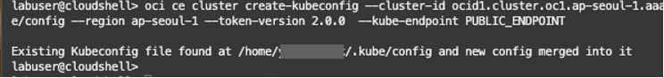
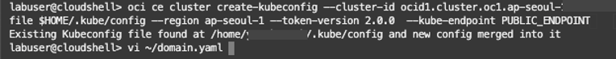
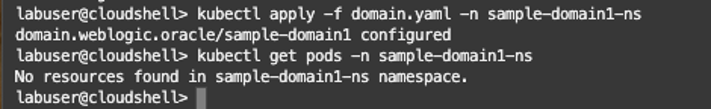
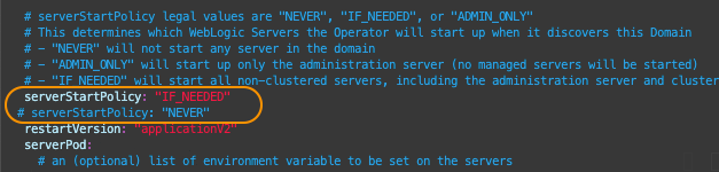
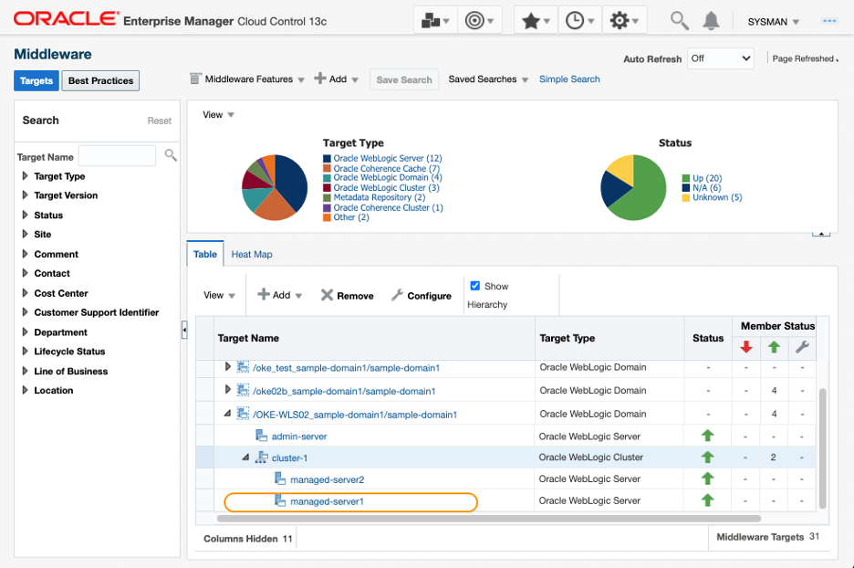

# (Optional) Verify the continuous monitoring at the pod restart

## Introduction

In this optional tutorial, you will restart the WebLogic Server pods using the WebLogic Kubernetes Operator, and verify the target monitoring in EM continues, without losing the history of the metric collection.

Estimated time: 10 minutes

* Completion of the **[Migrating WebLogic Server to Kubernetes on OCI](https://apexapps.oracle.com/pls/apex/dbpm/r/livelabs/view-workshop?wid=567)** workshop, labs 1, 2, 3 and 4.
* Completion of the preceding tutorials in this workshop


### Objectives
* Verify the continuous monitoring at the pod restart

## **Task 1**: Restart the Kubernetes Pods

1. Launch the Cloud Shell, run the **oci ce cluster create-kubectl** command, saved in the Tutorial 1, Task 1, step 7.

   

2.  Open ***domain.yaml*** from the home directory with an editor.

    ``` bash
    <copy>
    cd ~; vi domain.yaml
    </copy>
    ```
    > **NOTE:** domain.yaml is the Domain Custom Resource yaml that contains the necessary parameters for the WebLogic Kubernetes Operator to start and stop the WebLogic domain. For more information, refer to the **[WebLogic Kubernetes Operator documentation](https://oracle.github.io/weblogic-kubernetes-operator/)**  documentation.

   

3.  Locate the parameter **serverStartPolicy**. Notice the value is **"IF_NEEDED"**.

   

   Hit the “i” key to enter the editing mode. Comment out this line, duplicate to create another row, and set the value to **“NEVER"**, as in the example below. Note the value is case sensitive.

         #  serverStartPolicy: "IF_NEEDED"
           serverStartPolicy: "NEVER"

   

   Save and close the file with ***esc + :wq***. 	

    > **NOTE:** Ensure the indentation is at the same level with the restartVersion parameter in the next row.

4.  Run the kubectl get pods command to view the IP addresses of the pods.

    ``` bash
    <copy>
    kubectl get pods -o wide -n sample-domain1-ns
    </copy>
    ```

       The example in the image below, the last 3 digits of the IPs are **118**, **119** and **120**.

   

5. Apply the change made on the YAML file by the following command. This will terminate the pods.

    ``` bash
    <copy>
    kubectl apply -f domain.yaml -n sample-domain1-ns
    </copy>
    ```
6. Wait for few minutes and run the following command to check the status of the pods.  When the termination is completed, you see a message, “No resources found”.

    ``` bash
    <copy>
    kubectl get pods -n sample-domain1-ns
    </copy>
    ```
   

7. Open the ***domain.yaml*** once again with an editor, then change the **serverStartPolicy** parameter back to **“IF_NEEDED”**. If you duplicated the line to set the value to “NEVER” in the previous steps, comment out the current line, and uncomment the original line.

    ``` bash
    <copy>
    vi ~/domain.yaml
    </copy>
    ```

   

   Close the file with ***esc + :wq***.

8.  Apply the change made on the YAML file by the following command. This will regenerate the pods from the Docker image, resetting all the WebLogic domain configurations to default.

    ``` bash
    <copy>
    kubectl apply -f domain.yaml -n sample-domain1-ns
    </copy>
    ```

9.  Wait for few minutes and run the command below.  Verify that the different IPs from the previous ones are assigned to the WebLogic Servers.

    ``` bash
    <copy>
    kubectl get pods -o wide -n sample-domain1-ns
    </copy>
    ```

    E.g., in the image below, the last 3 digits of the IPs are **122**, **123** and **124**, while previously they were **118**, **119** and **120**.

   

    However, the change made in the WebLogic IP has no impact on the EM monitoring.  This is because the EM agent does not directly communicate with the pods where WebLogic Servers are running; instead, it connects with the load balancer services, which automatically handles the mapping when the pods are regenerated.  


## **Task 2**: Verify the monitoring in EM Console


1.  Launch your EM web console in a browser, log on and navigate to the Middleware home page.  Observe that the WebLogic targets are in the UP status.  Note that it will take few minutes to have the statuses updated for the targets.

    Click the link to the **managed-server1**.

   

2. In the WebLogic Server target home page, observe the downtime was recorded in the target availability while the pods were regenerated, but EM regarded the new WebLogic Server running in the new pod, as the same target.

   

3. In the WebLogic Server target home page, select **WebLogic Server** > **Monitoring** > **Performance Summary**. In the dashboard, you can see the metric data collected from the old pod was preserved.

   


You may now **proceed to the next tutorial**.


## Acknowledgements

* **Author** - Yutaka Takatsu, Product Manager, Enterprise and Cloud Manageability
- **Contributors** -
Renjit Clement, Principal Member Technical Staff,  
Rupesh Kumar, Consulting Member of Technical Staff,  
Ravi Mohan, Senior Software Development Manager,  
Steven Lemme, Senior Principal Product Manager,  
Mahesh Sharma, Consulting Member of Technical Staff,  
Avi Huber, Senior Director, Product Management  
* **Last Updated By/Date** - Yutaka Takatsu, March 2022
