# (Optional) Enable JVM Diagnostics

## Introduction

Optionally, you can enable Enterprise Manager **JVM Diagnostics (JVMD)** on the WebLogic Servers on Kubernetes. However, because the WebLogic Servers are deployed on Kubernetes pods, where direct communication between OMS and the targets is not available, automated installation of the JVM agent using the EM console is not applicable, and manual arrangements are required.

In this tutorial you will add security rules in the VCN subnet, configure firewall settings in the instance, edit configuration files in each WebLogic pod to prepare for the JVMD agent installation. Then download the agent installer, upload it to the Cloud Shell, transfer it to the admin server pod. Next, use WebLogic Administration Console to manually deploy the JVMD agents to all WebLogic Servers. Finally, verify the JVM targets in the EM Middleware management home page. You can also associate the JVM targets to the WebLogic domain.

   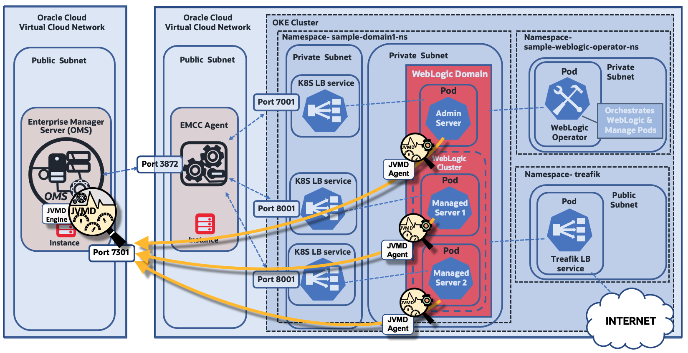

### JVM Diagnostics Architecture

JVMD consists of a **JVMD engine**, which is a core analytical portion of the JVMD monitoring system, and **JVMD agents**, which are the data collectors of the target JVM.  JVMD agents are deployed inside the application servers and collect real-time JVM monitoring data. The agent transmits the collected data to the JVMD engine, directly using SSL. Note that JVMD does not use an EM agent, having its own channel to communicate with OMS.

   

### Limitation

A limitation deploying a JVMD agent to a WebLogic Server, which is already provisioned in a Kubernetes pod, is that the deployment will be lost when the pod is restarted or regenerated. Therefore, the steps described in the Task 2 in this tutorial must be repeated every time such an event happens. To have the JVMD agent persist in the WebLogic Server, deploy it in the Docker image, so that the JVMD agent is pre-deployed, when a pod is created.

Estimated time: 25 minutes

* Completion of the **[Migrating WebLogic Server to Kubernetes on OCI](https://apexapps.oracle.com/pls/apex/dbpm/r/livelabs/view-workshop?wid=567)** workshop, labs 1, 2, 3 and 4.
* Completion of the preceding tutorials in this workshop


### Objectives
* Enable JVM Diagnostics

## **Task 1**: Configure network and firewall settings


1.  First, you will need to obtain **JVMD SSL Port** from the Middleware agent management page in the EM console. From the EM console, select **Setup** (a gear icon in the menu bar) > **Middleware Management** > **Engines and Agents**.

   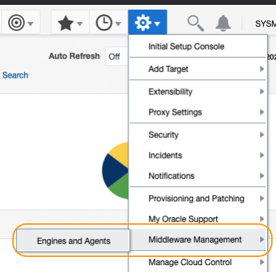

2. In the **Engines and Agents** page, under **RUEI/BTM/JVMD Engines**, locate **SSL Port** of the JVM Diagnostics Engine. This is the port, which needs to be available at the EM host. In the image below, the value is **7301** for an example. Note down the value to a text file.

   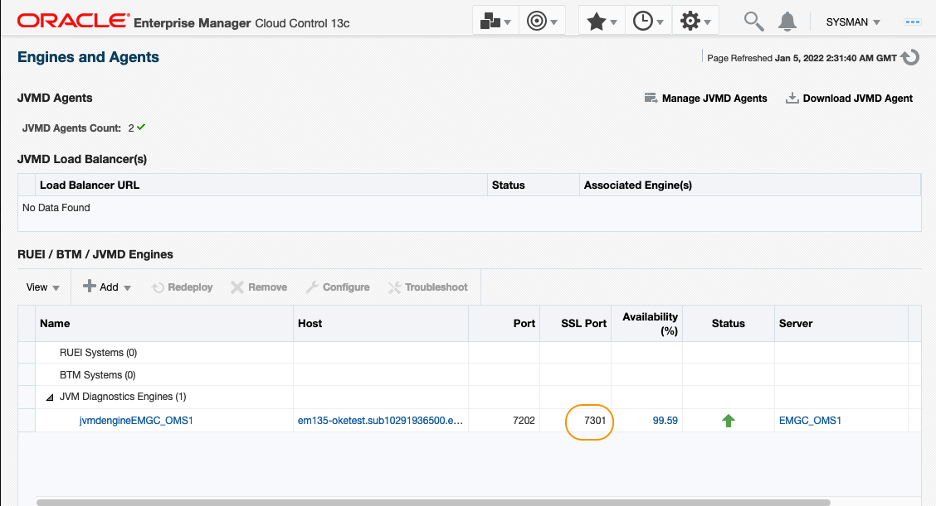

3.  Next, you will need to add the SSL Port to the security rule in the subnet which is used by your OMS instance. Log on to the Oracle Cloud console, select **Compute** > **Compute instance** from the navigation menu.

   

4. In the **Instances** page, select the **Region** and **Compartment** where the OMS instance resides. Then select the link to the OMS instance from the list of your compute instances.

   

    > **NOTE:** Ask your EM Administrator if you do not know the region or compartment of the OMS instance.

5. In the **Instance Details** page, click **Copy** next to the **Public IP address** and **Internal FQDN**, and write down the values to a text file. You will need these values later in this tutorial. Then click the link to the **Subnet**.

   

6. In the **Subnet Details** page, click a link to your Security List

   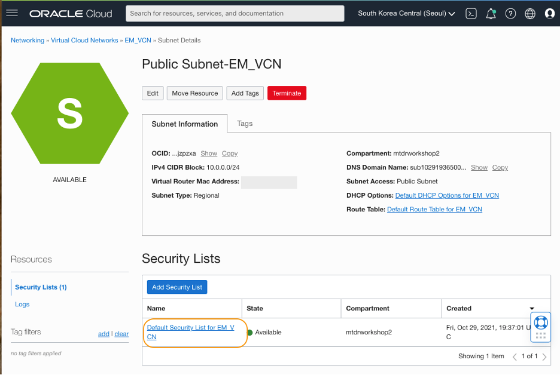

7.  In the **Security Details** page, click **Add Ingress Rules** button.

   

8. In the **Add Ingress Rules** window, enter the following information. Specify the JVMD SSL port you obtained in the earlier step in this tutorial (Tutorial 8, Task 1, Step 2) in the **Destination Port Range**. In this example, JVMD SSL port is 7301.

     Ingress Rule 1:
      * Stateless: **No**
      * Source CIDR: **0.0.0.0/0**
      * IP Protocol: **TCP**
      * Source Port Range: **All**
      * Destination Port Range: **7301**
      *  Description: **JVMD SSL upload port**

   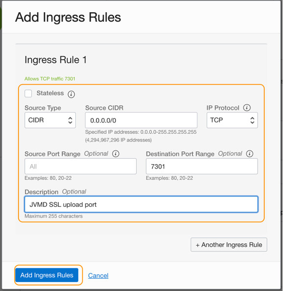

   Click **Add Ingress Rules** button.

9. In the In the **Security Details** page, **Ingress Rules** section, verify the rule was added to the security list.

   

10. Open a terminal window (or a Putty connection) on your computer, type the following to open an SSH connection to the OMS host.

    ``` bash
    <copy>
    ssh opc@<OMS-Instance-Public-IP> -i "<path-to-the-private-key>/id_rsa"
    </copy>
    ```
    E.g., $ ssh opc@123.456.12.26 -i "/Users/labuser/rsa/id_rsa"

11. Once logged on to the OMS host, run the command below to configure the firewall settings. The image example opens a port 7301 in the OMS host.

    ``` bash
    <copy>
    sudo firewall-cmd --zone=public --permanent --add-port=7301/tcp
    sudo firewall-cmd --reload
    </copy>
    ```

   

12. Type exit to logout from the OMS instance and close the terminal.

   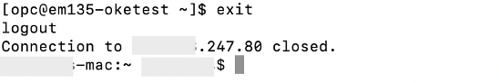


## **Task 2**: Edit hosts files in WebLogic Server containers


1.  Launch the Oracle Cloud Shell, run the ***oci ce cluster create-kubectl*** command which you saved in the Tutorial 1, Task 1, Step 7.

   

2. Run the ***kubectl get svc*** command below to list the services in the namespace.  

    ``` bash
    <copy>
    kubectl get svc -n sample-domain1-ns
    </copy>
    ```
    Write down the service names for the WebLogic Servers. The image below shows an example, where the service names are **sample-domain1-admin-server**, **sample-domain1-managed-server1** and **sample-domain1-managed-server2**.

   

3. Execute the ***kubectl exec*** command below and log on to the Admin Server pod.  

    ``` bash
    <copy>
    kubectl exec -it sample-domain1-admin-server -n sample-domain1-ns -- /bin/bash
    </copy>
    ```
   

4.  Add OMS host information to the ***hosts*** file. You will need to install the vi tool, as there is no editor installed in the pod.

    ``` bash
    <copy>
    yum -y install vi
    </copy>
    ```

   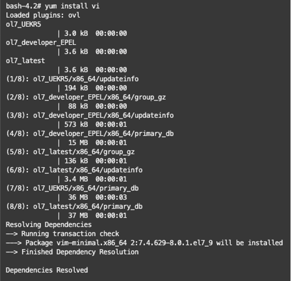


   

5. Open the ***hosts*** file with the vi editor.

    ``` bash
    <copy>
    vi /etc/hosts
    </copy>
    ```

6. Add the **Public IP address** and **FQDN (hostname)** of the OMS instance, which you collected earlier in the steps (Tutorial 8, Task 1, Step 5), in the format: **<Public IP> <FQDN>** to the hosts file.  

    E.g., 123.456.789.10 em135-oketest.sub1234567800.emvcn.oraclevcn.com

    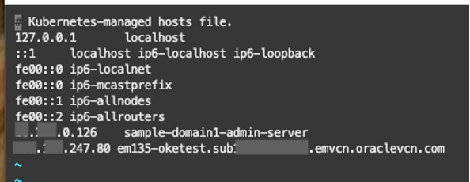

    Save and close the file with ***esc + :wq***.

7. Type exit to go back to the Cloud Shell.

    ``` bash
    <copy>
    exit
    </copy>
    ```
    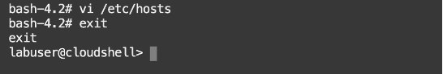

8. Repeat the above steps from 2 to 7 for the managed servers and edit the ***hosts*** file for each WebLogic Server pod. You can log on to the managed server pods with the below ***kubectl exec*** commands.

    ``` bash
    <copy>
    kubectl exec -it sample-domain1-managed-server1 -n sample-domain1-ns -- /bin/bash
    </copy>
    ```

    ``` bash
    <copy>
    kubectl exec -it sample-domain1-managed-server2 -n sample-domain1-ns -- /bin/bash

    </copy>
    ```


## **Task 3**: Download JVMD agent and upload to the WebLogic Server pod

In this task, you will download ***jamagent.war*** from the EM console.  

1. In in the EM console, select **Setup** > **Middleware Management** > **Engines and Agents**.

2. In the **Engines and Agents** page, click **Download JVMD Agent**.

    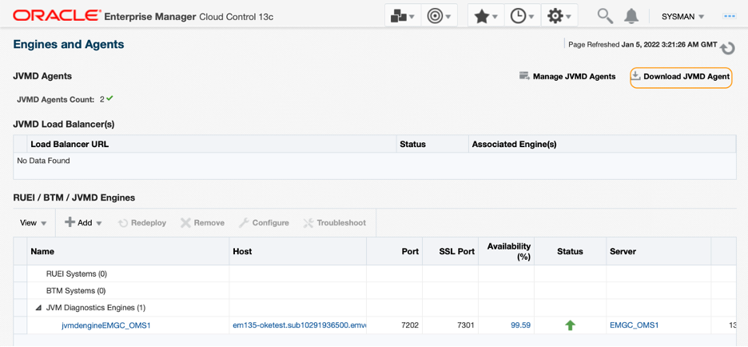

3. In the **Download JVM Diagnostics Components** window, select **JVMD Agent** from the pull-down menu. Click **OK**.

    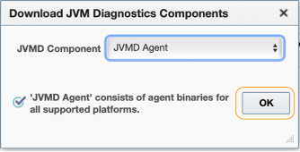

4. In the **JVM Diagnostics Agent web.xml Parameters** page, accept the default settings and click **Download**.

    

5. Click **Allow** on the dialog.

    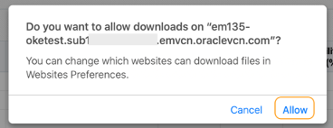

6. Confirm the ***jamagent.war*** file was downloaded.

    

7. In the Oracle Cloud Shell title bar, click the three-bars icon (three-bar icon) to open the menu. Select **Upload**.

    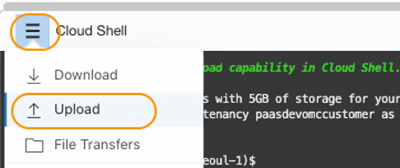

8. Click **select from your computer** link.

    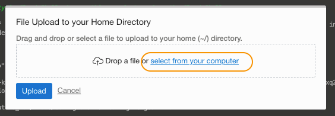

9. Go to the download folder, select the ***jamagent.war*** file downloaded from the EMCC. Click **Open**. Then click Upload. This will **upload** the file to the home directory in the Cloud Shell.

    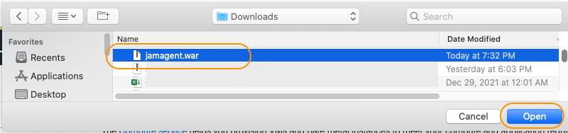


10.  Wait for the File transfer completes, then type the ls command in the Cloud Shell to display the files in the current directory. Confirm the ***jamagent.war*** exists in the home directory.

    ``` bash
    <copy>
    ls
    </copy>
    ```
    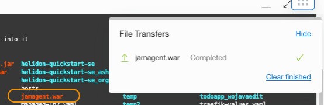

11.  Next, transfer the ***jamagent.war*** file to the pod by running the following command.

    ``` bash
    <copy>
    kubectl cp jamagent.war  sample-domain1-ns/sample-domain1-admin-server:/u01/oracle/user_projects/domains/sample-domain1
    </copy>
    ```
12. Log on to the admin server pod with the following command. Then hit ls command to list the files in the directory.

    ``` bash
    <copy>
    kubectl exec -it sample-domain1-admin-server -n sample-domain1-ns -- /bin/bash

    ls
    </copy>
    ```
13. Confirm ***jamagent.war*** was copied to the **sample-domain1** directory in the pod.

    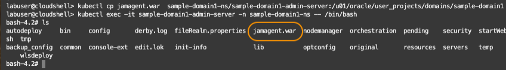

14. While still in the container, enter exit to go back to the Cloud Shell.

    ``` bash
    <copy>
    exit
    </copy>
    ```


## **Task 4**: Install JVMD agent to the WebLogic Servers


1. Once the ***jamagent.war*** file was uploaded to the pod, you can deploy it using the WebLogic Administration Console web application. Run the following command to see the external IP of the Traefik load balancer.

    ``` bash
    <copy>
    kubectl get svc -n traefik
    </copy>
    ```
    The output should be similar to the image below. Note down the External-IP.

    

 2.   On your computer, start a browser and log on to the WebLogic Administration console, with the following URL:

     ``` bash
     <copy>
     http://<External IP of the Traefik load balancer>/console
     </copy>
     ```
     * Username: weblogic
     * Password: Password generated in the WebLogic workshop, Lab 4, Step 1

    

3. Click **Deployments** from the **Domain Structure** tree view.

    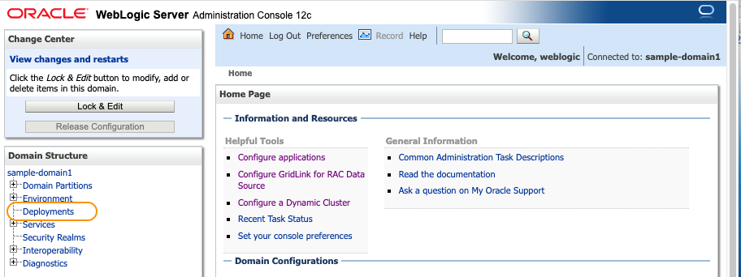

4.  In the **Change Center** section, click **Lock & Edit**.

    

5. In the **Summary of Deployments** section, **Configuration** tab, click **Install**.

    

6. Navigate to the path:  ***/u01/oracle/user_projects/domains/sample-domain1*** in the tree view. Select ***jamagent.war***.  Click **Next**.

    

7.  Ensure **Install this deployment as an application** is selected. Click **Next**.

    

8. Add check to **admin-server** and **all servers in the cluster**. Click **Next**.

    

9. Accept the default values and selections.  Click **Next**.

    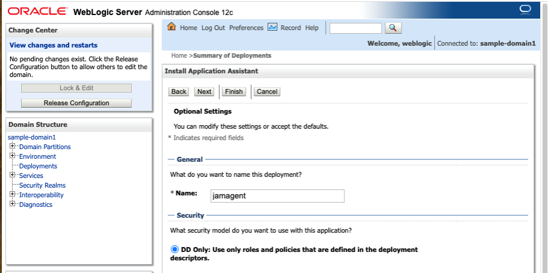

10. Click **Finish**.

    

11. In the **Change Center** section, click **Activate Changes**.

    

12. Click **Deployments** from the Tree view.

    

13. Confirm that **jamagent** is listed in the **Deployments** and the State is **Prepared**. Click **Control** tab.

    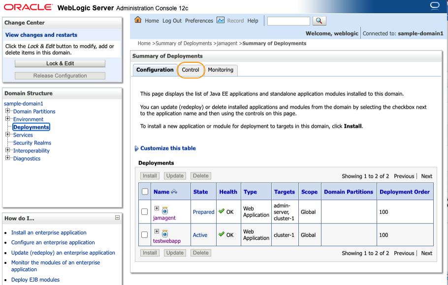

14. Add check to the **jamagent**j and click **Start**.

    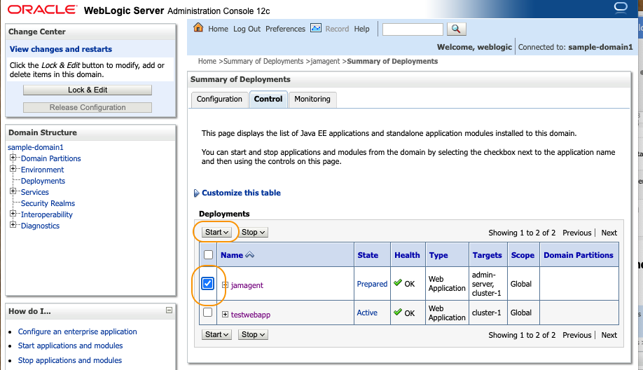

15.  From the pull-down menu, select **Servicing all requests**.

    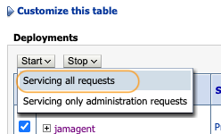

16. In the **Start Application Assistant** section, click **Yes** on **Start Deployments**.

    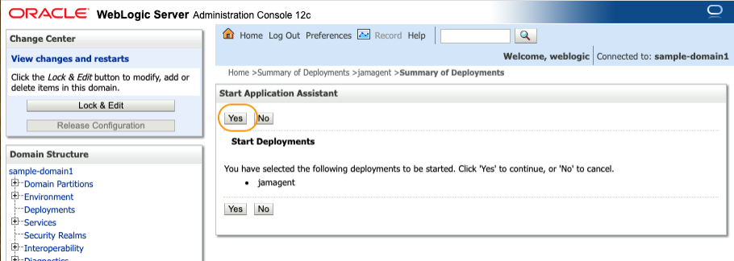

17. In the **Summary of Deployments** section, verify the Status of the **jamagent** is Active in the **Deployments** table.

    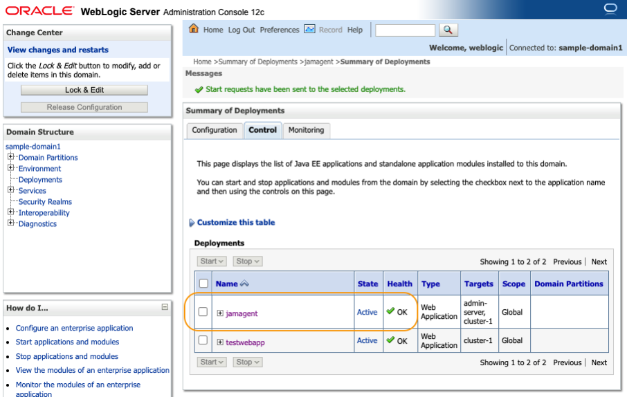

18. Log on to EM console, navigate to the **Middleware** home page. You should see the **JVM Pool** target and **JVM** targets for WebLogic Servers added under the **Default** JVM Pool target. Note that it may take few minutes to see the target status updated. Click the **admin-server_jvm** node.

    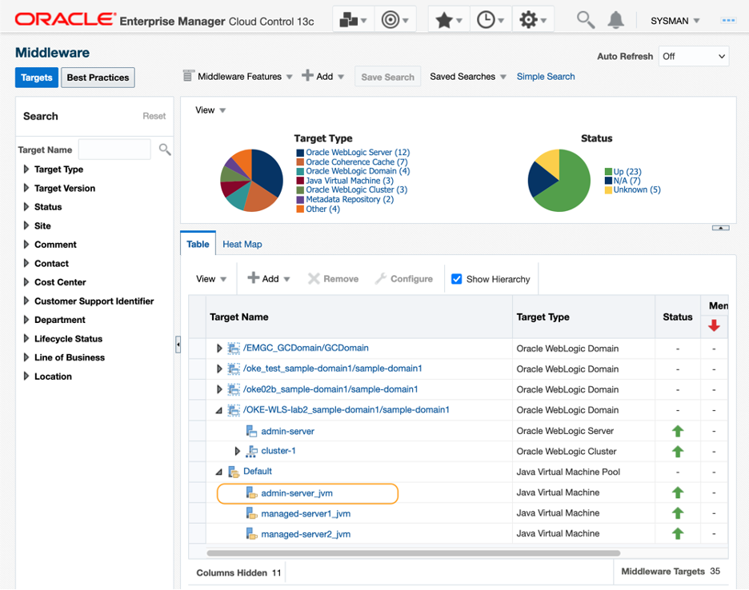


    > **NOTE:** You will see the JVM targets appear under a **Default** JVM pool target, and not associated with your OKE WebLogic Domain. This happens because the IP that is registered in the EM is that of the Kubernetes load balancer service, and not of the actual host where JVM runs. You can manually add the association to the WebLogic Domain target, which is explained in the next task.


19. In the JVM target home page, observe that data is coming in to the EMCC.

    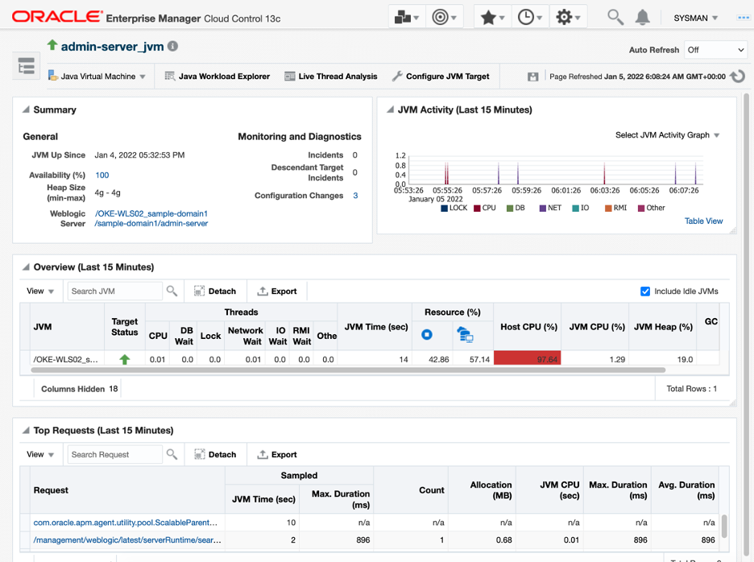


## **Task 5**: Associate JVM targets with the WebLogic domain


When a JVMD agent is deployed manually to a WebLogic Server in the Kubernetes cluster, JVM targets appear under the **Default** JVM pool target in the EM console, and it is not associated with the WebLogic Domain. In this task, you will manually add associations of the JVM targets to the WebLogic domain target.

1. In EM console, go to the Middleware Home page. Click Default JVM pool target from the table.

    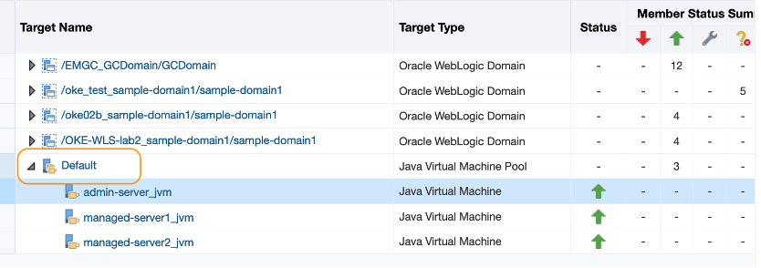

2.  In the JVM target home page, select **Java Virtual Machine Pool** > **Manage and Troubleshoot JVMD**.

    

3.  Click Manage Association tab.

    

4. Select JVM target of the admin server, then click **Associate**.

    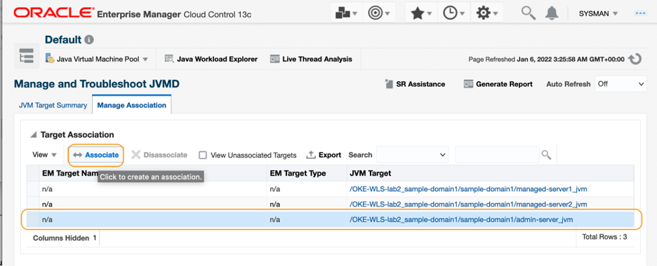

5. In the **Select Targets** window, select WebLogic Admin Server target from the OKE-WLS domain, then click **Select**.

    

6. Click **OK** on the **Confirmation** window.

    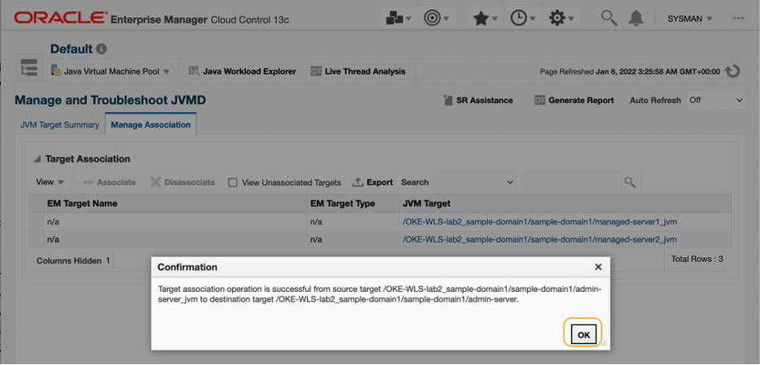

7. Repeat the steps 4 to 6 for the managed servers.

    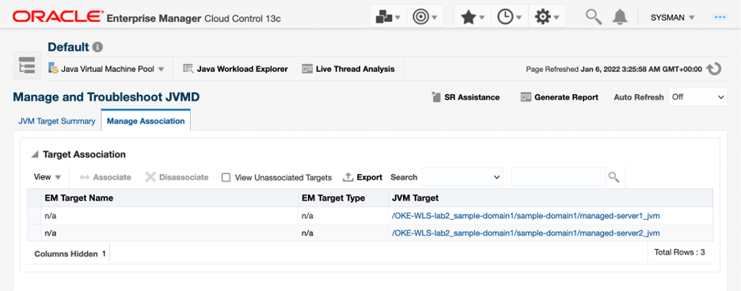

8.  Navigate to the **Middleware** home page and confirm the JVM targets are associated with the OKE-WLS Domain. Now you can remove the empty Default JVM Pool target. Click the **Default** target from the table.  

    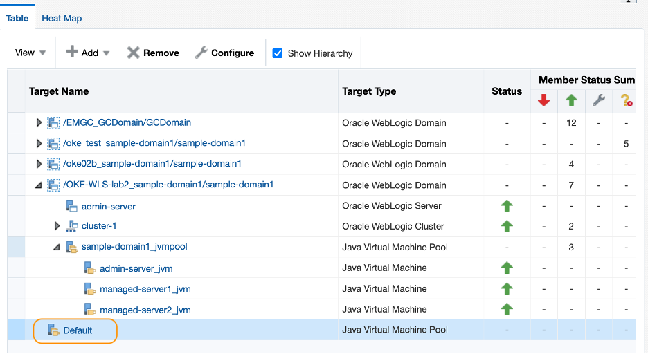

9. In the JVM target home page, select **Java Virtual Machine Pool** > **Target Setup** > **Remove Target**.

    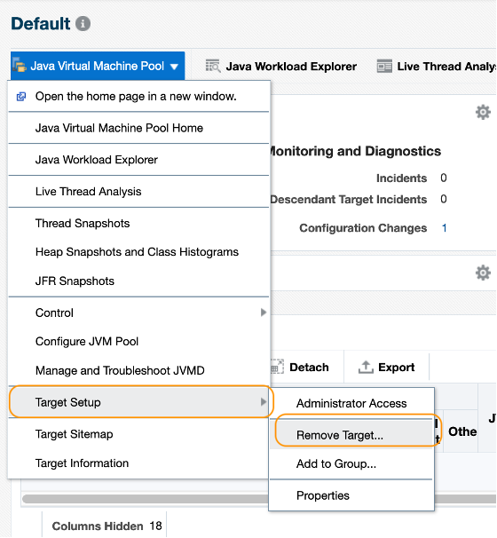

10. Click **Delete JVM Pool Target** button.

    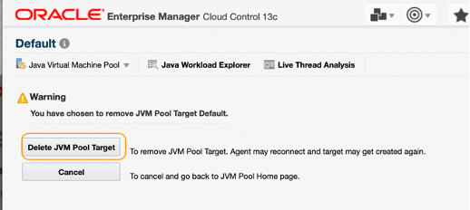

11. In the Middleware home page, confirm the Default JVM target is removed from the table.

    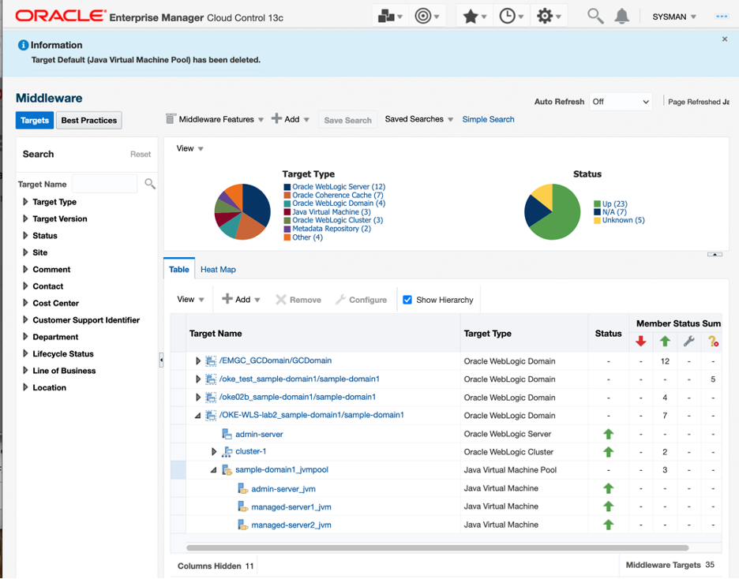


## Conclusions

In this workshop you’ve learned how to add Kubernetes load balancer services to OKE, configure security rules restricted to EM monitoring, set up an EM agent in the Oracle Cloud, remotely discover the WebLogic domain deployed on OKE, and monitor JMX based metrics and configurations from the WebLogic Server targets using EM. You also learned that monitoring of the target continues even after the pods are regenerated, and how to manually set up JVM Diagnostics for the WebLogic Servers on Kubernetes.

Oracle Enterprise Manager Cloud Control is an on-premises based solution that can provide a monitoring solution for Oracle WebLogic Servers deployed either on on-premises, or in a Kubernetes cluster in the Oracle Cloud or in other cloud platforms.

Additionally, you can configure **Oracle Cloud Infrastructure Application Performance Monitoring (APM)** Java Agent and monitor traces and spans of the WebLogic based application runs on Kubernetes. Refer to **[Oracle LiveLabs Use OpenTracing for WebLogic on Kubernetes utilizing Oracle Application Performance Monitoring](https://apexapps.oracle.com/pls/apex/dbpm/r/livelabs/view-workshop?wid=932)** workshop for details.


## Acknowledgements

* **Author** - Yutaka Takatsu, Product Manager, Enterprise and Cloud Manageability
- **Contributors** -
Rupesh Kumar, Consulting Member of Technical Staff,  
Renjit Clement, Principal Member Technical Staff,  
Ravi Mohan, Senior Software Development Manager,  
Steven Lemme, Senior Principal Product Manager,  
Mahesh Sharma, Consulting Member of Technical Staff,  
Avi Huber, Senior Director, Product Management
* **Last Updated By/Date** - Yutaka Takatsu, March 2022
