# Assess and Assure Security Posture Across Your Fleet of Databases

## Introduction

Learn how to secure and ensure compliance of your enterprise databases in this workshop. Discover methods to monitor their security, validate configurations, and automate compliance with company, industry, and regulatory standards like CIS and STIG. Explore using Oracle Enterprise Manager to automate inventory and baseline all database targets, including various versions and instances deployed over time.

*Estimated Time*: 65 minutes

### Safeguard Database assets with Fleet Maintenance Hub

***Fleet Maintenance Hub*** is a new, all-in-one User Interface (UI) for upgrading and updating Oracle Databases and Grid Infrastructure. It detects vulnerabilities and offers precise patch recommendations through an intelligent, and guided workflow. You can create a gold image with these recommended patches to secure your assets. Additionally, Fleet Maintenance Hub provides flexible scheduling options for near-zero downtime during upgrade and patching operations. After patching, it delivers compliance insights to help you assess alignment with your patching policies, enhancing your security posture.

### Securing Databases with Industry Standards and Best Practices
***Audit for Compliance*** - protecting your customer data is the most critical goal. Implement security controls that restrict access according to your policies, whether based on industry security standards or custom best practices. Achieve a comprehensive view of overall security compliance across all managed database targets to ensure these controls are effectively enforced and managed for compliance.


### Objectives

In this lab, you will perform the following steps:
| Step No. | Feature                                                    | Approx. Time | Details                                                                                                                                                                    | Value Proposition |
|----------------------|------------------------------------------------------------|-------------|----------------------------------------------------------------------------------------------------------------------------------------------------------------------------|-------------------|
| 1                    | Assess patch recommendation and create gold image                             | 15 minutes  | Assess patch recommendations for affected databases                                                                                                                 | Fortify against vulnerabilities with precise Patch Recommendations.                  |
| 2                    | Secure databases by updating with new gold image | 25 minutes  | Intuitive workflow to update and secure your databases | Update Databases with new gold image for Enhanced Security.                   |
| 3                    | Elevate security posture by auditing for compliance | 25  minutes  | Leverage CIS Benchmark for Oracle Database 19c to secure Pluggable Databases | Drive continuous improvements with insightful Compliance Audits.


### Prerequisites
- A Free Tier, Paid or LiveLabs Oracle Cloud account
- You have completed:
    - Lab: Prepare Setup (*Free-tier* and *Paid Tenants* only)
    - Lab: Environment Setup
    - Lab: Initialize Environment

*Note*: This lab environment is setup with Enterprise Manager Cloud Control Release 13.5 and Database 19.10 as Oracle Management Repository. Workshop activities included in this lab will be executed both locally on the instance using Enterprise Manager Command Line Interface (EMCLI) or Rest APIs, and the Enterprise Manager console (browser)

## Task 1: Assess patch recommendation and create gold image

In this task, you will review patch recommendations for existing gold images and create a new version based on those recommendations.


1. Login to Enterprise Manager as user - emadmin. Copy and paste or type in the following username and password credentials into the fields.


    ```
    Username: <copy>emadmin</copy>
    ```

    ```
    Password: <copy>welcome1</copy>
    ```

   

2. Once logged in, navigate to ***Targets >> Databases***  

    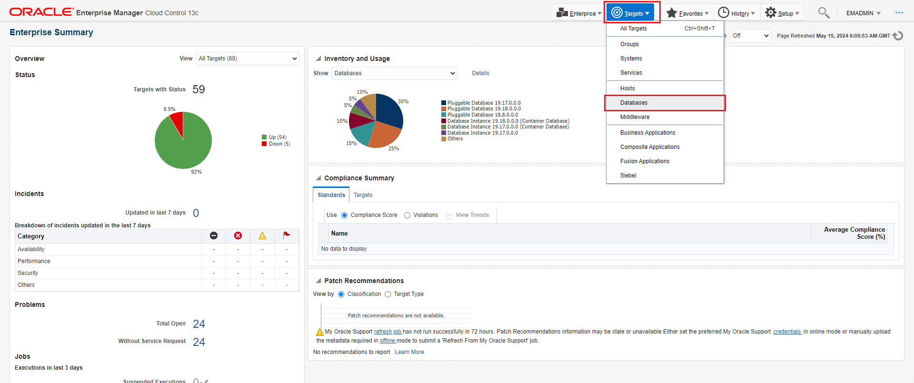

    and then ***Administration >> Fleet Maintenance Hub***

   

3. Fleet Maintenance Hub is your one-stop solution for end-to-end patch assessment and operations.

    

    In the top right corner, you see the status of ***Last Patch Recommendation Update***. If a date is shown below it, then the patch recommendation was executed on that date.

<!--
To setup patch recommendation, review [Oracle Enterprise Manager](https://docs.oracle.com/en/enterprise-manager/cloud-control/enterprise-manager-cloud-control/13.5/emlcm/downloading-patch-recommendations-and-patches.html).
-->


<!--
   To successfully complete this lab, do not upload any new patch catalogs or enter your MOS credentials as described in the above documentation. Doing so will generate new recommendations that may differ from those in the upcoming sections.
-->


4. Click on Tile 2 in labeled as Patch Recommendations for Images.

    The donut chart in this tile indicates the health of your gold images. Green indicates, the number of gold images have all the recommended patches, and these images can be used for upgrade or update operations.

    Red indicates, the number of gold images are missing critical recommended patches and must refreshed before using it for upgrade or update operations. You should reach out your Administrator to refresh the image with all recommended patches.

    

    As an example, ***19cDB-Linux-x64-ERP*** gold image has two patch recommendations. This indicates ***19cDB-Linux-x64-ERP*** image must be refreshed to a new version that includes two recommended patches.

    Similarly, ***19cDB-Linux-x64-APPS*** has a green checkmark. This indicates ***19cDB-Linux-x64-APPS*** image is up to date and can be used for patch operations

    For this lab, we will use the ***19cDB-Linux-x64-APPS*** image to perform pdb patching.

<!--
Follow the [Link](https://docs.oracle.com/en/enterprise-manager/cloud-control/enterprise-manager-cloud-control/13.5/emlcm/image-maintenance-ui.html) to understand the steps involved in refreshing a gold image.
-->

5. In the next few steps, we will use the Fleet Maintenance Hub to refresh gold image ***19cDB-Linux-x64-ERP***.

    While the image refresh process is running, to complete the lab within the given timeline, we will use ***19cDB-Linux-x64-APPS*** to secure one of the databases.

6. Let's refresh the gold image - ***19cDB-Linux-x64-ERP***

    As observed in step 4, ***19cDB-Linux-x64-ERP*** has two patch recommendations.

    

    Click on the numeric value 2.

    A new slideout will appear.

    

7. The next step is to create a new version in 19cDB-Linux-x64-ERP that will include the recommended patches.

    Close the slideout.

    

    Click on the ***"Create New Version"*** link under the Patch Recommendation column.

    Alternatively, click on the menu under Actions and create a new version.

8. In the new window, we need to provide source details, which act as input for version creation and version details.

    In the left-hand section, we first select the Oracle Home, which will be used as the source Oracle Home.

    

    - Select Oracle Home.
      1. Click on the ***Select Oracle Home*** button. In the new screen select the Oracle Home ending with ***3383***.
      2. Select Include Patches.
      3. Select one of the radio buttons. You can either choose to clone the above selected Oracle Home, apply recommended patches to the cloned Oracle Home, and then use this home to create a new version. Alternatively, you can select the option to patch the Oracle Home and use it to create a new version.
      We will select the latter option - ***Patch the selected Oracle Home***, as shown in the image.

    - Under Work Directory, provide location where logs will be created. You may enter location as ***/tmp/u01***
    - Credentials - Provide Normal and Privileged Credentials to complete this operation.

        For Normal Host credentials, from the drop down select ***ORACLE***.
        For Privileged Host credentials, from the drop down select ***ROOT***.

    In the right hand section, provide
    - New version name that we are creating. You may enter ***v19.23DBRU***
    - Select Storage options. This will determine the source and location where the new version will be saved. We will select the default values as shown in the image.


    Click ***Next***.

9. In this screen, select the two patches that we have already downloaded and uploaded in the software library.

    

    Click ***Next***.

10. In the next page, review the selections that we made on the previous screen. Then, click on ***Submit*** to initiate the operation to create a new version.

    

11. Once you submit, a new Deployment Procedure (DP) is initiated. Click on the DP name to review the steps.

    

    lets stay on the DP page for 2 minutes.

    Note: The submitted Deployment Procedure above may fail. If you encounter the error below, click on "Ignore" and select "OK" in the confirmation window.
    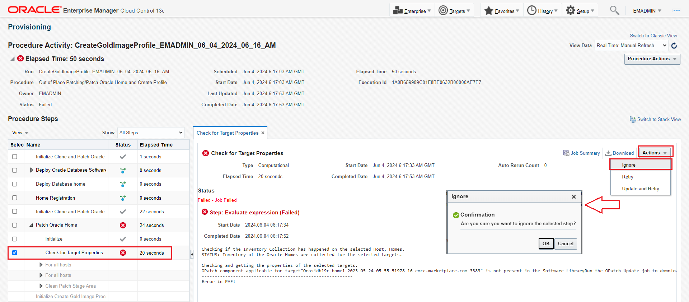

    However, to complete this lab, as mentioned earlier, we shall use ***19cDB-Linux-x64-APPS*** image to update a pluggable database. Let’s proceed to the next step.

## Task 2: Secure databases by updating with new gold image

In this task, we will perform Pluggable Database patching.

1. Lets navigate to Databases Homepage, by clicking on ***Targets >> Databases***.

   

    You see ***Finance PDB*** under sales.subnet.vcn.oraclevcn.com CDB is at 19.17 version level. You will patch this to version 19.23. As part of this update, you need to choose a CDB at 19.23 version level. For this lab, we will use ***hr.subnet.vcn.oraclevcn.com***. After update is completed, Finance PDB will reside in this new CDB at 19.23 version level.

    

    Lets complete below steps to perform the pdb patching.

2. Subscribe sales CDB to goldimage ***19cDB-Linux-x64-APPS***.

    Navigate to Fleet Maintenance Hub, by clicking on ***Administration >> Fleet Maintenance Hub***

    

    To patch a database, you must subscribe the target database to a gold image. You can subscribe a database to one image only, but an image can have multiple databases subscribed to it.

    In the Fleet Maintenance Hub, under the "Target Subscription" tab in Tile 1, follow these steps:

    - Click on the ***Subscribe*** button.
    - Select filter ***19*** under Release.
    - From the dropdown, select the goldimage - ***19cDB-Linux-x64-APPS***.
    - From the list of databases, select ***sales.subnet.vcn.oraclevcn.com***.
    - Click on ***Subscribe*** at the top right corner.

    

    Upon completion, click on ***Close***.

3. Navigate to Tile 3 - ***Target Patch Compliance*** in the Fleet Maintenance Hub.

    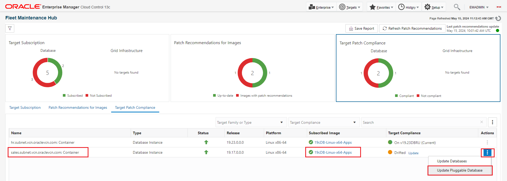

    In tile 3, we see that the sales CDB is associated with goldimage ***19cDB-Linux-x64-APPS***.
    Under Target Compliance columns, we see that the CDB is drifted and needs to be patched. In this lab, we will perform a PDB level patching.

    Click on the menu under Actions for the sales CDB, and select ***Update Pluggable Database***. This will launch the operator UI of Fleet Maintenance.

4. We are now at the Operator UI screen, with pre-selected values for Gold Image, Target Type and Operation.

    

    Select Finance pdb and click ***Next***.

5. In this page, we will select relevant options and enter values wherever required.

    - Under Maintenance Task, select ***Attach Existing CDB***.
    - Under Attach Existing CDB, review the source CDB, which is ***sales.subnet.vcn.oraclevcn.com*** (19.17).
    - Under Destination CDB, select ***hr.subnet.vcn.oraclevcn.com*** (19.23).
    - Under credentials, select values from the drop-down menu as per the image.
        - Normal Host Credentials as ***ORACLE***
        - Privileged Host Credentials as ***ROOT***
        - SYSDBA Database Credentials as ***SYS_SALES***
    - Under Work Directory, enter ***/u01/tmp***
    - Under Options section, select ***Yes*** for Skip Cluster Verification Utility Checks.

    

    Click ***Next***.

6. Click on ***Validate*** and then select ***Quick Validation***.

    

    Once you receive the successful validation message, click ***Close*** and then hit ***Submit***.

7. A new dialogue box will ask for the name of the deployment procedure.
    This unique name will allow you to track the operation. We have provided the name "Demo_update".

    

    Copy and paste or type in the following into the Submission Procedure Name prefix.

        ```
        <copy>Demo_update</copy>
        ```

8. There are two Deployment Procedure submitted.
    - Attach Existing CDB
    - Update PDB

    Click on ***Monitor Progress***, which will open a new window.

    

9. In the new page, under search, enter ***Demo*** so that you only see the two Deployment procedures associated with this lab.

    

    We see that the Deployment procedure with the name "Attach" has completed successfully.

    Let's click on the Deployment procedure with the name "Update" and review the steps performed.

    

9. With both Deployment procedures completed successfully, let's go back to the databases homepage by navigating to ***Targets -> Databases***.
    

    We see that the Finance PDB has moved out of the sales CDB and is now plugged into the HR CDB, running at version 19.23


## Task 3: Securing Databases with Industry Standards and Best Practices

Now that you have applied security patches to your pluggable database, you want to ensure the configuration, access and user privileges are secure and audit for compliance with CIS Benchmarks which is the industry standard.

Enterprise Manager provides solution to secure and ensure compliance with security policies defined by your security office and auditors. With this solution, you can secure the entire stack from databases, underlying Linux hosts and Exadata infrastructure with out-of-box security controls.  


For Oracle Databases 12c and 19c, CIS Benchmark is an industry compliance standards that is available out-of-the-box. Besides that, Department of Defense (DoD) Security Technical Implementation Guide (STIG) standard is available out-of-the-box for regulatory requirements.

Leverage the built-in SCAP engine on Linux hosts to meet security standards like STIG, PCI-DSS, and HIPAA.

Finally, for Exadata family of Engineered Systems, compliance standards tied to Autonomous Health Framework (AHF) Exachk is available out-of-box.

In this lab, you will get hands-on experience with ***Oracle 19c Database CIS V1.1.0 - Level 1 - RDBMS using Unified Auditing for Oracle Pluggable Database*** to secure configuration of database.

Center for Internet Security (CIS) benchmark for Oracle database provides comprehensive set of security controls, and configuration guidelines to secure against cyber threats and data breaches. It enables in keeping your databases security posture at elevated levels and check for compliance with your auditors.

Lets start the lab.

To begin, lets take a look at available CIS Benchmarks and choose one of them for associating a database target for security assessment.

1. From the Enterprise menu, select **Compliance, then select Library**.

    

2. Click the **Compliance Standards** tab.

    You will list of out-of-box Compliance Standards. Lets' look for CIS Benchmarks.

    Search for "Oracle 19c Database CIS".

    In the **Applicable To** dropdown, select **Pluggable Database**.

    Click **Search**.

    

    Select the row **Oracle 19c Database CIS V1.1.0 - Level 1 - RDBMS using Unified Auditing for Oracle Pluggable Database**.

    Click **Associate Targets**.

    

3. Click **Add** and Select **hr.subnet.vcn.oraclevcn.com_FINANCE** PDB you wish to associate.

    In the **Target name**, type **_FINANCE** and click **Search**.

    

    Choose  **hr.subnet.vcn.oraclevcn.com_FINANCE**.

    Click Select.

    

4. Verify the PDB selected and click **OK**.

    

    In the Save Association dialog box, click **Yes**.

    

5. Click **OK** on the Information pop-up window.

    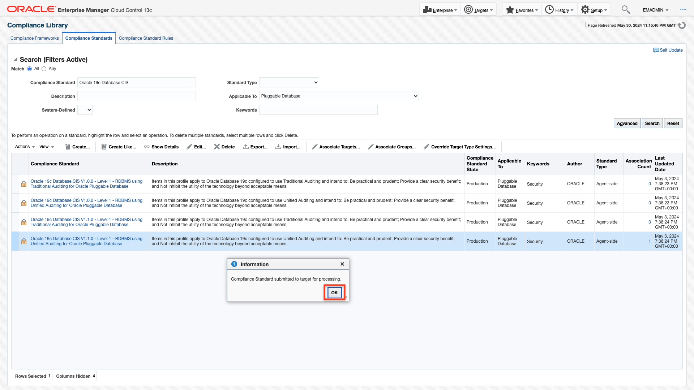

6. Compliance Results Analysis

    You have completed one-time setup process.

    Lets' analyze the results.

    Now, Navigate to ***Enterprise >> Compliance >> Dashboard***

    

    At this point, all CIS security controls is getting processed, will take approximately few minutes to complete.

    Refresh the icon   ***in top right of Compliance Dashboard page***.

    

    In this dashboard, you can explore each dashlet:

    **Targets Evaluated:** Summarizes the number of databases, hosts, and Exadata and it components assessed for compliance, highlighting the scope of compliance monitoring across the IT environment.

    **Violation and Errors:**  A pie chart showing compliant, warning, and non-compliant statuses, highlighting the proportion of violations and errors for quick identification of areas needing attention.

    **Open Security Incidents numbers:** Displays current open security incidents, including affected targets, severity, and remediation status for timely resolution and prioritization.

    **Compliance Standard score Distribution:** Shows the distribution of compliance scores across different targets or policies, highlighting overall compliance health and areas needing improvement.

    **Compliance Violations by Target type:** Breaks down violations by target type (e.g., databases, hosts, Exadata), identifying problematic areas and pinpointing systems prone to compliance issues.

    **Compliance Summary:** Provides an overview of Targets Compliance status, key metrics about violations, average compliance scores, and comprehensive Report, facilitating targeted efforts to meet compliance standards.

7. At the bottom of the page, you will see Compliance Summary section.

    Click on Standards tab to see the results of CIS Benchmark assessment.

    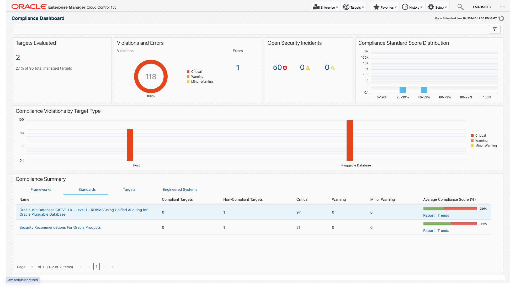

    You will see details of the assessment like number of Compliant Targets, Non-Compliant Targets, Critical, Warning, Minor Warning and Average Compliance Score.

    Click on Non-Compliant Targets number, pop-up window shows Targets showing the Compliance Score.

    This indicates **hr.subnet.vcn.oraclevcn.com_FINANCE** target Compliance score is only 39% against the CIS benchmark baseline.

    Next step is to analyze the violation and remediate to make this a compliant target.

    

    Click on 'x' to close.

8. Let us analyze the severity

    Click on **Critical** number, you will see unique violations for this target.

    

    Expand the name hr.subnet.vcn.oraclevcn.com_FINANCE caret-right  icon.

    You will see the details of the evaluation.

    You will get the comprehensive view of the violation.

    You can see

    - Specific rule that has violated
    -  Date when it was last evaluated
    -  Name of the rule
    -  Rationale for the violation
    -  And recommended remediation

    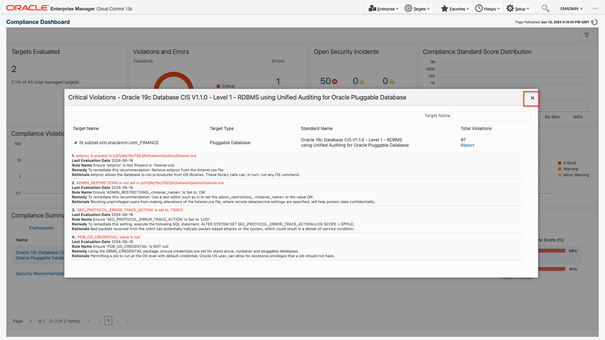

    Click on 'x' to close.

    Similarly, we can explore Warning and Minor Warning violations if they exist.

9. Let us drill down to results.

    Click on **Standards >> Name** and let us remediate one of the solution.

    You will see "97" violations number going down to "96".

    

    You will be presented with the **Compliance Results**, including the target violations against the selected standard, as well as its score and last evaluation date.

    Next, click on 'Oracle 19c Database CIS V1.1.0 - Level 1 - RDBMS using Unified Auditing' in the navigation tree.

    You will see the main CIS categories along with their corresponding CIS control rules and any violations.

    The Target Scorecard pie chart displays the overall compliance evaluation status of the monitored target, summarizing its adherence to defined CIS benchmark security policies.

    The Rule Evaluations pie chart represents a summary of each rule evaluation status — compliant, critical, warning, minor warning, and error in terms of the percentage of rules.

    

    Results by Target tab shows number of violations occurred, score and latest target evaluated date.

    

    Let us click on Violations number.

10. In the **Violations** window, you will find failed Compliance Standard rule description along with the Violation Count.

    

    Click on Violation Count.

    You can export to Excel for offline analysis.

    

    Click on 'Back'

    

    Click on 'Close'

11. Let us select **Violations** tab.

    This table provides comprehensive details for each rule, target name, applicable pluggable database, and violation severity with keywords.

    You can select an individual violation to view its detailed statement and recommended actions for quick remediation.

    

    Click on Summary tab.

12. Click on caret-right  icon.

    Explore each main category controls' **Violations**.

    Let us select violation **Ensure 'DBA' Is Revoked from Unauthorized 'GRANTEE'**.  

    Corrective Actions enable immediate responses to events like incidents.

    This corrective action minimizes the need for manual intervention and maintains consistent compliance with established CIS benchmark.

    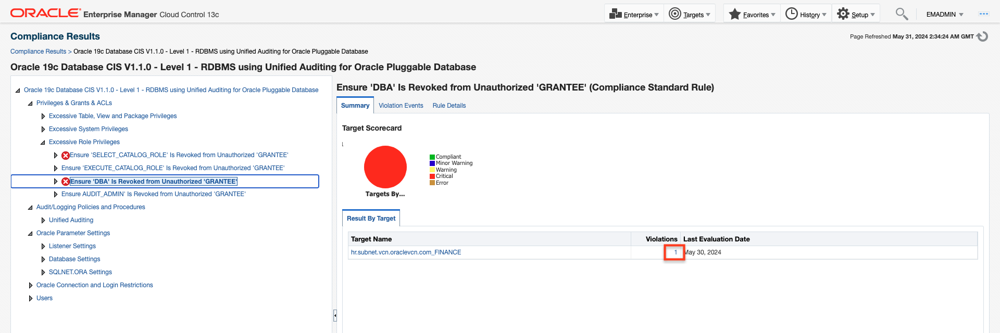

13. You will notice that the "Unauthorized user 'IX' has been assigned the DBA role".

    The Oracle DBA role grants powerful administrative privileges for configuration changes and access to sensitive information. 'IX' should not have this role.

    

    Click **Close**.

14. Click on the **Rule Details** tab.

    You will find detailed rule information including severity and recommended remediation.

    

15. Click on the **Violation Events** tab.

    This will provide you essential information about violation details about user, who has a elevated DBA privilege, which should be revoked.

    

    To access the table row section, click on it.

16. You will find **Event details** on violated rule information, violation details, and a guided resolution option for recommendations.

    

    Click on **Corrective actions**.

    You will see the **Corrective Actions** pop-up window.

    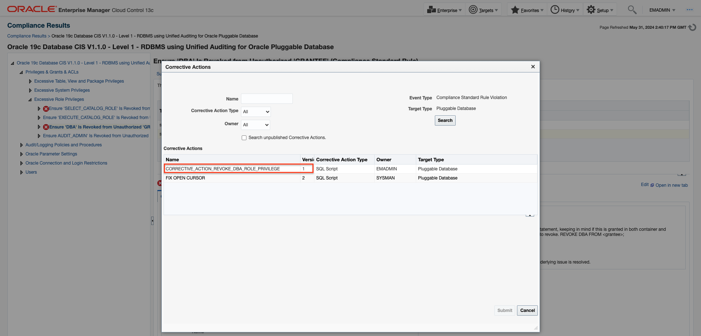

    Don't forget to select the row labeled **CORRECTIVE\_ACTION\_REVOKE\_DBA\_ROLE\_PRIVILEGE**.

17. You will find the **Database Credentials** and **Host Credentials**.

    

    Remember to choose **Preferred** for both credentials and then click **Submit**.

18. You will be presented with a pop-up window for  **Corrective action**.

    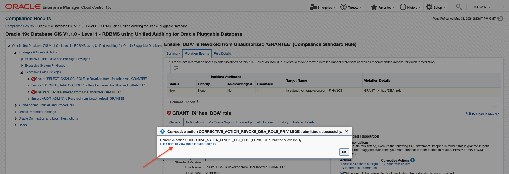

    Click to view execution details.  

19. You will notice that the DBA role job was successfully revoked upon refreshing the icon  in Jobs page.

    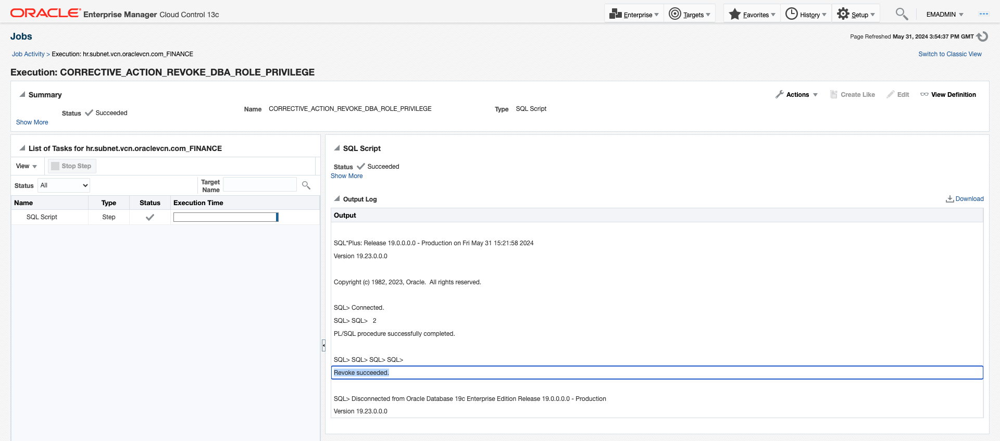

20. You will view the remediated status for the pluggable database.

    Now, Navigate to ***Targets >> Databases***.

    

21. You will see the **hr.subnet.vcn.oraclevcn.com_FINANCE** PDB in the Name.

    

    Click on the selected PDB, you will be navigated to the PDB database page.

    

22. Now, Click on ***Oracle Database >> Configuration >> Latest***.

    

    You will see the latest configuration.

    

    Click **Refresh**.

23. **Processing** will take about few minutes to complete and get refreshed.

    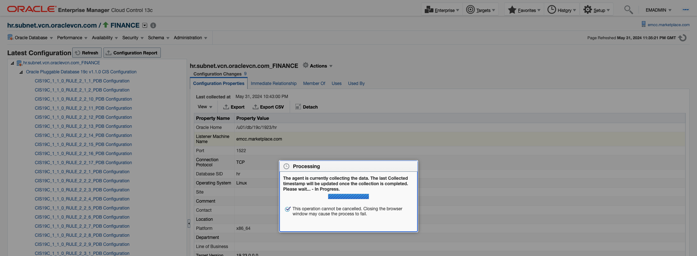

24. Now, Navigate to ***Enterprise >> Compliance >> Results***.

    

25. You will be directed to the **Compliance Results** page, where you will notice a reduction in violations from **97 to 96**.

    

    Click on Compliance Standards **Oracle 19c Database CIS 1.1.0** Results.

26. You will see the details of the **Compliance Standards Results**.

    Verify the selected violation: **Ensure that 'DBA' is revoked from unauthorized 'GRANTEE'**.

    The violation count is currently "0".

    This means there are no violations for this rule in this database **hr.subnet.vcn.oraclevcn.com_FINANCE**.

    

    "No data to display" appears when you click on the **Violations Events tab**.

    

    Thus, Ensure 'DBA' Is Revoked from Unauthorized 'GRANTEE' " (Compliance Standard Rule) violation have been successfully remediated through corrective action.

    Click on Summary tab.

27. Now, Navigate to ***Enterprise >> Compliance >> Dashboard***

    

    **The Dashboard view provides a reduced number of violations count from 97 to 96** in the Compliance Summary.

    

28. Click on **Report** to generate a comprehensive compliance report for CIS compliance standards and its associated pluggable database targets.

    

    Towards the bottom of the page in the Compliance Summary section, click on the report against each Compliance standard.

    Sample report, which will show Summary of Pass and Failed Rules, Compliance Score, Results Details along with Standard Rules.

    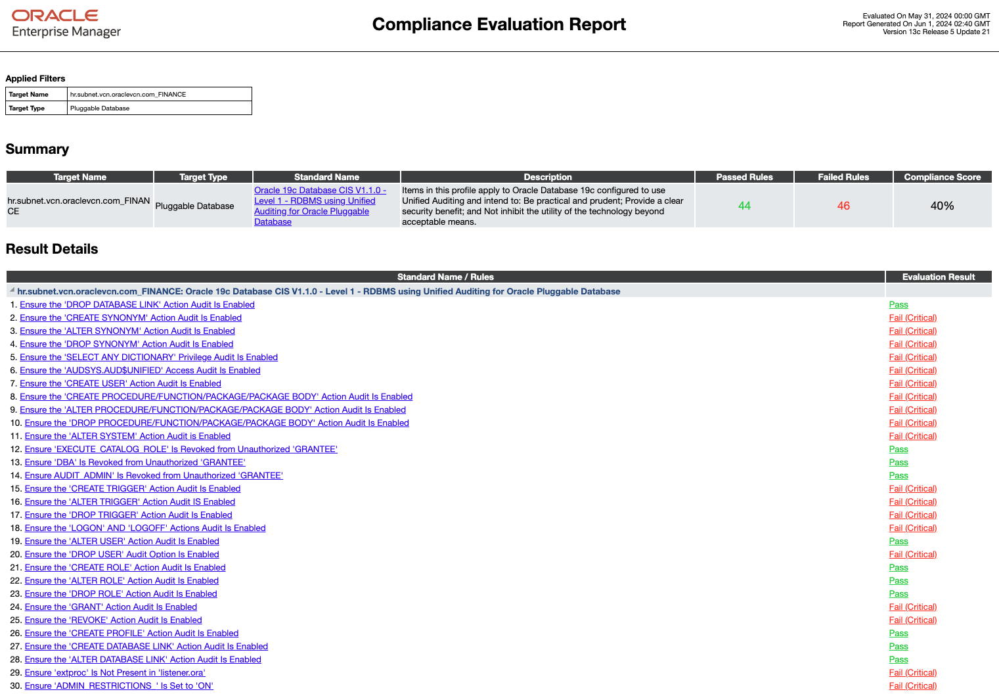
    
    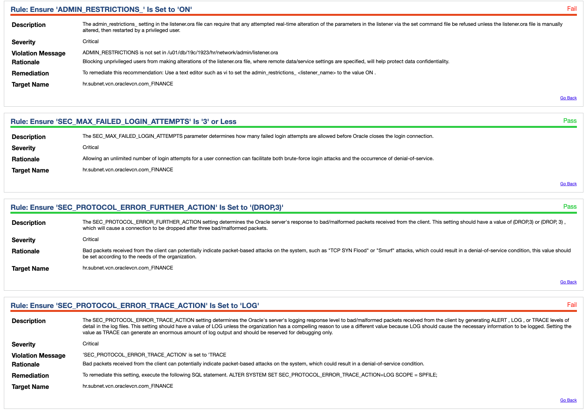

    This completes the Automated Database Patching at Scale with Fleet Maintenance HUB and Oracle 19c Database CIS V1.1.0 - Level 1 - RDBMS benchmark using Unified Auditing for Oracle Pluggable Database benchmark Rule Violation Remediation by corrective Action.

    

    Click on ***Setup >> Log Out***  

That completes the Database Patching and Compliance lab.

You may now proceed to the next lab.

## Learn More
  - [Oracle Enterprise Manager](https://www.oracle.com/enterprise-manager/)
  - [Oracle Enterprise Manager Fleet Maintenance](https://www.oracle.com/manageability/enterprise-manager/technologies/fleet-maintenance.html)
  - [Enterprise Manager Documentation Library](https://docs.oracle.com/en/enterprise-manager/index.html)
  - [Database Lifecycle Management](https://docs.oracle.com/en/enterprise-manager/cloud-control/enterprise-manager-cloud-control/13.5/lifecycle.html)
  - [Database Cloud Management](https://docs.oracle.com/en/enterprise-manager/cloud-control/enterprise-manager-cloud-control/13.5/cloud.html)
  - [Oracle Critical Patch Updates, Security Alerts and Bulletins](https://www.oracle.com/in/security-alerts/)
  - [Enterprise Manager: How to automate corrective actions to remediate CIS Compliance rule violations](https://www.youtube.com/watch?v=gskVyH0oNeg)

## Acknowledgements
  - **Authors**
    - Romit Acharya, Oracle Enterprise Manager Product Management
    - Shiva Prasad, Oracle Enterprise Manager Product Management
  - **Last Updated By/Date** -Romit Acharya, Oracle Enterprise Manager Product Management, July 2024
