# Monitor MySQL using Oracle Enterprise Manager
## Introduction
Enterprise Manager (EM) provides market-leading monitoring and comprehensive management support for Oracle, MySQL, and non-Oracle technologies all in a single pane of glass. With EM, you can monitor MySQL for availability and performance; run explain plans to triage poor performing queries; utilize incident management capabilities to reduce incident volume; and validate compliance against security and replication best practices. 

Check out this lab to learn more about monitoring and compliance management for MySQL in Enterprise Manager.

In this lab, you will learn how to:
- Monitor MySQL status, response, and performance using Homepages
- Identify worst performing queries and run explain plans using Query Analyzer
- Manage and track full MySQL incident lifecycle in Incident Manager
- Evaluate compliance of MySQL against Oracle’s best practices using Compliance Standards

### Objectives
The objective of this lab is to become familiar with how to use key Enterprise Monitoring and Compliance Management capabilities for MySQL in Enterprise Manager.

### Prerequisites
This lab assumes you have:

- A Free Tier, Paid or LiveLabs Oracle Cloud account

*Estimated Time*: 35 minutes

### Lab Timing (Estimated)

  | **Task Number** | **Feature**  | **Approx. Time** | **Details**                                                                                                                                                                                                                   
  |--------|-----------------------------------------------|------------------|--------------------------------------------------------------------------------------------------------------------------------------------------------------------------------------------------------------------------------|
  | **1**  | Homepage and Topology                             | 5 minutes       | Monitor MySQL status, response, and performance using **Homepages**. Review the **Topology** of the MySQL InnoDB Cluster and its members in a graphical visualization.                                                                                                                                                                                                                                                       |
  | **2**  | Query Analyzer                                | 5 minutes       | Identify worst performing queries and run explain plans using **Query Analyzer**.                                                                                                                                                 
  | **3**  | Incident Manager                        | 10 minutes       | Manage and track full MySQL incident lifecycle in **Incident Manager**.                                                                                                                                                       
  | **4**  | Compliance Management                              | 15 minutes       | Evaluate compliance of MySQL against Oracle’s best practices using **Compliance Standards**.  

## Task 1: Homepage and Topology

Use the MySQL InnoDB Cluster homepage to review its current status and track any critical incidents on the cluster and its members. Use the MySQL Database homepage to examine its current status, review its configuration information, monitor key performance metrics, and track its critical incidents. Review the topology of the InnoDB Cluster and its members in a graphical visualization.

1. Log into an Enterprise Manager VM (using provided IP). The Enterprise Manager credentials are **emadmin/welcome1**. 

    

2. Navigate to **Targets** > **All Targets**.

     

3. In the left pane, select the **MySQL InnoDB Cluster** filter.

     

4. In the filtered search results, select the **HRDatabaseCluster** name to navigate to the InnoDB Cluster target homepage.

     

5. In the InnoDB Cluster homepage, you can view the following:
     - The UP and DOWN status of the InnoDB Cluster target. 
          - **Note**: UP indicates that at least one member of the InnoDB Cluster is ONLINE.
     - All incidents for the InnoDB Cluster target, members of the InnoDB Cluster, and the host of the InnoDB Cluster.

     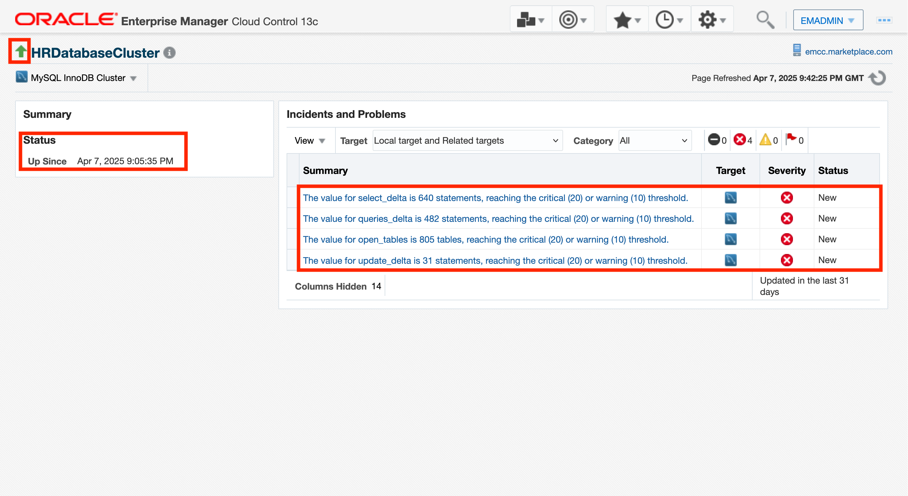

6. Select the **MySQL InnoDB Cluster** menu option > **Members** > **Topology**.

     

7. This Configuration Topology page allows you to:
     - Examine the relationship between related targets (e.g., Host, InnoDB Cluster, MySQL Database)
     - Review the current statuses across all these related targets
     - Track incidents across all these related targets

8. The default View is **Uses**. In this View, you can see the host that the InnoDB Cluster is installed on and any parent target that the InnoDB Cluster may belong to (e.g., an InnoDB ClusterSet target, if applicable).

     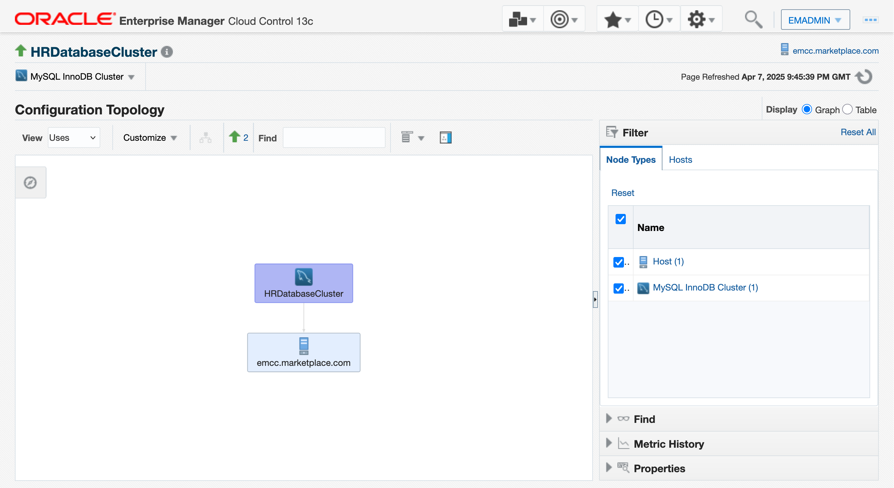

9. In the View dropdown, change to see the **Used By** view.

     

10. Here you can view the members (i.e., MySQL Database targets) within the InnoDB Cluster. 

     

11. Hover over a member MySQL Database target to view its current status, its host and its number of incidents.

     

12. Select the **Table** radio button to see topology presented in a tabular view. View a hierarchical table that displays the relationship of the InnoDB Cluster target (parent) and its member MySQL Database targets (children). Also review the current availability status of this cluster and its members.

     

14. From here, select **HRDatabaseCluster-DB1** to drilldown to a MySQL Database target homepage.

     

15. In this MySQL Database homepage, you can view the following:
     - Availability history to see MySQL status and its status over the last 24 hours
     - Configuration information such a MySQL Database version and Host
     - Key performance metrics such as Response Time and Statement Activity
     - Critical incidents with drillable links to access Incident Manager to further triage

     

## Task 2: Query Analyzer
Query Analyzer identifies your worst performing queries based on highest executions and most latencies. Run explain plans to triage these worst performing queries. **Note**: If you have already completed **Task 1: Homepage and Topology**, then skip to Step 5.

1. Log into an Enterprise Manager VM (using provided IP). The Enterprise Manager credentials are **emadmin/welcome1**.

    

2. Navigate to **Targets** > **All Targets**.

    

3. In the left pane, select the **MySQL Database** filter.

    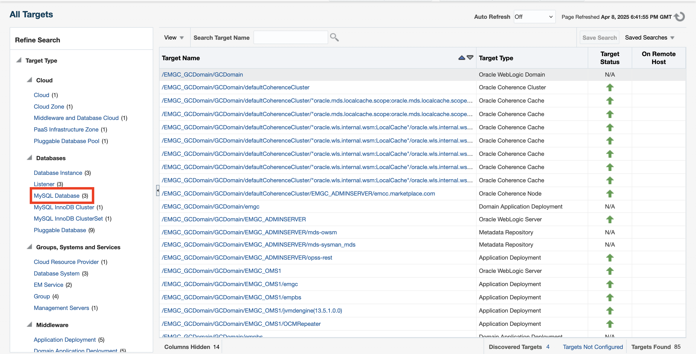

4. In the filtered search results, select the **HRDatabaseCluster-DB1** name to navigate to the MySQL Database target homepage.

    

5. From the homepage, select **MySQL Database** > **Query Analyzer**.

    

6. Query Analyzer provides a view into your worst performing queries and statements that may be impacting your applications’ performance. Using Query Analyzer, you can complete the following:
     - Filter based on highest executions, most latencies or first time seen 
     - Access queries from the last collection schedule (Current), last 24 hours or last 7 days
     - Run explain plans on the worst performing queries
     - Review graphs on average execution time, execution count, and rows affected

     

7. By default, the view is the top 100 queries from the last collection schedule (Current) based on total latency.

8.	Select the dropdown to filter for **Top Queries by Execution Count**.

    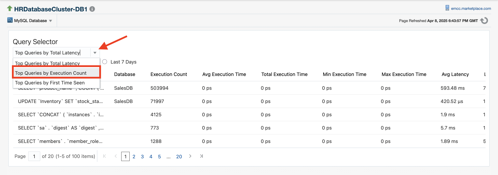

9.	Select the query with the most executions at the top of the list.

    

10.	In the **Query Text** field, replace the existing text with the following normalized query: 

     **SELECT \`product\_name\`, COUNT(*) AS \`total\_orders\` FROM SalesDB.\`Orders\` GROUP BY \`product\_name\` ORDER BY \`total\_orders\` DESC**

     

11.	Click **Run Explain** to execute the Explain Plan.

    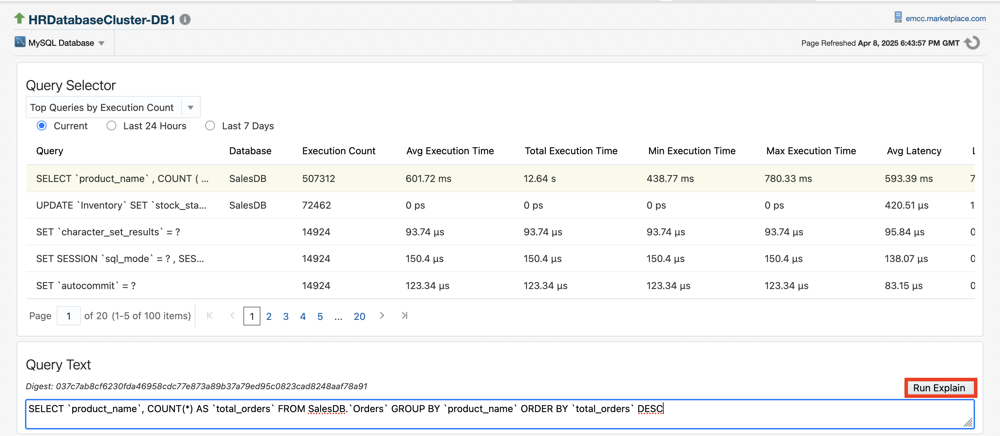

12.	The Explain Plan provides information on how the query was executed which allows you to identify how to optimize the query for better performance. 

    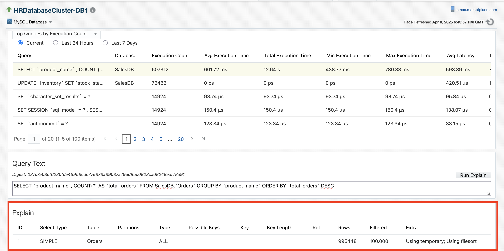

13.	For instance, this Explain Plan reveals the following:
     - **id: 1** – This indicates that this is a simple query (no subqueries or joins).
     - **select_type: SIMPLE** – The query is straightforward with no complex operations like subqueries or unions.
     - **table: Orders** – The query is working with the Orders table.
     - **partitions: NULL** – No partitioning is used in this query.
     - **type: ALL** – This indicates a full table scan is being used, meaning MySQL will scan all rows in the Orders table to fulfill the query. This is generally less efficient than using an index.
     - **possible_keys: NULL** – There are no indexes that MySQL considers useful for this query.
     - **key: NULL** – No index is actually used.
     - **key_len: NULL** – Since no index is used, this field is empty.
     - **ref: NULL** – There is no reference to another table or index.
     - **rows: 995448** – MySQL estimates that approximately 995,448 rows will be scanned in the Orders table.
     - **filtered: 100** – This means all rows are relevant for the query (no filtering is applied in the WHERE clause).
     - **Extra: Using temporary; Using filesort** – This indicates that: 
          - MySQL will use a temporary table to store intermediate results.
          - It will also perform a filesort, which is used for ordering the results. Filesort is a disk-based sorting method that can be slower than in-memory sorting.

14. Based on these finding, you can determine these key takeaways:
     - The query is performing a **full table scan** on the Orders table which may lead to higher execution time.
     - MySQL will use a **temporary table** and **filesort** for sorting the result by **total_orders**, which can potentially be inefficient, especially with large datasets.
     - No indexes are being used, so performance may be impacted when dealing with large tables.

15. To improve performance, consider creating indexes on the **product_name** column and possibly optimizing the ordering by using more efficient sorting methods.

16.	You can also scroll down for a graphical view of the query based on **Average Execution Time**, **Execution Count** and **Rows Affected**.

    

## Task 3: Incident Manager

Incident Manager provides in one location the ability to search, view, manage, and resolve events, incidents and problems impacting your environment.

1.	Log into an Enterprise Manager VM (using provided IP). The Enterprise Manager credentials are **emadmin/welcome1**.

    

2.	Navigate to **Enterprise** > **Monitoring** > **Incident Manager**.

    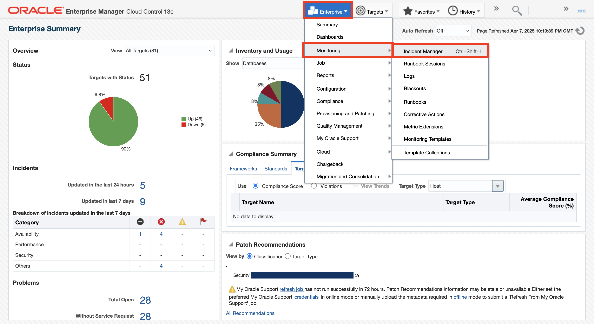

3.	By default, **All open incidents** view is displayed. You can use the out-of-box Views OR create your own Views and share with others.

    

4.	We will triage unassigned incidents and then acknowledge and assign an incident to an owner. 

5.	Click on the incident with Summary text **"The value for queries_delta is 482 statements, reaching the critical (20) or warning (10) threshold"**. Details of the incident will be displayed in the bottom pane.

    

6.	Click on **Open in new tab**.

    

7.	The General tab of this incident contains 5 sections.
     - **Incident Details**: Contains information about the incident such as target name, creation date, type, and summary. 
     - **Metric Data**: Displays the warning and critical thresholds and the last known value of this metric. 
     - **Tracking**: Allows the ability to manage the lifecycle of the incident, including assigning ownership, setting priority and escalating the incident
     - **Runbook Sessions**: Includes options to start, create, or view a runbook session against the incident
     - **Guided Resolution**: Provides the ability to diagnose and take action to resolve the incident

     

8.	Click on **Acknowledge** in the Tracking section to automatically assign the incident to the user acknowledging the incident.

     

     

9.	Click on **Manage**.

    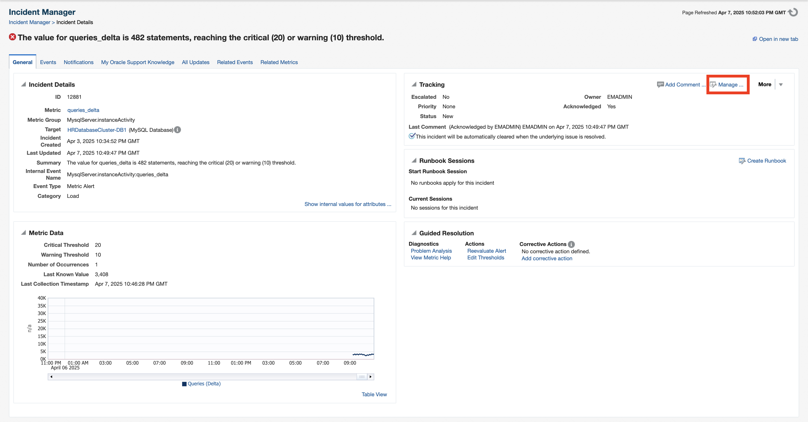

10.	Update the **Status**, **Priority**, and **Escalation** fields. Add a short comment and click **OK**.

    

11.	A confirmation is displayed with the Tracking section updated.

    

12.	Close the Incident Details tab to go back to the Incident Manager tab.

    

13.	Click on the **Dashboard** button next to **Incident Manager: All open incidents**.

    

14.	Incident Dashboard provides a holistic view of your incidents. It contains 3 sections. 
     - **Summary**: Count of incidents that are open, fatal, escalated, unassigned, and unacknowledged. These are the incidents that need to be triaged or worked on immediately. Fatal and Escalated count are highlighted in Red by default. 
     - **Charts**: Provides an easy-to-understand look at the current incident distribution and management status for each incident with customizable options. 
     - **Incident List**: Shows the open incidents listed in reverse chronological order by last updated time stamp.

    

15.	Click on the **Escalated** link to drill down into these incidents.

    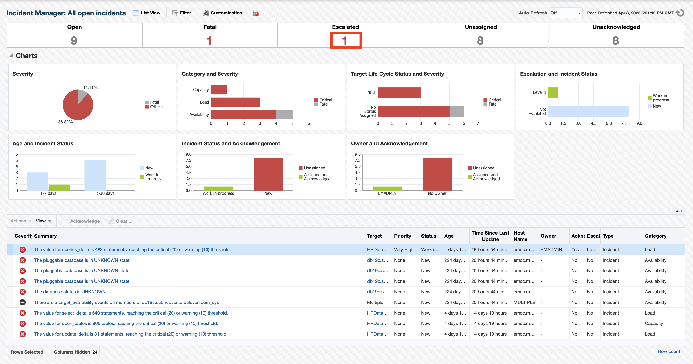

16.	Incident Dashboard is filtered for incidents that are **Escalated**.

    

## Task 4: Compliance Management

Compliance Standards can be used to evaluate the compliance of your MySQL Databases for Replication, Security, Performance, Schema and Administration best practices. Review the Compliance Dashboard to see this evaluation across your fleet.

1.	Log into an Enterprise Manager VM (using provided IP). The Enterprise Manager credentials are **emadmin/welcome1**.

    

2.	Navigate to **Enterprise** > **Compliance** > **Library**

    

3.	Select the Compliance Standards tab. This tab contains all the standards across various supported targets, including MySQL.

    

4.	Expand the **Search** section and enter “**MySQL**” in the **Compliance Standard** field. Select **Search**.

    

     

5.	Highlight the **MySQL Security Standard** and select **Show Details**. The MySQL Security Standard is made up of a variety of rules in order to evaluate compliance of MySQL against Oracle’s best practices for security.

    

7.	Select **Done**, once you are finished reviewing the rules in the compliance standard. 

    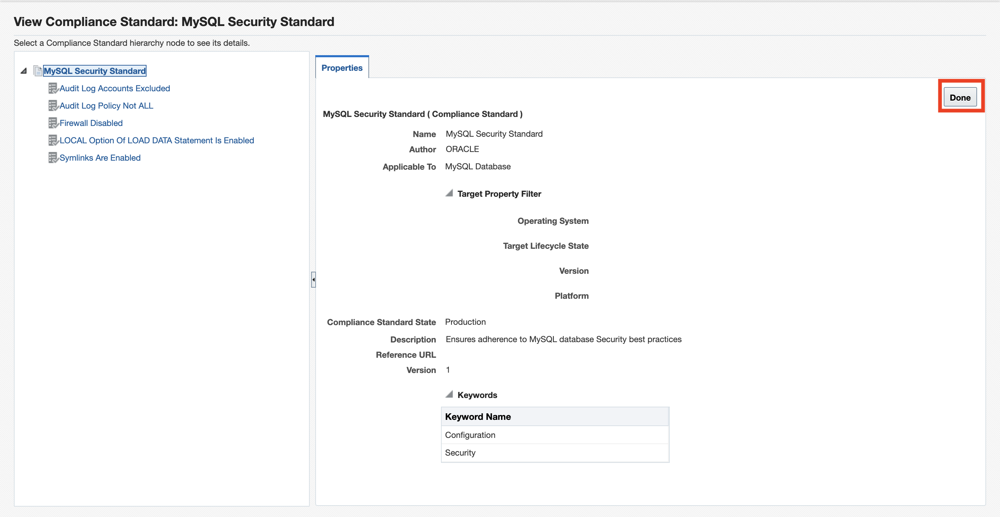

8.	Highlight the **MySQL Security Standard** again and select **Associate Targets**.

    

9.	Select **Add** to associate MySQL Database targets with this compliance standard.

    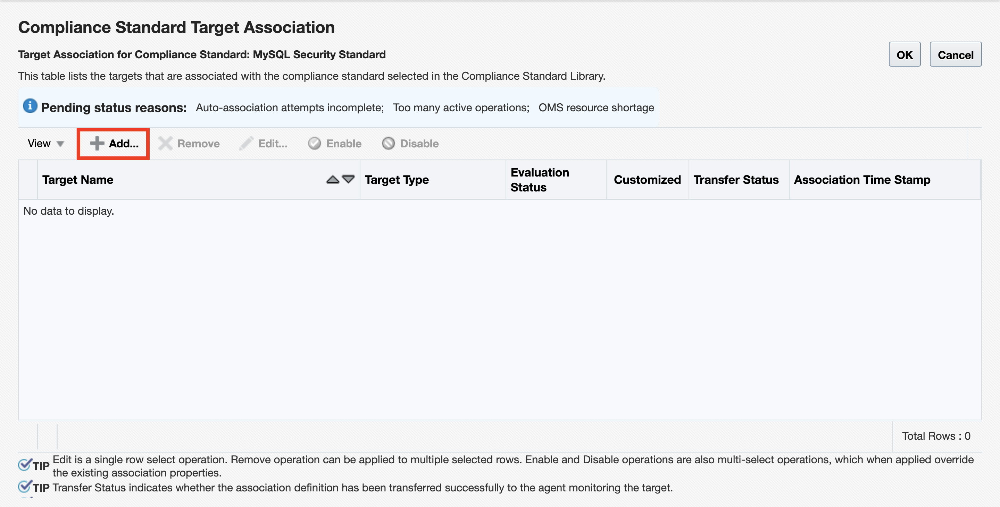

10.	Click on **HRDatabaseCluster-DB1** and hold down the Shift key to also multi-select **HRDatabaseCluster-DB2** and **HRDatabaseCluster-DB3**. Click on **Select** to save these selections.

    

12.	Select **OK**.

     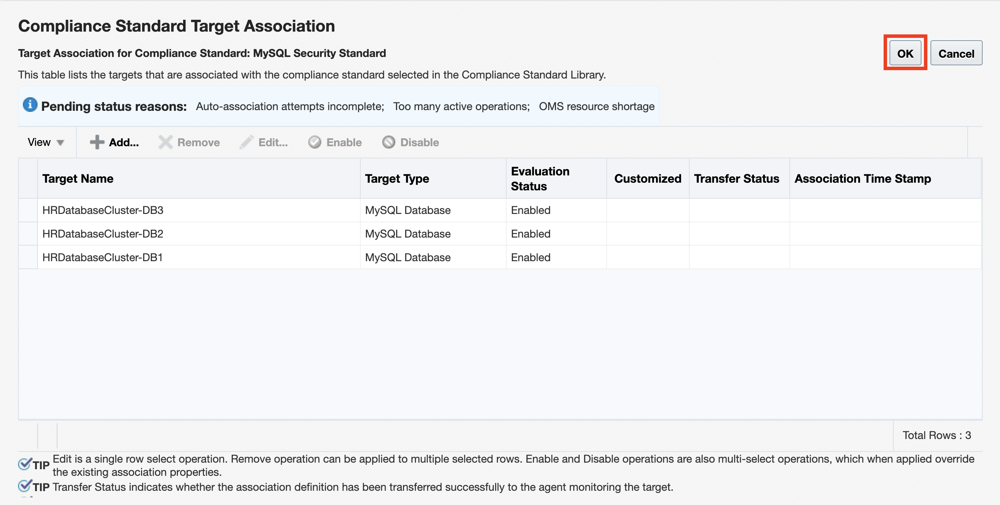

13.	Select **Yes** to save.

    

14.	Once, the compliance standard is submitted to the MySQL Database targets, you will be taken back to the Compliance Standards tab. 

15. Select **OK**.

    

15.	To check if the compliance processing is complete, click the target number in the **Association Count** column.

    

16.	If Evaluation Status is **Enabled** and Transfer Status is **Successfully Done**, the compliance check is complete. Click **Cancel**.

    

17.	Navigate to **Enterprise** > **Compliance** > **Dashboard**.

    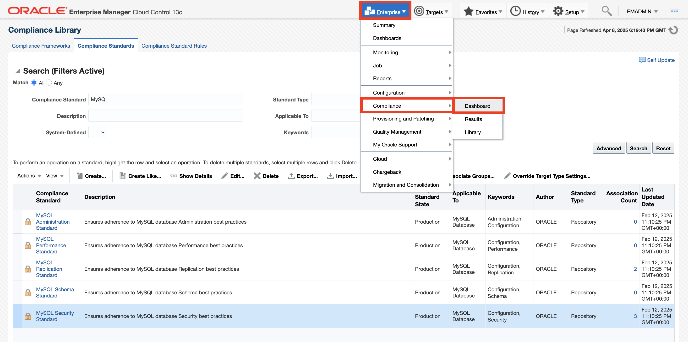

18.	Here is a fleetwide view of compliance across all the targets in your enterprise (i.e., MySQL and non-MySQL, if applicable).

    

19.	Scroll down to the **Compliance Summary** section. The **Standards** tab provides a list of all the standards that have been associated with your targets. Per each standard, you can review the number of compliant vs. non-compliant targets; the number of critical, warning and minor warnings; and the average compliance score.

    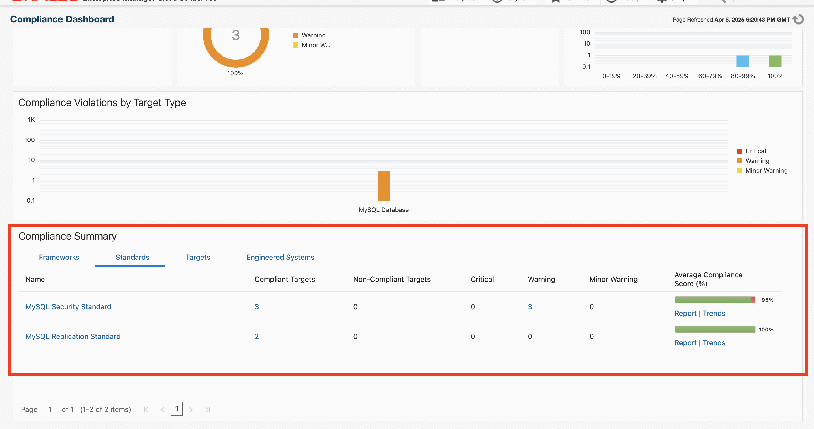

21.	Select **Report** in the MySQL Security Standard row.

    

22.	This takes you to an Evaluation Report with a list of each compliance security violation across all the MySQL Database targets and the remediation process. This report can be saved and shared within your organization to further triage.

    

23.	Close out of the Evaluation Report tab to go back to the Compliance Dashboard tab.

    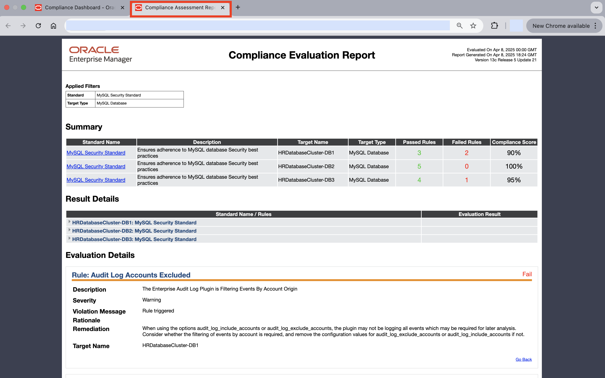

24.	Select the **MySQL Security Standard**.

    

25.	Here are the Compliance Results for the MySQL Security Standard. View the rules in the compliance standard, the number of violations and the compliance score.

    

26.	Notice a couple of the rules have a warning icon. Select the **Audit Log Accounts Excluded rule**.

    

27.	In the **Summary** tab, view the distribution of violation severity and the number of violations per MySQL Database target.

    

28.	Select the **Violation Events** tab to view where the violation occurred. Highlight one of the violation events from the list to view more information in the bottom pane. 

    

29.	Select the **Rule Details** tab. This is where you can view the recommendation on how to remediate the **Audit Log Accounts Excluded** rule. 

    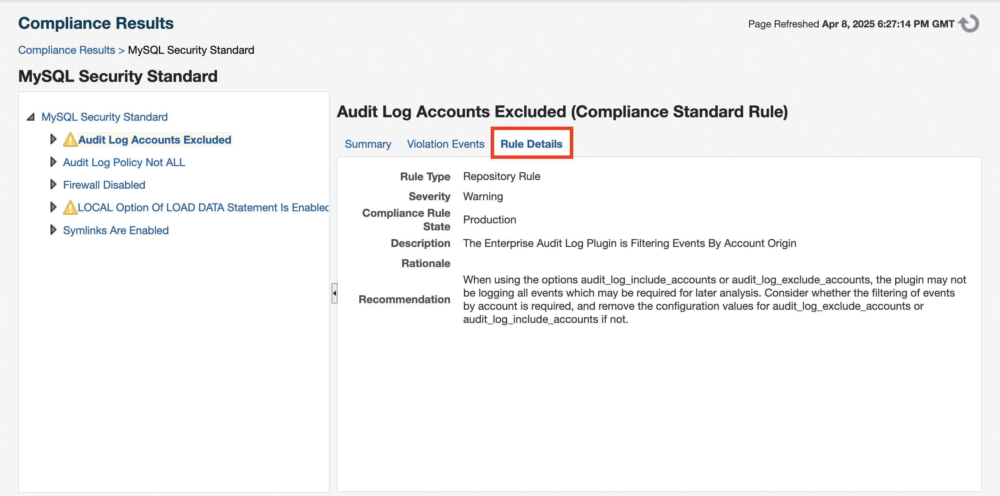

## Learn More
- [Webcast Video - Enterprise Manager for MySQL](https://www.youtube.com/watch?v=U5VvgjFvLNs)
- [Demo Video - Enterprise Manager for MySQL](https://www.youtube.com/watch?v=Bre3MJ0P1cQ)
- [Enterprise Manager for MySQL User's Guide](https://dev.mysql.com/doc/mysql-em-plugin/en/)
- [Overview Blog - Comprehensive Monitoring and Compliance Management for MySQL Databases using Enterprise Manager](https://blogs.oracle.com/observability/post/comprehensive-monitoring-and-compliance-management-for-mysql-databases-using-enterprise-manager)
- [Customer Blog - Enterprise Manager: How Comcast enhanced monitoring for MySQL InnoDB Clusters](https://blogs.oracle.com/observability/post/enterprise-manager-how-comcast-enhanced-monitoring-for-mysql-innodb-clusters)
- [Enterprise Manager Monitoring Videos](https://www.youtube.com/playlist?list=PLiuPvpy8QsiXAUQEMQp87H4Top-vL2dEN)
- [Enterprise Manager Monitoring Guide](https://docs.oracle.com/en/enterprise-manager/cloud-control/enterprise-manager-cloud-control/13.5/emmon/index.html)
- [Enterprise Manager Basic Installation Guide](https://docs.oracle.com/en/enterprise-manager/cloud-control/enterprise-manager-cloud-control/13.5/embsc/index.html)
- [Enterprise Manager Administration Guide](https://docs.oracle.com/en/enterprise-manager/cloud-control/enterprise-manager-cloud-control/13.5/emadm/index.html)
- [Enterprise Manager Licensing Guide](https://docs.oracle.com/en/enterprise-manager/cloud-control/enterprise-manager-cloud-control/13.5/oemli/index.html)
- [Enterprise Manager Blogs](https://blogs.oracle.com/observability/category/oem-enterprise-manager)
- [oracle.com/enterprisemanager](https://www.oracle.com/enterprise-manager/)

## Acknowledgements
- **Author** - Desiree Abrokwa
- **Contributors** - Anand Prabhu - Enterprise Manager Product Management
- **Last Updated By/Date** - Desiree Abrokwa, April 2025
