# Oracle Enterprise Manager 24ai: Powered by GenAI
## Introduction
In today’s fast-paced IT environment, administrators and DBAs face challenges in managing complex systems while ensuring availability and performance. Join this Hands-On Lab to learn about the new modernized Enterprise Manager 24ai platform that supports Zero Downtime (ZDT) Monitoring. Explore the new EM 24 features such as the new remote agents that will streamline monitoring across your host and database fleet. Converse with the GenAI (Ask EM) assistant to ask questions in natural language and quickly get answers and visual insights for more informed decision making. Check out our latest enhancements to Event Compression and Dynamic Runbooks. 

### Objectives
The objective of this lab is to become familiar with the new modernized Enterprise Manager 24ai platform.

### Prerequisites
This lab assumes you have:

- A Free Tier, Paid or LiveLabs Oracle Cloud account

*Estimated Time*: 70 minutes

### Lab Timing (Estimated)
| **Task Number** | **Feature**  | **Approx. Time** | **Details**                                                                                                                                                                                                                   
  |--------|-----------------------------------------------|------------------|--------------------------------------------------------------------------------------------------------------------------------------------------------------------------------------------------------------------------------|
  | **1**  | Using the Remote Agent                             | 15 minutes       |     Understand how to add a remote host to a remote agent for monitoring.                                                                                                                                                                                                                                                  |
  | **2A**  | Ask EM assistant for Monitoring                                | 6 minutes       | Use the Ask EM assistant to get answers to monitoring questions.                                                                                                                                                 
  | **2B**  | Ask EM assistant for Database Performance                        | 6 minutes       | Use the Ask EM assistant to get answers to database performance questions.                                                                                                                                                      
  | **2C**  | Ask EM assistant for Database Patching and Compliance                              | 6 minutes       | Use the Ask EM assistant to get answers to database patching and compliance questions.  
| **3A**  | Event Compression Policies                              | 10 minutes       | View an example of a compressed incident and author your own Event Compression Policy.  
| **3B**  | Event Compression Analysis                             | 10 minutes       | Test your Event Compression Policy using the Event Compression Analysis tool and enable it for use in Incident Rules.  
| **4**  | Dynamic Runbooks for Metrics                              | 10 minutes       | Start a Dynamic Runbook session against a metric in the All-Metrics page.  
| **5**  | Dynamic Runbooks for Notification Backlog (Universal Context)                              | 5 minutes       | Understand the use of universal context for Dynamic Runbooks using the “Triage Notification Backlog” runbook as an example.   

## Task 1: Using the Remote Agent

## Task 2A: Ask EM assistant for Monitoring

The Ask EM Assistant (Ask EM) is a GenAI-powered feature that helps you troubleshoot issues, visualize insights, and make informed decisions to boost operational efficiency and provide documentation references. Ask EM requires a connection to the Oracle Cloud Infrastructure (OCI).

1. Log into  Enterprise Manager using the credentials **emadmin/welcome1**. 

    

2. In the upper right corner, click on the *Ask EM* assistant icon to start it.

    

3. The *Ask EM* assistant should appear with a welcome message:

    

4. Click on the **Documentation** Tab.

    

5. In the Documentation tab, type in the question below and  hit \<enter\>:

    **What are the new monitoring features in em24ai?**  

    

    Review the answer that it returns.

6. Stay in the Documentation tab, ask this question and review the answer:

    **What is zero downtime monitoring service?**

7. Stay in the Documentation tab, ask this question and review the answer:

    **Can I use zero downtime monitoring when upgrading from em 13.5 to em 24ai?**

8. Next, click on the **Telemetry** tab.

    

9. In the Telemetry tab, ask this question:

    **Do I have any database incidents?**    

10. In the Telemetry tab, ask this question:

    **Show me list of database incidents**

11. In the Telemetry tab, ask this question:

    **Show me list of database incidents**

12. Now close the *Ask EM* session.

    

## Task 2B: Ask EM assistant for Database Performance

The Ask EM Assistant (Ask EM) is a GenAI-powered feature that helps you troubleshoot issues, visualize insights, and make informed decisions to boost operational efficiency and provide documentation references. Ask EM requires a connection to the Oracle Cloud Infrastructure (OCI).

1. Log into  Enterprise Manager using the credentials **emadmin/welcome1**. 

    

2. In the upper right corner, click on the *Ask EM* assistant icon to start it.

    

3. The *Ask EM* assistant should appear with a welcome message:

    

4. In the Telemetry tab, ask this question:

    **How is the performance of my databases?**    

5. In the Telemetry tab, ask this question:

    **Is there a spike in average active sessions?**

6. In the Telemetry tab, ask this question:

    **Show me used and allocated space usage on my database.**

7. In the Telemetry tab, ask this question:

    **What are the top activities on my database**

8. In the Telemetry tab, ask this question:

    **Show me how are the resources consumed on my database.**

9. In the Telemetry tab, ask this question:

    **How to troubleshoot busy wait events?**

10. Now close the *Ask EM* session.

    

## Task 2C: Ask EM assistant for Database Patching and Compliance

The Ask EM Assistant (Ask EM) is a GenAI-powered feature that helps you troubleshoot issues, visualize insights, and make informed decisions to boost operational efficiency and provide documentation references. Ask EM requires a connection to the Oracle Cloud Infrastructure (OCI).

1. Log into  Enterprise Manager using the credentials **emadmin/welcome1**. 

    

2. In the upper right corner, click on the *Ask EM* assistant icon to start it.

    

3. The *Ask EM* assistant should appear with a welcome message:

    

4. In the Telemetry tab, ask this question:

    **Show me list of subscribed targets.**    

5. In the Telemetry tab, ask this question:

    **Which databases are subscribed to 19cDB-Linux-x64-Apps19cDB-Linux-x64-Apps.**

6. In the Telemetry tab, ask this question:

    **What are the patch recommendations for my database hr.subnet.vcn.oraclevcn.com**

7. In the Telemetry tab, ask this question:

    **Are my databases compliant with patches?**

8. In the Telemetry tab, ask this question:

    **How many critical violations exist?**

9. Now close the *Ask EM* session.

    

## Task 3A: Event Compression Policies

Event Compression is the process of grouping (i.e., compressing) multiple correlated events into a smaller subset of actionable incidents. An Event Compression Policy defines the specific set of related events that should be grouped together. Before incident creation, Event Compression Policies work with Incident Rule Sets to determine if incoming events should be grouped and compressed into a single incident.

1. Log into  Enterprise Manager using the credentials **emadmin/welcome1**. 

    

2. Select the menu icon.

    

3. Navigate to **Enterprise > Monitoring > Incident Manager**.

    

    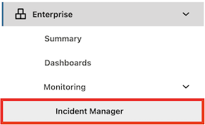 

4. Let’s take a look at an example of an incident with event compression. 

    Select the incident with the summary text: **There are 5 target\_availability events on members of db19c.subnet.vcn.oraclevcn.com\_sys.**

    

5. Click **Open in new tab**.

    

6. From here, take a closer look at the incident details to view:
    - The number of events in the incident
    - The Incident Rule and RuleSet used to create the incident
    - The Event Compression Policy used to group the events into this incident
    - The list of events in the incident

    

7.	Now let’s take a look at how to use and create Event Compression Policies to create these compressed incidents.

8.	Select the menu icon. 

    

9.	Navigate to **Setup > Incidents > Event Compression Policies**.

    

    

10. There are 7 Oracle-provided Event Compression Policies. You can also author your own policies for custom compression requirements.

    

11.	Let’s take a look at the policy that created the incident with event compression that we previously viewed.

    Click the policy with the name: **Target down events for a database system and its members**.

    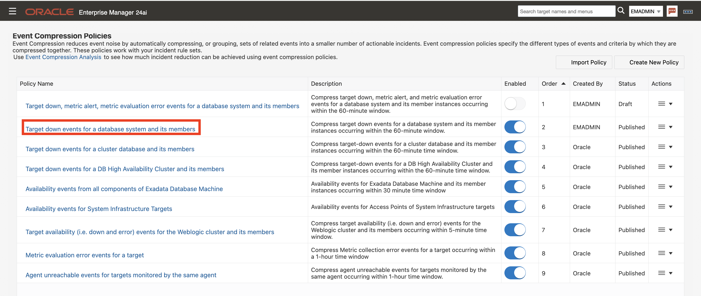

12. Here you can view the criteria for how the events were grouped together into the incident.

    

13. Click the **X** icon to exit from the screen.

    

14. Now, we will take a look at and edit a custom policy. In this lab, a custom draft policy has already been created for you that you will modify. This policy groups multiple event types into a singular incident.

15. Select **Actions > Edit** for the following policy: **Target down, metric alert, and metric evaluation error events for a database system and its members**.

    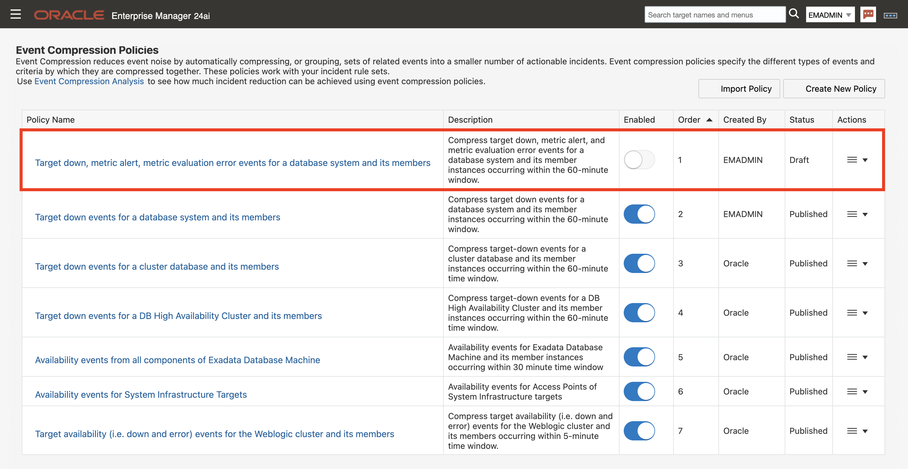

    

16.	In the Event Compression Logic sub-section, you can see the policy applies to:
    - Multiple event types: **Target Availability/Down, Metric Alert, and Metric Evaluation Error**
    - Target Types: **Database System, Database Instance, Pluggable Database**
    - Event Severity: **Fatal and Critical**
    - Time Window: **60 minutes**
        - **Note:** This means the events had to have occurred within a 60-minute time window of each other to be grouped into an incident together.
    
    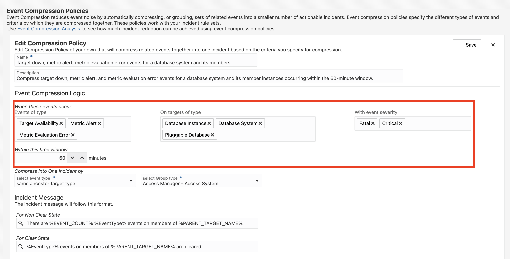 

17. Locate the dropdowns under the header _**Compress into One Incident By**_. This determines the criteria for grouping the events.

    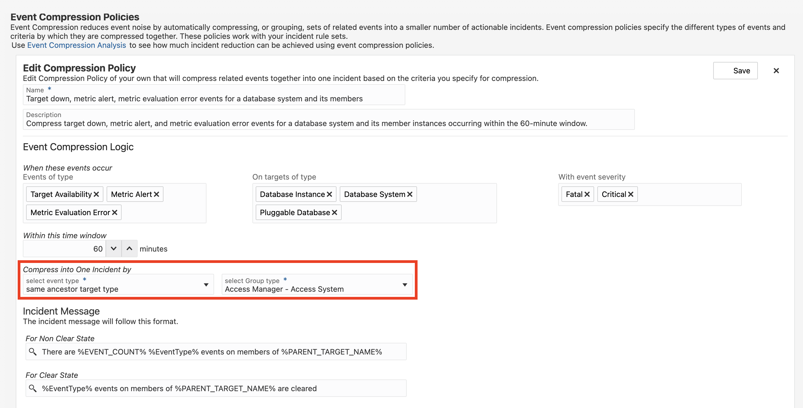 

18. Select the dropdown for **select Group type**. Search for and click on **Database System**. This ensures that the specified events for the Database Instance, Pluggable Database, and Database System targets will be grouped into an incident based on the Database System.

     

19. Click **Save**.

     

20. The custom policy you edited is still in a Draft status. You should test out the policy before publishing it.

    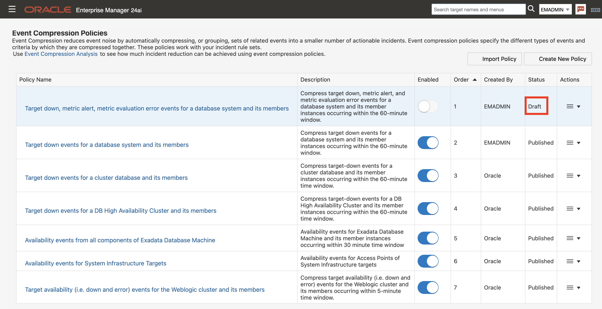 

21. Continue to **Task 3B: Event Compression Analysis** to test out the policy, publish it and enable it for use by other EM administrators.

## Task 3B: Event Compression Analysis

**Complete Task 3A: Event Compression Policies prior to beginning this task.**

Event Compression is the process of grouping (i.e., compressing) multiple correlated events into a smaller subset of actionable incidents. An Event Compression Analysis uses historical monitoring data from your environment to analyze the impact Event Compression Policies would have had on your actual incidents had these policies been enabled. 

1. Before publishing and enabling your policy (created in **Task 3A: Event Compression Policies**) for use, test it out using the Event Compression Analysis tool.

2. First enable the policy for testing using the toggle button.

    

    

    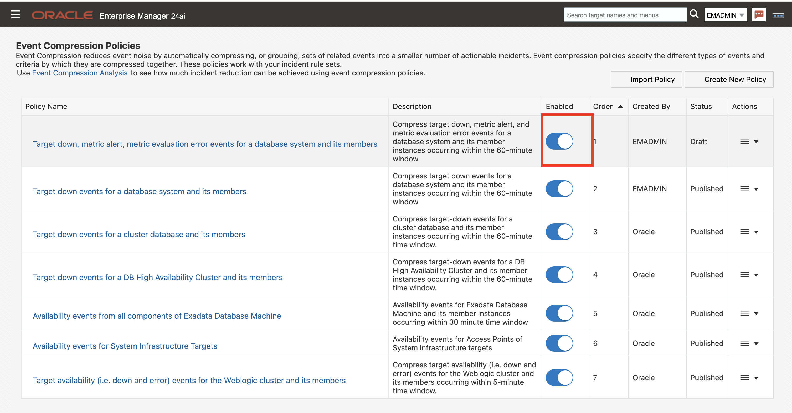

3. Click the **Event Compression Analysis** link.

    

4. The Event Compression Analysis uses real events from your environment and displays the number of incidents that were created without Event Compression Policies enabled vs. the number of incidents that would be created if the Event Compression Policies were enabled. This allows you to analyze the effectiveness of Event Compression Policies on your own events.

    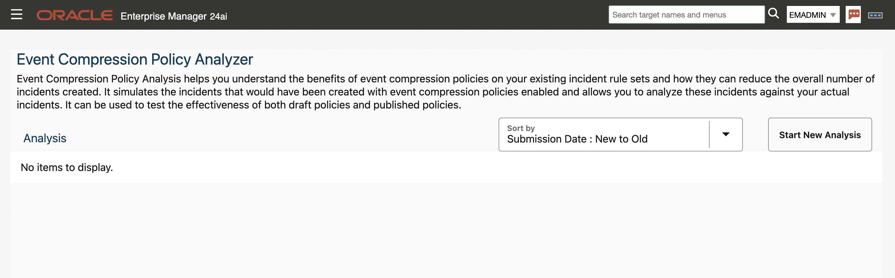

5. To begin a new analysis, click **Start New Analysis**.

    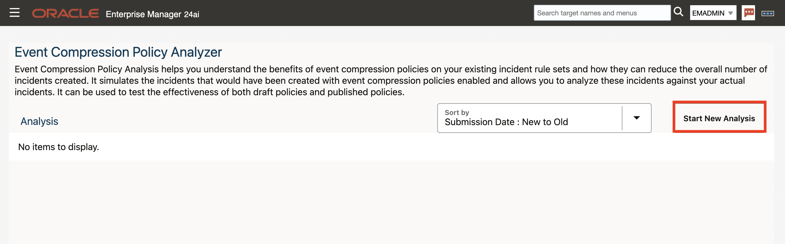

6. Enter the following in the pop-up that displays:
    - Name: **Analysis for DB System and its members**
    - Analyze events from these targets:
        - In the dropdown for **Select a Group**, select: **Prod DB Targets**
    - Events occurred within this time range:
        - From: **07/14/2025**
        - To: **07/28/2025**
    - Click **Include Draft Policy** so that your draft policy is used in the analysis

    At the end, your Compression Policy Analysis criteria should look like the following:

    

7. Click **Start Analysis**. 

    

8. A job is submitted that will run the analysis. It takes a few seconds for the analysis to complete so refresh your page to see analysis results.

    

9. Click on the analysis name.

    

10. The top boxes are a summary of the analysis:
    - 115 events were analyzed
    - 110 incidents were created <u>without</u> the compression policies enabled
    - 26 incidents would have been created <u>with</u> the compression policies enabled
    - There would have been 76% fewer incidents with compression policies enabled
    - On average, 4.42 events would have been compressed into a singular incident 

    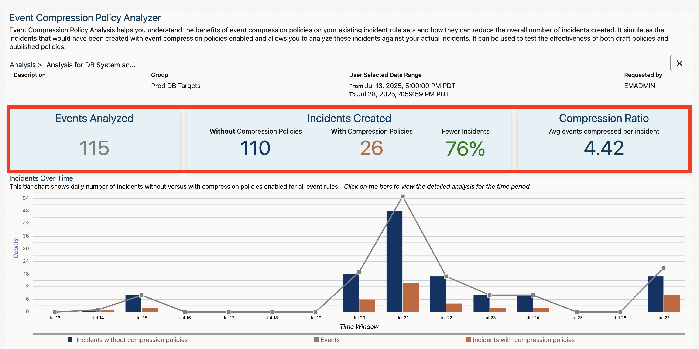

11.	View the graph for a visual breakdown of the compression. 

12.	The **navy bars** represent the number of incidents when Event Compression Policies were not enabled. The **orange bars** represent number of incidents if compression policies were used. The **gray line** represents the number of real events analyzed.

    

13. Click on one of the bars for **Jul 21** to see the exact events mapped from incidents without compression policies to incidents with compression policies.

    

14. On the left, the **navy bars** represent the incidents created without the compression policies enabled. 
    
    In the middle, the **gray lines** represent the events that were triggered. 
    
    On the right, the **orange bars** represent the incidents that would have been created with the compression policies enabled. 

    

15. Click on the orange “Incidents with compression policies” bar to view more details.

    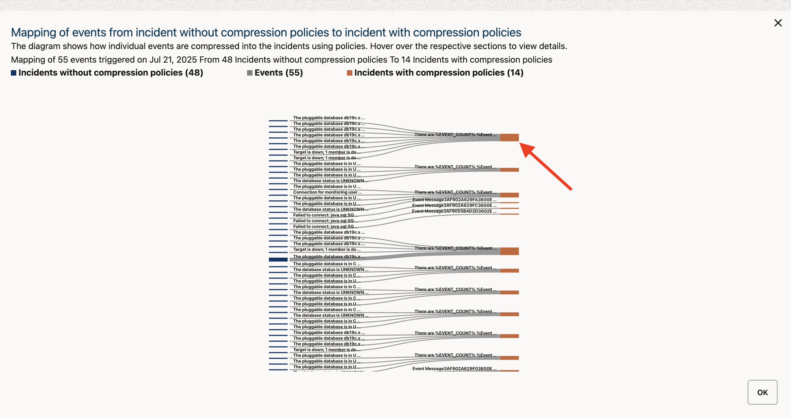

    

16. Click **OK** once you are finished reviewing the details.

    

17. Click **OK** again.

    

18. Click the **X** icon to exit out of the analysis.

    

19. Now that you have tested and confirmed your policy is working, publish it for use.

    Navigate back to **Setup > Incidents > Event Compression Policies**.

    

    

20.	Click the **Actions** icon under your policy and select **Publish**.

    

    

    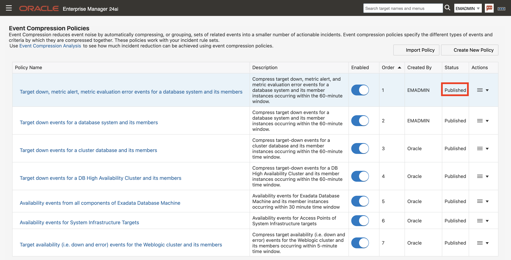

21. Event Compression Policies work hand-in-hand with Incident Rules to create the incidents with compressed events. Now that your policy has been published, let’s see how it would be enabled for use in Incident Rules.

22. Navigate to **Setup > Incidents > Incident Rules**.

    

    

23.	An Incident Rule Set has already been created to work with your compression policy.

24.	Select the rule set **Compress Target Down, Metric Alert, Metric Error Events** and Click **Edit**.

    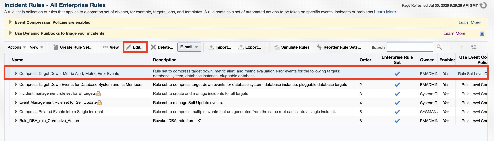

25.	Scroll down to the Rules section and view the 3 rules for:
    - Compress **Target Down Events** for Oracle Database System, Database Instance, and Pluggable Databases
    - Compress **Metric Alert Events** for Oracle Database System, Database Instance, and Pluggable Databases
    - Compress **Metric Error Events** for Oracle Database System, Database Instance, and Pluggable Databases

    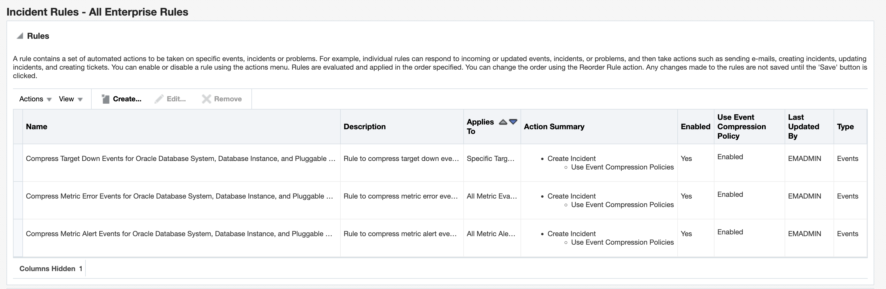

26.	Notice in the **Action Summary** column that all the rules **Create Incidents that Use Event Compression Policies**.

    

27.	Scroll down to the **Event Compression** section. 

28.	Notice the option, **Allow policies to compress events across event types from multiple rules in the rule set (Ruleset Level Compression)**, has been selected. 

    This enables event compression to work across multiple event types (i.e., target availability/down, metric alert, metric evaluation error).

    

29.	Scroll back up.

30.	Click **Cancel**.

    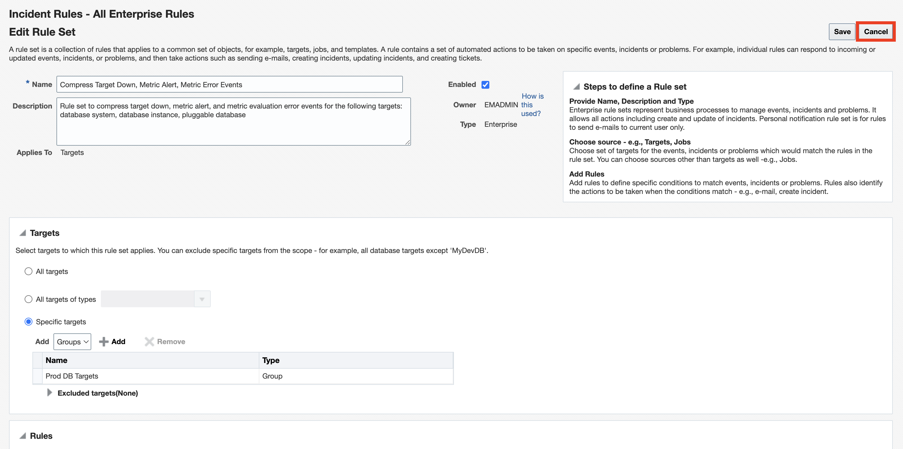

31. Since your compression policy has been published, it would now work with this Incident Rule Set to compress the target down, metric alert and metric evaluation error events for your database system and its member targets into a singular incident

    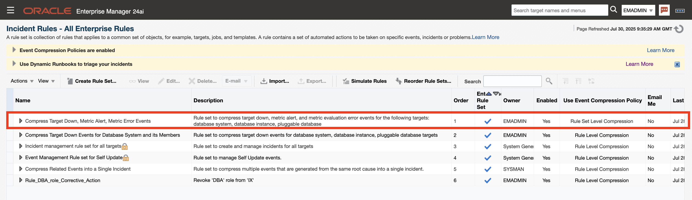

## Task 4: Dynamic Runbooks for Metrics

Dynamic Runbooks are documented best practice procedures in the form of executable steps that ITOps teams follow to prevent or resolve an issue. Dynamic Runbooks can be executed inside Enterprise Manager in context of a metric, incident, or any other Enterprise Manager context. 

For this task, a Metric-Based Dynamic Runbook has already been published for you to use. You will go through the process of starting a Runbook session against a designated **METRIC**.

1. Log into  Enterprise Manager using the credentials **emadmin/welcome1**. 

    

## Task 5: Dynamic Runbooks for Notification Backlog (Universal Context) 

1. Log into  Enterprise Manager using the credentials **emadmin/welcome1**. 

    

## Learn More

  - [Oracle Enterprise Manager](https://www.oracle.com/enterprise-manager/)
  - [Enterprise Manager 24ai Documentation Library](https://docs.oracle.com/en/enterprise-manager/cloud-control/enterprise-manager-cloud-control/24.1/index.html)
  - [Enterprise Manager 24ai Monitoring Guide](https://docs.oracle.com/en/enterprise-manager/cloud-control/enterprise-manager-cloud-control/24.1/emmon/index.html)

## Acknowledgements
- **Author** - Desiree Abrokwa, Oracle Enterprise Manager Product Management
- **Contributing Author** - Ana McCollum, Sumesh Balakrishnan, Anusha Vojjola, Harish Niddagatta Oracle Enterprise Manager Product Management
- **Last Updated By/Date** – Desiree Abrokwa, Oracle Enterprise Manager Product Management [July 2025]
