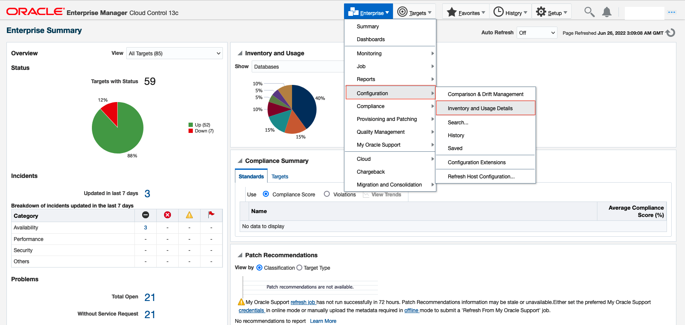
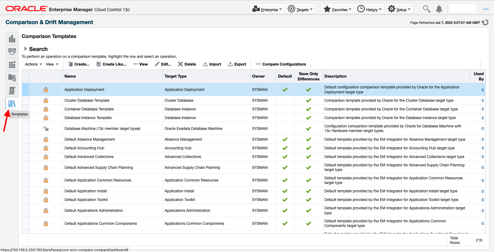
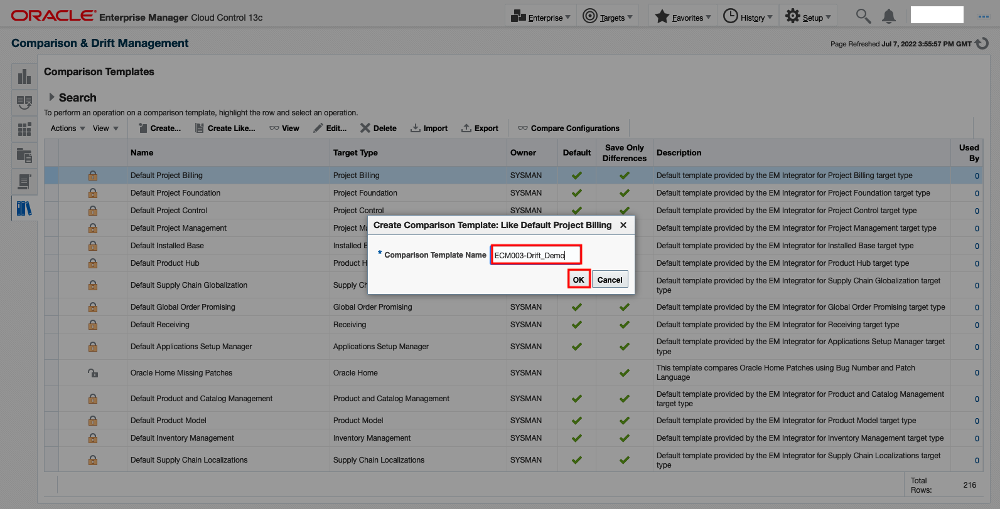
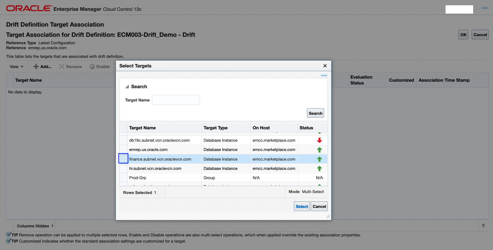
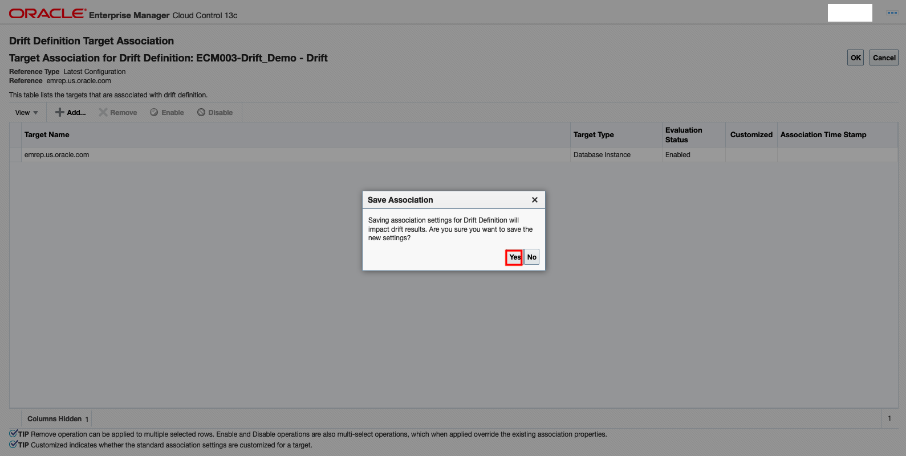

# Configuration and Compliance Management
## Introduction
The objective of this lab is to highlight Oracle Enterprise Manager Cloud Control 13c’s Lifecycle Management capabilities related to configuration and security compliance management of managed targets. Each activity focuses on different capabilities for an administrator.

*Estimated Lab Time:* 60 minutes

Watch the video below for a quick walk through of the lab.
[](youtube:xEKClAvB-Yg)

### About Configuration and Compliance Management

Changes to configuration properties of database and host targets invariably happen, typically because of common events like patches and upgrades. At some point a change to one component can affect the overall system in a negative way. Detecting the root cause becomes paramount. With Configuration Management, one can continuously monitor and track configuration drifts of targets against the reference configuration. Enterprise Manger automatically collects a comprehensive set of configuration properties of all managed targets across the datacenter and cloud.

With Compliance Management, one can run automated, continuous security checks based on industry standards and best practices, such as the Center for Internet Security (CIS), Security Technical Implementation Guide (STIG), Payment Card Industry Data Security Standard (PCI DSS), and Health Insurance Portability and Accountability Act (HIPAA). Reinforce industry standards such as STIG and CIS with custom policies to protect against threats, providing a secure databases and hosts for applications. These security checks provide a compliance score to depict the overall compliance of targets against an industry standard benchmark.

### Objectives

In this lab you will perform the following steps

| Step No.                                      | Feature                                                                 | Approx. Time | Details                                                                                                                                                                                    | Value proposition                                                                                                   |
|-----------------------------------------------------------|-------------------------------------------------------------------------|--------------|--------------------------------------------------------------------------------------------------------------------------------------------------------------------------------------------|---------------------------------------------------------------------------------------------------------------------|
| 1                                                         | Inventory & Usage details                                               | 10 minutes   | IT Manager wants to get an inventory of all existing databases managed by Enterprise Manager including different versions of databases, number of instances deployed over a period of time | Reduce number of different configuration sets and increase standardization across the data center.                  |
| 2                                                         | One-time database comparison                                            | 10 minutes   | Compare latest reference configuration to one or more targets to determine the configuration differences                                                                                   | Validate the configuration of new database provisioned aligns with IT configuration policy.                          |
| 3                                                         | Database Configuration drift management                                 | 20 minutes   | Compare latest or saved target configuration to one or more targets.                                                                                                                       | Monitor databases in your organization for any configuration drift, remediate to align with reference configuration. |
| 4                                                         |  CIS standard Database security Compliance Standard | 10 minutes                    | Databases target.                | Monitor CSI security compliance for database targets from one customized dashboard.                                                      | Monitor security compliance for host targets from one customized dashboard. |
| 5                                                         | Host Security Compliance                                  | 10 minutes   | Host target.                                                                                                                       | Monitor security compliance for host targets from one reference compliance. |


###  Prerequisites
- A Free Tier, Paid or LiveLabs Oracle Cloud account
- You have completed:
    - Lab: Prepare Setup (*Free-tier* and *Paid Tenants* only)
    - Lab: Environment Setup
    - Lab: Initialize Environment

*Note*: This lab environment is setup with Enterprise Manager Cloud Control Release 13.5 and Database 19.10 as Oracle Management Repository.

## Task 1: Inventory & Usage Details

### Overview

The IT Manager wants to get an inventory of all existing databases managed by Enterprise Manager including different versions of databases, number of instances deployed over a period of time. This is to reduce number of different configuration sets and increase standardization across the data center.

All the items in this step are read-only, primary goal is to learn about inventory usage details within Enterprise Manager for all supported targets

### Execution
1. On the browser window on the right preloaded with **Enterprise Manager**, if not already logged in, click on the **Username** field and login with the credentials provided below.

    ```
    Username: <copy>sysman</copy>
    ```

    ```
    Password: <copy>welcome1</copy>
    ```

  

2.  From the Enterprise menu, select **Configuration**, then select **Inventory and  Usage Details**

  

3.  In the **Show** filter menu, select **Databases** to see all database instances managed by Enterprise Manager

  

4.  Analyze various database versions and number of instances for each version or you can choose PDB 18.3 highlighted above page

5.  Explore pie chart to see the break-down of database inventory by color-code percentages. Also, in the **Graphical View**, choose **Trend** radio button to see the growth of given database instance over a period of time.

  

6.  In the Details excel fie table output below, you will see details like

    - Database instance name Target
    - Host on which this database is located
    - Database type - cluster or single instance
    - Database version number
    - OS specific details like OS version, platform, etc.
    - Most importantly, LOB/Department information
      Details table gives more information of each Database instance for you to get a good understanding of number of database targets deployed on a given host with OS version. If your organization uses properties like Lifecycle, Line of Business or Department, then you will be able to determine the number of targets deployed for a given business unit.Explore these features to get a good handle on Inventory and Usage details.

7. Export inventory details to excel for reports. These inventory details can be exported to an excel file for offline analysis or sharing the report to management. With the excel report, you can filter based on the properties you are using to show department or line of business specific assets allocation and usage. (**OPTIONAL**)

  

## Task 2: One Time Database Comparison

### Overview

In this step, you will compare two database targets to determine configuration differences. One of the databases will act as reference target that aligns with your configuration policy. Your objective is to compare initialization parameters to ensure it is compliant with reference target

### Execution

1.  Log into your Enterprise Manager as **sysman** as indicated in the Prerequisites step if not already done.

2.  From the Enterprise menu, select **Configuration**, then select **Configuration & Drift Management**

  

3.  Review the different types of comparisons supported by mouse-over on the info icon.

  

4.	Select **One-Time Comparison Results** tab on the left side of the dashboard page. Click **Create Comparison**

  

5.  Choose the reference target that you want other targets to be compared with.

  

6.  Identify the reference target to compare other targets.

  

  To begin with, filter ‘Target Type’ to Database Instance.

  

7.  Select **emrep.us.oracle.com** as reference target.

  

8.  Choose Database Instance Template for Comparison Template.

  

9.  Provide a name for Comparison.

  

10.  Add targets to be compared.

  

11. Choose **finance.subnet.vcn.oraclevcn.com** target to compare with reference target.

  

  Once the target is chosen, it appear as below

  

12. Click **Submit**.

  

  Comparison of the selected targets happens and below are the results.

  

13. Filter configurations items to review only Initialization Parameters.

  

  You can see the differences in the Initialization Parameters between the two targets.

  Under the target compared column, you will see few icons. The icons that appear in the view are mostly intuitive:
      - Equal sign means parameter properties are same across the reference and target compared
      - Not equal sign indicates parameter properties are different across the reference and target compared
      - A red box with 1 (left only) means that the comparison did not find a matching item to compare, this means 2nd target doesn’t have property configured to compare
      - A red box 2 (right only) means that the comparison did not find a matching item to compare to the second configuration

14. Now, let us go to Comparison and Drift Management dashboard page for further analysis of results

  

15. In the dashboard page, donut chart for Comparison Overview gives you the summary result. Click on the **donut chart** to analyze one-time comparison result details.

  

  You should see the comparison definition you created in this page.

  

16. Export the comparison results into an excel report for offline analysis. In the One-Time Comparison Results page, highlight the definition and choose Export Results. You can choose the specific results to export.

  

  After Exporting, Click **Cancel** to exit

17. Exported results in excel for offline analysis looks like: (**OPTIONAL**)

  

<!-- In this step, you learned steps to compare two database targets to determine configuration differences. This one-time database (or any Enterprise Manager managed targets) comparison will help you quickly determine specific configuration changes when compared with reference configuration. This is very ideal for troubleshooting any target configuration parameters. -->

## Task 3: Database Configuration Drift Management

### Overview

In this workshop, you will learn about continuous configuration drift monitoring of database targets against a reference target for initialization parameters using customized configuration monitoring template

1.  Log into your Enterprise Manager VM using the IP provided on your cheat sheet.

2.  Navigate to ***Enterprise >> Configuration >> Comparison & Drift Management***. Review the different types of comparisons supported.

  

  Chose Templates left side of the panel of the Dashboard.

  

3.  Go to Templates library on the left panel, Clicking on Templates will navigate to Comparison Templates Page. **Sort Name Alphabetically** look for Database Instance Template as shown below.

  

4.  With Database Instance Template highlighted, choose **Create Like** to create a copy of this template for further customization.

  

   Provide a unique name to the new template and click OK.

  

5.  A complete copy of Database Instance template with unique name is created with all configuration items enabled, by **Search** with name **ECM003-Drift_Demo** created.

  

   Highlight this new template and click Edit.

  

6.  In this lab, we will customize this template and monitor configuration drift for two configuration items.

  

  To begin with, uncheck all configuration items.

  

7.  Select the following three configuration items only
    - Instance Caging Information
    - Instance Information
    - Initialization Parameters under Instance Information configuration item
    - Click Save

  

8.  A new customized configuration drift monitoring template is created. This template can be used for drift monitoring.

  

  **Search** with Template name **ECM003-Drift_Demo** shows with Confirmation page

  

9.  Go to Drift Results tab and create a drift definition.

  

10. Click on **Create Definition** under Drift Management.

  

    - Choose Database Instance as the Target Type
    - Select the template created in the previous step
    - Click OK

  

11. In the drift definition details page, provide a unique name for the drift definition.

  

12. Under Source Configuration, do the following:

    -  Select ‘Latest Configuration’
    -  Click search to choose Source Target

  

13. Choose **emrep.us.oracle.com** as your source target. Click on **Select**.

  

14. You will see Source Target (***emrep.us.oracle.com***) is selected that acts as your reference target.

  

15. Select **Save and Associate Targets** to select targets to be monitored.

  

16. Click on **Add** to select and associate a target to be monitored for drift.

  

17. Select **finance.subnet.vcn.oraclevcn.com** as the target.

  

18. Click **Select**. You will see one target selected to be associated with drift definition.

  

19. Click OK. A pop-up will ask for confirmation to save association. Select Yes. This will start the association of this target to drift definition and initiated the configuration comparison and continuous drift monitoring.

  

20. Once you select Yes in the previous step, drift monitoring is in progress. Go to **Enterprise --> Configuration --> Comparison & Drift Management** Dashboard page. After a minute, refresh the page to see the drift monitoring completed. You should see a new or updated donut chart under ‘Drifted Overview’ dashlet.

  

21. Click on Drift Results tab on the left panel (2nd tab from the top). This page will show results for all drift definitions managed by this instance of Enterprise Manager. Identify the drift definition you created for further analysis of configuration drift results.

  

22. Review the drift details. Click on the **Drift Definition** (ECM003-Drift-Demo – Drift) for detailed analysis of configuration drift.

  

  You can see the differences in the Initialization Parameters between the two targets.

  Under the target compared column, you will see few icons. The icons that appear in the view are mostly intuitive:

      - Equal sign means parameter properties are same across the reference and target compared
      - Not equal sign indicates parameter properties are different across the reference and target compared
      - A red box with 1 (left only) means that the comparison did not find a matching item to compare, this means 2nd target doesn’t have property configured to compare
      - A red box 2 (right only) means that the comparison did not find a matching item to compare to the second configuration


23. Export the comparison results into an excel report for offline analysis. In the Drift Results page, highlight the definition and choose Export Results, You can choose the specific results to export. (**OPTIONAL**)

  

24. Exported results in excel for offline analysis looks like:(**OPTIONAL**)

  

<!-- In this step, you learned about continuous configuration drift monitoring of database targets against a reference target for initialization parameters using customized configuration monitoring template. This can be customized to align with your policies. By establishing a configuration drift definition, you can continuously monitor any configuration changes that can be potentially secure risk and remediate the drift immediately. -->


## Task 4: Database Security Compliance using CIS standard

### Overview

Compliance Management provides the ability to evaluate the compliance of targets and systems as they relate to business best practices for configuration, security, and storage.

<!-- In this lab, you will setup a compliance standard for monitoring security compliance of Oracle Database target and analyze the compliance score and violations -->

Terminology Used in this Compliance specific workshop

### Center of Internet Security compliance(CIS) Standard

The Center of Internet Security compliance(CIS) is a set of Industry standards for IT systems and databases. CIS benchmark provide the baseline configurations to ensure oracle database compliance with CIS standards.  A compliance standard is a collection of checks or rules that follow broadly accepted best practices. It is the Cloud Control representation of a compliance control that must be tested against some set of IT infrastructure to determine if the control is being followed. This ensures that IT infrastructure, applications, business services and processes are organized, configured, managed, and monitored properly. A compliance standard evaluation can provide information related to platform compatibility, known issues affecting other customers with similar configurations, security vulnerabilities, patch recommendations, and more. A compliance standard is also used to define where to perform real-time change monitoring.

A compliance standard is mapped to one or more compliance standard rules and is associated to one or more targets which should be evaluated.

### Compliance Standard Rule

A compliance standard rule is a specific test to determine if a configuration data change affects compliance. A compliance standard rule is mapped to one or more compliance standards

### Execution

1.  Log into your Enterprise Manager VM using the IP provided on your cheat sheet.

2.  From the Enterprise menu, select **Compliance**, then select **Library**.

  

3.  Compliance Standards tab contains all standards for various supported targets.

  

4.  In the Compliance Standards tab, search for Applicate To column **Database Instance** standard.

  

5.  Select the **Oracle 19c Database CIS V1.0.0 - Level 1 - RDBMS using Traditional Auditing for Oracle Database** for Oracle Database standard.

  

6.  Create a copy of this database standard by clicking on **Create Like**. Give a unique name to the new standard.

  

  Here, for example **CIS_DEMO** you are creating to imply this is a new database standard. Also if you can change the name per your preference and Continue

  

7.  Review the various compliance rules for CIS Security standard grouped based on the configuration area.

  

  Click **Save**.

  

8.  A new custom database CIS standard is created. Pop-up confirms the successful creation of this standards.

  

9.  Select the newly created custom database standard. Click on **Associate Targets** to associate a database target for this newly created custom standard.

  

10. When Associate Target option is chosen, you will be taken to a page to add database targets.

  

  Click Add to add targets for association with this compliance standard.

  

11. The list of targets chosen will show up in the target association page as shown below, Choose **emrep.us.oracle.com** target to check the compliance security posture.

  

12. The list of targets chosen will show up in the target association page as shown below.

  

13. Click OK and a pop-up shows up to confirm association. Click **Yes** to save the association which initiates compliance check on this target by executing all the compliance rules associated with this compliance standard.

  

  Click **OK**.

  

14. To check if the compliance check is complete, click the target number in ‘Association Count’ column.

  

  

15. If the Evaluation status indicates **Enabled** and Transfer Status indicates **Successfully Done**, it means compliance check is complete.

  

  Click **Cancel** button.

  

16. Go to **Compliance Dashboard** page to check the CIS compliance posture.

  

  Under Compliance Summary panel at the bottom, explore various tabs to get an understanding of Frameworks, Standards and Targets level compliance. For any given standard, if there are Critical, Warning or Minor Warnings, click on the violation number to see more details of the violation by clicking numbers below each column names.

  

17. For Clicking on Critical column number, you will see details like each violation, last evaluation date

  

 By clicking on arrow, under Target Name,

  

  Each rule name violated and rationale for the violation can be explored below,

  

18.  And also by clicking on Report,

  

  

19. Under Result Details, arrow mark at **emrep.us.oracle.com: CIS_DEMO** gives more information on individual rules

  

  


20. Highlight and click on the standard that you created in the previous steps to review the overall compliance score.

  

By clicking CIS_DEMO, target evaluations and individual violation rules details can be evaluated.

  

  All these will give you a CIS Compliance security posture of database target.

  ## Task 5: Host Security Compliance

  ### Overview

  Compliance Management provides the ability to evaluate the compliance of targets and systems as they relate to business best practices for configuration, security, and storage.

  <!-- In this workshop, you will setup a compliance standard for monitoring security compliance of Oracle Linux host target and analyze the compliance score and violations -->

  Terminology Used in this Compliance specific workshop

### Compliance Standard

  A compliance standard is a collection of checks or rules that follow broadly accepted best practices. It is the Cloud Control representation of a compliance control that must be tested against some set of IT infrastructure to determine if the control is being followed. This ensures that IT infrastructure, applications, business services and processes are organized, configured, managed, and monitored properly. A compliance standard evaluation can provide information related to platform compatibility, known issues affecting other customers with similar configurations, security vulnerabilities, patch recommendations, and more. A compliance standard is also used to define where to perform real-time change monitoring.

  A compliance standard is mapped to one or more compliance standard rules and is associated to one or more targets which should be evaluated.

### Compliance Standard Rule

  A compliance standard rule is a specific test to determine if a configuration data change affects compliance. A compliance standard rule is mapped to one or more compliance standards

  ### Execution

  1.  Log into your Enterprise Manager VM using the IP provided on your cheat sheet.

  2.  From the Enterprise menu,select **Compliance**, then select **Library**.

  

  3.  Compliance Standards tab contains all standards for various supported targets.

  

  4.  In the Compliance Standards tab, search for Keywords column for word **HIPAA**.

  

  5.  Select Health Insurance Portability and Accountability Act (HIPAA) OL-7 standard.

  

  6. After Selecting Health Insurance Portability and Accountability Act (HIPAA) OL-7standard by clicking on **Show Details**.

  

  7. After Selecting  **Show Details** Review Quickly scan various rules available for HIPAA out-of-box, Click **Done** .

  

  8. Click on **Associate Targets** to associate a database target for this selected standard.

  

  9. When Associate Target option is chosen, you will be taken to a page to add hosts targets.

    Click Add to add target for association with this compliance standard.

  

  10.  There is one host called **emcc.marketplace.com**, select that target to associate.

  

  11.  Now, you see emcc.marketplace.com host target has been added. Now, let's complete the association workflow".

  Click **OK**.

  

  12. A pop-up window shows up to confirm association. Click **Yes** to save the association which initiates compliance check on this host target by executing all the compliance rules associated with HIPAA compliance standard.

  

  13. Once, Compliance standard host target is been submitted you will be taken to a Compliance Library's page, which shows Compliance Standard is submitted for processing.

  

  14. To check if the compliance processing is complete, click the target number in **Association Count** column.

  

  15. If evaluation status **Enabled** and Transfer Status indicates **Successfully Done**, it means compliance check is complete. Click **cancel** button.

  

  16. Go to **Compliance Dashboard** page to check the compliance posture

  

  Compliance Dashboard populates.

  

  17. Under Compliance Summary panel at the bottom, explore various tabs to get an understanding of Frameworks, Standards and Targets level compliance. For any given standard, if there are Non-Compliant Targets, Critical, Warning or Minor Warnings, click on the violation number to see more details of the violation.

    Click on the number under Non-Compliant Targets column to see details of the host that is non-compliant,

  

  

      Click on 'X' to close the pop up window

  18. Under Compliance Summary panel at the bottom, explore  Critical, Warning or Minor Warnings, Report and Trends click on the Critical column number to see the violations.

  

  

  By clicking **Target name** column arrow

   Critical Violations rules can be seen in this pop up page details

  

  19. Click on  **Report**, It takes you to separate page which shows Compliance Evaluation Report to see the reports with Passed Rules, Failed Rules and Compliance score

  

  And clicking on  **Result Details arrow emcc.marketplace.com: Health Insurance Portability and Accountability Act (HIPAA) OL-7** to see drill down evaluation Details

  

  20. Individual rules can be further explored with select Enterprise Main Menu, then select Compliance and Results Page  

  

    It takes you to Compliance Results page,

  

  21. In Compliance Results page, selecting **Compliance standards** by clicking on **Show Details**

  

   22.  Individual compliance rules success and violations, evaluations can be explored. Navigate to Results by target, Results by compliance standard Rules tab,  to get an understanding of Frameworks, Standards and host Targets level compliance visually.

  

    By clicking on the violation number to see more details of the Violations can be verified.

  


  All these will give you a security posture of host target

  <!---- With this step, you got a hands-on experience in creating a custom framework to monitor the security compliance of heterogeneous targets (Database and Host, this example). This will help you assess overall security compliance of all
  Enterprise Manager managed targets from one aggregated view. And if required, you can drill down into each standard to assess details of target specific security compliance ---->

  This completes the Lab!

  You may now [proceed to the next lab](#next).

## Learn More

  - [Oracle Enterprise Manager](https://www.oracle.com/enterprise-manager/)
  - [Enterprise Manager Documentation Library](https://docs.oracle.com/en/enterprise-manager/index.html)
  - [Database Lifecycle Management](https://docs.oracle.com/en/enterprise-manager/cloud-control/enterprise-manager-cloud-control/13.4/lifecycle.html)

## Acknowledgements
  - **Author** - Harish Niddagatta, Oracle Enterprise Manager Product Management
  - **Contributors** -  Rene Fontcha
  - **Last Updated By/Date** - Rene Fontcha, LiveLabs Platform Lead, NA Technology, July 2021

  - Shiva Prasad, Oracle Enterprise Manager Product Management June 2022
