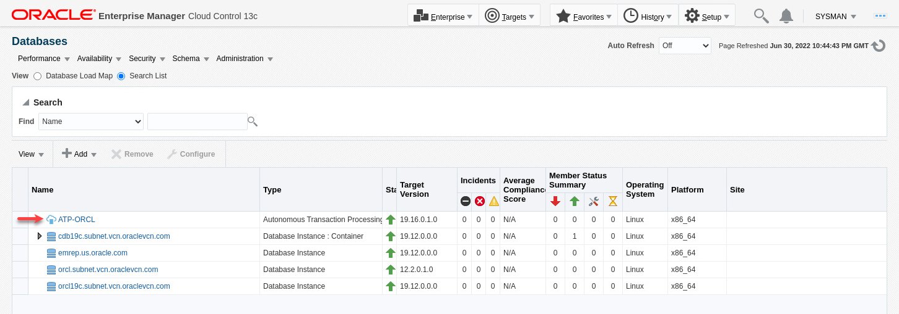
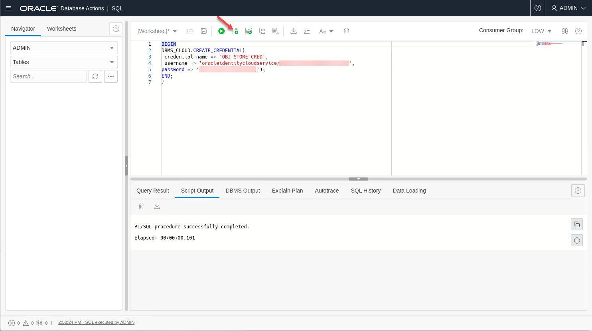
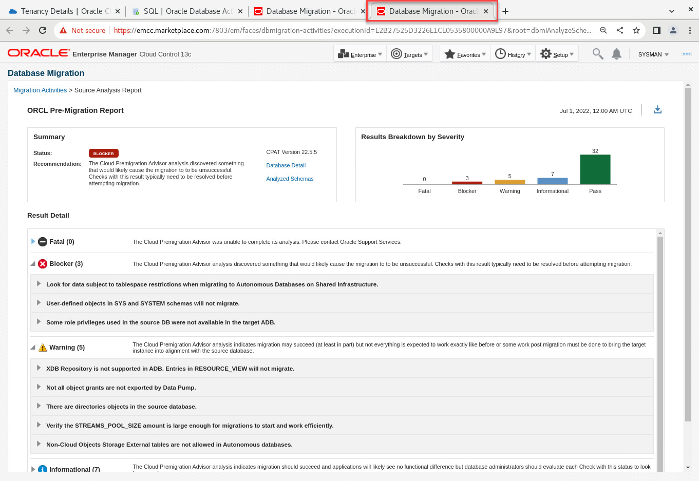
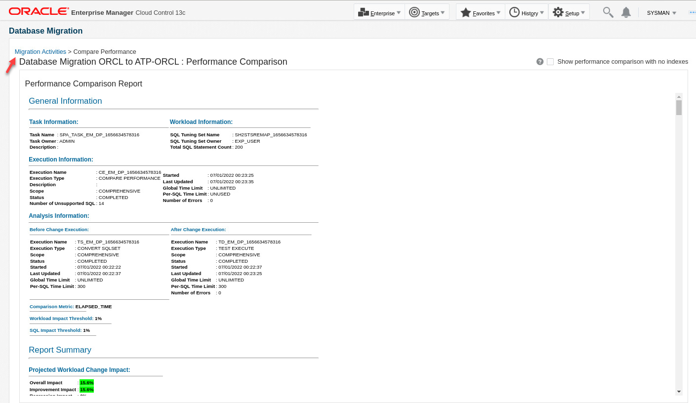

# (Optional) Migrate 12c Database to Autonomous Database in Oracle Cloud

## Introduction

You can use Database Migration Workbench to migrate your on-premises databases to to new destinations in your data center or to Autonomous Database (ADB) in Oracle Cloud Infrastructure (OCI). This lab demonstrate using Migration Workbench for **on-premises** to **Oracle Cloud Infrastructure (OCI)** migration.

*Estimated Time:* 60 minutes

### About Migration Workbench

Oracle Enterprise Manager Database Migration Workbench provides an accurate approach to migration and consolidation by eliminating human errors allowing you to easily move your on-premises databases to Oracle Cloud, Multitenant architecture or upgrade your infrastructure. Advantages of using Database Migration Workbech include: Near Zero Downtime, Assured Zero Data Loss, seamless on-premises or Cloud migrations and, MAA and Cloud Security compliant.

### Objectives

In this lab you will perform the tasks below. Task 1 is about reviewing the pre-requisites that have been completed in advance for this lab. In task 2 you will create an autonomous database in Oracle Cloud. In task 3 you will perform the pre-requisites for the autonomous database before migration. In task 4 you will create a migration activity, add details, and learn about the various configuration options. After the migration is complete, you will validate the destination database and compare performance before and after the migration.

| Task No.                                      | Description                                                                 | Approx. Time | Details                                                                                                                                                                                    |
|-----------------------------------------------------------|-------------------------------------------------------------------------|--------------|--------------------------------------------------------------------------------------------------------------------------------------------------------------------------------------------|
| 1 | Review Source Database Pre-Requisites Completed in Advance | 10 minutes | Review pre-requisites completed on the source database, host, and in Enterprise Manager |
| 2 | Create Destination Autonomous Database and Storage Bucket in OCI | 10 minutes   | Create the autonomous database and download the client wallet. Create a storage bucket to store migration files |
| 3 | Perform Target Autonomous Database Pre-Requisites | 20 minutes   | Discover the autonomous database in Enterprise Manager. Create required credentials |
| 4 | Migrate and Upgrade a 12c Non-Container Database to Autonomous Database in Oracle Cloud | 20 minutes   | Source database: orcl, destination database: ATP-ORCL |

### Prerequisites

- A Free Tier, Paid or LiveLabs Oracle Cloud account
- You have completed:
    - Lab: Prepare Setup (*Free-tier* and *Paid Tenants* only)
    - Lab: Environment Setup
    - Lab: Initialize Environment

*Note*: This lab environment is setup with Enterprise Manager Cloud Control Release 13.5 RU5, and database 19.12 as Oracle Management Repository.

## Task 1: Review Source Database Pre-Requisites Completed in Advance

In the interest of simplifying the setup and save time, the following pre-Requisite steps for the source database were completed in advance for this lab. Please review accordingly for reference:

### **Source database target discovered in Enterprise Manager**

1. On the browser window on the right preloaded with *Enterprise Manager*, if not already logged in, click on the *Username* field and login with the credentials provided below.

    ```text
    Username: <copy>sysman</copy>
    ```

    ```text
    Password: <copy>welcome1</copy>
    ```

    

2. Click on "Targets"->"Databases":

  

- orcl is our source database

### **Export User Requirement**

- For the source database (orcl), an export user (EXP_USER) was created with password "welcome1" and the required privileges
- To learn more about the the required privileges review "[Database Migration Prerequisites](https://docs.oracle.com/en/enterprise-manager/cloud-control/enterprise-manager-cloud-control/13.5/emmwb/database-migration-workbench.html#GUID-3FB0F7B7-F221-43BE-8D29-E36A18EF45C0)" in the Enterprise Manager documentation

### **Named Credential Requirement**

- Named credential "EXP\_USER" created in Enterprise Manager for user "EXP\_USER" on database "orcl"
- To review the credential in OEM console, navigate to "Setup"->"Security"->"Named Credentials"
- To learn more about named credentials review "[Named Credentials](https://docs.oracle.com/en/enterprise-manager/cloud-control/enterprise-manager-cloud-control/13.5/emsec/security-features.html#GUID-345595B0-3FA4-4F2C-A606-596B1A10A13E)" in the Enterprise Manager documentation

### **Data Pump Directory Requirement**

- Migration workbench requires a local directory on the source database with sufficient space to host the data pump dump files
- Created the following directory on the host: /u01/app/oracle/migration_workbench
- Created directory object "MWB_DIR" in the source database pointing to this directory
- Granted read and write privileges on the directory object to user EXP\_USER in the source database

### **Compare Performance Requirement**
Migrating a database can change the execution plans of SQL statements, resulting in a significant impact on SQL performance, resulting in performance degradation. SQL Performance Analyzer can review and help correct these issues.

SQL Performance Analyzer (SPA): Automates the process of assessing the overall effect of a change on the  SQL workload by identifying performance divergence for each SQL statement. A report that shows the net impact on workload performance due to the change is provided. For regressed SQL statements, SQL Performance Analyzer also provides appropriate executions plan details along with tuning recommendations. As a result, you can remedy any negative outcome before the end-users are affected. Furthermore, you can validate—with time and cost savings—that migration will result in net improvement.

An SQL Tuning Set (STS) containing the SQL and relevant execution metadata from the source database is needed to compare performance before and after the migration. Database Migration Workbench can create an STS from AWR during migration, or you can create one in advance and and pass it to to the migration procedure. For this lab we created an STS in advance (SH2STS) by running a workload against the SH2 schema in the source database and capturing the SQL statements executing during the load test.

### **(Optional) Upload Migration Tools**
Migration Workbench uses Instant Client and the Cloud Premigration Advisor Tool (CPAT) as part of its migration toolkit. Enterprise Manager automatically downloads the latest version of the tools when setup with either a MOS Proxy or direct internet connection. The tools can also be uploaded manually as described in [Upload Migration Tools] (https://docs.oracle.com/en/enterprise-manager/cloud-control/enterprise-manager-cloud-control/13.4/emlcm/upload-migration-tools.html) in the Migration Workbench documentation.

We uploaded the migration tools in advance for this lab. For additional detail on the Cloud Premigration Advisor Tool refer to this MOS document:

*Cloud Premigration Advisor Tool (CPAT) Analyzes Databases for Suitability of Cloud Migration (Doc ID 2758371.1)*

## Task 2: Create Destination Autonomous Database and Storage Bucket in OCI

1. Create Autonomous Database
    - In OCI Console, navigate to Oracle Database->Autonomous Database
    - On the left navigation bar, under "List Scope", choose the compartment you were provided for this workshop
    - Click on "Create Autonomous Database"
    - On the "Create Autonomous Database" screen:
    - Under "Provide basic information for the Autonomous Database":
        - Compartment field will be already populated
        - Display Name:

            ```text
            <copy>ATP-ORCL</copy>
            ```

        - Database Name: (Important) Leave at default value shown so that database names are unique among lab participants
        - Choose a Workload Type: Transaction Processing
        - Choose a Deployment Type: Shared Infrastructure
    - Under "Configure the database":
        - Leave all fields at default values
    - Under "Create administrator credentials"
        - Enter a password. For the purpose of this demo use:

            ```text
            <copy>Welcome12345</copy>
            ```

    - Under "Choose network access":
        - Leave all fields at default values
    - Under "Choose License and Oracle Database Edition":
        - Select "Bring Your Own License (BYOL)"
        - Database Edition options will be shown. Keep selected option (EE)
    - Click "Create Autonomous Database"
    

2. Download the ATP-ORCL client wallet using OCI console:

    - In OCI Console, navigate to Oracle Database->Autonomous Database
    - Click on the "ATP-ORCL" database to display the database homepage
    - Click "Database Actions". The Database Actions page opens in a new browser tab. If the browser blocks opening the new tab allow pop-ups from the OCI URL:
    
    - On the new tab ("Database Actions|Launchpad", click on "Download Client Credentials (Wallet)" tile under "Administration" (You may have to scroll down the page to get to that tile):
    - On the pop-up window, enter password and click "Download":

        ```text
        <copy>welcome1</copy>
        ```

    - The wallet zip file will be saved in the local "Downloads" directory

3. Create Object Storage Bucket in OCI
    - In OCI Console, navigate to Storage->Buckets
    - On the left navigation bar, under "List Scope", choose the compartment you were provided for this workshop
    - Click "Create Bucket"
    - Bucket Name:

        ```text
        <copy>bucket-mwb</copy>
        ```

    - Leave all other fields at default and click Create.

## Task 3: Perform Target Autonomous Database Pre-Requisites

  1. Discover ATP-ORCL in Enterprise Manager:

    - In Enterprise Manager console on the first tab of the browser, navigate to "Setup"->"Add Target"->"Add Target Manually"
    - On the "Add Targets Manually" screen, click the "Add Target Manually" button
    - On the resulting pop-up window:
        - Agent Host:

            ```text
            <copy>emcc.marketplace.com</copy>
            ```

        -  Target Type:

            ```text
            <copy>autonomous</copy>
            ```

        - Hit Enter
        - Select "Autonomous Transaction Processing" and click "Add":
    
    - On the "Add Autonomous Transaction Processing: Properties" screen, enter:
      - Target Name:

        ```text
        <copy>ATP-ORCL</copy>
        ```

      - OCI Client Credential (Wallet): click "Choose File" and select the wallet zip file you saved in the previous step
      - Wallet Password:

        ```text
        <copy>welcome1</copy>
        ```

      - Service Name: Choose "*DB Name*_high" from the drop-down list (should be selected by default)
      - Monitoring Username: The default monitoring user "adbsnmp" is initially locked. For this lab we'll just use the ADMIN user for monitoring. Replace "adbsnmp" with "ADMIN" (upper case):

        ```text
        <copy>ADMIN</copy>
        ```
    - Monitoring Password:

        ```text
        <copy>Welcome12345</copy>
        ```

    - Click "Test Connection" (it may take a couple of minutes to get the result back):
    
    - Click Next
    - On the Review screen click Submit
    - Click on "Targets"->"Databases". The new autonomous database has been discovered in Enterprise Manager:
    

  2. Create ATP Credential in OEM
    - Using the Enterprise Manager console, navigate to "Setup"->"Security"->"Named Credentials"
    - Click "Create"
    - On the "Create Credential" screen, enter:

      General Properties
        - Credential name:

            ```text
            <copy>ADMIN</copy>
            ```

        - Authenticating Target Type: "**Autonomous Transaction Processing**"
        - Credential type: "**Database Credentials**"
        - Scope: Target
        - Target Type: "**Autonomous Transaction Processing**"
        - Target Name:

            ```text
            <copy>ATP-ORCL</copy>
            ```

      Credential Properties
        - UserName:

            ```text
            <copy>ADMIN</copy>
            ```

        - Password:

            ```text
            <copy>Welcome12345</copy>
           ```

      - Role: Normal

    

    - Click “Test and Save”. You should get "*Confirmation credential operation successful*". If not, review the steps above and retry.

  3. Generate RSA key pair in PEM format

    In the top-right corner of the Console, open the Profile menu (User menu icon), then click User Settings to view the details:
    - In the left navigation bar, under "Resources", click on "API Keys"
    - Under “API Keys” click “Add API Key”.
    - In the pop-up window, keep the default option "Generate API Key Pair" selected
    - Click "Download Private Key" and save it to the Downloads folder in your NoVNC window (the file name will have an extension of ".pem")
    - Click "Add"
    
    - The text shown under "Fingerprint" is the public key. Make a note of it as it will be used in a subsequent step. To save it to a text file, click on "Applications" on the top left corner of your NoVNC window, then "Accessories"->"Text Editor". Paste the public key and save the file to the desktop
    

  4. Create an OCI Auth Token

    While on the same screen in the OCI Console from previous step:
    - In the left navigation bar, under "Resources", click on "Auth Tokens"
    - Under "Auth Tokens" click Generate Token:
      - Description:

          ```text
          <copy>Migration Workbench</copy>
          ```

      - Click Generate Token

    - The new Auth Token is displayed
    - Copy the auth token and save it to a file to retrieve it later, it won't be shown again in the Console. Open a new tab in the Text Editor you launched in the previous step, paste the token, and save the file to the desktop
    - Close the Generate Token dialog:
    

  5. Create OCI Credential in Enterprise Manager
    - Make a note of your Tenancy OCID and User OCID:
        - Open a new tab in the Text Editor you launched in the previous step. You will save your tenancy OCID and User OCID here to use later in this step
        - On the OCI console, click on the user icon on the top right of the screen
        - Click on your tenancy link. Under "Tenancy Information" copy the tenancy OCID to the text editor
        - Click again on the user icon, then click on User Settings
        - Under "User Information" copy your user OCID to the text editor  

    - Using the Enterprise Manager console, navigate to "Setup"->"Security"->"Named Credentials"
    - Click "Create"
    - On the "Create Credential" screen, enter:
  
      General Properties
  
        - Credential name:

            ```text
            <copy>OCI</copy>
            ```

        - Authenticating Target Type: **Autonomous Transaction Processing**
        - Credential type: **Oracle Cloud Infrastructure Credential**
        - Scope: Target
        - Target Type: **Autonomous Transaction Processing**
        - Target Name:

            ```text
            <copy>ATP-ORCL</copy>
            ```

      Credential Properties

        - Tenancy OCID: Tenancy OCID you copied earlier in this step
        - User OCID: User OCID you copied earlier in this step
        - Public Key Fingerprint: Public Key Fingerprint you saved to your desktop
        - Private Key: Private Key you saved to the Downloads folder (file with extension of ".pem")

      

    - Click Save. You should get "Confirmation credential operation successful". If not, review the steps above and retry

  6. Create Authentication Credential in ADB

    Create an "Auth Token" based credential in the Autonomous Database and set it as a default credential that will be required for authentication between the Autonomous Database and OCI object storage.

    - This step requires your fully qualified OCI username, not your user OCID used in the previous step. In OCI console, click on the user icon on the top right of the page, then click on "User Details". Make a note of your fully qualified username at the top of the screen
      
    - In OCI Console, navigate to Oracle Database->Autonomous Database
    - Click on the "ATP-ORCL" database to display the database homepage
    - Click "Database Actions". The Database Actions page opens in a new browser tab
    - Under "Development" heading, click on "SQL" (first tile) 
    - Execute the following code:

        ```text
        <copy>
        BEGIN
        DBMS_CLOUD.CREATE_CREDENTIAL(
         credential_name => 'OBJ_STORE_CRED',
         username => 'Your fully qualified OCI username from earlier in this step',
        password => 'Value of your Migration Workbench token you saved earlier to the desktop');
        END;
        /
        </copy>
        ```
      
    - Next execute the following SQL statement:

        ```text
        <copy>
        ALTER DATABASE PROPERTY SET default_credential = 'ADMIN.OBJ_STORE_CRED';
        </copy>
        ```
      

## Task 4: Migrate and Upgrade a 12c Non-Container Database to Autonomous Database in Oracle Cloud

### **Overview**

In this step we'll migrate and upgrade an Oracle 12c database to autonomous database in Oracle Cloud Infrastructure (OCI). For migration to OCI, the Migration Workbench supports the data pump migration method as of EM 13.5 RU5. Additional migration methods may be added in future releases.

### **Execution**

1. Log into your Enterprise Manager as sysman as indicated in the Prerequisites step if not already done
2. From the Enterprise menu, navigate to "Migration and Consolidation"->"Database Migration Workbench"
          
3. On the "Database Migration" page, expand the "Getting Started" section if collapsed. Examine the Migration Workbench workflow, then click on "Create Migration Activity"
          

4. On the Create Migration Activity screen:
    - Activity Name:

        ```text
        <copy>Database Migration ORCL to ATP-ORCL</copy>
        ```

    - Migrate: Expand the drop-down list. Note the options are "Full Database", "Schemas", and "Tablespaces". We'll choose "Full Database" in this workshop
        
    - Select Source Database: orcl.subnet.vcn.oraclevcn.com
    - Select Destination Database: ATP-ORCL
    - Note checkmark for "Tools Validation". For this lab, CPAT tool was uploaded to Enterprise Manager in advance
    - Click Continue
      
5. On the Add Details screen:

    - Database Credentials: EXP_USER (Named Credential)
    - Host Credential: ORACLE (Named Credential)

    Destination:
    - Database Credential: ADMIN (Named Credential)
    - Agent Host Credential: ORACLE (Named Credential)
    - Service Name: *database name*_high (TCPS) (Should be selected by default)

    Action:
    - Migration Method: Data Pump (default)
    - Recompile Invalid Objects After Migration: Unchecked (default)
    - Compare Performance After Migration: Checked (default)
    - Source Data Pump Directory: MWB_DIR
    - Encryption Password:

        ```text
        <copy>welcome1</copy>
        ```

    - Cloud Storage URL:

        ```text
        <copy>objectstorage.us-ashburn-1.oraclecloud.com</copy>
        ```

    - Bucket Name:

        ```text
        <copy>bucket-mwb</copy>
        ```

    - OCI Credential: OCI
    - Database OCI Auth Credential: ADMIN.MWB_CRED
    - Click Next
      

6. On the Customize screen
    - Examine the various options you can configure for Export and Import
    - For the purpose of this lab, we'll go with the default options for Export and Import options except for Parallel. The degree of parallelism you choose depends on the number of CPU cores on your source and target databases. We'll choose 2 for this lab
    - Under "Compare Performance After Migration" choose "Use Existing" then select STS "EXP_USER -- SH2STS"
    - Notice mapping the Users tablespace in the source database to Data table space in the destination database
    - Leave everything else at default for the purpose of this lab
    - Click Review
    

7. On the "Review & Submit" screen, review your entries and click "Analyze Source" in the Source column
    
    - The analysis will open in a new browser tab and will take a few minutes to complete
    - When the analysis is complete review CPAT Results. The blockers and warnings in this case are expected as a few objects in the on-prem database are not available in autonomous database. When you run this activity in your environment ensure you address any issues identified on a case by case basis. You can download the CPAT results if desired
    
    - Click on the previous browser tab to continue with the migration process
    - Click "Validate"
    

8. Validation checks run for a few minutes and all checks should pass. If your results are different check your previous steps, fix the error and revalidate
    - Click "Close & Submit"
    

9. On the Submit Activity screen, check the "Confirm that you have done source analysis" checkbox
    
10. Click submit, then click "Close and Go Back to Activities Page"
11. On the activity page, change the Auto Refresh to 1 minute
    
11. Click on the "Running" link under Status to go to the procedure activity page. Choose Show: "Steps Not Skipped"
    
12. When the procedure completes, it will most likely show there were some errors. We'll check those when we analyze the migration:
    
13. From the Enterprise Menu, click "Migration and Consolidation"->"Database Migration Workbench" to check the activity page. Click on the View Analysis link from the drop-down menu on the right of the activity row
    
14. Examine the analysis report
    - Review validation checks that passed, failed or skipped
    - Review the export and import tabs for time taken to complete export and import activities, the number of objects exported and imported, and the errors reported during export and import activities
    - For further details on the errors you can review log file using procedure activity step mentioned in step #12
    - In your environment you may need to take actions such as granting specific object privileges to fix the errors. However for this lab the errors shown can be ignored
    - When you are done analyzing the migration, click on "Migration Activities" in the top left of the report to navigate back to the activity page
    

15. Click on the "Compare Performance" link from the drop-down menu on the right of the activity row

    

16. Examine the Performance Comparison report to analyze the database performance before and after the migration
    - Review overall performance impact on application to end user after the migration
    - Analyze top 100 impacted SQLs shown in absolute percentage. SQLs highlighted in green have improved performance due to improved execution plan or query cost. Those highlghted in red have regressed due to execution plan change or execution problems (for example query returning no rows, or number of rows returned is different in destination than in source, etc.)
    - Check regressed SQLs to see execution statistics, before and after migration change analysis
    - Analyze findings provided for each query to see which factors impacted the regressed SQLs. You can take action based on findings provided to improve  performance
    - When you are done with performance comparison, click on "Migration Activities" in the top left of the report to navigate back to the activity page

      

17. Click on the "Mark as Completed" link from the drop-down menu on the right of the activity row

    

18. Examine the guidelines on the Confirmation pop-up window, enter any comments as appropriate, then click yes

    

19. Activity is marked completed

     

    You have now completed this task.

This completes the Lab!

You may now [proceed to the next lab](#next).

## Learn More

- [Oracle Enterprise Manager](https://www.oracle.com/enterprise-manager/)
- [Enterprise Manager Documentation Library](https://docs.oracle.com/en/enterprise-manager/index.html)
- [Database Lifecycle Management](https://docs.oracle.com/en/enterprise-manager/cloud-control/enterprise-manager-cloud-control/13.4/lifecycle.html)

## Acknowledgements

- **Author** - Amine Tarhini, Systems Management Specialist, Oracle Platform Solution Engineering
- **Contributors** -  Harish Niddagatta, Oracle Enterprise Manager Product Management
- **Last Updated By/Date** - Amine Tarhini, June 2022
