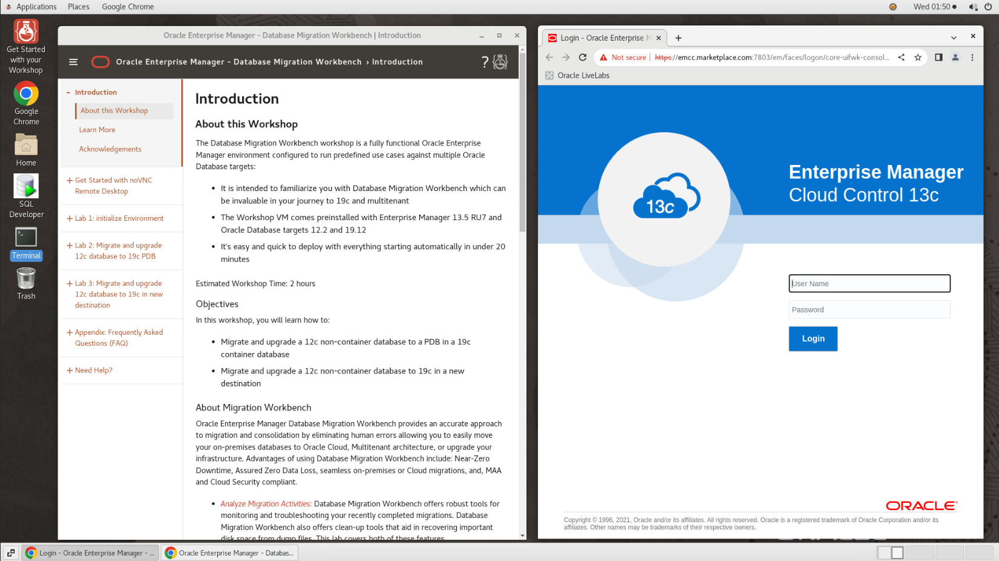
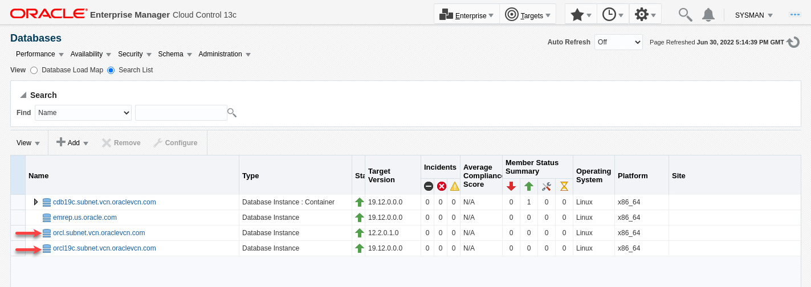
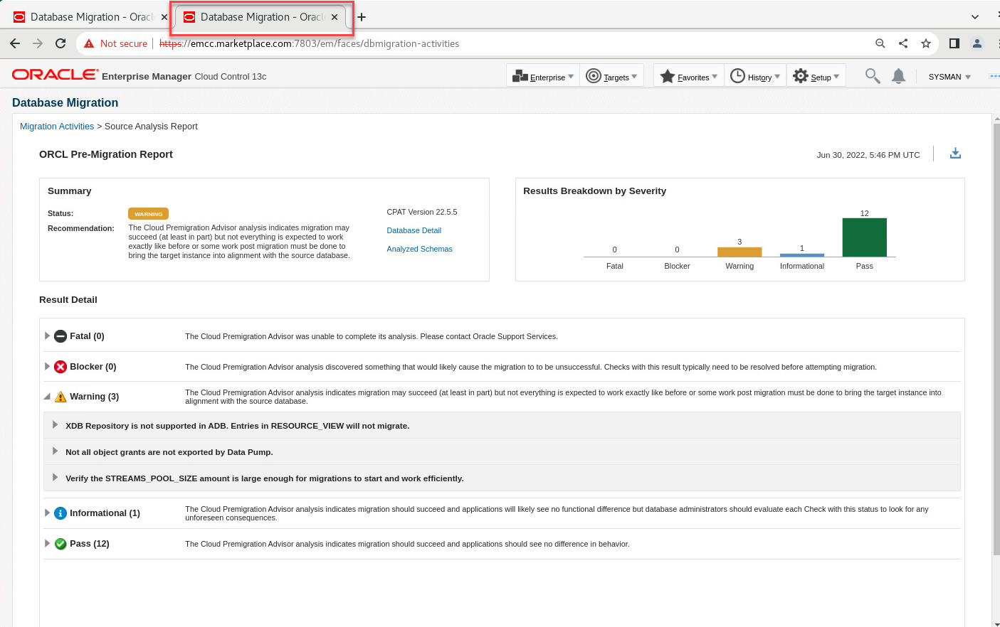
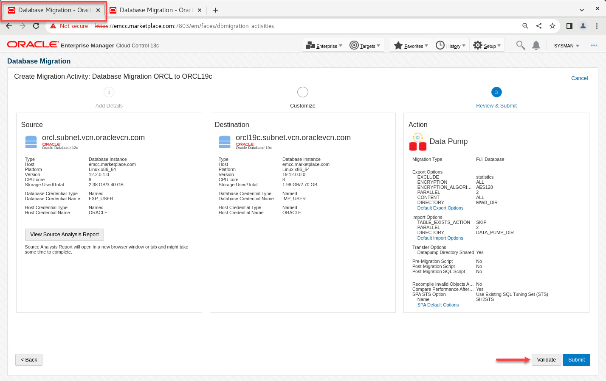
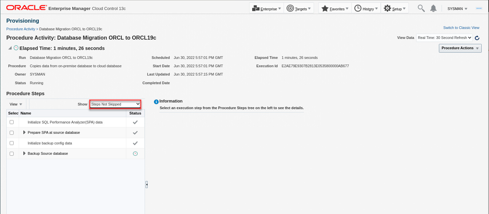
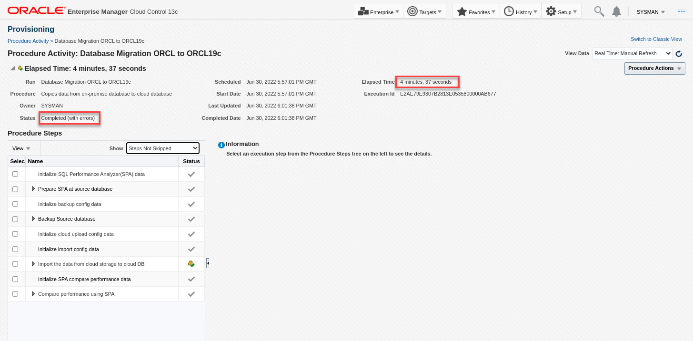
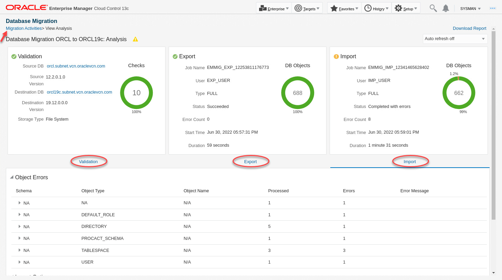
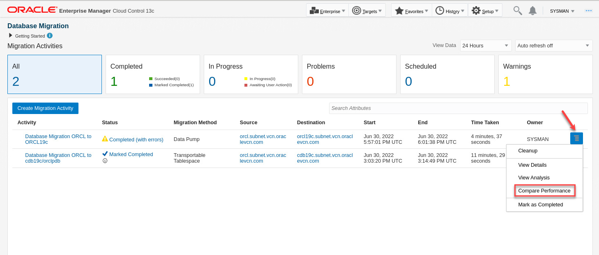
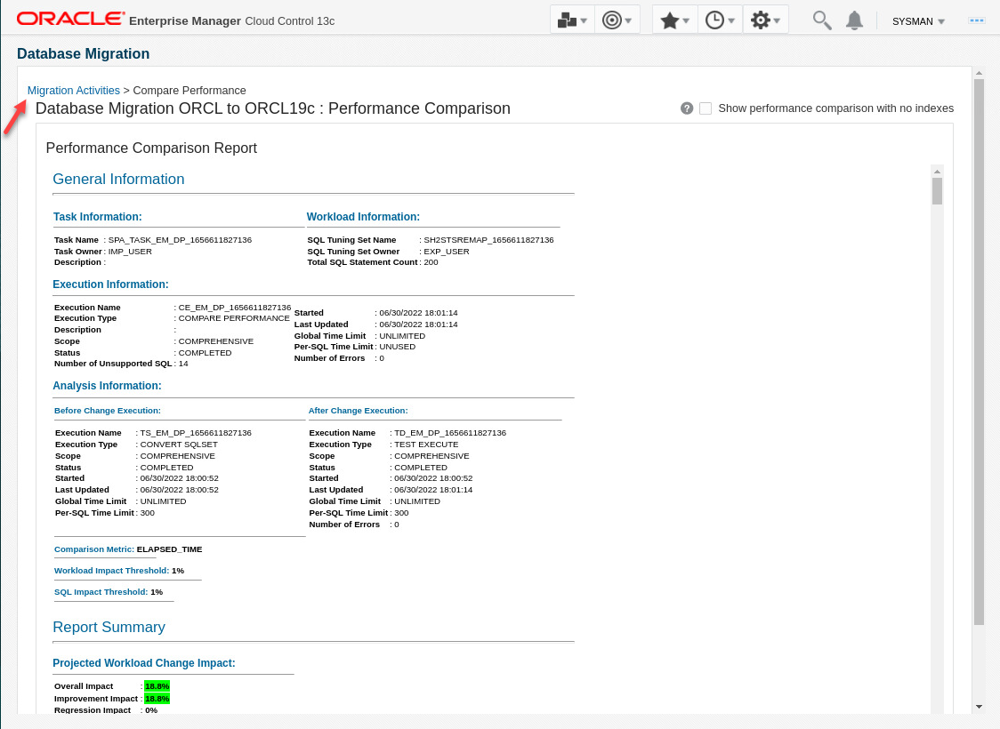

# Migrate and upgrade 12c database to 19c in new destination

## Introduction

You can use Database Migration Workbench to migrate your on-premises databases to new destinations in your data center or Autonomous Database (ADB) in Oracle Cloud Infrastructure (OCI). This lab demonstrates using Migration Workbench for **on-premises** to **on-premises** migrations. Since the workshop is fully contained in a single VM, the source and destination databases are on the same host, but the instructions apply when migrating databases to new hosts.

Estimated Time: 30 minutes

### About Migration Workbench

Oracle Enterprise Manager Database Migration Workbench provides an accurate approach to migration and consolidation by eliminating human errors allowing you to easily move your on-premises databases to Oracle Cloud, Multitenant architecture, or upgrade your infrastructure. Advantages of using Database Migration Workbench include: Near-Zero Downtime, Assured Zero Data Loss, seamless on-premises or Cloud migrations, and, MAA and Cloud Security compliant.

- _Analyze Migration Activities:_ Database Migration Workbench offers robust tools for monitoring and troubleshooting your recently completed migrations. Database Migration Workbench also offers clean-up tools that aid in recovering important disk space from dump files. This lab covers both of these features.

- _Analyze Migrated Database Performance:_ Migrating a database can change the execution plans of SQL statements, resulting in a significant impact on SQL performance, resulting in performance degradation. Database Migration Workbench is integrated with [SQL Performance Analyzer (SPA)] (<https://docs.oracle.com/en/database/oracle/oracle-database/19/ratug/sql-performance-analyzer.html>) which can help correct these issues. This lab uses SPA to compare the performance of the database before and after the migration.

- _Security Compliance:_ Since Database Migration Workbench is a component of Oracle Enterprise Manager, your migrated databases are automatically added/updated in Enterprise Manager. You can utilize the [Compliance Management](https://docs.oracle.com/en/enterprise-manager/cloud-control/enterprise-manager-cloud-control/13.5/emlcm/manage-compliance.html) feature in Enterprise Manager to improve your database fleet security posture. Enterprise Manager Compliance Management leverages industry/regulatory standards for secure configuration such as CIS Benchmark, DISA STIG, and Oracle Security Best Practices.

>**Note:** Migration Workbench and SQL Performance Analyzer are licensed under Real Application Testing (RAT) Management Pack. Compliance Management is licensed under Database Lifecycle Management Pack (DBLM).

### Objectives

In this lab you will perform the tasks below. Task 1 is to review the prerequisites completed in advance for this lab. In task 2 you will create a migration activity, add details, and learn about the various configuration options. After the migration is complete, you will analyze the migration activity and compare performance before and after the migration.

| Task No.                                      | Description                                                                 | Approx. Time | Details                                                                                                                                                                                    |
|-----------------------------------------------------------|-------------------------------------------------------------------------|--------------|--------------------------------------------------------------------------------------------------------------------------------------------------------------------------------------------|
| 1 | Review prerequisites completed in advance| 10 minutes | Review prerequisites completed on the source and destination databases, hosts, and in Enterprise Manager |
| 2 | Migrate and upgrade a 12c non-container database to 19c in a new destination | 20 minutes   | Source database: orcl, destination database: orcl19c |

### Prerequisites

- A Free Tier, Paid or LiveLabs Oracle Cloud account
- You have completed:
    - Lab: Prepare Setup (*Free-tier* and *Paid Tenants* only)
    - Lab: Environment Setup
    - Lab: Initialize Environment

>**Note:** This lab environment is setup with Enterprise Manager Cloud Control Release 13.5 RU7, and database 19.12 as Oracle Management Repository.

## Task 1: Review prerequisites completed in advance

In the interest of simplifying the setup and to save time, the following requirements were completed in advance and covered in this lab. Please review accordingly for reference.

- Source and destination targets are discovered in Enterprise Manager
    1. On the browser window on the right preloaded with *Enterprise Manager*, if not already logged in, click on the *Username* field and login with the credentials provided below

        ```text
        Username: <copy>sysman</copy>
        ```

        ```text
        Password: <copy>welcome1</copy>
        ```

        
    2. Click on "Targets"->"Databases"
    
    - orcl is our source database
    - orcl19 is our destination database
- Data Pump user requirement
    - For the source database (orcl), an export user (EXP_USER) was created with password "welcome1" and the required privileges
    - For migrating the database to a new non-container database, an import user (IMP_USER) was created in the target database (orcl19c) with password "welcome1" and the required privileges
    - To learn more about the the required privileges review "[Database Migration Prerequisites](https://docs.oracle.com/en/enterprise-manager/cloud-control/enterprise-manager-cloud-control/13.5/emmwb/database-migration-workbench.html#GUID-3FB0F7B7-F221-43BE-8D29-E36A18EF45C0)" in the Enterprise Manager documentation

- Named Credential requirement
    - Named Credentials "EXP\_USER" and "IMP\_USER" created in Enterprise Manager for users "EXP\_USER" and "IMP\_USER" on databases "orcl" and orcl19c respectively
    - To review the credentials in OEM console, navigate to "Setup"->"Security"->"Named Credentials"
    - To learn more about named credentials review "[Named Credentials](https://docs.oracle.com/en/enterprise-manager/cloud-control/enterprise-manager-cloud-control/13.5/emsec/security-features.html#GUID-345595B0-3FA4-4F2C-A606-596B1A10A13E)" in the Enterprise Manager documentation

- Data Pump directory requirement

    Migration workbench requires local directories on the source and target databases with sufficient space to host the data pump dump files. In our workshop both the source and target databases are running on the same host.
    - Created the following directory on the host: /u01/app/oracle/migration_workbench
    - Created directory object "MWB_DIR" in both source and target databases pointing to this directory
    - Granted read and write privileges on the directory object in each database to the corresponding user (EXP\_USER in source database and IMP\_USER in target database)

- Compare performance requirement

    Migrating a database can change the execution plans of SQL statements, resulting in a significant impact on SQL performance, resulting in performance degradation. SQL Performance Analyzer can review and help correct these issues.

    SQL Performance Analyzer (SPA) automates the process of assessing the overall effect of a change on the  SQL workload by identifying performance divergence for each SQL statement. A report that shows the net impact on workload performance due to the change is provided. For regressed SQL statements, SQL Performance Analyzer also provides appropriate execution plan details along with tuning recommendations. As a result, you can remedy any negative outcome before the end-users are affected. Furthermore, you can validate -with time and cost savings- that migration will result in net improvement.

    An SQL Tuning Set (STS) containing the SQL and relevant execution metadata from the source database is needed to compare performance before and after the migration. Database Migration Workbench can create an STS from AWR during migration, or you can create one in advance and pass it to the migration procedure.

    - For this lab, an STS was created in advance (SH2STS) by running a workload against the SH2 schema in the source database and capturing the SQL statements executing during the load test

- Upload migration tools

    Migration Workbench uses Instant Client and the Cloud Premigration Advisor Tool (CPAT) as part of its migration toolkit. Enterprise Manager automatically downloads the latest version of the tools when set up with either a MOS Proxy or direct internet connection. The tools can also be uploaded manually as described in [Upload Migration Tools] (<https://docs.oracle.com/en/enterprise-manager/cloud-control/enterprise-manager-cloud-control/13.4/emlcm/upload-migration-tools.html>) in the Migration Workbench documentation.

    - For this lab the migration tools were uploaded in advance. For additional detail on the Cloud Premigration Advisor Tool refer to this MOS document: *Cloud Premigration Advisor Tool (CPAT) Analyzes Databases for Suitability of Cloud Migration (Doc ID 2758371.1)*

    You have now completed this task.

## Task 2: Migrate and upgrade a 12c non-container database to 19c in a new destination

### **Overview**

In this task we'll migrate and upgrade an Oracle 12c database to version 19c in a new destination. This would be the case when refreshing hardware and/or moving the database to a new host in your data center. Our source database is "orcl" and our target database is "orcl19c".

We'll use the Data Pump migration method in this task.

### **Execution**

1. Log into your Enterprise Manager as sysman as indicated in task 1 if not already done
2. From the Enterprise menu
    - Navigate to "Migration and Consolidation"->"Database Migration Workbench"
    
3. On the "Database Migration" screen:
    - Expand the "Getting Started" section if collapsed. Examine the Migration Workbench workflow
    
    - Click on "Create Migration Activity"
4. On the Create Migration Activity screen, enter:
    - Activity Name:

        ```text
        <copy>Database Migration ORCL to ORCL19c</copy>
        ```

    - Migrate: Select "Full Database" from the drop-down list

        Migration Workbench allows you to migrate full database, schemas, or tablespaces. We'll migrate full database in this lab
        
    - Select Source Database:  Click inside the field and select "orcl.subnet.vcn.oraclevcn.com" from the drop-down list
    - Select Destination Database:  Click inside the field and select "orcl19c.subnet.vcn.oraclevcn.com" from the drop-down list
    - Notice the checkmark for "Tools Validation". For this lab, CPAT tool was uploaded to Enterprise Manager in advance
      
    - Click Continue
5. On the Add Details screen, enter:
    - Source:
        - Database Credentials: EXP_USER (Named Credential)
        - Host Credential: ORACLE (Named Credential)
    - Destination:
        - Database Credential: IMP_USER (Named Credential)
        - Agent Host Credential: ORACLE (Named Credential)
    - Action:
        - Migration Method: Data Pump (default)
        - Recompile Invalid Objects After Migration: Unchecked (default)
        - Compare Performance After Migration: Checked (default)
        - Source Data Pump Directory: MWB_DIR
        - Destination Data Pump Directory: MWB_DIR
        - Encryption Password:

            ```text
            <copy>welcome1</copy>
            ```

      
    - Click Next
6. On the Customize screen, enter:
    - Export Options:

        Examine the various export options you can configure with Migration Workbench. For the purpose of this lab, we'll go with the defaults shown except for Parallel. The degree of parallelism you choose depends on the number of CPU cores on your source and target databases. We'll use 2 in this lab
        - Parallel: 2
    - Import Options:

        Examine the various import options you can configure with Migration Workbench. For the purpose of this lab, we'll go with the defaults shown except for Parallel. The degree of parallelism you choose depends on the number of CPU cores on your source and target databases. We'll use 2 in this lab
        - Parallel: 2
    - Compare Performance After Migration:
        - SQL Tuning Set (STS): Select "Use Existing" then choose "EXP_USER -- SH2STS"
    - Custom Scripts:

        Migration Workbench allows customization of your migration activity by allowing you upload and use Pre and Post migration scripts. For more information on Pre and Post scripts see: [Pre/Post Scripts for Provisioning] (<https://docs.oracle.com/pls/topic/lookup?ctx=en/enterprise-manager/cloud-control/enterprise-manager-cloud-control/13.5/emmwb&id=EMLCM-GUID-CDF550E0-9F86-42BC-909C-F224869F58CC>) in Oracle Enterprise Manager Cloud Control Database Lifecycle Management Administrator's Guide and [Pre and Post Request Creation / Deletion Scripts](https://docs.oracle.com/pls/topic/lookup?ctx=en/enterprise-manager/cloud-control/enterprise-manager-cloud-control/13.5/emmwb&id=EMCLO-GUID-223719D5-21B5-4AC3-A94B-0C7A3DFF0831) in Oracle Enterprise Manager Cloud Administration Guide
    - Transfer Options:
        - Datapump Directory is shared: Checked

        
    - Click Review
7. On the "Review & Submit" screen:
    - Review your entries to make sure everything is correct
    
    - Click "Analyze Source" in the Source column. The analysis will open in a new browser tab and will take a few minutes to complete
    - When the analysis is complete review CPAT Results. The warnings shown can be ignored for the purpose of this lab. When you run this activity in your environment ensure you address any issues identified on a case by case basis
    
    - Click on the previous tab to continue with the migration process
    
    - Click Validate
8. On the Validation screen:
    - Validation checks run for a few minutes and all checks should pass. If your results are different check your previous steps, fix the error and revalidate
    
    - Click "Close & Submit"
9. On the Submit Activity screen:
    - Choose Schedule: Start Immediately (default)

        Examine the JSON file. Notice you can copy the generated JSON file to use it with with DevOps tools and REST APIs. For this lab however, we'll complete the migration using the Enterprise Manager graphical console
    
    - Click Submit
    - You should receive the message: "Migration activity submitted successfully."
    
    - Click "Close and Go Back to Activities Page"
10. On the Migration Activities screen:
    - The activity status will show "Scheduled" at first. Refresh the page after a few seconds and it will change to "Running". You can also change the Auto Refresh to every minute
    
    - Click on the "Running" link under Status to go to the Procedure Activity screen
11. On the Procedure Activity screen::
    - Click on the "Running" link under Status to go to the procedure activity screen. Choose Show: "Steps Not Skipped". The procedure should take about 5 minutes to complete
    
    - When the procedure completes, it will most likely show there were some errors. We'll check those when we analyze the migration
    
    - From the Enterprise Menu, click "Migration and Consolidation"->"Database Migration Workbench" to go back to the Migration Activities screen
12. On the Migration Activities screen:
    - Expand the drop-down menu on the right of the activity row
    
    - Click on View Analysis
13. On the View Analysis screen:

    Examine the analysis report. The report has 2 sections: A summary dashboard at the top, and a detail section with 3 tabs: Analysis, Export, and Import.
    - On the summary dashboard, review information and statistics for the validation activity, export phase, and import phase
    - In the details section:
        - Click the Validation tab to review validation checks that passed, failed, or skipped
        - Click the Export tab to review details on object errors encountered during export, export options, and export files
        - Click on the Import tab to review details on object errors encountered during import, import options, and import files
        - For further details on the errors review the log file using the Procedure Activity page shown earlier. On that page, you can check the checkbox for any step to display the log file on the screen. You can also download the file for offline viewing
        - In your environment, you may need to take actions such as granting specific object privileges to fix the errors. However, for this lab, the errors shown can be ignored

    
    When you are done analyzing the migration, click on "Migration Activities" in the top left of the report to navigate back to the Migration Activities screen
14. On the Migration Activities screen:
    - Expand the drop-down menu on the right of the activity row
    
    - Click on Compare Performance
15. On the Compare Performance screen:

    Examine the Performance Comparison report to analyze the database performance before and after the migration. The report has 3 sections:
    1. General Information: Contains information about the task, workload, execution, and analysis before and after migration. The  comparison metric used is "Elapsed Time"
    2. Report Summary: Contains 3 sections:
        - Projected Workload Change Impact: This shows the overall impact of the migration on the SQL workload, the improvement impact, and the regression impact
        - SQL Statement Count: This shows the overall statement count, the number of SQLs that improved, regressed, or were unchanged
        - Top 100 SQL Sorted by Absolute Value of Change Impact on the Workload: This shows the top 100 impacted SQLs with absolute percentage improvement. SQLs highlighted in green have improved performance due to improved execution plans or query costs. Those highlighted in red have regressed due to execution plan change or execution problems (for example query returning no rows or number of rows returned is different in the destination than in source, etc.)

            Check regressed SQLs to see execution statistics, before and after migration change analysis. Understand findings provided for each query to see which factors impacted the regressed SQLs. You can then take action based on findings provided in the Report Details section to improve SQL performance
    3. Report Details: Contains detailed execution details for each SQL statement in the STS, including the SQL test, execution frequency, executions statistics, notes, findings, and execution plan before and after the migration

        
    - When you are done with performance comparison, click on "Migration Activities" in the top left of the report to navigate back to the Migration Activities screen
16. On the Migration Activities screen:
    - Expand the drop-down menu on the right of the activity row
    
    - Click Mark as Completed
    - Examine the guidelines on the Confirmation pop-up window, enter any comments as appropriate
    
    - Click Yes
     
    - Activity is marked completed

    You have now completed this task.

This completes the Lab!

You may now **proceed to the next lab**.

## Learn More

- [Oracle Enterprise Manager](https://www.oracle.com/enterprise-manager/)
- [Enterprise Manager Documentation Library](https://docs.oracle.com/en/enterprise-manager/index.html)
- [Database Migration Workbench Guide](https://docs.oracle.com/en/enterprise-manager/cloud-control/enterprise-manager-cloud-control/13.5/emmwb/index.html)

## Acknowledgements

- **Author** - Amine Tarhini, Systems Management Specialist, Oracle Platform Solution Engineering
- **Contributors** -  Harish Niddagatta, Enterprise Manager Product Management, Rajendra Patil, Enterprise Manager Product Manager
- **Last Updated By/Date** - Amine Tarhini, July 2022
