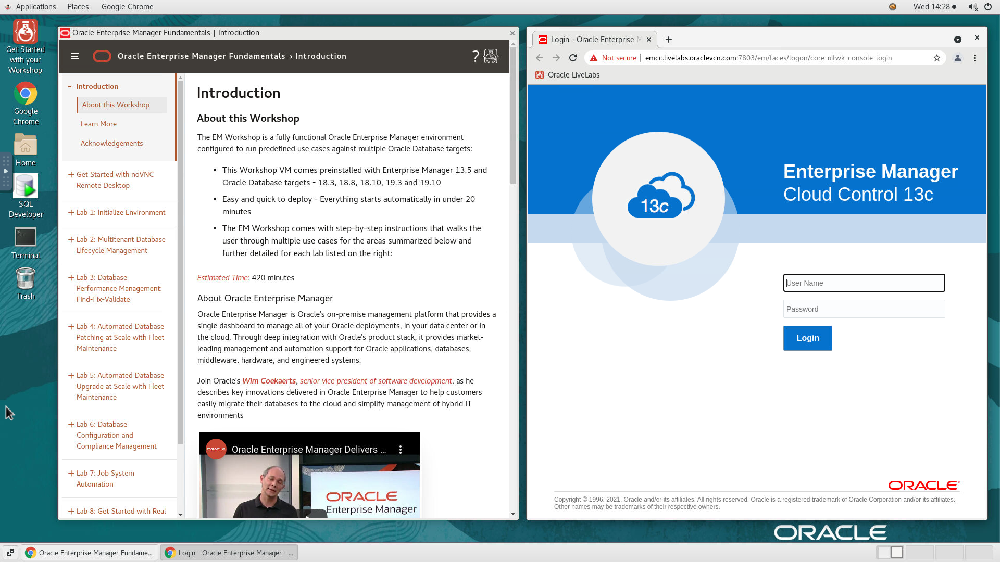
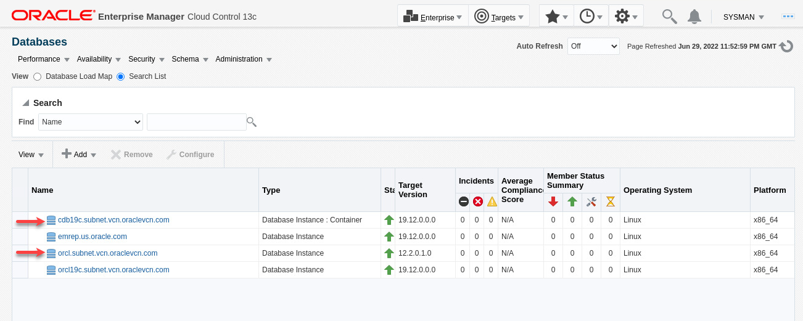
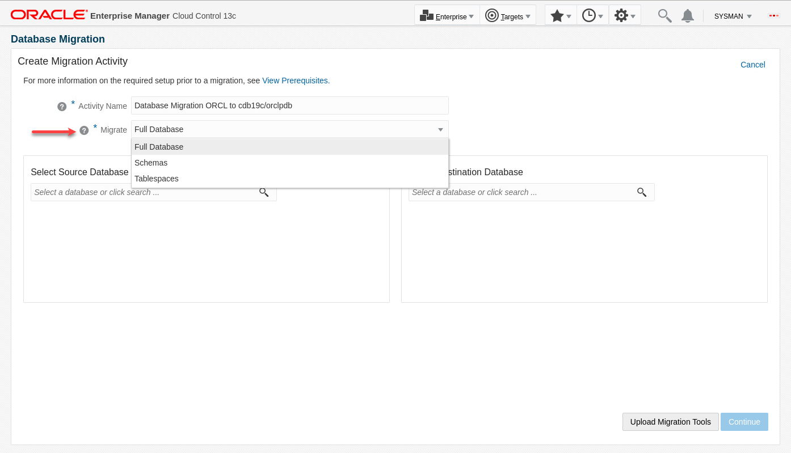
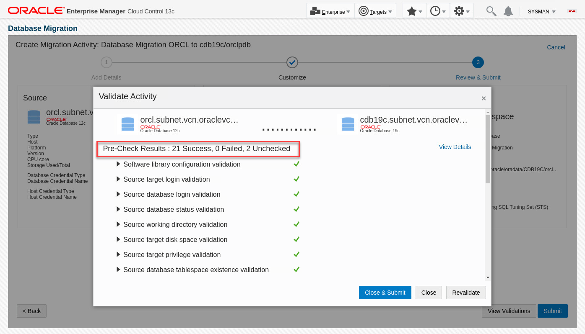
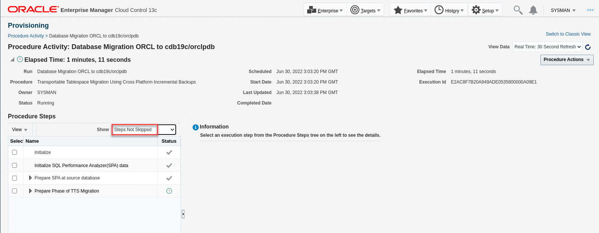

# Migrate 12c Database to 19c Pluggable Database

## Introduction

You can use the database migration workbench to migrate your on-premises databases to new destinations in your data center or to Autonomous Database (ADB) in Oracle Cloud Infrastructure (OCI). This lab demonstrates using Migration Workbench for **on-premises** to **on-premises** migrations. Note since this workshop is fully contained on a single VM, the source and destination databases are on the same host, but the instructions apply when migrating databases to new hosts.

*Estimated Time:* 30 minutes

### About Migration Workbench

Oracle Enterprise Manager Database Migration Workbench provides an accurate approach to migration and consolidation by eliminating human errors allowing you to easily move your on-premises databases to Oracle Cloud, Multitenant architecture or upgrade your infrastructure. Advantages of using Database Migration Workbech include: Near Zero Downtime, Assured Zero Data Loss, seamless on-premises or Cloud migrations and, MAA and Cloud Security compliant.

### Objectives

In this lab you will perform the Tasks below. The pre-requisites in task have already been performed in a terminal window, but we'll use the Enterprise manager console for the migration tasks. In each of the migration tasks you will create a migration activity, add details, and learn about the various configuration options. After the migration is complete, you will validate the destination database and compare performance before and after the migration.

| Task No.                                      | Description                                                                 | Approx. Time | Details                                                                                                                                                                                    |
|-----------------------------------------------------------|-------------------------------------------------------------------------|--------------|--------------------------------------------------------------------------------------------------------------------------------------------------------------------------------------------|
| 1 | Review Pre-Requisites completed in advance| 10 minutes | Review pre-requisites required on the source and destination databases, hosts, and in Enterprise Manager |
| 2 | Migrate and upgrade a 12c non-container database to a new pdb in a 19c container database | 20 minutes | Source database: orcl, destination pdb: cdb19c/orclpdb

### Prerequisites

- A Free Tier, Paid or LiveLabs Oracle Cloud account
- You have completed:
  - Lab: Prepare Setup (*Free-tier* and *Paid Tenants* only)
  - Lab: Environment Setup
  - Lab: Initialize Environment

*Note*: This lab environment is setup with Enterprise Manager Cloud Control Release 13.5 RU7, and database 19.12 as Oracle Management Repository.

## Task 1: Review Pre-Requisite Tasks Completed in Advance

In the interest of simplifying the setup and save time, the following steps were completed in advance and covered in this lab. Please review accordingly for reference:

### **Source and destination targets are discovered in Enterprise Manager**

1. On the browser window on the right preloaded with *Enterprise Manager*, if not already logged in, click on the *Username* field and login with the credentials provided below.

    ```text
    Username: <copy>sysman</copy>
    ```

    ```text
    Password: <copy>welcome1</copy>
    ```

    

2. Click on "Targets"->"Databases":

- orcl is our source database
- cdb19c is our destination container database
  

### **Export and Import User Requirement**

In this task we will migrate the database using the Transportable Tablespace (TTS) migration method. With this method the migration must done as a user with SYSDBA role. We will use SYS on both source and destination databases so there's no additional user requirements

### **Named Credential Requirement**

- Database Named credential "SYS" created in Enterprise Manager with Global Scope. It can be used with both source and destination databases in this lab
- Host Named Credential "ORACLE", with OS user "oracle" created in Enterprise Manager for the lab host
- To review the credentials in OEM console, navigate to "Setup"->"Security"->"Named Credentials"
- To learn more about named credentials review "[Named Credentials](https://docs.oracle.com/en/enterprise-manager/cloud-control/enterprise-manager-cloud-control/13.5/emsec/security-features.html#GUID-345595B0-3FA4-4F2C-A606-596B1A10A13E)" in the Enterprise Manager documentation

### **Data Pump Directory Requirement**

- Migration workbench requires local directories on the source and target databases with sufficient space to host the data pump dump files. In our workshop both the source and target databases are running on the same host:
- Created the following directory on the host: /u01/app/oracle/migration_workbench
- Created directory object "MWB_DIR" in source database pointing to this directory

### **Compare Performance Requirement**

### **CPAT Requirement**

## Task 2: Migrate and Upgrade a 12c Non-Container Database to a New PDB in a 19c Container Database

### **Overview**

In this task we'll migrate and upgrade an Oracle 12c database to a 19c PDB in a container database. Our source database is "orcl" and our target container database is "cdb19c". We'll name the PDB "orclpdb".

For this use case Migration Workbench supports using either Data Pump or Transportable Tablespace (TTS) migration methods. We'll use the Transportable Tablespace (TTS) migration method in this task. Note with TTS you must do the migration as a user with SYSDBA privileges on both source and destination databases.

### **Execution**

1. Log into your Enterprise Manager as sysman as indicated in task 1 if not already done
2. From the Enterprise menu, navigate to "Migration and Consolidation"->"Database Migration Workbench"
          
3. On the "Database Migration" page, expand the "Getting Started" section if collapsed. Examine the Migration Workbench workflow, then click on "Create Migration Activity"
          
4. On the Create Migration Activity screen:
    - Activity Name:

        ```text
        <copy>Database Migration ORCL to cdb19c/orclpdb</copy>
        ```

    - Migrate: Expand the drop-down list. Note the options are "Full Database", "Schemas", and "Tablespaces". We'll choose "Full Database" in this lab
        
    - Select Source Database: Click inside the field and select "orcl.subnet.vcn.oraclevcn.com" from the drop-down list
    - Select Destination Database: Click inside the field and select "Create Pluggable Database" from the drop-down list
    - On the "Create a New Pluggable Database" pop-up window, enter:
        - Container Database: Select "cdb19c" from the drop-down list
        - Name:

            ```text
            <copy>orclpdb</copy>
            ```

        - Administrator Name:

            ```text
            <copy>pdbadmin</copy>
            ```

        - Administrator Password:

            ```text
            <copy>welcome1</copy>
            ```

          
        - Click OK
    - Click Continue
5. On the Add Details screen:
    - Source:
        - Database Credentials: SYS (Named). Ignore the error message since we will choose Transportable Tablespace for migration method
        - Host Credential: ORACLE (Named)
    - Destination:
        - Database Credential: SYS (Named). Ignore the error message since we will choose Transportable Tablespace for migration method
        - Agent Host Credential: ORACLE (Named)
    - Action:
        - Migration Method: Transportable Tablespace
        - Compare Performance After Migration: Checked (default)
        - Keep the next 3 fields at default values
        - Click Next

      

    - Click Next
6. On the Customize screen:
    - Under "Migration Details" choose "Complete Migration" for migration phase. Note Migration Workbench allows you to do the migration in phases, where you create an RMAN backup in the first phase, update the backup with incremental backups as needed, then complete the migration in the final phase. This allows you to do the migration with minimal downtime. For this workshop however we'll do the migration in a single phase.
    - Under "Compare Performance After Migration", select "Use Existing" and choose SQL Tuning Set "EXP_USER -- SH2STS"

  

    - Click Review

7. On the Review & Submit screen, review your entries and click Validate:

    

8. Validation checks run for a few minutes and the result shows all checks passed and 2 ware skipped as they don't apply to this migration. If your results are different check your previous steps, fix the error and revalidate:

    

    - Click "Close & Submit"
9. On the Submit Activity screen, click submit, then click "Close and Go Back to Activities Page".

10. On the activity page, the status will show "Scheduled" at first. Refresh the page after a few seconds and it will change to "Running". You can also change the Auto Refresh to every minute:

    

11. Click on the "Running" link under Status to go to the procedure activity page. Choose Show: "Steps Not Skipped":

    

12. When the procedure completes, it will most likely show there were some errors. We'll check those when we analyze the migration:

    

13. From the Enterprise Menu, click "Migration and Consolidation"->"Database Migration Workbench" to check the activity page. Click on the View Analysis link from the drop-down menu on the right of the activity row
    
14. Examine the analysis report. Click on each error error to understand the issue. For this lab these can be ignored. When you run the report in your environment be sure to address each item as appropriate:

 

15. Navigate back to the activity page and click on the "Compare Performance" link from the drop-down menu on the right of the activity row

 

16. Examine the Performance Comparison report to analyze the database performance before and after the migration:

 

17. Validate the new PDB has been created. In EM console, navigate to "Targets"->"Databases", and expand "cdb19c" container database:

 

18. Navigate back to the activity page and click on the "Mark as Completed" link from the drop-down menu on the right of the activity row
 

19. Examine the guidelines on the Confirmation pop-up window, enter any comments as appropriate, then click yes
 

20. Activity is marked completed
 

You have now completed this task.

This completes the Lab!

You may now [proceed to the next lab](#next).

## Learn More

- [Oracle Enterprise Manager](https://www.oracle.com/enterprise-manager/)
- [Enterprise Manager Documentation Library](https://docs.oracle.com/en/enterprise-manager/index.html)
- [Database Lifecycle Management](https://docs.oracle.com/en/enterprise-manager/cloud-control/enterprise-manager-cloud-control/13.4/lifecycle.html)

## Acknowledgements

- **Author** - Amine Tarhini, Systems Management Specialist, Oracle Platform Solution Engineering
- **Contributors** -  Harish Niddagatta, Oracle Enterprise Manager Product Management
- **Last Updated By/Date** - Amine Tarhini, June 2022
