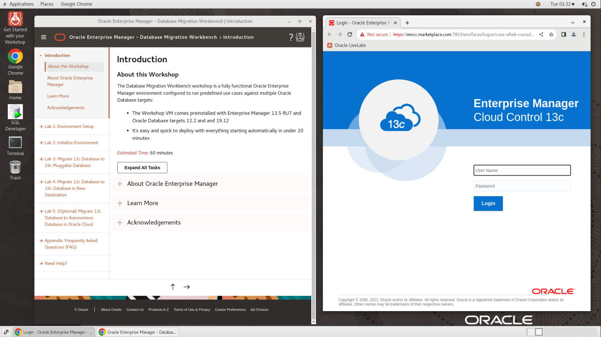
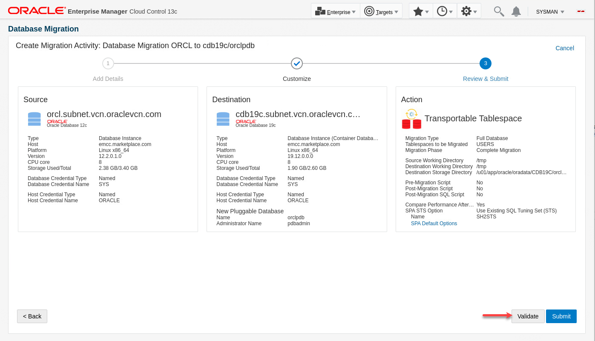
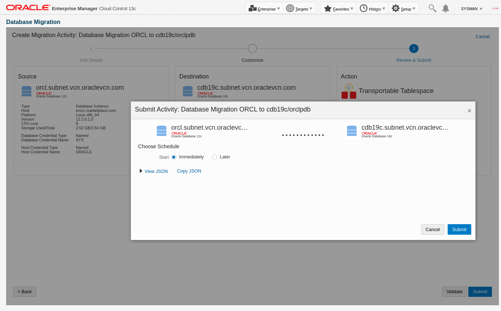
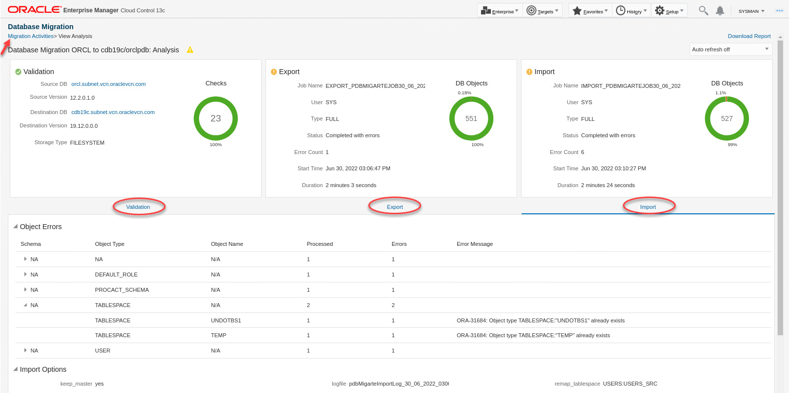
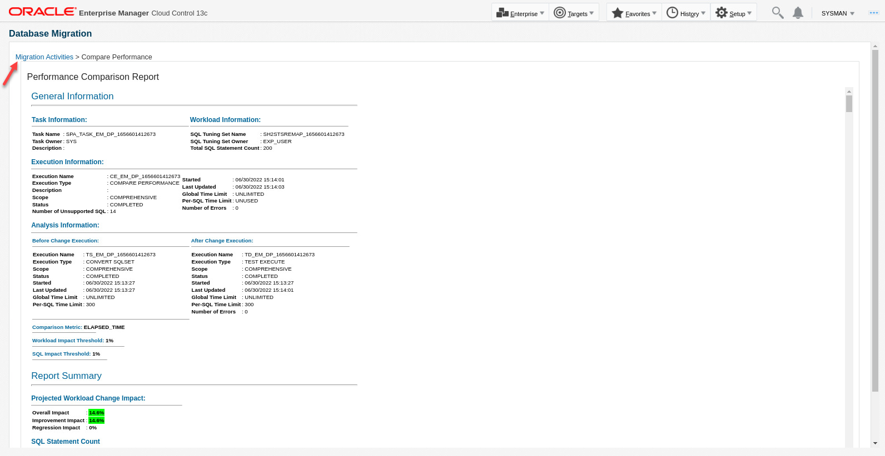
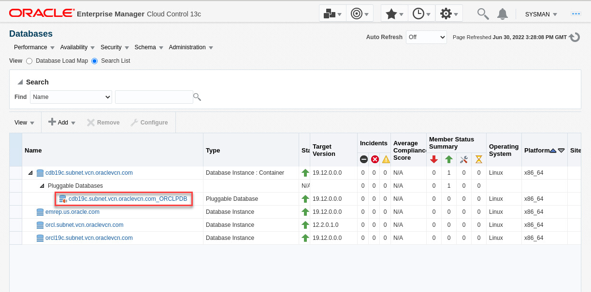

# Migrate 12c Database to 19c Pluggable Database

## Introduction

You can use Database Migration Workbench to migrate your on-premises databases to new destinations in your data center or to Autonomous Database (ADB) in Oracle Cloud Infrastructure (OCI). This lab demonstrates using Migration Workbench for **on-premises** to **on-premises** migrations. Note since this workshop is fully contained on a single VM, the source and destination databases are on the same host, but the instructions apply when migrating databases to new hosts.

*Estimated Time:* 30 minutes

### About Migration Workbench

Oracle Enterprise Manager Database Migration Workbench provides an accurate approach to migration and consolidation by eliminating human errors allowing you to easily move your on-premises databases to Oracle Cloud, Multitenant architecture or upgrade your infrastructure. Advantages of using Database Migration Workbech include: Near Zero Downtime, Assured Zero Data Loss, seamless on-premises or Cloud migrations and, MAA and Cloud Security compliant.

### Objectives

In this lab you will perform the tasks below. Task 1 is about reviewing the pre-requisites that have been completed in advance for this lab. In task 2 you will create a migration activity, add details, and learn about the various configuration options. After the migration is complete, you will validate the destination database and compare performance before and after the migration.

| Task No.                                      | Description                                                                 | Approx. Time | Details                                                                                                                                                                                    |
|-----------------------------------------------------------|-------------------------------------------------------------------------|--------------|--------------------------------------------------------------------------------------------------------------------------------------------------------------------------------------------|
| 1 | Review Pre-Requisites completed in advance| 10 minutes | Review pre-requisites completed on the source and destination databases, hosts, and in Enterprise Manager |
| 2 | Migrate and upgrade a 12c non-container database to a new pdb in a 19c container database | 20 minutes | Source database: orcl, destination pdb: cdb19c/orclpdb

### Prerequisites

- A Free Tier, Paid or LiveLabs Oracle Cloud account
- You have completed:
    - Lab: Prepare Setup (*Free-tier* and *Paid Tenants* only)
    - Lab: Environment Setup
    - Lab: Initialize Environment

*Note*: This lab environment is setup with Enterprise Manager Cloud Control Release 13.5 RU7, and database 19.12 as Oracle Management Repository.

## Task 1: Review Pre-Requisite Tasks Completed in Advance

In the interest of simplifying the setup and save time, the following steps were completed in advance and covered in this lab. Please review accordingly for reference:

### **Source and destination targets are discovered in Enterprise Manager**

1. On the browser window on the right preloaded with *Enterprise Manager*, if not already logged in, click on the *Username* field and login with the credentials provided below.

    ```text
    Username: <copy>sysman</copy>
    ```

    ```text
    Password: <copy>welcome1</copy>
    ```

    

2. Click on "Targets"->"Databases":

- orcl is our source database
- cdb19c is our destination container database
  

### **Export and Import User Requirement**

In this task we will migrate the database using the Transportable Tablespace (TTS) migration method. With this method the migration must be done as a user with SYSDBA role. We will use SYS on both source and destination databases so there's no additional user requirements

### **Named Credential Requirement**

- Database Named credential "SYS" created in Enterprise Manager with Global Scope. It can be used with both source and destination databases in this lab
- Host Named Credential "ORACLE", with OS user "oracle" created in Enterprise Manager for the lab host
- To review the credentials in OEM console, navigate to "Setup"->"Security"->"Named Credentials"
- To learn more about named credentials review "[Named Credentials](https://docs.oracle.com/en/enterprise-manager/cloud-control/enterprise-manager-cloud-control/13.5/emsec/security-features.html#GUID-345595B0-3FA4-4F2C-A606-596B1A10A13E)" in the Enterprise Manager documentation

### **Data Pump Directory Requirement**

- Migration workbench requires local directories on the source and target databases with sufficient space to host the data pump dump files. In our workshop both the source and target databases are running on the same host:
- Created the following directory on the host: /u01/app/oracle/migration_workbench
- Created directory object "MWB_DIR" in source database pointing to this directory

### **Compare Performance Requirement**
Migrating a database can change the execution plans of SQL statements, resulting in a significant impact on SQL performance, resulting in performance degradation. SQL Performance Analyzer can review and help correct these issues.

SQL Performance Analyzer (SPA): Automates the process of assessing the overall effect of a change on the  SQL workload by identifying performance divergence for each SQL statement. A report that shows the net impact on workload performance due to the change is provided. For regressed SQL statements, SQL Performance Analyzer also provides appropriate executions plan details along with tuning recommendations. As a result, you can remedy any negative outcome before the end-users are affected. Furthermore, you can validate—with time and cost savings—that migration will result in net improvement.

An SQL Tuning Set (STS) containing the SQL and relevant execution metadata from the source database is needed to compare performance before and after the migration. Database Migration Workbench can create an STS from AWR during migration, or you can create one in advance and and pass it to to the migration procedure. For this lab we created an STS in advance (SH2STS) by running a workload against the SH2 schema in the source database and capturing the SQL statements executing during the load test.

### **(Optional) Upload Migration Tools**
Migration Workbench uses Instant Client and the Cloud Premigration Advisor Tool (CPAT) as part of its migration toolkit. Enterprise Manager automatically downloads the latest version of the tools when setup with either a MOS Proxy or direct internet connection. The tools can also be uploaded manually as described in [Upload Migration Tools] (https://docs.oracle.com/en/enterprise-manager/cloud-control/enterprise-manager-cloud-control/13.4/emlcm/upload-migration-tools.html) in the Migration Workbench documentation.

We uploaded the migration tools in advance for this lab. For additional detail on the Cloud Premigration Advisor Tool refer to this MOS document:

*Cloud Premigration Advisor Tool (CPAT) Analyzes Databases for Suitability of Cloud Migration (Doc ID 2758371.1)*

## Task 2: Migrate and Upgrade a 12c Non-Container Database to a New PDB in a 19c Container Database

### **Overview**

In this task we'll migrate and upgrade an Oracle 12c database to a 19c PDB in a container database. Our source database is "orcl" and our target container database is "cdb19c". We'll name the PDB "orclpdb".

We'll use the Transportable Tablespace (TTS) migration method in this task. With TTS you must do the migration as a user with SYSDBA privileges on both source and destination databases.

### **Execution**

1. Log into your Enterprise Manager as sysman as indicated in task 1 if not already done
2. From the Enterprise menu, navigate to "Migration and Consolidation"->"Database Migration Workbench"
          
3. On the "Database Migration" page, expand the "Getting Started" section if collapsed. Examine the Migration Workbench workflow, then click on "Create Migration Activity"
          
4. On the Create Migration Activity screen:
    - Activity Name:

        ```text
        <copy>Database Migration ORCL to cdb19c/orclpdb</copy>
        ```

    - Migrate: Expand the drop-down list. Note the options are "Full Database", "Schemas", and "Tablespaces". We'll choose "Full Database" in this lab
        
    - Select Source Database: Click inside the field and select "orcl.subnet.vcn.oraclevcn.com" from the drop-down list
    - Select Destination Database: Click inside the field and select "Create Pluggable Database" from the drop-down list
    - On the "Create a New Pluggable Database" pop-up window, enter:
        - Container Database: Select "cdb19c" from the drop-down list
        - Name:

            ```text
            <copy>orclpdb</copy>
            ```

        - Administrator Name:

            ```text
            <copy>pdbadmin</copy>
            ```

        - Administrator Password:

            ```text
            <copy>welcome1</copy>
            ```

        - Click OK
    - Click Continue

          

5. On the Add Details screen:
    - Source:
        - Database Credentials: SYS (Named). Ignore the error message since we will choose Transportable Tablespace for migration method
        - Host Credential: ORACLE (Named)
    - Destination:
        - Database Credential: SYS (Named). Ignore the error message since we will choose Transportable Tablespace for migration method
        - Agent Host Credential: ORACLE (Named)
    - Action:
        - Migration Method: Transportable Tablespace
        - Compare Performance After Migration: Checked (default)
        - Keep the next 3 fields at default values
        - Click Next

      

6. On the Customize screen:
    - Under "Migration Details" choose "Complete Migration" for migration phase. Note Migration Workbench allows you to do the migration in phases, where you create an RMAN backup in the first phase, update the backup with incremental backups as needed, then complete the migration in the final phase. This allows you to do the migration with minimal downtime. For this workshop however we'll do the migration in a single phase.
    - Under "Compare Performance After Migration", select "Use Existing" and choose SQL Tuning Set "EXP_USER -- SH2STS"
    - Click Review

        

7. On the "Review & Submit" screen, review your entries and click Validate

    

8. Validation checks run for a few minutes. The result shows all checks passed and 2 were skipped as they don't apply to this migration. If your results are different check your previous steps, fix the error and revalidate
    - Click "Close & Submit"

        

9. On the Submit Activity screen, click submit, then on the next screen click "Close and Go Back to Activities Page"

    

10. On the activity page, the status will show "Scheduled" at first. Refresh the page after a few seconds and it will change to "Running". You can also change the Auto Refresh to every minute:

    

11. Click on the "Running" link under Status to go to the procedure activity page. Choose Show: "Steps Not Skipped". The procedure should take about 10 minutes to complete. You can switch to the next lab and complete task 1, then come back here to finish this task

    

12. When the procedure completes, it will most likely show there were some errors. We'll check those when we analyze the migration:

    

13. From the Enterprise Menu, click "Migration and Consolidation"->"Database Migration Workbench" to check the activity page. Click on the View Analysis link from the drop-down menu on the right of the activity row
    
14. Examine the analysis report
    - Review validation checks that passed, failed or skipped
    - Review the export and import tabs for time taken to complete export and import activities, the number of objects exported and imported, and the errors reported during export and import activities
    - For further details on the errors you can review log file using procedure activity step mentioned in step #12
    - In your environment you may need to take actions such as granting specific object privileges to fix the errors. However for this lab the errors shown can be ignored
    - When you are done analyzing the migration, click on "Migration Activities" in the top left of the report to navigate back to the activity page
        

15. Click on the "Compare Performance" link from the drop-down menu on the right of the activity row

    

16. Examine the Performance Comparison report to analyze the database performance before and after the migration
    - Review overall performance impact on application to end user after the migration
    - Analyze top 100 impacted SQLs shown in absolute percentage. SQLs highlighted in green have improved performance due to improved execution plan or query cost. Those highlghted in red have regressed due to execution plan change or execution problems (for example query returning no rows, or number of rows returned is different in destination than in source, etc.)
    - Check regressed SQLs to see execution statistics, before and after migration change analysis
    - Analyze findings provided for each query to see which factors impacted the regressed SQLs. You can take action based on findings provided to improve  performance
    - When you are done with performance comparison, click on "Migration Activities" in the top left of the report to navigate back to the activity page

        

17. Click on the "Mark as Completed" link from the drop-down menu on the right of the activity row
    

18. Examine the guidelines on the Confirmation pop-up window, enter any comments as appropriate, then click yes
    

19. Activity is marked completed
    

20. Finally validate the new PDB has been created. In EM console, navigate to "Targets"->"Databases", and expand "cdb19c" container database:

    

You have now completed this task.

This completes the Lab!

You may now [proceed to the next lab](#next).

## Learn More

- [Oracle Enterprise Manager](https://www.oracle.com/enterprise-manager/)
- [Enterprise Manager Documentation Library](https://docs.oracle.com/en/enterprise-manager/index.html)
- [Database Lifecycle Management](https://docs.oracle.com/en/enterprise-manager/cloud-control/enterprise-manager-cloud-control/13.4/lifecycle.html)

## Acknowledgements

- **Author** - Amine Tarhini, Systems Management Specialist, Oracle Platform Solution Engineering
- **Contributors** -  Harish Niddagatta, Oracle Enterprise Manager Product Management
- **Last Updated By/Date** - Amine Tarhini, June 2022
