# Multitenant Database Lifecycle Management
## Introduction

In this lab, you will learn how IT can establish Database Private Cloud for enabling self-service users to request Pluggable Database (PDB) for testing, and perform other lifecycle operations like Clone, Plug/Unplug, etc. You will also learn about ease of provisioning, resizing, and deleting a PDB using a self-service interface

*Estimated Lab Time:* 60 minutes

Watch the video below for a quick walk through of the lab.
[](youtube:N6840yjGnME)

### About Multitenant Database Lifecycle Management
Oracle Enterprise Manager Database Lifecycle Management Pack comes with out-of-box Deployment Procedures to provision, clone, and patch  various configurations of the Oracle Database. The Management Pack offers new capabilities that simplify support for the entire lifecycle of pluggable databases, including migration, plugging and unplugging. The Management Pack features include pluggable database (PDB) provisioning and management from the self-service portal, PDB patching and upgrades, and PDB relocation to new platforms.

### Objectives

The objective of this workshop is to highlight Oracle Enterprise Manager 13c Lifecycle Management capabilities for multitenant databases.

| **Step No.** | **Feature**                                                                | **Approx. Time** | **Details**                                                                                                                                                                      | **Value proposition**                                                                                                                                                                                                                   |
|--------|----------------------------------------------------------------------------|------------------------|----------------------------------------------------------------------------------------------------------------------------------------------------------------------------------|-----------------------------------------------------------------------------------------------------------------------------------------------------------------------------------------------------------------------------------------|
| 1    | Create a Pluggable Database (PDB)                                      | 10min                     | Create Pluggable database (PDB) within a CDB and run a post-script to lock/unlock accounts.                                                                                  | Create multiple PDBs with few clicks while making sure they follow organization’s standards by using automated post-scripts.                                                                                                           |
| 2    | Un-plug/Plug an existing Pluggable Database | 10min                     | Un-plug a PDB and later Plug it back in a CDB when needed (Create from unplugged)                                                                                                                       | Unplug a PDB when not needed and plug it back as per need hence maximizing resource utilization in your organization. Easily upgrade PDBs with few clicks by moving from one container to another.                                                                                                                  |
| 3    | Clone an existing Pluggable Database                                 | 5min                      | Create multiple copies (Clones) of a PDB to dev/test purpose                                                                                                                     | Create multiple PDBs clones for Dev/test with few clicks while making sure they follow organization’s standards by using automated post-scripts.                                                                                      |
| 4    | Compliance Management for Pluggable Database                                                         | 10min                     | Apply a compliance standard on PDB and use corrective action to fix the violation                                                                                                | Make sure PDBs comply with compliance standards and fix them with a click of a button if there is any anomaly.                                                                                                                         |
| 5    | Self- service to request a PDB using PDBaaS            | 10min                     | Request PDB pluggable database using Service Catalog. (Private Cloud) Resize the PDB and then Delete the PDB while preserving the contents.                                                      | Review self-service option to provision PDB, which only requires minimal inputs.                                                                                                                                                        |
| 6    | Administrative Setup for PDBaaS (Private Cloud)- Review only               | 10min                     | An overview of the administrative setup involved for PDBaaS (Private Cloud) which includes setting up a PaaS Infrastructure Zone, Pluggable Database Pool, Data Sources, Service Template, etc. | Setup private cloud using Enterprise Manager where admin can define resources and EM’s placement algorithm and make sure that resources are utilized to their best. It is complimented by metering, and show back/chargeback capabilities. |


### Prerequisites
- A Free Tier, Paid or LiveLabs Oracle Cloud account
- You have completed:
    - Lab: Prepare Setup (*Free-tier* and *Paid Tenants* only)
    - Lab: Environment Setup
    - Lab: Initialize Environment

*Note*: This lab environment is setup with Enterprise Manager Cloud Control Release 13.5 and Database 19.10 as Oracle Management Repository. Workshop activities included in this lab will be executed both locally on the instance using Enterprise Manager Command Line Interface (EMCLI) or Rest APIs, and the Enterprise Manager console (browser)

## Task 1: Create Pluggable Database (PDB)

1. On the browser window on the right preloaded with *Enterprise Manager*, if not already logged in, click on the *Username* field and login with the credentials provided below.

    ```
    Username: <copy>sysman</copy>
    ```

    ```
    Password: <copy>welcome1</copy>
    ```

    

2.  Navigate to the ***Enterprise menu >> Provisioning and Patching >> Database provisioning***.

  

3.  In the Database Provisioning page, in the related Links section of the left menu pane, click **Provision Pluggable Databases**

  

4.  In the Provision Pluggable Database Console, in the **Container Database** section, click on the magnifier to select the **CDB (CDB186 – 18.8 version)** within which you want to create new PDBs.
  
  
  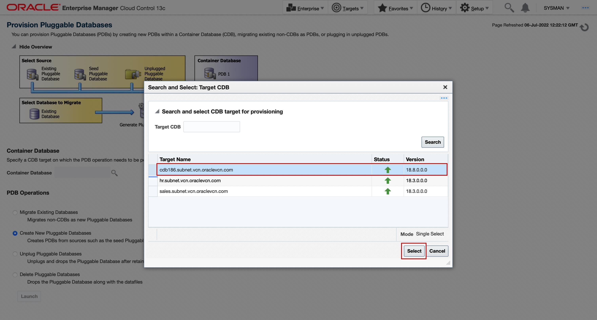

5.  In the PDB Operations section, select **Create New Pluggable Databases**, Click Launch

  

6.  In the PDB Creation Options section, choose **Create a New PDB**. Use the Named credentials (ORACLE) for login

  

7. In the Identification page, Enter a unique name for the PDB you are creating (your initial\_pdb). Optionally, select the check box to “create multiple DBs” and put **2** as the number of copies.


  In the PDB Administrator section, enter the credentials of the admin user account you need to create for administering the PDB. *UserName*: **pdbadmin** 
  *Password*: **welcome1** .
  Click **Next**.

  

8. For storage option, select **Use Common Location for PDB Datafiles** and leave the **Storage type** and **Location** defaults as-is.
The Temporary Working Directory is auto filled as **/tmp**


  

9. Optionally, you may also want to select a post-script, which will run post creation of PDB. 
Under the **Post Creation Scripts** 
Choose “Select from software library” and then search for
“**unlock**” and select unlock.sql (Or you can upload a SQL file from your system).
Click **Next**

  
  

10. In the Schedule page, select the check box immediately next to Start. Click Next.

  

11. In the Review page, review the details you have provided for the deployment procedure. If you are satisfied with the details, click Submit. You can now click on View Execution Details link to see details.

  

12. In the Procedure Activity page, view the status of the procedure. Click the Status link for each step to view the details of the execution of each step.

  

13. Once the procedure is completed (takes about 2-3 mins), you can **Navigate to Targets >> Databases, Click on CDB186** and you will see the newly created PDB

  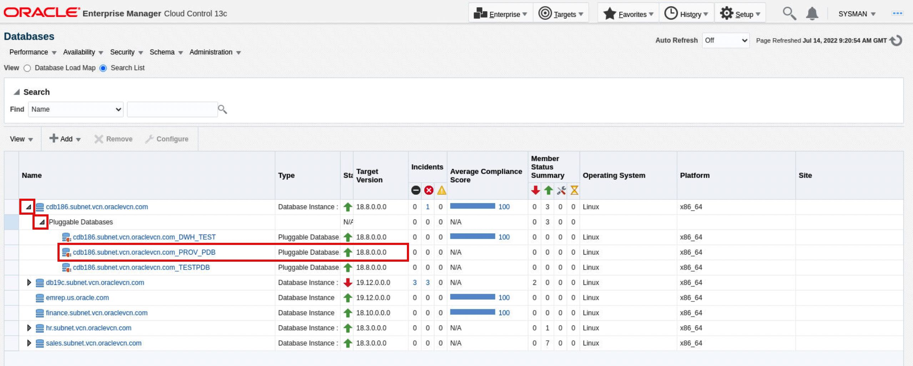

## Task 2: Unplug/Plug an existing Pluggable Database (PDB)

1. Navigate to the ***Enterprise menu >> Provisioning and Patching >> Database provisioning***.

  

2. In the Database Provisioning page, in the Related Links section of the left menu pane, click “**Provision Pluggable Databases**”

  

3.  In the Provision Pluggable Database Console, in the Container Database section, click on the magnifier to select the CDB (**CDB186**) within which you want to Unplug PDBs.
  
  

4.  In the PDB Operations section, **select Unplug** Pluggable Databases, then Click Launch.

  

5.  In the Select PDB page of the Unplug Pluggable Database Wizard, in the Select Pluggable Database section, select the PDB you want to unplug. Also Select Named credentials “ORACLE”.

  

6.  In the Destination page, select the type of PDB template you want to generate for unplugging the PDB, and the location where you want to store it. The PDB template consists of all datafiles as well as the metadata XML file. Select radio button for software library. Select Generate PDB archive. Enter /tmp in location under Temporary working directory

  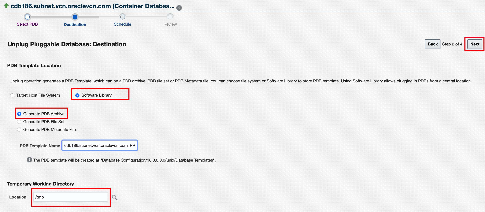

7.  In the Schedule page, Select the check box immediately next to Start. 
Click **Next**. 


In the Review page, review the details you have provided for the deployment procedure. If you are satisfied with the details, click Submit. 


Click **View Execution Details**.  


In the Procedure Activity page, view the status of the procedure.

  

8.  You can Navigate to ***Targets >> Databases***, Click on CDB186 and you will see the PDB you unplugged is no longer in the list.


9.  Let us continue to the next steps and plug the same PDB back into the container database. Navigate to the **“Enterprise menu >> Provisioning and Patching >> Database provisioning”**.

  

10. In the Database Provisioning page, in the Related Links section of the left menu pane, click Provision Pluggable Databases

  

11. In the Provision Pluggable Database Console, in the Container Database section, click on the magnifier to select the **CDB** (**CDB186**) within which you want to Plug the PDBs.
  
  

12. In the PDB Operations section, select **Create New Pluggable Databases** , Click Launch.

  

13. In the Create Pluggable Database Wizard, in the Create Options section, select **Plug an unplugged PDB**. Select Named credentials **“ORACLE”**

  

14. In the Identification page, enter a unique name for the PDB you are plugging in. Select **Create As Clone** to ensure that Oracle Database generates unique PDB DBID, GUID, and other identifiers expected for the new PDB. Enter PDB name like “clone\_pdb”.

  

  *Note*: We will keep pdbadmin as a default admin. So, don’t select anything in this section.

15. On the same Identification page, in the PDB Template Location section: Select **Software Library** radio button. Click on the magnifier icon placed on Location text box. 
Select the Name which you created during Unplug,incase of multiple options, choose the latest image based on timestamp.
Click **Next**
  
  
  


16. Select **Use Common Location for PDB Datafiles** and type **/tmp** as temporary working directory.

  

17.  In the Schedule page, select the check box immediately next to Start. Click Next.


18.  In the review page, review the details you have provided for the deployment procedure. If you are satisfied with the details, click Submit. You can now click on View Execution Details link to see details.


 
19.  In the Procedure Activity page, view the status of the procedure.


20. Optionally Click the status link for each step to view the details of the execution of each step. Once the procedure is completed, you can Navigate to ***Targets >> Databases***. Click on CDB186 and you will see the newly created PDB


  *Note*: You do not have to wait until the steps complete and move on to the next section.

## Task 3: Clone an existing Pluggable Database (PDB)

1.  Navigate to the “***Enterprise menu >> Provisioning and Patching >> Database provisioning***”.

  

2.  In the Database Provisioning page, in the Related Links section of the left menu pane, click Provision Pluggable Databases

  

3.  In the Provision Pluggable Database Console, in the Container Database section, click on the magnifier to select the CDB (**CDB186**) within which you want to clone new PDBs.
  
  

4.  In the PDB Operations section, select **Create New Pluggable Databases**, Click Launch

  

5.  Select **Clone and Existing PDB** PDB and select as source, a PDB from the CDB186 CDB (if you choose any other CDB, this operation might fail). Please keep Database link box empty. Select named credentials “ORACLE”, Click Next.

  

6.  Enter new PDB name. The PDB Administrator user will inherit the user from the source PDB, hence this section does not need any inputs.
An additional PDB Administrator user can also be created.
Click **Next**

  

7.  Select **Use Common Location for PDB Datafiles** in the Source page of the Create Pluggable Database Wizard, please enter **/tmp** in temporary working directory.

  Optionally, you can select the postscript as we did in the creation flow. Click Next.

  

8.  When you see the Schedule page, just select the check box immediately next to Start. Then Click Next.

  

9.  After the Review page appears, and you have confirmed the information is correct for your deployment, click Submit. You can now click on View Execution Details link to see details and on the Procedure Activity page see the status of the procedure.

  
  

  


10.  Once the procedure is completed,  Navigate to ***Targets >> Databases***, then **Click** on CDB186 and you will see the newly created PDB

  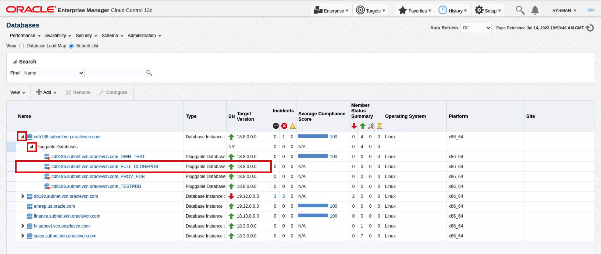

## Task 4: Compliance Management for Pluggable Database

Now database administrator applies a Corporate Standard on the newly created PDB database, which results in a “Violation”. Then, the DBA fixes the issue using corrective actions. Let us examine how a DBA applies the fixes in the following steps.

1. Navigate to ***Enterprise >> Compliance >> Library*** to get started

  

2. Click the **Compliance Standards** tab, Click on the Dropdown next to **Search**, 
Key in "High Security" as the key word and hit search.

 Do not click on the Compliance standard result , but only Select the row **High Security Configuration for Oracle Pluggable Database**, and then Click the Associate Targets tab.

  

3.  Then Click Add and choose the row with your PDB, click **Select**
Verify the PDB name added and Click **OK**


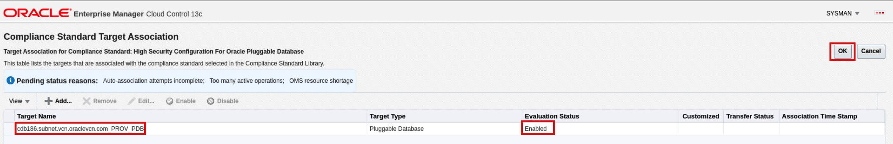

4. In the Save Association dialog box, Click Yes.

  

5. Then upon the Information processing prompt, Click OK.

  

6. Optionally, you can refresh PDB statistics to see notifications. To refresh:

    - Click the ***target icon >> Databases >> View >> Expand All***
    - Right Click on ***PDB >> Oracle Database >> Configuration >> Latest.***
    - Click the Refresh icon on the page (it will take few minutes for refresh to complete)

7. Now Navigate to ***Enterprise >> Compliance >> Results***

  

8. Click on **High Security Configuration for Oracle Pluggable Database** under Compliance Standards

  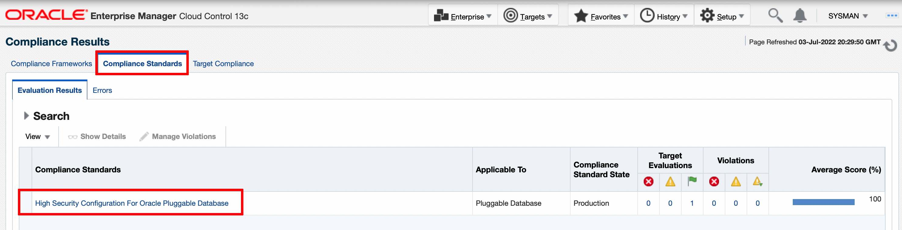

9. And you  will see the following screen

  

10.  The compliance result shows the target is 100% compliant    against the selected standard with no violations. 
Incase of any  violations, you will see details like last evaluation date, rule name violated and rationale for the violation under the violation tab.

  


12. The compliance management portal also provides you an option to have a dashboard view of  compliance summary against all the associated targets. The Dashboard provides a brief summary of the violatons , corrective actions and a complaince standard score. 
  
  From the home page Navigate to Enterprise >> Compliance >> Dashboard


  Dashboard View

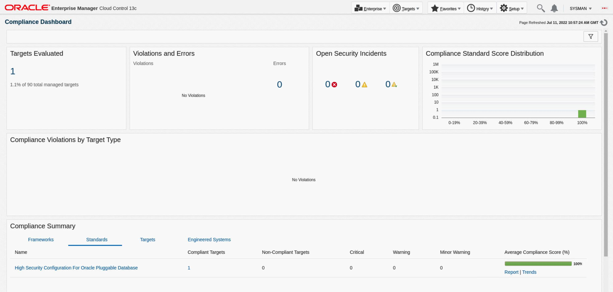


13. You can also generate a comprehensive compliance report for 

    A. Each compliance standard and all its associated targets.

    B. Each Target with all Compliance standard associated to it.
  

  From the home page Navigate to Enterprise >> Compliance >> Dashboard. Towards bottom of the page in the Compliance Summary section, cick on the report against each Compliance standard or Targets. 
 
  


  

  Sample report 

 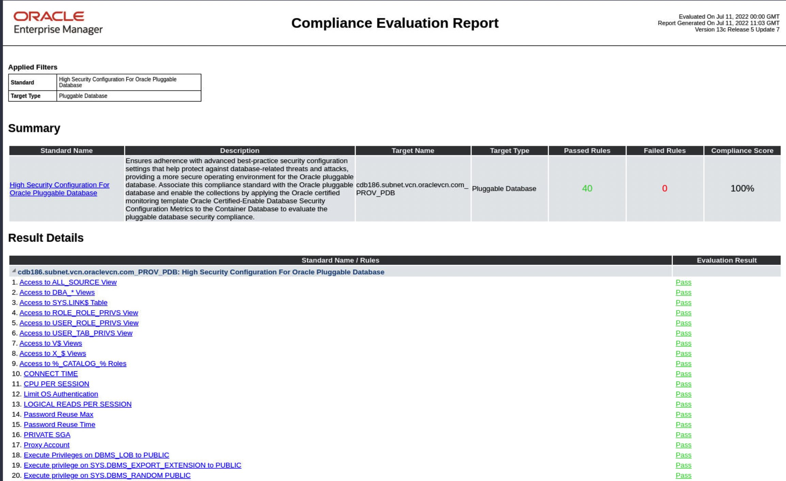
 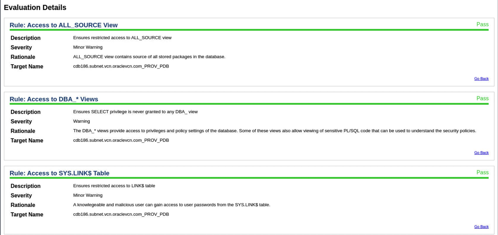
 
 


 Now that you have gone through PDB life cycle operations, we will switch focus and cover the use case of building a private cloud using Enterprise Manager and how to quickly provision (with minimal inputs) and manage PDBs using PDB-as-a-service (PDBaaS).

## Task 5: Self-Service to Request PDB Using PDBaaS

With the Self-Service Portal, cloud users can request an  Pluggable Database through a simple process, monitor resource consumptions, and manage the pluggable database through an intuitive graphical user interface. Expiry time is provided while requesting the PDB instance and PDB is automatically deleted based on the expiry time.

1. Login into Enterprise Manager as a Self-Service User. Self-Service User credentials are: **cyrus/welcome1**
2. By default, you will see the Database Cloud Self Service Portal landing page as shown below.

  

3. Click the **Create Instance** button and then Click on Select icon for **Provision New Empty Pluggable Database**.

  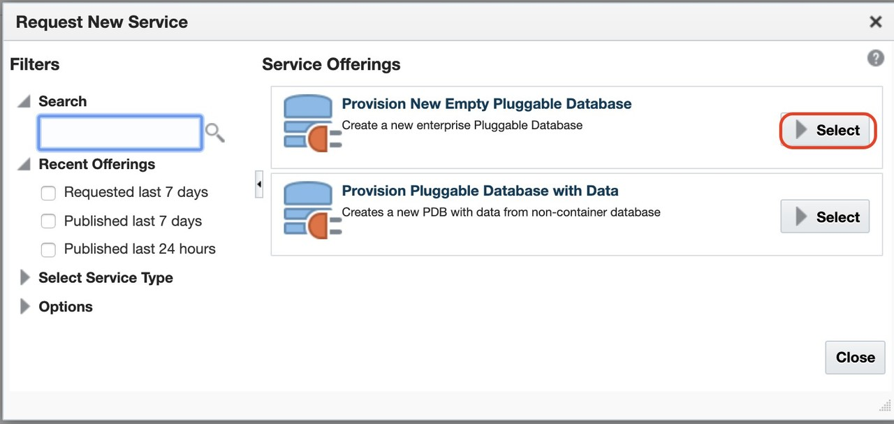

  Note: There are two service templates pertaining to Pluggable Database

    -  **Provision New Empty Pluggable Database**: This template enables users to create a new pluggable database in a container database configured by DBA.
    -  **Provision Pluggable Database with Data**: This template enables users to create a new pluggable database with data from non-container database.

4. In the **Pluggable Database Configuration** section, 
      
      
**Step 1**
      Enter Service and SID details:

      * Name: **YOUR INITIALS\_PDB2** (e.g. AS\_PDB2)
      * Database Service Name **: SERVICE\_YOUR INITIALS\_PDB2 (e.g. SERVICE\_AS\_PDB2)**
      * Workload Size: Choose **Small**

  
**Step 2**
 Enter the Credentials details in the “**Pluggable Database Administrator Account**” and for Tablespaces, select **Accept default**

    ```
    Administrator Name: <copy>PDBADMIN</copy>
    ```

    ```
    Password: <copy>welcome1</copy>
    ```


  
**Step 3**
Instance Details, keep all defaults as they are. The Properties Page has the properties for the instance. The Self-Service Administrator has configured this as a optional step. However, properties can help users locate an instance more quickly. So Enter:

    ```
    Contact: <copy>CYRUS</copy>
    ```

    ```
    Lifecycle Status: <copy>Test</copy>
    ```

  
**Step 4**
Instance Duration - For Instance Duration Start: Accept the default (Immediately). For Duration: Specify 4 hours from the current time by selecting the “Until” radio button, changing to current date and specify time to be 4 hours from the current time


**Step 5**
Click on Submit button


  What do these options represent? In most cases the PDBaaS options are self-explanatory. The self-service user should be able to provision a PDB by entering minimal information. Fields with an ‘\*’ represent mandatory input fields. Please refer to the table listed below for a description of each option:

  | **Field**                   | **Description**                                                                                                                                                                                                                                                                                    |
|-----------------------------|----------------------------------------------------------------------------------------------------------------------------------------------------------------------------------------------------------------------------------------------------------------------------------------------------|
| Request Name                | By default, it is the Self-Service User Requestor name with timestamp. This field can be modified                                                                                                                                                                                                  |
| Zone                        | The Zone is a PaaS Zone that represents hosts/vm, where the PDB database will be deployed for this request. The zones are configured by the administrator. Self-service user need not know the host or platform details.                                                                           |
| PDB Name                    | Required input. PDB database with user defined will be created for the container database                                                                                                                                                                                                          |
| Database Service Name       | The user defined prefix for the database service or alias for this self-service PDB. The rest of the service name will be system generated and will be associated with a database resource management plan.                                                                                        |
| Workload Size               | The resources allocated to the Database Service. The database resource management plan is derived from this option. You can configure multiple workload sizes. Each service template will contain unique workload sizes. This typically depends on the roles assigned to self-service user.        |
| Schedule Request            | Self-service user has the ability to create a PDB database immediately or choose to create at a later time. In this lab exercise, the administrator has defined a policy, so a self- service user has to specify time duration. The PDB database will be automatically deleted after the duration. |
| Administrator Name/Password | A database user with required administrative privileges will be created on the provisioned PDB. A self-service user will be able to administer the PDB database by logging in as this database user.                                                                                               |

9.  Once you submit a request, you will be redirected back to the “**Database Cloud Services**” Page. Your PDB creation request has been submitted to Enterprise Manager for execution. Under “**Requests**” region, you should see 2 requests: “**Create**” and “**Delete**” request

  

10. At this point, provisioning engine has received a request to create a PDB based on the service template and input provided by self-service user. You will also notice the delete operation is scheduled for future (not started yet) time. Click on the **hourglass** icon under Status column for the Create Pluggable Database step. You will see details of request.

11.  It will perform the following actions:

     * Create database roles and PDB
     * Create a resource plan based on the workload size
     * Create and register the database

  The request should take less than 10 minutes to complete. Click on refresh icon or as an alternative set Refresh to 30 seconds. The success status
indicates that PDB database was successfully created. The new PDB database should be visible under Database Cloud Services page.

  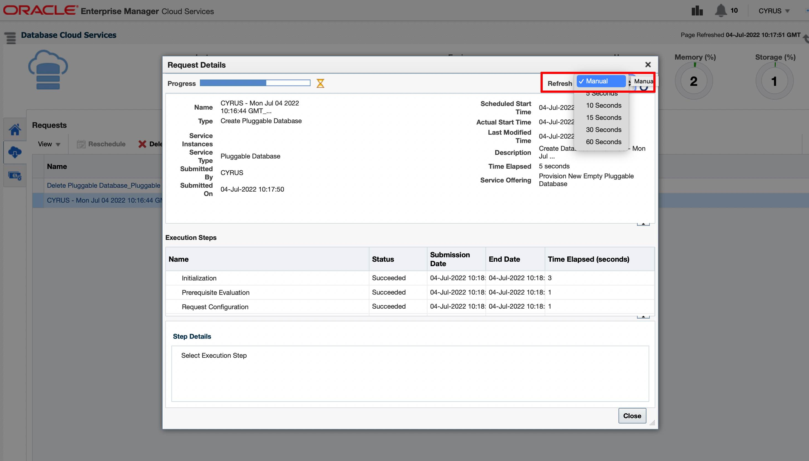

12. Click on Close button. You will see the following under Requests section.

  

13. Click on the Home Icon. You will see new PDB instance.

  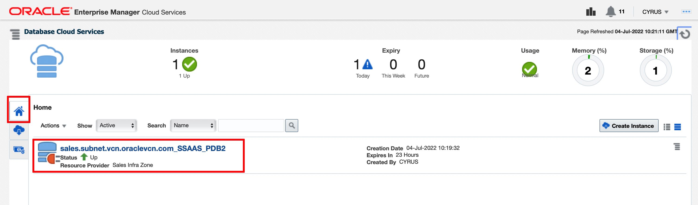

  *Note*: Following widgets are shown on the Database Cloud Services landing Page

    * **Instances** show the number and status (Up/Down) of the DB/PDB Instances provisioned by the self-service user.
    * **Expiry**, shows the expiration summary of DB/PDB Instances.
    * **Usage**, resource usage status for the Self-Service user, status of the resource consumption for this user.
    * **Memory**, current memory consumption against the Quota for this user.
    * **Storage**, current storage consumption against the Quota for this user.

14. Click on the name of the PDB. You can use the connection details to connect to the PDB using SQL tools.

  

15. Click on **Resize** button to resize a PDB instance.

  

    * Resize allows you to resize your instance to other available resource sizes.
    * We have 2 resource sizes available for Service Template. Both are displayed.
    * Current size of PDB instance is Small, you can now resize it to large.

  

16. Once you click on **Resize**, a job will be submitted to resize instance. In few minutes instance resize is completed. Expand **Resource Usage** section on PDB Home page. This shows now new resource usage limits.

  

17.  Next delete the database Instance: Go to the Database Cloud Services Home page by clicking on **Database Cloud Service Portal link**

  

18. Click on the action menu for new PDB and delete this instance.

  

19. While deleting instance you can preserve a backup of the instance and create a new instance using this backup. To store backup of this instance, select check-box: **Preserve a backup of this instance**

  

20. Click OK. You will see confirmation to delete the instance.

  

## Task 6:  Setup  PDB-as-a-Service (PDBaaS)

Previous exercises demonstrated the process of requesting PDBs using available service templates as performed by a Self-Service user. In this section, we will see the Administrative setup for PDBaaS.

Login to the EM Console as super administrator **sysman/welcome1**

### **PaaS Infrastructure Zone**

1. On the EM Console, go to Setup ->> Cloud ->> Database.

  

2. Select **Pluggable Database** from the drop-down menu.

  

3. Then click on **PaaS Infrastructure Zone** **Sales Infra Zone** is the zone where PDBs were provisioned in the previous sections. Click on name of the zone.

  

4. You are taken to the Zone Home page; you can see all the details of a Zone such as the host members of this zone. You can explore more about the zone on this page.

  

### **Pluggable Database Pool**

5. On the EM Console, go to **Setup**, then **Cloud**, then **Database**. Select **Pluggable Database** from the drop-down menu. And then click on **Pluggable Database Pool**’.

  A Pluggable Database Pool consists of a set of Container Databases on which PDBs will be provisioned.

  

6. Click on name of the pool to see more details.

  

7. Scroll down to see details of Members and Service Templates.

  

### **Data Sources**

8. On the EM Console, go to **Setup**, then **Cloud**, then **Database**. Select Pluggable Database from the drop-down menu. And then click on **Data Sources** observe that the profile is based on Schema Export(s). This Data Profile was used for provisioning a PDB with data.

  

9. Select the row with profile to see more details.

  

### **Service Templates**
10. On the EM Console, go to **Setup**, then **Cloud**, then **Database**. Select Pluggable Database from the drop-down menu. And then click on **Service Templates from you left menu.**

  

  There are two service templates pertaining to Pluggable Database

      * **Provision New Empty Pluggable Database**: This template enables the user to create a new pluggable database in a container database configured by DBA
      * **Provision Pluggable Database with Data**: This template enables user to create a new pluggable database with data from a non-container database.

11. Click on name of any template to explore more details.

  

This completes the Lab!

You may now [proceed to the next lab](#next).

## Learn More
- [Oracle Enterprise Manager](https://www.oracle.com/enterprise-manager/)
- [Enterprise Manager Documentation Library](https://docs.oracle.com/en/enterprise-manager/index.html)
- [Database Lifecycle Management](https://docs.oracle.com/en/enterprise-manager/cloud-control/enterprise-manager-cloud-control/13.4/lifecycle.html)
- [Database Cloud Management](https://docs.oracle.com/en/enterprise-manager/cloud-control/enterprise-manager-cloud-control/13.4/cloud.html)

## Acknowledgements
  - **Author** - Harish Niddagatta, Oracle Enterprise Manager Product Management
  - **Contributors** -  Rene Fontcha
  - **Last Updated By/Date** - Sravanth Mouli, Oracle Enterprise Manager Product Management -  June 2022
