# Automated Database Patching at Scale with Fleet Maintenance UI

## Introduction
In this workshop, you will experience the benefits of using the Oracle Enterprise Manager Fleet User Interface to automate the patching of multiple Oracle Databases in one flow.

*Estimated Time*: 60 minutes


### About the Database Fleet Maintenance UI capability in Oracle Enterprise Manager

Database Fleet Maintenance is an end-to-end automated solution for patching and upgrade of Oracle Databases. Fleet Maintenance enables DBAs to automate patching of a wide range of Oracle Database configurations including Oracle RAC environments with Data Guard Standby.

Starting with Enterprise Manager 13.5 RU1, Enterprise Manager offers a new interface to ease automated patching, update, and upgrade of your database fleet.

Benefits of using the EM Fleet Maintenance capability include:
- Minimizing downtime with use of Out of Place patching
- Enterprise scalability using the Enterprise Manger Deployment Procedures Framework
- A single pane of glass for monitoring and managing the entire patching and upgrade operations
- Ability to schedule/retry/suspend/resume operations.
- Patch Oracle Databases across different infrastructure including engineered systems like Oracle Exadata

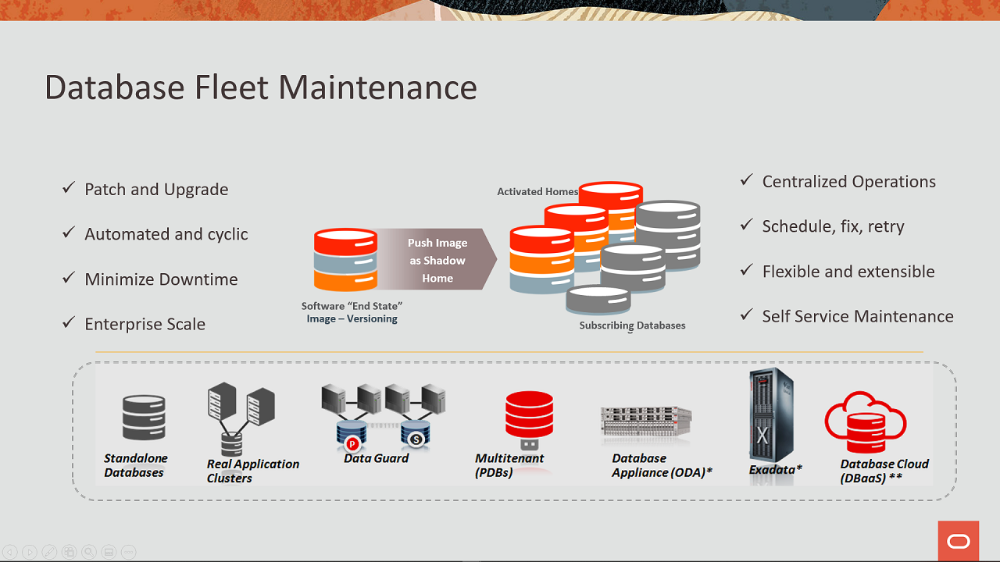

#### Video Preview
Watch a preview of database patching using Oracle Enterprise Manager Fleet Maintenance:

[](youtube:JlspEvqebHE)

*Note: Interfaces in this video may look different from the interfaces you will see. For updated information, please see steps below.*


### Objectives

In this lab you will perform the following steps:
| Step No. | Feature                                                    | Approx. Time | Details                                                                                                                                                                    | Value Proposition |
|----------------------|------------------------------------------------------------|-------------|----------------------------------------------------------------------------------------------------------------------------------------------------------------------------|-------------------|
| 1                    | Detect Configuration Pollution                             | 10 minutes  | Analyze the database estate using Software Standardization.                                                                                                                |                   |
| 2                    | Oracle Database Patching with Fleet Maintenance | 50  minutes  | Patch a Database target using a Gold Image. As part of patching the Container Database, all Oracle Pluggable Databases in that Container Database will automatically get patched. |                   |


### Prerequisites
- A Free Tier, Paid or LiveLabs Oracle Cloud account
- You have completed:
    - Lab: Prepare Setup (*Free-tier* and *Paid Tenants* only)
    - Lab: Environment Setup
    - Lab: Initialize Environment

*Note*: This lab environment is setup with Enterprise Manager Cloud Control Release 13.5 and Database 19.10 as Oracle Management Repository. Workshop activities included in this lab will be executed both locally on the instance using Enterprise Manager Command Line Interface (EMCLI) or Rest APIs, and the Enterprise Manager console (browser)

## Task 1: Performed in Advance

To save time, the following steps were already completed.

1. An Oracle home was created and pre-patched with an Oracle Database 18.10 release that will be used to create the gold image *[/u01/app/oracle/product/18/db\_home\_src, Orasidb18c\_home1\_2020\_05\_13\_04\_10\_9\_emcc.marketplace.com\_3192]*

To ensure smooth execution of the use cases, we have pre-hosted the scripts to be used later at */home/oracle/fleet*

## Task 2: Detect Configuration Pollution with Software Standardization Advisor

In this lab activity, you will analyze the database estate to identify any configuration drift (pollution) using the Software Standardization Advisor.

Software Standardization Advisor enables administrators to understand various database configurations prevailing in their environment. Each deployment with a unique platform, release and patch level is identified as a distinct configuration. This provides the administrators a view of the configuration pollution in their estate. It also analyzes and provides a recommendation to standardize the environment and reduce the number of configurations required for managing the database estate.

  

1. On the browser page when the Enterprise Manager Cloud Control 13c login can be seen, copy and paste or type in these username and password credentials into the fields.

    ```
    Username: <copy>sysman</copy>
    ```

    ```
    Password: <copy>welcome1</copy>
    ```

    

2.  After successful login, in the upper toolbar, locate the ***Targets*** icon and click the drop-down menu and then select ***Databases***.

    

3.  On the Databases targets page, click on the ***Administration*** tab, drop down the menu, and select Software ***Standardization Advisor***

    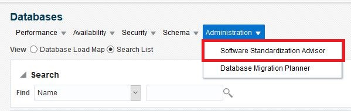

4.  Software Standardization Advisor shows two graphs depicting current configuration and recommended configuration.

    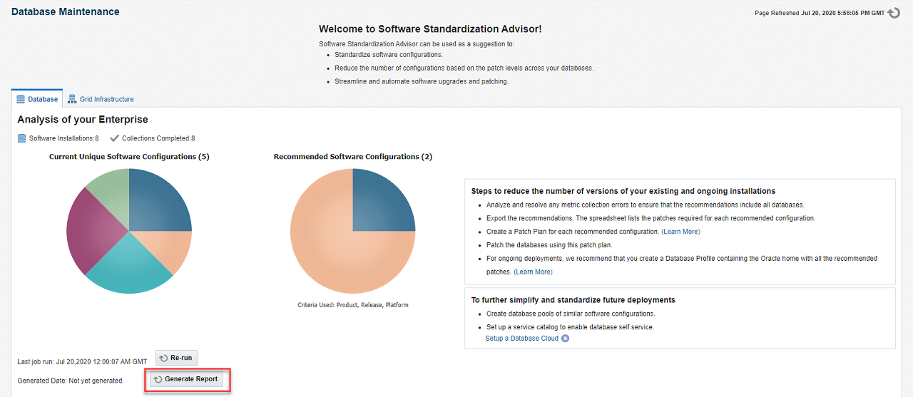

    Graphs may look different from the ones represented in the workbook.
    A Software Configuration is identified by the database release, platform, and the patches installed on the target.

    In the analysis performed by the Software Configuration Advisor, it has identified that there are 5 unique software configurations in the environment (pie chart labeled “Current Unique Software Configurations”). The recommendation displayed is for only 2 Software Configurations ( pie chart labeled “Recommended Software Configurations”).

    Next, we will review the report generated.


5.  On the same page, click on **Generate Report**.

6.  On the same page, click on **Current Configurations** to open the Excel report.

    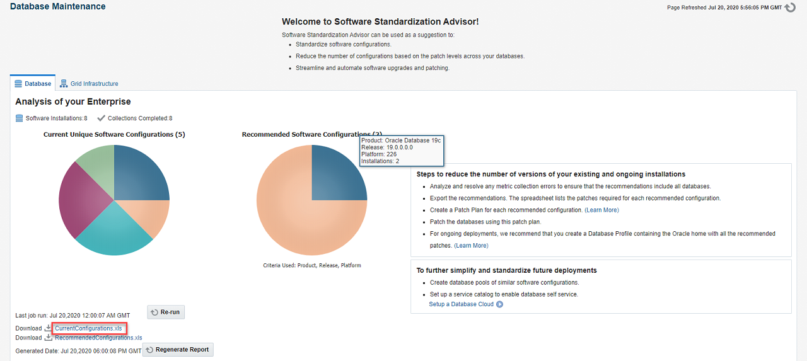

    When you download the report, should a warning on XLS format and file extension mismatch pop up (like below). Simply click on “Yes” to ignore the warning and open the file.

    

    From the report, you will see the current environment has five different Oracle home software versions.

    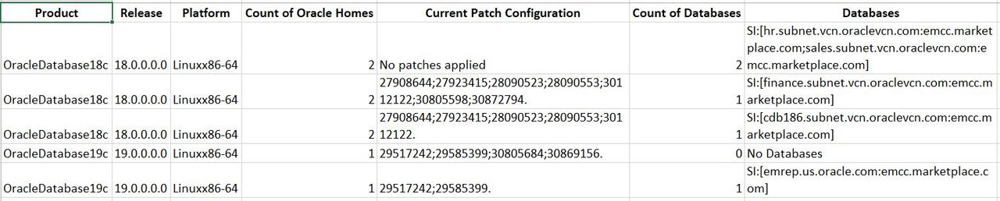

7.  Next, click on **Recommended Configurations** to open the Excel Report.

    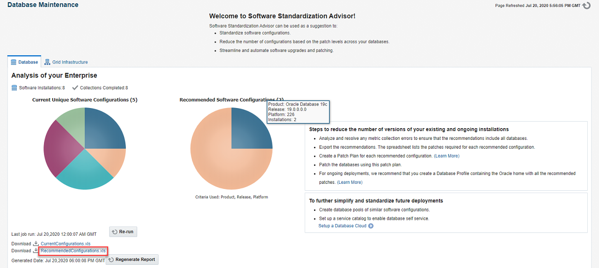

    The report recommends a reduction of the 5 configurations and standardizing the database estate to 2 configurations (18c and 19c). This means all Oracle homes for Release 18c should uptake the standard 18c configuration and the 19c Oracle homes the standard 19c configuration.

    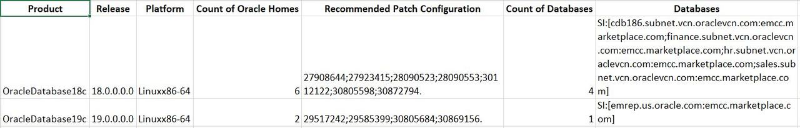

    The recommendation is based on a union of bugs included in the patches in all Oracle homes and based on the configuration type.

  <!-- This completes Step 1. In this section, you learned how to perform the following:

    - Access the Database Software Standardization Advisor
    - View Configuration summary
    - Generate and download current and recommended configuration reports

  In the next section we will follow these recommendations to perform the following using Enterprise Manager 13c Fleet Maintenance.

    - Patch database “hr.subnet.vcn.oraclevcn.com” from 18.3 to 18.10 -->

## Task 3: Database Server patching with Fleet maintenance (Overview)

### **Database Fleet Maintenance**

Enterprise Manager Database Fleet Maintenance is a Gold Image Target subscription-based Out of Place patching solution. Out of Place patching is a method where patching is performed by creating a copy of the Oracle home, applying patches to the copied home, and then switching services to the copied home.

A gold image is the end of state software definition that contains information about the base software version plus the additional patches. Targets, to be patched, subscribe to a relevant Gold Image. Target subscription persists through the lifecycle of the Target or Gold Image unless modified by an administrator.


  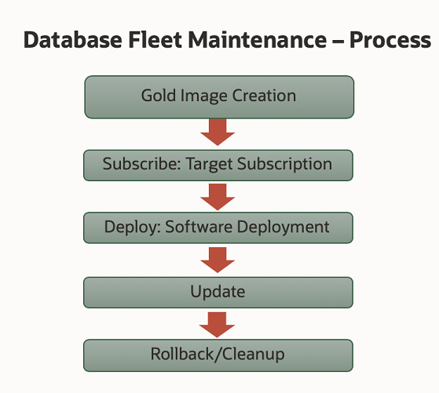

### **Patching with Fleet Maintenance**

We will go through steps for patching database target ***hr.subnet.vcn.oraclevcn.com***, a Container Database that is currently at 18.3.0.0.0 version. The goal is to patch this target to 18.10.0.0.0. As part of the patching exercise this Container Database and all Pluggable Databases in that Container Database will automatically get patched.

1.  Return to the browser page with the Oracle Enterprise Manager Console (log back in if needed) and from the EM home page, select the ***Targets*** drop-down menu and select ***Databases*** to review the status and version of database targets.


    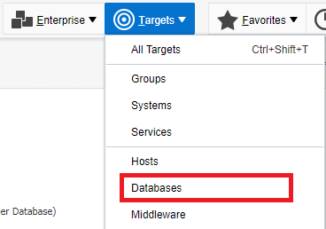

You will see the ***hr.subnet.vcn.oraclevcn.com*** container database has a pluggable database ‘HRPDB’. Both the container database and pluggable database targets have status ‘UP’ and version 18.3.0.0.0. If the target status is ‘DOWN’, then start the target (using */home/oracle/start\_db\_hr.sh*).
    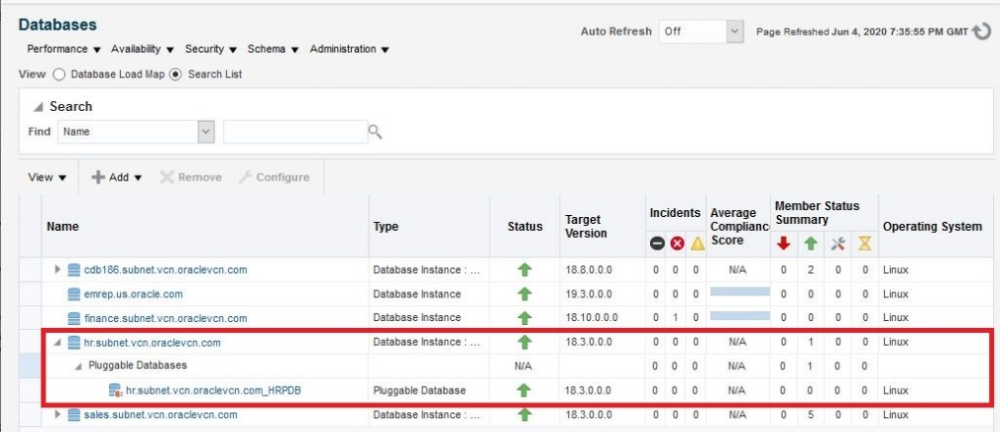


## Task 4: Create Gold Image

1. Now look over the reference home setup *[Which has already been implemented]*

    Gold Image represents a software end state. An Enterprise Manager Software Library Gold Image is a software archive created from a patched oracle home uploaded to EM Software Library.

    To create a Gold Image of the ‘recommended patch configuration’, you manually create an Oracle home as a pre-requisite step. The goal is to patch Oracle Database 18.3 targets with Oracle Database 18.10 RU, a reference Oracle home fully patched to 18.10 *[/u01/app/oracle/product/18/db\_home\_src]* was created and used to create the initial version of the Gold Image as further described in the next steps.

    This patched reference Oracle home is discovered in Enterprise Manager as shown below and will be used for Gold Image Creation.

2. From the Enterprise Manager menu bar, navigate to the ***Targets*** drop-down menu and then select ***All Targets.***

    Then on the All Targets page, in the upper left search field, type or copy “*Orasidb18c\_home1\_2020\_05\_13\_04\_10\_9\_emcc.marketplace.com\_3192*” in the “Search Target Name” box. Click on Search icon and in the results page click on the target name.

    ```
    <copy>Orasidb18c_home1_2020_05_13_04_10_9_emcc.marketplace.com_3192</copy>
    ```

    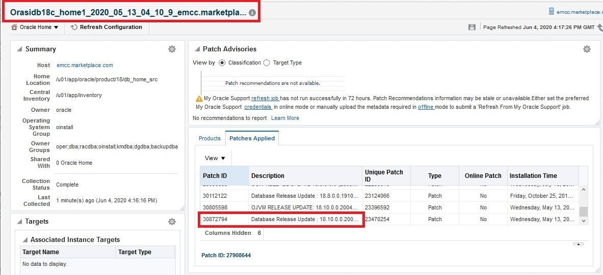

3. From the terminal on your remote desktop, Create the New Gold Image using the following emcli command

    ```
    <copy>cd ~/fleet
    sh create_image_Tier2_sidb_x64.sh</copy>
    ```
    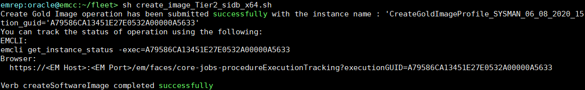

4. From the Enterprise Manager menu bar, navigate to the ***Enterprise*** drop-down menu and then ***Provisioning and Patching >> Procedure Activity*** to review Execution details of this operation via Enterprise Manager Console

    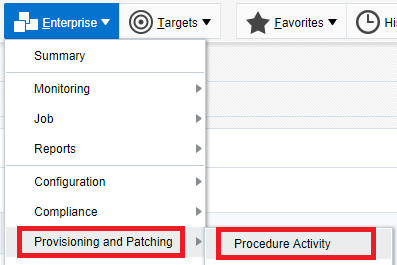

5. Click on ‘CreateGoldImageProfile\_...’ run and review the steps performed.  

    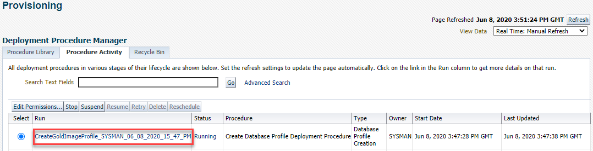

6. Use ‘Show’ filter ‘Steps Not Skipped’ ; View:‘Expand All’ for detailed view of all the steps performed to complete an operation.

    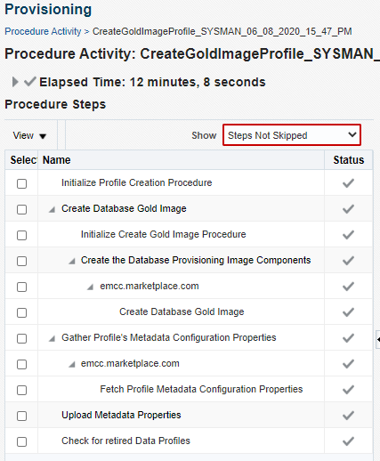

7. List Available Gold Images. Execute the following commands in the terminal to see the list of Gold Images available for deployment, locate ‘Tier \#2 SI DB Linux64*’* in the emcli command output:

    ```
    <copy>emcli db_software_maintenance -getImages</copy>
    ```

    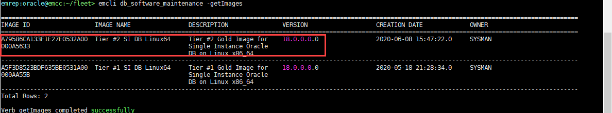

    IMAGE ID retrieved from the output of above command is used in further operations like Target Subscription.

    After retrieving a list of the available images, one can view a list of versions available for a specific image with the following command:

    If the image id is same as the one highlighted above, you may use the below command
    ```
    <copy>emcli db_software_maintenance -getVersions -image_id=A79586CA133F1E27E0532A00000A5633</copy>
    ```   

    else make changes in the below command and execute it.

    ```
    <copy>emcli db_software_maintenance -getVersions -image_id={Insert IMAGE ID from List available gold images}</copy>
    ```   

    This command lists Gold Image versions with their VERSION ID and STATUS.

    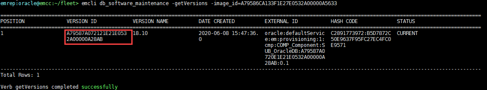

    When a Gold Image is created for the first time, its first version is created as per the input and marked as current. Whenever we run a DEPLOY operation for a target, Gold Image version marked as CURRENT is used to deploy the new Oracle home.

8.  Verify if Gold Image is Applicable

    This step verifies if the image can be used to patch a specified database target. This is done by comparing the bug fixes available in the current Oracle home of the database target and the image. In effect this check is run to identify patch conflicts.

    - Review and execute below emcli command. If the image id is same as the one highlighted above, you may use the below command:  

    ```
    <copy>emcli db_software_maintenance -checkApplicability -image_id=A79586CA133F1E27E0532A00000A5633 -target_list=hr.subnet.vcn.oraclevcn.com -target_type=oracle_database > /home/oracle/applicability.out</copy>
    ```

    else

    ```
    <copy>emcli db_software_maintenance -checkApplicability -image_id={Insert IMAGE ID from List available gold images} -target_list=hr.subnet.vcn.oraclevcn.com -target_type=oracle_database > /home/oracle/applicability.out</copy>
    ```

    ```
    <copy>cat /home/oracle/applicability.out | more</copy>
    ```

    - Output of above emcli command is redirected to a file. You may review the output using any standard editor or tool of your choice.

    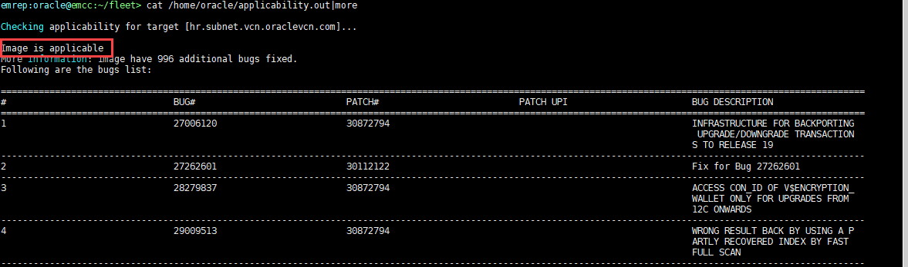

    This command can show one of the following results:

    - Applicable: The image and database target contain the same set of bug fixes. The image can be applied on the specified target.
    - Applicable and Image has more bug fixes: The image contains more bug fixes than those applied on the database. The list of extra bugs is displayed. The image can be applied on the specified target.
    - Not Applicable: The database contains more bug fixes than those included in the image. The list of missing bugs is displayed. The administrator has to create a new version of the image that includes the missing bugs before the database can uptake the same.

## Task 5: Subscribe Database

1.  Below illustration describes the flow of subscribing Targets to the Selected Gold Image

    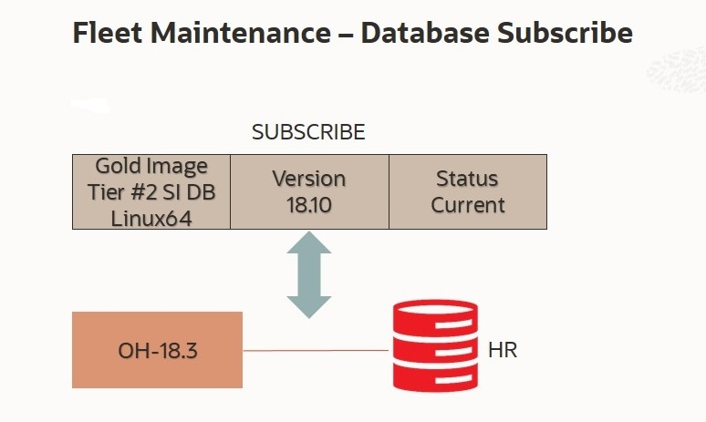

2. Execute below command to subscribe the target hr.subnet.vcn.oraclevcn.com to Gold Image

    If the image id is same as the one highlighted above (Task 4, step 7), you may use the below command:
    ```
    <copy>emcli db_software_maintenance -subscribeTarget -target_name=hr.subnet.vcn.oraclevcn.com -target_type=oracle_database -image_id=A79586CA133F1E27E0532A00000A5633</copy>
    ```

    else

    ```
    <copy>emcli db_software_maintenance -subscribeTarget -target_name=hr.subnet.vcn.oraclevcn.com -target_type=oracle_database -image_id={Insert IMAGE ID from List available gold images}</copy>
    ```

    Where:
   -  target\_name – Name of the Database target which needs to be patched
   -  target\_type – type of target to be patched. This should be oracle\_database in this case
   -  image\_id – ID of the Gold Image to which the target should be patched

    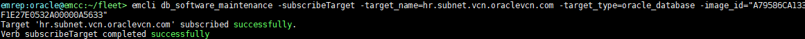

## Task 6: Deploy Image

1. In order to complete the deployment of new image, we need to modify named credential root and set its scope to global. This can be achieved by running the below command in terminal.

    ```
    <copy>emcli modify_named_credential -cred_name=root -cred_scope=global</copy>
    ```

    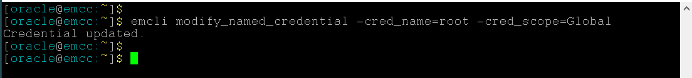

    From the Enterprise Manager menu bar, navigate to the ***Targets*** drop-down menu and then select ***Databases***

    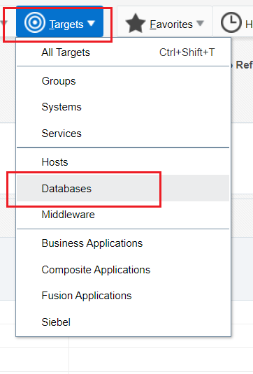

    and, then from ***Administration*** drop-down menu select ***Fleet Maintenance***

    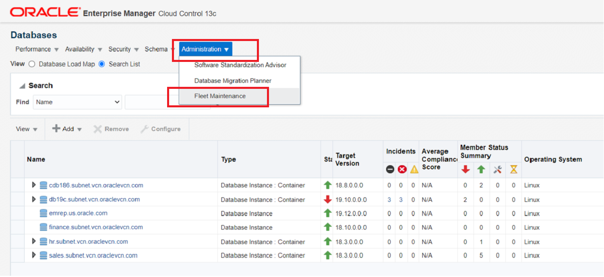


2. In this page, we will select relevant ***Image Name***, ***Target Type*** and ***Operation***.

    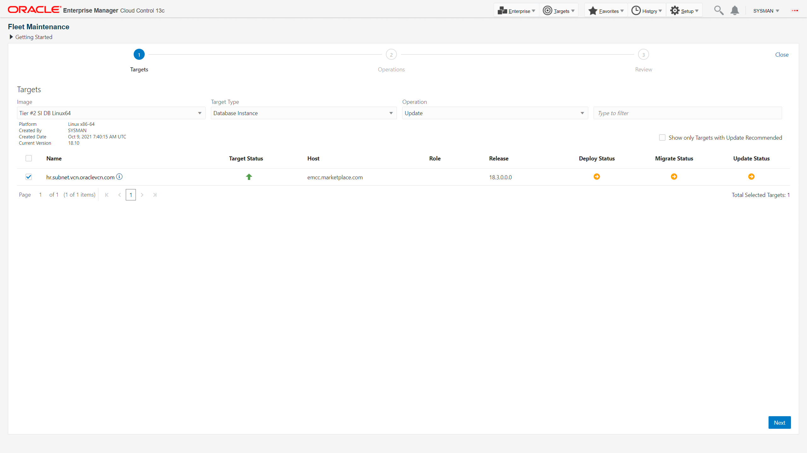

    Where:
    -  Image = Desired version of Oracle home, which our target database should run after successful completion of operation. In this example, we will select ***Tier #2 SI DB Linux64***.
    -  Target Type = Desired target type, which can be Grid, RAC or SIDB. In this example, we will select ***Database Instance***.
    -  Operation = Name of the operation, which can be update (patch) or upgrade. In this example, we will select ***Update***.
    -  Type to filter = Selection criteria to highlight only those targets which qualify the selection, such as database naming.

3. In this page, we will provide ***new Oracle home location***, select which ***tasks*** can be performed, select ***credential model***, provide ***log file location*** under options and select any   ***custom scripts*** to run as part of the operation.

    

    We can enter following values
    Under Maintenance tasks
        Destination Oracle Home as
        ```
        <copy>/u01/app/1810/hr</copy>
        ```

    Check both Migrate Listener and Update Database options
    Under Credentials (We have already created these credentials in Enterprise Manager for this workshop. Please choose Named for all the below three options and from the dropdown menu, you can opt for values as suggested below)    
        Normal Host Credentials as ***ORACLE***
        Privileged Host Credentials as ***ROOT***
        SYSDBA Database Credentials as ***SYS_SALES***

    Deployment of new Oracle home does not impact existing Oracle home and hence it is scheduled to run immediately. We can schedule it to run at a different time by selecting later in start schedule and providing new time to run this operation.

    Once deployment of new Oracle home is complete, we can change the schedule of the Deployment Procedure for migrate listener and update database to execute these tasks immediately.  

4. We can validate our entries (new Oracle home, log file location, credentials) provided in previous page and validate the desired operation. Validation acts as a precheck before we submit the main operation. There are two validation modes - Quick and Full. We can select either of these. Full validation mode submits a deployment procedure. In this case choose Quick validation mode

    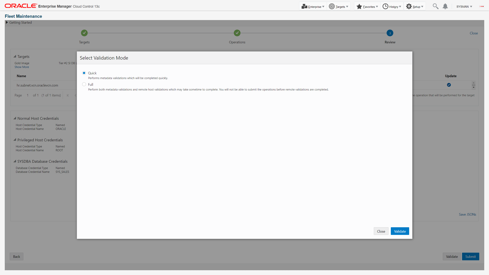

5. Review the validation result.

    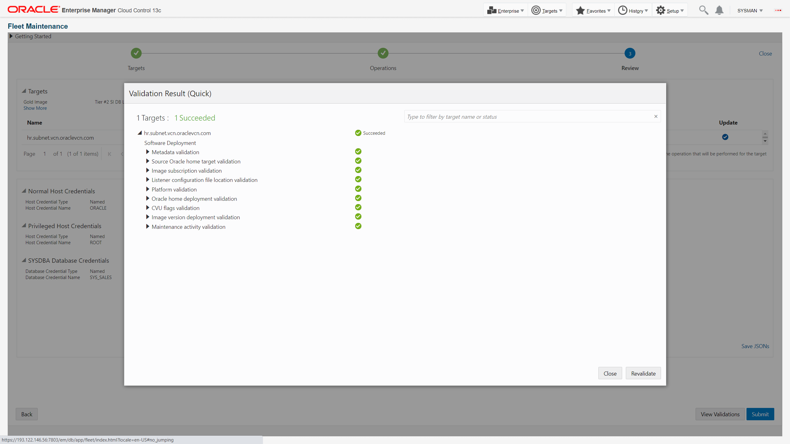

    Incase of any error, we can fix it and choose revalidate.

6. ***Submit*** the operation. Here, we can see that we have opted to deploy, migrate and update the database at once. These tasks will be performed independently based on their schedule.

        

    We need to provide a name to the task, which will help us to view these tasks under Procedure Activity Page. Lets enter
    ```
    <copy>HR_DB_Patching</copy>
    ```

    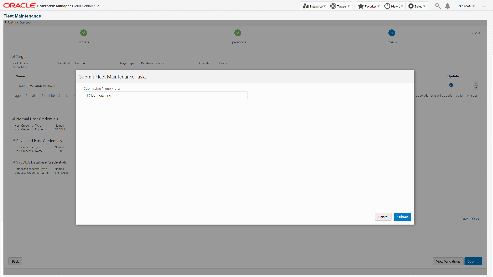

    Click on submit.
    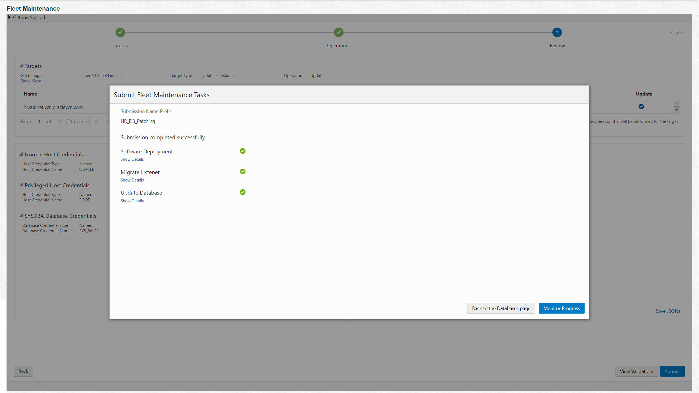

    Clicking on Monitor Progress will take us to Procedure Activity Page. Alternate navigation to review the submitted deployment procedures is ***Enterprise >> Provisioning and Patching >> Procedure Activity***

7. Review the Deployment Procedures (DP).

   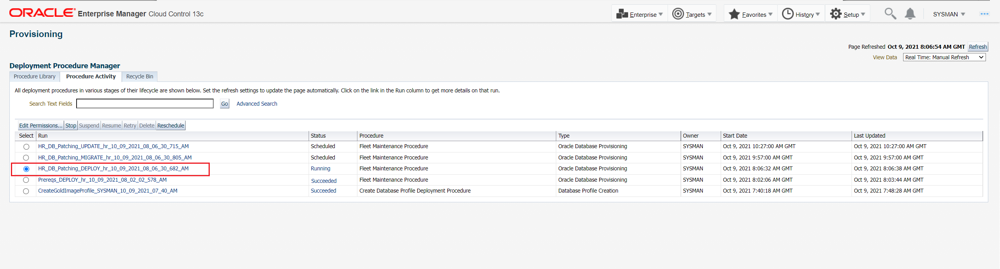

   Select DP related to Deploy and click on it. It will show details of the activity performed by the DP.

   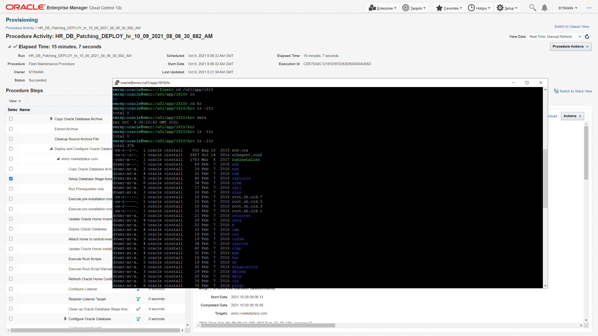

   Here, we see that the DP has successfully installed new Oracle home.(putty screen shows the new Oracle home layout)

## Task 7: Migrate Listener

1. In task 6 (above), we submitted a migration of the listener. If it needs to be submitted separately, then you need to uncheck migrate listener task (review step 3 of task 6). We see that this task has a scheduled state. In the interest of time and to complete this workshop, we can change it to run immediately. To do so, navigate to  ***Enterprise >> Provisioning and Patching >> Procedure Activity*** and select migrate DP.
  Click on reschedule.

  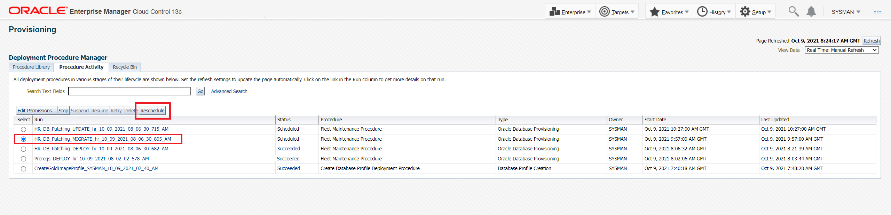

  In the new page, select immediately for start and reschedule.

  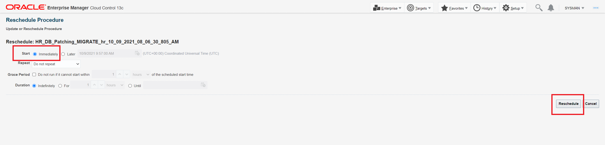

  We can now see that migrate operation is running. We can select it and see the various steps performed by it.

  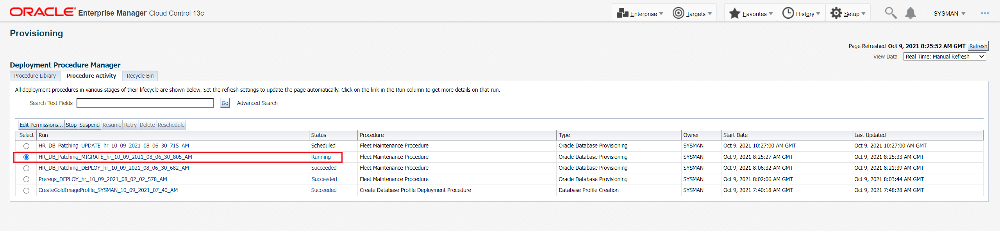

  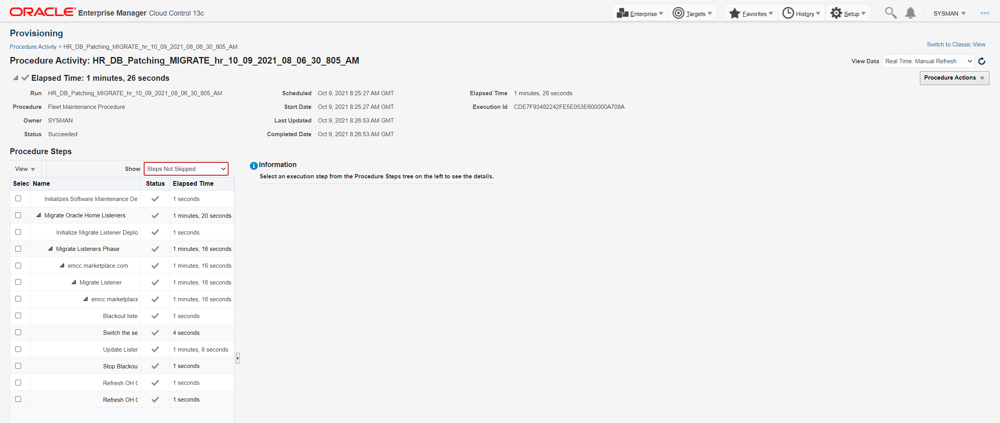

## Task 8: Update Database – Patch 18.3 to 18.10

1. Similar to listener migration, that submitted for Update Database in task 6. If it needs to be submitted separately, then you need to uncheck the update database task (review step 3 of task 6). We see that this task is at scheduled state. In the interest of time and to complete this Live Lab workshop, we can change its schedule to run immediately. Navigate to  ***Enterprise >> Provisioning and Patching >> Procedure Activity*** and select update DP.

   Click on reschedule.

   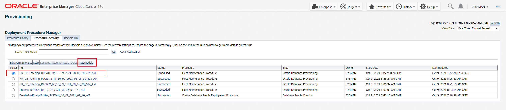

   In the new page, select immediately for start and reschedule.
   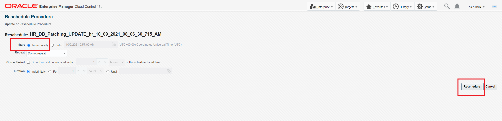   

   We have selected update operation and see the various steps performed by it. In the terminal, we can see that ***hr*** database is down for Oracle home switch over. After startup, ***hr*** database will run from new Oracle home.

   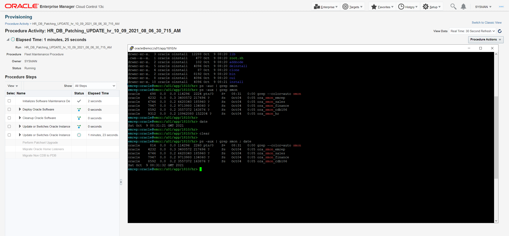

   Update operation has completed successfully.

   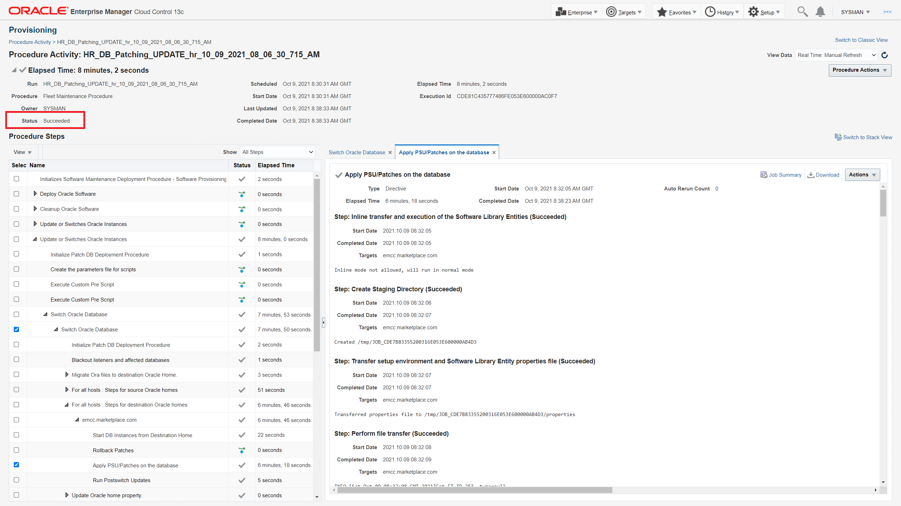

   Lets validate the version of ***hr*** database. In the upper toolbar, locate the ***Targets*** icon and click the drop-down menu and then select ***Databases***. We can see the updated version of ***hr*** database.
   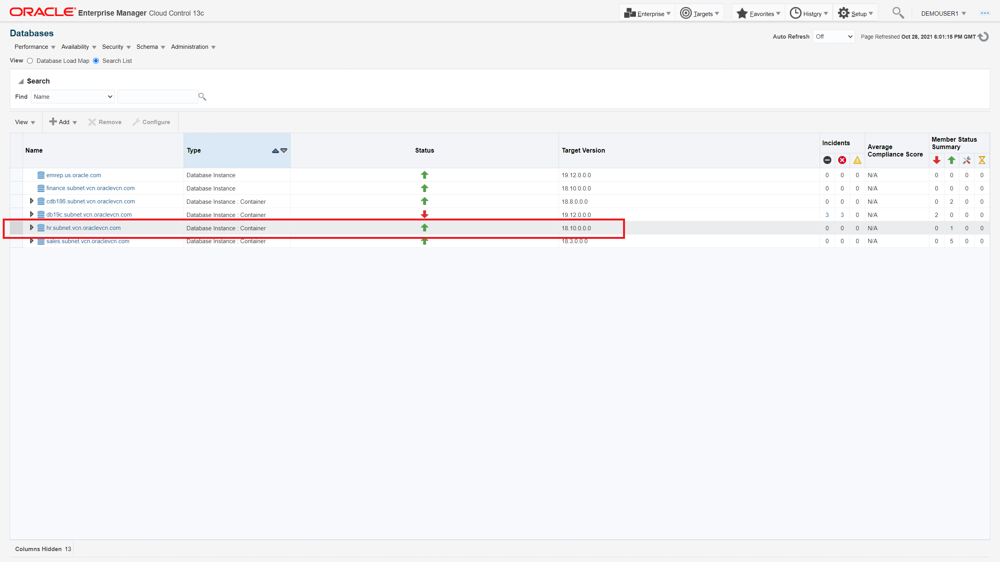

## Task 9:  Rollback Database – Reversed Patch 18.10 to 18.3

Once the database is updated, we will perform a rollback to Oracle Database 18.3. In a future release capability is being planned to perform rollback of an operation using the UI.

1. Review and execute below command from the terminal to rollback database Target ***hr.subnet.vcn.oraclevcn.com***

    ```
    <copy>curl -i -X POST https://emcc.marketplace.com:7803/em/websvcs/restful/emws/db/fleetmaintenance/performOperation/rollback -H "Content-Type:application/json" -u sysman:welcome1 --data-binary "@/home/oracle/fleet/rollback_hr_payload.json" --insecure</copy>
    ```

    **OR**

    ```
    <copy>cd ~/fleet
    sh rollback_hr.sh</copy>
    ```

    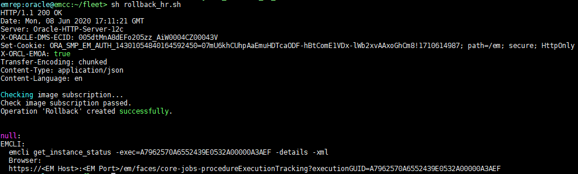

2. Navigate to the Procedure Activity Page and monitor the progress of this operation with ‘Fleet\_ROLLBACK\_...’ deployment procedure instance.

    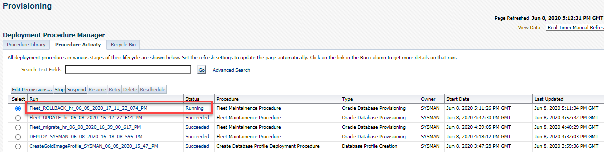

3. Review the Procedure Activity steps performed         

    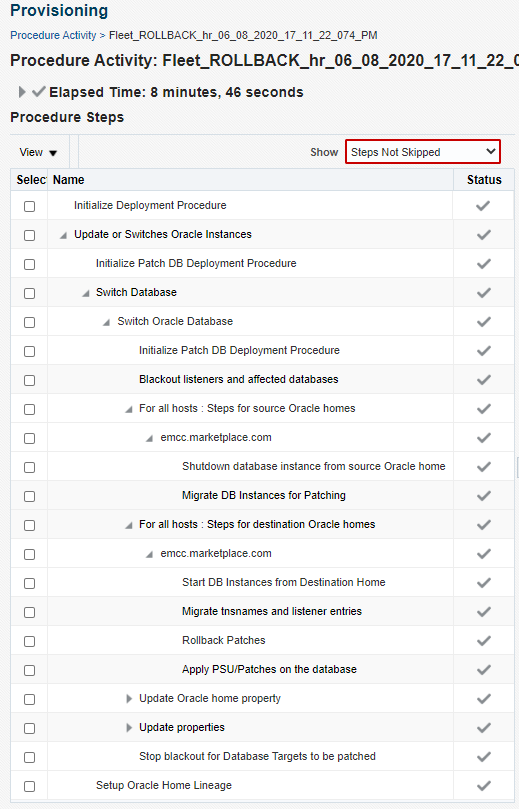

4. Verify the rolled back target by going to ***Targets >> Databases*** as shown
below.

    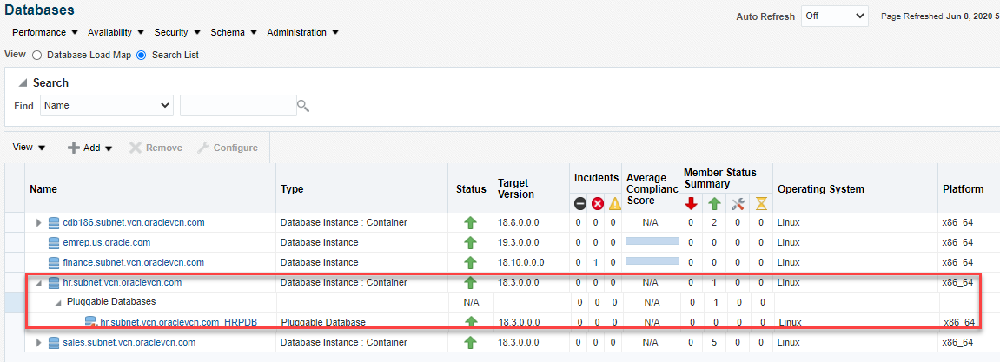

## Task 10:  Cleanup Old homes

1. Clean up Database HR. In a future release capability is being planned to perform cleanup of an operation using the UI.

   In order to have an old empty home previously used by “***hr.subnet.vcn.oraclevcn.com***” at our disposal to demonstrate a cleanup operation, we will now re-update the database by running the commands from Step 8.

2. Review and execute below command to update database target ***hr.subnet.vcn.oraclevcn.com*** again to 18.10 version

    ```
    <copy>emcli db_software_maintenance -performOperation -name="Update DB" -purpose=UPDATE_DB -target_type=oracle_database -target_list=hr.subnet.vcn.oraclevcn.com -normal_credential=ORACLE:SYSMAN -privilege_credential=ROOT:SYSMAN -database_credential=sales_SYS:SYSMAN</copy>
    ```

    **OR**

    ```
    <copy>sh update_hr.sh</copy>
    ```

    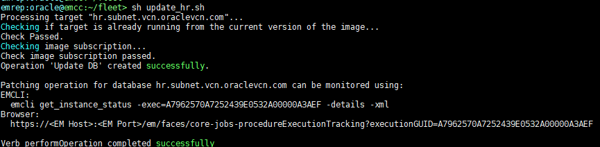

    Where:
      -  Name – Name of the operation. This is a logical name and should be kept unique Purpose – There are standard purposes defined which can be performed by Fleet Operations. “UPDATE\_DB” is one of them.


3. Verify that the update has been completed successfully before proceeding with any cleanup action, Same as done in step \#8, this should complete within 10\~15 minutes.

    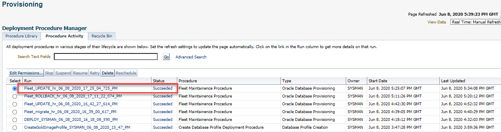

4. Verify and confirm that the target has been re-patched to Oracle Database 18.10 by going to Targets Databases as shown below

    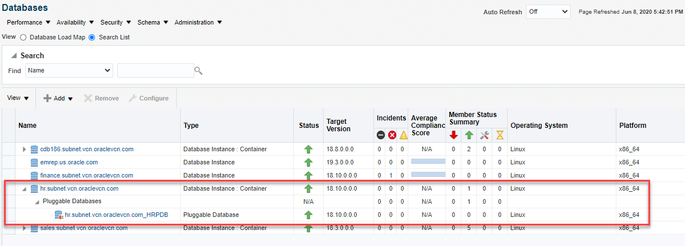

5. Review and execute the following command as a dry-run to report on cleanup impact for *hr.subnet.vcn.oraclevcn.com*  

    ```
    <copy>emcli db_software_maintenance -performOperation -name="Cleanup old oracle homes" -purpose=CLEANUP_SOFTWARE -target_type=oracle_database -normal_credential=ORACLE:SYSMAN -privilege_credential=ROOT:SYSMAN -target_list=hr.subnet.vcn.oraclevcn.com -workDir=/tmp -reportOnly=true</copy>
    ```

    **OR**

    ```
    <copy>sh cleanup_hr_report.sh</copy>
    ```

    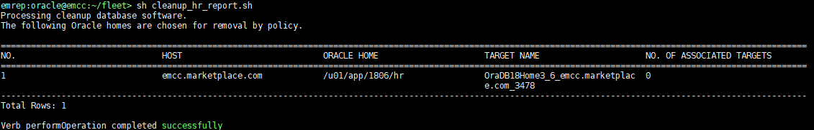

6. Review and execute the following command to cleanup *hr.subnet.vcn.oraclevcn.com*   
    ```
    <copy>emcli db_software_maintenance -performOperation -name="Cleanup old oracle homes" -purpose=CLEANUP_SOFTWARE -target_type=oracle_database -normal_credential=ORACLE:SYSMAN -privilege_credential=ROOT:SYSMAN -target_list=hr.subnet.vcn.oraclevcn.com -workDir=/tmp</copy>
    ```

    **OR**

    ```
    <copy>sh cleanup_hr.sh</copy>
    ```

    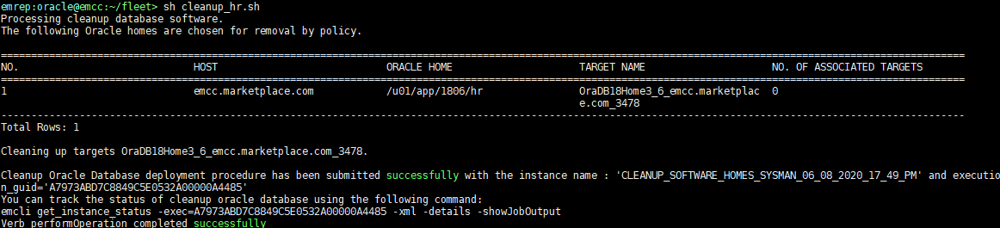

7. Navigate to the Procedure Activity Page and monitor the progress of this operation with ‘CLEANUP\_SOFTWARE\_...’ deployment procedure instance.

    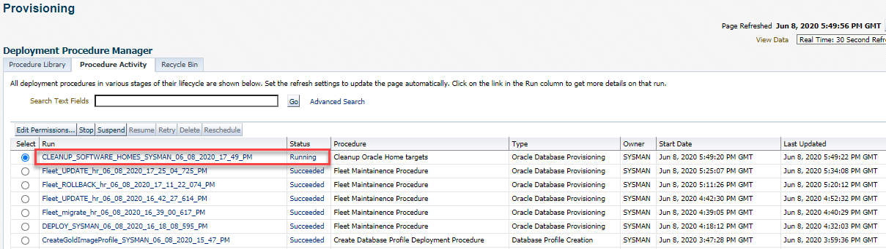

8. Review the Procedure Activity steps performed        

    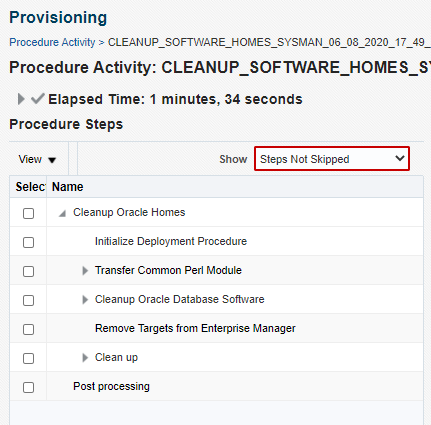

9. Verify to confirm the old Oracle home has been removed

    ```
    <copy>ls -l /u01/app/1806/hr</copy>
    ```

    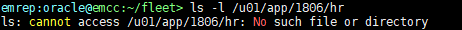

10.  As part of the cleanup operation, LISTENER\_1522 which support “***hr.subnet.oraclevcn.com***” is shutdown. Set your environment by passing “***hr***” to “***oraenv***” when prompted and start the listener back up.

    ```
    <copy>. oraenv </copy>
    ```

11. Start LISTENER\_1522 back up

      ```
      <copy>lsnrctl start LISTENER_1522</copy>
      ```

  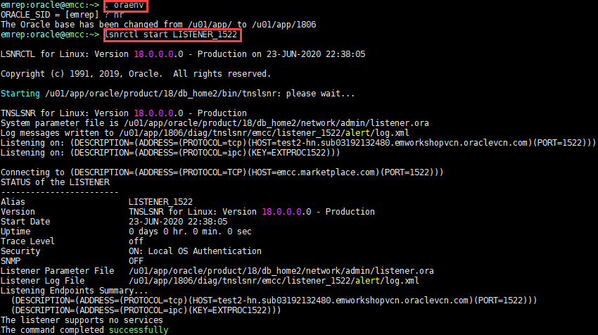

12. Force Listener registration and confirm that it is now servicing “***hr.subnet.vcn.oraclevcn.com***”

    ```
    <copy>sqlplus '/as sysdba'<<EOF
    alter system register;
    EOF
    </copy>
    ```

13. Check status of LISTENER\_1522

    ```
    <copy>lsnrctl status LISTENER_1522</copy>
    ```

    

<!-- This completes Step 2. In this section, you learned how to perform the following:
-   Create Oracle Database Software Gold Image
-   Subscribe Database to Gold Image
-   Deploy Gold Image to Database Host
-   Migrate Oracle Database Listener from old Oracle home to newly Deployed Oracle home
-   Update (Patch) Database from 18.3 to 18.10
-   Rollback (Un-patch) Database from 18.10 to 18.3
-   Clean up old Oracle homes -->

That completes the Automated Database Patching at Scale with Fleet Maintenance UI workshop.

You may now proceed to the next lab.

## Learn More
  - [Oracle Enterprise Manager](https://www.oracle.com/enterprise-manager/)
  - [Oracle Enterprise Manager Fleet Maintenance](https://www.oracle.com/manageability/enterprise-manager/technologies/fleet-maintenance.html)
  - [Enterprise Manager Documentation Library](https://docs.oracle.com/en/enterprise-manager/index.html)
  - [Database Lifecycle Management](https://docs.oracle.com/en/enterprise-manager/cloud-control/enterprise-manager-cloud-control/13.5/lifecycle.html)
  - [Database Cloud Management](https://docs.oracle.com/en/enterprise-manager/cloud-control/enterprise-manager-cloud-control/13.5/cloud.html)

## Acknowledgements
  - **Authors**
    - Shefali Bhargava, Oracle Enterprise Manager Product Management
    - Rene Fontcha, LiveLabs Platform Lead, NA Technology
    - Romit Acharya, Oracle Enterprise Manager Product Management
  - **Contributors** -
  - **Last Updated By/Date** -Romit Acharya, Oracle Enterprise Manager Product Management, January 2022
