# Automated Database Patching at Scale with Fleet Maintenance

## Introduction
The goal of this lab is to explore end-to-end automated patching and upgrades of the Oracle Database using Enterprise Manager.

*Estimated Lab Time*: 75 minutes

Watch the video below for a quick walk through of the lab.
[](youtube:NvFYUV2RGqs)

### About Database Fleet Maintenance

Database Fleet Maintenance is an end-to-end automated solution for patching and upgrade of Oracle Database. Fleet Maintenance enables DBAs to automate patching of wide range of DB Configurations including Oracle RAC environments with Data Guard Standby.

Benefits with Fleet Maintenance:
- Minimum Downtime with Out of Place patching
- Enterprise Scale with Enterprise Manger Deployment Procedures Framework
- Single pane of glass for monitoring and managing entire patching and upgrade operations
- Ability to schedule/retry/suspend/resume.
- Database patching across different infrastructure including engineered systems like Exadata

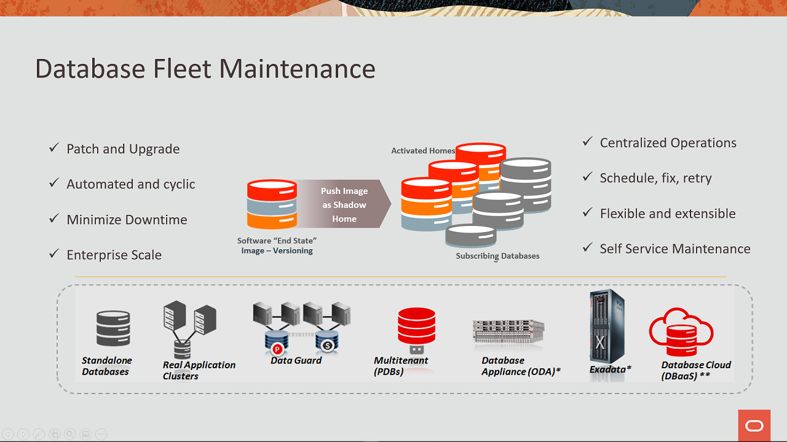

#### Video Preview
Watch a preview of database patching using Oracle Enterprise Manager Fleet Maintenance:

[](youtube:JlspEvqebHE)

*Note: Interfaces in this video may look different from the interfaces you will see. For updated information, please see steps below.*

### Objectives

In this lab you will perform the following steps:
| Step No. | Feature                                                    | Approx. Time | Details                                                                                                                                                                    | Value Proposition |
|----------------------|------------------------------------------------------------|-------------|----------------------------------------------------------------------------------------------------------------------------------------------------------------------------|-------------------|
| 1                    | Detect Configuration Pollution                             | 10 minutes  | Analyze the database estate using Software Standardization.                                                                                                                |                   |
| 2                    | Oracle Database Patching with Fleet Maintenance | 50 minutes  | Patch a Database target using a Gold Image. As part of patching the Container Database, all Pluggable Databases in that Container Database will automatically get patched. |                   |


### Prerequisites
- A Free Tier, Paid or LiveLabs Oracle Cloud account
- You have completed:
    - Lab: Prepare Setup (*Free-tier* and *Paid Tenants* only)
    - Lab: Environment Setup
    - Lab: Initialize Environment

*Note*: This lab environment is setup with Enterprise Manager Cloud Control Release 13.5 and Database 19.10 as Oracle Management Repository. Workshop activities included in this lab will be executed both locally on the instance using Enterprise Manager Command Line Interface (EMCLI) or Rest APIs, and the Enterprise Manager console (browser)

## Task 1: Review Tasks Completed in Advance

In the interest of simplifying the setup and save time, the following steps were completed in advance and covered in this lab. Please review accordingly for reference

1. We have created and pre-patched an Oracle Home with 18.10 release using which will be use to create the gold image *[/u01/app/oracle/product/18/db\_home\_src, Orasidb18c\_home1\_2020\_05\_13\_04\_10\_9\_emcc.marketplace.com\_3192]*

To ensure smooth execution of the intended use cases, we have pre-hosted the scripts to be used later at */home/oracle/fleet*

## Task 2: Detect Configuration Pollution with Software Standardization Advisor

This exercise enables us to analyze the database estate using Software Standardization.

Software Standardization Advisor enables administrators to understand various database configurations prevailing in their environment. Each deployment with a unique platform, release and patch level is identified as a distinct configuration. This provides the administrators a view of the configuration pollution in their estate. It also analyzes and provides a recommendation to standardize the environment and reduce the number of configurations required for managing the database estate.

  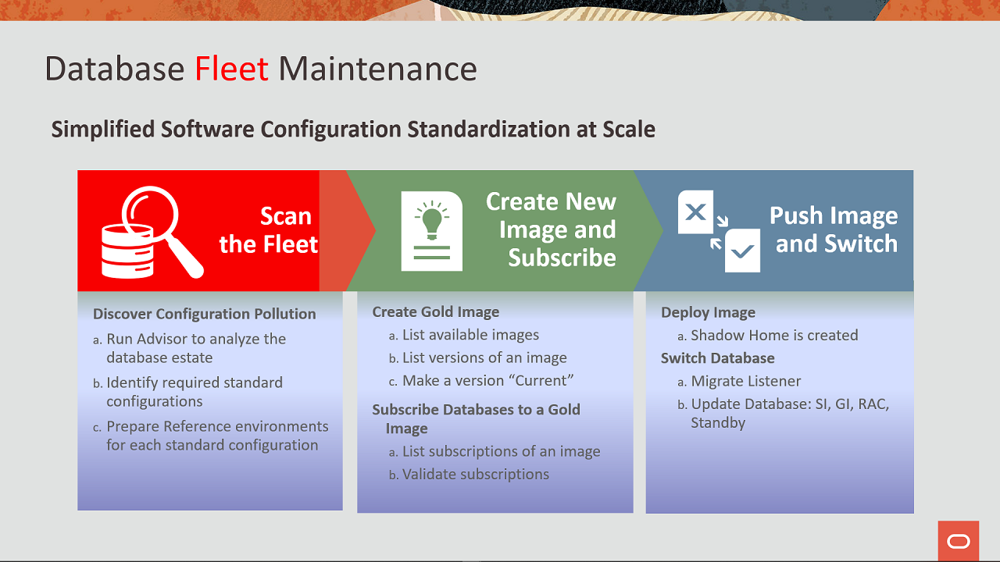

1. On the browser window on the right preloaded with *Enterprise Manager*, if not already logged in, click on the *Username* field and login with the credentials provided below.

    ```
    Username: <copy>sysman</copy>
    ```

    ```
    Password: <copy>welcome1</copy>
    ```

    

2.  Click on ***Targets >> Databases***.

    

3.  In the Databases targets page, click on ***Administration >> Software Standardization Advisor***

    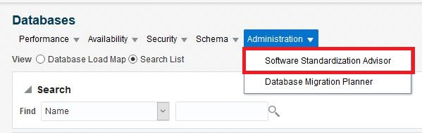

4.  Software Standardization Advisor shows two graphs depicting current configuration and recommended configuration.

    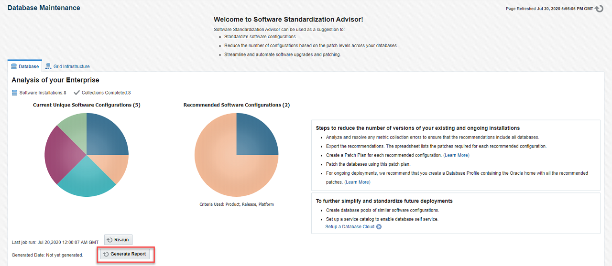

    A Software Configuration is identified by Database Release, Platform and set of Patches installed on the target.

    The Software Configuration Advisor run shows that there are 5 Unique Software Configurations in the environment as shown in the pie chart labelled as “Current Unique Software Configurations” and recommendation is to maintain 2 Software Configurations as shown in the pie chart labelled as “Recommended Software Configurations”.

    Let us observe details of the reports in next steps.

5.  Click on **Generate Report**.

6.  Click on **Current Configurations** to open the Excel report.

    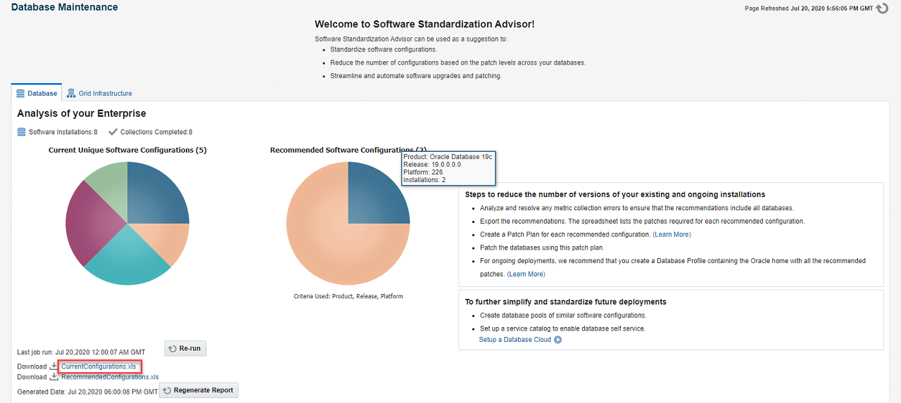

    When opening the downloaded Excel Spreadsheet report, a warning on XLS format and file extension mismatch may pop up (see below). Simply click on “Yes” to
    ignore the warning and open the file.

    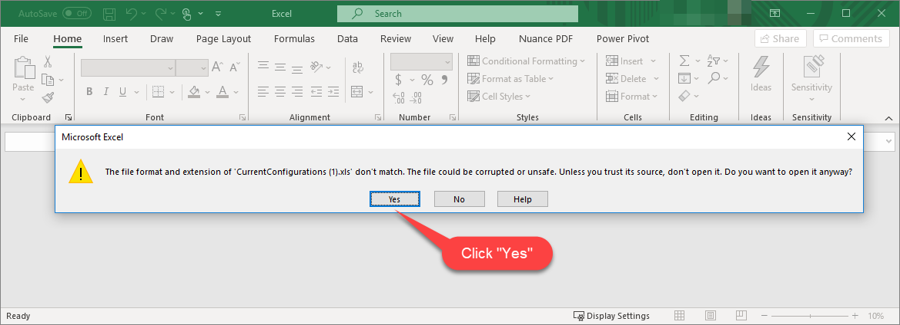

    Current Configuration shows five different Oracle home software versions

    

7.  Next, click on **Recommended Configurations** to open the Excel Report.

    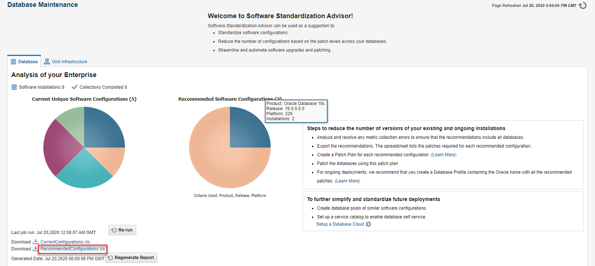

    The EM Recommended Configuration report recommends reducing 5 configurations and standardizing the database estate on 2 configurations, one based on 18c and the other based on 19c. This means All Oracle Homes of Release 18c should uptake the corresponding 18c configuration and the 19c homes will use the one based on Release 19c

    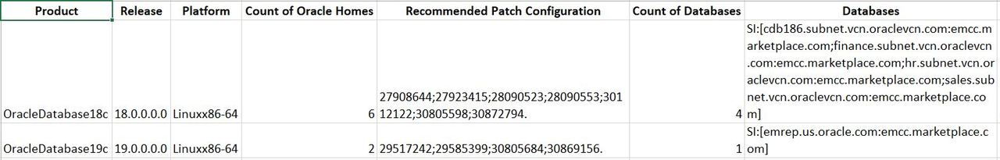

    Recommendation is based on union of all bugs included in the Patches in all OHs and based on configuration type.

  <!-- This completes Step 1. In this section, you learned how to perform the following:

    - Access the Database Software Standardization Advisor
    - View Configuration summary
    - Generate and download current and recommended configuration reports

  In the next section we will follow these recommendations to perform the following using Enterprise Manager 13c Fleet Maintenance.

    - Patch database “hr.subnet.vcn.oraclevcn.com” from 18.3 to 18.10 -->

## Task 3: Database Server patching with Fleet maintenance (Overview)

### **Database Fleet Maintenance**

Enterprise Manager Database Fleet Maintenance is a Gold Image Target subscription based out of place patching solution. Gold Image(s) are software library entities storing archive of a patched software home. Targets, to be patched, subscribe to a relevant Gold Image. Target subscription persists through the lifecycle of the Target or Gold Image unless modified by an administrator.

  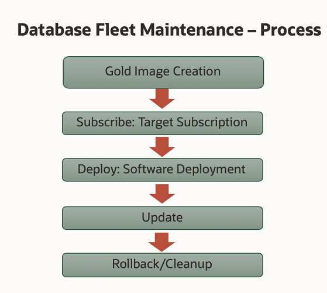

### **Patching with Fleet Maintenance**

We will go through steps for patching database target ***hr.subnet.vcn.oraclevcn.com***, a Container Database that is currently at 18.3.0.0.0 version. The goal is to patch this target to 18.10.0.0.0. As part of the patching exercise this Container Database and all Pluggable Databases in that Container Database will automatically get patched.

1.  Log on to Enterprise Manager Console and review the status and version of DB Target.

    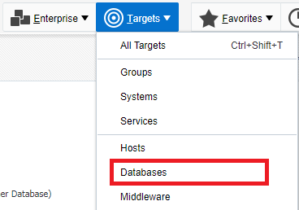

    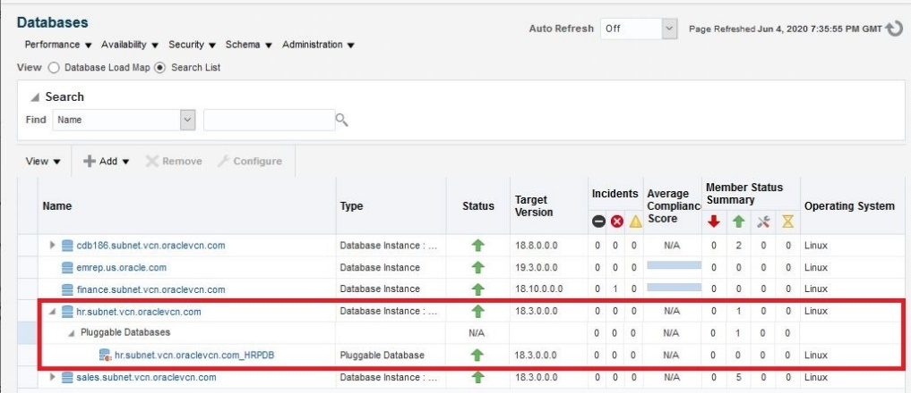

    You will see ***hr.subnet.vcn.oraclevcn.com*** Container Database has a pluggable database ‘HRPDB’. Both the Container Database and Pluggable database targets have status ‘UP’ and version 18.3.0.0.0. If target status is ‘DOWN’, start the target (using */home/oracle/start\_db\_hr.sh*).

## Task 4: Create Gold Image

1. Review reference home setup *[READ-ONLY– This step has already been implemented]*

    Gold Image represents a software end state. An Enterprise Manager Software Library Gold Image is a software archive created from a patched oracle home uploaded to EM Software Library.

    In order to create a Gold Image of the ‘recommended patch configuration’, you need to manually create such an Oracle Home as a pre-requisite step. As the goal is to patch Database 18.3 targets with Database 18.10 RU, a reference Oracle home fully patched to 18.10 *[/u01/app/oracle/product/18/db\_home\_src]* was created and used to create the initial version of the Gold Image as further described in the next steps..

    This patched reference Oracle Home is discovered in Enterprise Manager as shown below and will be used for Gold Image Creation.

2. Navigate to “***Targets >> All Targets***” and type in “*Orasidb18c\_home1\_2020\_05\_13\_04\_10\_9\_emcc.marketplace.com\_3192*” in the “Search Target Name” box.

  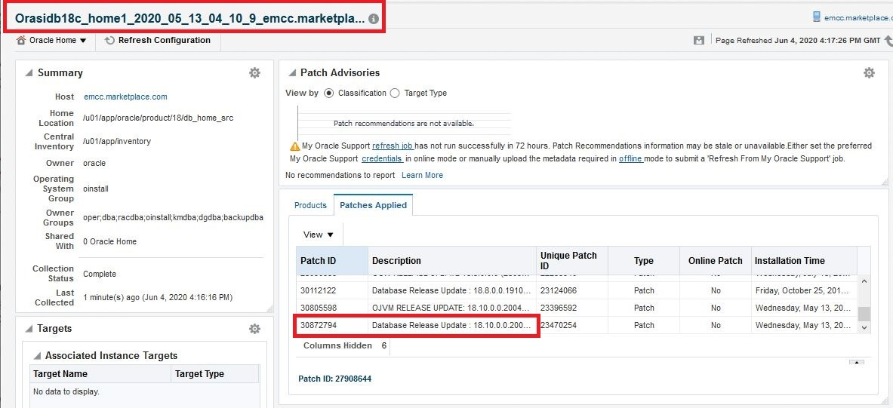

3. From the terminal on your remote desktop, Create the New Gold Image using the following emcli command

    ```
    <copy>cd fleet
    cat create_image_Tier2_sidb_x64.sh</copy>
    ```

    **OR**

    ```
    <copy>sh create_image_Tier2_sidb_x64.sh</copy>
    ```
    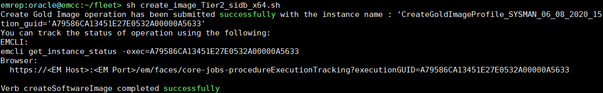

4. Click on ***Enterprise >> Provisioning and Patching >> Procedure Activity*** to review Execution details of this operation via Enterprise Manager Console

    

5. Click on ‘CreateGoldImageProfile\_...’ run and review the steps performed.  

    

6. Use ‘Show’ filter ‘Steps Not Skipped’ ; View:‘Expand All’ for detailed view of all the steps performed to complete an operation.

    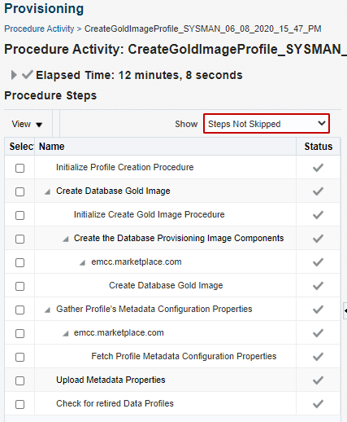

7. List Available Gold Images. Execute the following commands in the terminal to see the list of Gold Images available for deployment, locate ‘Tier \#2 SI DB Linux64*’* in the emcli command output:

    ```
    <copy>emcli db_software_maintenance -getImages</copy>
    ```

    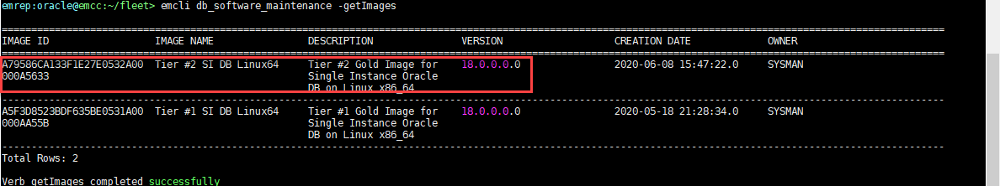

    IMAGE ID retrieved from the output of above command is used in further operations like Target Subscription.

    After retrieving a list of the available images, one can view a list of versions available for a specific image with the following command:

    ```
    <copy>emcli db_software_maintenance -getVersions -image_id={Insert IMAGE ID from List available gold images}</copy>
    ```   

    This command lists Gold Image versions with their VERSION ID and STATUS.

    

    When a Gold Image is created for the first time, its first version is created as per the input and marked as current. Whenever we run a DEPLOY operation for a target, Gold Image version marked as CURRENT is used to deploy the new Oracle Home.

8.  Verify if Gold Image is Applicable

    This step verifies if the image can be used to patch a specified database target. This is done by comparing the bug fixes available in the current Oracle home of the database target and the image. In effect this check is run to identify patch conflicts.

    - Review and execute below emcli command:  
    ```
    <copy>emcli db_software_maintenance -checkApplicability -image_id={Insert IMAGE ID from List available gold images} -target_list=hr.subnet.vcn.oraclevcn.com -target_type=oracle_database > /home/oracle/applicability.out</copy>
    ```

    ```
    <copy>cat /home/oracle/applicability.out | more</copy>
    ```

    - Output of above emcli command is redirected to a file. You may review the output using any standard editor or tool of your choice.

    

    This command can show one of the following results:

    - Applicable: The image and database target contain the same set of bug fixes. The image can be applied on the specified target.
    - Applicable and Image has more bug fixes: The image contains more bug fixes than those applied on the database. The list of extra bugs is displayed. The image can be applied on the specified target.
    - Not Applicable: The database contains more bug fixes than those included in the image. The list of missing bugs is displayed. The administrator has to create a new version of the image that includes the missing bugs before the database can uptake the same.

## Task 5: Subscribe Database

1.  Review the flow on subscribing Targets to the Selected Gold Image

    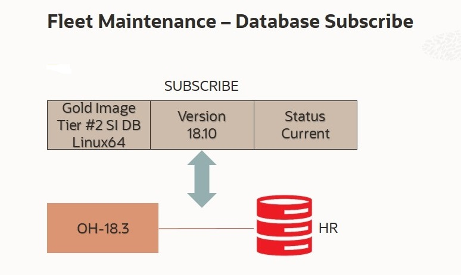

2. Execute below command to subscribe the target hr.subnet.vcn.oraclevcn.com to Gold Image

    ```
    <copy>emcli db_software_maintenance -subscribeTarget -target_name=hr.subnet.vcn.oraclevcn.com -target_type=oracle_database -image_id={Insert IMAGE ID from List available gold images}</copy>
    ```

    Where:
   -  target\_name – Name of the Database target which needs to be patched
   -  target\_type – type of target to be patched. This should be oracle\_database in this case
   -  image\_id – ID of the Gold Image to which the target should be patched

    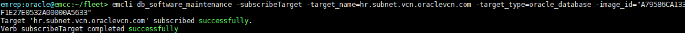

## Task 6: Deploy Image

1.  Review the flow on Gold Image Deployment

    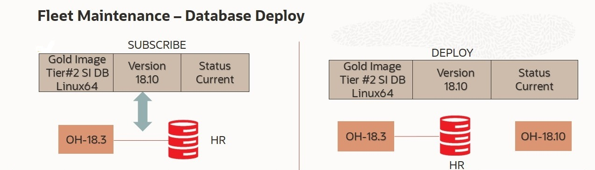

2. Run the block below to deploy a new Oracle Home

    ```
    <copy>emcli db_software_maintenance -performOperation -name="deploy1810" -purpose=DEPLOY_DB_SOFTWARE -target_type=oracle_database -target_list=hr.subnet.vcn.oraclevcn.com -normal_credential=ORACLE:SYSMAN -privilege_credential=ROOT:SYSMAN -input_file="data:/home/oracle/fleet/deploy1810_hr.inp" -procedure_name_prefix="DEPLOY"</copy>
    ```

    **OR**  

    ```
    <copy>sh deploy1810_hr.sh</copy>
    ```

    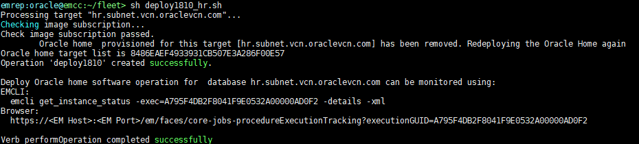

    Where:
    -  NEW\_ORACLE\_HOME\_LIST = Absolute path to the File System location where new Oracle Home will be deployed.
    -  procedure\_name\_prefix = optional, prefix for the deployment procedure instance name
    -  name = Name of the operation. This is a logical name and should be kept unique
    -  purpose = There are standard purposes defined which can be performed by Fleet Operations. “DEPLOY\_DB\_SOFTWARE” is one of them. These are predefined and should not be changed. Admin shall select one of the below mentioned purposes as and when needed.
    -  normal\_credential = This should be provided in the format \{ Named Credential: Credential Owner\} .
    -  privilege\_credential = This should be provided in the format \{ Named Credential: Credential Owner\}
    -  start\_schedule = Schedule when the stage and deploy should start if that needs to be done in future. Format: “*start\_time:yyyy/mm/dd HH:mm*”. It’s an optional parameter, if not provided, operation will start immediately
    -  target\_type = The type of target being provided in this operation.
    -  target\_list =

         1.  This is a comma separated list of targets which need to be patched.
         2.  Targets of homogenous types are supported in a single fleet operation.
         3.  The system will calculate the unique list of hosts based on this target list and start stage of Oracle home software on those hosts.
         4.  If targets running from same Oracle home are provided in this list, the stage and deploy operation will be triggered only once and not for all targets.

3. Navigate to ***Enterprise >> Provisioning and Patching >> Procedure Activity*** to Review Execution Details of this operation via Enterprise Manager Console. Click on ‘DEPLOY\_SYSMAN\_\*’ run

    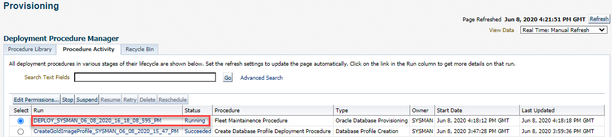

4. Review the Procedure Activity steps performed.

    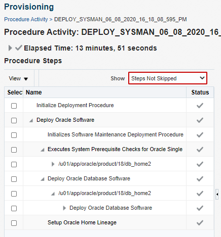

## Task 7: Migrate Listener

1. Review and execute the following command to Migrate the Listener

    ```
    <copy>emcli db_software_maintenance -performOperation -name="Migrate Listener" -purpose=migrate_listener -target_type=oracle_database -target_list="hr.subnet.vcn.oraclevcn.com" -normal_credential="ORACLE:SYSMAN" -privilege_credential="ROOT:SYSMAN"</copy>
    ```  

    **OR**  

    ```
    <copy>sh migrate_listener_hr_update.sh</copy>
    ```

    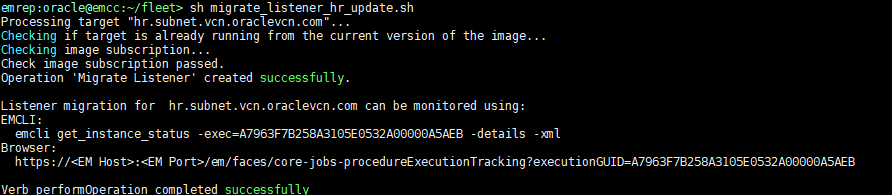

2. Navigate to ***Enterprise >> Provisioning and Patching >> Procedure Activity*** to Review Execution Details of this operation via Enterprise Manager Console. Click on ‘Fleet\_migrate\_\*’ run

    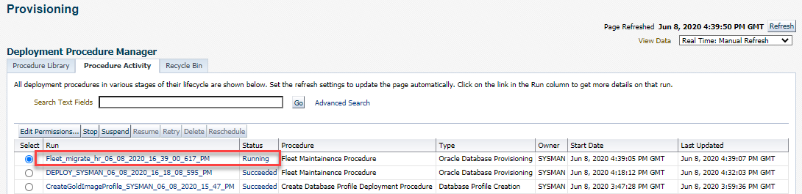

3. Review the Procedure Activity steps performed.  

    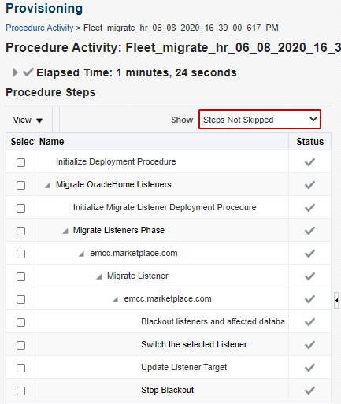

## Task 8: Update Database – Patch 18.3 to 18.10

1.  Review the flow on Update Database task. Once the deploy operation completes successfully. We are ready to run the final UPDATE operation which patches the database by switching it to the newly deployed home.

    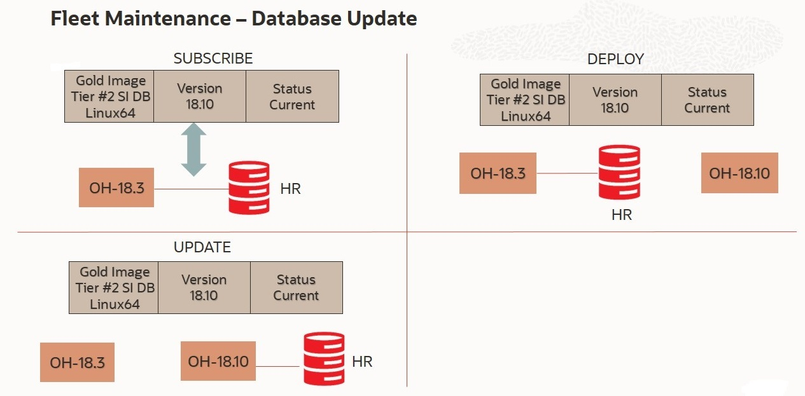

2. Review and execute below command to update DB Target *hr.subnet.vcn.oraclevcn.com*

    ```
    <copy>emcli db_software_maintenance -performOperation -name="Update DB" -purpose=UPDATE_DB -target_type=oracle_database -target_list=hr.subnet.vcn.oraclevcn.com -normal_credential=ORACLE:SYSMAN -privilege_credential=ROOT:SYSMAN -database_credential=sales_SYS:SYSMAN</copy>
    ```

    **OR**

    ```
    <copy>sh update_hr.sh</copy>
    ```

    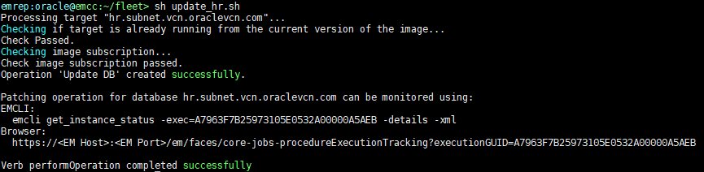

    Where:
      - Name – Name of the operation. This is a logical name and should be kept unique  
      - Purpose – There are standard purposes defined which can be performed by Fleet Operations. “UPDATE\_DB” is one of them.

3. Navigate to the Procedure Activity Page and monitor the progress of this operation with ‘Fleet\_UPDATE\_...’ deployment procedure instance.

    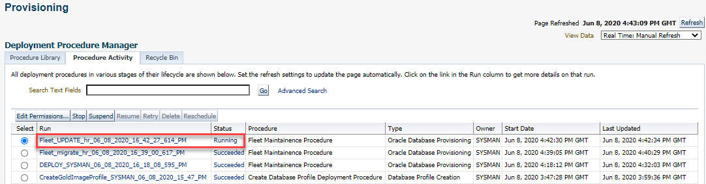

4. Review the Procedure Activity steps performed  

    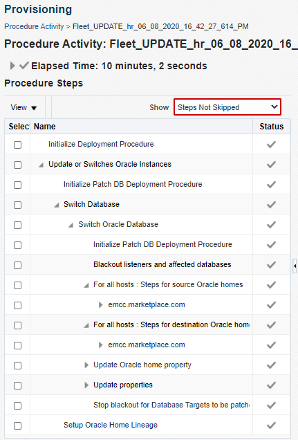

5. Verify the patched target by going to ***Targets >> Databases*** as shown below. Operation above will take 10-15 minutes to complete.

    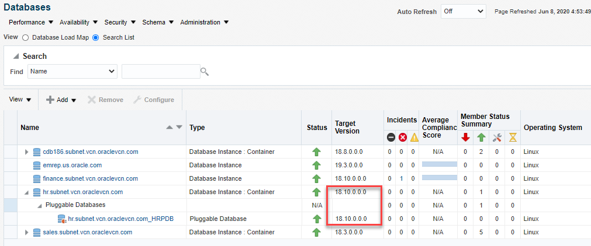

## Task 9:  Rollback Database – Reversed Patch 18.10 to 18.3

Once the database is updated, we will perform a rollback to 18.3

1. Review and execute below command from the terminal to rollback DB Target ***hr.subnet.vcn.oraclevcn.com***

    ```
    <copy>curl -i -X POST https://emcc.marketplace.com:7803/em/websvcs/restful/emws/db/fleetmaintenance/performOperation/rollback -H "Content-Type:application/json" -u sysman:welcome1 --data-binary "@/home/oracle/fleet/rollback_hr_payload.json" --insecure</copy>
    ```

    **OR**

    ```
    <copy>sh rollback_hr.sh</copy>
    ```

    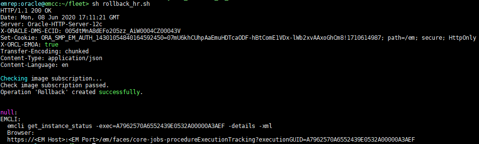

2. Navigate to the Procedure Activity Page and monitor the progress of this operation with ‘Fleet\_ROLLBACK\_...’ deployment procedure instance.

    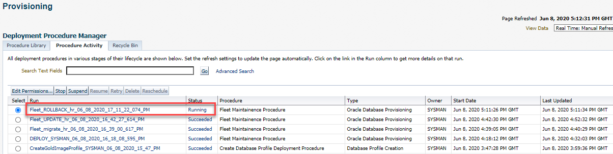

3. Review the Procedure Activity steps performed         

    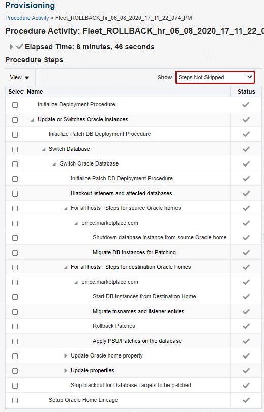

4. Verify the rolled back target by going to ***Targets >> Databases*** as shown
below.

    

## Task 10:  Cleanup Old Homes

1. Clean up Database HR

In order to have an old empty home previously used by “***hr.subnet.vcn.oraclevcn.com***” at our disposal to demonstrate a cleanup operation, we will now re-update the database by running the commands from Step 8.

2. Review and execute below command to update DB Target ***hr.subnet.vcn.oraclevcn.com*** again to 18.10 version

    ```
    <copy>emcli db_software_maintenance -performOperation -name="Update DB" -purpose=UPDATE_DB -target_type=oracle_database -target_list=hr.subnet.vcn.oraclevcn.com -normal_credential=ORACLE:SYSMAN -privilege_credential=ROOT:SYSMAN -database_credential=sales_SYS:SYSMAN</copy>
    ```

    **OR**

    ```
    <copy>sh update_hr.sh</copy>
    ```

    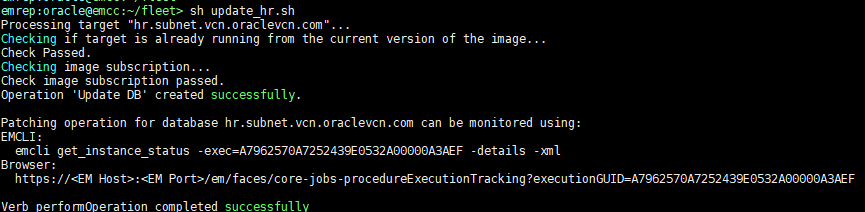

    Where:
      -  Name – Name of the operation. This is a logical name and should be kept unique Purpose – There are standard purposes defined which can be performed by Fleet Operations. “UPDATE\_DB” is one of them.


3. Verify that the update has been completed successfully before proceeding with any cleanup action, Same as done in step \#8, this should complete within 10\~15 minutes.

    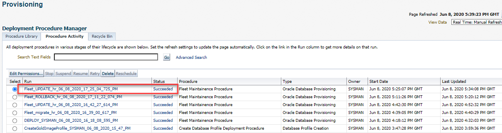

4. Verify and confirm that the target has been re-patched to 18.10 by going to Targets Databases as shown below

    

5. Review and execute the following command as a dry-run to report on cleanup impact for *hr.subnet.vcn.oraclevcn.com*  

    ```
    <copy>emcli db_software_maintenance -performOperation -name="Cleanup old oracle homes" -purpose=CLEANUP_SOFTWARE -target_type=oracle_database -normal_credential=ORACLE:SYSMAN -privilege_credential=ROOT:SYSMAN -target_list=hr.subnet.vcn.oraclevcn.com -workDir=/tmp -reportOnly=true</copy>
    ```

    **OR**

    ```
    <copy>sh cleanup_hr_report.sh</copy>
    ```

    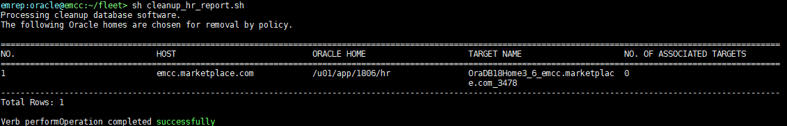

6. Review and execute the following command to cleanup *hr.subnet.vcn.oraclevcn.com*   
    ```
    <copy>emcli db_software_maintenance -performOperation -name="Cleanup old oracle homes" -purpose=CLEANUP_SOFTWARE -target_type=oracle_database -normal_credential=ORACLE:SYSMAN -privilege_credential=ROOT:SYSMAN -target_list=hr.subnet.vcn.oraclevcn.com -workDir=/tmp</copy>
    ```

    **OR**

    ```
    <copy>sh cleanup_hr.sh</copy>
    ```

    

7. Navigate to the Procedure Activity Page and monitor the progress of this operation with ‘CLEANUP\_SOFTWARE\_...’ deployment procedure instance.

    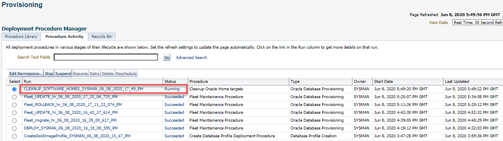

8. Review the Procedure Activity steps performed        

    

9. Verify to confirm the old Oracle Home has been removed

    ```
    <copy>ls -l /u01/app/1806/hr</copy>
    ```

    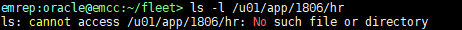

10.  As part of the cleanup operation, LISTENER\_1522 which support “***hr.subnet.oraclevcn.com***” is shutdown. Set your environment by passing “***hr***” to “***oraenv***” when prompted and start the listener back up.

    ```
    <copy>. oraenv </copy>
    ```

11. Start LISTENER\_1522 back up

      ```
      <copy>lsnrctl start LISTENER_1522</copy>
      ```

  

12. Force Listener registration and confirm that it is now servicing “***hr.subnet.vcn.oraclevcn.com***”

    ```
    <copy>sqlplus '/as sysdba'<<EOF
    alter system register;
    EOF
    </copy>
    ```

13. Check status of LISTENER\_1522

    ```
    <copy>lsnrctl status LISTENER_1522</copy>
    ```

    

<!-- This completes Step 2. In this section, you learned how to perform the following:
-   Create Oracle Database Software Gold Image
-   Subscribe Database to Gold Image
-   Deploy Gold Image to Database Host
-   Migrate Oracle Database Listener from old Oracle Home to newly Deployed Oracle Home
-   Update (Patch) Database from 18.3 to 18.10
-   Rollback (Un-patch) Database from 18.10 to 18.3
-   Clean up old Oracle Homes -->

This completes this lab.

You may now [proceed to the next lab](#next).

## Learn More
  - [Oracle Enterprise Manager](https://www.oracle.com/enterprise-manager/)
  - [Oracle Enterprise Manager Fleet Maintenance](https://www.oracle.com/manageability/enterprise-manager/technologies/fleet-maintenance.html)
  - [Enterprise Manager Documentation Library](https://docs.oracle.com/en/enterprise-manager/index.html)
  - [Database Lifecycle Management](https://docs.oracle.com/en/enterprise-manager/cloud-control/enterprise-manager-cloud-control/13.4/lifecycle.html)
  - [Database Cloud Management](https://docs.oracle.com/en/enterprise-manager/cloud-control/enterprise-manager-cloud-control/13.4/cloud.html)

## Acknowledgements
  - **Authors**
    - Shefali Bhargava, Oracle Enterprise Manager Product Management
    - Rene Fontcha, LiveLabs Platform Lead, NA Technology
  - **Contributors** -
  - **Last Updated By/Date** - Rene Fontcha, LiveLabs Platform Lead, NA Technology, July 2021
