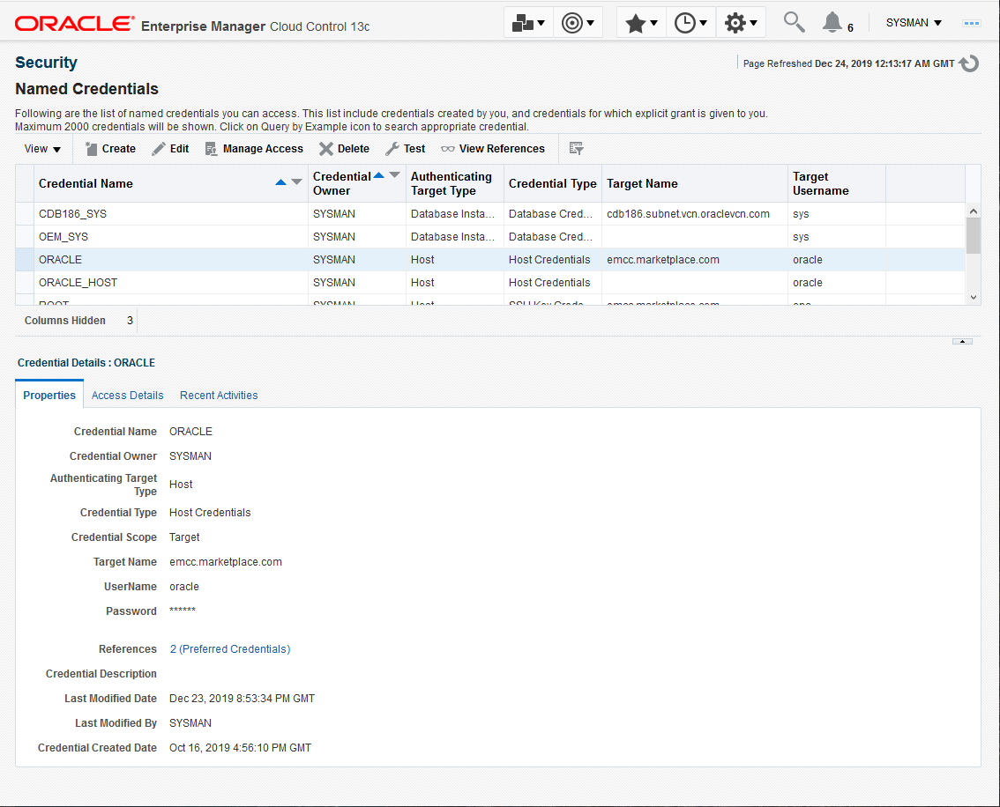
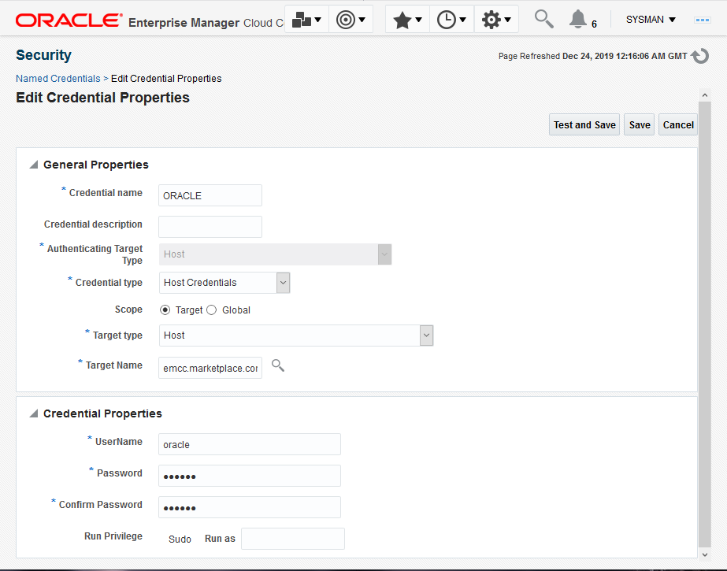

# Frequently Asked Questions (FAQ)

## Introduction
The following are Frequently Asked Questions (FAQ) you may refer to when troubleshooting issues encountered while executing above labs.

## Task 1: Review Frequently Asked Questions (FAQ)
1. How to Check Status of Oracle Management Service, Other Services and Agent
  As user *oracle* run the emctl status commands as shown:

    ````
    <copy>
    . ~/.occ_oms.sh
    emctl status oms
    emctl status agent
    </copy>
    ````

2. How to be root on the workshop instance

    You cannot login or su to root but should you need to execute a command as root, then run *sudo su command* as user *opc* from an external SSH terminal session (not the remote desktop). For example:

    ````
    <copy>sudo su cat /var/log/messages|more</copy>
    ````
3. How to Locate emcli on Your Instance

    Upon successful login via  as "oracle", set environment variables with *. .occ_oms.sh*. The emcli utility is located at */u01/app/em13c/middleware/bin/emcli*

    ````
    <copy>
    . ~/.occ_oms.sh
    which emcli
    </copy>
    ````

4. Oracle Management Server (OMS) / WebTier is Down

    Restart the OMS as user *oracle*. Refer to *Lab: Initialize Environment*

5. Unable to Connect to Oracle Management Server (OMS)  Website

    Refer to *Lab: Initialize Environment*

6. Restart an Agent Not Responding

    Refer to *Lab: Initialize Environment*

7. How to Stop all Enterprise Manager (EM) Services Before Stopping an OCI instance

  Refer to *Lab: Initialize Environment*

8. Licensing Terms for the Enterprise Manager Marketplace Instance

      This workshop environment is solely intended for non-production use to specifically explore the use cases outlined in the workshop instructions as posted in the Oracle Licensing Library.  All licensed Oracle Enterprise Manager, Oracle Linux and Oracle Database products included in the workshop environment may only be used expressly for workshop purposes and for the duration of the workshop, and furthermore, licensed Enterprise Manager Packs may only be used against the target environments that are included in the base workshop image, for the duration of the workshop.
    ​
      In order to use the functionality, the following Licensed Packs have been enabled in the Enterprise Manager workshop image:
    ​
      For the Database Lifecycle Management

    -	Database Lifecycle Management Pack for Oracle  Database
    - Cloud Management Pack for Oracle Database

    For Database Performance Management On-premises

    -	Oracle Diagnostics Pack
    -	Oracle Tuning pack
    -	Real Application Testing

9. How to Reset user *oracle* password or if Named Credentials for user oracle is not working

    Reset the password for user *oracle*. As user *opc* from an external SSH terminal session (not the remote desktop), run the following

    ````
    <copy>sudo su password oracle</copy>
    ````

    If *oracle* OS user password is updated, the Named Credential for *ORACLE* and also *ORACLE_HOST* needs to be updated. This can be done on the command line as user *oracle*. Run *sudo su - oracle* first if you're not already connected as *oracle*, then run:

    ````
    <copy>
    emcli login -username=sysman -password=\<sysman_password\>
    emcli modify_named_credential -cred_name=oracle -attributes="HostPassword:\<oracle_password\>"
    emcli modify_named_credential -cred_name=oracle_host -attributes="HostPassword:\<oracle_password\>"
    emcli logout
    </copy>
    ````
    The Named Credential can also be updated via Enterprise Manager UI. On the EM Console navigate to Setup, then Security, and then Named Credentials.
    ​
    
    ​
    **Click** on Credential Name ORACLE and **Click** on Edit. **Enter** the new password in the Credentials Sections twice and **Click** on Save. Repeat for Credential ORACLE_HOST
    ​
    

10. Unable to connect to Enterprise Manager Console

  Refer to *Lab: Initialize Environment*

11. Unable to Select Shape for Creating an instance (*Free-tier* and *Paid Tenants* only)

  Refer to *Lab: Setup Environment*

## Acknowledgements
  - **Author** - Rene Fontcha, LiveLabs Platform Lead, NA Technology
  - **Contributors** - Kay Malcolm, Product Manager, Database Product Management
  - **Last Updated By/Date** - Rene Fontcha, LiveLabs Platform Lead, NA Technology, July 2021
