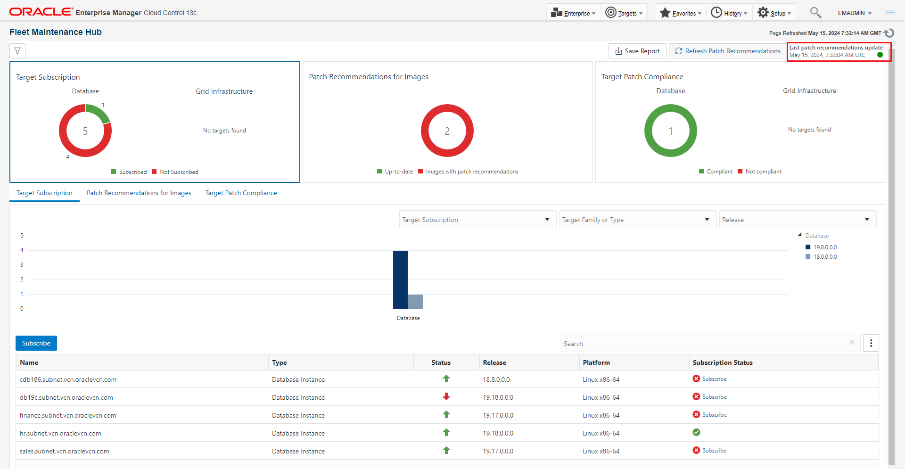
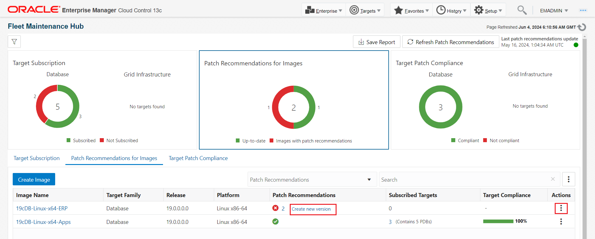
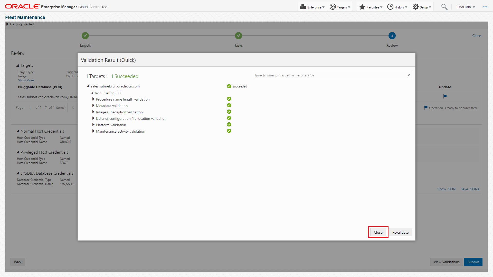

# Assess and Assure Security Posture Across Your Fleet of Databases

## Introduction

Learn how to secure and ensure compliance of your enterprise databases in this workshop. Discover methods to monitor their security, validate configurations, and automate compliance with company, industry, and regulatory standards like CIS and STIG. Explore using Oracle Enterprise Manager to automate inventory and baseline all database targets, including various versions and instances deployed over time.

*Estimated Time*: 60 minutes

You can watch this video below for a quick walk-through of this lab.
[Video Walk-through](videohub:1_vyyju031)

### Secure database assets using Fleet Maintenance Hub in Oracle Enterprise Manager

Starting with Enterprise Manager 13.5 RU16, Enterprise Manager offers a new interface - Fleet Maintenance Hub to ease automated update(patching), and upgrade of your database fleet.
The Fleet Maintenance Hub within Enterprise Manager offers a comprehensive solution for managing database vulnerabilities and patch operations. It streamlines the process by identifying potential security risks, providing patch recommendations, and enabling efficient scheduling and monitoring of patching and upgrade operations. With the ability to manage diverse infrastructures and ensure compliance with patch policies, the Fleet Maintenance Hub serves as a centralized and powerful tool for maintaining the security and stability of database assets.

### Compliance check of your database assets using Oracle Enterprise Manager
<<Data from Shiva>>

#### Video Preview
Watch a preview of database patching using Oracle Enterprise Manager Fleet Maintenance:

*Note: Interfaces in this video may look different from the interfaces you will see. For updated information, please see steps below.*

### Objectives

In this lab you will perform the following steps:
| Step No. | Feature                                                    | Approx. Time | Details                                                                                                                                                                    | Value Proposition |
|----------------------|------------------------------------------------------------|-------------|----------------------------------------------------------------------------------------------------------------------------------------------------------------------------|-------------------|
| 1                    | Assess patch recommendation and create gold image                             | 10 minutes  | Review the patch recommendations for existing gold images                                                                                                                 | Provides patch recommendations for gold image. Discover the advantages of utilizing patch recommendations, where manual, time-intensive tasks are automated to yield highly precise outcomes.                  |
| 2                    | Secure databases by updating with new gold image | 10 minutes  | Update databases using Gold image | Demonstrate with ease to update a pluggable database                   |
| 3                    | Elevate security posture by auditing for compliance | 5  minutes  | Refresh a Gold Image based on latest patch recommendation | How to steps to create a new version for a gold image. Latest version will be used to update and upgrade process.

### Prerequisites
- A Free Tier, Paid or LiveLabs Oracle Cloud account
- You have completed:
    - Lab: Prepare Setup (*Free-tier* and *Paid Tenants* only)
    - Lab: Environment Setup
    - Lab: Initialize Environment

*Note*: This lab environment is setup with Enterprise Manager Cloud Control Release 13.5 and Database 19.10 as Oracle Management Repository. Workshop activities included in this lab will be executed both locally on the instance using Enterprise Manager Command Line Interface (EMCLI) or Rest APIs, and the Enterprise Manager console (browser)

## Task 1: Assess patch recommendation and create gold image

In this task, we will review patch recommendations for existing gold images. Based upon the recommendations, we will create a new version.

1. Login to Enterprise Manager as user - emadmin and password - welcome1

2. Once logged in, navigate to ***Targets >> Databases***  

   and then ***Administration >> Fleet Maintenance Hub***

3. This is the homepage of Fleet Maintenance Hub. At the top right corner we see the status of ***Last Patch Recommendation Update***. If you see a date below it, then it suggests that patch recommendation was executed on that particular date. To setup patch recommendation, review [Oracle Enterprise Manager](https://docs.oracle.com/en/enterprise-manager/cloud-control/enterprise-manager-cloud-control/13.5/emlcm/downloading-patch-recommendations-and-patches.html).

   For successful completion of this lab, we suggest that you do not upload any new patch catalog or enter your MOS credential as per above documentation. This will generate new recommendations, which might be different than the one in the upcoming sections of this document.

4. Lets review Tile 2 of Fleet Maintenance Hub, which is referred as Patch Recommendations for Images

Here we see that goldimages - 19cDB-Linux-x64-ERP has 2 patch recommendations, while 19cDB-Linux-x64-APPS has a green tick against it. This suggests that 19cDB-Linux-x64-ERP should have a new version that includes these two recommended patches, whereas 19cDB-Linux-x64-APPS is in good shape and can be used to perform patching.

Follow [Link](https://docs.oracle.com/en/enterprise-manager/cloud-control/enterprise-manager-cloud-control/13.5/emlcm/image-maintenance-ui.html) to understand steps involved to refresh a goldimage. For this lab, we will use 19cDB-Linux-x64-APPS image.

5. In order to complete the lab in the given timelines, we will use 19cDB-Linux-x64-APPS to secure one the databases. However, in next few steps, we will use Fleet Maintenance Hub to refresh 19cDB-Linux-x64-ERP.

6. As seen in step 4, that 19cDB-Linux-x64-ERP has two patch recommendations.

 Lets click on the numeric value 2. A new slideout will appear.

7. Next step is to create a new version in 19cDB-Linux-x64-ERP, that will include the recommended patches. Close the slideout and click on create new version link under Patch Recommendation column. Alternatively, click on doner icon under Actions and create new version.

8. In the new window we need to provide source details, which act as input for version creation and version details. In the left hand section, we first select Oracle Home, which will be used as a source Oracle Home.
- Select Oracle Home.
  1. Click on the Select Oracle Home button and select the Oracle Home
  2. Select one of the radio buttons. You can either choose to clone the above selected Oracle Home, apply recommended patches to cloned Oracle Home and the use this home to create a new version. Or, you can select the option to patch the Oracle Home and use it to create a new version. We will select the later option as shown in the image.
- Work Directory. - Provide location where logs will be created
- Credentials - Provide Normal and Privileged Credentials

In the right hand section, provided
- New version name that we are creating.
- Select Storage options. We will select the default one.

Click Next.

9. In this screen select the two patches, which we have already downloaded and uploaded in software library.

Click Next.

10. In the next page, review the selections that we have made previous screen. Click on Submit to initiate the operation to create a new version.

11. Once you submit, a new Deployment Procedure is submitted. You can click on the DP name to review the steps. However, to complete this lab, we will proceed to next step.

Note: Above Submitted Deployment Procedure may fail. If you face the below error, then click on ignore and select OK in the confirmation window.

## Task 2: Secure databases by updating with new gold image

In this task, we will perform pdb patching. In this usecase, we will unplug one of the pdbs and plug it to a higher version CDB.
We will unplug Finance pdb (associated with CDB -sales) and plug it to HR CDB. Finance is currently at 19.17 version and HR is at 19.23.

Lets complete below steps to perform the pdb patching.

1. Subscribe sales CDB to goldimage 19cDB-Linux-x64-APP.

Under Target Subscription tab in Fleet Maintenance Hub, click on ***Subscribe*** button. Select filter 19 under Release. From the dropdown select the goldimage - 19cDB-Linux-x64-APPS. From the list of databases, select sales.subnet.vcn.oraclevcn.com. Click on subscribe at the top right corner.

Upon completion, click on close.

2. Go to Tile 3 - Target Patch Compliance in Fleet Maintenance Hub.

Click on doner icon, under Actions for sales CDB and select Update Pluggable Database. This will launch the operator UI of Fleet Maintenance.

3. We are now at the operator UI screen, with pre-selected values for Gold Image, Target Type and Operation.

Select Finance pdb and hit next.

4. In this page, we will select relevant options and enter values wherever required.
Under Maintenance Task, we will select Attach Existing 19cDB
under Attach Existing CDB, we will review the source CDB, which is sales. Under Destination CDB, we will only see HR.
Under credentials, select from the drop down menu as per the image.
Select Next.

5. Click on Validate and then select Quick Validation. Once you get successful validation message, click close and hit submit.

6. A new dialogue box will ask for the name of the deployment procedure, to track the pdb patching. This unique name will allow you to track the operation. We have provided name - Demo_update.

7. There are two Deployment Procedure submitted.
- Attach Existing CDB
- Update PDB

Click on monitor progress, which will open a new window.

8. In the new page, under search, we have entered Demo, so that we only see the two Deployment procedures, which are associated with this lab.

We see that Deployment procedure with name Attach has completed successfully. Lets click on Update and review the steps performed.

9. With both Deployment procedures completed successfully, lets go back to databases homepage by navigating Targets->Databases.

We see that the Finance PDB has moved out of sales and is plugged with HR CDB.

## Task 3: Elevate security posture by auditing for compliance

That completes the Database Patching and Compliance lab.

You may now proceed to the next lab.

## Learn More
  - [Oracle Enterprise Manager](https://www.oracle.com/enterprise-manager/)
  - [Oracle Enterprise Manager Fleet Maintenance](https://www.oracle.com/manageability/enterprise-manager/technologies/fleet-maintenance.html)
  - [Enterprise Manager Documentation Library](https://docs.oracle.com/en/enterprise-manager/index.html)
  - [Database Lifecycle Management](https://docs.oracle.com/en/enterprise-manager/cloud-control/enterprise-manager-cloud-control/13.5/lifecycle.html)
  - [Database Cloud Management](https://docs.oracle.com/en/enterprise-manager/cloud-control/enterprise-manager-cloud-control/13.5/cloud.html)
  - [Oracle Critical Patch Updates, Security Alerts and Bulletins](https://www.oracle.com/in/security-alerts/)

## Acknowledgements
  - **Authors**
    - Romit Acharya, Oracle Enterprise Manager Product Management
    - Shiva Prasad, Oracle Enterprise Manager Product Management
  - **Last Updated By/Date** -Romit Acharya, Oracle Enterprise Manager Product Management, May 2024
