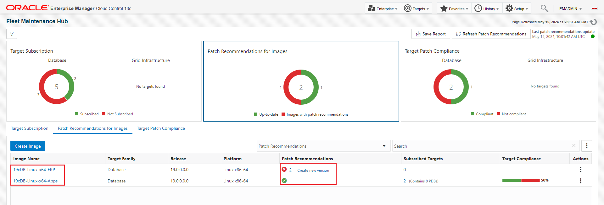
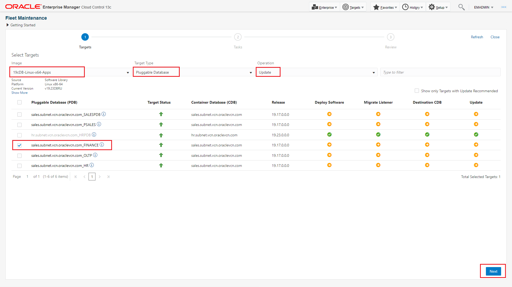
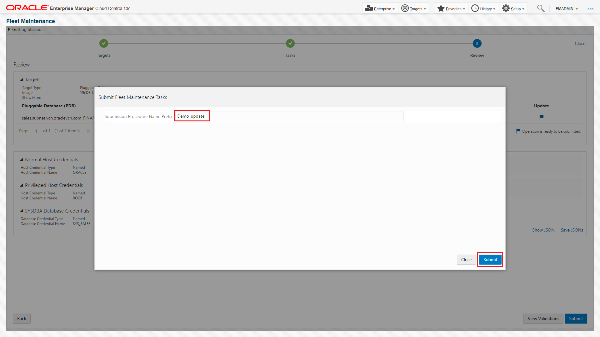
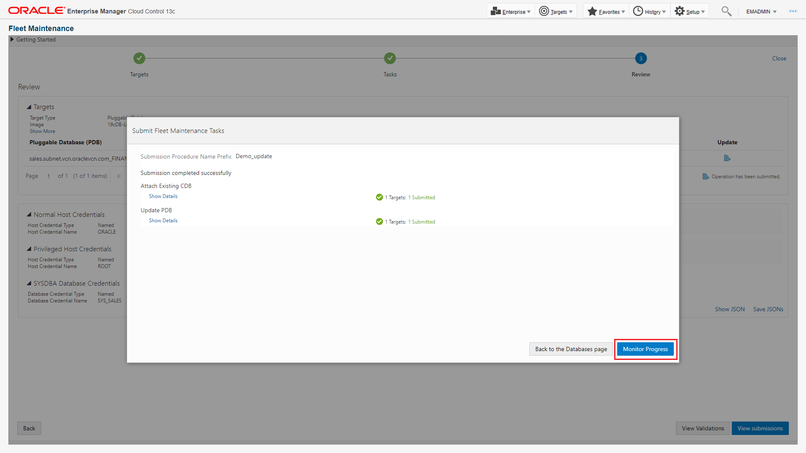
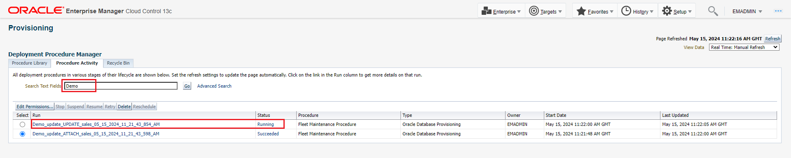

# Assess and Assure Security Posture Across Your Fleet of Databases

## Introduction

Learn how to secure and ensure compliance of your enterprise databases in this workshop. Discover methods to monitor their security, validate configurations, and automate compliance with company, industry, and regulatory standards like CIS and STIG. Explore using Oracle Enterprise Manager to automate inventory and baseline all database targets, including various versions and instances deployed over time.

*Estimated Time*: 60 minutes

### Secure database assets using Fleet Maintenance Hub in Oracle Enterprise Manager

Starting with Enterprise Manager 13.5 RU16, the new Fleet Maintenance Hub simplifies automated database updates and upgrades. This hub identifies security risks, provides patch recommendations, guided workflow for image creation and enables efficient scheduling and monitoring of patching and upgrade operations. It manages all database types, ensures compliance with patch policies, and centralizes database maintenance for enhanced security and stability.

### Compliance check of your database assets using Oracle Enterprise Manager
<<Data from Shiva>>

### Objectives

In this lab you will perform the following steps:
| Step No. | Feature                                                    | Approx. Time | Details                                                                                                                                                                    | Value Proposition |
|----------------------|------------------------------------------------------------|-------------|----------------------------------------------------------------------------------------------------------------------------------------------------------------------------|-------------------|
| 1                    | Assess patch recommendation and create gold image                             | 15 minutes  | Review the patch recommendations for existing gold images                                                                                                                 | Experience the benefits of using these recommendations, which automate traditionally manual and time-consuming tasks to produce highly accurate results.                  |
| 2                    | Secure databases by updating with new gold image | 25 minutes  | Update databases using Gold image | Effortlessly update your pluggable database, saving time and ensuring seamless operations.                   |
| 3                    | Elevate security posture by auditing for compliance | 25  minutes  | Refresh a Gold Image based on latest patch recommendation | Streamline the process of creating a new version for a gold image with these steps. The latest version ensures an efficient update and upgrade process.

### Prerequisites
- A Free Tier, Paid or LiveLabs Oracle Cloud account
- You have completed:
    - Lab: Prepare Setup (*Free-tier* and *Paid Tenants* only)
    - Lab: Environment Setup
    - Lab: Initialize Environment

*Note*: This lab environment is setup with Enterprise Manager Cloud Control Release 13.5 and Database 19.10 as Oracle Management Repository. Workshop activities included in this lab will be executed both locally on the instance using Enterprise Manager Command Line Interface (EMCLI) or Rest APIs, and the Enterprise Manager console (browser)

## Task 1: Assess patch recommendation and create gold image

In this task, we will review patch recommendations for existing gold images and create a new version based on those recommendations.

1. Login to Enterprise Manager as user - emadmin and password - welcome1

2. Once logged in, navigate to ***Targets >> Databases***  

   and then ***Administration >> Fleet Maintenance Hub***

3. Fleet Maintenance Hub is one stop place for end to end patch assessment and performing patching operation.

In the top right corner, you see the status of ***Last Patch Recommendation Update***. If a date is shown below it, the patch recommendation was executed on that date.

<!--
To setup patch recommendation, review [Oracle Enterprise Manager](https://docs.oracle.com/en/enterprise-manager/cloud-control/enterprise-manager-cloud-control/13.5/emlcm/downloading-patch-recommendations-and-patches.html).
-->

<!--
   To successfully complete this lab, do not upload any new patch catalogs or enter your MOS credentials as described in the above documentation. Doing so will generate new recommendations that may differ from those in the upcoming sections.
-->

4. click on Tile 2 of the Fleet Maintenance Hub, referred to as Patch Recommendations for Images.

In this tile, you can review the health of your gold images. If a gold image is shown green ( listed under up to date ), that suggests that the particular gold image is healthy and has all recommended patches. This image should be used for patching or upgrade operation.

Similarly, if a gold image is shown red ( listed under Images with patch recommendations ), that suggests that the particular gold image lacks critical recommended patches and should not be used for patching or upgrade operation. Administrator should create a new version such images.

Here, we see that goldimages - ***19cDB-Linux-x64-ERP*** has two patch recommendations, while ***19cDB-Linux-x64-APPS*** has a green checkmark. This indicates that 19cDB-Linux-x64-ERP should have a new version that includes the two recommended patches, whereas 19cDB-Linux-x64-APPS is up to date and can be used for patching.

<!--
Follow the [Link](https://docs.oracle.com/en/enterprise-manager/cloud-control/enterprise-manager-cloud-control/13.5/emlcm/image-maintenance-ui.html) to understand the steps involved in refreshing a gold image.
-->

For this lab, we will use the ***19cDB-Linux-x64-APPS*** image.

5. In the next few steps, we will use the Fleet Maintenance Hub to refresh 19cDB-Linux-x64-ERP.

While the refresh process is running, to complete the lab within the given timeline, we will use ***19cDB-Linux-x64-APPS*** to secure one of the databases.

6. Let's refresh the gold image.

As observed in step 4, ***19cDB-Linux-x64-ERP*** has two patch recommendations.

Click on the numeric value 2.

A new slideout will appear.

7. The next step is to create a new version in 19cDB-Linux-x64-ERP that will include the recommended patches.
Close the slideout.
Click on the ***"Create New Version"*** link under the Patch Recommendation column. Alternatively, click on the menu under Actions and create a new version.

8. In the new window, we need to provide source details, which act as input for version creation and version details.

In the left-hand section, we first select the Oracle Home, which will be used as the source Oracle Home.

- Select Oracle Home.
  1. Click on the Select Oracle Home button. In the new screen select the Oracle Home ending with ***3383***.
  2. Select Include Patches.
  3. Select one of the radio buttons. You can either choose to clone the above selected Oracle Home, apply recommended patches to the cloned Oracle Home, and then use this home to create a new version. Alternatively, you can select the option to patch the Oracle Home and use it to create a new version.
  We will select the latter option, as shown in the image.

- Under Work Directory, provide location where logs will be created. You may enter location as ***/tmp/u01***
- Credentials - Provide Normal and Privileged Credentials to complete this operation.

For Normal Host credentials, from the drop down select ***ORACLE***.

For Privileged Host credentials, from the drop down select ***ROOT***.

In the right hand section, provide
- New version name that we are creating. You may enter ***v19.23DBRU***
- Select Storage options. This will determine the source and location where the new version will be saved. We will select the default values as shown in the image.

Click Next.

9. In this screen, select the two patches that we have already downloaded and uploaded in the software library.

Click Next.

10. On the next page, review the selections that we made on the previous screen. Then, click on "Submit" to initiate the operation to create a new version.

11. Once you submit, a new Deployment Procedure (DP) is initiated. Click on the DP name to review the steps.

lets stay on this page for 2 minutes.

Note: The submitted Deployment Procedure above may fail. If you encounter the error below, click on "Ignore" and select "OK" in the confirmation window.

However, to complete this lab, we will proceed to the next step.

## Task 2: Secure databases by updating with new gold image

In this task, we will perform Pluggable Database patching. Lets navigate to Databases Homepage, by clicking on ***Targets >> Databases***  

In this scenario, we will unplug the ***Finance PDB*** (associated with the Container database - sales.subnet.vcn.oraclevcn.com) and plug it into a higher version CDB, ***hr.subnet.vcn.oraclevcn.com***. Currently, Finance is at version 19.17, while HR is at version 19.23.

Lets complete below steps to perform the pdb patching.

1. Subscribe sales CDB to goldimage ***19cDB-Linux-x64-APPS***.

Navigate to Fleet Maintenance Hub, by clicking on ***Administration >> Fleet Maintenance Hub***

Under the "Target Subscription" tab in the Fleet Maintenance Hub, follow these steps:

- Click on the Subscribe button.
- Select filter 19 under Release.
- From the dropdown, select the goldimage - 19cDB-Linux-x64-APPS.
- From the list of databases, select sales.subnet.vcn.oraclevcn.com.
- Click on "Subscribe" at the top right corner.

Upon completion, click on "Close".

2. Navigate to Tile 3 - ***Target Patch Compliance*** in the Fleet Maintenance Hub.

In tile 3, we see that the sales CDB is associated with goldimage ***19cDB-Linux-x64-APPS***.
Under Target Compliance columns, we see that the CDB is drifted and needs to be patched. In this lab, we will perform a PDB level patching.

Click on the menu under Actions for the sales CDB, and select "Update Pluggable Database". This will launch the operator UI of Fleet Maintenance.

3. We are now at the operator UI screen, with pre-selected values for Gold Image, Target Type and Operation.

Select Finance pdb and click "Next".

4. In this page, we will select relevant options and enter values wherever required.

- Under Maintenance Task, select "Attach Existing 19cDB".
- Under Attach Existing CDB, review the source CDB, which is sales.
- Under Destination CDB, select HR.
- Under credentials, select from the drop-down menu as per the image.
- Under Work Directory, entre ***/u01/tmp***
- Then, click "Next".

5. Click on "Validate" and then select "Quick Validation". Once you receive the successful validation message, click "Close" and then hit "Submit".

6. A new dialogue box will ask for the name of the deployment procedure to track the PDB patching. This unique name will allow you to track the operation. We have provided the name "Demo_update".

7. There are two Deployment Procedure submitted.
- Attach Existing CDB
- Update PDB

Click on "Monitor Progress", which will open a new window.

8. In the new page, under search, enter "Demo" so that you only see the two Deployment procedures associated with this lab.

We see that the Deployment procedure with the name "Attach" has completed successfully. Let's click on "Update" and review the steps performed.

9. With both Deployment procedures completed successfully, let's go back to the databases homepage by navigating to Targets -> Databases.

We see that the Finance PDB has moved out of the sales CDB and is now plugged into the HR CDB, running at version 19.23

Now that you have patched PDB with recommended patches, it is also important to elevate the security posture by putting in relevant security control and audit for compliance. The next step will help you gain understanding on how to complete the relevant steps.

## Task 3: Elevate security posture by auditing for compliance

That completes the Database Patching and Compliance lab.

You may now proceed to the next lab.

## Learn More
  - [Oracle Enterprise Manager](https://www.oracle.com/enterprise-manager/)
  - [Oracle Enterprise Manager Fleet Maintenance](https://www.oracle.com/manageability/enterprise-manager/technologies/fleet-maintenance.html)
  - [Enterprise Manager Documentation Library](https://docs.oracle.com/en/enterprise-manager/index.html)
  - [Database Lifecycle Management](https://docs.oracle.com/en/enterprise-manager/cloud-control/enterprise-manager-cloud-control/13.5/lifecycle.html)
  - [Database Cloud Management](https://docs.oracle.com/en/enterprise-manager/cloud-control/enterprise-manager-cloud-control/13.5/cloud.html)
  - [Oracle Critical Patch Updates, Security Alerts and Bulletins](https://www.oracle.com/in/security-alerts/)

## Acknowledgements
  - **Authors**
    - Romit Acharya, Oracle Enterprise Manager Product Management
    - Shiva Prasad, Oracle Enterprise Manager Product Management
  - **Last Updated By/Date** -Romit Acharya, Oracle Enterprise Manager Product Management, May 2024
