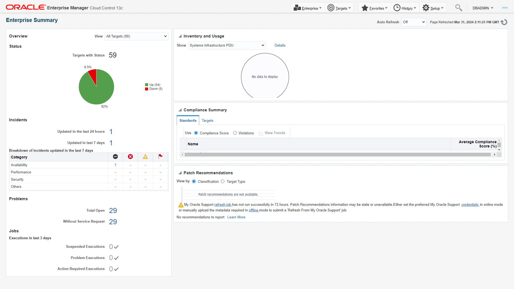

# Assess and Assure Security Posture Across Your Fleet of Databases

## Introduction

Learn how to secure and ensure compliance of your enterprise databases in this workshop. Discover methods to monitor their security, validate configurations, and automate compliance with company, industry, and regulatory standards like CIS and STIG. Explore using Oracle Enterprise Manager to automate inventory and baseline all database targets, including various versions and instances deployed over time.

*Estimated Time*: 60 minutes

You can watch this video below for a quick walk-through of this lab.
[Video Walk-through](videohub:1_vyyju031)

### About key features of Fleet Maintenance Hub in Oracle Enterprise Manager

Starting with Enterprise Manager 13.5 RU16, Enterprise Manager offers a new interface - Fleet Maintenance Hub to ease automated update(patching), and upgrade of your database fleet.
The Fleet Maintenance Hub within Enterprise Manager offers a comprehensive solution for managing database vulnerabilities and patch operations. It streamlines the process by identifying potential security risks, providing patch recommendations, and enabling efficient scheduling and monitoring of patching and upgrade operations. With the ability to manage diverse infrastructures and ensure compliance with patch policies, the Fleet Maintenance Hub serves as a centralized and powerful tool for maintaining the security and stability of database assets.

#### Video Preview
Watch a preview of database patching using Oracle Enterprise Manager Fleet Maintenance:

[](youtube:JlspEvqebHE)

*Note: Interfaces in this video may look different from the interfaces you will see. For updated information, please see steps below.*


### Objectives

In this lab you will perform the following steps:
| Step No. | Feature                                                    | Approx. Time | Details                                                                                                                                                                    | Value Proposition |
|----------------------|------------------------------------------------------------|-------------|----------------------------------------------------------------------------------------------------------------------------------------------------------------------------|-------------------|
| 1                    | Assess patch recommendation and create gold image                             | 5 minutes  | Review the patch recommendations for existing gold images                                                                                                                 | Provides patch recommendations for gold image. Discover the advantages of utilizing patch recommendations, where manual, time-intensive tasks are automated to yield highly precise outcomes.                  |
| 2                    | Secure databases by updating with new gold image | 5 minutes  | Update databases using Gold image | Demonstrate with ease to update a pluggable database                   |
| 3                    | Elevate security posture by auditing for compliance | 5  minutes  | Refresh a Gold Image based on latest patch recommendation | How to steps to create a new version for a gold image. Latest version will be used to update and upgrade process.


### Prerequisites
- A Free Tier, Paid or LiveLabs Oracle Cloud account
- You have completed:
    - Lab: Prepare Setup (*Free-tier* and *Paid Tenants* only)
    - Lab: Environment Setup
    - Lab: Initialize Environment

*Note*: This lab environment is setup with Enterprise Manager Cloud Control Release 13.5 and Database 19.10 as Oracle Management Repository. Workshop activities included in this lab will be executed both locally on the instance using Enterprise Manager Command Line Interface (EMCLI) or Rest APIs, and the Enterprise Manager console (browser)

## Task 1: Execute Patch Recommendation job

To complete a patching cycle, it is important that you know the correct set of patches. If the number of targets( databases and grid infrastructure) is high, then patching becomes a challenging assignment. In this lab, we'll review offline mode of uploading patch recommendations in Enterprise Manager. We will also analyze the job that is automatically executed as a part of patch catalog upload.

1. At the bottom of the Enterprise Summary page, you will find ***Patch Recommendations*** section. This section provides both online and offline mode to upload patch catalog. In the interest of the accuracy of this workbook, we'll select *offline mode*. If you select online mode(clicking credentials link), then today's latest patch recommendation will be shown, which would require new set of patches. This will impact the later part of the workbook. Therefore, in order to complete the lab successfully, we strongly recommend that you upload the pre-downloaded catalog by following the instructions given the workbook.



Click on ***offline*** hyperlink and in the new window choose file by clicking on the button and upload ***em_catalog.zip*** from the location ***/home/oracle/fleet/patching***.


Once the upload is successful, you will find the confirmation at the top section of the page. kindly note that this process has automatically executed a job ***Refresh from My Oracle Support***.


To know more about this job, click on the job name and it will take you to job activity page. This job will be completed with 5 minutes.


## Task 2: Review Image Health Status

In this task, we will review the gold images post completion of patch recommendations job. Launch Fleet Maintenance Hub from Targets->Databases and then Administration-> Fleet Maintenance Hub. From Tile 2, ***Patch Recommendations for Images***, you can review the status of gold images. Here, we see that one of the gold images ***Image Name*** has a green tick mark against its name. This suggests that the image is up-to-date and can be used for patching. There is one more image ***Image Name*** which has a red cross against its name, suggesting that it needs to be refreshed before using it to patch databases.

We see the benefits of using automatic patch recommendations along with Fleet Maintenance Hub. It cuts down all the manual tasks along with scope of error in missing out a recommended patch(es).


## Task 3: Review Patch Recommendations

Lets review the gold image ***Image Name***. From Hub, we see that there are 2 patch recommendations. To understand more about these patches, click on the numeric value and in the new page, we see the details of these patches.


To make this gold image at par with Oracle's recommendation, we need to create a new version, which includes these 2 patches and then mark this version as current. Version marked as current is used to deploy Oracle Homes. To create a new version for this image, click on the message - Create new version and follow the workflow. Ensure that the required patches are uploaded with Enterprise Manager's Software Library. In the interest of the time and to complete the lab, please do not proceed with this step. Once you complete the lab, you may revisit this section and follow the workflow to complete the lab.

## Task 4: Subscribe Targets *[Which has already been implemented]*

Fleet Maintenance is a subscription based solution. To patch/upgrade a target, you need to subscribe that target to the Gold Image. Gold Image represents a software end state. An Enterprise Manager Software Library Gold Image is a software archive created from a patched oracle home uploaded to EM Software Library.

Go to tile 1, Target Subscription and click on Subscribe.


In this task, we will subscribe ***sales.subnet.vcn.oraclevcn.com*** to gold image ***image name***. In this lab, we are subscribing only target, but you can subscribe as many targets as you want.


Once you get the successful message, click on Close button at the top right hand corner. This completes the subscription operation.

## Task 5: Launch operation UI from Hub

In this lab, we will patch (update) Finance PDB - sales.subnet.vcn.oraclevcn.com_FINANCE, currently plugged to CDB sales.subnet.vcn.oraclevcn.com. Our goal is to patch Finance PDB to 19.8, by relocating it to Container database hr.subnet.vcn.oraclevcn.com.

1. From tile 3, ***Target Patch Compliance***, identify the row which has the details of sales.subnet.vcn.oraclevcn.com.

2. Click the Doner icon on that row, and select update.

## Task 6: PDB Patching

1. In this page, we will have pre-select ***Image Name***, ***Target Type*** and ***Operation***.
      
      Where:
      -  Image = We will select ***19cDB-Linux-x64-Apps***. Desired version of Oracle home, which our target database should run after successful completion of operation.
      -  Target Type = we will select ***Pluggable Database***. Desired target type, which can be Grid, RAC or SIDB.
      -  Operation = we will select ***Update***. Name of the operation, which can be update (patch) or upgrade.
      -  Type to filter = Optional, can be left blank. Selection criteria to highlight only those targets which qualify the selection, such as database naming.

      We will select check box for ***sales.subnet.vcn.oraclevcn.com_FINANCE***, as we want to patch it to higher version and select ***Next***.

2. In this page, we will select destination CDB as ***Attach Existing CDB***. Options Software Deployment and Migrate Listener will be greyed out as we already have the desired CDB in place, which is hr.subnet.vcn.oraclevcn.com.

      

      Under Credentials (We have already created these credentials in Enterprise Manager for this workshop. Please choose Named for all the below three options and from the dropdown menu, you can opt for values as suggested below)    
      -  Normal Host Credentials as ***ORACLE***
      -  Privileged Host Credentials as ***ROOT***
      -  SYSDBA Database Credentials as ***SYS_SALES***     

      Under Options, we can use default value /tmp for Working Directory. This is the location where log files will be created.

      Select ***Next***.    

3. We can validate our entries (CDB details, log file location, credentials) provided in previous page and validate the desired operation. Validation acts as a precheck before we submit the main operation. Click on ***Validate***. This will open a new screen with two validation modes - Quick and Full. We can select either of these. Full validation mode submits a deployment procedure. In this case choose ***Quick validation mode***

      

4. Review the validation result.

      

      Incase of any error, we can fix it and choose revalidate. Select ***Close***.

5. ***Submit*** the operation.  We need to provide a name to the task, which will help us to view these tasks under Procedure Activity Page. Lets enter
      ```
      <copy>finance_pdb_patching</copy>
      ```
      
      Here, we can see that we have opted to attach existing CDB and update PDB.

          
      Clicking on Monitor Progress will take us to Procedure Activity Page. Alternate navigation to review the submitted deployment procedures is ***Enterprise >> Provisioning and Patching >> Procedure Activity***  

6. Review the Deployment Procedures (DP).

      

      We can see that one of the DP related to Attach operation has already completed. Lets click on it and find out the steps executed by this DP.

      
      Lets go back to the Procedure Activity page and review the other DP.

7.  We can see that second DP for update operation is running.
      

      Lets click on it and find out the steps executed by this DP.

      

      We can see that attach DP completed successfully.
      

8.  Lets validate the location of ***finance*** pdb. In the upper toolbar, locate the ***Targets*** icon and click the drop-down menu and then select ***Databases***.

      

      We can see that Finance pdb is relocated to a new CDB - hr.subnet.vcn.oraclevcn.com.

## Task 7: Review PDB in Hub

Let go back to Fleet Maintenance Hub, Tile 2. We see that the cigar chart for gold image ***image name*** is green. Similarly, in Tile 3, we see that both gold image and target has a green icon next to it, suggesting that both gold image and target are healthy.


That completes the Automated Database Patching at Scale with Fleet Maintenance HUB.

You may now proceed to the next lab.

## Learn More
  - [Oracle Enterprise Manager](https://www.oracle.com/enterprise-manager/)
  - [Oracle Enterprise Manager Fleet Maintenance](https://www.oracle.com/manageability/enterprise-manager/technologies/fleet-maintenance.html)
  - [Enterprise Manager Documentation Library](https://docs.oracle.com/en/enterprise-manager/index.html)
  - [Database Lifecycle Management](https://docs.oracle.com/en/enterprise-manager/cloud-control/enterprise-manager-cloud-control/13.5/lifecycle.html)
  - [Database Cloud Management](https://docs.oracle.com/en/enterprise-manager/cloud-control/enterprise-manager-cloud-control/13.5/cloud.html)
  - [Oracle Critical Patch Updates, Security Alerts and Bulletins](https://www.oracle.com/in/security-alerts/)

## Acknowledgements
  - **Authors**
    - Romit Acharya, Oracle Enterprise Manager Product Management
    - Shiva Prasad, Oracle Enterprise Manager Product Management
  - **Last Updated By/Date** -Romit Acharya, Oracle Enterprise Manager Product Management, April 2024
