# Assess and Assure Security Posture Across Your Fleet of Databases

## Introduction
Awaiting Abstract

*Estimated Time*: 60 minutes

You can watch this video below for a quick walk-through of this lab.
[Video Walk-through](videohub:1_vyyju031)

### About key features of Fleet Maintenance Hub in Oracle Enterprise Manager

Fleet Maintenance Hub is a
- Powerful one-stop place for customers to get insight into vulnerabilities for database assets and apply patches to affected targets, and secure each of those
- Single pane of glass for vulnerabilities and patch operations


Starting with Enterprise Manager 13.5 RU16, Enterprise Manager offers a new interface - Fleet Maintenance Hub to ease automated update(patching), and upgrade of your database fleet.

Benefits of using the EM Fleet Maintenance Hub include:
- Identifying database assets, which are not subscribed to any gold image. Targets not subscribed to any image are ideal candidates for data breach.
- Patch recommendations for Images. Refresh gold images and apply those to subscribed targets to enhance your security posture.
- A single pane of glass for monitoring and managing the entire update(patching) and upgrade operations
- Ability to schedule/retry/suspend/resume operations
- Patch Oracle Databases across different infrastructure including engineered systems like Oracle ExaCC
- And make sure your targets are always compliant with your patch policies


Lets review various components of the Fleet Maintenance hub.


Fleet Maintenance works on Subscription based model, i.e. to patch a database or grid infrastructure, it should be subscribed to a gold image. Any database/grid, which is not subscribed to any image can not be patched and thus remains susceptible for any data breach. Its recommended that the databases should be patched with latest patch recommendations from Oracle. You can learn more about these recommendations by following Oracle's Security Alerts and Bulletins.

The first tile, ***Target Subscription*** gives you an insight about your weakest database and grid entities as the tile shows the unsubscribed and subscribed databases and grids.  As a DBA, its paramount that unsubscribed assets and subscribed to relevant gold image.

In the middle section, we see bar graphs. These represents no of database and grid infrastructure based on versions.

The Table below the graphs lists out the databases and grid added in Enterprise Manager. You may choose filters to identify any particular database. Subscribe button allows you to subscribe the database or grid to an image. We will cover the subscription part when we update a database in this lab.


Tile 2, ***Patch Recommendations for Images***, lists out the health status of your images with respect to Oracle provided patch recommendations. Lets review the patch recommendation column and understand the actions required by an administrator.

- If you see a green check mark - ✔, it suggests that the gold image has all recommended patches. The image can be used for patching and any databases/grid subscribed to this image will have all the recommended patches post successful completion of update operation.
- If you see a yellow exclamation  mark - , it suggests that a new version in the image has all the recommended patches but it is not marked current. Hence, the updated version can't be used for update operation. Immediate next step for DBA is to mark the latest version as current.
- If you see a red exclamation  mark - , it suggests that current version of the image lacks recommended patches. The number of patches is displayed and if you click on the number, a new slide-out will show you the details of the Oracle recommended patches. Immediate next step for DBA is to create a new version and include all the recommended patches and mark this new version as current.


Tile 3, ***Target Patch Compliance***, list out the databases or grids that are subscribed to a gold image. If the image is not up-to-date,  a warning icon will be shown. Patch level will show following information.
- If the target is on current version,  show "Current"
- If the target is drifted, show 'Drifter'
- Otherwise,  you will see the image version that the target is on


#### Video Preview
Watch a preview of database patching using Oracle Enterprise Manager Fleet Maintenance:

[](youtube:JlspEvqebHE)

*Note: Interfaces in this video may look different from the interfaces you will see. For updated information, please see steps below.*


### Objectives

In this lab you will perform the following steps:
| Step No. | Feature                                                    | Approx. Time | Details                                                                                                                                                                    | Value Proposition |
|----------------------|------------------------------------------------------------|-------------|----------------------------------------------------------------------------------------------------------------------------------------------------------------------------|-------------------|
| 1                    | Execute Patch Recommendation job                             | 5 minutes  | Review the patch recommendations by uploading patch catalog in offline mode                                                                                                                 | Provides patch recommendations for gold image. Discover the advantages of utilizing patch recommendations, where manual, time-intensive tasks are automated to yield highly precise outcomes.                  |
| 2                    | Review Image Health Status | 5 minutes  | Refresh Gold image with patch recommendations | Demonstrate with ease to determine which recommended patches are applicable to gold image.                  |
| 3                    | Refresh Gold Image | 5  minutes  | Refresh a Gold Image based on latest patch recommendation | How to steps to create a new version for a gold image. Latest version will be used to update and upgrade process.
| 4                    | Subscribe Target | 5  minutes  | Subscribe targets to updated gold image for patching | To ensure database assets are fully secure, they should be patched for any patch vulnerabilities. With updated image as source, review how targets can be patched.
| 5                    | Launch Update(Patching) operation | 2  minutes  | Launch the patching operation. | Understand how patching can be initiated and explore the options that Fleet Maintenance porvides.
| 6                    | Patch a Pluggable Database with Fleet Maintenance Maintenance | 5  minutes  | Update(Patch) a PDB using a Gold Image. As part of patching the Pluggable Database, unplug Oracle Pluggable Database in that Container Database and plug it to higher version Container Database. | Demonstrate key capabilities and features of Fleet Maintenance to update(patch) Oracle Pluggable Database.
| 7                    | Review Pluggable Database in Fleet Maintenance Hub | 3  minutes  | Review post patching results in Hub. | Understand how graphs are updated in Fleet Maintenance Hub post patching and the end state that DBA's should aim to attain for their database estate.

### Prerequisites
- A Free Tier, Paid or LiveLabs Oracle Cloud account
- You have completed:
    - Lab: Prepare Setup (*Free-tier* and *Paid Tenants* only)
    - Lab: Environment Setup
    - Lab: Initialize Environment

*Note*: This lab environment is setup with Enterprise Manager Cloud Control Release 13.5 and Database 19.10 as Oracle Management Repository. Workshop activities included in this lab will be executed both locally on the instance using Enterprise Manager Command Line Interface (EMCLI) or Rest APIs, and the Enterprise Manager console (browser)

## Task 1: Execute Patch Recommendation job

To complete a patching cycle, it is important that you know the correct set of patches. If the number of targets( databases and grid infrastructure) is high, then patching becomes a challenging assignment. In this lab, we'll review offline mode of uploading patch recommendations in Enterprise Manager. We will also analyze the job that is automatically executed as a part of patch catalog upload.

1. At the bottom of the Enterprise Summary page, you will find ***Patch Recommendations*** section. This section provides both online and offline mode to upload patch catalog. In the interest of the accuracy of this workbook, we'll select *offline mode*. If you select online mode(clicking credentials link), then today's latest patch recommendation will be shown, which would require new set of patches. This will impact the later part of the workbook. Therefore, in order to complete the lab successfully, we strongly recommend that you upload the pre-downloaded catalog by following the instructions given the workbook.


Click on ***offline*** hyperlink and in the new window choose file by clicking on the button and upload ***em_catalog.zip*** from the location ***/home/oracle/fleet/patching***.


Once the upload is successful, you will find the confirmation at the top section of the page. kindly note that this process has automatically executed a job ***Refresh from My Oracle Support***.


To know more about this job, click on the job name and it will take you to job activity page. This job will be completed with 5 minutes.
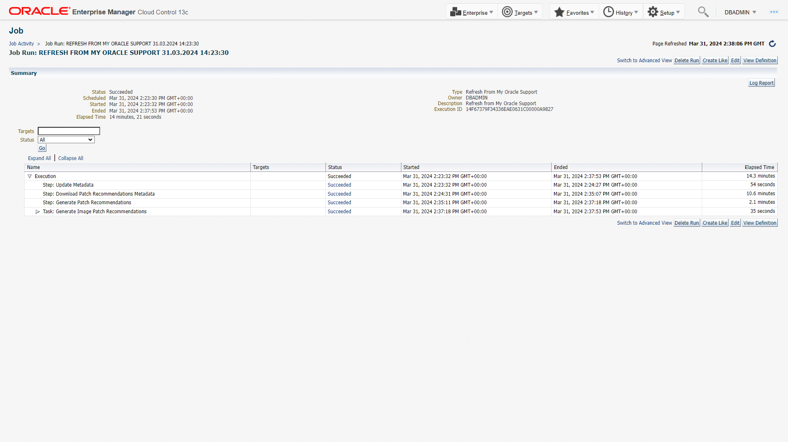

## Task 2: Review Image Health Status

In this task, we will review the gold images post completion of patch recommendations job. Launch Fleet Maintenance Hub from Targets->Databases and then Administration-> Fleet Maintenance Hub. From Tile 2, ***Patch Recommendations for Images***, you can review the status of gold images. Here, we see that one of the gold images ***Image Name*** has a green tick mark against its name. This suggests that the image is up-to-date and can be used for patching. There is one more image ***Image Name*** which has a red cross against its name, suggesting that it needs to be refreshed before using it to patch databases.

We see the benefits of using automatic patch recommendations along with Fleet Maintenance Hub. It cuts down all the manual tasks along with scope of error in missing out a recommended patch(es).


## Task 3: Review Patch Recommendations

Lets review the gold image ***Image Name***. From Hub, we see that there are 2 patch recommendations. To understand more about these patches, click on the numeric value and in the new page, we see the details of these patches.


To make this gold image at par with Oracle's recommendation, we need to create a new version, which includes these 2 patches and then mark this version as current. Version marked as current is used to deploy Oracle Homes. To create a new version for this image, click on the message - Create new version and follow the workflow. Ensure that the required patches are uploaded with Enterprise Manager's Software Library. In the interest of the time and to complete the lab, please do not proceed with this step. Once you complete the lab, you may revisit this section and follow the workflow to complete the lab.

## Task 4: Subscribe Targets *[Which has already been implemented]*

Fleet Maintenance is a subscription based solution. To patch/upgrade a target, you need to subscribe that target to the Gold Image. Gold Image represents a software end state. An Enterprise Manager Software Library Gold Image is a software archive created from a patched oracle home uploaded to EM Software Library.

Go to tile 1, Target Subscription and click on Subscribe.


In this task, we will subscribe ***sales.subnet.vcn.oraclevcn.com*** to gold image ***image name***. In this lab, we are subscribing only target, but you can subscribe as many targets as you want.
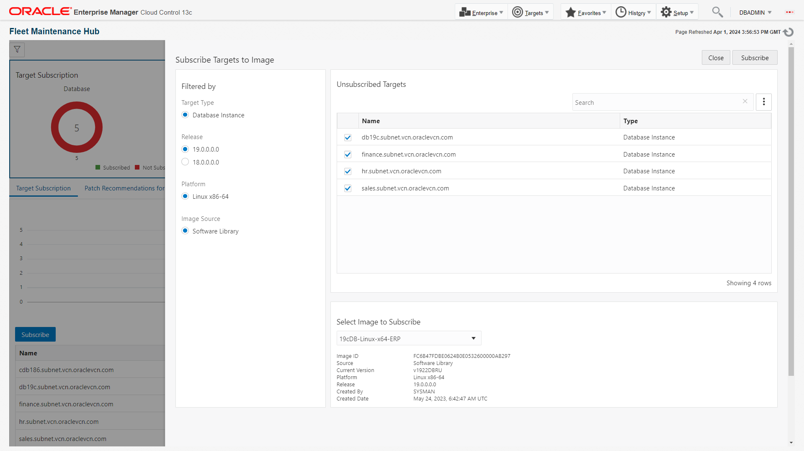

Once you get the successful message, click on Close button at the top right hand corner. This completes the subscription operation.

## Task 5: Launch operation UI from Hub

In this lab, we will patch (update) Finance PDB - sales.subnet.vcn.oraclevcn.com_FINANCE, currently plugged to CDB sales.subnet.vcn.oraclevcn.com. Our goal is to patch Finance PDB to 19.8, by relocating it to Container database hr.subnet.vcn.oraclevcn.com.

1. From tile 3, ***Target Patch Compliance***, identify the row which has the details of sales.subnet.vcn.oraclevcn.com.

2. Click the Doner icon on that row, and select update.

## Task 6: PDB Patching

1. In this page, we will have pre-select ***Image Name***, ***Target Type*** and ***Operation***.
      
      Where:
      -  Image = We will select ***19cDB-Linux-x64-Apps***. Desired version of Oracle home, which our target database should run after successful completion of operation.
      -  Target Type = we will select ***Pluggable Database***. Desired target type, which can be Grid, RAC or SIDB.
      -  Operation = we will select ***Update***. Name of the operation, which can be update (patch) or upgrade.
      -  Type to filter = Optional, can be left blank. Selection criteria to highlight only those targets which qualify the selection, such as database naming.

      We will select check box for ***sales.subnet.vcn.oraclevcn.com_FINANCE***, as we want to patch it to higher version and select ***Next***.

2. In this page, we will select destination CDB as ***Attach Existing CDB***. Options Software Deployment and Migrate Listener will be greyed out as we already have the desired CDB in place, which is hr.subnet.vcn.oraclevcn.com.

      

      Under Credentials (We have already created these credentials in Enterprise Manager for this workshop. Please choose Named for all the below three options and from the dropdown menu, you can opt for values as suggested below)    
      -  Normal Host Credentials as ***ORACLE***
      -  Privileged Host Credentials as ***ROOT***
      -  SYSDBA Database Credentials as ***SYS_SALES***     

      Under Options, we can use default value /tmp for Working Directory. This is the location where log files will be created.

      Select ***Next***.    

3. We can validate our entries (CDB details, log file location, credentials) provided in previous page and validate the desired operation. Validation acts as a precheck before we submit the main operation. Click on ***Validate***. This will open a new screen with two validation modes - Quick and Full. We can select either of these. Full validation mode submits a deployment procedure. In this case choose ***Quick validation mode***

      

4. Review the validation result.

      

      Incase of any error, we can fix it and choose revalidate. Select ***Close***.

5. ***Submit*** the operation.  We need to provide a name to the task, which will help us to view these tasks under Procedure Activity Page. Lets enter
      ```
      <copy>finance_pdb_patching</copy>
      ```
      
      Here, we can see that we have opted to attach existing CDB and update PDB.

          
      Clicking on Monitor Progress will take us to Procedure Activity Page. Alternate navigation to review the submitted deployment procedures is ***Enterprise >> Provisioning and Patching >> Procedure Activity***  

6. Review the Deployment Procedures (DP).

      

      We can see that one of the DP related to Attach operation has already completed. Lets click on it and find out the steps executed by this DP.

      
      Lets go back to the Procedure Activity page and review the other DP.

7.  We can see that second DP for update operation is running.
      

      Lets click on it and find out the steps executed by this DP.

      

      We can see that attach DP completed successfully.
      

8.  Lets validate the location of ***finance*** pdb. In the upper toolbar, locate the ***Targets*** icon and click the drop-down menu and then select ***Databases***.

      

      We can see that Finance pdb is relocated to a new CDB - hr.subnet.vcn.oraclevcn.com.

## Task 7: Review PDB in Hub

Let go back to Fleet Maintenance Hub, Tile 2. We see that the cigar chart for gold image ***image name*** is green. Similarly, in Tile 3, we see that both gold image and target has a green icon next to it, suggesting that both gold image and target are healthy.

## Task 8: Compliance Management for Pluggable Database

CIS Benchmark from Center of Internet Security:
The Center for Internet Security (CIS) is a set of Industry standards for IT systems and databases. CIS benchmark provides the baseline configurations to ensure oracle database compliance with CIS standards. A compliance standard is a collection of checks or rules that follow broadly accepted best practices. It is the Cloud Control representation of a compliance control that must be tested against some set of IT infrastructure to determine if the control is being followed. This ensures that IT infrastructure, applications, business services, and processes are organized, configured, managed, and monitored properly. A compliance standard evaluation can provide information related to platform compatibility, known issues affecting other customers with similar configurations, security vulnerabilities, patch recommendations, and more. A compliance standard is also used to define where to perform real-time change monitoring.


In this lab, you will get hands-on experience is using *Oracle 19c Database CIS V1.1.0 - Level 1 - RDBMS using Unified Auditing for Oracle Pluggable Database* to secure configuration of provisioned database.

1. From the Enterprise menu, select **Compliance, then select Library**  to get started.

    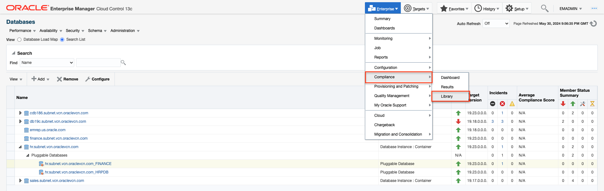


2. Click the **Compliance Standards** tab.

    In the Compliance Standard section type  "Oracle 19c Database CIS" as the key word and
    Applicable To section Drop down select **Pluggable Database** click search.

    

    Select the row **Oracle 19c Database CIS V1.1.0 - Level 1 - RDBMS using Unified Auditing for Oracle Pluggable Database**, and then Click the **Associate Targets** tab.

    

3.  Click Add and choose the row with your PDB you wish to associate. Target name section type  **_FINANCE**  click search.  

    

    **hr.subnet.vcn.oraclevcn.com_FINANCE** appears, click **Select**.

    

4. Verify the PDB name is added and Click **OK**.

    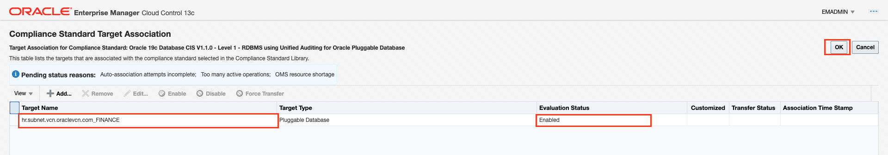

    In the Save Association dialog box, click **Yes**.

    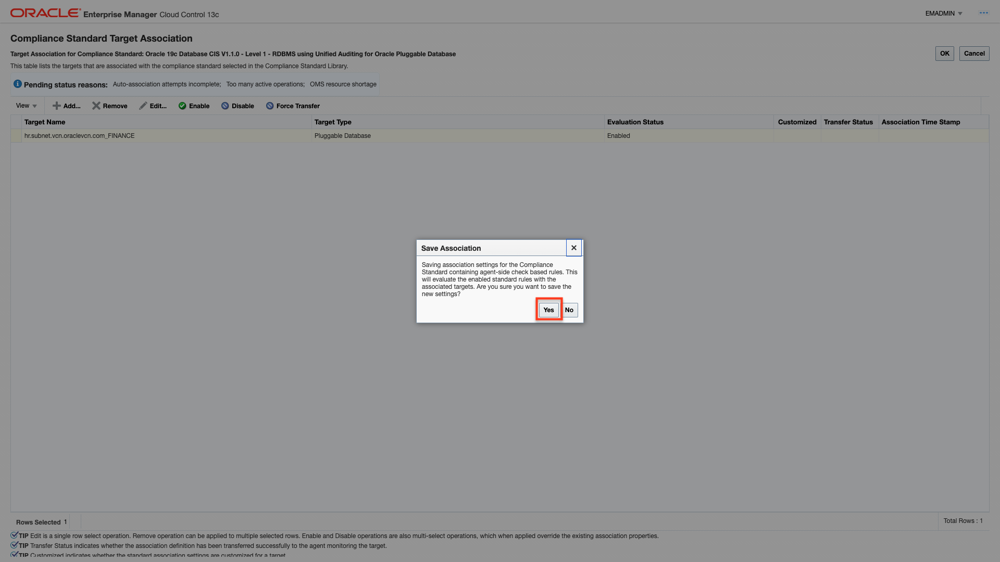

5. Click **OK** on the Information pop-up window.

    

6. Now you will navigate to ***Enterprise >> Compliance >> Results***.

    *Processing and displaying the results on the Compliance Results Page will take approximately 4 minutes to complete.*

    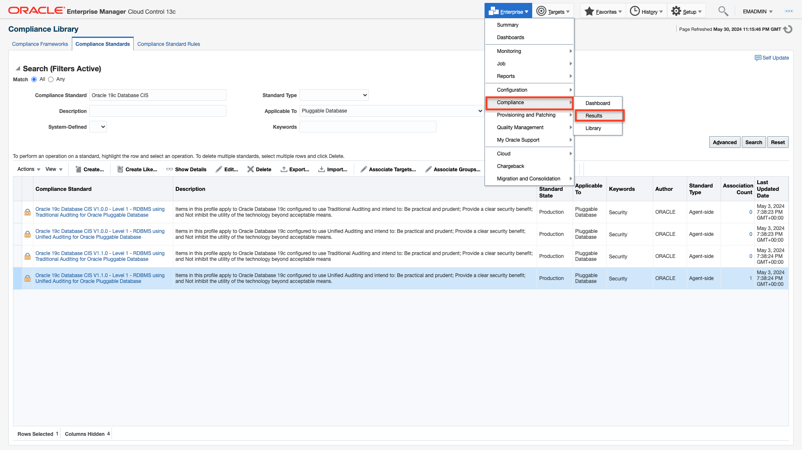

7. Click on **Oracle 19c Database CIS V1.1.0 - Level 1 - RDBMS using Unified Auditing for Oracle Pluggable Database** under Compliance Standards.

    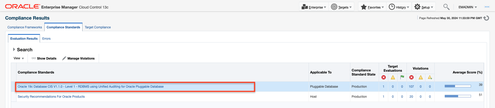

8.  You will see compliance results about the target with critical violations against the selected standard with multiple violations along with it's score along with evaluation date.

    

    Total violations you will see details each rule , target name, applicable to target type pluggable and severity of the rule under violation tab.

    

9.  You will see failed CIS standard recommendations rules for each main category of CIS Standard.  

      

10. Each violation can be explored by clicking on **Violations number**.

      

11. You will see unauthorized  grantee 'IX' has DBA role

    ***The Oracle database "DBA" role is the powerful database administrator role provided for the allocation of administrative privileges to make changes configuration changes, access to sensitive information. This unauthorized grantee 'IX' should not have that role.***

      

      Click **Close**.

12. Click on **Rule Details** tab you will see details like rule type, severity, compliance rule state, description, rationale and recommendation for the violation remediation.

      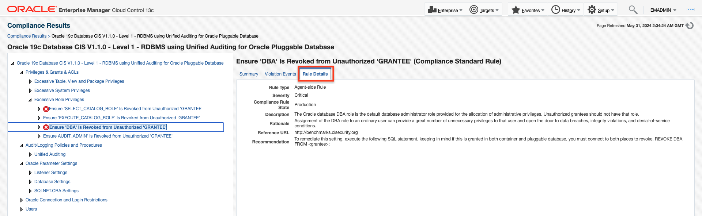

13. Click on **Violation Events** tab gives you the incident attributes information about the violated rule.

      

      Click on **table row section**.

14. You will see Event details about violated rule information, violation details and also provides you an option of Guided resolution about Recommendations

      

      Click on **Corrective actions**.

      You will see Corrective Actions pop-up window appears.

      

      Select **CORRECTIVE_ACTION_REVOKE_DBA_ROLE_PRIVILEGE** row.

15. You will see **Database Credentials** and **Host Credentials**.

      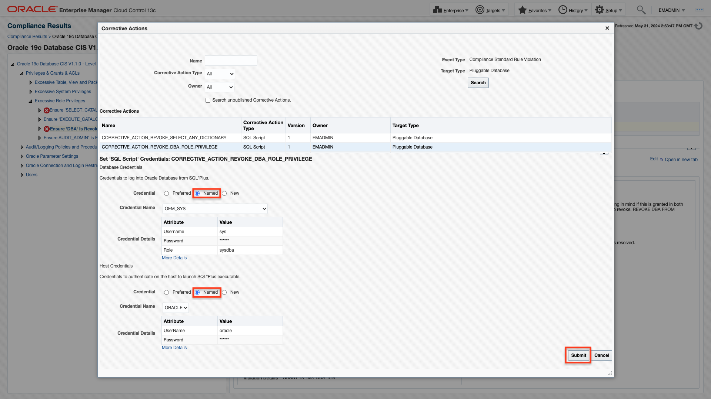

      Select **Named** for both credentials, Click **Submit**.

16. You will see pop-window **Corrective action**

      

      Click to view execution details.  

17. You will see corrective action revoke dba role job completed successfully.

    

18. Now, you will navigate to ***Targets >> Databases***

    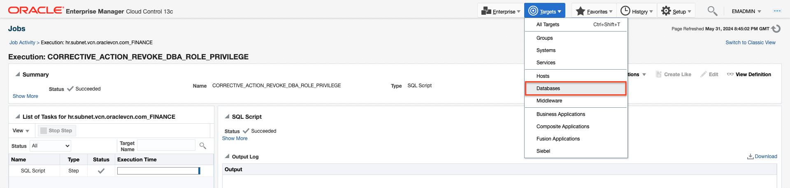

19. You will select  **hr.subnet.vcn.oraclevcn.com_FINANCE** on Name section

    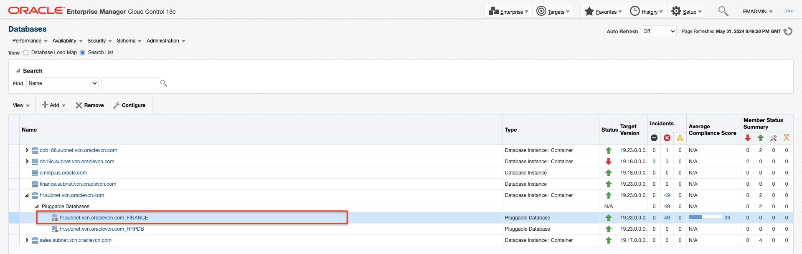

    Click on selected pluggable db, you will navigated to pluggable database page

    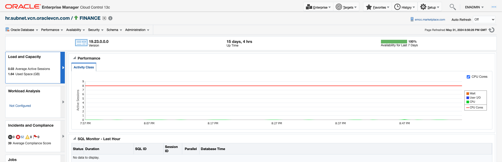

20. Click on ***Oracle Database >> Configuration >> Latest***

    

    You will see Latest Configuration page

    

    Click **Refresh**

21.  **Refresh Processing**, It will take about 3 minutes.

    

22.   You will navigate to ***Enterprise >> Compliance >> Results.***

    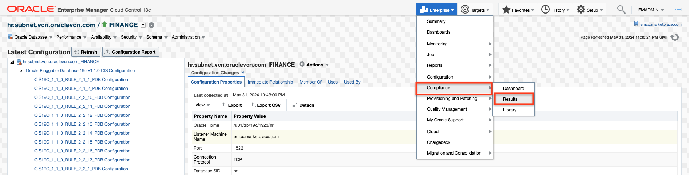

23. You will see **Compliance Results, number of violations are reduced from 107 to 106.**

    

    Click on **Compliance Standards** section

24. You will see **Compliance standards Results in detail see the violation is "0", which Ensure 'DBA' Is Revoked from Unauthorized 'GRANTEE' (Compliance Standard Rule) has been successfully remediated through automated corrective action.**

    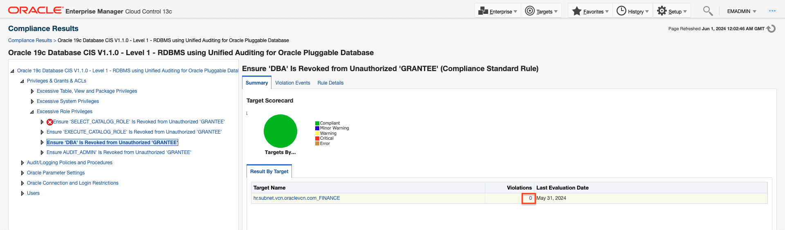


    Click on selected  **hr.subnet.vcn.oraclevcn.com_FINANCE**    

That completes the Automated Database Patching at Scale with Fleet Maintenance HUB.

You may now proceed to the next lab.

## Learn More
  - [Oracle Enterprise Manager](https://www.oracle.com/enterprise-manager/)
  - [Oracle Enterprise Manager Fleet Maintenance](https://www.oracle.com/manageability/enterprise-manager/technologies/fleet-maintenance.html)
  - [Enterprise Manager Documentation Library](https://docs.oracle.com/en/enterprise-manager/index.html)
  - [Database Lifecycle Management](https://docs.oracle.com/en/enterprise-manager/cloud-control/enterprise-manager-cloud-control/13.5/lifecycle.html)
  - [Database Cloud Management](https://docs.oracle.com/en/enterprise-manager/cloud-control/enterprise-manager-cloud-control/13.5/cloud.html)
  - [Oracle Critical Patch Updates, Security Alerts and Bulletins](https://www.oracle.com/in/security-alerts/)

## Acknowledgements
  - **Authors**
    - Romit Acharya, Oracle Enterprise Manager Product Management
    - Shiva Prasad, Oracle Enterprise Manager Product Management
  - **Last Updated By/Date** -Romit Acharya, Oracle Enterprise Manager Product Management, April 2024
