# Database Performance Management: Find, Fix, Validate

## Introduction

The goal of this lab is to become familiar with on-premise and Oracle Cloud Database performance management (Virtual Machine/Bare Metal/Exadata Cloud Service) capabilities using Oracle Enterprise Manager Cloud Control 13c.

*Estimated Lab Time:* 45 minutes

### About Database Performance Management
Performance Hub is a single pane of glass view of database performance with access to Active Session History (ASH) Analytics, Real-time SQL Monitoring and SQL Tuning together. In this lab you will get familiar with Performance hub, Real-time database operation monitoring, SQL Performance Analyzer, etc.  

### Objectives

In this lab you will learn:


| **Step No.** | **Feature**                                   | **Approx. Time** | **Details**                                                                                                                                                                                                                    | **Value proposition**                                                                                                                                                                                                                                                                                                                                                                                                                                                                                                                                                       |
|--------|-----------------------------------------------|------------------|--------------------------------------------------------------------------------------------------------------------------------------------------------------------------------------------------------------------------------|-----------------------------------------------------------------------------------------------------------------------------------------------------------------------------------------------------------------------------------------------------------------------------------------------------------------------------------------------------------------------------------------------------------------------------------------------------------------------------------------------------------------------------------------------------------------------------|
| **1**  | Performance Hub                               | 15 minutes       | Oracle Enterprise Manager 13c includes a new Jet based unified Performance Hub Jet interface for performance monitoring.                                                                                           | Performance Hub is a single pane of glass view of database performance with access to Active Session History (ASH) Analytics, Real-time SQL Monitoring and SQL Tuning together. The time picker allows the administrator to switch between Real-Time and Historical views of database performance.                                                                                                                                                                                                                                                                      |
| **2**  | Real-time Database Operation Monitoring       | 10 minutes       | Real-Time Database Operations Monitoring, introduced in Oracle Database 12c, enables an administrator to monitor long running database tasks as a composite business operation.                                                | Developers and DBAs can define business operations for monitoring by explicitly specifying the start and end of an operation or implicitly with tags that identify the operation.                                                                                                                                                                                                                                                                                                                                                                                              |
| **3**  | Tuning a SQL in a Pluggable Database (PDB)                         | 10 minutes       | In this activity see how a pluggable database administrator can tune queries in a PDB.                                                                                                                                        | The DBA for the PDB will not have access to the Container so their view is restricted to the queries running in the PDB assigned to them. This activity identifies a Top SQL in a PDB and then tunes it using SQL Tuning Advisor.                                                                                                                                                                                                                                                                                                                                  |
| **4**  | SQL Performance Analyzer        | 15 minutes       | The objective of this activity is to demonstrate and use the SQL Performance Analyzer functionality of Real Application Testing capabilities using Enterprise Manager UI.                                                 | **Scenario:**    You've been asked to validate SQL performance before upgrade Database from 18.3 to 19.10. How each SQLs in the application's workload (Sales History) performs in new 19.10 upgrade. Sales History workload SQLs gathered in SQL Tuning Set SHSTS.                                                                                                                                                                                                                                                                                                                                                                                                                                                                                                             |
| **5**  | Database Workload Replay - Capture Workload                          | 10 minutes       | The objective of this activity is to demonstrate how to performs  Workload Capture for Real Application Testing   Database Replay.                                                                                                         | **Scenario:**    You've been asked to Capture of  Database Workload before upgrade Database from 18.3 to 19.10 for Database Replay. The Workload simulated using SwingBench for 40 Concurrent Database Users.  |
| **6**  | Database Workload Replay - API, import to Enterprise Manager                     | 15 minutes       | The objective of this activity is to demonstrate and use the Database Replay functionality of Real Application Testing capabilities using API PLSQL mode and import Capture and Replay into Enterprise Manager.                                                                                                           | **Scenario:**    You've been asked to validate Database performance before upgrade Database from 18.3 to 19.10. How the application's workload (Order Entry) performs in new 19.3 upgrade. Database Replay enables realistic testing of system changes by essentially re-creating the production workload environment on a test system.                                                                                                                                                                                                                                                                                                                                 |


### Prerequisites
- A Free Tier, Paid or LiveLabs Oracle Cloud account
- You have completed:
    - Lab: Prepare Setup (*Free-tier* and *Paid Tenants* only)
    - Lab: Environment Setup
    - Lab: Initialize Environment

*Note*: This lab environment is setup with Enterprise Manager Cloud Control Release 13.5 and Database 19.10 as Oracle Management Repository.

## Task 1: Prepare Database
Select between *Task 1A* and *Task 1B*

## Task 1A: Prepare Database Using EM Console

1. On the Browser *Chrome/Firefox* window on the right preloaded with *Enterprise Manager*, click on the *Username* field and select the saved credentials to login. These credentials have been saved within *Chrome/Firefox* and are provided below for reference

    ```
    Username: <copy>sysman</copy>
    ```

    ```
    Password: <copy>welcome1</copy>
    ```

    

2. From the upper left, navigate from **Enterprise** to **Job** to then **Library**

    

3. Locate and select the job name **1-DB\_LAB\_START**, and Click the Submit  button.

    

4. Leave default values in the fields and then click the Submit button in the upper right hand of your window.

    

5. The workload has started and will take a few minutes to ramp up.

    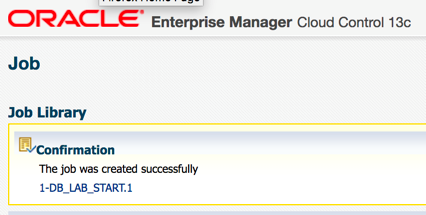

## Task 1B: Prepare database Using the terminal

1. Instead of *Task 1A* above, you may run the block below from the terminal as user *oracle*

    

    ```
    <copy>
    cd scripts
    source SALESENV
    . ./1-db_lab_start.sh</copy>
    ```

    

## Task 2: Performance Hub

1. Click on the Targets, then Databases. You will be directed to the list of Databases in EM.

    

2. Here you will notice different databases listed, such as SALES, HR etc. We will work the sales container database. Select the **Sales** database from the list and this will take you to the DB home page for this database.

    

    

3.  Click on the **Containers** tab. It is located at the upper right-hand corner of the page, underneath the Performance tile. This will show the list of pluggable databases in the CDB and their activity.

    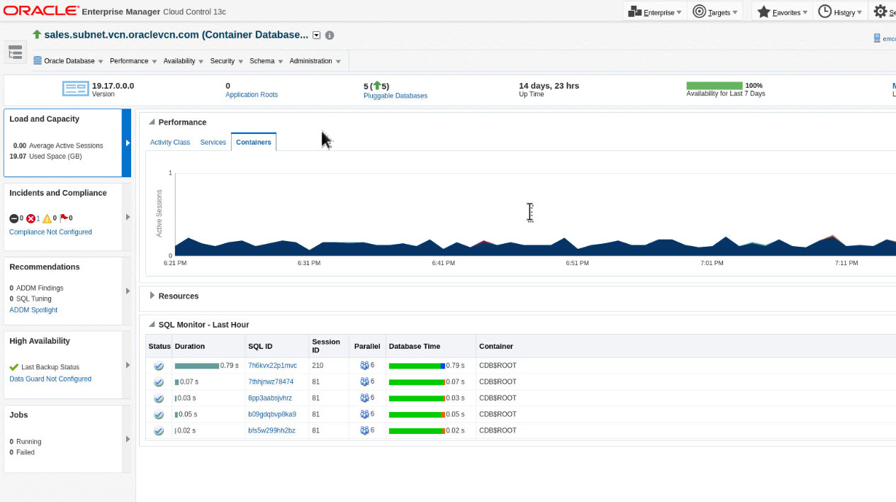

4.  Notice that the PSALES database is the busiest. We focus our attention to this PDB. Let us now navigate to Performance Hub. Select Performance Hub from the Performance Menu and Click on ASH Analytics and use the sales\_system credential name from the database login screen.

    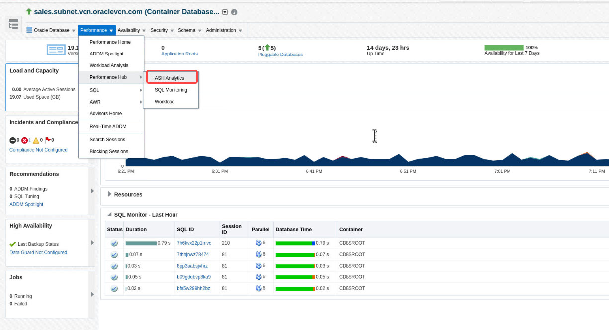

    

    

5. Make sure to slide the time picker on an area of high usage (e.g., CPU, IO or Waits). Notice how the corresponding selected time window also changes in the summary section. You can also resize the slider to entirely cover the time period of your interest.

    Notice the graph at bottom, it is providing more detailed view of the time window you selected. By Default the wait class dimension is selected. On the right hand side of the graph you have a list of wait classes for the time window you selected (blue for user I/O, green for CPU etc.). Notice how the color changes if you hover over either the menu or the graph to highlight the particular wait class.

    Wait class isn’t the only dimension you can drill into the performance issue by. Let us say you wanted to identify the SQL that was causing the biggest performance impact. You can do that by Clicking the drop down list and changing the top dimension from wait class to SQL ID.

6. Select the SQL ID dimension from the list of available dimensions (Under Top Dimensions) using the dropdown box that is currently displaying Wait Class. Top Dimensions SQL ID

    

7. Hover your mouse on top of the SQL (one at the bottom) and you will be able to see how much activity is consumed by this SQL. Now using the same list of filters select the PDB dimension. Session Identifiers PDB.

    

8. What do you see? The chart changes to activity by the different pluggable databases created in this Container database.Click on the **PSALES** pluggable database on the list to add it to the filter by list and drilldown to activity by this PDB on the same page.

    

    

9. Click on the SQL Monitoring Tab

      

10. You can see all the executed SQL during that time along with different attributes like ‘user’,’Start’,’Ended’ etc. The test next to the \@ sign indicates the name of the PDB. Click on any SQL of your choice (e.g. 6kd5jj7kr8swv).

    

11. It will navigate you to show the details of this particular query. You can see the plan, parallelism and activity of the query. **Plan Statistics** tab is selected by default. You can see the plan of this query in graphical mode. In some cases, the Monitored SQL may have aged out and no rows are displayed, in this case try using the time-picker and pick last 24 hrs. time period to identify the historical SQL that was monitored.

12. Select **Parallel** tab. This will give details about parallel coordinator and parallel slaves.

13. Click on the **SQL Text** tab. You can see the query text which has been executed.

14. Click on the **activity** tab to understand about the activity breakdown for this SQL.

16. Click on **Save Report** button on the top right corner of the page. This will help you to save this monitored execution in “.html” format, which can be used to share or to diagnose offline.

## Task 3: Real-Time Database Operations Monitoring

1. From the terminal session on your remote desktop, run as user *oracle*

    ```
    <copy>
    source SALESENV
    cd scripts/load/frame/queries/awrv</copy>
    ```

2. Using SQLPlus connect to the sh2 account. Open the file (!vi DBOP.sql) from the SQL prompt and then review the content of the file. At the beginning of the file you will notice how we have tagged the operation with dbms\_sql\_monitor.begin\_operation and ended it with dbms\_sql\_monitor.end\_operation.
Now execute the file \@DBOP.sql

    ```
    <copy>sqlplus sh2/sh2@psales
    @DBOP.sql</copy>
    ```

3. You should already be logged on to Enterprise Manager. If you are not, please follow the instructions detailed earlier. Select the **Monitored SQL** tab.

4. Review the list of currently executing SQLs that are visible. Click on the DBOP\_DEMO name. This will open the DBOP named DBOP\_DEMO.

    Note: You may have to scroll down or select “Database operations” from the type dropdown.

    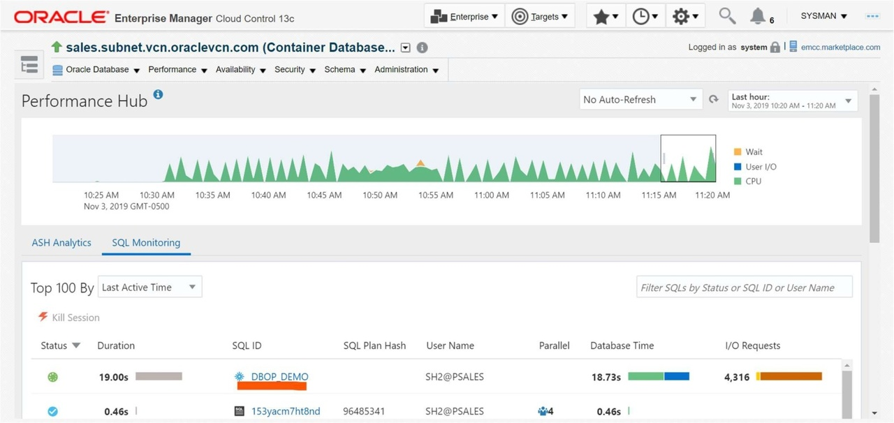

5. Review the details of the Database Operations.

    

6.  Click on the **Metric** tab. You will see all the activity for this operation.

    

## Task 4: Tuning a SQL in a PDB

1. Log into an Enterprise Manager VM (using provided IP). The Enterprise Manager credentials are “sysman/welcome1”.

    

2.  Once logged into Enterprise Manager, Select **Targets**, then **Databases** . Click on the **expand** icon on the left and click on the database **sales.subnet.vcn.oraclevcn.com**

    

3.  You should now see the Database Home page.

    

4.  From the Performance Menu Click on **Performance Hub**, then **ASH Analytics**.

    

5.  In the bottom left of the page, Click on the **activity bar** for the SQL showing highest activity.

    

6.  Now schedule the SQL Tuning Advisor by Clicking on the **Tune SQL** button.

    

7.  Accept the default and Submit the **SQL tuning Job**.

    

    

8.  Once the job completes. You should see the recommendations for either creating a profile or an index.

    

9.  Implement the SQL Profile recommendation. SQL Profiles are a great way of tuning a SQL without creating any new objects or making any code changes.

10. At this point let us now turn off the load: Change directory to scripts and execute the script ***1-db\_lab\_stop.sh*** as shown below

    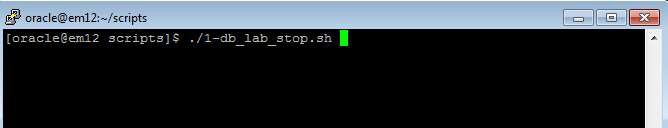

    >Alternatively you can use the Enterprise Manager Job Scheduler capability to stop the job.

11. Navigate to Enterprise, then Job, then to Library

    

12. Select the job *1-DB\_LAB\_STOP*

    

13. And then Submit the job

    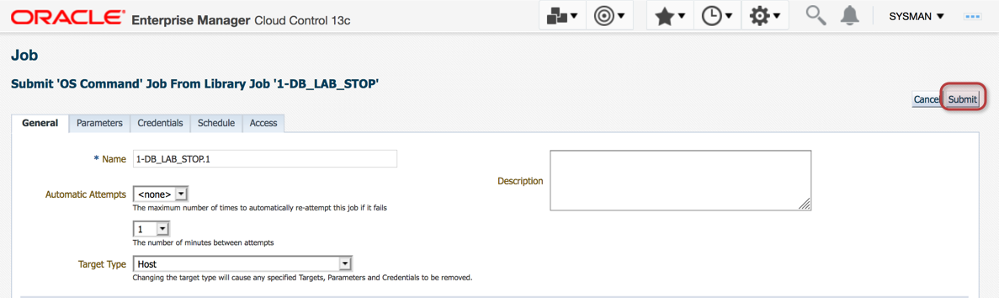

14. When the job is completed, the workload stops

    

<!-- This concludes the Database Performance Management lab activity. You can now move on to Real Application Testing lab activity. -->

## Task 5: SQL Performance Analyzer

1.  Log into an Enterprise Manager VM. The Enterprise Manager credentials are “sysman/welcome1”. **Click** on the Targets, then Databases. You will be directed to the list of Databases in EM.

    

    


2. Shutdown Databases cdb186.subnet.vcn.oraclevcn.com, finance.subnet.vcn.oraclevcn.com, hr.subnet.vcn.oraclevcn.com.

  

  

  

  

  

3. In this Lab, we use Databases db19c.subnet.vcn.oraclevcn.com, emrep.us.oracle.com, sales.subnet.vcn.oraclevcn.com. Check if Database db19c.subnet.vcn.oraclevcn.com is open and available. If it is down, please start Database db19c.subnet.vcn.oraclevcn.com. Open Pluggable Databases db19c.subnet.vcn.oraclevcn.com\_OLTP\_CL2, db19c.subnet.vcn.oraclevcn.com\_PSAL\_CL1.

   

   

   

   

   

   

4. **Click** on the Targets, then Databases. You will be directed to the list of Databases in EM.

    

5. Here you will notice different databases listed, such as SALES, HR etc., we will work in pluggable database psales inside the sales container database. **Expand** the Sales database from the list, and **Click** sales.subnet.vcn.oraclevcn.com_PSALES

    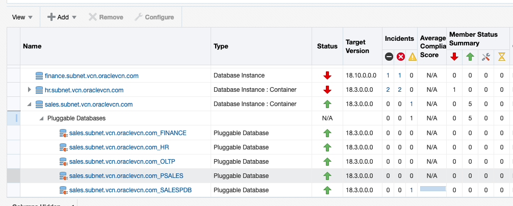

6. Go to SQL Tuning Set page by **Click** on Performance menu -> SQL -> SQL Tuning Set. Check "Named" on Credential and use SYS_SALES Credential Name from the database login screen

    

    

7. Pick SQL Tuning Set 'shsts1' and **Click** Copy To A Database button

    

8. Enter Copy SQL Tuning Set

       - Pick **db19c.subnet.vcn.oraclevcn.com\_PSAL\_CL1** for Destination Database
       - Pick **STSCOPY** for Directory Object
       - Pick **ORACLE** for both Source and Destination Credentials and **SYS_SALES** for Destination Database Credential
       - Click **Ok**

    

    

    

   View on job page to check status of the Copy STS job. It can take 1.5-2 minutes.

9. After the COPY STS job successfully finished, **Click** Target - Database

       - **Click** db19c.subnet.vcn.oraclevcn.com - PDB **PSAL_CLone1**
       - **Click** on menu Performance - SQL - SQL Performance Analyzer

    

    

    

10. In SPA (SQL Performance Analyzer) page, **Click** Guided Workflow

    

11. Step 1 Create SPA Task  based on STS

    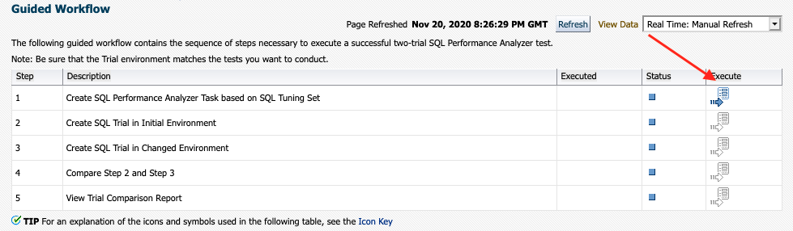

       - Enter Name for the Task Name : **SHSPATASK**
       - Enter Description : **Sales History SPA Task**
       - Pick STS : **SHSTS1**

    

       - **Click** Create and back to **Guided Workflow** page

12. Step 2 Create SQL Trial in Initial Environment

    

       - Enter SQL Trial Name : **SHSTS\_SQL\_TRIAL\_18C**
       - Enter Description : Sales History 18C run
       - Creation Method: **Execute SQLs Remotely**

    

       - Default per-SQL Time Limit
       - Click Create Database Link button

    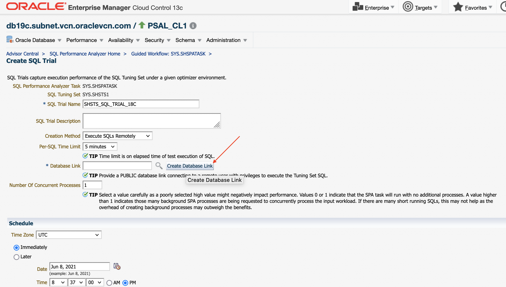

       - Enter Name :  **PSALES.SUBNET.VCN.ORACLEVCN.COM**
       - Enter Net Service Name :
      ```
      <copy>"(DESCRIPTION = (ADDRESS = (PROTOCOL = TCP)(HOST = emcc.marketplace.com)(PORT = 1523)) (CONNECT_DATA = (SERVER = DEDICATED) (SERVICE_NAME = psales.subnet.vcn.oraclevcn.com)))"</copy>
      ```
         (need to include double quote "")
       - Click on Public - This database link is available to all users
       - Pick Fixed User
       - Enter Username : **SYSTEM**
       - Password : **welcome1**
       - Click Ok

    

       - Click Search button then pick Database Link  **PSALES.SUBNET.VCN.ORACLEVCN.COM**

    

       - **Check** Trial environment established
       - **Click** Submit

13. Back to SQL Performance Analyzer Home page, to check the status of the task run.

    

       - Continue the Workflow **Click** SHSPATASK

    

14. Continue Step 3 in SPA Guided Workflow **SHSPATASK**, and create SQL Trial in Changed Environment

    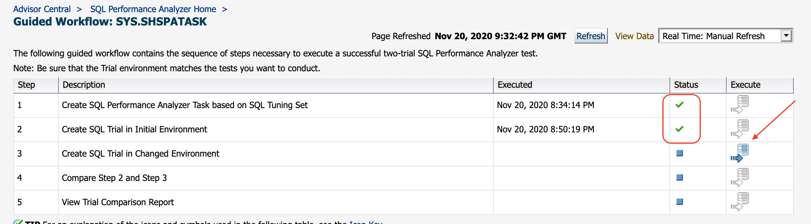

       - Enter SQL Trial Name : **SHSTS\_SQL\_TRIAL\_19C**
       - Enter Description : Sales History 19C Run
       - Creation Method: **Execute SQLs Locally**
       - Default per-SQL Time Limit
       - **Check** Trial environment established
       - **Click** Submit

    

15. Back to SQL Performance Analyzer Home page, to check the status of the task run.

    

       - Continue the Workflow **Click** SHSPATASK

16. Continue Step 4 in SPA Guided Workflow **SHSPATASK**, and compare Step 2 and Step 3

    

       - Trial 1 Name : **SHSTS\_SQL\_TRIAL\_18C**
       - Trial 2 Name : **SHSTS\_SQL\_TRIAL\_19C**
       - Comparison Metric : **Buffer Get**
       - **Click** Submit

    

17. Continue Step 5 in SPA Guided Workflow **SHSPATASK**, View Trial Comparison report

    

    

       - **Click** one of the SQLID to check the detail of the SQL comparison

    


## Task 6: Database Workload Replay - Capture Workload

1. Log into an Enterprise Manager VM (using provided IP). The Enterprise Manager credentials are “sysman/welcome1”.

      

2. Go to Enterprise - Job - Library

      

3. Pick Job Name **START\_SWINGBENCH\_LOAD** then click Submit

      

4. Click Submit, Swingbench workload starts with 40 concurrent users to Pluggable Database OLTP in **sales.subnet.vcn.oraclevcn.com**

     

5. Go to Enterprise menu - Quality Management - Database Replay

     

6. Click Create button in Capture Workloads Tab

     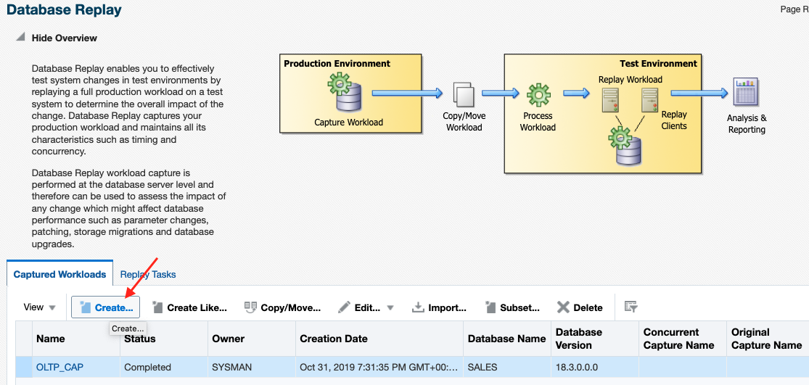

7. Check both Capture Prerequisites, then Click Next

       

8. Click Add in Capture Databases list

       

9. Enter Capture Name **soecap**

     

10. Select Target Database with Target Name **sales.subnet.vcn.oraclevcn.com**

     

11. Pick OEM_SYS credential for Database Credential, and check Preferred for Database Host Credential, and click Browse for Database Capture Storage location

     

12. Go to Path **/home/oracle/scripts** and pick folder **CAPTURE**

     

    Click Ok then Next

     

     


13. Use Default Option

       - Check on Capture SQL statements into a SQL Tuning Set during workload capture
       - PL/SQL capture mode : Top Level
       - Workload Filters : Exclusion Filter mode
       - Excluded Sessions : Program OMS and Module emagent%

         

    Click Next

14. Create Capture: Schedule, Start Immediately; Duration : 5 minutes
    AWR export Schedule to run after capture Completed

     

    Click Next

15. Create Capture: Review, Click Submit

     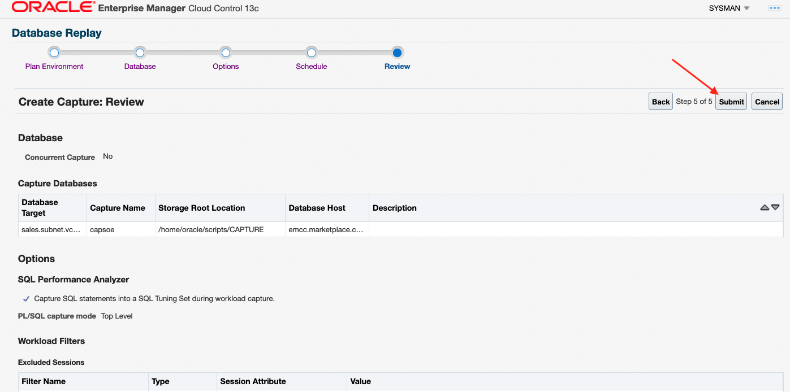

    Click Submit

16. In Database Replay landing page, click on **soecap** ih Capture Workload

     

     

17. After 5 minutes, DB Capture finished (Succeeded)

     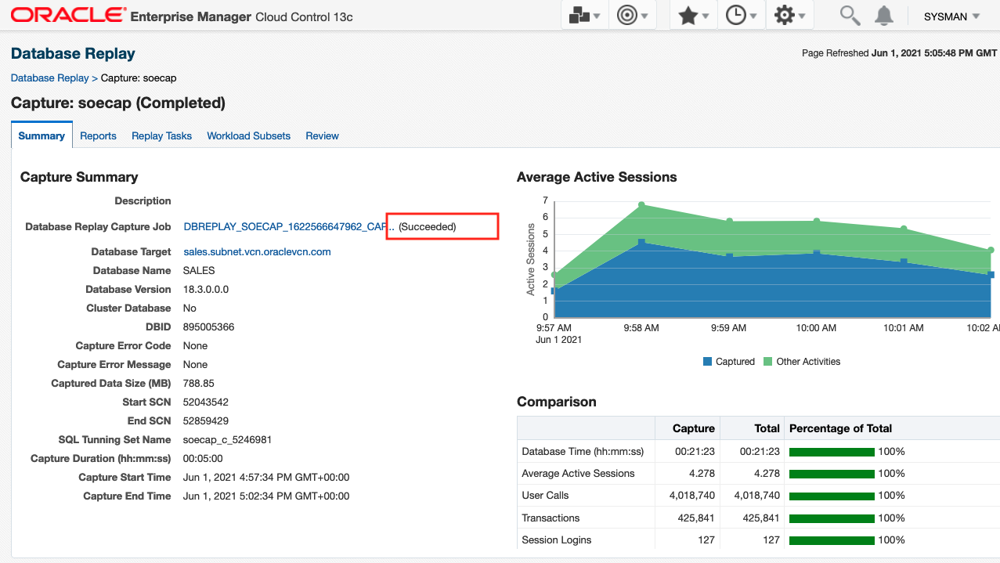

18. Stop Swingbench Workload. Go to Enterprise - Job - library

     

19. Pick STOP\_SWINGBENCH\_WORKLOAD, click Submit

     

    Click Submit in the Job page

     

20. Review Capture Report. Go to Enterprise - Quality Management - DB Replay

     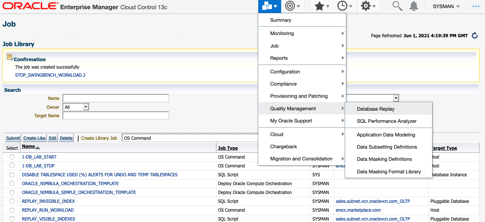

21. In Workload Cature tab, select **soecap**

     

22. Click tab **Reports**

     

23. Click **View** button

     

24. Pop up window appear to show Capture's Report

    

    

## Task 7: Database Workload Replay - API

### Login to Host using SSH Key based authentication
In this lab, we are going to use a pre-captured workload of Sales History. The workload located in directory **/home/oracle/scripts/CAPTURE/lab4con/lab4SH**

1. Preprocess workload from API command

   **Terminal Session 1**

        - Open new Terminal Session in the Desktop
        - Set Environment variables for sales database **. 19c.env**
        - Run Sqlplus connect to Database using sysdba
        - Create DB Directory Object LAB3SOE
        - Pre-process the capture in 19C Database

    ``` sql
    . /home/oracle/19c.env
    sqlplus '/ as sysdba'
    SQL> create directory lab4sh as '/home/oracle/scripts/CAPTURE/lab4con/lab4SH';
    SQL> exec dbms_workload_replay.process_capture('LAB4SH')
    ```

      

      

2. From the same sqlplus session run below command to Initialize the Replay

    ```` sql
    SQL> exec dbms_workload_replay.INITIALIZE_REPLAY (replay_name => 'lab4rep', replay_dir => 'LAB4SH');
    ````

3. Run below PLSQL anonymous block to remap the connections for replay

    ```
    <copy>begin
    for i in (select conn_id, capture_conn from dba_workload_connection_map m, dba_workload_replays r where replay_id = id and name = 'lab4rep')
    loop
      dbms_workload_replay.remap_connection(i.conn_id, '(DESCRIPTION = (ADDRESS = (PROTOCOL = TCP)(HOST = emcc.marketplace.com)(PORT = 1521))(CONNECT_DATA = (SERVER = DEDICATED)(SERVICE_NAME = psal_cl1.subnet.vcn.oraclevcn.com)))');
     end loop;
     commit;
      end;
      / </copy>
      ```
      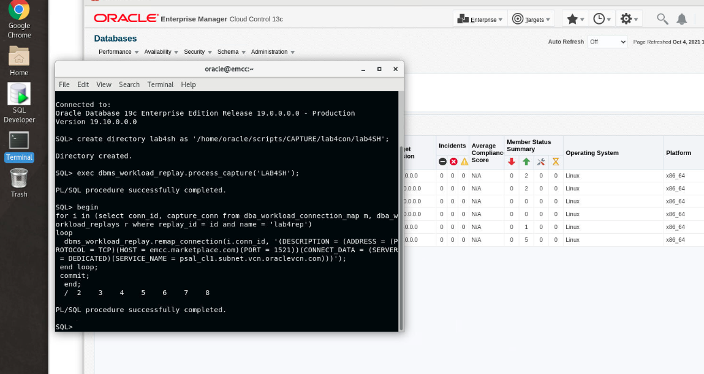

4. Continue in same sqlplus sessions and prepare the replay with TIME synchronization and query_only mode. Do not close the sqlplus session and the Terminal.

     ```` sql
     SQL> exec dbms_workload_replay.PREPARE_REPLAY (synchronization => 'TIME',query_only => TRUE);
     ````
      

5. Open a new Terminal Session to start **wrc** clients.

    **Terminal Session 2**

        - Set Environment variables for sales database **. 19c.env**
        - run wrc in the replay folder

     ``` sh
     . 19c.env
     cd /home/oracle/scripts/CAPTURE/lab4con/lab4SH
     wrc system/welcome1

     ```

      

     **Terminal Session 1**

     Start the replay in session 1

     ``` sql
     SQL> exec dbms_workload_replay.START_REPLAY
     ```

      


6. Import Completed Capture into EM

       - Log into your Enterprise Manager as **sysman** as indicated in the Prerequisites step if not already done.
       - Navigate from **Enterprise** to **Quality Management** top then **Database Replay**
       - **Click** Import button in Capture Workload  

     

       - Pick **Import a completed capture from a directory in file system** and click **Next**

       

       - Select **db19c.subnet.vcn.oraclevcn.com**

     

       - Use **SYS_DB19C** named credential for DB credential, use **ORACLE** for named credential for DB Host credential. Click Browse to enter **Workload Location**

     

       - Workload Location : **/home/oracle/scripts/CAPTURE/lab4con/lab4SH**

     

         

       - Click **Load Workload** button in Import Workload page, then click **Next**

     

         

       - Click **Submit**

     

       - The Import job might takes 2-3 minutes to be completed

7. Import Running Replay into EM    

       - **Click** Replay Tasks tab and **Click** Create button

     

       - **Enter** Name **shrep** in Create Task page
       - **Click** Add button in Workloads section

     

       - **Pick** SH click **Select**

         

       - **Uncheck** Create a new replay in Replays section
       - **Click** Submit

     

       - Back to **Database  Replay** main page
       - **Click** shrep replay task

     

       - In Replay Task page **click** Import button in Replays section

     

       - **Check** Attach to a replay of this replay task running in a database target

     

       - **Select** db19c.subnet.vcn.oraclevcn.com

     

       - Use **SYS_DB19C** named credential for DB credential, use **ORACLE** for named credential for DB Host credential

     

       - **Click** Discover Replay and **Next** button

     

        

       - **Click Submit**

     

       - Running Replay imported and monitored in EM

     

     

8. When we run this LiveLab use **Free Trial Credit**, the Replay will finish longer and the DBTime will be bigger than Capture.

     

     

     

     

  The cause is the Replay with **Free Trial Credit** use lesser number of CPUs and Memory resource.


## Learn More
  - [Oracle Enterprise Manager](https://www.oracle.com/enterprise-manager/)
  - [Enterprise Manager Documentation Library](https://docs.oracle.com/en/enterprise-manager/index.html)
  - [Database Lifecycle Management](https://docs.oracle.com/en/enterprise-manager/cloud-control/enterprise-manager-cloud-control/13.4/lifecycle.html)

## Acknowledgements
- **Author** - Björn Bolltoft, Oracle Enterprise Manager Product Management
* **Contributors** -  Shefali Bhargava, Rene Fontcha
* **Last Updated By/Date** - Rene Fontcha, LiveLabs Platform Lead, NA Technology, July 2021
