# Database Performance Management: Find, Fix, Validate

## Introduction

The goal of this lab is to become familiar with on-premise and Oracle Cloud Database performance management (Virtual Machine/Bare Metal/Exadata Cloud Service) capabilities using Oracle Enterprise Manager Cloud Control 13c.

*Estimated Lab Time:* 40 minutes

### About Database Performance Management
Performance Hub is a single pane of glass view of database performance with access to Active Session History (ASH) Analytics, Real-time SQL Monitoring and SQL Tuning together. In this lab you will get familiar with Performance hub, Real-time database operation monitoring, SQL Performance Analyzer, etc.  

### Objectives

In this lab you will learn:


| **Step No.** | **Feature**                                   | **Approx. Time** | **Details**                                                                                                                                                                                                                    | **Value proposition**                                                                                                                                                                                                                                                                                                                                                                                                                                                                                                                                                       |
|--------|-----------------------------------------------|------------------|--------------------------------------------------------------------------------------------------------------------------------------------------------------------------------------------------------------------------------|-----------------------------------------------------------------------------------------------------------------------------------------------------------------------------------------------------------------------------------------------------------------------------------------------------------------------------------------------------------------------------------------------------------------------------------------------------------------------------------------------------------------------------------------------------------------------------|
| **1**  | Performance Hub                               | 15 minutes       | Oracle Enterprise Manager 13c includes a new Jet based unified Performance Hub Jet interface for performance monitoring.                                                                                           | Performance Hub is a single pane of glass view of database performance with access to Active Session History (ASH) Analytics, Real-time SQL Monitoring and SQL Tuning together. The time picker allows the administrator to switch between Real-Time and Historical views of database performance.                                                                                                                                                                                                                                                                      |
| **2**  | Top Activity Lite                               | 5 minutes       | Top Activity Lite is a new feature introduced in 13c RU 15 to provide optimal response time for real-time monitoring for performance monitoring.                                                                                           | Top Activity Lite feature is a simplified version of Performance Hub, optimized for quick response under heavy loads while providing key performance diagnostics information through simple and effective  visualization. This feature helps DBAs monitor their database using a Network Operations Center (NOC) like screen.                                                                                                                                                                                                                                                                      |
| **3**  | Workload Analysis        | 10 minutes       | This a new feature to analyze workload that is running on a database using Enterprise Manager UI.                                                 | In this activity you create two SQL Tuning Sets(STS) with different workloads and indexes and compare them using different comparison metrics.                                                                                                                                                                                                                                                                                                                                                                                                                                                                                                           |
| **4**  | SQL Performance Analyzer        | 15 minutes       | The objective of this activity is to demonstrate and use the SQL Performance Analyzer functionality of Real Application Testing capabilities using Enterprise Manager UI.                                                 |  You've been asked to validate the SQL performance before upgrade Database.  You will see how each SQLs in the application's workload (Sales History) performs in new upgraded environment. The Sales History workload SQLs are gathered in SQL Tuning Set SHSTS..                                                                                                                                                                                                                                                                                                                                                                                                                                                                                                             |
| **5**  | Tuning a SQL in a Pluggable Database (PDB) - Optional                     | 10 minutes       | In this activity see how a pluggable database administrator can tune queries in a PDB.                                                                                                                                        | The DBA for the PDB will not have access to the Container so their view is restricted to the queries running in the PDB assigned to them. This activity identifies a Top SQL in a PDB and then tunes it using SQL Tuning Advisor.                                                                                                                                                                                                                                                                                                                                  |


### Prerequisites
- A Free Tier, Paid or LiveLabs Oracle Cloud account
- You have completed:
    - Lab: Prepare Setup (*Free-tier* and *Paid Tenants* only)
    - Lab: Environment Setup
    - Lab: Initialize Environment

*Note*: This lab environment is setup with Enterprise Manager Cloud Control Release 13.5 and Database 19c as Oracle Management Repository.

## Task 1: Prepare Database
Select between *Task 1A* and *Task 1B*

## Task 1A: Prepare Database Using EM Console

1. On the Browser *Chrome/Firefox* window on the right preloaded with *Enterprise Manager*, click on the *Username* field and select the saved credentials to login. These credentials have been saved within *Chrome/Firefox* and are provided below for reference

    ```
    Username: <copy>sysman</copy>
    ```

    ```
    Password: <copy>welcome1</copy>
    ```

    

2. From the upper left, navigate from **Enterprise** to **Job** to then **Library**

    

3. Locate and select the job name **1-DB\_LAB\_START**, and Click the Submit  button.

    

4. Leave default values in the fields and then click the Submit button in the upper right hand of your window.

    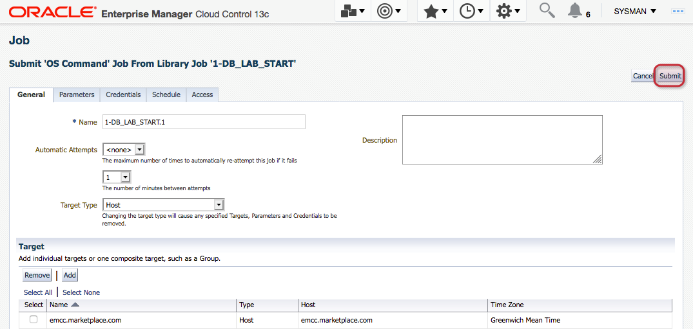

5. The workload has started and will take a few minutes to ramp up.

    

## Task 1B: Prepare database Using the terminal

1. Instead of *Task 1A* above, you may run the block below from the terminal as user *oracle*

    

    ```
    <copy>
    cd scripts
    source SALESENV
    . ./1-db_lab_start.sh</copy>
    ```

    

## Task 2: Performance Hub

1. Click on the Targets, then Databases. You will be directed to the list of Databases in EM.

    

2. Here you will notice different databases listed, such as SALES, HR etc. We will work the sales container database. Select the **Sales** database from the list and this will take you to the DB home page for this database.

    

    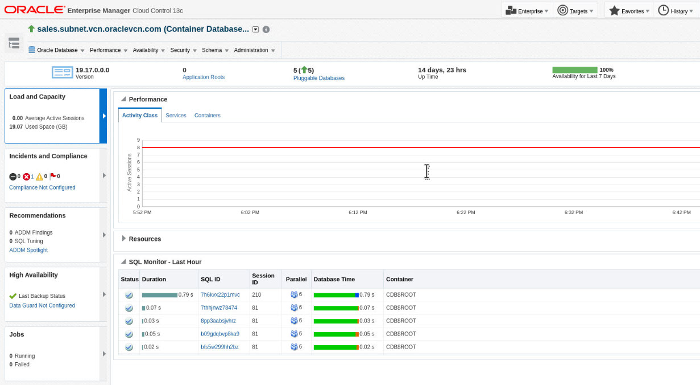

3.  Click on the **Containers** tab. It is located at the upper right-hand corner of the page, underneath the Performance tile. This will show the list of pluggable databases in the CDB and their activity.

    

4.  Notice that the PSALES database is the busiest. We focus our attention to this PDB. Let us now navigate to Performance Hub. Select Performance Hub from the Performance Menu and Click on ASH Analytics and use the sales\_system credential name from the database login screen.

    

    

    

5. Make sure to slide the time picker on an area of high usage (e.g., CPU, IO or Waits). Notice how the corresponding selected time window also changes in the summary section. You can also resize the slider to entirely cover the time period of your interest.

    Notice the graph at bottom, it is providing more detailed view of the time window you selected. By Default the wait class dimension is selected. On the right hand side of the graph you have a list of wait classes for the time window you selected (blue for user I/O, green for CPU etc.). Notice how the color changes if you hover over either the menu or the graph to highlight the particular wait class.

    Wait class isn’t the only dimension you can drill into the performance issue by. Let us say you wanted to identify the SQL that was causing the biggest performance impact. You can do that by Clicking the drop down list and changing the top dimension from wait class to SQL ID.

6. Select the SQL ID dimension from the list of available dimensions (Under Top Dimensions) using the dropdown box that is currently displaying Wait Class. Top Dimensions SQL ID. Hover your mouse on top of the SQL (one at the bottom) and you will be able to see SQL text of this SQL. Now using the same list of filters you can choose multiple dimensions.

    

7. Click on the SQL Monitoring Tab

      

8. You can see all the executed SQL during that time along with different attributes like username,execution start and end time etc. The text next to the @ sign indicates the name of the PDB. Click on any SQL of your choice (e.g. 6kd5jj7kr8swv).

    

9. It will navigate you to show the details of this particular query. You can see the plan, parallelism and activity of the query. **Plan Statistics** tab is selected by default. You can see the plan of this query in graphical mode. In some cases, the Monitored SQL may have aged out and no rows are displayed, in this case try using the time-picker and pick last 24 hours time period to identify the historical SQL that was monitored.

    1.  Tabular view, helps in navigating through a big plan and customize the columns
    
    

    2.  Graphical view is color coded and darker the color more the data flow 

    

10. Select **Parallel** tab. This will give details about parallel coordinator and parallel slaves.

11. Click on the **SQL Text** tab. You can see the query text which has been executed along with the bind variables.

    

12. Click on the **Activity** tab to understand about the activity breakdown for this SQL.

13. Click on the **Optimizer Environment** tab to view the values of the main parameters used by the Oracle optimizer when building the execution plan of a SQL statement.

14. Click on the **Outline** tab is useful for reproducing the execution plan.

15. Click on **Save Report** button on the top right corner of the page. This will help you to save this monitored execution in “.html” format, which can be used to share or to diagnose offline.


## Task 3: Top Activity Lite

1. Click on the Targets, then Databases. You will be directed to the list of Databases in EM.

    

2. Here you will notice different databases listed, such as SALES, HR etc. We will work the sales container database. Select the **Sales** database from the list and this will take you to the DB home page for this database.

    

    

3.  Click on the **Containers** tab. It is located at the upper right-hand corner of the page, underneath the Performance tile. This will show the list of pluggable databases in the CDB and their activity.

    

4.  Notice that the PSALES database is the busiest. We focus our attention to this PDB. Let us now navigate to Performance Hub. Select Performance Hub from the Performance Menu and Click on ASH Analytics and use the sales\_system credential name from the database login screen.

    

5.  Navigate to **Top Activity Lite**, this page is a simplified version of Performance Hub, which contains **ASH Analytics** and **SQL Monitoring** tabs

    

6. Click on **Auto Refresh** and choose one of the refresh options, the tables below gets refreshed, which helps DBAs monitor their database using a Network Operations Center (NOC) like screen. 

    

7. By default, the Time viewport updates to latest five minutes of data. However, if moved, it will remain fixed in absolute terms (ex: 1:00 - 1:05 PM) as the chart updates to show the last hour of data, If the viewport reaches the left side of the chart and rolls over, it should be auto-pinned again to the right side of the chart.

    

8. One can notice the differences between Performance Hub and Top Activity Lite in terms of Time viewport, Summary timeline and Dimensions such as Time view port is fixed to 5 min and provides limited dimension with the goal of scable and near-time monitoring under high load.


## Task 4: Workload Analysis


1. Click on the Targets, then Databases. You will be directed to the list of Databases in EM. Here you will notice different databases listed, such as SALES, HR etc. We will work the sales container database. Select the **Sales** database from the list and this will take you to the DB home page for this database.

    

    
    
2. Navigate to Workload Analysis from the Performance Menu or from Database home page. you can schedule Automated workload analysis by configuring automated   analysis task. In this lab, we will run One-Time analysis task, go to One-Time Analysis tab and click on Create Analysis Task.

    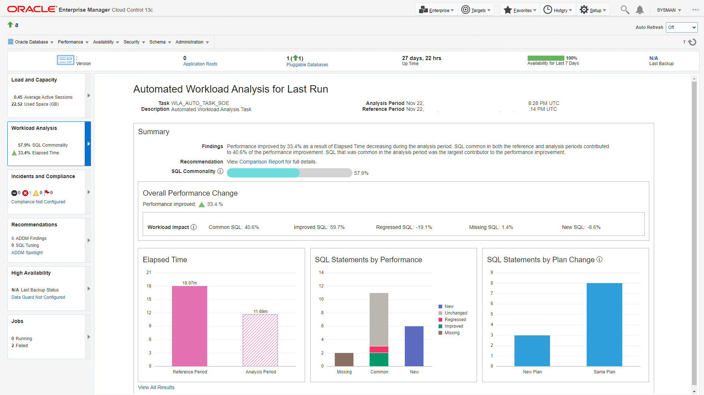 

     

3. Create task with the following inputs
   
       - Enter task Name : **WLA\_Test**
       - Enter Description : Comparing two workloads using Workload Analysis

   
       
4. Under Reference Workload, click on search icon to choose WLA\_STS1 from the dropdown menu. Later choose WLA\_STS2 from the Compared Workload search

    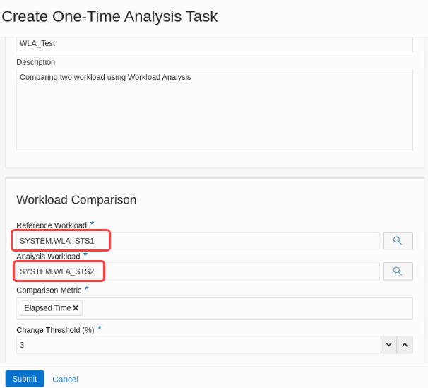 

5. In Comparison Metric, you can choose multiple options for the comparison report like Buffer Gets, Elapsed Time, CPU Time and Disk Reads. For now, let's choose Buffer Gets and Elapsed Time. Click on submit to submit the task. 

    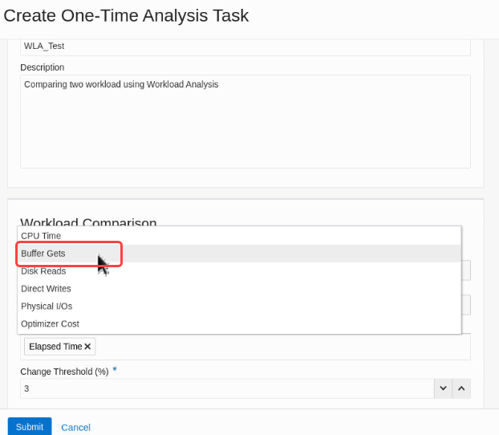 
    
    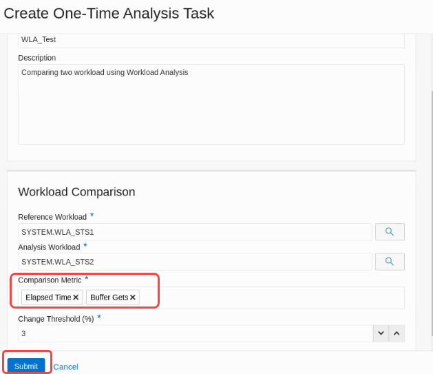 

6. Refresh the page, to see the reports and click on any report to analyze, let's view **Elapsed Time Workload Analysis Report**.
    
     
    
    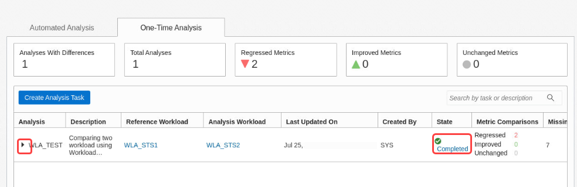 

     

7. Report shows regressed, improved, missing, new and plan changed SQLs, which helps in analyzing the workload.

    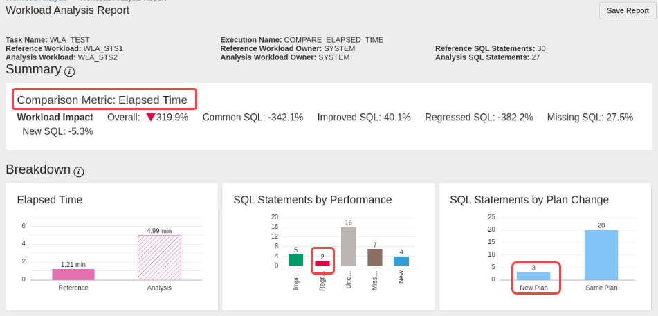 

8. Click on the New Plan in  SQL statements by Plan Change, to see the plans changed SQLs which are impacting the overall performance of the workload. Click on the SQLID which is regressed and has plan changed column "Yes"

     

     

    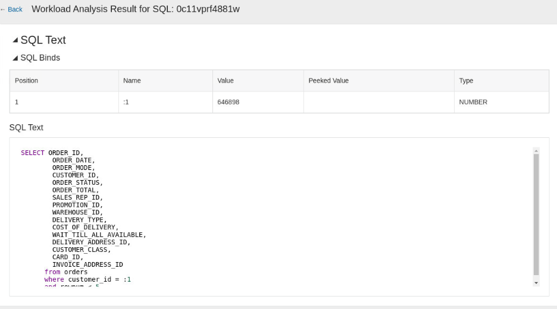 

9. Look for the plan changes and notice there is a index that is missing which is the root cause of the regression, hence the workload performance is regressed. Workload Analysis helps in analyzing the performance of the SQL by providing granular level details.

    

10. Click on the below listed links to view Workload Analysis videos

     [WLA Configure video](https://youtu.be/EVqcpEgneWE)

     [WLA Report Analysis video](https://youtu.be/HJ7wjl6oXrg)


## Task 5: SQL Performance Analyzer

1.  Log into an Enterprise Manager VM. The Enterprise Manager credentials are “sysman/welcome1”. **Click** on the Targets, then Databases. You will be directed to the list of Databases in EM.

    

    


2. Shutdown Databases cdb186.subnet.vcn.oraclevcn.com, finance.subnet.vcn.oraclevcn.com, hr.subnet.vcn.oraclevcn.com.

  

  

  

  

  

3. In this Lab, we use Databases db19c.subnet.vcn.oraclevcn.com, emrep.us.oracle.com, sales.subnet.vcn.oraclevcn.com. Check if Database db19c.subnet.vcn.oraclevcn.com is open and available. If it is down, please start Database db19c.subnet.vcn.oraclevcn.com. Open Pluggable Databases db19c.subnet.vcn.oraclevcn.com\_OLTP\_CL2, db19c.subnet.vcn.oraclevcn.com\_PSAL\_CL1.

   

   

   

   

   

   


4.  Click on the Targets, then Databases. You will be directed to the list of Databases in EM.

    

5. Here you will notice different databases listed, such as SALES, HR etc., we will work in pluggable database psales inside the sales container database. **Expand** the Sales database from the list, and **Click** sales.subnet.vcn.oraclevcn.com_PSALES

    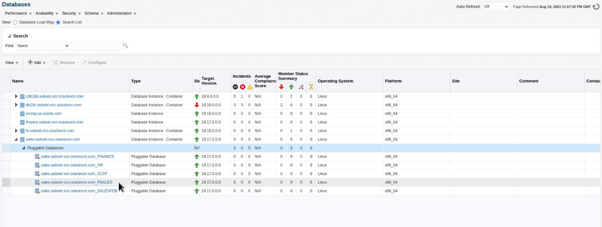

6. Go to SQL Tuning Set page by **Click** on Performance menu -> SQL -> SQL Tuning Set. Check "Named" on Credential and use SYS_SALES Credential Name from the database login screen

    

    

7. Pick SQL Tuning Set 'shsts1' and **Click** Copy To A Database button

    

8. Enter Copy SQL Tuning Set

       - Pick **db19c.subnet.vcn.oraclevcn.com\_PSAL\_CL1** for Destination Database
       - Pick **STSCOPY** for Directory Object
       - Pick **ORACLE** for both Source and Destination Credentials and **SYS_SALES** for Destination Database Credential
       - Click **Ok**

    

    

    

   View on job page to check status of the Copy STS job. It can take 1.5-2 minutes.

9. After the COPY STS job successfully finished, **Click** Target - Database

       - **Click** db19c.subnet.vcn.oraclevcn.com - PDB **PSAL_CLone1**
       - **Click** on menu Performance - SQL - SQL Performance Analyzer

    

    

    

10. In SPA (SQL Performance Analyzer) page, **Click** Guided Workflow

    

11. Step 1 Create SPA Task  based on STS

    

       - Enter Name for the Task Name : **SHSPATASK**
       - Enter Description : **Sales History SPA Task**
       - Pick STS : **SHSTS1**

    

       - **Click** Create and back to **Guided Workflow** page

12. Step 2 Create SQL Trial in Initial Environment

    

       - Enter SQL Trial Name : **SHSTS\_SQL\_TRIAL\_1**
       - Enter Description : Sales History run
       - Creation Method: **Execute SQLs Remotely**

    

       - Default per-SQL Time Limit
       - Click Create Database Link button

    

       - Enter Name :  **PSALES.SUBNET.VCN.ORACLEVCN.COM**
       - Enter Net Service Name :
      ```
      <copy>"(DESCRIPTION = (ADDRESS = (PROTOCOL = TCP)(HOST = emcc.marketplace.com)(PORT = 1523)) (CONNECT_DATA = (SERVER = DEDICATED) (SERVICE_NAME = psales.subnet.vcn.oraclevcn.com)))"</copy>
      ```
         (need to include double quote "")
       - Click on Public - This database link is available to all users
       - Pick Fixed User
       - Enter Username : **SYSTEM**
       - Password : **welcome1**
       - Click Ok

    

       - Click Search button then pick Database Link  **PSALES.SUBNET.VCN.ORACLEVCN.COM**

    

       - **Check** Trial environment established
       - **Click** Submit

13. Back to SQL Performance Analyzer Home page, to check the status of the task run.

    

       - Continue the Workflow **Click** SHSPATASK

    

14. Continue Step 3 in SPA Guided Workflow **SHSPATASK**, and create SQL Trial in Changed Environment

    

       - Enter SQL Trial Name : **SHSTS\_SQL\_TRIAL\_2**
       - Enter Description : Sales History 19C Run
       - Creation Method: **Execute SQLs Locally**
       - Default per-SQL Time Limit
       - **Check** Trial environment established
       - **Click** Submit

    

15. Back to SQL Performance Analyzer Home page, to check the status of the task run.

    

       - Continue the Workflow **Click** SHSPATASK

16. Continue Step 4 in SPA Guided Workflow **SHSPATASK**, and compare Step 2 and Step 3

    

       - Trial 1 Name : **SHSTS\_SQL\_TRIAL\_1**
       - Trial 2 Name : **SHSTS\_SQL\_TRIAL\_2**
       - Comparison Metric : **Buffer Get**
       - **Click** Submit

    

17. Continue Step 5 in SPA Guided Workflow **SHSPATASK**, View Trial Comparison report

    

    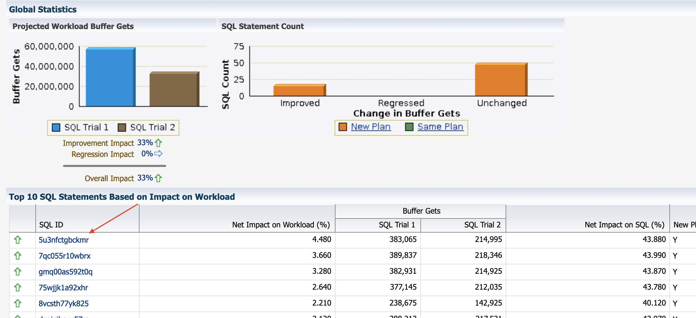

       - **Click** one of the SQLID to check the detail of the SQL comparison

    


## Task 6: Tuning a SQL in a PDB - Optional

1. Log into an Enterprise Manager VM (using provided IP). The Enterprise Manager credentials are “sysman/welcome1”.

    

2.  Once logged into Enterprise Manager, Select **Targets**, then **Databases** . Click on the **expand** icon on the left and click on the database **sales.subnet.vcn.oraclevcn.com**

    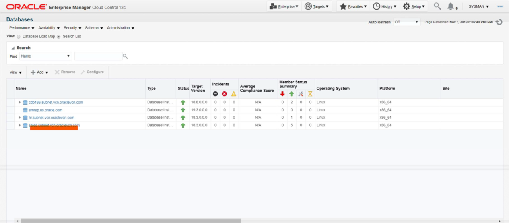

3.  You should now see the Database Home page.

    

4.  From the Performance Menu Click on **Performance Hub**, then **ASH Analytics**.

    

5.  In the bottom left of the page, Click on the **activity bar** for the SQL showing highest activity.

    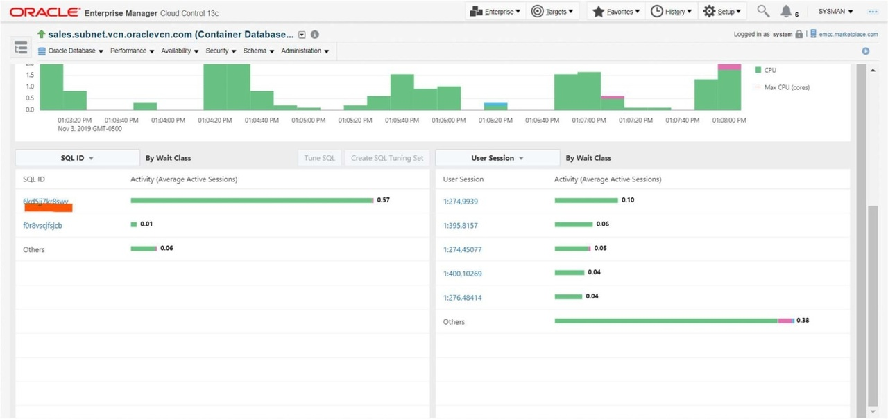

6.  Now schedule the SQL Tuning Advisor by Clicking on the **Tune SQL** button.

    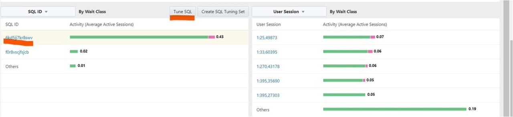

7.  Accept the default and Submit the **SQL tuning Job**.

    

    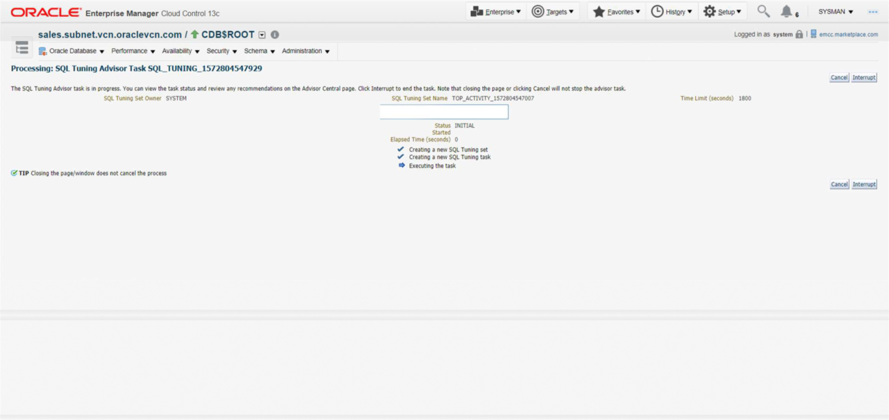

8.  Once the job completes. You should see the recommendations for either creating a profile or an index.

    

9.  Implement the SQL Profile recommendation. SQL Profiles are a great way of tuning a SQL without creating any new objects or making any code changes.

10. At this point let us now turn off the load: Change directory to scripts and execute the script ***1-db\_lab\_stop.sh*** as shown below

    

    >Alternatively you can use the Enterprise Manager Job Scheduler capability to stop the job.

11. Navigate to Enterprise, then Job, then to Library

    

12. Select the job *1-DB\_LAB\_STOP*

    

13. And then Submit the job

    

14. When the job is completed, the workload stops

    

<!-- This concludes the Database Performance Management lab activity. You can now move on to Real Application Testing lab activity. -->

## Learn More
  - [Oracle Enterprise Manager](https://www.oracle.com/enterprise-manager/)
  - [Enterprise Manager Documentation Library](https://docs.oracle.com/en/enterprise-manager/index.html)
  - [Database Lifecycle Management](https://docs.oracle.com/en/enterprise-manager/cloud-control/enterprise-manager-cloud-control/13.4/lifecycle.html)

## Acknowledgements
- **Author** - Anusha Vojjola, and Björn Bolltoft, Oracle Enterprise Manager Product Management
* **Contributors** -  Shefali Bhargava, Rene Fontcha
* **Last Updated By/Date** - Rene Fontcha, LiveLabs Platform Lead, NA Technology, July 2021
