# Database Performance Management: Find, Fix, Validate

## Introduction

The goal of this lab is to become familiar with on-premise and Oracle Cloud Database performance management (Virtual Machine/Bare Metal/Exadata Cloud Service) capabilities using Oracle Enterprise Manager Cloud Control 13c.

*Estimated Lab Time:* 55 minutes

### About Database Performance Management
Performance Hub is a single pane of glass view of database performance with access to Active Session History (ASH) Analytics, Real-time SQL Monitoring and SQL Tuning together. In this lab you will get familiar with Performance hub, Real-time database operation monitoring, SQL Performance Analyzer, etc.  

### Objectives

In this lab you will learn:


| **Step No.** | **Feature**                                   | **Approx. Time** | **Details**                                                                                                                                                                                                                    | **Value proposition**                                                                                                                                                                                                                                                                                                                                                                                                                                                                                                                                                       |
|--------|-----------------------------------------------|------------------|--------------------------------------------------------------------------------------------------------------------------------------------------------------------------------------------------------------------------------|-----------------------------------------------------------------------------------------------------------------------------------------------------------------------------------------------------------------------------------------------------------------------------------------------------------------------------------------------------------------------------------------------------------------------------------------------------------------------------------------------------------------------------------------------------------------------------|
| **1**  | Performance Hub                               | 15 minutes       | Oracle Enterprise Manager 13c includes a new Jet based unified Performance Hub Jet interface for performance monitoring.                                                                                           | Performance Hub is a single pane of glass view of database performance with access to Active Session History (ASH) Analytics, Real-time SQL Monitoring and SQL Tuning together. The time picker allows the administrator to switch between Real-Time and Historical views of database performance.                                                                                                                                                                                                                                                                      |
| **2**  | Top Activity Lite                               | 5 minutes       | Top Activity Lite is a new feature introduced in 13c RU 15 to provide optimal response time for real-time monitoring for performance monitoring.                                                                                           | Top Activity Lite feature is a simplified version of Performance Hub, optimized for quick response under heavy loads while providing key performance diagnostics information through simple and effective  visualization. This feature helps DBAs monitor their database using a Network Operations Center (NOC) like screen.                                                                                                                                                                                                                                                                      |
| **3**  | Real-time Database Operation Monitoring       | 10 minutes       | Real-Time Database Operations Monitoring, introduced in Oracle Database 12c, enables an administrator to monitor long running database tasks as a composite business operation.                                                | Developers and DBAs can define business operations for monitoring by explicitly specifying the start and end of an operation or implicitly with tags that identify the operation.                                                                                                                                                                                                                                                                                                                                                                                              |
| **4**  | Tuning a SQL in a Pluggable Database (PDB)                         | 10 minutes       | In this activity see how a pluggable database administrator can tune queries in a PDB.                                                                                                                                        | The DBA for the PDB will not have access to the Container so their view is restricted to the queries running in the PDB assigned to them. This activity identifies a Top SQL in a PDB and then tunes it using SQL Tuning Advisor.                                                                                                                                                                                                                                                                                                                                  |
| **5**  | SQL Performance Analyzer Optimizer Statistics | 10 minutes       | The objective of this activity is to demonstrate and use the SQL Performance Analyzer functionality of Real Application Testing capabilities in Oracle Enterprise Manager Cloud Control 13c with Oracle Database 19c. | SQL Performance Analyzer gathers Oracle Database Optimizer statistics for validation.                                                                                                                                                                                                                                                                                                                                                                                                                                                                                                             |
| **6**  | Database Workload Replay                      | 10 minutes       | The objective of this activity is to demonstrate and use the Database Replay functionality of Real Application Testing capabilities in Oracle Enterprise Manager Cloud Control 13c and Oracle Database 19c.                | **Scenario:** You've been asked to add three new indexes for an application, but before adding, you want proof that database performance is improved. Use of SQL Performance Analyzer (SPA) isn't enough because there is also the cost of maintaining the indexes. Replay will be performed against the **Sales** Container Database and changes need to be performed in the OLTP Container against the **DWH\_TEST** schema. The database version is 18c so the capture and replay are performed using a CDB. |
| **7**  | ADDM Spotlight (Read-only)                     | 10 minutes       | The objective of this activity is to demonstrate the steps to use ADDM Spotlight in Oracle Enterprise Manager Cloud Control 13c               | ADDM Spotlight is a great tool to use when the data is more than an hour, ideally a week of ADDM findings and recommendations to find out the most common recommendations along with their impact and benefits. Enables DBAs to have confidence in implementing the recommendations mentioned by ADDM Spotlight |


### Prerequisites
- A Free Tier, Paid or LiveLabs Oracle Cloud account
- You have completed:
    - Lab: Prepare Setup (*Free-tier* and *Paid Tenants* only)
    - Lab: Environment Setup
    - Lab: Initialize Environment

*Note*: This lab environment is setup with Enterprise Manager Cloud Control Release 13.5 and Database 19.10 as Oracle Management Repository.

## Task 1: Prepare Database
Select between *Task 1A* and *Task 1B*

## Task 1A: Prepare Database Using EM Console

1. On the Browser *Chrome/Firefox* window on the right preloaded with *Enterprise Manager*, click on the *Username* field and select the saved credentials to login. These credentials have been saved within *Chrome/Firefox* and are provided below for reference

    ```
    Username: <copy>sysman</copy>
    ```

    ```
    Password: <copy>welcome1</copy>
    ```

    

2. From the upper left, navigate from **Enterprise** to **Job** to then **Library**

    

3. Locate and select the job name **1-DB\_LAB\_START**, and Click the Submit  button.

    

4. Leave default values in the fields and then click the Submit button in the upper right hand of your window.

    

5. The workload has started and will take a few minutes to ramp up.

    

## Task 1B: Prepare database Using the terminal

1. Instead of *Task 1A* above, you may run the block below from the terminal as user *oracle*

    

    ```
    <copy>
    cd scripts
    source SALESENV
    . ./1-db_lab_start.sh</copy>
    ```

    

## Task 2: Performance Hub

1. Click on the Targets, then Databases. You will be directed to the list of Databases in EM.

    

2. Here you will notice different databases listed, such as SALES, HR etc. We will work the sales container database. Select the **Sales** database from the list and this will take you to the DB home page for this database.

    

    

3.  Click on the **Containers** tab. It is located at the upper right-hand corner of the page, underneath the Performance tile. This will show the list of pluggable databases in the CDB and their activity.

    

4.  Notice that the PSALES database is the busiest. We focus our attention to this PDB. Let us now navigate to Performance Hub. Select Performance Hub from the Performance Menu and Click on ASH Analytics and use the sales\_system credential name from the database login screen.

    

    

    

5. Make sure to slide the time picker on an area of high usage (e.g., CPU, IO or Waits). Notice how the corresponding selected time window also changes in the summary section. You can also resize the slider to entirely cover the time period of your interest.

    Notice the graph at bottom, it is providing more detailed view of the time window you selected. By Default the wait class dimension is selected. On the right hand side of the graph you have a list of wait classes for the time window you selected (blue for user I/O, green for CPU etc.). Notice how the color changes if you hover over either the menu or the graph to highlight the particular wait class.

    Wait class isn’t the only dimension you can drill into the performance issue by. Let us say you wanted to identify the SQL that was causing the biggest performance impact. You can do that by Clicking the drop down list and changing the top dimension from wait class to SQL ID.

6. Select the SQL ID dimension from the list of available dimensions (Under Top Dimensions) using the dropdown box that is currently displaying Wait Class. Top Dimensions SQL ID. Hover your mouse on top of the SQL (one at the bottom) and you will be able to see SQL text of this SQL. Now using the same list of filters you can choose multiple dimensions.

    
	
    You have an option to save the performance hub report for offline analysis

    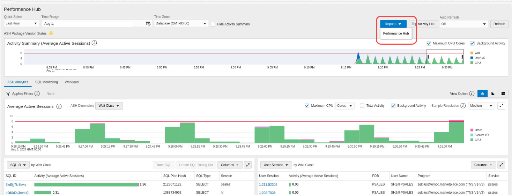


7. Click on the SQL Monitoring Tab

      

8. You can see all the executed SQL during that time along with different attributes like username, execution start and end time etc. The text next to the @ sign indicates the name of the PDB. Click on any SQL of your choice (e.g. 6kd5jj7kr8swv).

    

9. It will navigate you to show the details of this particular query. You can see the plan, parallelism and activity of the query. **Plan Statistics** tab is selected by default. You can see the plan of this query in graphical mode. In some cases, the Monitored SQL may have aged out and no rows are displayed, in this case try using the time-picker and pick last 24 hours time period to identify the historical SQL that was monitored.

    1.  Tabular view, helps in navigating through a big plan and customize the columns
    
    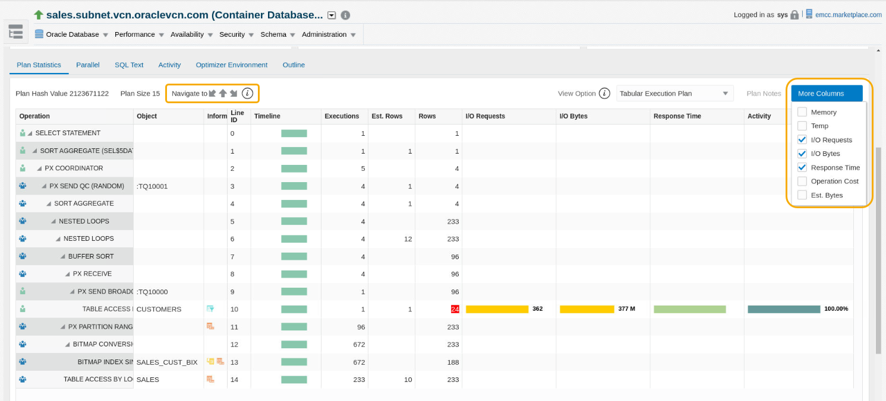

    2.  Graphical view is color coded and darker the color more the data flow 

    

10. Select **Parallel** tab. This will give details about parallel coordinator and parallel slaves.

11. Click on the **SQL Text** tab. You can see the query text which has been executed along with the bind variables.

    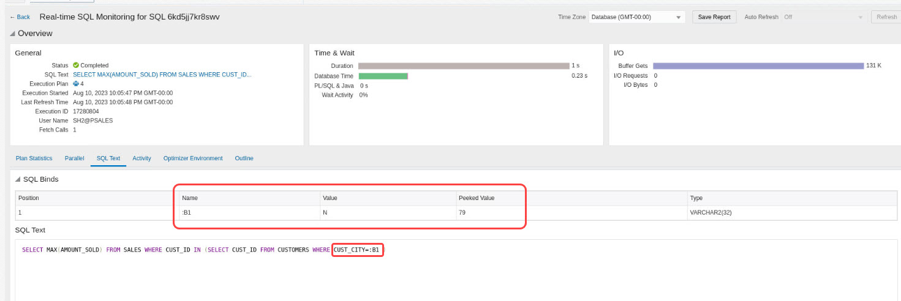

12. Click on the **Activity** tab to understand about the activity breakdown for this SQL.

13. Click on the **Optimizer Environment** tab to view the values of the main parameters used by the Oracle optimizer when building the execution plan of a SQL statement.

14. Click on the **Outline** tab is useful for reproducing the execution plan.

15. Click on **Save Report** button on the top right corner of the page. This will help you to save this monitored execution in “.html” format, which can be used to share or to diagnose offline.

## Task 3: Top Activity Lite

1. Click on the Targets, then Databases. You will be directed to the list of Databases in EM.

    

2. Here you will notice different databases listed, such as SALES, HR etc. We will work the sales container database. Select the **Sales** database from the list and this will take you to the DB home page for this database.

    

    

3.  Click on the **Containers** tab. It is located at the upper right-hand corner of the page, underneath the Performance tile. This will show the list of pluggable databases in the CDB and their activity.

    

4.  Notice that the PSALES database is the busiest. We focus our attention to this PDB. Let us now navigate to Performance Hub. Select Performance Hub from the Performance Menu and Click on ASH Analytics and use the sales\_system credential name from the database login screen.

    

5.  Navigate to **Top Activity Lite**, this page is a simplified version of Performance Hub, which contains **ASH Analytics** and **SQL Monitoring** tabs

    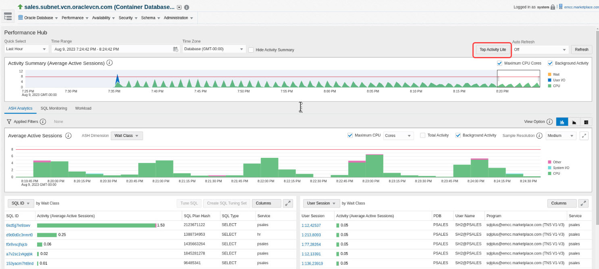

6. Click on **Auto Refresh** and choose one of the refresh options, the tables below gets refreshed, which helps DBAs monitor their database using a Network Operations Center (NOC) like screen. 

    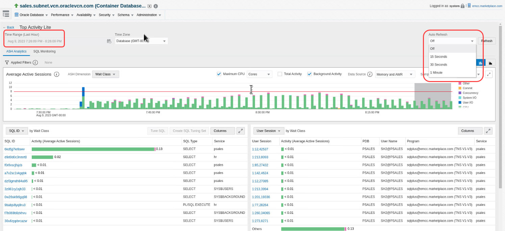

7. By default, the Time viewport updates to latest five minutes of data. However, if moved, it will remain fixed in absolute terms (ex: 1:00 - 1:05 PM) as the chart updates to show the last hour of data, If the viewport reaches the left side of the chart and rolls over, it should be auto-pinned again to the right side of the chart.

    

8. One can notice the differences between Performance Hub and Top Activity Lite in terms of Time viewport, Summary timeline and Dimensions such as Time view port is fixed to 5 min and provides limited dimension with the goal of scable and near-time monitoring under high load.

## Task 4: Real-Time Database Operations Monitoring

1. From the terminal session on your remote desktop, run as user *oracle*

    ```
    <copy>
    source SALESENV
    cd scripts/load/frame/queries/awrv</copy>
    ```

2. Using SQLPlus connect to the sh2 account. Open the file (!vi DBOP.sql) from the SQL prompt and then review the content of the file. At the beginning of the file you will notice how we have tagged the operation with dbms\_sql\_monitor.begin\_operation and ended it with dbms\_sql\_monitor.end\_operation.
Now execute the file \@DBOP.sql

    ```
    <copy>sqlplus sh2/sh2@psales
    @DBOP.sql</copy>
    ```

3. You should already be logged on to Enterprise Manager. If you are not, please follow the instructions detailed earlier. Select the **Monitored SQL** tab.

4. Review the list of currently executing SQLs that are visible. Click on the DBOP\_DEMO name. This will open the DBOP named DBOP\_DEMO.

    Note: You may have to scroll down or select “Database operations” from the type dropdown.

    

5. Review the details of the Database Operations.

    

6.  Click on the **Metric** tab. You will see all the activity for this operation.

    

## Task 5: Tuning a SQL in a PDB

1. Log into an Enterprise Manager VM (using provided IP). The Enterprise Manager credentials are “sysman/welcome1”.

    

2.  Once logged into Enterprise Manager, Select **Targets**, then **Databases** . Click on the **expand** icon on the left and click on the database **sales.subnet.vcn.oraclevcn.com**

    

3.  You should now see the Database Home page.

    

4.  From the Performance Menu Click on **Performance Hub**, then **ASH Analytics**.

    

5.  In the bottom left of the page, Click on the **activity bar** for the SQL showing highest activity.

    

6.  Now schedule the SQL Tuning Advisor by Clicking on the **Tune SQL** button.

    

7.  Accept the default and Submit the **SQL tuning Job**.

    

    

8.  Once the job completes. You should see the recommendations for either creating a profile or an index.

    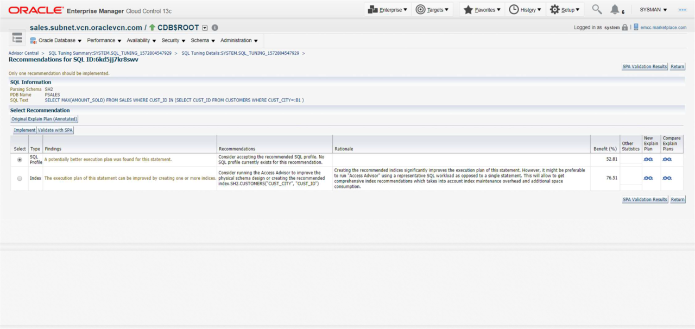

9.  Implement the SQL Profile recommendation. SQL Profiles are a great way of tuning a SQL without creating any new objects or making any code changes.

10. At this point let us now turn off the load: Change directory to scripts and execute the script ***1-db\_lab\_stop.sh*** as shown below

    

    >Alternatively you can use the Enterprise Manager Job Scheduler capability to stop the job.

11. Navigate to Enterprise, then Job, then to Library

    

12. Select the job *1-DB\_LAB\_STOP*

    

13. And then Submit the job

    

14. When the job is completed, the workload stops

    

<!-- This concludes the Database Performance Management lab activity. You can now move on to Real Application Testing lab activity. -->

## Task 6: SQL Performance Analyzer Optimizer Statistics

In this step we need to configure the database to set up optimizer statistics to be stale. So the first step is to create and submit a job that will configure the statistics to be stale.

1.  Execute SPA task using optimizer statistics - Login using username and password **sysman/ welcome1**

    

2.  Navigate to the Job library, from **Enterprise**, to **Job**, to **Library**

    

3.  Select **SPA\_STAT\_SETUP** and Click the **Submit** button

    

4. Click the **Submit** button

    

5. The job then runs and completes

    

6. The job is now running. Continue with configuring SPA Quick Check. Navigate to ***Databases >> Targets >> Databases***

    


7. Expand the *sales.subnet.vcn.oraclevcn.com* database. Click on *sales.subnet.vcn.oraclevcn.com\_HR* pluggable database.

    

8. In ***sales.subnet.vcn.oraclevcn.com\_HR*** database Navigate to ***Performance >> SQL >> SQL Performance Analyzer Quick Check Setup***

    

9.  This is the page where you configure SPA Quick Check. Make sure that the selected SQL Tuning Set includes as many SQL statements as possible. If the application has specific workloads that are executed during End of Month, End of Year or even certain period during the day, then make sure to collect the workload in separate SQL Tuning Sets and merge them into a “Total Workload Tuning set”

10. In this example we are working with a SQL Tuning Set called PENDING\_STATS\_WKLD. Select: SQL Tuning Set: PENDING\_STATS\_WKLD. Select “Comparison Metric”: Buffer Gets **Click** Save.

    

11.  Navigate ***Performance >> SQL >> Optimizer Statistics***

      

12.  Click **Gather**

      

13.  Select “Schema”. Check “Validate the impact of statistics on…..” Click **Next**.
      

14.  Click  **Add**

      

15.  Click **Search**. Select: **STAT1, STAT2**. Click  **OK**.

      

16.  Click **Next**

      

17.  Click **Next**

      

18.  Click **Submit**

      

19. In the confirmation section on top, click on the SQL Performance Analyzer Task that was started. If you accidentally closed or lost this page, navigate to **DB Target** , then **Performance Menu** ,  then **SQL Performance Analyzer Home** , then **Select** the latest SPA task you just created at the bottom of the page.

    

20. You now have now a running SQL Performance Analyzer task. Wait until its Last Run Status is Completed.Click  on **Name**

    

21.  As you can see there are four SQL trials that have been executed. The first two have identified SQL statements with plan changes. In the last two trials it is only the statements with plan changes that have been executed. This will reduce the amount of time and resources used in a production system. Click on the eyeglasses icon for the second report.

      

22.  As we can see the majority of our statements have had unchanged performance. We have a significant improvement but the most important thing to notice is that we have no regression. If there had been regression then we have the ability to tune the regressed statement or use SQL Plan Baselines to remediate the identified regressions. Note you can also use SQL Tuning Advisor to remediate regressions by implementing SQL Profile recommendations

      

23.  Since this application has used stale statistics for a long period, then it would be good to have new statistics implemented. Click on **Publish Object Statistics**

      

24. We can now change statistics for all tables where we have pending statistics. For the scope of this exercise we will only change statistics for schema STAT1. Click the **Checkbox** for schema STAT1 .Click **Publish**.

    

25. Click **Yes**

    

    

<!-- You have now learned how to work with SPA. As you can see there are Guided Workflows that will help you during your analysis and verify that you can implement new changes in production with confidence. -->

Details about newly published statistics can be found if you navigate **Schema** , to **Database Object** , to **Tables** , and Select tables for schema ‘STAT1’

## Task 7: Database Workload Replay

1. Create a Replay Task. You need to open two terminal sessions as user *oracle*.  

### **SSH Session 1**

2. Set Environment variables for sales database

    ```
    <copy>. ./sales.env</copy>
    ```

3. Connect to sales database and create indexes. (indexes are already created, just need to make them visible)

    ```
    <copy>sqlplus system/welcome1@oltp <<EOF
    alter index dwh_test.DESIGN_DEPT_TAB2_IDX1 visible;
    alter index dwh_test.DISTRIBUTION_DEPT_TAB2_IDX visible;
    alter index dwh_test.OUTLETS_TAB3_IT_IDX visible;
    EOF</copy>
    ```

4. We have already performed the capture and stored it in

    /home/oracle/scripts/dbpack/RAT\_CAPTURE/DBReplayWorkload\_OLTP\_CAP\_1 RAT\_REPLAY
    The capture directory should be copied to a Replay directory. In a normal situation replay is performed against a test server. This test environment is limited so we will only copy the directory to a replay path instead

    ```
    <copy>cd scripts/dbpack
    cp -r RAT_CAPTURE/DBReplayWorkload_OLTP_CAP_1 RAT_REPLAY
    cd RAT_REPLAY/DBReplayWorkload_OLTP_CAP_1</copy>
    ```

5. Connect to as sysdba and grant become user to system on all containers

    ```
    <copy>sqlplus sys/welcome1 as sysdba <<EOF
    grant become user to system container=all;
    EOF</copy>
    ```

6. Connect to system create a directory object to locate the capture and preprocess the capture

    ```
    <copy>connect system/welcome1
    CREATE DIRECTORY DBR_REPLAY AS '/home/oracle/scripts/dbpack/RAT_REPLAY/DBReplayWorkload_OLTP_CAP_1';
    exec DBMS_WORKLOAD_REPLAY.PROCESS_CAPTURE (capture_dir => 'DBR_REPLAY');</copy>
    ```

7. We can now start to replay the workload. Initialize replay will load replay metadata created during preprocessing

    ```
    <copy>exec DBMS_WORKLOAD_REPLAY.INITIALIZE_REPLAY (replay_name => 'REPLAY_1', replay_dir => 'DBR_REPLAY');</copy>
    ```

8. If the replay environment uses different connect strings compared to the capture environment then we need to remap connections. Check connect strings.

    ```
    <copy>select * from DBA_WORKLOAD_CONNECTION_MAP;</copy>
    ```

9. Next, remap connections

    ```
    <copy>exec DBMS_WORKLOAD_REPLAY.REMAP_CONNECTION (connection_id => 1, replay_connection => 'HR');
    exec DBMS_WORKLOAD_REPLAY.REMAP_CONNECTION (connection_id => 2, replay_connection => 'OLTP');
    exec DBMS_WORKLOAD_REPLAY.REMAP_CONNECTION (connection_id => 3, replay_connection => 'SALES');
    exec DBMS_WORKLOAD_REPLAY.REMAP_CONNECTION (connection_id => 4, replay_connection => 'SALES');
    exec DBMS_WORKLOAD_REPLAY.REMAP_CONNECTION (connection_id => 5, replay_connection => 'PSALES');
    exec DBMS_WORKLOAD_REPLAY.REMAP_CONNECTION (connection_id => 6, replay_connection=> 'SALES');</copy>
    ```

10. Now check new settings for connect strings

    ```
    <copy>select * from DBA_WORKLOAD_CONNECTION_MAP;</copy>
    ```

11. Prepare the replay by setting replay options. This replay will use default synchronization which is time-based synchronization. With this setting we honor timing for each individual call the best as possible. If a session has slow SQL statements then other sessions will still honor timing but they will not wait for the slow session. This can cause higher divergence. If divergence is less than 10 % then it should be considered as a good replay.

    ```
    <copy>exec DBMS_WORKLOAD_REPLAY.PREPARE_REPLAY (synchronization => 'TIME');</copy>
    ```

Now switch to session 2.

### **SSH Session 2**

12. Set Environment variables for sales database and change to the replay directory

    ```
    <copy>. ./sales.env
    cd scripts/dbpack/RAT_REPLAY/DBReplayWorkload_OLTP_CAP_1</copy>
    ```

13. Calibrate the replay and validate how many replay clients that are needed to replay the workload.

    ```
    <copy>wrc mode=calibrate replaydir=/home/oracle/scripts/dbpack/RAT_REPLAY/DBReplayWorkload_OLTP_CAP_1</copy>
    ```

    *Note*: Replay clients are the application tier and should not be co-allocated with the database due to resource usage. Our recommendation is to place replay clients close to the database to avoid delays between database and replay clients. This is regardless if the application tier is located far away. The reason is that the replay clients communicate with the database to know when a certain database call should be replayed and if replay clients are located far away it will delay the call and create artificial delays during the replay.

### Calibrate output

>Workload Replay Client: Release 18.0.0.0.0 - Production on Tue Nov 5 09:43:45 2019 Copyright (c) 1982, 2018, Oracle and/or its affiliates. All rights reserved.
>Report for Workload in: /home/oracle/scripts/dbpack/RAT\_REPLAY/DBReplayWorkload\_OLTP\_CAP\_1
>
>Recommendation: consider using at least 1 client divided among 1 CPU(s). You will need at least 112 MB of memory per client process. If your machine(s) cannot match that number, consider using more clients.

>Workload Characteristics:
    - max concurrency: 30 sessions
    - total number of sessions: 534
>Assumptions:
    - 1 client process per 100 concurrent sessions
    - 4 client processes per CPU
    - 256 KB of memory cache per concurrent session
    - think time scale = 100
    - connect time scale = 100
    - synchronization = TRUE

14. The workload is relatively small and it needs only one replay client so we will start it from this session

    ```
    <copy>wrc system/welcome1@sales mode=replay replaydir=/home/oracle/scripts/dbpack/RAT_REPLAY/DBReplayWorkload_OLTP_CAP_1</copy>
    ```

Now switch back to *session 1*. You should already be connected as user oracle

### **SSH Session 1**

15. You should still be connected in the SQL*Plus session as used before. From this window start the replay

    ```
    <copy>Exec DBMS_WORKLOAD_REPLAY.START_REPLAY ();</copy>
    ```

16.	Monitor the replay in session 2 and when the replay has finished the generate replay reports from session 1

17.	When replay has finished import capture AWR data. First create a common user as staging schema

    ```
    <copy>Create user C##CAP_AWR;
    Grant DBA to C##CAP_AWR;
    SELECT DBMS_WORKLOAD_CAPTURE.IMPORT_AWR (capture_id => 11,staging_schema => 'C##CAP_AWR') from dual;</copy>
    ```

18.	Generate replay report as a text report. This report can also be generated in HTML or XML format.

    ```
    <copy>Set long 500000
    Set linesize 200
    Set pagesize 0

    Spool replay_report.txt
    select dbms_workload_replay.report (replay_id => 1, format=> 'TEXT') from dual;
    spool off</copy>
    ```

19.	Please open the text report with a Linux editor of your choice such as vi and look at replay details.

    ```
    <copy>!vi replay_report.txt</copy>
    ```

20.	Can you see if the replay uses more or less database time than the capture? Exit the report in vi use “ZZ” and you will return back to SQL*plus

21.	Generate compare period report as HTML report.

    ```
    <copy>spool compare_period_report.html

    VAR v_clob CLOB
    BEGIN dbms_workload_replay.compare_period_report(replay_id1 => 1, replay_id2 => null, format => DBMS_WORKLOAD_REPLAY.TYPE_HTML, result => :v_clob);
    END;
    /

    print v_clob;
    spool off
    exit</copy>
    ```

22.	To be able to read the report it needs to be downloaded change file permissions and copy the file to

    ```
    <copy>chmod 777 compare_period_report.html
    cp compare_period_report.html /tmp</copy>
    ```

23.	Use a scp client to copy the file to your local machine. Open the file in a text editor and remove initial lines before first row starting with

    ```
    <copy>“< html lang="en">”</copy>
    ```

    And trailing lines after last row ending with

    ```
    <copy>“<b> End of Report. </b>
      </body>
    </html> “</copy>
    ```

24.	You can now open the report in a browser and look at SQL statement with performance improvements and regression.

  We have seen how you can use Real Application Testing Database Replay to validate changes that may impact performance on both SQL statements and DML statements. We have also seen the extensive reporting that will help you find and analyze bottlenecks or peaks during certain workloads.

## Task 8: ADDM Spotlight (Read-only)

Please note: This is a read-only task. ADDM Spotlight aggregates the ADDM findings and recommendations over a longer period of time, since this lab is limited to 3-4 hours, it cannot produce better results in this lab. Hence, try this on your Enterprise Manager Cloud Control environment.

1. Click on the Targets, then Databases. You will be directed to the list of Databases in EM.

    

2. Click on the database, you wish to get the findings and recommendations. 

    

    

3.  Navigate to ADDM Spotlight either from the performance menu -> ADDM Spotlight or from DB home -> Recommendation tile -> ADDM Spotlight.

    

    

4.  Select desired time from the quick select or from the time range, to view the list of ADDM findings and recommendations. On the Finding page, you can search by category to view only specific category findings.

    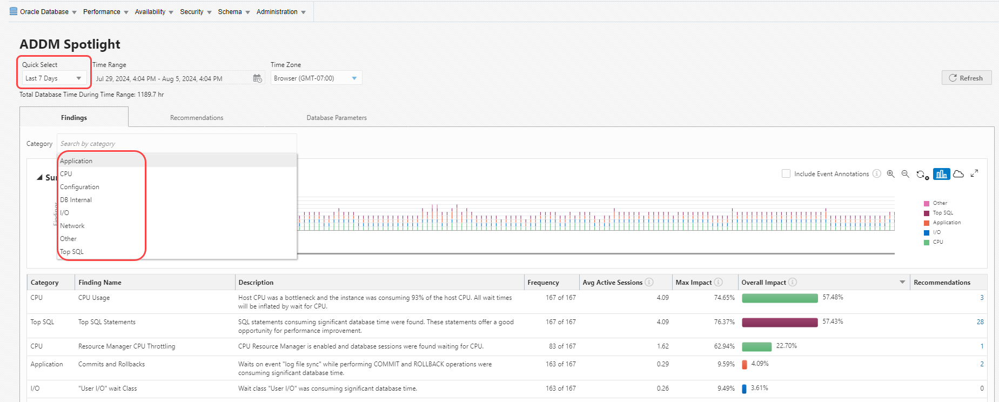

5.  Click on **Include Event Annotations** to view any database changes that impacts the overall performance such as parameter changes. You can zoom in and out with the help of zoom in and out icons.

    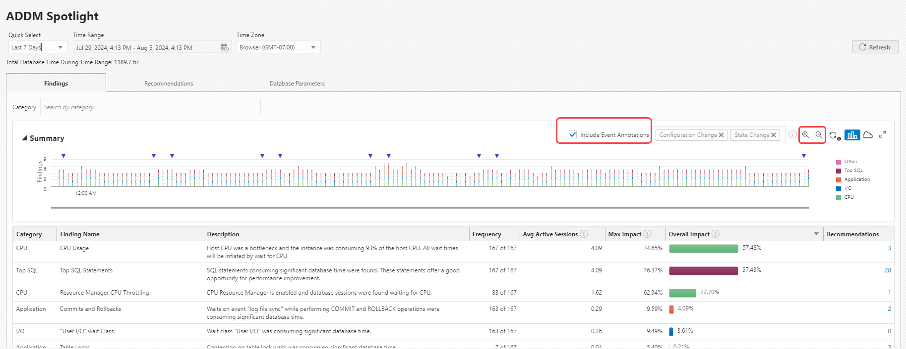

    You can Expand the summary page by clicking at the expand icon

    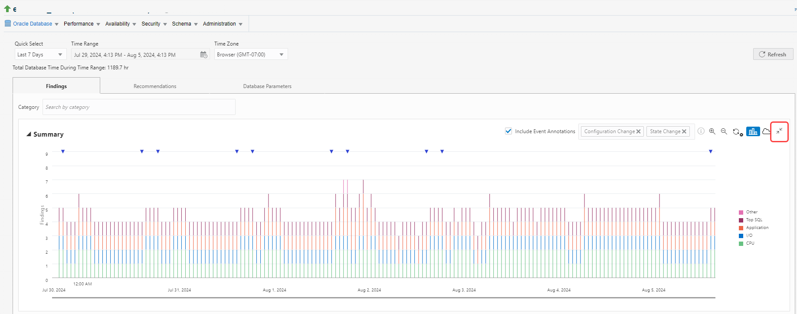

6. Finding pages shows frequency, impact and overall impact of the finding category during the selected time period. You can go to the recommendations page directly from the link mentioned in the recommendations column.

    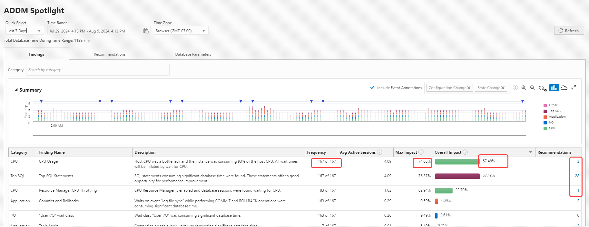

7. Click on recommendations tab, to view all the recommendations or a specific recommendation such as Database Parameters, SQL, Schema Objects. Click on **SQL** for SQL recommendations, along with their SQL ID and the rationale for the recommendation. 

    

8. Click on the Tag cloud, a cloud like icon on the right side of the summary page, to view the SQLID with the maximum benefit, bigger the SQLID, higher the benefit. Each SQLID is color coded for easy visualization.
  
    


9. In the Overall Benefit column, click to view the actions associated to the each SQL ID

    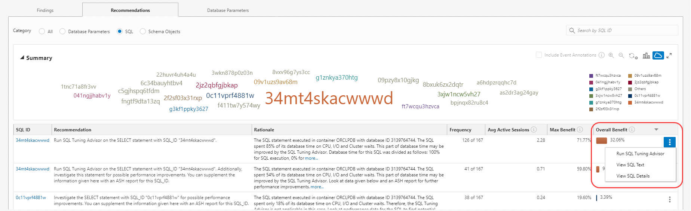

10. Run SQL Tuning Advisor to view the recommendations for that particular SQL ID and submit the task. You can tune the SQL accordingly.

    


11. Go to Database Parameter tab, to view the parameter that are high-impact, non-default values, changed and recommended parameters.

    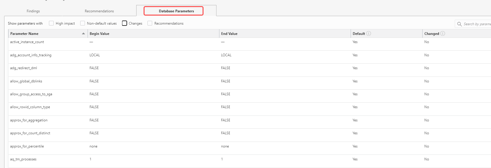

12. Click on the below listed links to view ADDM Spotlight blog and video

     [ADDM Spotlight blog](https://blogs.oracle.com/observability/post/addm-spotlight-strategic-advice-optimize-oracle-dbms)

     [ADDM Spotlight video](https://youtu.be/7y7ivjgFEYw)


This completes the Lab!

You may now [proceed to the next lab](#next).

## Learn More
  - [Oracle Enterprise Manager](https://www.oracle.com/enterprise-manager/)
  - [Enterprise Manager Documentation Library](https://docs.oracle.com/en/enterprise-manager/index.html)
  - [Database Lifecycle Management](https://docs.oracle.com/en/enterprise-manager/cloud-control/enterprise-manager-cloud-control/13.4/lifecycle.html)

## Acknowledgements
- **Author** - Björn Bolltoft, Oracle Enterprise Manager Product Management
* **Contributors** -  Shefali Bhargava, Rene Fontcha
* **Last Updated By/Date** - Anusha Vojjola, Product Management team, August 2024
