# Automated Database Patching at Scale with Fleet Maintenance

## Introduction
The goal of this lab is to explore end-to-end automated patching of the Oracle Database using Enterprise Manager. This lab is command based(emcli) lab. You can also check an equivalent UI based lab.

*Estimated Lab Time*: 75 minutes

Watch the video below for a quick walk through of the lab.
[](youtube:NvFYUV2RGqs)

### About Database Fleet Maintenance

Database Fleet Maintenance is an end-to-end automated solution for updating (patching) and upgrading Oracle Databases. Fleet Maintenance enables DBAs to automate the updating (patching) of a wide range of Oracle Database configurations, including Oracle RAC environments with Data Guard Standby.

Starting with Enterprise Manager 13.5 RU1, Enterprise Manager offers a new interface to simplify the automated update (patching) and upgrade of your database fleet.

Benefits of using the EM Fleet Maintenance capability include:

- Minimizing downtime with the use of Out of Place patching.
- Enterprise scalability using the Enterprise Manager Deployment Procedures Framework.
- A single pane of glass for monitoring and managing the entire update (patching) and upgrade operations.
- Patch Oracle Databases across different infrastructures, including engineered systems like Oracle ExaCC.
- Ability to schedule/retry/suspend/resume operations.


#### Video Preview
Watch a preview of database patching using Oracle Enterprise Manager Fleet Maintenance:

[](youtube:JlspEvqebHE)

*Note: Interfaces in this video may look different from the interfaces you will see. For updated information, please see steps below.*

### Objectives

In this lab you will perform the following steps:
| Step No. | Feature                                                    | Approx. Time | Details                                                                                                                                                                    | Value Proposition |
|----------------------|------------------------------------------------------------|-------------|----------------------------------------------------------------------------------------------------------------------------------------------------------------------------|-------------------|
| 1                    | Detect Configuration Pollution                             | 10 minutes  | Analyze the database estate using Software Standardization.                                                                                                                |                   |
| 2                    | Oracle Database Patching with Fleet Maintenance | 50 minutes  | Patch a Database target using a Gold Image. As part of patching the Container Database, all Pluggable Databases in that Container Database will automatically get patched. |                   |


### Prerequisites
- A Free Tier, Paid or LiveLabs Oracle Cloud account
- You have completed:
    - Lab: Prepare Setup (*Free-tier* and *Paid Tenants* only)
    - Lab: Environment Setup
    - Lab: Initialize Environment

*Note*: This lab environment is setup with Enterprise Manager Cloud Control Release 13.5 and Database 19.10 as Oracle Management Repository. Workshop activities included in this lab will be executed both locally on the instance using Enterprise Manager Command Line Interface (EMCLI) or Rest APIs, and the Enterprise Manager console (browser)

## Task 1: Review Tasks Completed in Advance

To save time, the following steps were already completed.

1. The Gold Image of Oracle Home was created using Fleet Maintenance Hub.

To ensure smooth execution of the use cases, we have pre-hosted the scripts at */home/oracle/fleet*. To know more about using this feature, follow the below video link.

[Video Walk-through] (https://www.youtube.com/watch?v=ibEEkTa05iM&t=182s)

## Task 2: Detect Configuration Pollution with Software Standardization Advisor

In this lab activity, you will analyze the database estate to identify any configuration drift (pollution) using the Software Standardization Advisor.

The Software Standardization Advisor enables administrators to understand various database configurations prevailing in their environment. Each deployment with a unique platform, release, and patch level is identified as a distinct configuration. This provides administrators with a view of the configuration pollution in their estate. It also analyzes and provides recommendations to standardize the environment and reduce the number of configurations required for managing the database estate.
<!--
  
-->
  

1. When you see the Enterprise Manager Cloud Control 13c login page on your browser, copy and paste or type in the following username and password credentials into the fields.

    ```
    Username: <copy>emadmin</copy>
    ```

    ```
    Password: <copy>welcome1</copy>
    ```

    

2.  After successful login, in the upper toolbar, locate the ***Targets*** icon. Click the drop-down menu and then select ***Databases***.

    

3.  On the Databases targets page, click on the ***Administration*** tab, and from drop down menu, select Software ***Standardization Advisor***

    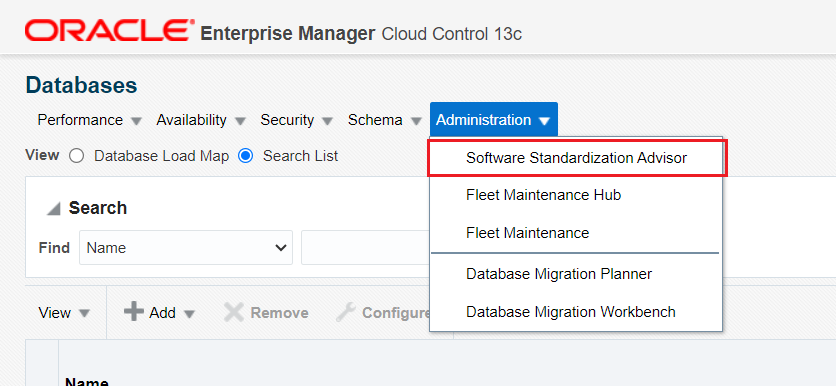

4.  Software Standardization Advisor shows two graphs depicting current configuration and recommended configuration.

    

    Graphs may look different from the ones represented in the workbook.
    A Software Configuration is identified by the database release, platform, and the patches installed on the target.

    In the analysis performed by the Software Configuration Advisor, it has identified that there are 6 unique software configurations in the environment (pie chart labeled “Current Unique Software Configurations”). The recommendation displayed is for only 2 Software Configurations (pie chart labeled “Recommended Software Configurations”).

    Next, we will review the report generated.


5.  On the same page, click on **Generate Report**. Select yes when it prompts to generate the report.
    


6.  On the same page, click on **Current Configurations** to open the Excel report.

    

    When you download the report, a warning on XLS format and file extension mismatch pops up (like below). Simply click on “Yes” to ignore the warning and open the file.

    

    Alternately, you might see a pop up for import options, while opening the file. Select OK and you should be able to view the contents of the file.

    

    From the report, you will see the current environment has six different Oracle home software versions.

    

    Incase you are unable to review the report in Livelab VNC, then open the environment url directly on your laptop browser and run the report again. Example: If you see instance IP address as 129.146.247.99, then the url to open on your browser will be https://129.146.247.99:7803/em .

    

    Please accept any warning message that your browser may show to continue to login to Enterprise Manager.

7.  Next, click on **Recommended Configurations** to open the Excel Report.

    

    <!-- The report recommends a reduction of the 5 configurations and standardizing the database estate to 2 configurations (18c and 19c). This means all Oracle homes for Release 18c should uptake the standard 18c configuration and the 19c Oracle homes the standard 19c configuration. -->

    The reports recommendation is to consolidate the configuration drift (pollution) from the current six database to two (18c and 19c). This recommendation would reduce the number of configurations and standardize the environment for easier management.

    

    The recommendation is based on a union of bugs included in the patches in all Oracle homes and based on the configuration type.

## Task 3: Database Server patching with Fleet maintenance (Overview)

### **Database Fleet Maintenance**

Enterprise Manager Database Fleet Maintenance is a Gold Image Target subscription based out of place patching solution. Gold Image(s) are software library entities storing archive of a patched software home. Targets, to be patched, subscribe to a relevant Gold Image. Target subscription persists through the lifecycle of the Target or Gold Image unless modified by an administrator.
    

### **Patching with Fleet Maintenance**

We will go through steps for update(patching) database target ***finance.subnet.vcn.oraclevcn.com***, currently at 19.17.0.0.0 version to 19.23.0.0.0.

1.  Return to the browser page with the Oracle Enterprise Manager Console (log back in if needed) and from the EM home page, select the ***Targets*** drop-down menu. Then, choose ***Databases*** to review the status and version of database targets.

    

Review version of ***finance.subnet.vcn.oraclevcn.com***.
    

## Task 4: Review Gold Image [Step Already Performed, Read-Only Step]

1. For this lab exercise, we have already created the gold image. To create or refresh a gold image, below are the high level steps:

-  Ensure that latest patch recommendations are uploaded within Enterprise Manager. This can be done either by uploading the patch catalog (this method is meant for those setups which are not internet facing) or by entering MOS credentials and automatically fetching the latest recommendations as and when done. For accuracy of this lab, we have followed approach 1.We suggest that you do not upload latest patch recommendations as this may impact the existing gold images, and you may not be able to complete the lab following the instructions manuals.
-  Review the list of patches recommended
-  Upload these patches in software library
-  Follow the workflow to refresh the gold images

2. From the Database page, navigate to the ***Administration*** drop-down menu and then select ***Fleet Maintenance Hub***.

    

    Click on middle Tile 2, which is **Patch Recommendations for Images**. Here we see two gold images. The highlighted one, ***19cDB-Linux-x64-Apps*** is a healthy image, which has all the patch recommendations. We will use this gold image to complete our patching activity in this lab.

    

7. Alternately, you can run emcli to list available Gold Images. Execute the following commands in the terminal to see the list of Gold Images available.

    To  retrieve Column values in same line, execute the below format command in terminal

    ```
    <copy>emctl set property -name oracle.sysman.dbprov.gis.emcli.verbs.tableLength -value 238</copy>
    ```
    This will prompt for sysman password. Enter
    ```
    <copy>welcome1</copy>
    ```
    Now execute below command to list out relevant information about existing gold images.
    ```
    <copy>emcli db_software_maintenance -getImages</copy>
    ```
    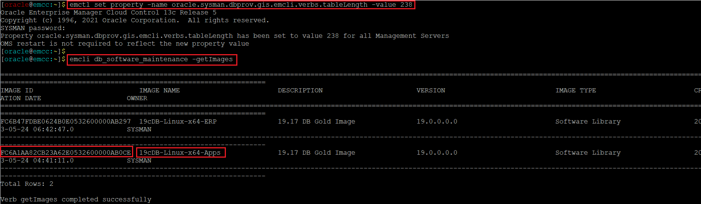
    IMAGE ID retrieved from the output of above command is used in further operations like Target Subscription.
    After retrieving a list of the available images, one can view a list of versions available for a specific image with the following command:
    If the image id for Gold Image ***19cDB-Linux-x64-APPS*** is same as above, then use the below command to get the version details of this image.

    ```
    <copy>emcli db_software_maintenance -getVersions -image_id=FC6A1AA82CB23A62E0532600000AB0CE</copy>
    ```   
    else, use the below command by inserting the appropriate value in the image id column.

    ```
    <copy>emcli db_software_maintenance -getVersions -image_id={Insert IMAGE ID from List available gold images}</copy>
    ```   
    This command lists Gold Image versions with their VERSION ID and STATUS.

    

    When a Gold Image is created for the first time, its first version is created as per the input and marked as current. Whenever we run a DEPLOY operation for a target, Gold Image version marked as CURRENT is used to deploy the new Oracle Home.

8.  Verify if Gold Image is Applicable

    This step verifies if the image can be used to patch a specified database target. This is done by comparing the bug fixes available in the current Oracle home of the database target and the image. In effect this check is run to identify patch conflicts.

    - If the image id for Gold Image ***19cDB-Linux-x64-APPS*** is same as above, then use the below command.

    ```
    <copy>emcli db_software_maintenance -checkApplicability -image_id=FC6A1AA82CB23A62E0532600000AB0CE -target_list=finance.subnet.vcn.oraclevcn.com -target_type=oracle_database > /home/oracle/applicability.out</copy>
    ```

    else, use the below command by inserting the appropriate value in the image id column.  

    ```
    <copy>emcli db_software_maintenance -checkApplicability -image_id={Insert IMAGE ID from List available gold images} -target_list=finance.subnet.vcn.oraclevcn.com -target_type=oracle_database > /home/oracle/applicability.out</copy>
    ```

    ```
    <copy>cat /home/oracle/applicability.out | more</copy>
    ```

    - Output of above emcli command is redirected to a file. You may review the output using any standard editor or tool of your choice.

    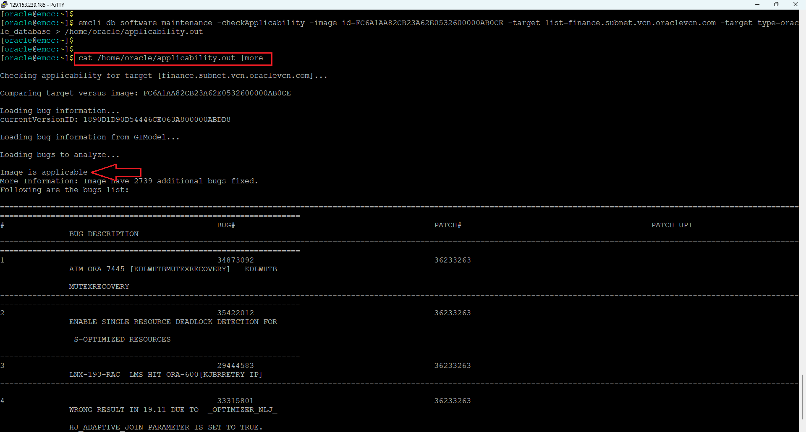

    This command can show one of the following results:

    - Applicable: The image and database target contain the same set of bug fixes. The image can be applied on the specified target.
    - Applicable and Image has more bug fixes: The image contains more bug fixes than those applied on the database. The list of extra bugs is displayed. The image can be applied on the specified target.
    - Not Applicable: The database contains more bug fixes than those included in the image. The list of missing bugs is displayed. The administrator has to create a new version of the image that includes the missing bugs before the database can uptake the same.

## Task 5: Subscribe Database

1.  We will subscribe database target ***finance.subnet.vcn.oraclevcn.com***, to the above suggested gold image ***19cDB-Linux-x64-Apps***.

2. Execute below command to subscribe the target hr.subnet.vcn.oraclevcn.com to Gold Image

    ```
    <copy>emcli db_software_maintenance -subscribeTarget -target_name=finance.subnet.vcn.oraclevcn.com -target_type=oracle_database -image_id=FC6A1AA82CB23A62E0532600000AB0CE</copy>
    ```
    If the image id is different, then use the below command by modifying the correct value for image id

    ```
    <copy>emcli db_software_maintenance -subscribeTarget -target_name=finance.subnet.vcn.oraclevcn.com -target_type=oracle_database -image_id={Insert IMAGE ID from List available gold images}</copy>
    ```

    Where:
   -  target\_name – Name of the Database target which needs to be patched
   -  target\_type – type of target to be patched. This should be oracle\_database in this case
   -  image\_id – ID of the Gold Image to which the target should be patched

    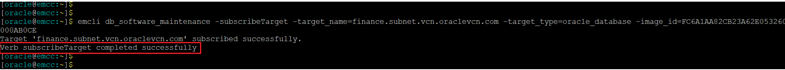

## Task 6: Deploy Image

1. Run the block below to deploy a new Oracle Home

    ```
    <copy>cd ~/fleet; sh deploy1923_finance.sh</copy>
    ```

    

    Where:
    -  NEW\_ORACLE\_HOME\_LIST = Absolute path to the File System location where new Oracle Home will be deployed.
    -  procedure\_name\_prefix = optional, prefix for the deployment procedure instance name
    -  name = Name of the operation. This is a logical name and should be kept unique
    -  purpose = There are standard purposes defined which can be performed by Fleet Operations. “DEPLOY\_DB\_SOFTWARE” is one of them. These are predefined and should not be changed. Admin shall select one of the below mentioned purposes as and when needed.
    -  normal\_credential = This should be provided in the format \{ Named Credential: Credential Owner\} .
    -  privilege\_credential = This should be provided in the format \{ Named Credential: Credential Owner\}
    -  start\_schedule = Schedule when the stage and deploy should start if that needs to be done in future. Format: “*start\_time:yyyy/mm/dd HH:mm*”. It’s an optional parameter, if not provided, operation will start immediately
    -  target\_type = The type of target being provided in this operation.
    -  target\_list =

         1.  This is a comma separated list of targets which need to be patched.
         2.  Targets of homogenous types are supported in a single fleet operation.
         3.  The system will calculate the unique list of hosts based on this target list and start stage of Oracle home software on those hosts.
         4.  If targets running from same Oracle home are provided in this list, the stage and deploy operation will be triggered only once and not for all targets.

3. Navigate to ***Enterprise >> Provisioning and Patching >> Procedure Activity*** to Review Execution Details of this operation via Enterprise Manager Console.

    

Click on ‘DEPLOY*’ run
    

4. Review the Procedure Activity steps performed.

    

## Task 7: Migrate Listener

1. Execute the following shell script to Migrate the Listener

    ```
    <copy>sh migrate_listener_finance_update.sh</copy>
    ```

    

2. Navigate to ***Enterprise >> Provisioning and Patching >> Procedure Activity*** to Review Execution Details of this operation via Enterprise Manager Console. Click on ‘Fleet\_migrate\_\*’ run

    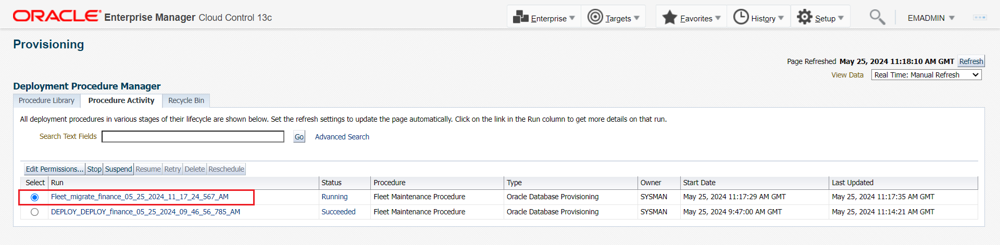

3. Review the Procedure Activity steps performed.  

    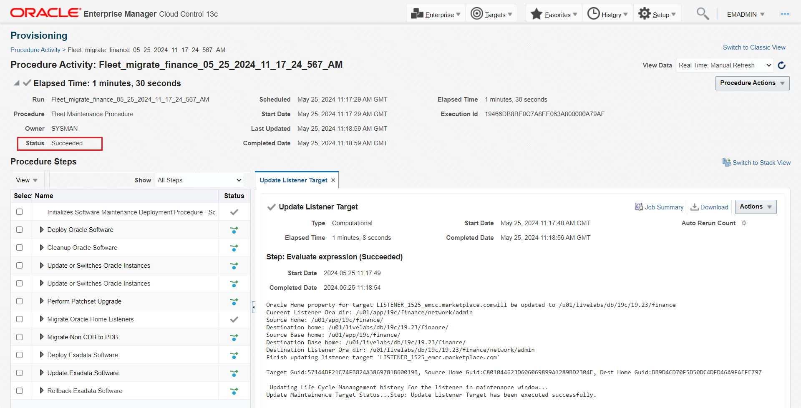

## Task 8: Update Database – Patch 19.17 to 19.23

1. Execute below shell script to update DB Target *finance.subnet.vcn.oraclevcn.com*

    ```
    <copy>sh update_finance.sh</copy>
    ```

    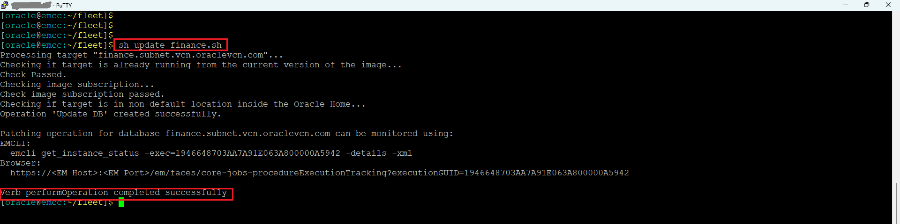

3. Navigate to the Procedure Activity Page and monitor the progress of this operation with ‘Fleet\_UPDATE\_...’ deployment procedure instance.

    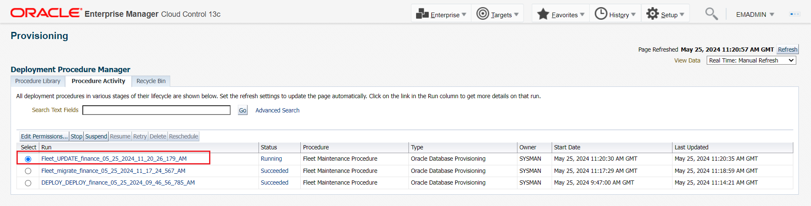

4. Review the Procedure Activity steps performed  

    

5. Verify the patched target by going to ***Targets >> Databases*** as shown below.

    

    Review the version of finance database.
    

## Task 9:  Rollback Database – Reversed Patch 19.23 to 19.17

Once the database is updated, we will perform a rollback to 19.17

1. Execute below shell script from the terminal to rollback DB Target ***finance.subnet.vcn.oraclevcn.com***

    ```
    <copy>sh rollback_finance.sh</copy>
    ```

    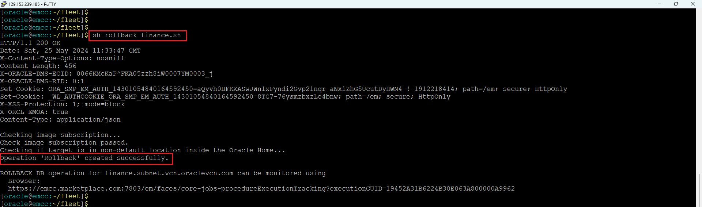

2. Navigate to the Procedure Activity Page and monitor the progress of this operation with ‘Fleet\_ROLLBACK\_...’ deployment procedure instance.

    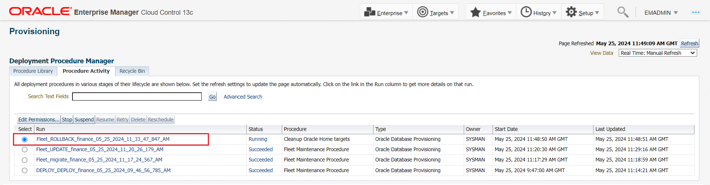

3. Review the Procedure Activity steps performed         

    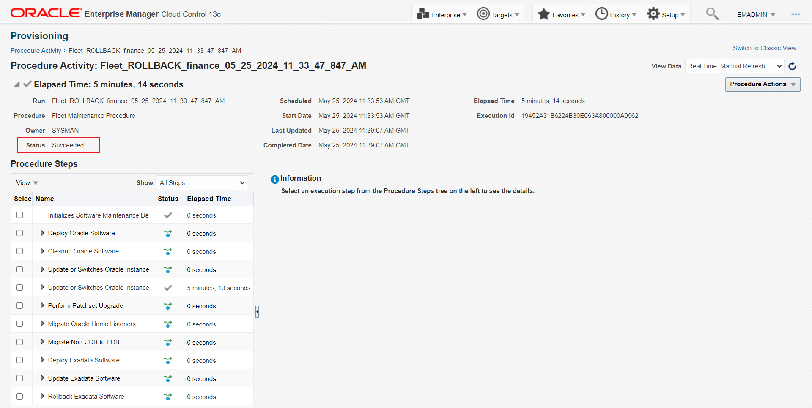

4. Verify the rolled back target by going to ***Targets >> Databases*** as shown
below.
    

Review the version of finance database.

    

## Task 10:  Cleanup Old Homes

1. Clean up Database finance

In order to have an old empty home previously used by “***finance.subnet.vcn.oraclevcn.com***” at our disposal to demonstrate a cleanup operation, we will now re-update the database by running the commands from Step 8.

2. Review and execute below command to update DB Target ***finance.subnet.vcn.oraclevcn.com*** again to 19.23 version

    ```
    <copy>sh update_finance.sh</copy>
    ```
    

3. Verify that the update has been completed successfully before proceeding with any cleanup action, Same as done in step \#8, this should complete within 10\~15 minutes.

    

4. Verify and confirm that the target has been re-patched to 19.23 by going to Targets Databases as shown below

    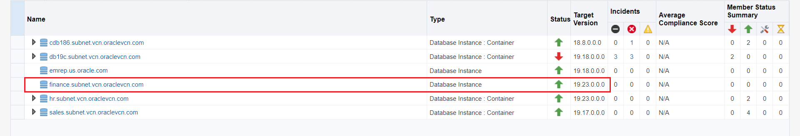

5. Execute the following command as a dry-run to report on cleanup impact for *finance.subnet.vcn.oraclevcn.com*  

    ```
    <copy>sh cleanup_finance_report.sh</copy>
    ```

    

6. Execute the following command to cleanup *finance.subnet.vcn.oraclevcn.com*   

    ```
    <copy>sh cleanup_finance.sh</copy>
    ```
    

7. Navigate to the Procedure Activity Page and monitor the progress of this operation with ‘CLEANUP\_SOFTWARE\_...’ deployment procedure instance.

    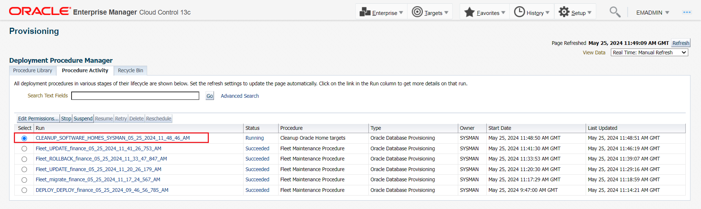

8. Review the Procedure Activity steps performed        

    

9. Verify to confirm the old Oracle Home has been removed

    ```
    <copy>ls -l /u01/app/19c/finance</copy>
    ```

    

This completes this lab.

You may now [proceed to the next lab](#next).

## Learn More
  - [Oracle Enterprise Manager](https://www.oracle.com/enterprise-manager/)
  - [Oracle Enterprise Manager Fleet Maintenance](https://www.oracle.com/manageability/enterprise-manager/technologies/fleet-maintenance.html)
  - [Enterprise Manager Documentation Library](https://docs.oracle.com/en/enterprise-manager/index.html)
  - [Database Lifecycle Management](https://docs.oracle.com/en/enterprise-manager/cloud-control/enterprise-manager-cloud-control/13.4/lifecycle.html)
  - [Database Cloud Management](https://docs.oracle.com/en/enterprise-manager/cloud-control/enterprise-manager-cloud-control/13.4/cloud.html)

## Acknowledgements
  - **Authors**
    - Romit Acharya, Oracle Enterprise Manager Product Management
  - **Last Updated By/Date** - Romit Acharya, Oracle Enterprise Manager Product Management, May 2024
