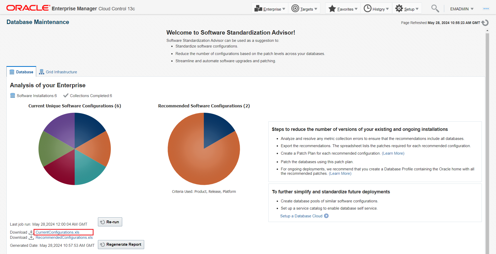
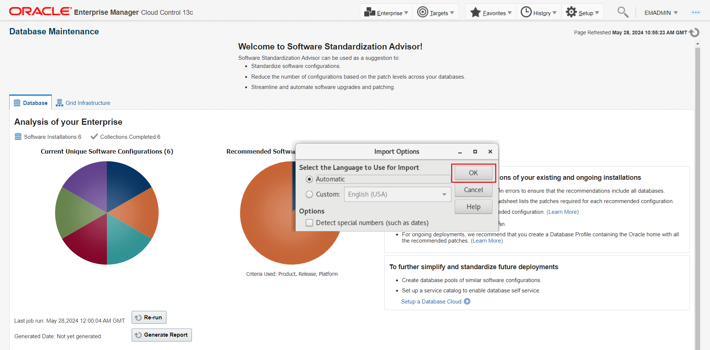
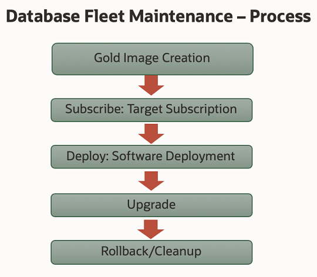
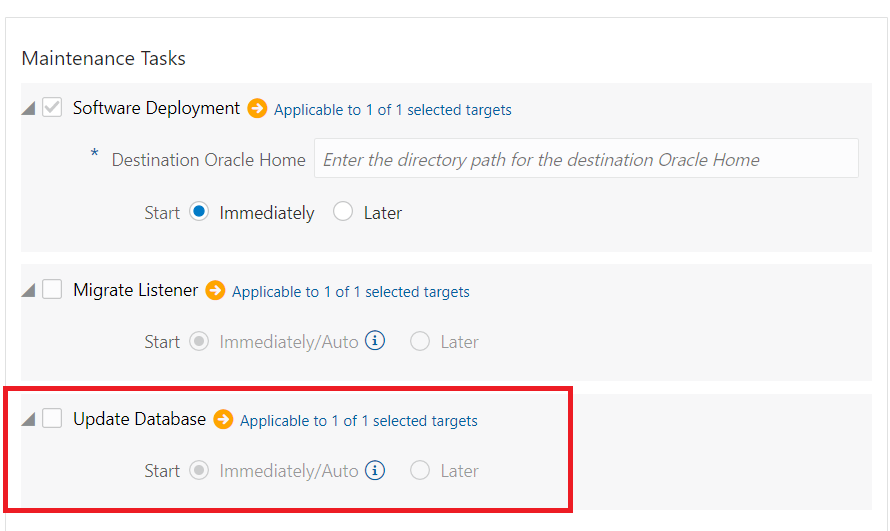
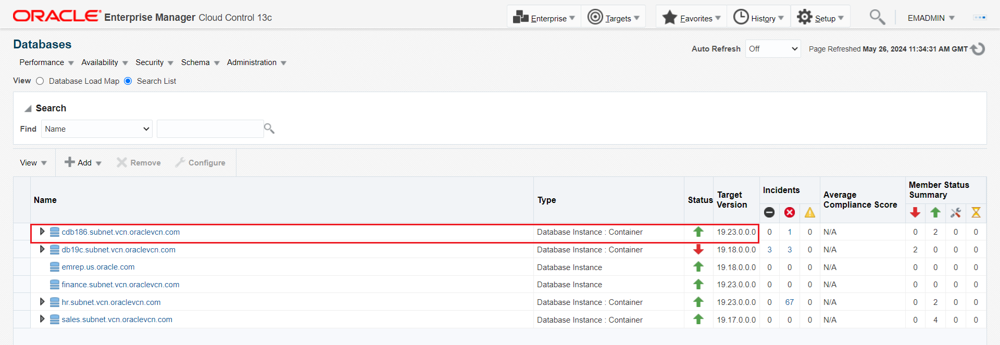

# Automated Database Upgrade at Scale with Fleet Maintenance UI

## Introduction
In this workshop, you will experience the benefits of using the Oracle Enterprise Manager Fleet Maintenance User Interface to automate the upgrade of multiple Oracle Databases in one flow.

*Estimated Time:* 60 minutes

Watch the video below for a quick walk-through of the lab.
[Automated Database Upgrade at Scale with Fleet Maintenance UI](videohub:1_61y8xusx)

### About the Database Fleet Maintenance UI capability in Oracle Enterprise Manager

Database Fleet Maintenance is an end-to-end automated solution for patching and upgrade of Oracle Databases. Fleet Maintenance enables DBAs to automate patching of a wide range of Oracle Database configurations including Oracle RAC environments with Data Guard Standby.

Starting with Enterprise Manager 13.5 RU1, EM offers a new interface to ease automated (update)patching, and upgrade of your database fleet.

Benefits of using the EM Fleet Maintenance capability include:
- Minimizing downtime with use of Out of Place patching
- Enterprise scalability using the Enterprise Manger Deployment Procedures Framework
- A single pane of glass for monitoring and managing the entire patching and upgrade operations
- Ability to schedule/retry/suspend/resume operations
- Patch Oracle Databases across different infrastructure including engineered systems like Oracle ExaCC

  


### Objectives

In this lab you will perform the following steps:

| Step No. | Feature                                                   | Approx. Time | Details                                                                                                              | Value Proposition |
|----------------------|-----------------------------------------------------------|-------------|----------------------------------------------------------------------------------------------------------------------|-------------------|
| 1                    | Detect Configuration Pollution                            | 10 minutes  | Analyze the database estate using Software Standardization.                                                          | Provides recommendation to run minimum version of databases to ease your maintenance activities.                  |
| 2                    | Oracle Database Upgrade with Fleet Maintenance | 50 minutes   | Upgrade your Oracle Database Software at scale with minimal downtime using Oracle Enterprise Manager 13c Fleet Maintenance. | Demonstrate key capabilities and features of Fleet Maintenance to upgrade Oracle Database.                  |

### Prerequisites
- A Free Tier, Paid or LiveLabs Oracle Cloud account
- You have completed:
    - Lab: Prepare Setup (*Free-tier* and *Paid Tenants* only)
    - Lab: Environment Setup
    - Lab: Initialize Environment

*Note*: This lab environment is setup with Enterprise Manager Cloud Control Release 13.5 and Oracle Database 19.10 as Oracle Management Repository. Workshop activities included in this lab will be executed both locally on the instance using Enterprise Manager Command Line Interface (EMCLI) or Rest APIs, and the Enterprise Manager console (browser)

## Task 1: Performed in Advance

To save time, the following steps were already completed.

1. Gold Image of Oracle Database 19.17 release was imported that will be used in this lab.

2. Imported Gold Image name is *19cDB-Linux-x64-ERP*

## Task 2: Detect Configuration Pollution with Software Standardization Advisor

This exercise enables us to analyze the database estate using Software Standardization.

Software Standardization Advisor enables administrators to understand various database configurations prevailing in their environment. Each deployment with a unique platform, release and patch level is identified as a distinct configuration. This provides the administrators a view of the configuration pollution in their estate. It also analyzes and provides a recommendation to standardize the environment and reduce the number of configurations required for managing the database estate.

  <!--  -->

  

1.  On the browser page when the Enterprise Manager Cloud Control 13c login can be seen, copy and paste or type in these username and password credentials into the fields.

    ```
    Username: <copy>sysman</copy>
    ```

    ```
    Password: <copy>welcome1</copy>
    ```

    

2.  After successful login, in the upper toolbar, locate the ***Targets*** icon and click the drop-down menu and then select ***Databases***.

    

3.  On the Databases targets page, click on the ***Administration*** tab, drop down the menu, and select Software ***Standardization Advisor***

    

4.  Software Standardization Advisor shows two graphs depicting current configuration and recommended configuration.

    

    Graphs may look different from the ones represented in the workbook.
    A Software Configuration is identified by the database release, platform, and the patches installed on the target.


    In the analysis performed by the Software Configuration Advisor, it has identified that there are 5 unique software configurations in the environment (pie chart labeled “Current Unique Software Configurations”). The recommendation displayed is for only 2 Software Configurations ( pie chart labeled “Recommended Software Configurations”).

    Next, we will review the report generated.

5.  On the same page, click on **Generate Report**.
    
6.  On the same page, click on **Current Configurations** to open the Excel report.

    

    When you download the report, should a warning on XLS format and file extension mismatch pop up (like below). Simply click on “Yes” to ignore the warning and open the file.

    

    Alternately, you might see a pop up for import options, while opening the file. Select OK and you should be able to view the contents of the file.

    

    From the report, you will see the current environment has six different Oracle home software versions.

    

    Incase you are unable to review the report in Livelab VNC, then open the environment url directly on your laptop browser and run the report again. Example: If you see instance IP address as 129.146.247.99, then the url to open on your browser will be https://129.146.247.99:7803/em .

    

    Please accept any warning message that your browser may show to continue to login to Enterprise Manager.
7.  Next, click on **Recommended Configurations** to open the Excel Report.

    

    <!-- The report recommends a reduction of the 5 configurations and standardizing the database estate to 2 configurations (18c and 19c). This means all Oracle homes for Release 18c should uptake the standard 18c configuration and the 19c Oracle homes the standard 19c configuration. -->

    The reports recommendation is to consolidate the configuration drift (pollution) from the current five database to two (18c and 19c). This recommendation would reduce the number of configurations and standardize the environment for easier management.

    

    The recommendation is based on a union of bugs included in the patches in all Oracle homes and based on the configuration type.


  <!-- This completes Step 1. In this section, you learned how to perform the following:

  - Access the Database Software Standardization Advisor
  - View Configuration summary
  - Generate and download current and recommended configuration reports

  In the next section we will follow these recommendations to perform the following using Enterprise Manager 13c Fleet Maintenance.
  - Patch database “finance.subnet.vcn.oraclevcn.com” from 18.8 to 18.10 [READ-ONLY– This step has already been implemented]
  - Upgrade “finance.subnet.vcn.oraclevcn.com” from 18.10 to 19.7 -->


## Task 3: Oracle Database Upgrade with Fleet Maintenance (Overview)

### **Database Fleet Maintenance**

Enterprise Manager Database Fleet Maintenance is a Gold Image Target subscription-based Out of Place patching solution. Out of Place patching is a method where patching is performed by creating a copy of the Oracle home, applying patches to the copied home, and then switching services to the copied home.
A gold image is the end of state software definition that contains information about the base software version plus the additional patches. Targets, to be upgraded, subscribe to a relevant Gold Image. Target subscription persists through the lifecycle of the Target or Gold Image unless modified by an administrator.


   <!-- -->

   
### **Upgrading with Fleet Maintenance**

We will go through steps for upgrading database target ***cdb186.subnet.vcn.oraclevcn.com***, a Container Database currently at 18.8.0.0.0. The goal is to upgrade this target to 19.17.0.0.0.

1. Return to the browser page with the Oracle Enterprise Manager Console (log back in if needed) and from the EM home page, select the ***Targets*** drop-down menu and select ***Databases*** to review the status and version of database targets.

    

    

    You will see the *cdb186.subnet.vcn.oraclevcn.com* database.

## Task 4: Create Gold Image [Step Already Performed, Read-Only Step]

1. For this lab exercise, we have already created the gold image. To create a gold image, we exported the gold image from another environment and imported it in the setup. You can find further details on export-import of gold images in the Fleet Documentation.

    Gold Image represents a software end state. An Enterprise Manager Software Library Gold Image is a software archive created from a patched oracle home uploaded to EM Software Library.

    To review the Gold Images, we will check the deployment procedure logs.

2. From the Enterprise Manager menu bar, navigate to the ***Enterprise*** drop-down menu and then select ***Provisioning and Patching***. Then select ***Procedure Activity***.

    

    Lets do a filter using keyword ***Import***. This will result in only DPs which were executed to import the Gold Image. Click on the highlighted DP name.

    

    Here, you will see we have highlighted details of the parameters which were passed during the import process. For more details, please refer to the documentation.
    

3. From the terminal on your remote desktop, review the Gold Images using the following emcli command

    If you encounter session timeout error, copy paste the below command to re-login as sysman and re-establish the session.

        ```
        <copy>emcli login -u=sysman -p=welcome1</copy>
        ```

    

    If you encounter session timeout error elsewhere in the lab, you can copy and paste the above command in the terminal and continue.

    Default window size of terminal will render output in multiple lines. Its is thus recommended to increase the terminal window size by clicking on maximize option.

    

    Execute the following command to increase the column width.
    ```
    <copy>emctl set property -name oracle.sysman.dbprov.gis.emcli.verbs.tableLength -value 210 -sysman_pwd "welcome1"</copy>
    ```
    

    Now, we can execute the get images command and it will return output in single line. Execute the following commands in the terminal to see the list of Gold Images available for deployment, locate ‘19cDB-Linux-x64-ERP’ in the emcli command output:

    ```
    <copy>emcli db_software_maintenance -getImages</copy>
    ```

    

    IMAGE ID retrieved from the output of above command is used in further operations like Target Subscription.

    After retrieving a list of the available images, one can view a list of versions available for a specific image with the following command:

    If the image id is same as the one highlighted above, you may use the below command. First, we will again resize the column width.
    ```
    <copy>emctl set property -name oracle.sysman.dbprov.gis.emcli.verbs.tableLength -value 240 -sysman_pwd "welcome1"</copy>
    ```
    ```
    <copy>emcli db_software_maintenance -getVersions -image_id=FC6B47FDBE0624B0E0532600000AB297</copy>
    ```   

    else make changes in the below command and execute it.

    ```
    <copy>emcli db_software_maintenance -getVersions -image_id={Insert IMAGE ID from List available gold images}</copy>
    ```   

    This command lists Gold Image versions with their VERSION ID and STATUS.

    

    When a Gold Image is created for the first time, its first version is created as per the input and marked as current. Whenever we run a DEPLOY operation for a target, Gold Image version marked as CURRENT is used to deploy the new Oracle home.

    In our Lab, we want to upgrade ***cdb186.subnet.vcn.oraclevcn.com*** to 19.17 version. From the above output we can see that 19.17 version is at Current status, which will be used to deploy the new Oracle Home.

## Task 5: Subscribe Database

1. Before we deploy a new Oracle home, we need to ensure that we subscribe cdb186 database to the desired Gold Image, which is ‘19cDB-Linux-x64-ERP’.

2. Execute below command to subscribe the target cdb186.subnet.vcn.oraclevcn.com to Gold Image

    If the image id is same as the one highlighted above (Task 4, step 3), you may use the below command:
    ```
    <copy>emcli db_software_maintenance -subscribeTarget -target_name=cdb186.subnet.vcn.oraclevcn.com -target_type=oracle_database -image_id=FC6B47FDBE0624B0E0532600000AB297</copy>
    ```

    else

    ```
    <copy>emcli db_software_maintenance -subscribeTarget -target_name=cdb186.subnet.vcn.oraclevcn.com -target_type=oracle_database -image_id={Insert IMAGE ID from List available gold images}</copy>
    ```

    Where:
   -  target\_name – Name of the Database target which needs to be patched
   -  target\_type – type of target to be patched. This should be oracle\_database in this case
   -  image\_id – ID of the Gold Image to which the target should be patched

    


## Task 7: Deploy Image

1. As we have completed the pre-requisite task (associating database to image in Task 6), we can now upgrade the cdb186 database. From the Enterprise Manager menu bar, navigate to the ***Targets*** drop-down menu and then ***Databases***

    

    and, then from ***Administration*** drop-down menu select ***Fleet Maintenance***

    

    In order to complete the deployment of new image, we need to modify named credential root and set its scope to global. This can be achieved by running the below command in terminal.

    ```
   <copy>emcli modify_named_credential -cred_name=root -cred_scope=global</copy>
    ```

   

2. In this page, we will select relevant ***Image Name***, ***Target Type*** and ***Operation***.

    

    Where:
    -  Image = Desired version of Oracle home, which our target database should run after successful completion of operation. In this example, we will select ***19cDB-Linux-x64-ERP***.
    -  Target Type = Desired target type, which can be Grid, RAC or SIDB. In this example, we will select ***Database Instance***.
    -  Operation = Name of the operation, which can be update (patch) or upgrade. In this example, we will select ***Upgrade***.
    -  Type to filter = Selection criteria to highlight only those targets which qualify the selection, such as database naming.

3. In this page, we will provide ***new Oracle home location***, select which ***tasks*** can be performed, select ***credential model***, provide ***log file location*** under options and select any   ***custom scripts*** to run as part of the operation.

    

    We can enter following values
    Under Maintenance tasks
        Destination Oracle Home as
        ```
        <copy>/u01/livelabs/db/19c/19.17/cdb186</copy>
        ```
    Check both Migrate Listener and Update Database options
    Under Credentials (We have already created these credentials in Enterprise Manager for this workshop. Please choose Named for all the below three options and from the dropdown menu, you can opt for values as suggested below)    
    -  Normal Host Credentials as ***ORACLE***
    -  Privileged Host Credentials as ***ROOT***
    -  SYSDBA Database Credentials as ***SYS_SALES***
    -  Under Options section, select ***Yes*** for Skip Cluster Verification Utility Checks.

    Deployment of new Oracle home does not impact existing Oracle home and hence it is scheduled to run immediately. We can schedule it to run at a different time by selecting later in start schedule and providing new time to run this operation.

    Once deployment of new Oracle home is complete, the Deployment Procedures for migrate listener and update database will execute immediately ( if we have selected start as Immediately/Auto ).

4. Click Validate and a pop-up will appear. We can validate our entries (new Oracle home, log file location, credentials) of previous page and validate the desired operation. Validation acts as a precheck before we submit the main operation.  There are two validation modes Quick and Full. We can select either of these. Full validation mode submits a deployment procedure. In this case choose Quick validation and click on Validate.

    

5. Review the validation result.

    

    In case of any error, we can fix it and choose revalidate. Click on Close.

6. ***Submit*** the operation. A new pop-up will appear.
    We need to provide a name to the task, which will help us to view these tasks under Procedure Activity Page. Lets enter

    ```
    <copy>cdb186-upgrade</copy>
    ```

    Click on submit.
    

Clicking on Monitor Progress will take us to Procedure Activity Page. Alternate navigation to review the submitted deployment procedures is ***Enterprise >> Provisioning and Patching >> Procedure Activity***
    

7. Review the Deployment Procedures (DP).

    Under Search Text field, you may enter cdb to ensure we see DPs which are related to our operation only. Select the DP related to Deploy and click on it.
    

    It will show details of the activity performed by the DP.
    


## Task 8: Migrate Listener to New Upgraded home

1. In task 7 (above), we submitted a task to migrate the listener. If this task needs to be submitted separately, then you need to uncheck migrate listener task (review step 3 of task 6).
    

    The image below shows the task is in a running state.

    
    Select the running task to see the various steps performed.

    
    We can now see that the migration operation completed successfully.

## Task 9: Update Database – Upgrade to 19.17

After the deploy operation and migrate listener task have completed successfully, we are ready to run the final UPDATE operation which will upgrade the cdb186 database by switching it to the newly deployed home.

1.  Similar to migrate listener, we also submitted Update Database in task 7. If this needs to be submitted separately, then we had to uncheck update database task ( review step 3 of task 7).
    

    The image below shows the task is in a running state.

    
    Select the running task to see the various steps performed.

    
    Update operation has completed successfully.

    

    Lets validate the version of ***cdb186*** database. In the upper toolbar, locate the ***Targets*** icon and click the drop-down menu and then select ***Databases***. We can see the updated version of ***cdb186*** database.
    
## Task 10: Cleanup Old homes

1. Review and execute the following command as a dry-run to report on cleanup impact for *cdb186.subnet.vcn.oraclevcn.com*  

    ```
    <copy>emcli db_software_maintenance -performOperation -name="Cleanup old oracle homes" -purpose=CLEANUP_SOFTWARE -target_type=oracle_database -normal_credential=ORACLE:SYSMAN -privilege_credential=ROOT:SYSMAN -target_list=cdb186.subnet.vcn.oraclevcn.com -workDir=/tmp -reportOnly=true</copy>
    ```

    **OR**

    ```
    <copy>sh cleanup_cdb186_report.sh</copy>
    ```

    

2. Review and execute the following command to cleanup *cdb186.subnet.vcn.oraclevcn.com*  

    ```
    <copy>emcli db_software_maintenance -performOperation -name="Cleanup old oracle homes" -purpose=CLEANUP_SOFTWARE -target_type=oracle_database -normal_credential=ORACLE:SYSMAN -privilege_credential=ROOT:SYSMAN -target_list=cdb186.subnet.vcn.oraclevcn.com -workDir=/tmp</copy>
    ```

    **OR**

    ```
    <copy>cd ~/fleet
    sh cleanup_cdb186.sh</copy>
    ```

    

3. Navigate to the Procedure Activity Page(***Enterprise >> Provisioning and Patching >> Procedure Activity***) and monitor the progress of this operation with ‘CLEANUP\_SOFTWARE\_...’ deployment procedure instance.

    

4. Review the DP for its completion.

    

5. Verify that the old Oracle homes reported have been removed

    ```
    <copy>ls -ltr /u01/app/cdb186/cdb186</copy>
    ```

  

6. As part of the cleanup operation, *LISTENER\_1524* which support *“cdb186.subnet.oraclevcn.com”* is shutdown. Set your environment by passing *“cdb186”* to *“oraenv”* when prompted.

    ```
    <copy>. oraenv</copy>
    ```
7. start listener *LISTENER\_1524* back up

    ```
    <copy>lsnrctl start LISTENER_1524</copy>
    ```

    

8. Force Listener registration and confirm that it is now servicing “*cdb186.subnet.vcn.oraclevcn.com*”

    ```
    <copy>sqlplus '/as sysdba'<<EOF
    alter system register;
    EOF
    </copy>
    ```
9. Check status of LISTENER\_1524

    ```
    <copy>lsnrctl status LISTENER_1524</copy>
    ```

    


That completes the Automated Database Upgrade at Scale with Fleet Maintenance UI workshop.

<!-- In this lab, you learned how to perform the following:
- Create Oracle Database Software Gold Image
- Subscribe Database to Gold Image
- Deploy Gold Image to Database Host
- Migrate Oracle Database Listener from old Oracle home to newly Deployed Oracle home
- Update (Patch) Database from 18.8 to 18.10
- Add new Version to an Existing Oracle Database Software Gold Image
- Deploy new Gold Image Version to Database Host
- Update (Upgrade) Database from 18.10 to 19.7
- Clean up old Oracle homes -->

You may now proceed to the next lab.

## Learn More
  - [Oracle Enterprise Manager](https://www.oracle.com/enterprise-manager/)
  - [Oracle Enterprise Manager Fleet Maintenance](https://www.oracle.com/manageability/enterprise-manager/technologies/fleet-maintenance.html)
  - [Enterprise Manager Documentation Library](https://docs.oracle.com/en/enterprise-manager/index.html)
  - [Database Lifecycle Management](https://docs.oracle.com/en/enterprise-manager/cloud-control/enterprise-manager-cloud-control/13.5/lifecycle.html)
  - [Database Cloud Management](https://docs.oracle.com/en/enterprise-manager/cloud-control/enterprise-manager-cloud-control/13.5/cloud.html)

## Acknowledgements
  - **Authors**
    - Romit Acharya, Oracle Enterprise Manager Product Management
    - Anand Prabhu, Oracle Enterprise Manager Product Management
  - **Last Updated By/Date** -Romit Acharya, Oracle Enterprise Manager Product Management, June 2023
