# Automated Database Upgrade at Scale with Fleet Maintenance

## Introduction
The objective of this lab is to explore upgrading your Oracle Database Software at scale with minimal downtime using Oracle Enterprise Manager 13c Fleet Maintenance.

*Estimated Lab Time:* 75 minutes

Watch the video below for a quick walk through of the lab.
[](youtube:SbsS_nNiXHo)

### About Fleet Maintenance

Database Fleet Maintenance is an end-to-end automated solution for patching and upgrade of Oracle Database. Fleet Maintenance enables DBAs to automate patching of wide range of DB Configurations including Oracle RAC environments with Data Guard Standby.

Benefits with Fleet Maintenance:
- Minimum Downtime with Out of Place patching
- Enterprise Scale with Enterprise Manger Deployment Procedures Framework
- Single pane of glass for monitoring and managing entire patching and upgrade operations
- Ability to schedule/retry/suspend/resume
- Database patching across different infrastructure including engineered systems like Exadata

  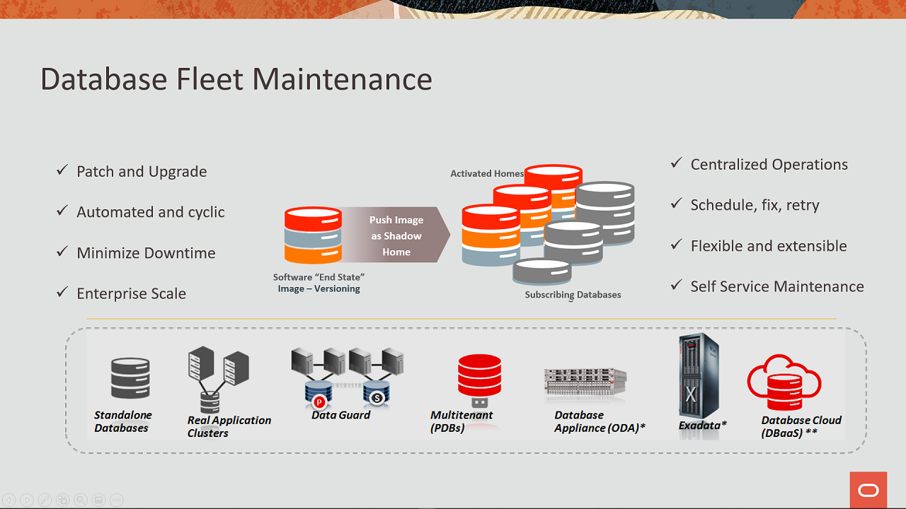


### Objectives

In this lab you will perform the following steps:

| Step No. | Feature                                                   | Approx. Time | Details                                                                                                              | Value Proposition |
|----------------------|-----------------------------------------------------------|-------------|----------------------------------------------------------------------------------------------------------------------|-------------------|
| 1                    | Detect Configuration Pollution                            | 10 minutes  | Analyze the database estate using Software Standardization.                                                          |                   |
| 2                    | Oracle Database Upgrade with Fleet Maintenance | 1hr 5 min   | Upgrade your Oracle DB Software at scale with minimal downtime using Oracle Enterprise Manager 13c Fleet Maintenance |                   |

### Prerequisites
- A Free Tier, Paid or LiveLabs Oracle Cloud account
- You have completed:
    - Lab: Prepare Setup (*Free-tier* and *Paid Tenants* only)
    - Lab: Environment Setup
    - Lab: Initialize Environment

*Note*: This lab environment is setup with Enterprise Manager Cloud Control Release 13.5 and Database 19.10 as Oracle Management Repository. Workshop activities included in this lab will be executed both locally on the instance using Enterprise Manager Command Line Interface (EMCLI) or Rest APIs, and the Enterprise Manager console (browser)

## Task 1: Review Tasks Completed in Advance

In the interest of simplifying the setup and save time, the following steps were completed in advance and covered in this lab. Please review accordingly for reference

1. Created and pre-patched an Oracle Home with 18.10 release using which will be use to create the gold image [/u01/app/oracle/product/18/db\_home\_src, Orasidb18c\_home1\_2020\_05\_13\_04\_10\_9\_emcc.marketplace.com\_3192]

2. Created a pre-patched Oracle Home with 19.7 release using which we will create the gold image [/u01/app/oracle/product/19/db\_home\_src, Orasidb19c\_home1\_2020\_05\_13\_04\_24\_10\_emcc.marketplace.com\_2953]

3. Created of the first version of “Tier\#1” Gold Image

4. Subscription of *finance.subnet.vcn.oraclevcn.com* Database to above image

5. Patching of *finance.subnet.vcn.oraclevcn.com* Database from 18.8 to 18.10 using Fleet Maintenance

We recommend that you read through each of the steps, review the *emcli* command, its verbs and deployment procedures to get an understanding of what it takes to do it from scratch. For a full end-to-end hands-on execution of “patching” lab, we highly recommend the *Automated Database Patching at Scale with Fleet Maintenance* Lab.

To ensure smooth execution of the intended use cases, we have pre-hosted the scripts to be used later at */home/oracle/fleet*

## Task 2: Detect Configuration Pollution with Software Standardization Advisor

This exercise enables us to analyze the database estate using Software Standardization.

Software Standardization Advisor enables administrators to understand various database configurations prevailing in their environment. Each deployment with a unique platform, release and patch level is identified as a distinct configuration. This provides the administrators a view of the configuration pollution in their estate. It also analyzes and provides a recommendation to standardize the environment and reduce the number of configurations required for managing the database estate.

  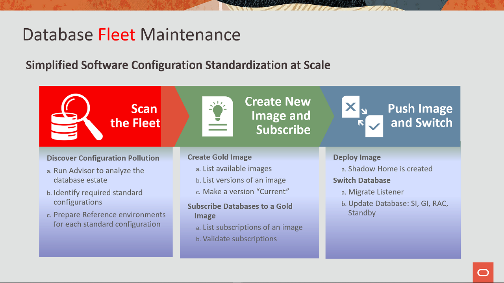

1.  On the browser window on the right preloaded with *Enterprise Manager*, if not already logged in, click on the *Username* field and login with the credentials provided below.

    ```
    Username: <copy>sysman</copy>
    ```

    ```
    Password: <copy>welcome1</copy>
    ```

    

2.  Click on ***Targets >> Databases***.

    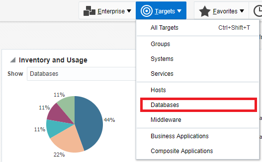

3.  In the Databases targets page, click on ***Administration >> Software Standardization Advisor***

    

4.  Software Standardization Advisor shows two graphs depicting current configuration and recommended configuration.

    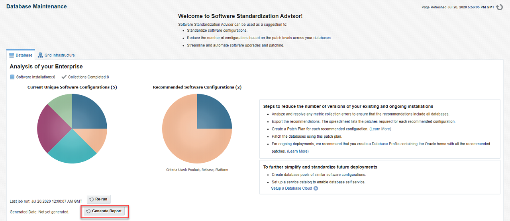

    A Software Configuration is identified by Database Release, Platform and set of Patches installed on the target.

    The Software Configuration Advisor run shows that there are 5 Unique Software Configurations in the environment as shown in the pie chart labelled as “Current Unique Software Configurations” and recommendation is to maintain 2 Software Configurations as shown in the pie chart labelled as “Recommended Software Configurations”.

    Let us observe details of the reports in next steps.

5.  Click on **Generate Report**.

6.  Click on **Current Configurations** to open the Excel report.

    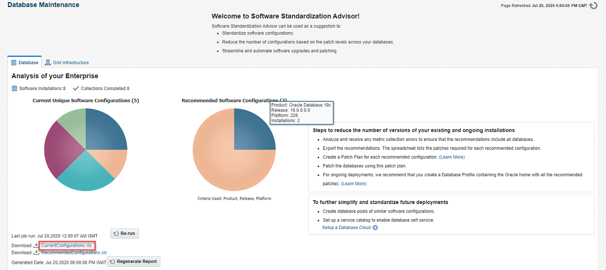

    When opening the downloaded Excel Spreadsheet report, a warning on XLS format and file extension mismatch may pop up (see below). Simply click on “Yes” to
    ignore the warning and open the file.

    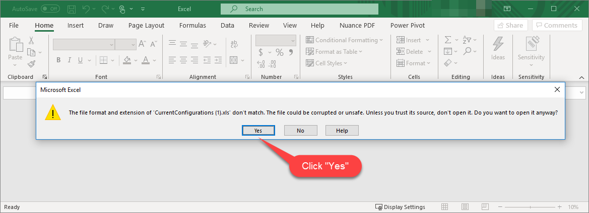

    Current Configuration shows five different Oracle home software versions

    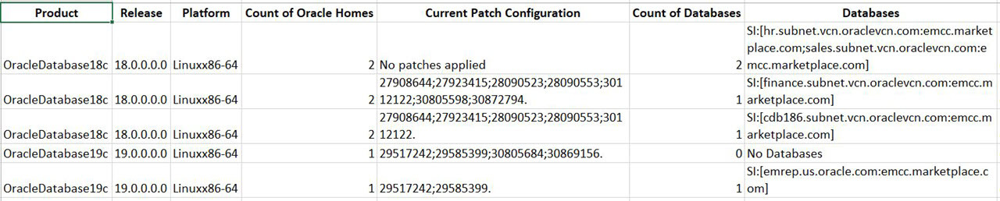

7.  Next, click on **Recommended Configurations** to open the Excel Report.

    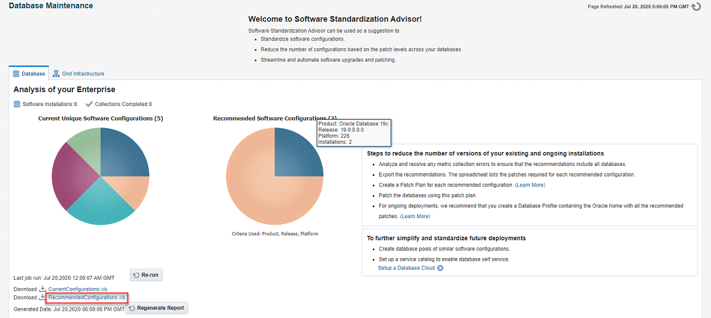

    The EM Recommended Configuration report recommends reducing 5 configurations and standardizing the database estate on 2 configurations, one based on 18c and the other based on 19c. This means All Oracle Homes of Release 18c should uptake the corresponding 18c configuration and the 19c homes will use the one based on Release 19c

    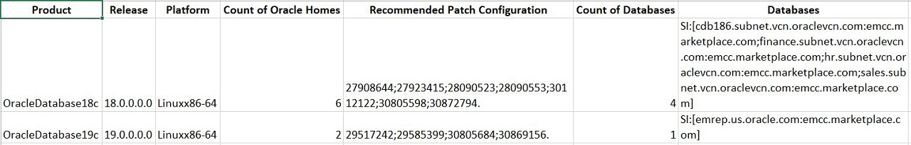

    Recommendation is based on union of all bugs included in the Patches in all OHs and based on configuration type.

  <!-- This completes Step 1. In this section, you learned how to perform the following:

  - Access the Database Software Standardization Advisor
  - View Configuration summary
  - Generate and download current and recommended configuration reports

  In the next section we will follow these recommendations to perform the following using Enterprise Manager 13c Fleet Maintenance.
  - Patch database “finance.subnet.vcn.oraclevcn.com” from 18.8 to 18.10 [READ-ONLY– This step has already been implemented]
  - Upgrade “finance.subnet.vcn.oraclevcn.com” from 18.10 to 19.7 -->


## Task 3: Oracle Database Upgrade with Fleet Maintenance (Overview)

### **Database Fleet Maintenance**

Enterprise Manager Database Fleet Maintenance is a Gold Image Target subscription based out of place patching solution. Gold Image(s) are software library entities storing archive of an upgraded software home. Targets, to be upgraded, subscribe to a relevant Gold Image. Target subscription persists through the lifecycle of the Target or Gold Image unless modified by an administrator. We will go through the following steps for this Fleet Maintenance Exercise.

  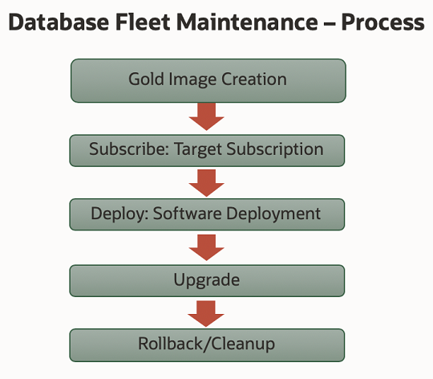

### **Upgrading with Fleet Maintenance**

We will go through steps for upgrading database target ***finance.subnet.vcn.oraclevcn.com***, a Single Instance Database currently at 18.10.0.0.0 version that was previously patched from 18.8.0.0.0 using Fleet Maintenance. The goal is to upgrade this target to 19.7.0.0.0.

1.  Log on to Enterprise Manager Console and review the status and version of DB Target.

    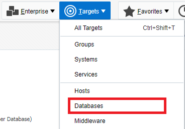

    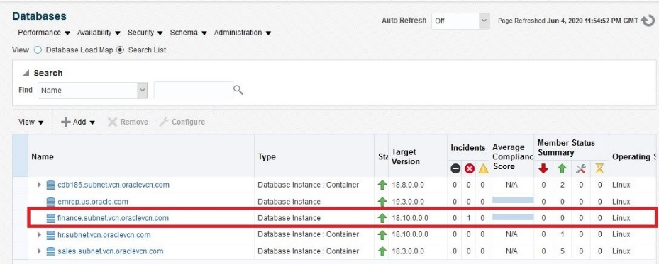

    You will see *finance.subnet.vcn.oraclevcn.com*. If target status is ‘DOWN’, start the target (using */home/oracle/start\_db\_finance.sh*).

## Task 4: Review Pre-Completed Patching Tasks

In this **[READ ONLY]** section, specific tasks related to patching on the target DB to be upgraded have already been performed using Fleet Maintenance. These tasks are fully covered by the  *Automated Database Patching at Scale with Fleet Maintenance* Lab and are listed here for your information only

### **Create Gold Image** [READ-ONLY– This step has already been implemented]

1. Review reference home setup

  Gold Image represents a software end state. An Enterprise Manager Software Library Gold Image is a software archive created from a patched oracle home uploaded to EM Software Library. Steps in this section are already implemented and are available here for review.

  In order to create a Gold Image of the ‘recommended patch configuration’, you need to manually create such an Oracle Home as a pre-requisite step.

  As the goal of this lab is to upgrade Database target from 18.10 to 19.7, a reference Oracle home fully patched to 18.10 *[Orasidb18c\_home1\_2020\_05\_13\_04\_10\_9\_emcc.marketplace.com\_3192, /u01/app/oracle/product/18/db\_home\_src]* was created and used to create the initial version of the Gold Image as further described in the next steps.

  This reference Oracle Home is discovered in Enterprise Manager as shown below and will be used for Gold Image Creation.

2. Navigate to “***Targets >> All Targets***” and type in “*Orasidb18c\_home1\_2020\_05\_13\_04\_10\_9\_emcc.marketplace.com\_3192*” in the “*Search Target Name*” box.

    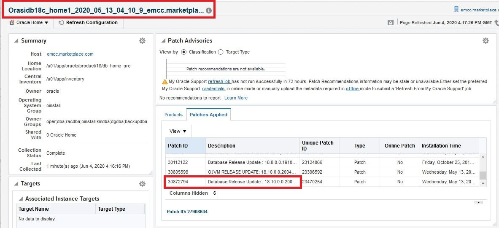

3. Review “Create New Gold Image” from the terminal on your remote desktop using the following emcli command

    ```
    <copy>cd fleet
    cat create_image_Tier1_sidb_x64.sh</copy>
    ```

    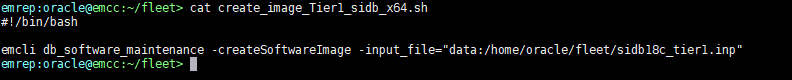

3. List Available Gold Images. Execute the following commands from the terminal to see the list of Gold Images available for deployment, locate ‘Tier \#1 SI DB Linux64*’* in the emcli command output:

    ```
    <copy>emcli db_software_maintenance -getImages</copy>
    ```

    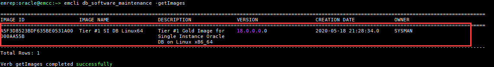

    IMAGE ID retrieved from the output of above command is used in further operations like Target Subscription. After retrieving a list of the available images, one can view a list of versions available for a specific image with the following command:

    ```
    <copy>emcli db_software_maintenance -getVersions -image_id=A5F3D8523BDF635BE0531A00000AA55B</copy>
    ```

    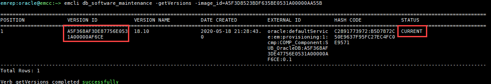

    When a Gold Image is created for the first time, its first version is created as per the input and marked as current. Whenever we run a DEPLOY operation for a target, Gold Image version marked as CURRENT is used to deploy the new Oracle Home.

4. Verify if Gold Image is Applicable.
This step verifies if the image can be used to patch a specified database target. This is done by comparing the bug fixes available in the current Oracle home of the database target and the image. In effect this check is run to identify patch conflicts.

    - Review and execute below emcli command:  
    ```
    <copy>emcli db_software_maintenance -checkApplicability -image_id="A5F3D8523BDF635BE0531A00000AA55B" -target_list=finance.subnet.vcn.oraclevcn.com -target_type=oracle_database</copy>
    ```

    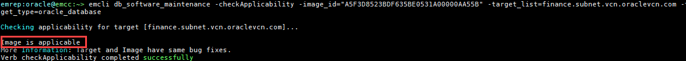

    This command can show one of the following results:

    - **Applicable**: The image and database target contain the same set of bug fixes. The image can be applied on the specified target.
    - **Applicable and Image has more bug fixes**: The image contains more bug fixes than those applied on the database. The list of extra bugs is displayed. The image can be applied on the specified target.
    - **Not Applicable**: The database contains more bug fixes than those included in the image. The list of missing bugs is displayed. The administrator has to create a new version of the image that includes the missing bugs before the database can uptake the same.

### **Subscribe Database** - [READ ONLY – This step has already been implemented]

5.  Review emcli command:

    ```
    <copy>emcli db_software_maintenance -subscribeTarget -target_name=finance.subnet.vcn.oraclevcn.com -target_type=oracle_database -image_id="A5F3D8523BDF635BE0531A00000AA55B"</copy>
    ```

    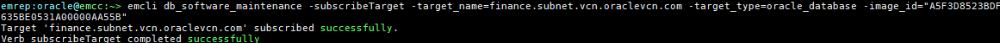

    Where:
      - target\_name – Name of the Database target which needs to be patched
      - target\_type – type of target to be patched. This should be oracle\_database in this case
      - image\_id – ID of the Gold Image to which the target should be patched

### **Deploy Image** - [READ ONLY – This step has already been implemented]

6. Review emcli command encapsulated in shell script

    ```
    <copy>cat deploy1810_finance.sh</copy>
    ```

    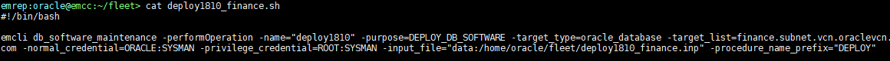

### **Migrate Listener** - [READ ONLY – This step has already been implemented]

7. Review emcli command encapsulated in shell script

    ```
    <copy>cat migrate_listener_finance_update.sh</copy>
    ```

    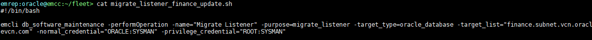

### **Update Database** – Patch to 18.10 - [READ ONLY – This step has already been implemented]

8. Review emcli command encapsulated in shell script

    ```
    <copy>cat update_finance.sh</copy>
    ```

    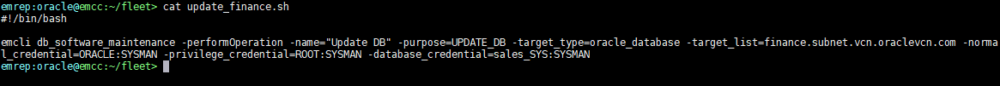

## Task 5: Create New Image Version

In this section, you are adding DB software image version 19.7 to Gold Image *Tier1 SIDB Linux-x64*

1. Review Reference Home Setup

    Just as it was done for the first version of this image, a reference 19.7 Oracle Home is needed to create a new version of the image and was setup in advance. [*/u01/app/oracle/product/19/db\_home\_src*]. This reference Oracle Home is discovered in Enterprise Manager as shown below and will be used to create and new version of the Gold Image.

2. Navigate to “***Targets >> All Targets***” and type in “*Orasidb19c\_home1\_2020\_05\_13\_04\_24\_10\_emcc.marketplace.com\_2953*” in the “*Search Target Name*” box.

    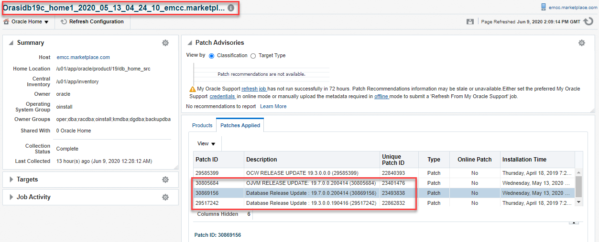

3. Review and execute the following command to create new Image version 19.7 to "*Tier1 SIDB 19c Linux-x64*"

    ```
    <copy>emcli db_software_maintenance -createSoftwareImage -input_file="data:/home/oracle/fleet/sidb19c_tier1_ui.inp"</copy>
    ```

    **OR**  

    ```
    <copy>sh create_image_version197_tier1_sidb_x64.sh</copy>
    ```

    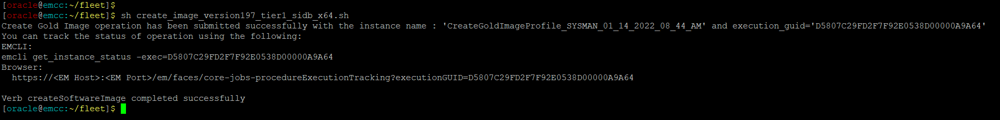

4. Navigate to ***Enterprise >> Provisioning and Patching >> Procedure Activity*** to Review Execution Details of this operation via Enterprise Manager Console. Click on ‘CreateGoldImage\*’ run

    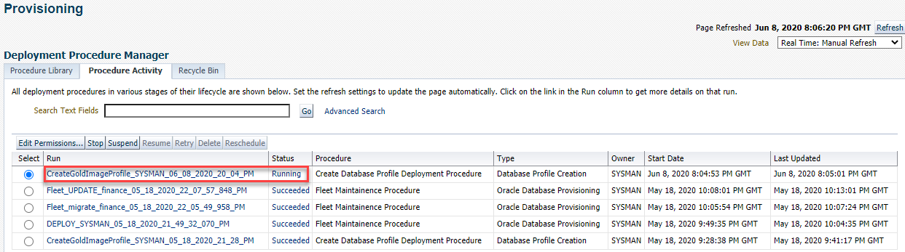

5. Review the Procedure Activity steps performed.

    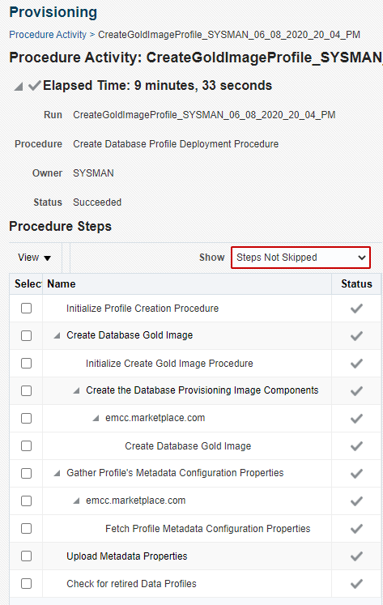

    With the new version successfully added we can proceed to activate it by setting the Status *Current*


## Task 6: Deploy New Image Version

1. Before we deploy a new Oracle Home, we need to ensure that we unsubscribe finance database  from previous associated image.

    Review and execute the following command to unsubscribe finance database from ***Tier #1 SI DB Linux64*** image. If finance database is not subscribed to any image, then we can move to next step, where we will subscribe it to 19.7 image.


    ```
    <copy>emcli db_software_maintenance -getTargetSubscriptions -target_name=finance.subnet.vcn.oraclevcn.com  -target_type=oracle_database</copy>
    ```

    ```
    <copy>emcli db_software_maintenance -unsubscribeTarget -target_name=finance.subnet.vcn.oraclevcn.com -target_type=oracle_database -image_id="{Insert IMAGE ID of 19c from above output}"</copy>
    ```

    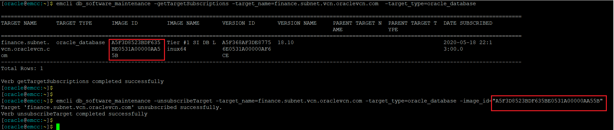

    We now need to subscribe finance database to 19.7 image which we had created in step 3 of previous task.      


    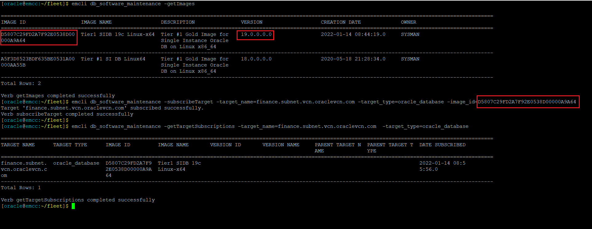


    ```
    <copy>emcli db_software_maintenance -getImages</copy>
    ```

    ```
    <copy>emcli db_software_maintenance -subscribeTarget -target_name=finance.subnet.vcn.oraclevcn.com -target_type=oracle_database -image_id="{Insert IMAGE ID of 19c from above output}"</copy>
    ```

   Review and execute the following command to deploy a new Oracle Home.

    ```
    <copy>emcli db_software_maintenance -performOperation -name="deploy197" -purpose=DEPLOY_DB_SOFTWARE -target_type=oracle_database -target_list=finance.subnet.vcn.oraclevcn.com -normal_credential=ORACLE:SYSMAN -privilege_credential=ROOT:SYSMAN -input_file="data:/home/oracle/fleet/deploy197_finance.inp" -procedure_name_prefix="DEPLOY"</copy>
    ```  

    **OR**  

    ```
    <copy>sh deploy197_finance.sh</copy>
    ```  

    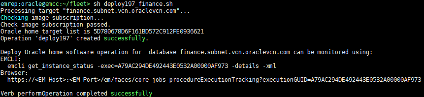

    Where:
      - NEW\_ORACLE\_HOME\_LIST = Absolute path to the File System location where new Oracle Home will be deployed.
      - procedure\_name\_prefix = optional, prefix for the deployment procedure instance name
      - name = Name of the operation. This is a logical name and should be kept unique
      - purpose = There are standard purposes defined which can be performed by Fleet Operations. “DEPLOY\_DB\_SOFTWARE” is one of them. These are predefined and should not be changed. Admin shall select one of the below mentioned purposes as and when needed.
      - normal\_credential = This should be provided in the format \{Named Credential: Credential Owner\}.
      - privilege\_credential = This should be provided in the format \{Named Credential: Credential Owner\}
      - start\_schedule = Schedule when the stage and deploy should start if that needs to be done in future. Format: “start\_time:yyyy/mm/dd HH:mm”. It is an optional parameter, if not provided, operation will start immediately
      - target\_type = The type of target being provided in this operation.
      - target\_list =
         1. This is a comma separated list of targets which need to be patched.
         2. Targets of homogenous types are supported in a single fleet operation.
         3. The system will calculate the unique list of hosts based on this target list and start stage of Oracle home software on those hosts.
         4. If targets running from same Oracle home are provided in this list, the stage and deploy operation will be triggered only once and not for all targets.

2. Navigate to ***Enterprise >> Provisioning and Patching >> Procedure Activity*** to Review Execution Details of this operation via Enterprise Manager Console. Click on ‘DEPLOY\_SYSMAN\_\*’ run

    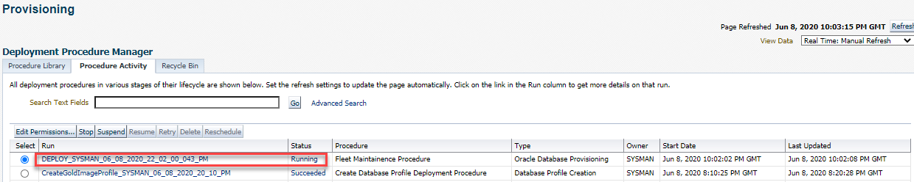

3. Review the Procedure Activity steps performed.

    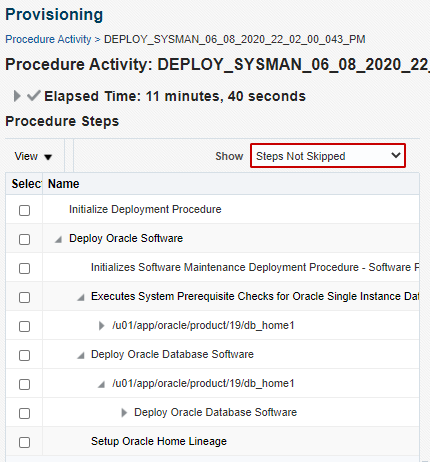

## Task 7: Migrate Listener to New Upgraded Home

1. Review and execute the following command to Migrate the Listener

    ```
    <copy>emcli db_software_maintenance -performOperation -name="Migrate Listener" -purpose=migrate_listener -target_type=oracle_database -target_list="finance.subnet.vcn.oraclevcn.com" -normal_credential="ORACLE:SYSMAN" -privilege_credential="ROOT:SYSMAN"</copy>
    ```

    **OR**

    ```
    <copy>sh migrate_listener_finance_update.sh</copy>
    ```

    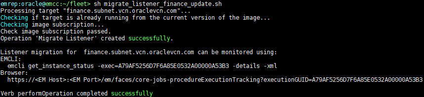

2. Navigate to ***Enterprise >> Provisioning and Patching >> Procedure Activity*** to Review Execution Details of this operation via Enterprise Manager Console. Click on ‘Fleet\_migrate\_\*’ run

    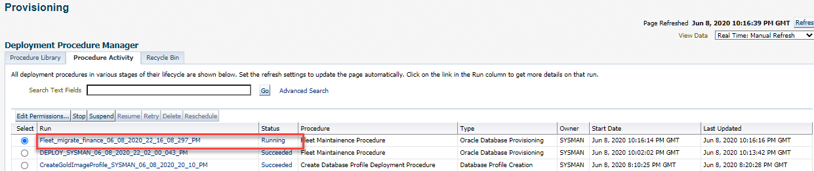

3. Review the Procedure Activity steps performed.

    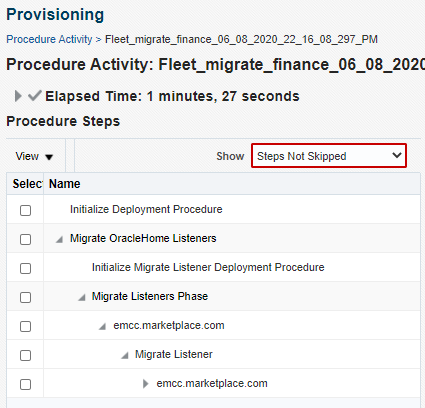

## Task 8: Update Database – Upgrade to 19.7

With the deploy operation completed successfully, we are ready to run the final UPDATE operation which upgrades the database by switching it to the newly deployed home.

1. Review and execute below command to update DB Target *finance.subnet.vcn.oraclevcn.com*

    ```
    <copy>emcli db_software_maintenance -performOperation -name="Update DB" -purpose=UPDATE_DB -target_type=oracle_database -target_list=finance.subnet.vcn.oraclevcn.com -normal_credential=ORACLE:SYSMAN -privilege_credential=ROOT:SYSMAN -database_credential=sales_SYS:SYSMAN</copy>
    ```

    **OR**

    ```
    <copy>sh update_finance.sh</copy>
    ```

    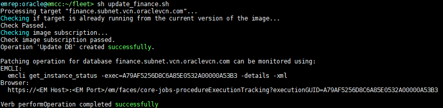

    Where:  
      - Name – Name of the operation. This is a logical name and should be kept unique  
      - Purpose – There are standard purposes defined which can be performed by Fleet Operations. “UPDATE\_DB” is one of them.

2. Navigate to the Procedure Activity Page and monitor the progress of this operation with ‘Fleet\_UPDATE\_...’ deployment procedure instance.

    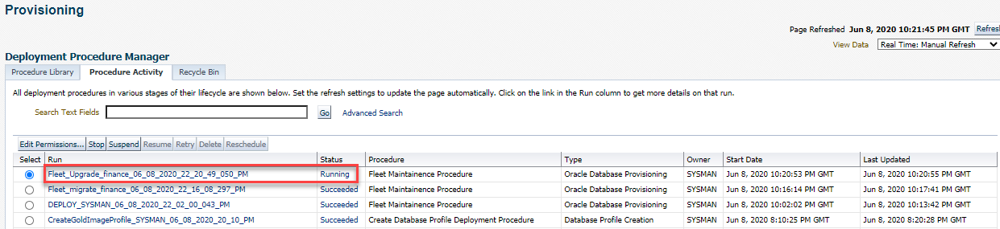

3. Review the Procedure Activity steps performed

    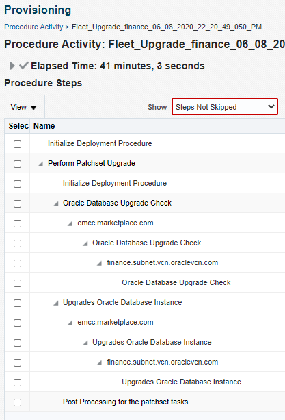

4. Verify the Upgraded target by going to ***Targets >> Databases*** as shown below. Operation above will take \~40 minutes to complete.

    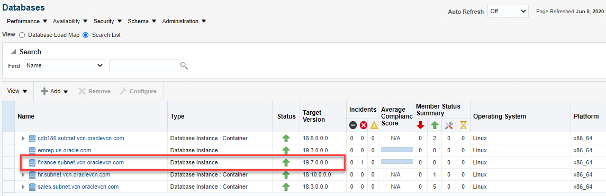

## Task 9: Cleanup Old Homes

1. Review and execute the following command as a dry-run to report on cleanup impact for *finance.subnet.vcn.oraclevcn.com*  

    ```
    <copy>emcli db_software_maintenance -performOperation -name="Cleanup old oracle homes" -purpose=CLEANUP_SOFTWARE -target_type=oracle_database -normal_credential=ORACLE:SYSMAN -privilege_credential=ROOT:SYSMAN -target_list=finance.subnet.vcn.oraclevcn.com -workDir=/tmp -reportOnly=true</copy>
    ```

    **OR**

    ```
    <copy>sh cleanup_finance_report.sh</copy>
    ```

    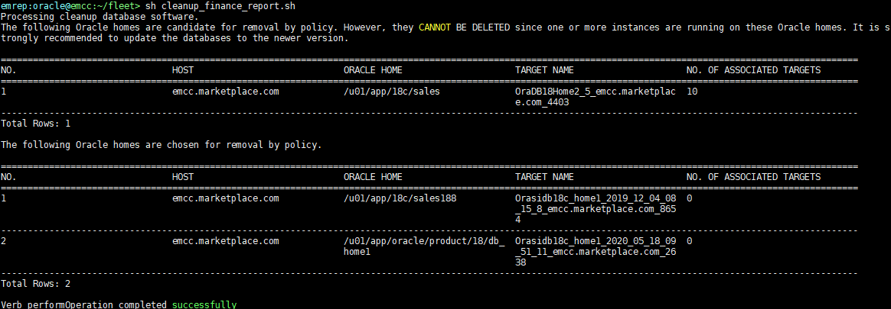

2. Review and execute the following command to cleanup *finance.subnet.vcn.oraclevcn.com*  

    ```
    <copy>emcli db_software_maintenance -performOperation -name="Cleanup old oracle homes" -purpose=CLEANUP_SOFTWARE -target_type=oracle_database -normal_credential=ORACLE:SYSMAN -privilege_credential=ROOT:SYSMAN -target_list=finance.subnet.vcn.oraclevcn.com -workDir=/tmp</copy>
    ```

    **OR**

    ```
    <copy>sh cleanup_finance.sh</copy>
    ```

    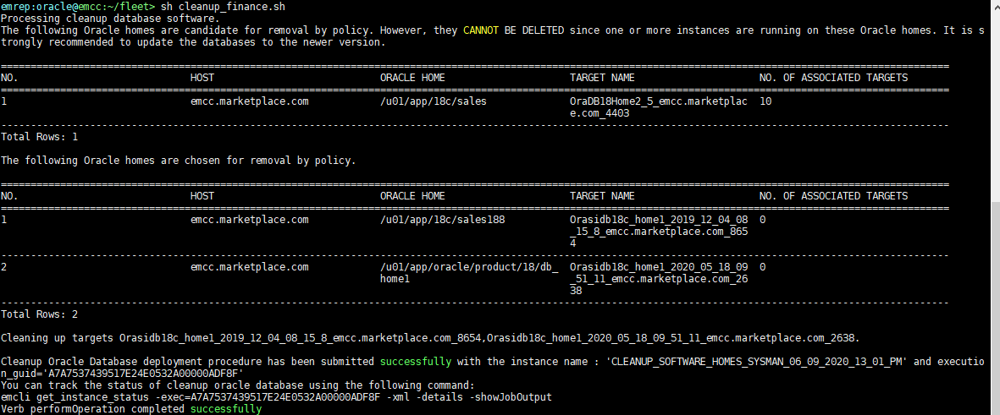

3. Navigate to the Procedure Activity Page and monitor the progress of this operation with ‘CLEANUP\_SOFTWARE\_...’ deployment procedure instance.

    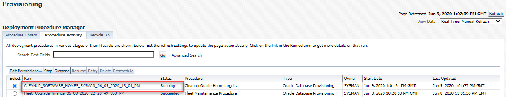

4. Review the Procedure Activity steps performed

    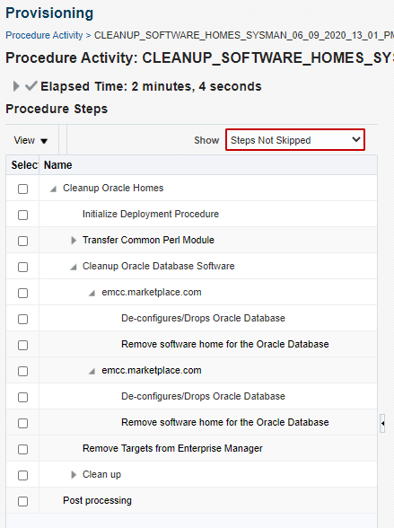

5. Verify to confirm that the two old Oracle Homes reported have been removed

    ```
    <copy>ls -l /u01/app/18c/sales188 /u01/app/oracle/product/18/db_home1</copy>
    ```

    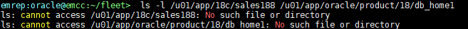

6. As part of the cleanup operation, *LISTENER\_1525* which support *“finance.subnet.oraclevcn.com”* is shutdown. Set your environment by passing *“finance”* to *“oraenv”* when prompted.

    ```
    <copy>. oraenv</copy>
    ```
7. start listener *LISTENER\_1525* back up

    ```
    <copy>lsnrctl start LISTENER_1525</copy>
    ```

    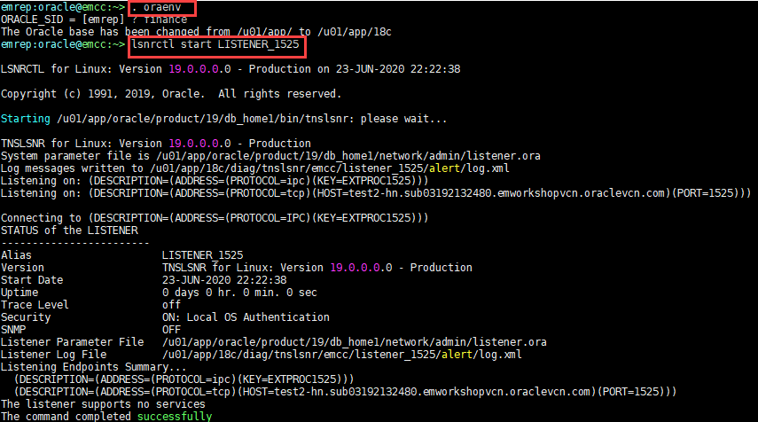

8. Force Listener registration and confirm that it is now servicing “*finance.subnet.vcn.oraclevcn.com*”

    ```
    <copy>sqlplus '/as sysdba'<<EOF
    alter system register;
    EOF
    </copy>
    ```
9. Check status of LISTENER\_1525

    ```
    <copy>lsnrctl status LISTENER_1525</copy>
    ```

    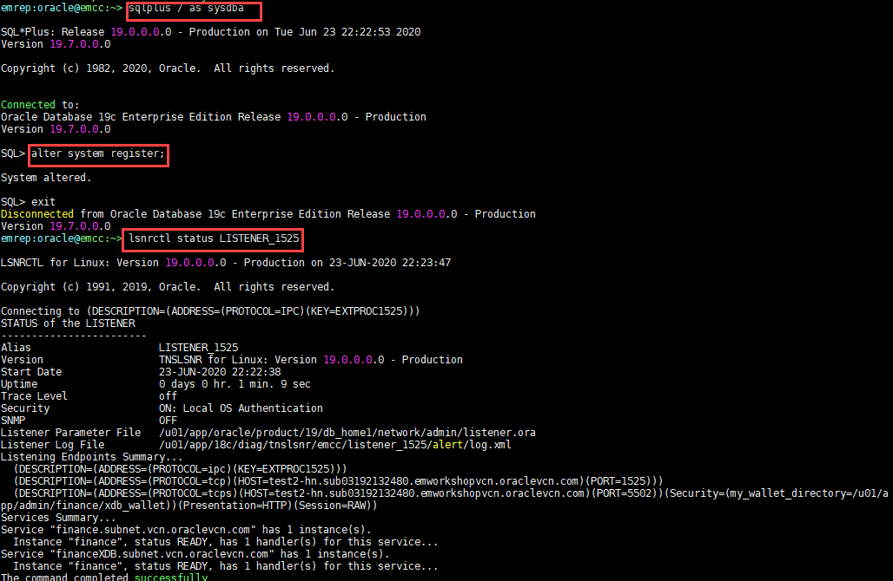


This completes this lab.

<!-- In this lab, you learned how to perform the following:
- Create Oracle Database Software Gold Image
- Subscribe Database to Gold Image
- Deploy Gold Image to Database Host
- Migrate Oracle Database Listener from old Oracle Home to newly Deployed Oracle Home
- Update (Patch) Database from 18.8 to 18.10
- Add new Version to an Existing Oracle Database Software Gold Image
- Deploy new Gold Image Version to Database Host
- Update (Upgrade) Database from 18.10 to 19.7
- Clean up old Oracle Homes -->

You may now [proceed to the next lab](#next).

## Learn More
  - [Oracle Enterprise Manager](https://www.oracle.com/enterprise-manager/)
  - [Oracle Enterprise Manager Fleet Maintenance](https://www.oracle.com/manageability/enterprise-manager/technologies/fleet-maintenance.html)
  - [Enterprise Manager Documentation Library](https://docs.oracle.com/en/enterprise-manager/index.html)
  - [Database Lifecycle Management](https://docs.oracle.com/en/enterprise-manager/cloud-control/enterprise-manager-cloud-control/13.4/lifecycle.html)
  - [Database Cloud Management](https://docs.oracle.com/en/enterprise-manager/cloud-control/enterprise-manager-cloud-control/13.4/cloud.html)

## Acknowledgements
  - **Authors**
    - Shefali Bhargava, Oracle Enterprise Manager Product Management
    - Rene Fontcha, LiveLabs Platform Lead, NA Technology
  - **Contributors** -
  - **Last Updated By/Date** - Rene Fontcha, LiveLabs Platform Lead, NA Technology, July 2021
