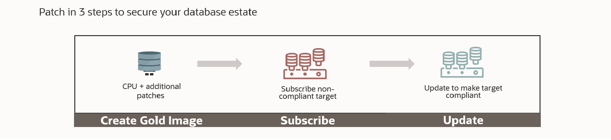
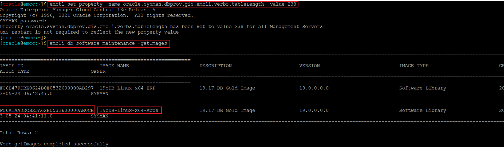
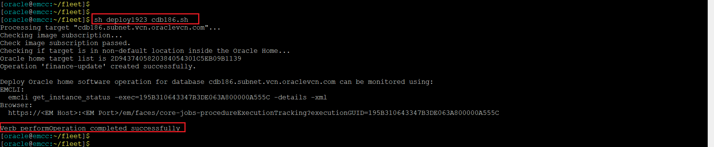
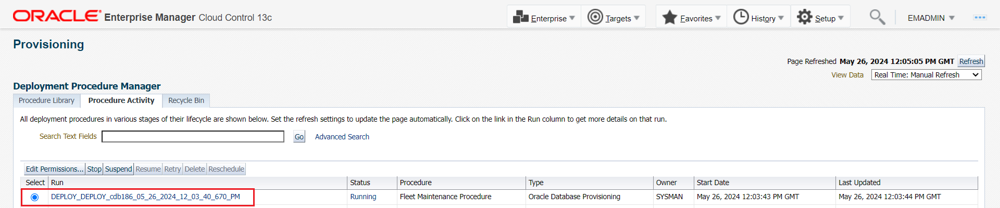
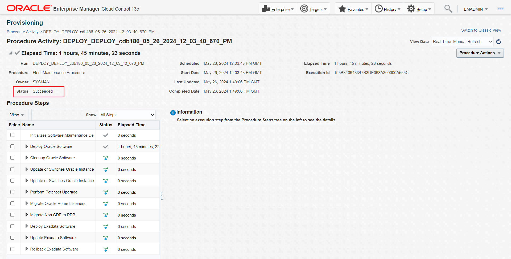
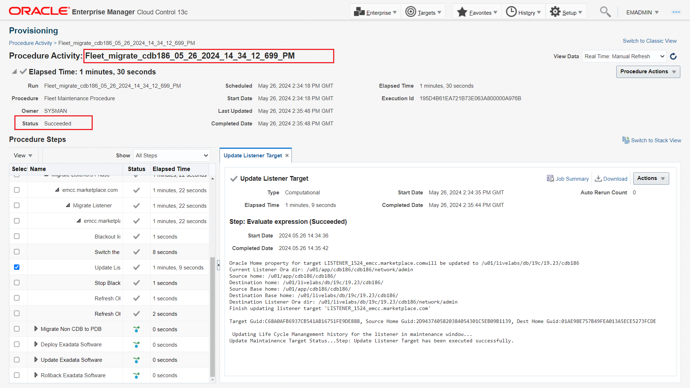
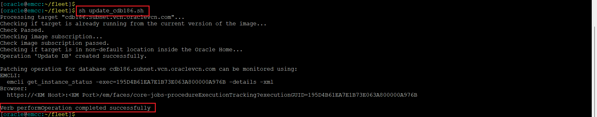
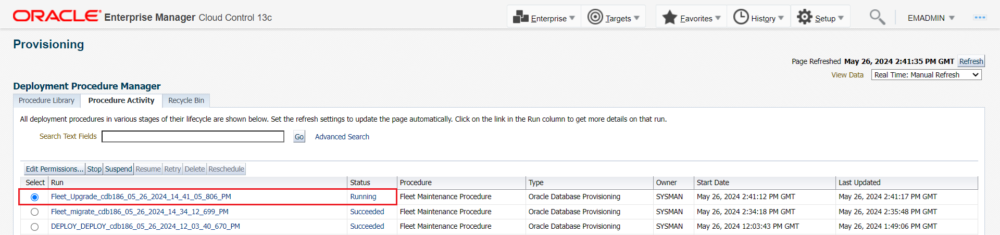
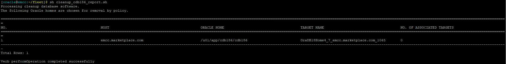
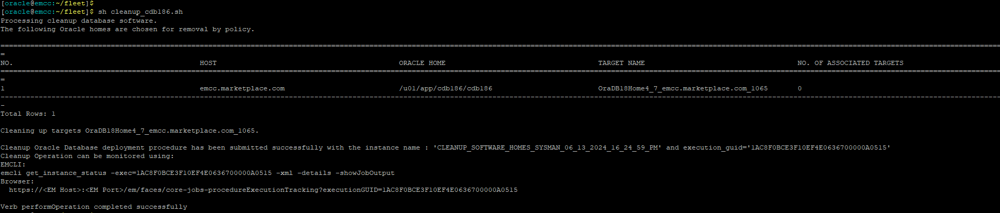

# Automated Database Upgrade at Scale with Fleet Maintenance

## Introduction
The objective of this lab is to explore upgrading your Oracle Database Software at scale with minimal downtime using Oracle Enterprise Manager 13c Fleet Maintenance.

*Estimated Lab Time:* 75 minutes

Watch the video below for a quick walk through of the lab.
[](youtube:SbsS_nNiXHo)

### About Fleet Maintenance

Database Fleet Maintenance is an end-to-end automated solution for patching and upgrade of Oracle Databases. Fleet Maintenance enables DBAs to automate patching of a wide range of Oracle Database configurations including Oracle RAC environments with Data Guard Standby.

Starting with Enterprise Manager 13.5 RU1, EM offers a new interface to ease automated (update)patching, and upgrade of your database fleet.

Benefits of using the EM Fleet Maintenance capability include:
- Minimizing downtime with use of Out of Place patching
- Enterprise scalability using the Enterprise Manger Deployment Procedures Framework
- A single pane of glass for monitoring and managing the entire patching and upgrade operations
- Ability to schedule/retry/suspend/resume operations
- Patch Oracle Databases across different infrastructure including engineered systems like Oracle ExaCC

  

### Objectives

In this lab you will perform the following steps:

| Step No. | Feature                                                   | Approx. Time | Details                                                                                                              | Value Proposition |
|----------------------|-----------------------------------------------------------|-------------|----------------------------------------------------------------------------------------------------------------------|-------------------|
| 1                    | Detect Configuration Pollution                            | 10 minutes  | Analyze the database estate using Software Standardization.                                                          |                   |
| 2                    | Oracle Database Upgrade with Fleet Maintenance | 1hr 5 min   | Upgrade your Oracle DB Software at scale with minimal downtime using Oracle Enterprise Manager 13c Fleet Maintenance |                   |

### Prerequisites
- A Free Tier, Paid or LiveLabs Oracle Cloud account
- You have completed:
    - Lab: Prepare Setup (*Free-tier* and *Paid Tenants* only)
    - Lab: Environment Setup
    - Lab: Initialize Environment

*Note*: This lab environment is setup with Enterprise Manager Cloud Control Release 13.5 and Database 19.10 as Oracle Management Repository. Workshop activities included in this lab will be executed both locally on the instance using Enterprise Manager Command Line Interface (EMCLI) or Rest APIs, and the Enterprise Manager console (browser)

## Task 1: Performed in Advance

To save time, the following steps were already completed.

1. Gold Image of Oracle Home was created using Fleet Maintenance Hub.

To ensure smooth execution of the use cases, we have pre-hosted the scripts to be used later at */home/oracle/fleet*. To know more about using this feature, follow the below video link.

[Video Walk-through] (https://www.youtube.com/watch?v=ibEEkTa05iM&t=182s)

## Task 2: Detect Configuration Pollution with Software Standardization Advisor

In this lab activity, you will analyze the database estate to identify any configuration drift (pollution) using the Software Standardization Advisor.

Software Standardization Advisor enables administrators to understand various database configurations prevailing in their environment. Each deployment with a unique platform, release and patch level is identified as a distinct configuration. This provides the administrators a view of the configuration pollution in their estate. It also analyzes and provides a recommendation to standardize the environment and reduce the number of configurations required for managing the database estate.
<!--
  
-->
  

1. On the browser page when the Enterprise Manager Cloud Control 13c login can be seen, copy and paste or type in these username and password credentials into the fields.

    ```
    Username: <copy>emadmin</copy>
    ```

    ```
    Password: <copy>welcome1</copy>
    ```

  

2.  After successful login, in the upper toolbar, locate the ***Targets*** icon and click the drop-down menu and then select ***Databases***.

  

3.  On the Databases targets page, click on the ***Administration*** tab, drop down the menu, and select Software ***Standardization Advisor***

  

4.  Software Standardization Advisor shows two graphs depicting current configuration and recommended configuration.

  

    Graphs may look different from the ones represented in the workbook.
    A Software Configuration is identified by the database release, platform, and the patches installed on the target.

    In the analysis performed by the Software Configuration Advisor, it has identified that there are 6 unique software configurations in the environment (pie chart labeled “Current Unique Software Configurations”). The recommendation displayed is for only 2 Software Configurations ( pie chart labeled “Recommended Software Configurations”).

    Next, we will review the report generated.


5.  On the same page, click on **Generate Report**. Select yes when it prompts to generate the report.
  


6.  On the same page, click on **Current Configurations** to open the Excel report.

  

    When you download the report, a warning on XLS format and file extension mismatch pops up (like below). Simply click on “Yes” to ignore the warning and open the file.

  

    Alternately, you might see a pop up for import options, while opening the file. Select OK and you should be able to view the contents of the file.

  

    From the report, you will see the current environment has six different Oracle home software versions.

  

    Incase you are unable to review the report in Livelab VNC, then open the environment url directly on your laptop browser and run the report again. Example: If you see instance IP address as 129.146.247.99, then the url to open on your browser will be https://129.146.247.99:7803/em .

  

    Please accept any warning message that your browser may show to continue to login to Enterprise Manager.

7.  Next, click on **Recommended Configurations** to open the Excel Report.

  

    <!-- The report recommends a reduction of the 5 configurations and standardizing the database estate to 2 configurations (18c and 19c). This means all Oracle homes for Release 18c should uptake the standard 18c configuration and the 19c Oracle homes the standard 19c configuration. -->

    The reports recommendation is to consolidate the configuration drift (pollution) from the current six database to two (18c and 19c). This recommendation would reduce the number of configurations and standardize the environment for easier management.

  

    The recommendation is based on a union of bugs included in the patches in all Oracle homes and based on the configuration type.

  <!-- This completes Step 1. In this section, you learned how to perform the following:

    - Access the Database Software Standardization Advisor
    - View Configuration summary
    - Generate and download current and recommended configuration reports

  In the next section we will follow these recommendations to perform the following using Enterprise Manager 13c Fleet Maintenance.

    - Patch database “hr.subnet.vcn.oraclevcn.com” from 18.3 to 18.10 -->


## Task 3: Oracle Database Upgrade with Fleet Maintenance (Overview)

### **Database Fleet Maintenance**

Enterprise Manager Database Fleet Maintenance is a Gold Image Target subscription-based Out of Place patching solution. Out of Place patching is a method where patching is performed by creating a copy of the Oracle home, applying patches to the copied home, and then switching services to the copied home.
A gold image is the end of state software definition that contains information about the base software version plus the additional patches. Targets, to be upgraded, subscribe to a relevant Gold Image. Target subscription persists through the lifecycle of the Target or Gold Image unless modified by an administrator.


   <!-- -->

  
### **Upgrading with Fleet Maintenance**

Starting with Enterprise Manager 13.5 RU16, Enterprise Manager offers a new interface - Fleet Maintenance Hub to ease automated update(patching), and upgrade of your database fleet. The Fleet Maintenance Hub within Enterprise Manager offers a comprehensive solution for managing database vulnerabilities and patch operations. It streamlines the process by identifying potential security risks, providing patch recommendations, and enabling efficient scheduling and monitoring of patching and upgrade operations. With the ability to manage diverse infrastructures and ensure compliance with patch policies, the Fleet Maintenance Hub serves as a centralized and powerful tool for maintaining the security and stability of database assets.

We will go through steps for upgrading database target ***cdb186.subnet.vcn.oraclevcn.com***, a Container Database currently at 18.8.0.0.0. The goal is to upgrade this target to 19.23.0.0.0. Instead of Auto Upgrade, we will use DBUA utility. To use Auto Upgrade, please review our UI lab for Database upgrade.

1. Return to the browser page with the Oracle Enterprise Manager Console (log back in if needed) and from the EM home page, select the ***Targets*** drop-down menu and select ***Databases*** to review the status and version of database targets.

  


    You will see the *cdb186.subnet.vcn.oraclevcn.com* database.

  

## Task 4: Create Gold Image [Step Already Performed, Read-Only Step]

  1. For this lab exercise, we have already created the gold image. To create or refresh a gold image, below are the high level steps:

  -  Ensure that latest patch recommendations are uploaded within Enterprise Manager. This can be done either by uploading the patch catalog (this method is meant for those setups which are not internet facing) or by entering MOS credentials and automatically fetching the latest recommendations as and when done. For accuracy of this lab, we have followed approach 1.We suggest that you do not upload latest patch recommendations as this may impact the existing gold images, and you may not be able to complete the lab following the instructions manuals.
  -  Review the list of patches recommended
  -  Upload these patches in software library
  -  Follow the workflow to refresh the gold images

  2. From the Database page, navigate to the ***Administration*** drop-down menu and then select ***Fleet Maintenance Hub***.

  

      Click on middle Tile 2, which is **Patch Recommendations for Images**. Here we see two gold images. The highlighted one is a healthy image, which has all the patch recommendations. We will use this gold image to complete our patching activity in this lab.

  

  3. Alternately, you can run emcli to list available Gold Images. Execute the following commands in the terminal to see the list of Gold Images available

     To  retrieve Column values in same line, execute the below format command in terminal

  ```
  <copy>emctl set property -name oracle.sysman.dbprov.gis.emcli.verbs.tableLength -value 238</copy>
  ```

  This will prompt for sysman password. Enter

  ```
 <copy>welcome1</copy>
 ```

  Now execute below command to list out relevant information about existing gold images.
  ```
  <copy>emcli db_software_maintenance -getImages</copy>
  ```

  

  IMAGE ID retrieved from the output of above command is used in further operations like Target Subscription.

  After retrieving a list of the available images, one can view a list of versions available for a specific image with the following command:

  If the image id for Gold Image ***19cDB-Linux-x64-Apps*** is same as above, then use the below command to get the version details of this image.

  ```
  <copy>emcli db_software_maintenance -getVersions -image_id=FC6A1AA82CB23A62E0532600000AB0CE</copy>
  ```   
  else, use the below command by inserting the appropriate value in the image id column.

  ```
  <copy>emcli db_software_maintenance -getVersions -image_id={Insert IMAGE ID from List available gold images}</copy>
  ```   
  This command lists Gold Image versions with their VERSION ID and STATUS.

  

  When a Gold Image is created for the first time, its first version is created as per the input and marked as current. Whenever we run a DEPLOY operation for a target, Gold Image version marked as CURRENT is used to deploy the new Oracle Home.

## Task 5: Subscribe Target

1.  Review emcli command to subscribe cdb186 database.

    ```
    <copy>emcli db_software_maintenance -subscribeTarget -target_name=cdb186.subnet.vcn.oraclevcn.com -target_type=oracle_database -image_id="FC6A1AA82CB23A62E0532600000AB0CE"</copy>
    ```

If the image id for Gold Image ***19cDB-Linux-x64-Apps*** is different, the update the below command by inserting the appropriate value in the image id column.

  ```
  <copy>emcli db_software_maintenance -subscribeTarget -target_name=cdb186.subnet.vcn.oraclevcn.com -target_type=oracle_database -image_id={Insert IMAGE ID from List available gold images}</copy>
  ```

  

    Where:
      - target\_name – Name of the Database target which needs to be patched
      - target\_type – type of target to be patched. This should be oracle\_database in this case
      - image\_id – ID of the Gold Image to which the target should be patched


## Task 6: Deploy Oracle Home

1.   Review and execute the following command to deploy a new Oracle Home.

  ```
  <copy>cd ~/fleet; sh deploy1923_cdb186.sh</copy>
  ```

  

2. Navigate to ***Enterprise >> Provisioning and Patching >> Procedure Activity*** to Review Execution Details of this operation via Enterprise Manager Console.

  

 Click on ‘DEPLOY*’ run

  

3. Review the Procedure Activity steps performed.

  

## Task 7: Migrate Listener to New Upgraded Home

1. Review and execute the following command to Migrate the Listener

  ```
  <copy>sh migrate_listener_cdb186_update.sh</copy>
  ```

  

2. Navigate to ***Enterprise >> Provisioning and Patching >> Procedure Activity*** to Review Execution Details of this operation via Enterprise Manager Console. Click on ‘Fleet\_migrate\_\*’ run

  

3. Review the Procedure Activity steps performed.

  

## Task 8: Update Database – Upgrade to 19.23

With the deploy operation completed successfully, we are ready to run the final UPDATE operation which upgrades the database by switching it to the newly deployed home.

In this lab, we will use DBUA utility to upgrade database. Starting with Enterprise Manger 13.5 Release Update 18 (13.5.0.18) AutoUpgrade is the default tool used for upgrading databases using Fleet Maintenance. To use DBUA, execute the below query.

```
<copy>emctl set property -name oracle.sysman.db.upgrade_using_autoupgrade_tool -sysman_pwd welcome1 -value false</copy>
```
  

1. Review and execute below command to update DB Target *cdb186.subnet.vcn.oraclevcn.com*

```
<copy>sh update_cdb186.sh</copy>
```

  

    Where:  
      - Name – Name of the operation. This is a logical name and should be kept unique  
      - Purpose – There are standard purposes defined which can be performed by Fleet Operations. “UPDATE\_DB” is one of them.

2. Navigate to the Procedure Activity Page and monitor the progress of this operation with ‘Fleet\_Upgrade\_...’ deployment procedure instance.

  

3. Review the Procedure Activity steps performed

  

4. Verify the Upgraded target by going to ***Targets >> Databases*** as shown below. Operation above will take \~40 minutes to complete.

  

## Task 9: Cleanup Old Oracle Home

1. Execute the following command as a dry-run to report on cleanup impact for *cdb186.subnet.vcn.oraclevcn.com*  

```
<copy>sh cleanup_cdb186_report.sh</copy>
```

 

2. Execute the following command to cleanup *cdb186.subnet.vcn.oraclevcn.com*   

```
<copy>sh cleanup_cdb186.sh</copy>
```

  

3. Navigate to the Procedure Activity Page and monitor the progress of this operation with ‘CLEANUP\_SOFTWARE\_...’ deployment procedure instance.

  

4. Verify to confirm the old Oracle Home has been removed

```
<copy>ls -ltr /u01/app/cdb186/cdb186</copy>
```

      

This completes this lab.

<!-- In this lab, you learned how to perform the following:
- Create Oracle Database Software Gold Image
- Subscribe Database to Gold Image
- Deploy Gold Image to Database Host
- Migrate Oracle Database Listener from old Oracle Home to newly Deployed Oracle Home
- Update (Patch) Database from 18.8 to 18.10
- Add new Version to an Existing Oracle Database Software Gold Image
- Deploy new Gold Image Version to Database Host
- Update (Upgrade) Database from 18.10 to 19.7
- Clean up old Oracle Homes -->

You may now [proceed to the next lab](#next).

## Learn More
  - [Oracle Enterprise Manager](https://www.oracle.com/enterprise-manager/)
  - [Oracle Enterprise Manager Fleet Maintenance](https://www.oracle.com/manageability/enterprise-manager/technologies/fleet-maintenance.html)
  - [Enterprise Manager Documentation Library](https://docs.oracle.com/en/enterprise-manager/index.html)
  - [Database Lifecycle Management](https://docs.oracle.com/en/enterprise-manager/cloud-control/enterprise-manager-cloud-control/13.4/lifecycle.html)
  - [Database Cloud Management](https://docs.oracle.com/en/enterprise-manager/cloud-control/enterprise-manager-cloud-control/13.4/cloud.html)

## Acknowledgements
  - **Authors**
    - Shefali Bhargava, Oracle Enterprise Manager Product Management
    - Rene Fontcha, LiveLabs Platform Lead, NA Technology
  - **Contributors** -
  - **Last Updated By/Date** - Rene Fontcha, LiveLabs Platform Lead, NA Technology, July 2021
