# Migrate and upgrade 12c database to 19c ADB

## Introduction

You can use Database Migration Workbench to migrate databases to multi-tenant architecture on Exadata on-premises, to Base Database Service (BM or VM) or Exadata Database Service (ExaCC, ExaCS), and autonomous, using TTS and data pump migration methods in Oracle Cloud Infrastructure (OCI). This lab demonstrate using Migration Workbench for **on-premises** to **autonomous** migration.

Estimated Time: 60 minutes

### Objectives

In this lab you will perform the tasks below. Task 1 is to review the prerequisites completed in advance for this lab. In task 2 you will review the autonomous database creation completed in advance for this lab. In task 3 you will perform the pre-requisites for the autonomous database before migration. In task 4 you will create a migration activity, add details, and learn about the various configuration options. After the migration is complete, you will analyze the migration activity and compare performance before and after the migration.

| Task No.                                      | Description                                                                 | Approx. Time | Details                                                                                                                                                                                    |
|-----------------------------------------------------------|-------------------------------------------------------------------------|--------------|--------------------------------------------------------------------------------------------------------------------------------------------------------------------------------------------|
| 1 | Launch Enterprise Manager console and review prerequisites completed in advance | 10 minutes | Review prerequisites completed on the source database and in Enterprise Manager |
| 2 | Launch OCI console and review prerequisites completed in advance | 10 minutes   | Review autonomous database and storage bucket created in OCI in advance |
| 3 | Perform target autonomous database pre-requisites | 20 minutes   | Discover the autonomous database in Enterprise Manager. Create required credentials |
| 4 | Migrate and upgrade a 12c non-container database to 19c autonomous database in Oracle Cloud | 20 minutes   | Source database: orcl, destination database: ATP-ORCL |

### Prerequisites

- A Free Tier, Paid or LiveLabs Oracle Cloud account
- You have completed:
  - Lab: Prepare Setup (*Free-tier* and *Paid Tenants* only)
  - Lab: Environment Setup
  - Lab: Initialize Environment

>**Note:** This lab environment is setup with Enterprise Manager Cloud Control Release 13.5 RU7, and database 19.12 as Oracle Management Repository.

## Task 1: Launch Enterprise Manager console and review prerequisites completed in advance

Once your workshop is provisioned, click on "View Login Info" on the top right of the browser page. This opens the "Reservation Information" screen:


For this workshop you will not use the remote desktop, so do not click the "Launch Remote Desktop" button, but rather copy the IP address of your instance. Open a new browser tab and enter the Enterprise Manager console URL for your instance as follows:

<https://*The-IP-address-you-just-copied*:7803/em>


> **Note:** You may see an error on the browser while accessing the Web Console - “Your connection is not private” as shown below. Ignore and add the exception to proceed.

click on the *Username* field and login with the credentials provided below.

```text
Username: <copy>sysman</copy>
```

```text
Password: <copy>welcome1</copy>
```


Once logged in you will be in the "Enterprise Summary" page:


In the interest of simplifying the setup and to save time, the following requirements for the source database were completed in advance for this lab. Please review accordingly for reference.

- Source database target discovered in Enterprise Manager
    - In Enterprise Manager console, click on "Targets"->"Databases"
      
    - orcl is our source database
- Data Pump user requirement
    - For the source database (orcl), an export user (EXP_USER) was created with password "welcome1" and the required privileges
    - To learn more about the the required privileges review "[Database Migration Prerequisites](https://docs.oracle.com/en/enterprise-manager/cloud-control/enterprise-manager-cloud-control/13.5/emmwb/database-migration-workbench.html#GUID-3FB0F7B7-F221-43BE-8D29-E36A18EF45C0)" in the Enterprise Manager documentation
- Named Credential requirement
    - Named Credential "EXP\_USER" created in Enterprise Manager for user "EXP\_USER" on database "orcl"
    - To review the credential in OEM console, navigate to "Setup"->"Security"->"Named Credentials"
    - To learn more about named credentials review "[Named Credentials](https://docs.oracle.com/en/enterprise-manager/cloud-control/enterprise-manager-cloud-control/13.5/emsec/security-features.html#GUID-345595B0-3FA4-4F2C-A606-596B1A10A13E)" in the Enterprise Manager documentation
- Data Pump directory requirement

    Migration workbench requires a local directory on the source database with sufficient space to host the data pump dump files.
    - Created the following directory on the host: /u01/app/oracle/migration_workbench
    - Created directory object "MWB_DIR" in the source database pointing to this directory
    - Granted read and write privileges on the directory object to user EXP\_USER in the source database
- Compare performance requirement

    SQL Performance Analyzer (SPA) automates the process of assessing the overall effect of a change on the  SQL workload by identifying performance divergence for each SQL statement. A report that shows the net impact on workload performance due to the change is provided. For regressed SQL statements, SQL Performance Analyzer also provides appropriate execution plan details along with tuning recommendations. As a result, you can remedy any negative outcome before the end-users are affected. Furthermore, you can validate -with time and cost savings- that migration will result in net improvement.

    An SQL Tuning Set (STS) containing the SQL and relevant execution metadata from the source database is needed to compare performance before and after the migration. Database Migration Workbench can create an STS from AWR during migration, or you can create one in advance and pass it to the migration procedure.

    - For this lab, an STS was created in advance (SH2STS) by running a workload against the SH2 schema in the source database and capturing the SQL statements executing during the load test
- Upload migration tools

    Migration Workbench uses Instant Client and the Cloud Premigration Advisor Tool (CPAT) as part of its migration toolkit. Enterprise Manager automatically downloads the latest version of the tools when set up with either a MOS Proxy or direct internet connection. The tools can also be uploaded manually as described in [Upload Migration Tools] (<https://docs.oracle.com/en/enterprise-manager/cloud-control/enterprise-manager-cloud-control/13.4/emlcm/upload-migration-tools.html>) in the Migration Workbench documentation.

    - For this lab the migration tools were uploaded in advance. For additional detail on the Cloud Premigration Advisor Tool refer to this MOS document: *Cloud Premigration Advisor Tool (CPAT) Analyzes Databases for Suitability of Cloud Migration (Doc ID 2758371.1)*

    You have now completed this task.

## Task 2: Launch OCI console and review prerequisites completed in advance

Navigate back to the workshop page in your browser. Click on "View Login Info" on the top right of the page to show the "Reservation Information" screen. Click "Launch OCI":

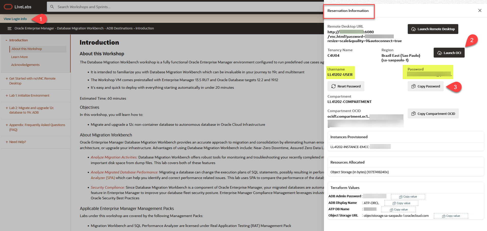

Sign in using the password provided in the "Reservation Information" screen:


On the "Change Password" screen, choose a new password that meets the requirements provided, and click "Save New Password":


This takes you to the OCI console:


 Click on the menu in the top left, then click on "Oracle Database" "Autonomous Database":

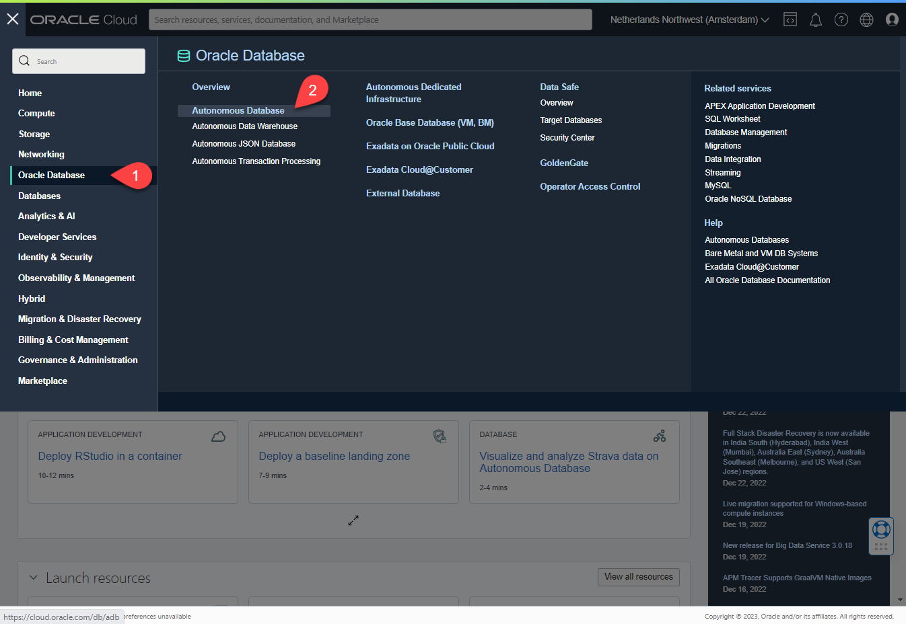

The "Autonomous Databases" screen opens in the root compartment at first, which you don't have permission to. Click on the "Compartment" drop-down list and select your compartment as provided in the "Reservation Information" screen. Note your compartment name will start with your username:


The next screen shows the autonomous database created for your workshop in advance:

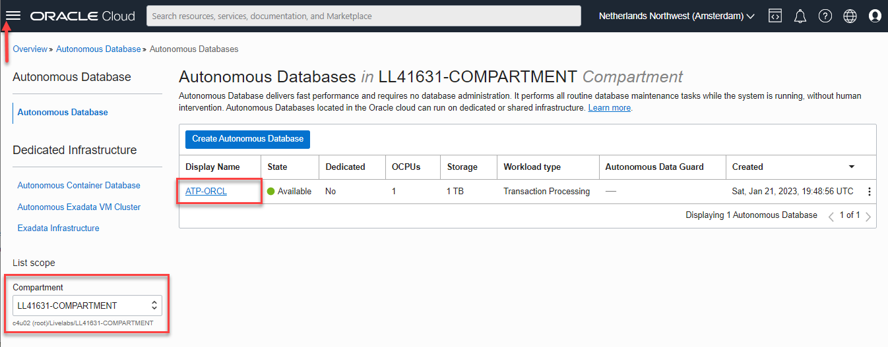

We will come back to this database in the next task. For now click on the OCI menu again (top left) then click on "Storage"->"Buckets":


The next screen shows the storage bucket created for your workshop in advance:


You have now completed this task.

## Task 3: Perform target autonomous database pre-requisites

1. Download the ATP-ORCL client wallet using OCI console
    - In OCI Console, navigate to Oracle Database->Autonomous Database
    - Click on the "ATP-ORCL" database to display the database homepage
    - Click "Database Actions". The Database Actions page opens in a new browser tab. If your browser blocks creating a new tab, allow pop-ups from the OCI URL:
    
    - On the database Login screen, enter username "ADMIN" and the Admin password from the "Reservation Information" screen:
    
    - On the new tab ("Database Actions|Launchpad"), click on "Download Client Credentials (Wallet)" tile under "Administration" (You may have to scroll down the page):
    
    - On the pop-up window, enter password:

        ```text
        <copy>welcome1</copy>
        ```

    - Click Download. The wallet zip file will be saved in your local "Downloads" directory
2. Discover ATP-ORCL in Enterprise Manager
    - In Enterprise Manager console, navigate to "Setup"->"Add Target"->"Add Target Manually"
    
    - On the "Add Targets Manually" screen, click the "Add Target Manually" button. On the resulting pop-up window:
        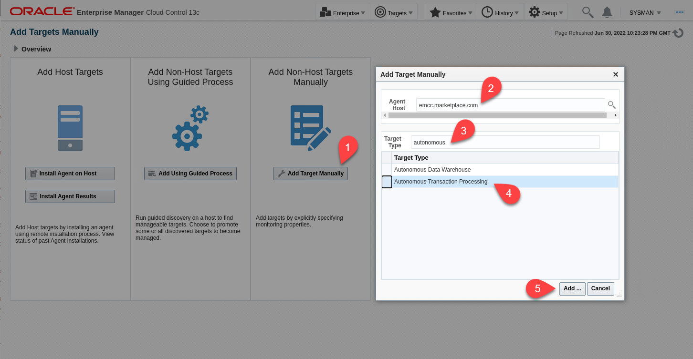
        - Agent Host:

            ```text
            <copy>emcc.marketplace.com</copy>
            ```

        - Target Type:

            ```text
            <copy>autonomous</copy>
            ```

        - Hit Enter
        - Select "Autonomous Transaction Processing" and click "Add":

    - On the "Add Autonomous Transaction Processing: Properties" screen, enter:
      - Target Name:

        ```text
        <copy>ATP-ORCL</copy>
        ```

      - OCI Client Credential (Wallet): Click "Choose File" and select the wallet zip file you saved in the previous step
      - Wallet Password:

        ```text
        <copy>welcome1</copy>
        ```

      - Service Name: keep the default selection for the purpose of this demo
      - Monitoring Username: The default monitoring user "adbsnmp" is initially locked. For this lab we'll just use the ADMIN user for monitoring. Replace "adbsnmp" with "ADMIN" (upper case):

        ```text
        <copy>ADMIN</copy>
        ```

    - Monitoring Password: Copy the "ADB Admin Password" from the "Reservation Information" screen:
    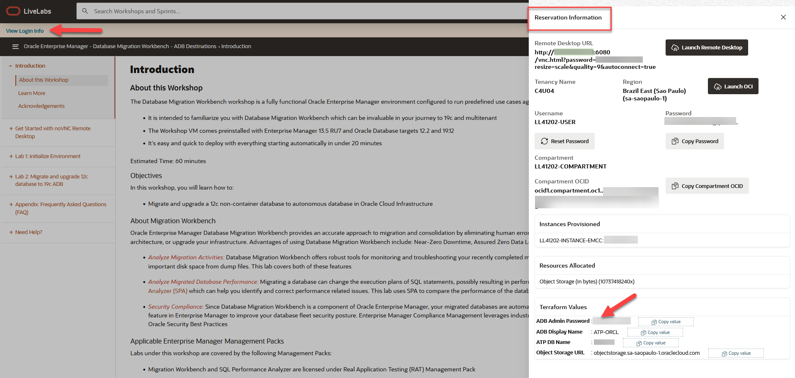
    - Click "Test Connection" (it may take a couple of minutes to get the result back):
    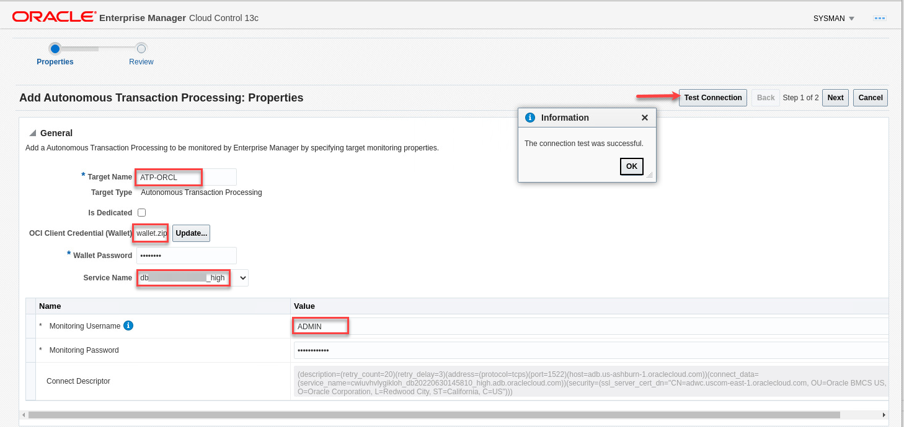
    - Click Next
    - On the Review screen click Submit
    - Click on "Targets"->"Databases". The new autonomous database has been discovered in Enterprise Manager:
    
3. Create ATP Credential in OEM
    - In Enterprise Manager console, navigate to "Setup"->"Security"->"Named Credentials"
    - Click "Create"
    - On the "Create Credential" screen, enter:

      General Properties
        - Credential name:

            ```text
            <copy>ADMIN</copy>
            ```

        - Authenticating Target Type: "Autonomous Transaction Processing"
        - Credential type: "Database Credentials"
        - Scope: Target
        - Target Type: "Autonomous Transaction Processing"
        - Target Name:

            ```text
            <copy>ATP-ORCL</copy>
            ```

      Credential Properties
        - UserName:

            ```text
            <copy>ADMIN</copy>
            ```

        - Password: Copy the "ADB Admin Password" from the "Reservation Information" screen

    - Role: Normal
    
    - Click “Test and Save”. You should get "*Confirmation credential operation successful*". If not, review the previous steps and retry.
4. Generate RSA key pair in PEM format

    In the OCI console, open the Profile menu (User menu icon) in the top-right corner, then click User Settings to view the details:
    - In the left navigation bar, under "Resources", click on "API Keys"
    - Under “API Keys” click “Add API Key”.
    - In the pop-up window, keep the default option "Generate API Key Pair" selected
    - Click "Download Private Key" and save it to your local Downloads folder. Name the file "private-key.pem":

        ```text
        <copy>private-key.pem</copy>
        ```

    - Click "Add" (you do not need to download the public key):
    
    - Close the resulting "Configuration File Preview" window
    - The text shown under "Fingerprint" is the Public Key Fingerprint. Copy and paste it in your notepad as it will be used in a subsequent step:
    
5. Create an OCI Auth Token

    While on the same screen in the OCI Console from previous step:
    - In the left navigation bar, under "Resources", click on "Auth Tokens"
    - Under "Auth Tokens" click Generate Token:
      - Description:

          ```text
          <copy>Migration Workbench</copy>
          ```

      - Click Generate Token

    - The new Auth Token is displayed
    - Copy the auth token and paste it in your notepad as it will be used in a subsequent step. Close the Generate Token dialog:
    
6. Create OCI Credential in Enterprise Manager
    - Make a note of your Tenancy OCID and User OCID:
        - On the OCI console, click on the user icon on the top right of the screen. Click on your tenancy link. Under "Tenancy Information" copy the tenancy OCID and paste it in your notepad:
        
        - Click again on the user icon, then click on User Settings. Under "User Information" copy your user OCID and paste it in your notepad
        
    - In the Enterprise Manager console, navigate to "Setup"->"Security"->"Named Credentials"
    - Click "Create"
    - On the "Create Credential" screen, enter:

      General Properties

        - Credential name:

            ```text
            <copy>OCI</copy>
            ```

        - Authenticating Target Type: "Autonomous Transaction Processing"
        - Credential type: "Oracle Cloud Infrastructure Credential"
        - Scope: Target
        - Target Type: "Autonomous Transaction Processing"
        - Target Name:

            ```text
            <copy>ATP-ORCL</copy>
            ```

      Credential Properties

        - Tenancy OCID: Tenancy OCID you saved earlier in this step
        - User OCID: User OCID you saved earlier in this step
        - Public Key Fingerprint: Public Key Fingerprint you saved earlier
        - Private Key: content of "private-key.pem" file you saved earlier

      
    - Click Save. You should get "Confirmation credential operation successful". If not, review the previous steps and retry
7. Create Authentication Credential in ADB

    Create an "Auth Token" based credential in the Autonomous Database and set it as a default credential that will be required for authentication between the Autonomous Database and OCI object storage. This step requires OCI username as shown in the "Reservation Information" screen, as well as the auth token you saved earlier in notepad.
    - In OCI Console, navigate to Oracle Database->Autonomous Database
    - Click on the "ATP-ORCL" database to display the database homepage
    - Click "Database Actions". The Database Actions page opens in a new browser tab
    - Under "Development" heading, click on "SQL" (first tile). Ignore the warning about being logged in as "ADMIN" user
    - Execute the following code after filling in the values for username and password as described in the code snippet:

        ```text
        <copy>
        BEGIN
          DBMS_CLOUD.CREATE_CREDENTIAL(
            credential_name => 'OBJ_STORE_CRED',
            username => '&lt;Your OCI username from the "Reservation Information" screen&gt;',
            password => '&lt;Migration Workbench token saved earlier in notepad&gt;'
          );
        END;
        /
        </copy>
        ```

      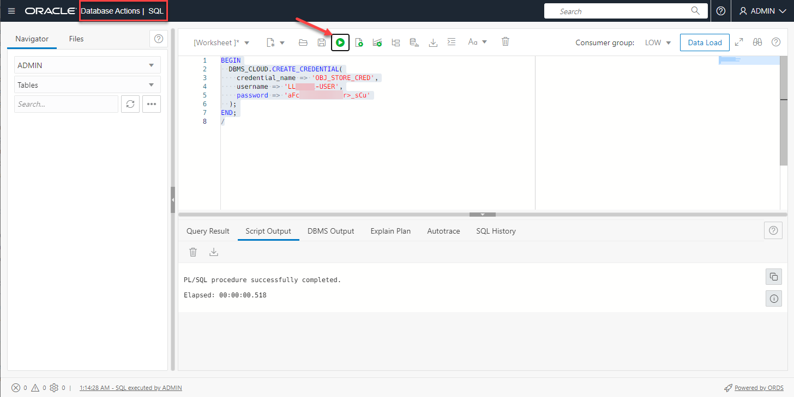
    - Next execute the following SQL statement:

        ```text
        <copy>
        ALTER DATABASE PROPERTY SET default_credential = 'ADMIN.OBJ_STORE_CRED';
        </copy>
        ```

      

    You have now completed this task.

## Task 4: Migrate and upgrade a 12c non-container database to 19c autonomous database in Oracle Cloud

### **Overview**

In this step we'll migrate and upgrade an Oracle 12c database to autonomous database in Oracle Cloud Infrastructure (OCI). Our source database is "orcl" and our target database is "ATP-ORCL".

We'll use the Data Pump migration method in this task.

### **Execution**

1. Log into your Enterprise Manager as sysman as indicated in the Prerequisites step if not already done
2. From the Enterprise menu:
    - Navigate to "Migration and Consolidation"->"Database Migration Workbench"
    
3. On the "Database Migration" screen:
    - Expand the "Getting Started" section if collapsed. Examine the Migration Workbench workflow
    
    - Click on "Create Migration Activity"
4. On the Create Migration Activity screen, enter:
    - Activity Name:

        ```text
        <copy>Database Migration ORCL to ATP-ORCL</copy>
        ```

    - Migrate: Select "Full Database" from the drop-down list

        Migration Workbench allows you to migrate full database, schemas, or tablespaces. We'll migrate full database in this lab
        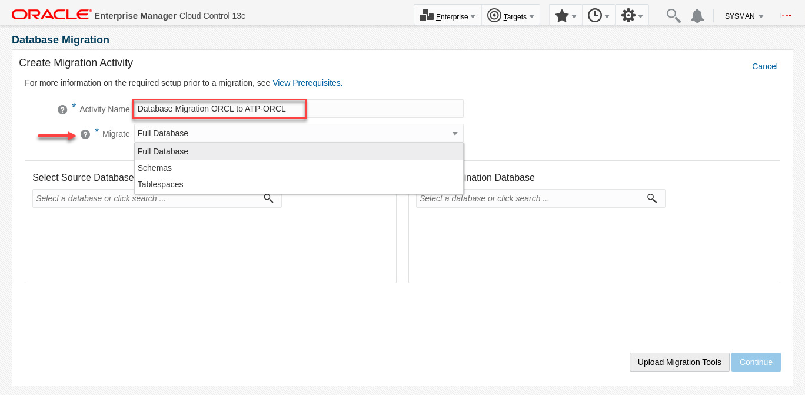
    - Select Source Database: orcl.subnet.vcn.oraclevcn.com
    - Select Destination Database: ATP-ORCL
    - Notice the checkmark for "Tools Validation". For this lab, CPAT tool was uploaded to Enterprise Manager in advance
      
    - Click Continue
5. On the Add Details screen, enter:
    - Source:
        - Database Credentials: EXP_USER (Named Credential)
        - Host Credential: ORACLE (Named Credential)
    - Destination:
        - Database Credential: ADMIN (Named Credential)
        - Agent Host Credential: ORACLE (Named Credential)
        - Service Name: Choose "*database name*_medium (TCPS)" from the drop-down list
    - Action:
        - Migration Method: Data Pump (default)
        - Recompile Invalid Objects After Migration: Unchecked (default)
        - Compare Performance After Migration: Checked (default)
        - Source Data Pump Directory: MWB_DIR
        - Encryption Password:

            ```text
            <copy>welcome1</copy>
            ```

    - Cloud Storage URL: "Object Storage URL" from the "Reservation Information" screen
    - Bucket Name: "Bucket Name" from the "Reservation Information" screen. You can also get this value from the OCI console: Navigate to "Storage"->"Buckets"
    - OCI Credential: OCI
    - Database OCI Auth Credential: ADMIN.MWB_CRED
      
    - Click Next
6. On the Customize screen, enter:
    - Export Options:

        Examine the various export options you can configure with Migration Workbench. For the purpose of this lab, we'll go with the defaults shown except for Parallel. The degree of parallelism you choose depends on the number of CPU cores on your source and target databases. We'll use 2 in this lab
        - Parallel: 2
    - Import Options:

        Examine the various import options you can configure with Migration Workbench. For the purpose of this lab, we'll go with the defaults shown except for Parallel. The degree of parallelism you choose depends on the number of CPU cores on your source and target databases. We'll use 2 in this lab
        - Parallel: 2

        Also notice mapping the Users tablespace in the source database to Data tablespace in the destination database
    - Compare Performance After Migration:
        - SQL Tuning Set (STS): Select "Use Existing" then choose "EXP_USER -- SH2STS"
    - Custom Scripts:

        Migration Workbench allows customization of your migration activity by allowing you upload and use Pre and Post migration scripts. For more information on Pre and Post scripts see: [Pre/Post Scripts for Provisioning] (<https://docs.oracle.com/pls/topic/lookup?ctx=en/enterprise-manager/cloud-control/enterprise-manager-cloud-control/13.5/emmwb&id=EMLCM-GUID-CDF550E0-9F86-42BC-909C-F224869F58CC>) in Oracle Enterprise Manager Cloud Control Database Lifecycle Management Administrator's Guide and [Pre and Post Request Creation / Deletion Scripts](https://docs.oracle.com/pls/topic/lookup?ctx=en/enterprise-manager/cloud-control/enterprise-manager-cloud-control/13.5/emmwb&id=EMCLO-GUID-223719D5-21B5-4AC3-A94B-0C7A3DFF0831) in Oracle Enterprise Manager Cloud Administration Guide
    - Transfer Options:
        - Source Database Monitoring Agent (default)

        
    - Click Review
7. On the "Review & Submit" screen:
    - Review your entries to make sure everything is correct
    
    - Click "Analyze Source" in the Source column. The analysis will open in a new browser tab and will take a few minutes to complete
    - When the analysis is complete review CPAT Results. The blockers and warnings in this case are expected as a few objects in the on-prem database are not available in autonomous database. When you run this activity in your environment ensure you address any issues identified on a case by case basis
    
    - Click on the previous browser tab to continue with the migration process
    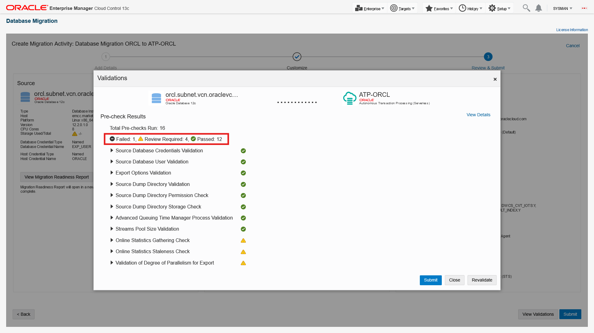
    - Click "Validate"
8. On the Validation screen:
    - Validation checks run for a few minutes and all checks should pass. If your results are different check your previous steps, fix the error and revalidate
    
    - Click "Close & Submit"
9. On the Submit Activity screen
    - Check the "Confirm that you have done source analysis" checkbox
    - Choose Schedule: Start Immediately (default)

        Examine the JSON file. Notice you can copy the generated JSON file to use with DevOps tools and REST APIs. For this lab however, we'll complete the migration using the Enterprise Manager graphical console
    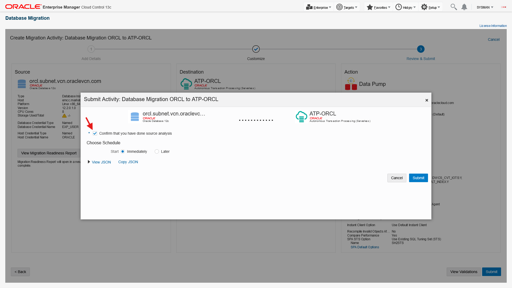
    - Click Submit
    - You should receive the message: "Migration activity submitted successfully."
    
    - Click "Close and Go Back to Activities Page"
10. On the Migration Activities screen:
    - The activity status will show "Scheduled" at first. Refresh the page after a few seconds and it will change to "Running". You can also change the Auto Refresh to every minute
    
    - Click on the "Running" link under Status to go to the Procedure Activity screen
11. On the Procedure Activity screen:
    - Choose Show: "Steps Not Skipped". The procedure should take about 8 minutes to complete
    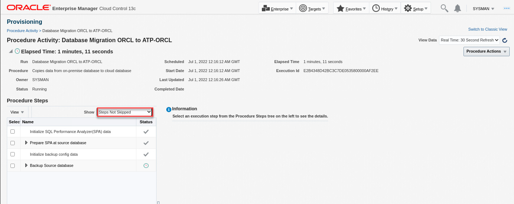
    - When the procedure completes, it will most likely show there were some errors. We'll check those when we analyze the migration
    
    - From the Enterprise Menu, click "Migration and Consolidation"->"Database Migration Workbench" to go back to the Migration Activities screen
12. On the Migration Activities screen:
    - Expand the drop-down menu on the right of the activity row
    
    - Click on View Analysis
13. On the View Analysis screen:

    Examine the analysis report. The report has 2 sections: A summary dashboard at the top, and a detail section with 3 tabs: Analysis, Export, and Import.
    - On the summary dashboard, review information and statistics for the validation activity, export phase, and import phase
    - In the details section:
        - Click the Validation tab to review validation checks that passed, failed, or skipped
        - Click the Export tab to review details on object errors encountered during export, export options, and export files
        - Click on the Import tab to review details on object errors encountered during import, import options, and import files
        - For further details on the errors review the log file using the Procedure Activity page shown earlier. On that page, you can check the checkbox for any step to display the log file on the screen. You can also download the file for offline viewing
        - In your environment, you may need to take actions such as granting specific object privileges to fix the errors. However, for this lab, the errors shown can be ignored

        

    When you are done analyzing the migration, click on "Migration Activities" in the top left of the report to navigate back to the Migration Activities screen
14. On the Migration Activities screen:
    - Expand the drop-down menu on the right of the activity row
    
    - Click on Compare Performance
15. On the Compare Performance screen:

    Examine the Performance Comparison report to analyze the database performance before and after the migration. The report has 3 sections:
    - General Information: Contains information about the task, workload, execution, and analysis before and after migration. The  comparison metric used is "Elapsed Time"
    - Report Summary: Contains 3 sections:
        - Projected Workload Change Impact: This shows the overall impact of the migration on the SQL workload, the improvement impact, and the regression impact
        - SQL Statement Count: This shows the overall statement count, the number of SQLs that improved, regressed, or were unchanged
        - Top 100 SQL Sorted by Absolute Value of Change Impact on the Workload: This shows the top 100 impacted SQLs with absolute percentage improvement. SQLs highlighted in green have improved performance due to improved execution plans or query costs. Those highlighted in red have regressed due to execution plan change or execution problems (for example query returning no rows or number of rows returned is different in the destination than in source, etc.)

            Check regressed SQLs to see execution statistics, before and after migration change analysis. Understand findings provided for each query to see which factors impacted the regressed SQLs. You can then take action based on findings provided in the Report Details section to improve SQL performance
    - Report Details: Contains detailed execution details for each SQL statement in the STS, including the SQL test, execution frequency, executions statistics, notes, findings, and execution plan before and after the migration

        
    - With automated performance optimization option available with Autonomous database, the database ignores existing indexes and dynamically generates new indexes based on workload. To show the performance comparison with no indexes, check the checkbox on the top right of the screen.
    - When you are done with performance comparison, click on "Migration Activities" in the top left of the report to navigate back to the Migration Activities screen
16. On the Migration Activities screen:
    - Expand the drop-down menu on the right of the activity row
    
    - Click Mark as Completed
    - Examine the guidelines on the Confirmation pop-up window, enter any comments as appropriate
    
    - Click Yes
     
    - Activity is marked completed

    You have now completed this task.

This completes the Lab!

## Learn More

- [Database Migration Workbench Guide](https://docs.oracle.com/en/enterprise-manager/cloud-control/enterprise-manager-cloud-control/13.5/emmwb/index.html)
- [Migrate Oracle Databases with a safety net using Migration Workbench (Blog)](https://blogs.oracle.com/observability/post/migrate-oracle-database-with-a-safety-net-using-migration-workbench)
- [Migrate Databases to Cloud and On Premises (Video)](https://www.oracle.com/explore/exadata-virtual-events/migrate-databases-to-cloud?lx=W4Fgb9&topic=Oracle%20Exadata%20Master%20Class)

## Acknowledgements

- **Author** - Amine Tarhini, Systems Management Specialist, Oracle Platform Solution Engineering
- **Contributors** -  Harish Niddagatta, Enterprise Manager Product Management, Rajendra Patil, Enterprise Manager Product Manager
- **Last Updated By/Date** - Amine Tarhini, July 2022
