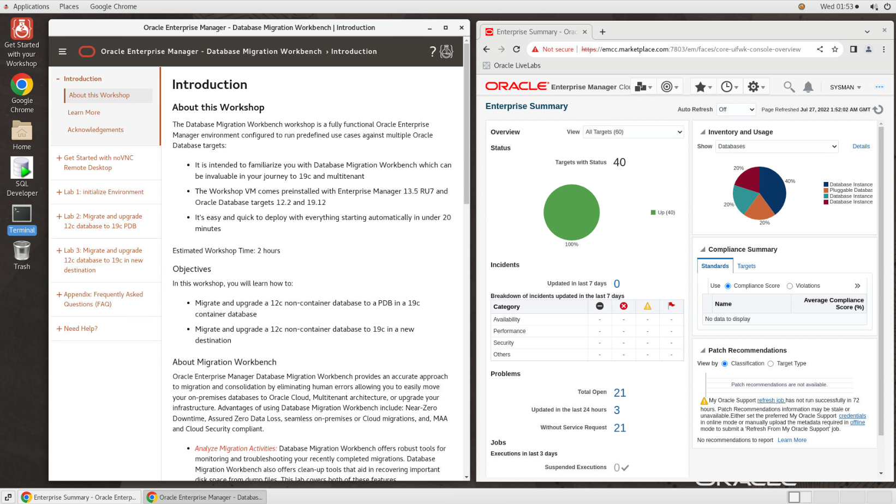
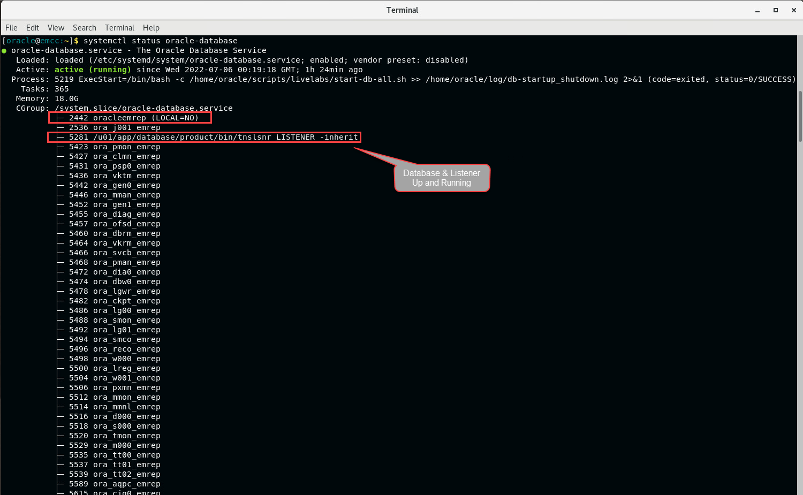
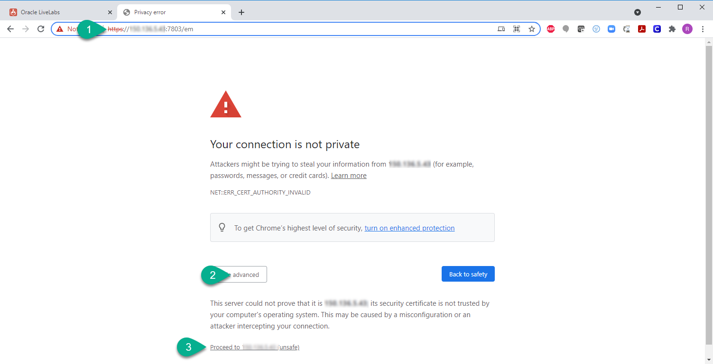

# Initialize Environment

## Introduction

In this lab we will review and startup all components required to successfully run this workshop.

*Estimated Time:* 10 Minutes.

Watch the video below for a quick walk through of the lab.

[](youtube:6BD2Z4zzEhI)

### Objectives
- Initialize the workshop environment.

### Prerequisites
This lab assumes you have:
- A Free Tier, Paid or LiveLabs Oracle Cloud account
- You have completed:
    - Lab: Prepare Setup (*Free-tier* and *Paid Tenants* only)
    - Lab: Environment Setup

## Task 1: Validate That Required Processes are Up and Running.
1. Now with access to your remote desktop session, proceed as indicated below to validate your environment before you start executing the subsequent labs. The following Processes should be up and running:

    - Database Listeners
        - LISTENER
        - LISTENER_1526
        - LISTENER_1527
    - Database Server Instances
        - emrep
        - orcl
        - orcl19c
        - cdb19c
    - Enterprise Manager - Management server (OMS)
    - Enterprise Manager - Management Agent (emagent)

2. On the browser window on the right preloaded with *Enterprise Manager*, click on the *Username*  and login with the credentials provided below.
(If the browser shows any certificate authority invalid error code, click on *Advanced* and add the exception to proceed as outlined in Appendix 2)

    ```
    Username: <copy>sysman</copy>
    ```
    ```
    Password: <copy>welcome1</copy>
    ```

    

    If the login page is not functioning properly (Please note that it takes up to 15 minutes after instance provisioning for all processes to fully start), open a terminal session and restart Enterprise Manager Services (OMS and emagent).

    ```
    <copy>
    sudo systemctl restart oracle-emcc
    </copy>
    ```


3. Confirm successful login. Please note that it takes up to 15 minutes after instance provisioning for all processes to fully start.

    

    If successful, the page above is displayed and as a result your environment is now ready.

4. If you are still unable to login or the login page is not functioning after reloading from the *Workshop Links* bookmark folder, open a terminal session and proceed as indicated below to validate the services.

    - Database services (All databases and Standard Listener)

    ```
    <copy>
    systemctl status oracle-database
    </copy>
    ```

    

    - Listener Service (Non-Standard)

    ```
    <copy>
    systemctl status oracle-db-listener
    </copy>
    ```

    

    - Enterprise Manager Services (OMS and emagent)

    ```
    <copy>
    systemctl status oracle-emcc
    </copy>
    ```

    

5. If you see questionable output(s), failure or down component(s), restart the corresponding service(s) accordingly

    - Database and Listener

    ```
    <copy>
    sudo systemctl restart oracle-database
    sudo systemctl restart oracle-db-listener
    </copy>
    ```

    - Enterprise Manager Services (OMS and emagent)

    ```
    <copy>
    sudo systemctl restart oracle-emcc
    </copy>
    ```

6. Validate *emcli* connectivity. From the terminal session on your remote desktop, run as user *oracle*

    ```
    <copy>
    . ~/.occ_oms.sh
    emcli login -username=sysman -password=welcome1
    </copy>
    ```

## Appendix 1: Managing Startup Services

1. Database services (All databases and Standard Listener)

    - Start

    ```
    <copy>sudo systemctl start oracle-database</copy>
    ```

    - Stop

    ```
    <copy>sudo systemctl stop oracle-database</copy>
    ```

    - Status

    ```
    <copy>systemctl status oracle-database</copy>
    ```

    - Restart

    ```
    <copy>sudo systemctl restart oracle-database</copy>
    ```

2. Listener Service (Non-Standard)

    - Start

    ```
    <copy>sudo systemctl start oracle-db-listener</copy>
    ```

    - Stop

    ```
    <copy>sudo systemctl stop oracle-db-listener</copy>
    ```

    - Status

    ```
    <copy>systemctl status oracle-db-listener</copy>
    ```

    - Restart

    ```
    <copy>sudo systemctl restart oracle-db-listener</copy>
    ```

3. Enterprise Manager Service (OMS and emagent)

    - Start

    ```
    <copy>sudo systemctl start oracle-emcc</copy>
    ```

    - Stop

    ```
    <copy>sudo systemctl stop oracle-emcc</copy>
    ```

    - Status

    ```
    <copy>systemctl status oracle-emcc</copy>
    ```

    - Restart

    ```
    <copy>sudo systemctl restart oracle-emcc</copy>
    ```

You may now proceed to the next lab.

## Appendix 2: External Web Access

If for any reason you want to login from a location that is external to your remote desktop session such as your workstation/laptop, then refer to the details below.

1.  Enterprise Manager 13c Console

    ```
    Username: <copy>sysman</copy>
    ```
    ```
    Password: <copy>welcome1</copy>
    ```
    ```
    URL: <copy>https://<Your Instance public_ip>:7803/em</copy>
    ```

    *Note:* You may see an error on the browser while accessing the Web Console - “*Your connection is not private*” as shown below. Ignore and add the exception to proceed.

    
    

<!-- ## Appendix 3: External Terminal Access (using SSH Key Based Authentication)

While you will only need the browser to perform all tasks included in this workshop, you can optionally use your preferred SSH client to connect to the instance should you prefer to run SSH Terminal tasks from a local client (e.g. Putty, MobaXterm, MacOS Terminal, etc.) or need to perform any troubleshooting task such as restarting processes, rebooting the instance, or just look around.

1. Refer to *Lab Environment Setup* for detailed instructions relevant to your SSH client type (e.g. Putty on Windows or Native such as terminal on Mac OS):

    - From the web session where you completed your provisioning request, do:
        - For **Reserve Workshop on LiveLabs** - Navigate to "*My Reservations* >> *Launch Workshop* >> *Workshop Instructions* >> *Lab: Environment Setup*"
        - For **Launch Free Trial Workshop** and **Run on Your Tenancy** - Click on the corresponding provisioning option and open *Lab: Environment Setup*
    - Authentication OS User - “*opc*”
    - Authentication method - *SSH RSA Key*
    - OS User – “*oracle*”.

2. First login as “*opc*” using your SSH Private Key

3. Then sudo to “*oracle*”. E.g.

    ```
    <copy>sudo su - oracle</copy>
    ``` -->

## Acknowledgements
  - **Author** - Rene Fontcha, LiveLabs Platform Lead, NA Technology
  - **Contributors** - Ashish Kumar
  - **Last Updated By/Date** - Rene Fontcha, LiveLabs Platform Lead, NA Technology, January 2023
