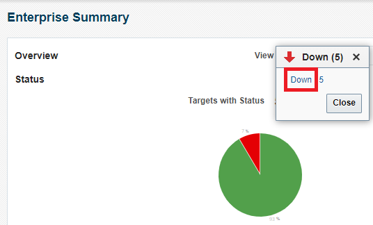
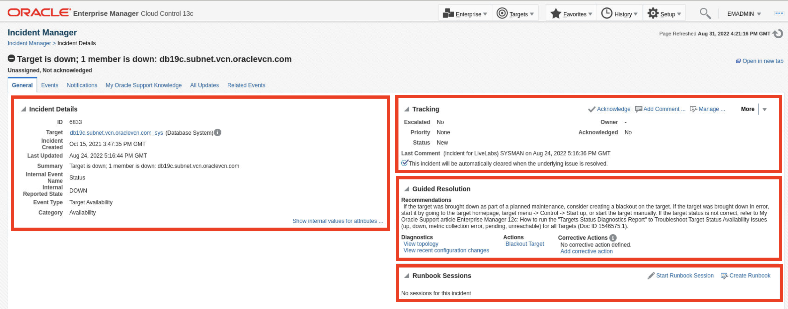
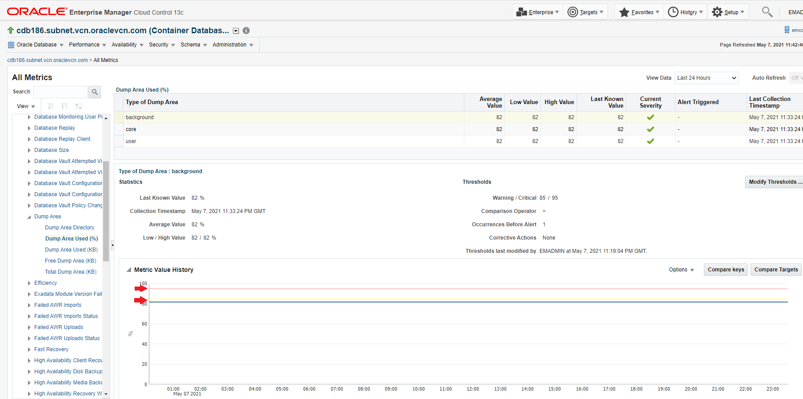
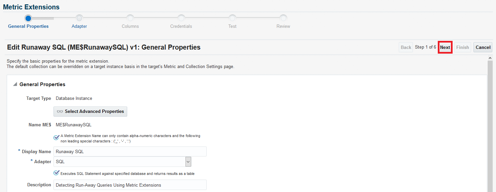
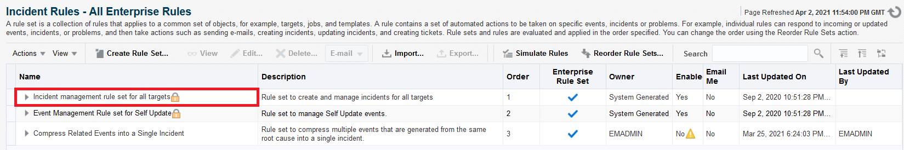

# EM Enterprise Monitoring Quick Tour
## Introduction
Oracle Enterprise Manager enables you to get complete monitoring visibility into your IT infrastructure, applications stack and applications that are critical to running your business.

- Single pane of glass monitoring for on-premises, hybrid, and Oracle Cloud Platform

- Comprehensive set of predefined performance and health metrics that enables lights-out monitoring of critical components in your environment, such as applications, application servers, databases, as well as the back-end components on which they rely, such as hosts and storage

- Rich set of alerting, incident management and notification capabilities to notify IT staff and integrate with your corporate ticketing systems

- Corrective Actions to auto-correct alerts and minimize service disruption

- Metric Extensions to monitor conditions specific to your environment

Watch the video below for a quick walk through of the lab.

### Objectives
The objective of this lab is to become familiar with Enterprise Monitoring capabilities using Oracle Enterprise Manager Cloud Control 13c.

*Estimated Time*: 55 minutes

### Lab Timing (Estimated)

  | **Step No.** | **Feature**                                   | **Approx. Time** | **Details**                                                                                                                                                                                                                    | **Value proposition**                                                                                                                                                                                                                                                                                                                                                                                                                                                                                                                                                      |
  |--------|-----------------------------------------------|------------------|--------------------------------------------------------------------------------------------------------------------------------------------------------------------------------------------------------------------------------|-----------------------------------------------------------------------------------------------------------------------------------------------------------------------------------------------------------------------------------------------------------------------------------------------------------------------------------------------------------------------------------------------------------------------------------------------------------------------------------------------------------------------------------------------------------------------------|
  | **1**  | Enterprise Summary                              | 5 minutes       | Explore Enterprise Summary page and drill down to see a list of down targets. View the list of critical incidents created for the down targets. Filter the Status pane to display a list of Database Instance targets.                         | Enterprise Summary enables you to get complete visibility into the overall status and health of your managed environment.                                                                                                                                                                                                                                            |
  | **2**  | Incident Manager                                | 5 minutes       | Triage unassigned incidents from Incident Manager and acknowledge then assign an incident                                                 | Incident Manager enables IT Staff to manage, track, and resolve actionable incidents in a collaborative way.                                                                                                                                                                                                                                                                                                                                                  |
  | **3**  | Metric and Collection Settings                         | 5 minutes       | Change the Warning and Critical threshold of a metric from Metric and Collection Settings page. Go to the All Metrics page and review the metric in context of the thresholds                                                                                                           | Enterprise Manager provides out-of-box monitoring and alert thresholds for managed targets.  You can still customize these monitoring settings based on your requirements.                                                                                                                                                                                                                                                                                                                                 |
  | **4**  | Corrective Actions                          | 8 minutes       | Create a new Corrective Action and associate it with a metric. | Corrective actions allow you to specify automated responses to metric alerts, saving administrators time and ensuring issues are dealt with before they noticeably impact users.  A corrective action can also be used to gather diagnostic information for an alert.                                                                                                                                                                                                                                                                                                                                                                                                                                                      |
  | **5**  | Metric Extensions                          | 5 minutes       | Test a Metric Extension on a target to see the results then deploy the same Metric Extension to multiple targets. | Metric Extensions let you extend Enterprise Manager's monitoring capabilities to cover conditions specific to your IT environment, thus enabling you to rely on Enterprise Manager as your single monitoring solution.                                                                                                                                                                                                                                                                                                                                                                                                                                                      |
  | **6**  | Monitoring Templates                          | 5 minutes       | Create a Monitoring Template from a Database Instance target. Deploy the Monitoring Template to other Database Instance targets to standardize monitoring settings across the enterprise. | Monitoring Templates enable you to define and implement monitoring standards across all targets in your environment.                                                                                                                                                                                                                                                                                                                                                                                                                                                       |
  | **7**  | Administration Groups and Template Collections                          | 10 minutes       | View the hierarchy of an existing Administrator Group. Update the target property for a new target so it can automatically be added to an Administration Group and inherit monitoring settings from that group. | Administration Groups and Template Collections enable you to enforce monitoring standards and automate monitoring setup in a scalable way.                                                                                                                                                                                                                                                                                                                                                                                                                                                       |
  | **8**  | Incident Rules                          | 10 minutes       | Review out-of-the-box incident rules shipped with Enterprise Manager. View an example of an incident compression rule set. Create a simple incident rule set to email DBA when there is a critical DB alert. | Incident Rules enable you to automate common incident management and notification actions such as creation of incidents based on events, sending email to IT Staff, opening tickets, auto-assigning incidents, escalating incidents, etc.                                                                                                                                                                                                                                                                                                                                                                                                                                                        |

## Task 1: Enterprise Summary

1. Log into an Enterprise Manager VM (using provided IP). The Enterprise Manager credentials are “emadmin/welcome1”.

    

2. Navigate to “Enterprise >> Summary”.

    

3. Enterprise Summary presents a single pane of glass view of the health of your Enterprise assets.
The Overview pane shows the Target Status of your IT estate. The Status section shows aggregated target availability so you can get a sense of what percentage is UP vs DOWN at a quick glance. The Green slice of the pie are your targets that are up. The Red slice of the pie are the targets that are down. Targets in red may be down due to unscheduled outages. Let’s drill down and take a look at them.

    

4. Click on the Red slice of the pie in the “Status” section. **Note:** You can ignore any differences between the count of targets in the screenshots vs. what you see in your lab environment. The number of targets may vary based on your lab environment.

      

   If a dialog pops up, click on ‘Down’ again.

       

5. In Enterprise Manager we have an “All Targets” page, which shows all of the targets being monitored by EM. When we clicked on the Red slice of the pie, we essentially placed a filter on the All Targets page to display only Down targets. From here, you can click on the individual target to go to the Target Home Page and take necessary actions such as starting up a Database Instance.

    

6. Click on “Enterprise >> Summary” to go back to the Enterprise Summary page.

    

7. Any Incidents, Problems, and Jobs requiring attention is displayed on the Enterprise Summary page with the ability to drill down into them. Click on the incidents link  for Availability.

    

8. A list of critical incidents is displayed in Incident Manager. You can manage the incidents by acknowledging, assigning ownership, changing the priority or status, and more.

    

9. Click on “Enterprise >> Summary” to go back to the Enterprise Summary page.

10. You can also filter the view based on the target type. Click on the View dropdown in the “Overview” pane and select “Database Instance” to look at the database status.

    

11.	The Status pane is filtered for Database Instance targets and displays a breakdown of the database statuses.

    

12.	The right hand pane of the Enterprise Summary page also has Inventory and Usage, Compliance Summary, and Patch Recommendations sections. Inventory and Usage shows a breakdown of database inventory by release. Compliance Summary shows the compliance score for the selected targets as well as security recommendations. Patch Recommendations links to MOS and shows the recommended patches for your targets.

     

## Task 2: Incident Manager

Incident Manager provides in one location the ability to search, view, manage, and resolve events, incidents and problems impacting your environment.

1. Log into an Enterprise Manager VM (using provided IP). The Enterprise Manager credentials are “emadmin/welcome1”.

    

2. Navigate to “Enterprise >> Monitoring >> Incident Manager”.

    

3. In Incident Manager, the Views section contains out-of-box views that comes shipped with Enterprise Manager. You can create your own views and share with others as well. By default, “All open incidents” view is displayed.

    

4. We will triage unassigned incidents and then acknowledge and assign an incident to an owner. Click on the incident with Summary text “Target is down; 1 member is down; db19c.subnet.vcn.oraclevcn.com”. Details of the incident will be displayed in the bottom pane.

    

5. Click on “Open in new tab” link to open the incident on a separate tab. You may need to temporarily allow popups in the browser.
    

6. The General tab of an incident contains 3 sections.

      - Incident Details contains information about the incident such as target name, creation date, type, and summary.
      - Tracking provides the priority, status, and ability to manage the incident.
      - Guided Resolution provides the ability to diagnose and take action to resolve the incident.

     

7. Click on “Acknowledge” in the Tracking section to acknowledge the incident. This will automatically assign the incident to the user acknowledging the incident.

     

     

8. Click on “Manage”.

     

9. Update the Status, Priority, and Escalation fields. Add a short comment and click OK.

     

10.	A confirmation is displayed with the Tracking section updated.

     

11.	Close the Incident Details tab and go back to the Incident Manager tab.

12.	Click on the Dashboard button next to “Incident Manager: All open incidents”.

     

13.	Incident Dashboard provides a holistic view of your incidents. It contains 3 sections.

       - Summary: Instant count of incidents that are open, fatal, escalated, unassigned, and unacknowledged. These are the incidents that need to be triaged or worked on immediately. Fatal and Escalated count are highlighted in Red by default.
       - Charts: Provides an easy-to-understand look at the current incident distribution and management status for each incident. Drill down capability with stackable filters to slice and dice data any way you like. Customize to add/update/remove charts to provide a personalized view in Incident Manager.
       - Incident List: Shows the open incidents listed in reverse chronological order by last updated time stamp. From this list, you can perform requisite incident lifecycle actions such as escalating, prioritizing, acknowledging, assigning owners, and adding comments to the incident. The incident list will reflect any filters applied.

     

14.	Click on the “Fatal” link to drill down into these incidents.

     

15.	Incident Dashboard is filtered for incidents with “Fatal” severity.

     

## Task 3: Metric and Collection Settings

Metric and Collection Settings page is where we can view and configure thresholds, collection schedules, and Corrective Actions for the metrics being monitored for the target.

1. Log into an Enterprise Manager VM (using provided IP). The Enterprise Manager credentials are “emadmin/welcome1”.

     

2. Navigate to “Targets >> Databases” to see the list of Database targets.

     

3. Click on “cdb186.subnet.vcn.oraclevcn.com” to go to the target home page.

     

4. Navigate to “Oracle Database >> Monitoring >> Metric and Collection Settings”.

     

5. Oracle ships with default OOTB Metrics and settings. This includes Metrics, Thresholds, and Collection Schedules. This aims to cover generic use cases to get you started. We recommend that you customize the monitoring settings of your targets according to your requirements.
What we’re looking at right now are database metrics with default settings. These are recommended settings; however, you can modify anything to suit your needs.
As Best Practice:
      - Disable collection for metrics you don’t care about.
      - Set thresholds only on metrics you want to be alerted on.
      - Save the modified metric settings and apply to targets using monitoring templates.

     

6. By default, the "Metrics with thresholds" view is displayed. This view will show metrics with a Warning or Critical threshold defined.

     

7. There are other out-of-box views available to select from.

     

8. Scroll down to “Dump Area Used (%) metric and click on the “Every 30 Minutes” Collection Schedule link.

     

9. Change the Collection Schedule to 15 minutes and click Continue.

     

10.	Scroll down to Dump Area Used (%) metric again. Click on the Edit icon to change the Warning and Critical thresholds.

     

11.	Currently the Warning threshold is set to > 95%. Change the Warning threshold to 85% and Critical threshold to 95% and click Continue.

     

   The new thresholds should appear in the main Metric and Collection settings page.

12.	Click OK to save changes, then you should see a Confirmation message . Click OK.

     

     

13.	Navigate to “Database >> Monitoring >> All Metrics”.

     

14.	The All Metrics page shows the collected data for all of the metrics on the target.

     

15.	Expand and highlight the Dump Area Metric Group.

     

16.	Click on Dump Area Used(%) under the All Metrics palette and then click on the ‘background’ first row in the Dump Area Used(%) table.  

     

17.	You should see the metric data for Dump Area Used(%) for the background processes.  By default, the last 24 hours are shown but you can change time periods using the View Data dropdown.  In the metric chart, click on Options to view different options for the chart, then click on the Show Thresholds option.

     

18. The Warning and Critical thresholds for the metric will now be shown with the chart as yellow and red lines respectively.  As you review the metric, you can also visually see how close the metric values are to its Warning and Critical thresholds

     

## Task 4: Corrective Actions

Corrective Actions automates response to metric alerts and events. A Corrective Action can start the DB listener when it unexpectedly goes down or it can run shell scripts to collect diagnostic data. You can create a custom Corrective Action once and grant access for other Admins to use. We ship with a long list of pre-defined Corrective Actions to get you started.

1. Log into an Enterprise Manager VM (using provided IP). The Enterprise Manager credentials are “emadmin/welcome1”.

     

2. Navigate to “Enterprise >> Monitoring >> Corrective Actions”.

     

3. Select “Add Space to Tablespace” from the “Create Library Corrective Action” drop down field and click Go. This Corrective Action will automatically increase tablespaces should they reach a user defined threshold.

     

4. Give the Corrective Action a name and click on the “Parameters” tab.

     

5. There are a number of parameters available for the Add Space to Tablespace corrective action. These parameters can be adjusted according to your needs. For the purpose of this lab, we will leave the parameter values as is and click on Save to Library.

     

6. The Corrective Action is created in Draft status. This gives you an opportunity to test your Corrective Action first before making it available for general use.  For this lab, let’s assume we are ready to make it available for general use. Click on Publish to publish the Corrective Action.

     

7. Click on Yes to confirm you want to publish the Corrective Action.

     

8. A Confirmation banner will appear at the top of the page.

     

9. Navigate to “Targets >> Databases”.

     

10.	Click on the link for “finance.subnet.vcn.oraclevcn.com” database instance.

     

11.	Navigate to “Oracle Database >> Monitoring >> Metric and Collection Settings”.

     

12.	Scroll down to “Tablespace Space Used (%)” metric and click on the Edit icon.

     

13.	Click on Edit in the “Monitored Objects” section.

     

14.	Click Add next to the Warning field under the Corrective Actions section.

     

15.	Select the Add Space to Tablespace Corrective Action that you just created and click Continue.

     

16.	Notice there is now a Corrective Action specified for Warning threshold violations. The Corrective Action will trigger when Tablespace Space Used (%) >= 85%. Also notice the Warning message at the top of the screen indicating that the metric settings for the target are managed by the monitoring templates associated through the Administration Groups.  Administration Groups will be discussed in Task 7 below, but this message indicates that if we want to keep this setting (i.e. associating the corrective action for this metric), you will also need to click on the ‘Template Override’ option at the bottom of the screen. Click Continue.

     

    In the screen that comes up, click Continue.

     

17.	Click OK.

     

    Click Continue.

     

    Click OK.

     

## Task 5: Metric Extensions

Metric Extensions expand Oracle's monitoring capabilities to monitor conditions specific to your IT environment. It allows you to create custom metrics on any target type. You can create it once and deploy it to multiple targets at once.

For this lab, a metric extension has already been created and is in Editable status.  As part of creating a metric extension, you can test it against some targets.  You will go through the process of testing the metric extension against some targets.

1. Log into an Enterprise Manager VM (using provided IP). The Enterprise Manager credentials are “emadmin/welcome1”.
    

2. Navigate to “Enterprise >> Monitoring >> Metric Extensions”.
    

3. Highlight ME$RunawaySQL metric extension.

    

4. Click on Actions >> Edit.

    

5. Steps 1 through 4 show the SQL and the metric columns of the metric extension that has been already defined for you. Click on Next until you reach “step 5 of 6”.

    

6. Click Add to select targets to test the Metric Extension.

    

7. Hold down the Control key (or the Command Key on Mac) and select 2 database instance targets to test the Metric Extension.

    

8. Click on Run Test.

    

9. The Test Results section shows the results of running the Metric Extension on the selected targets.

    

10.	Click Finish.

    

11.	Highlight ME$RunawaySQL metric extension again and select Actions >> Save as Deployable Draft. At this point, you could deploy the metric extension to different test targets and review the metric data.   If you need to make changes to the metric definition, you will need to create a new version.  For now, let’s assume we’ve reviewed the metric data, verified it is correct and are ready to publish.

    

12.	Click on Actions >> Publish Metric Extension. Once published, the metric extension is ready for general use.  

    

13.	Click on Deploy To Targets.

    

14.	Click Add and select the same targets that you tested on.

    

15.	Click Submit to deploy the metric extension to the selected targets.

    

16.	A confirmation banner will appear confirming the deployment has been submitted. The Status of the deployment will be “Scheduled”. Manually click on the page refresh icon.

    

17.	When the list is empty in the Pending Operations page, it means the deployment has completed. Click on the Metric Extensions link.

    

18.	The Metric Extensions page shows the ME$RunawaySQL metric extension has been deployed to 2 targets. The RunawaySQL metrics will start to be collected for the 2 targets.

    

## Task 6: Monitoring Templates

Monitoring templates enable you to deploy standardized monitoring settings across the targets in your data center. Enterprise Manager allows you to define monitoring settings on one target, and deploy the same settings to other targets. This feature is called Monitoring Template. When a change is made to a template, you can reapply the template across affected targets in order to propagate the new changes. The apply operation can be automated using Administration Groups and Template Collections. For any target, you can preserve custom monitoring settings by specifying metric settings that can never be overwritten by a template.

1. Log into an Enterprise Manager VM (using provided IP). The Enterprise Manager credentials are “emadmin/welcome1”.

    

2. Navigate to “Enterprise >> Monitoring >> Monitoring Templates”.

    

3. Click on Create.

    

4. You can initialize the contents of a monitoring template by copying the existing monitoring settings of a target. Click on the Search icon to search for a target.

    

5. Select Database Instance target type then select cdb186.subnet.vcn.oraclevcn.com.

    

6. Click Continue.

    

7. Give the Monitoring Template a meaningful name then click on “Metric Thresholds” tab.

    

8. Any changes can be made to Metric Thresholds and Other Collected Items before saving the Monitoring Template. Click OK to save the template.

    

9. The Monitoring Template is created and we will apply the template to another Database Instance target. Highlight the Monitoring Template you just created and click Apply.

    

10.	In the screen that comes up, click on ‘Add’ to add a target.

    

    Select db19c.subnet.vcn.oraclevcn.com target.   

      

11.	Click Finish to apply the Monitoring Template to the selected target.

    

12.	A Confirmation banner will appear and the Status of the Apply Operation shows Pending.

    

13.	Manually click on the Page Refresh icon. The status of the template apply operation is now Passed.

    

## Task 7: Administration Groups and Template Collections

Administration Groups are designed to simplify the process of setting up targets for management in Enterprise Manager. Typically, management settings such as monitoring settings and compliance standards are applied to a target manually or by custom scripts defined by the administrator. With Administration Groups, you first define a hierarchy of Administration Groups where targets in each group have the same management settings.  Next for each Administration Group, define and combine management settings (e.g. monitoring settings, compliance standards and cloud policies) into a container (called template collections) and associate them with the appropriate Administration Group. Once that one-time setup is done, all you need to do is add the target to the appropriate Administration Group, and Enterprise Manager will automatically apply the associated management settings to the target as it joins the group.  This greatly simplifies and streamlines the process of target setup. It also enables a datacenter to easily scale as new targets are added to Enterprise Manager for management.

1. Log into an Enterprise Manager VM (using provided IP). The Enterprise Manager credentials are “emadmin/welcome1”.

    

2. Navigate to "Setup >> Add Target >> Administration Groups".

    

3. Click on the Overview tab.

    

4. The Overview tab of Administration Groups and Template Collections provides an introduction of how to get started along with detailed steps to walk you through the process. For the purpose of this lab, we have already created the hierarchy, template collections and associations. However, we will look at each step to see how the Administration Group was designed and constructed.

    

5. There are 4 steps involved to setup an Administration Group and Template Collection.
     - step 1: Setup the Administration Groups Hierarchy
     - step 2: Create Template Collections
     - step 3: Associate Template Collections to Administration Groups
     - step 4: Synchronize the targets with the selected items

    

6. Click on the Hierarchy tab.

    

7. The Hierarchy tab is where you design the levels of your Administration Group hierarchy. Logically, you can think of the top-level group in the hierarchy as a group containing all the targets.  Next consider how you would sub-divide this group of all targets into different sub-groups based on their monitoring settings.  For example, production targets that have one set of monitoring settings would be in one sub-group, and test targets that have a different set of monitoring settings would be in a different sub-group.  These sub-groups represent the next level in the administration group hierarchy.  
To create this hierarchy, use target properties to define the membership criteria for the groups at each level in the hierarchy.  For our example, we used Lifecycle Status target property (with values of Production and Test) to define the membership criteria of the Production and Test groups respectively.

          

8. Click on the Template Collections tab.

     

9. Template Collections is a combination of Monitoring Templates, Compliance Standards and/or Cloud Policies that are applied to targets upon joining an Administration Group. In this lab, we have already created two template collections. Highlight “Non-Production Template Collection” and click View.

     

10.	The Non-Production Template Collection contains two Monitoring Templates. Click OK once you are done reviewing the templates.

     - Dev\_Test\_PDB\_Monitoring\_Template: This monitoring template will be applied to Pluggable Database targets that join the Admin Group with their Lifecycle Status target property defined as "Test".

     - Dev\_Test\_DB\_Instance\_Monitoring\_Template: This monitoring template will be applied to Database Instance targets that join the Admin Group with their Lifecycle Status target property defined as "Test".

     

11.	Highlight “Production Template Collection” and click View.

     

12.	The Production Template Collection contains 3 Monitoring Templates. Click OK once you are done reviewing the templates.

     - Prod\_PDB\_Monitoring\_Template: This monitoring template will be applied to Pluggable Database targets that join the Admin Group with their Lifecycle Status target property defined as "Production".

     - Prod\_DB\_Instance\_Monitoring\_Template: This monitoring template will be applied to Database Instance targets that join the Admin Group with their Lifecycle Status target property defined as "Production".

     - Prod\_Host\_Monitoring\_Template: This monitoring template will be applied to Host targets that join the Admin Group with their Lifecycle Status target property defined as "Production".

     

13.	Click on the Associations tab.

     

14.	The Associations tab is where the association between Template Collections and Administration Groups take place. In this lab we have already associated the “Production Template Collection” with “Prod-Grp” Admin Group. Any target that joins “Prod-Grp” Admin Group will automatically have the Monitoring Templates from “Production Template Collection” applied.

     

15.	We will go through the exercise of associating a Template Collection with “Test-Grp”. Select “Test-Grp” Admin Group and click on "Associate Template Collection".

     

16.	Highlight "Non-Production Template Collection" and click Select.

          

17.	A Confirmation window will indicate the number of targets that will have Monitoring Templates applied after associating the Template Collection. Click Continue.

     

18.	A Confirmation banner will display an “Association is successful” message and the “Test-Grp” Admin Group is now associated with “Non-Production Template Collection”.

     

19.	Click on the “Test-Grp” group name to go to its homepage.

     

20.	In the group homepage for Test-Grp, review the Synchronization Status region.  Notice there are 3 targets pending synchronization (i.e. applying of templates) and it is scheduled for a future date specified in the Next Synchronization field.    Instead of waiting for the synchronization to occur, let’s do the synchronization process now by clicking on the “Start Synchronization” button..

     

21.	After about a minute or so, you should see the 3 targets synchronized.   You may have to hit the page refresh button to see this.

     

22.	We will add a target to “Test-Grp” Admin Group and confirm the monitoring template has been being applied to the target. Navigate to “Targets >> Databases”.

     

23.	Click on “cd186.subnet.vcn.oraclevcn.com” target.

     

24.	Navigate to “Oracle Database >> Target Setup >> Properties”.

     

25.	Click Edit and set the Lifecycle Status for this target to “Test”. Click OK.

     

26.	Navigate to “Setup >> Add Target >> Administration Groups”.

     

27.	Click on “Test-Grp” Admin Group link to go to the Admin Group homepage.

     

28.	Notice in the Synchronization Status section, there is now one additional (total of 4) synchronized targets for Monitoring Templates. **Note:** You may need to click on the page refresh icon if the count under Synchronized Targets doesn’t update right away.

     

## Task 8: Incident Rules

Incident Rules specify actions to be taken on events.  For example, when a target down event occurs, you might want to create an incident for the event and send email notification on the  incident. A rule set is a collection of these rules and they apply to a common set of targets such as hosts, databases, groups. Enterprise Manager ships with out-of-the-box rule sets to get you started. Out-of-the-box rule sets have a Lock icon next to them because they cannot be modified. We recommend making a copy of the rule set, and modifying the copy to suit your needs. Alternatively, you can create new rule sets from scratch.

1. Log into an Enterprise Manager VM (using provided IP). The Enterprise Manager credentials are “emadmin/welcome1”.

     

2. Navigate to "Setup >> Incidents >> Incident Rules".

     

3. Expand “Incident management rule set for all targets” rule set.

     

4. The “Incident management rule set for all targets” rule set covers common use cases for which incidents should be created such as target down events or critical metric alerts. You can enable or disable the rules based on your monitoring requirements. If you want to change a rule, you should make a copy of the rule set and modify it.

   Highlight "Create incident for critical metric alerts" and click View.

     

5. The "Create incident for critical metric alerts" incident rule will create an incident when the event type is a metric alert and the Severity is Critical.

     

6. Click on the “Incident Rules” link to go back to Incident Rules page.

     

7. Scroll down and expand "Compress Related Events into a Single Incident" rule set.

     

8. The “Compress Related Events into a Single Incident” rule set is a rule set that we created to showcase the new compression feature in EM 13c. Here we have 4 common use cases which are independent from one another. For each of these use cases, Enterprise Manager will compress the related events into a single incident. From a manageability standpoint, it will be much easier for the Administrator to manage one incident containing multiple related  events as a logical unit, as opposed to managing these individually. The Rule set covers the use cases of creating ONE incident when:

      - One or more members of cluster database targets go down.
      - One or more targets with different target types on the same host go down.
      - One or more members of WebLogic Domain target cross the metric threshold.
      - One or more hosts or entire site goes down (e.g., Site wide outage).

     

9. In this lab, we will create a new rule set and add a rule to notify the DBA when there is a critical DB alert. Click on “Create Rule Set”.

     

10.	Provide a name for the Rule Set and select the following target types.

     - Database Instance
     - Pluggable Database

     

11.	Scroll down and click Create in the Rules section.

     

12.	Keep the default selection of "Incoming events and updates to events" and click Continue.

     

13.	Configure the following fields and click Next.\
Type: Metric Alert, All events of type Metric Alert\
Severity: In Critical

     

14.	Click Add in the "Create New Rule: Add Actions" page.

     

15.	Configure the following fields and click Continue.                     

    - Conditions for actions
        - Keep the default of “Always execute the actions”
    - Create Incident or Update Incident  
        - Click on option “Create incident (if not associated with one)”   
        - Keep the default of  “Each event creates a new incident”

     

16.	Click Next.

     

17.	Enter a name for the Rule and click Next.

     

18.	Click Continue.

     

19.	You’ll be brought back to the main page for Create Rule Set.  Scroll down to the Rules section and click on ‘Create’.

       

20.	Choose the option “Newly created incidents or updates to incidents” and click Continue.

     

21.	Choose “Specific Incidents”.   And under this option,  select “Rules that created the incidents” and then select the rule that you just created in the previous step.   Then click Next.

       

22.	Click ‘Add’

     

23.	In the ‘Email To” field,  specify DB TARGET USER       Then click Continue.

     

24.	Click Next.

     

25.	Enter a name for the Rule and click Next.

     

26.	Click Continue.

     

27.	Click Save

     

28.	The new rule set now appears at the bottom of the Incident Rules page.

     

    **Note:**  Rule Sets are evaluated and executed in the order specified under the Order column.  When you create your own rule set that has an action to create an incident, you typically want to reorder it such that its order is ahead of the out-of-box rule sets.  This is to ensure that your rule set that creates the incident will be used instead of the out-of-box rule set.   However, for this lab exercise, we can skip this step.

## Learn More

  - [Oracle Enterprise Manager](https://www.oracle.com/enterprise-manager/)
  - [Enterprise Manager Documentation Library](https://docs.oracle.com/en/enterprise-manager/index.html)
  - [Enterprise Monitoring](https://docs.oracle.com/en/enterprise-manager/cloud-control/enterprise-manager-cloud-control/13.5/emadm/enterprise-monitoring.html#GUID-7BB979B8-7C87-4FC2-9E17-D2F5246A120F)

## Acknowledgements
- **Author** - Karilyn Loui, Oracle Enterprise Manager Product Management
- **Contributing Author** - Ana McCollum, Daniel Suherman, Murtaza Husain, Desiree Abrokwa, Oracle Enterprise Manager Product Management
- **Adapted for Cloud** - Rene Fontcha, Master Principal Solutions Architect, NA Technology
- **Last Updated By/Date** – Desiree Abrokwa - Enterprise Manager Product Management [Dec 2021]
