# Hybrid Multitenant Database Lifecycle Management
## Introduction

This workshop will help you understand how one can utilize Enterprise Manager to make the best use of Oracle Database Multitenancy , and Lifecycle Management capabilities. We also have labs which will help you understand how organizations can utilize the Database Private Cloud which allows self-service users to request and manage Pluggable Databases (PDBs) with ease.

*Estimated Lab Time: 60 minutes*

Watch the video below for a quick walk-through of the lab.
[Hybrid Multitenant Database Lifecycle Management](videohub:1_fls378ro)

### About Hybrid Multitenant Database Lifecycle Management

Oracle Enterprise Manager's Database Lifecycle Management (DBLM) Pack  comes with out-of-box Deployment Procedures to provision, clone, and patch various configurations of the Oracle Database. The Management Pack offers new capabilities that simplify support for the entire lifecycle of pluggable databases, including migration, plugging and unplugging. The Management Pack features include pluggable database (PDB) provisioning and management from the self-service portal, PDB patching and upgrades, and PDB relocation to new platforms.

Cloud Management Pack (CMP) that resides on top of DBLM, provides  lifecycle management of PDBs in Database Private Cloud. This enables the Self Service Users to Provision, Plug-Unplug , Clone and Migrate PDBs in the Private Cloud.


### Objectives

The objective of this workshop is to highlight Oracle Enterprise Manager 13c Lifecycle Management capabilities for multitenant databases.

| **Task No** | **Approx. Time**                                                                | **Functionality** | **Description**                                                                                                                                                                      | **Benefits**                                                                                                                                                                                                                   |
|--------|----------------------------------------------------------------------------|------------------------|----------------------------------------------------------------------------------------------------------------------------------------------------------------------------------|-----------------------------------------------------------------------------------------------------------------------------------------------------------------------------------------------------------------------------------------|
| 1    | 10min  | Create a Pluggable Database (PDB)    | Create a Pluggable database (PDB) within a CDB and run a post-script to lock/unlock accounts | By creating a PDB, you can isolate sensitive data from the rest of the database and simply the management of your database. Run pre and post hardening scripts as part of provisioning automation which otherwise would be a time consuming task                                                                                                          |
| 2    | 10min  | Un-plug/Plug an existing Pluggable Database   | Explore the option to Un-plug a PDB and later use the 'Plug' option to plug it back in the same or a different CDB as and when needed.  | Unplug and Plug provides you the flexibility to move your PDBs across same or different CDBs. Helps in resource optimisation and easy maintenance of your databases. Isolate the data in a given PDB as and when needed.        |
| 3    | 5min  |Clone an existing Pluggable Database  | Create a clone of your PDB for dev/test purpose.  | Explore the clone functionality to increase your development and testing speed. A quick clone of your PDB for dev/test purposes can help you to develop   and test new features more quickly and easily. |
| 4    | 5min   | Patch (update) an existing Pluggable Database  | Patch (Update) a pluggable database by updating it to higher version of CDB     | Update Gold image with the latest security patch recommendations and use this image to patch databases, which will ensure you comply with the security policy and follow industry defined best practice to keep databases secure.                       |
| 5    |10min | Compliance Management for Pluggable Database      | Apply a industry Standard for Oracle 19c Database CIS V1.0.0 - Level 1 - RDBMS using Unified Auditing for Oracle Pluggable Database on PDB, generate report and validate the results.  | Implementing stringent security measures and achieving regulatory compliance by aligning with CIS benchmarks, enhances and operational efficiencies of database management through centralized auditing and monitoring, fostering and enhancing multitenant pluggable databases integrity and operational efficiencies.                |
| 6    | 10min  | Create a PDB using Self Service Portal - PDBaaS   | Create a PDB using Self-Service Portal and explore PDBaaS. Request a PDB using service catalogue and resize the PDB to explore scaling functionality.                                                       | Self Service portal enables developers and application users to provision their own databases without compromising on security, and, also adhering to organisational policies and compliances.                              |
| 7    | 10min       | Review Administrative Setup for PDBaaS (Private Cloud)                     | An overview of the administrative setup involved for PDBaaS (Private Cloud) which includes setting up a PaaS Infrastructure Zone, Pluggable Database Pool, Data Sources, Service Template, etc. | Setup private cloud using Enterprise Manager where admin can define resources and EM’s placement algorithm and make sure that resources are utilized to their best. It is complimented by metering, and show back/chargeback capabilities. |


### Prerequisites
- A Free Tier, Paid or LiveLabs Oracle Cloud account
- You have completed:
    - Lab: Prepare Setup (*Free-tier* and *Paid Tenants* only)
    - Lab: Environment Setup
    - Lab: Initialize Environment

*Note*: This lab environment is setup with Enterprise Manager Cloud Control Release 13.5 and Database 19.10 as Oracle Management Repository. Workshop activities included in this lab will be executed both locally on the instance using Enterprise Manager Command Line Interface (EMCLI) or Rest APIs, and the Enterprise Manager console (browser)

## Task 1: Create Pluggable Database (PDB)

1. On the browser window on the right preloaded with *Enterprise Manager*, if not already logged in, click on the *Username* field and login with the credentials provided below.

    ```
    Username: <copy>sysman</copy>
    ```

    ```
    Password: <copy>welcome1</copy>
    ```

    


2.  Navigate to  ***Enterprise >> Provisioning and Patching >>
    Database provisioning***

    


3.  On the Database Provisioning page, in the *Related Links* section on the left menu pane, click **Provision Pluggable Databases**

    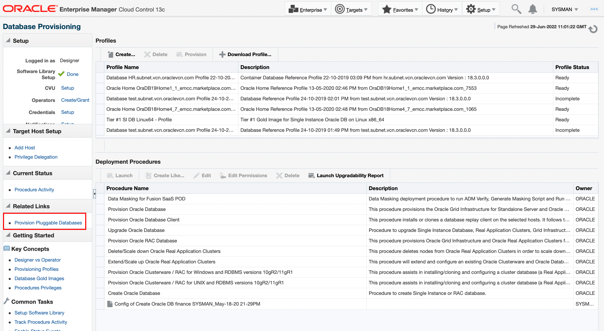


4.  On the Provision Pluggable Database Console, in the *Container   Database* section, click on the magnifier to select  **cdb186.subnet.vcn.oraclevcn.com** within which you want to create new PDBs.

    
    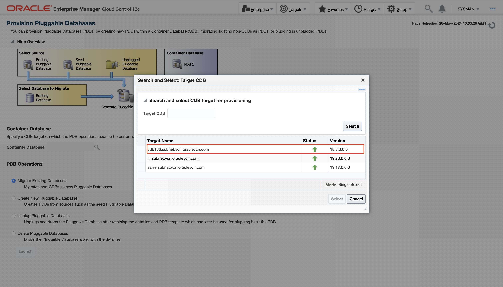


5.  In the PDB Operations section, select **Create New Pluggable Databases**.

    Click **Launch**

    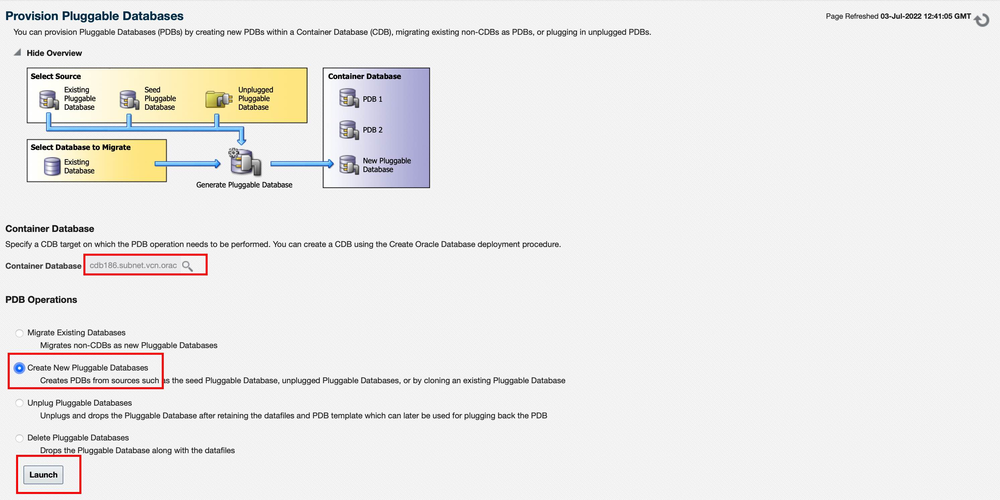


6.  In the PDB Creation Options section, choose **Create a New PDB**.

    Use the Named credentials (*ORACLE*) for login.

    Click **Next**


    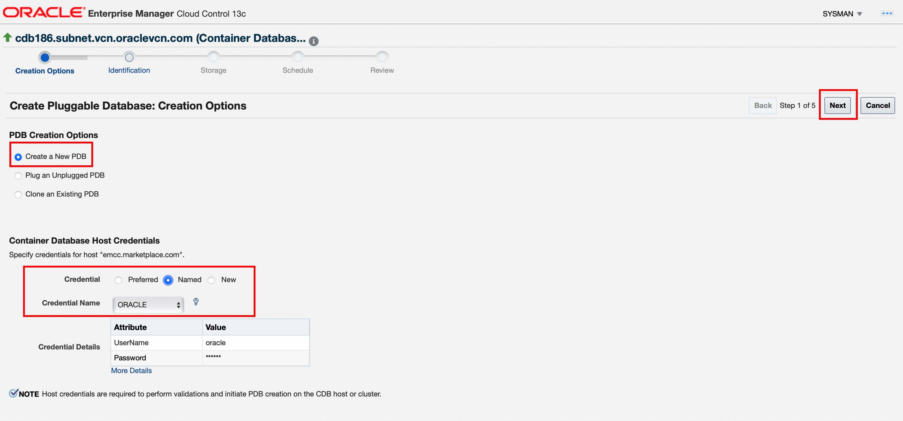


7. In the Identification page, Enter a unique name for the PDB you are creating (*prov_pdb*).


    *In your data center, if you want to create multiple pluggable databases on a container, you can select ‘Create Multiple Copies’ to optimize time required to create these multiple pluggable databases*


    In the PDB Administrator section, enter the credentials of the admin user account you need to create for administering the PDB.     


    ```
    Username: <copy>PDBADMIN</copy>
    ```

    ```
    Password: <copy>welcome1</copy>
    ```

      Click **Next**

    


9. For storage option
    click on **Use Common Location for PDB Datafiles** radio button.  
    *Storage type* and *Location* field gets auto populated with default values.

    The Temporary Working Directory is auto filled as **/tmp**


    


10. Optionally, you can also select a post-script, which will be executed post PDB creation.

    On the same Storage Configuration page under the **Post Creation Scripts**  , click on  “Select from software library” checkbox and click on the magnifier to choose the script.
  

  In the dialog box that appears, type “**unlock**” and click on the magnifier. select the script '*Script to unlock account*' and click **select**

  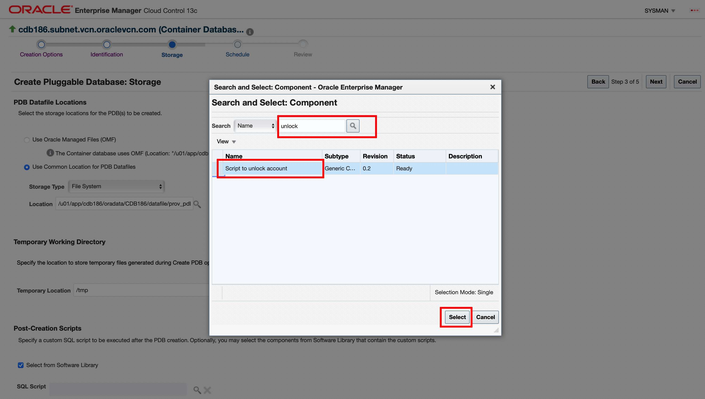

  Verify all the parameters on the page and click **Next**

  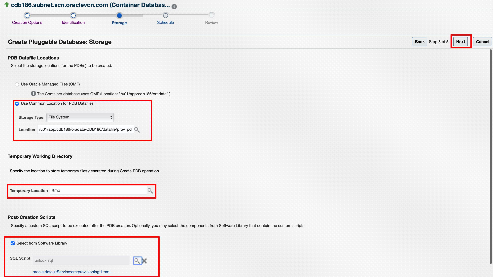


11. Schedule **Immediately** or later.

    Click **Next**.

    


12. In the Review page, review the details you have provided for the deployment procedure and  click **Submit**

    You can now click on **View Execution Details** link to see details.

    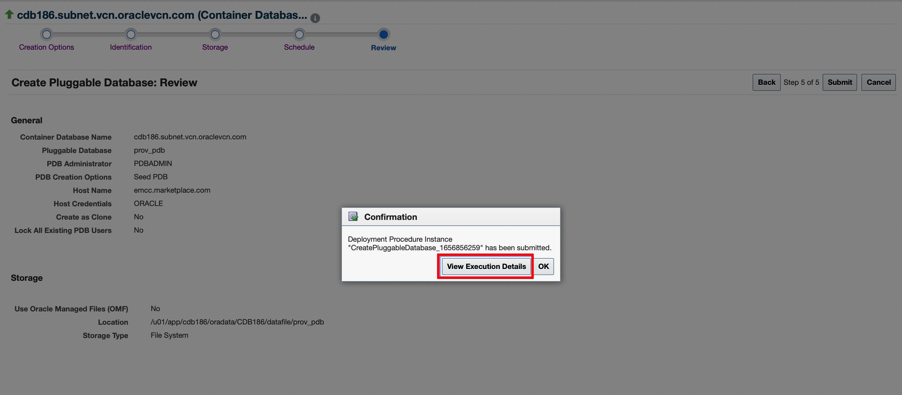


13. On Procedure Activity, select specific execution step from the procedure step tree to see details of the execution log.

    Setup View Data to be refreshed with specific time interval to refresh page. The procedure takes about 2-3 minutes to complete.

    Wait for **Status: Succeeded** which indicates the procedure ran successfully.


    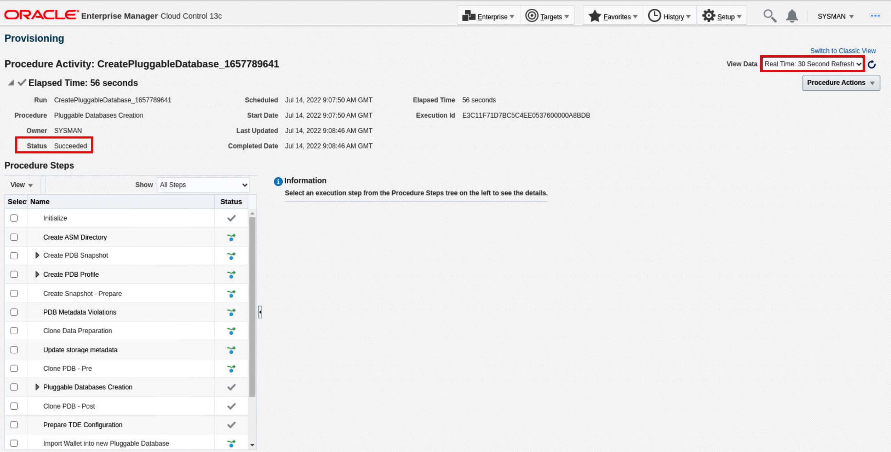


14. You can **Navigate to Targets >> Databases**.

    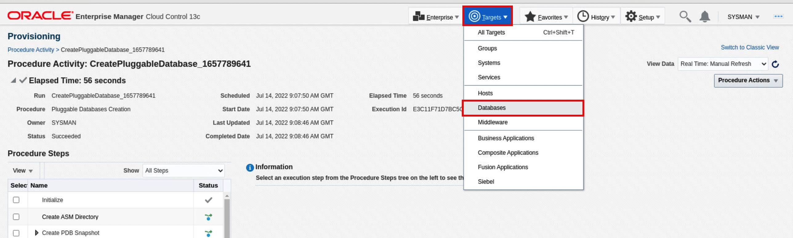

    Click on drop down arrow next to **CDB186** and click on the pluggable database drop down arrow, you will see the newly created PDB

    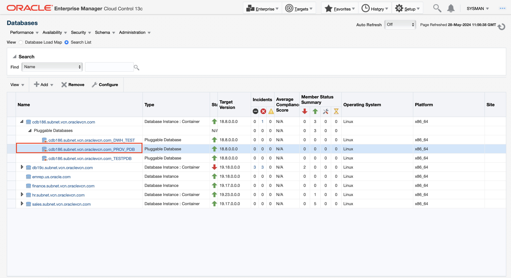

## Task 2: Unplug/Plug an existing Pluggable Database (PDB)

1. Navigate to the ***Enterprise menu >> Provisioning and Patching >> Database provisioning***.

    

2. In the Database Provisioning page, in the Related Links section of the left menu pane, click “**Provision Pluggable Databases**”

    

3.  In the Provision Pluggable Database Console, in the Container Database section, click on the magnifier to select the CDB (**cdb186.subnet.vcn.oraclevcn.com**) within which you want to Unplug PDBs.
    
    

4.  In the PDB Operations section, select **Unplug Pluggable Databases**, then Click **Launch**


    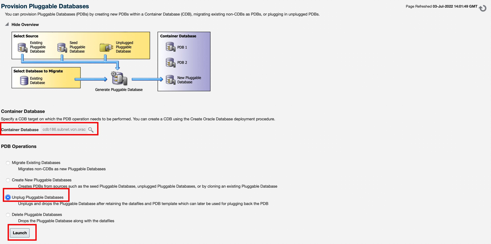

5.  On the Select PDB page in  Pluggable Database section click on the magnifier to choose the PDB you want to unplug.

    In the pop up search, type `PROV_PDB` and click search. Choose `PROV_PDB` and click Select.

    Select Named credentials “ORACLE” in container Database Host Credentials

    Click **Next**

    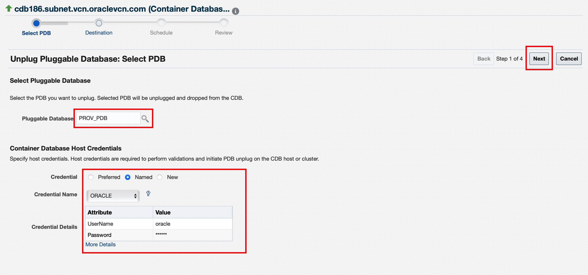

6.  On the Destination page, Click on the **Software Library**  radio button to define the location of PDB template.

    Select **Generate PDB Archive** option to unplug pdb  

    PDB Template Name will be prepopulated using combination of CDB and PDB name but you have option to change it.

    By default temporary working directory is prepopulated as **/tmp**  but you have option to change it.

    click **Next**

    

7.   Schedule **immediately** or choose later .

     Click **Next**.
          


8. In the Review page, verify the details and  click **Submit** .

    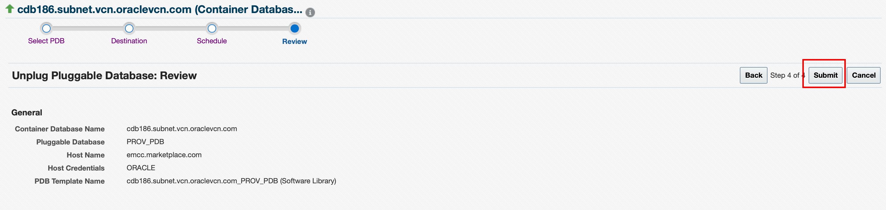

    Click **View Execution Details**


    


    On the Procedure Activity page, select specific execution step from the procedure step tree to see detail procedure execution log.

    Setup View Data to be refreshed with specific time interval to refresh page. The procedure takes about 2-3 minutes to complete.

    Wait for **Status: Succeeded** which indicates the procedure ran successfully.

    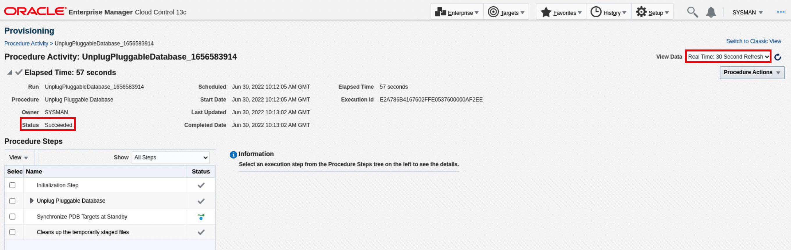

8.  Navigate to **Targets** >> **Databases**.

     Click on drop down arrow next to CDB186 and click on the pluggable database drop down arrow,you will see the PDB you unplugged is no longer in the list.


    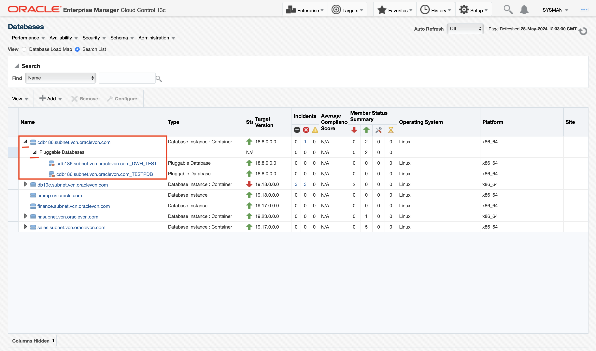

9.  Let us continue to the next steps and plug the same PDB back into the container database.

    Navigate to the **“Enterprise menu >> Provisioning and Patching >> Database provisioning”**.

    

10. In the Database Provisioning page, in the Related Links section of the left menu pane, click **Provision Pluggable Databases**

    

11. On the Provision Pluggable Database Console, in the Container Database section, click on the magnifier to select the **CDB** (**cdb186.subnet.vcn.oraclevcn.com186**) within which you want to Plug the PDBs.

    
      

12. In the PDB Operations section, select **Create New Pluggable Databases** and click **Launch**.

    

13. On the Create Pluggable Database Wizard, in the PDB Creation Options section, select **Plug an unplugged PDB**.

    Select Named credentials **“ORACLE”**

    Click **Next**


    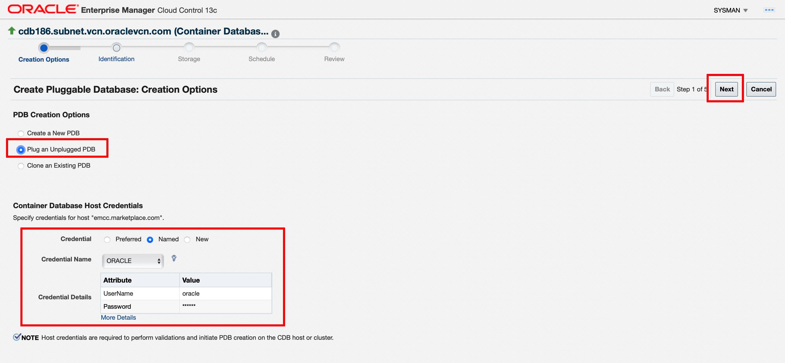


14. The Identification page has 3 sections.

    Under the *PDB Name* section provide a name for the PDB (`prov_pdb`) and select the option *create as clone*, this ensures Oracle generates a unique PDB DBID, GUID, and other identifiers expected for the new PDB.


    In the next section under *PDB Administrator* we will keep the values default and not do any changes as shown below.

      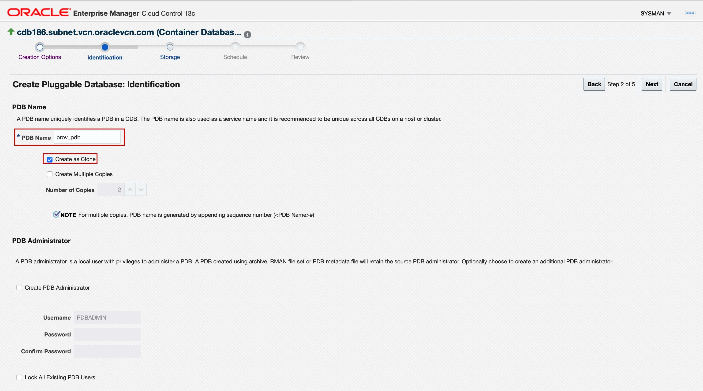


15. On the same Identification page, in the PDB Template Location section: Select **Software Library** radio button. Click on the magnifier icon placed on Location text box.


    Select the Name which you created during Unplug.
    In case of multiple options, choose the latest image based on timestamp.
    Click **Select**
      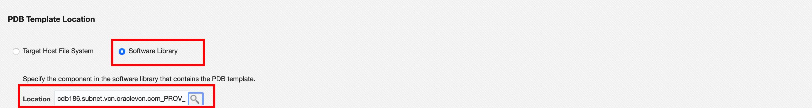

      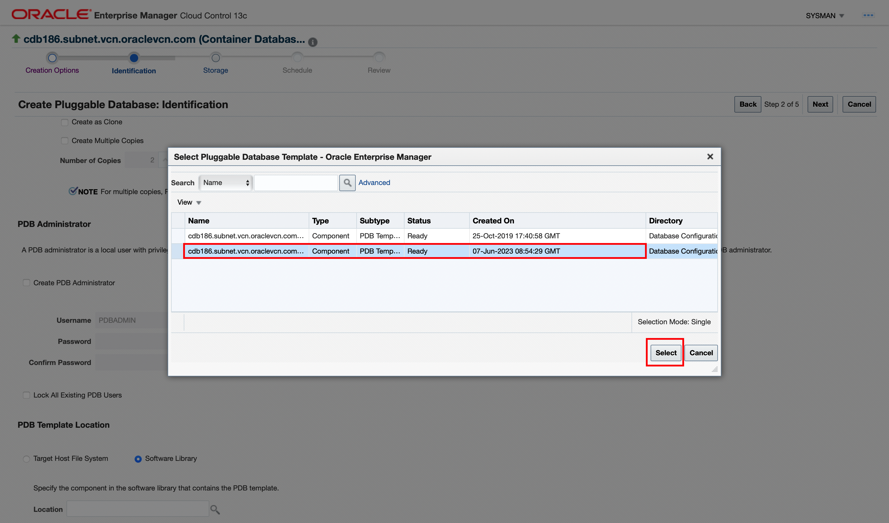


    Validate all the options and click **Next**

    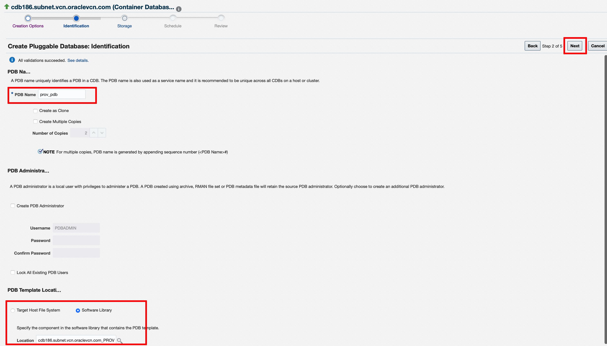


16. On the Storage Page select **Use Common Location for PDB Datafiles** , the Storage Type and Location fields are auto populated as showed below.

    Type **/tmp** in temporary working directory option.

    Click **Next**


    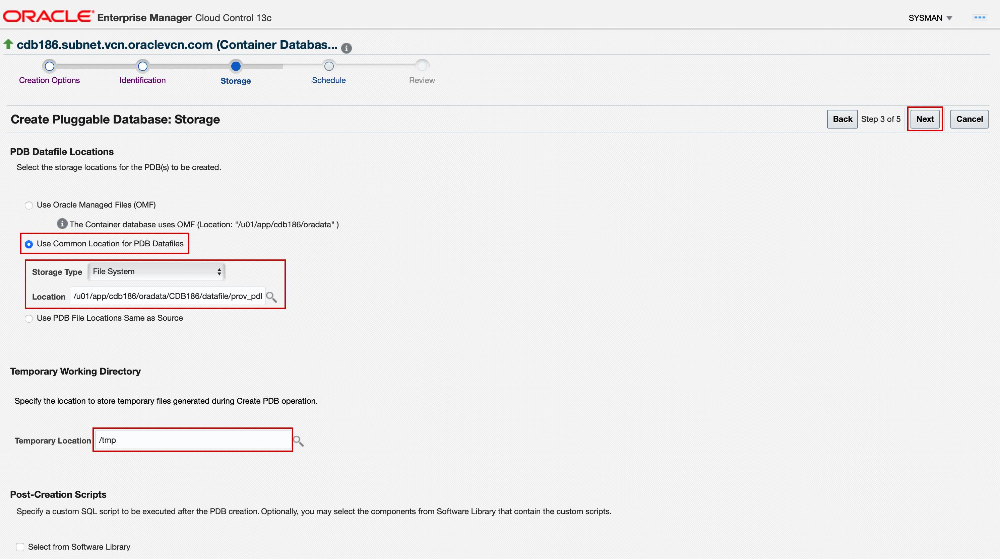

17.  
    Schedule **immediately** or choose to start later.
     Click **Next**.

    


18. In the review page, verify the details and click
    **Submit**.

    You can now click on **View Execution Details** link to see details.
    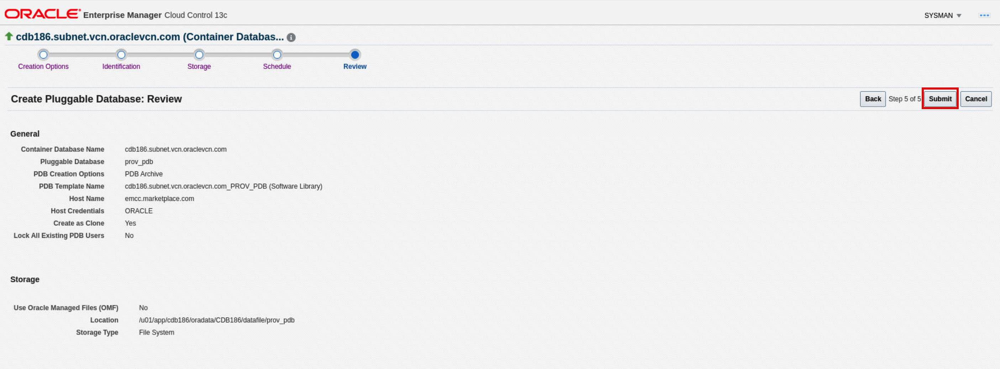
    


19. On the Procedure Activity page, select specific execution step from the procedure step tree to see detail procedure execution log.

    Setup View Data to be refreshed with specific time interval to refresh page

    The procedure takes 2-3 minutes to complete.

    Wait for **Status: Succeeded** which indicates the procedure ran successfully.

    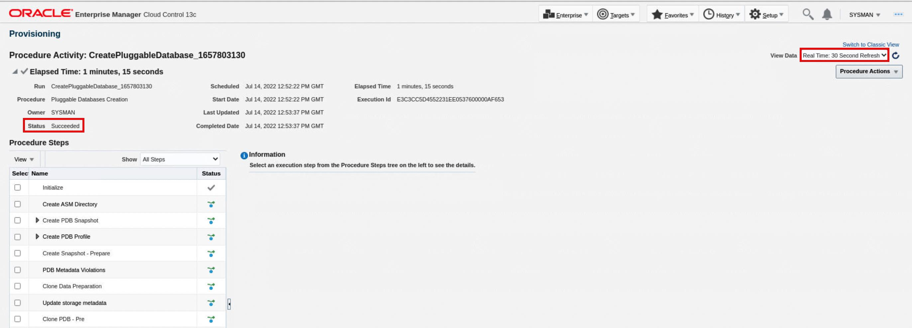

    Optionally,  Click the status link for each step to view the details of the execution of each step.


20. Navigate to ***Targets >> Databases***.

    Click on drop down arrow next to CDB186 and click on the pluggable database drop down arrow,you will see the PDB which was recently plugged.


    

    *Note*: You do not have to wait until the steps complete and move on to the next section.

## Task 3: Clone an existing Pluggable Database (PDB)

1.  Navigate to the “***Targets>> Databases***”.

    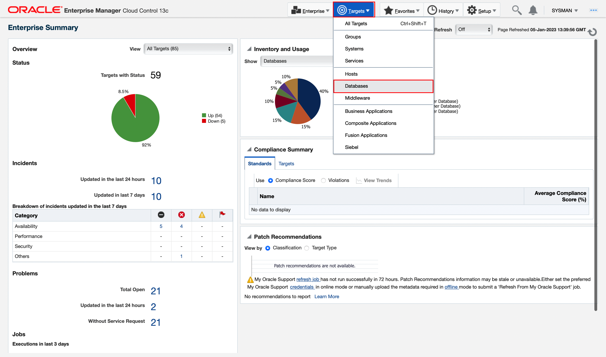

2.  On the page where we see all  list of databases, click on the dropdown arrow next to  **hr.subnet.vcn.oraclevcn.com** to view their associated PDBs.


    We will clone the PDB **hr.subnet.vcn.oraclevcn.com_HRPDB**  residing in hr.subnet.vcn.orclevcn.com CDB into the same CDB.


    **Click** on the **hr.subnet.vcn.oraclevcn.com_HRPDB** PDB as highlighted


    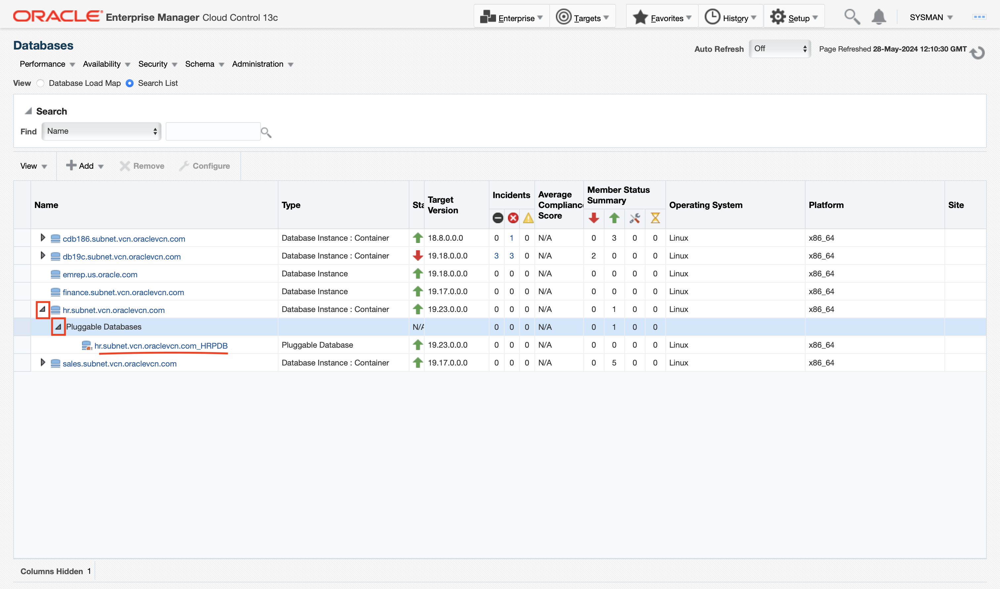

3.  This will open up the PDB Home page

    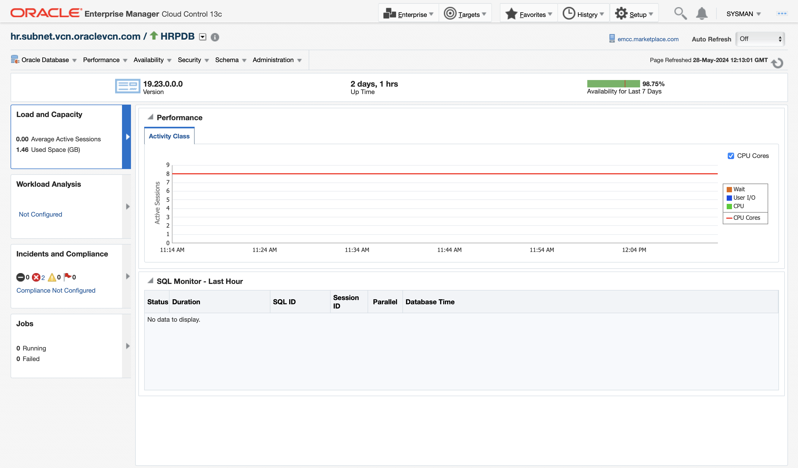


4.  Navigate from **Oracle Database >> Cloning >> Create Full Clone**  

    This will open up the PDB Clone Management page.


    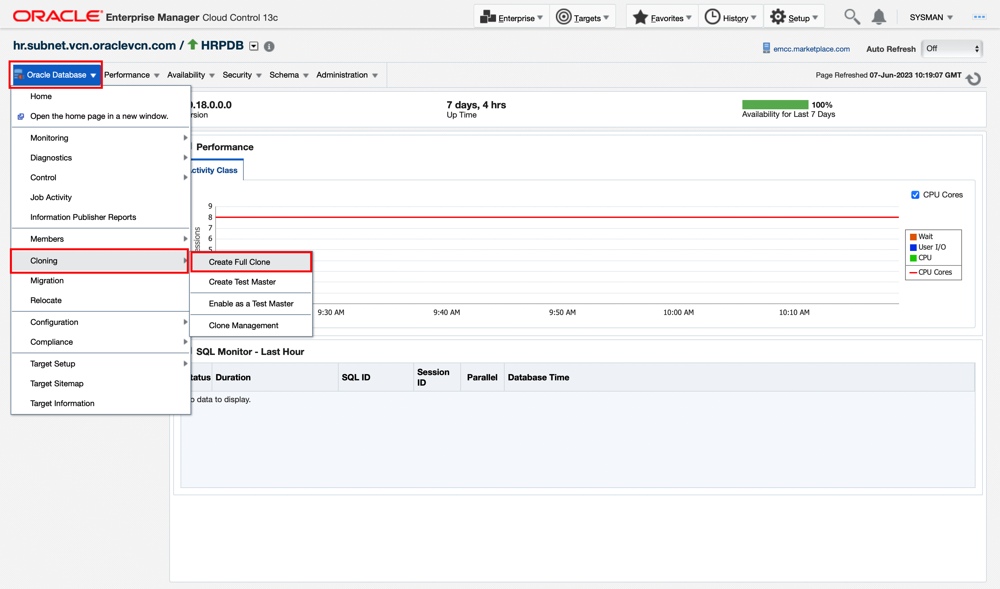

5.  The PDB Clone management page opens up with options as highlighted below.

    The Pluggable Database Name is prepopulated with a deafult value.
    You can refer to the instructions below to update the PDB name.

    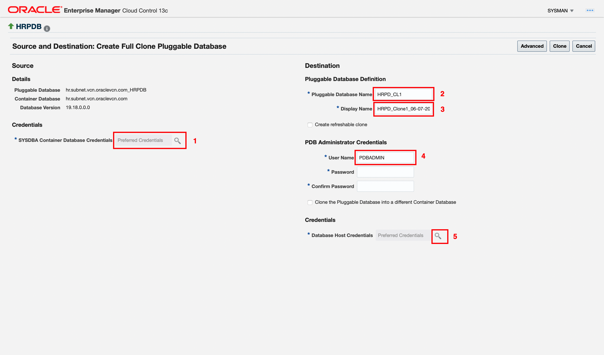

    Please update the values as suggested below.   

    1. Click on the magnifier to update the SYSDBA credentials of the source PDB.

        Choose **Named Credentials** and select **OEM_SYS** from the dropdown.

    2.  ```
        Pluggable Database Name : <copy>HR_CLONE</copy>
        ```
    3.  ```
        Display Name: <copy>HR_CLONE</copy>
        ```
    4. ```
        Username: <copy>PDBADMIN</copy>
        ```
       ```
       Password: <copy>welcome1</copy>
       ```

       Confirm the password.
       Optionally you can also clone the PDB into a different CDB by clicking on 'Clone the Pluggable Database into a different Container Database' 
       
    5. Click on the magnifier to update the DATABASE HOST credentials of the source PDB. Choose **Named Credentials** and select **ORACLE**

6. Verify all the details as shown below and click **CLONE**

    Optionally, you can choose to click on **Advanced** which will allow users to customise datafile location, run data masking scripts and also schedule the clone activity for a later point in time.

    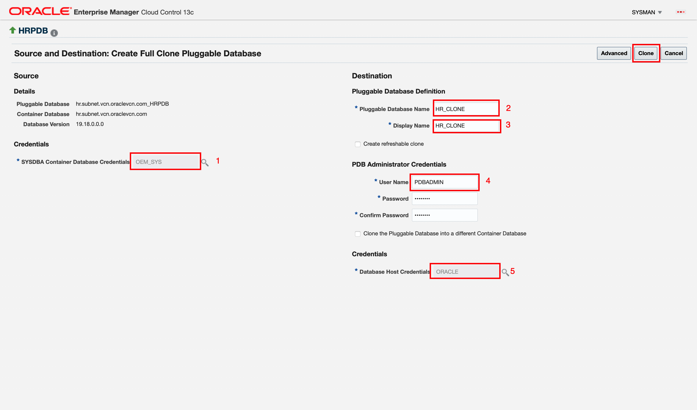


7. On Procedure Activity, select specific execution step from the procedure step tree to see details of the execution log.

    Setup View Data to be refreshed with specific time interval to refresh page.

    The procedure takes about 2 minutes to complete.

    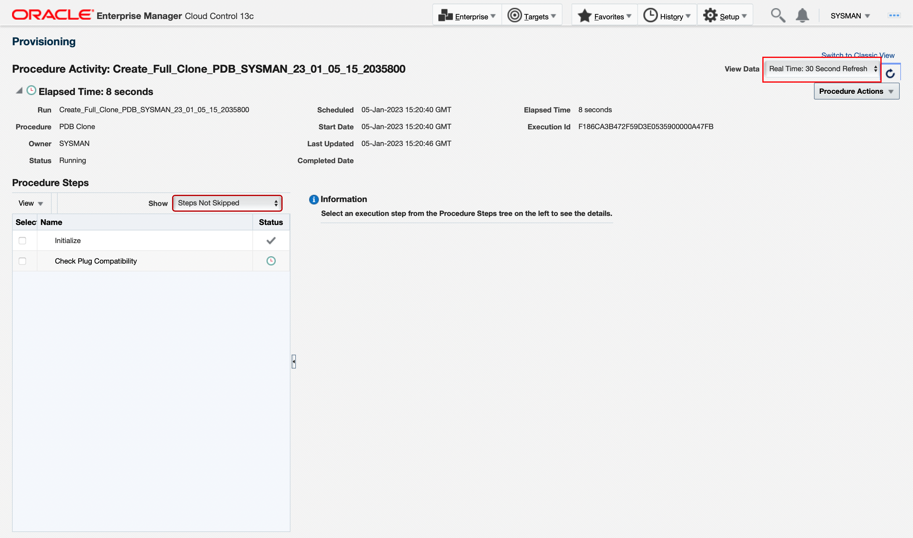

8.   Wait for **Status: Succeeded** which indicates the procedure ran successfully.

     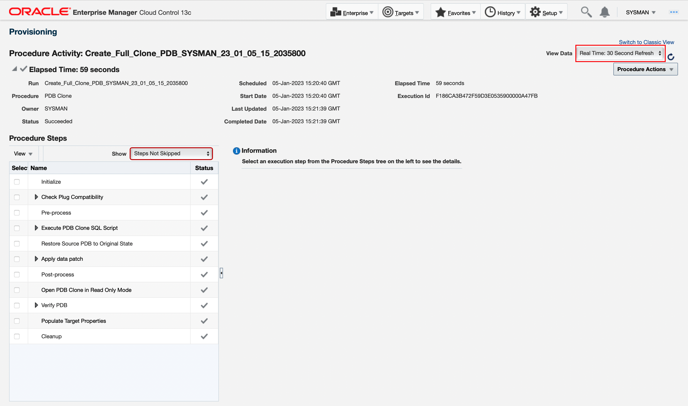

9. Now let us validate the PDB clone from the database details page.
    Navigate to **Targets >> Databases**
    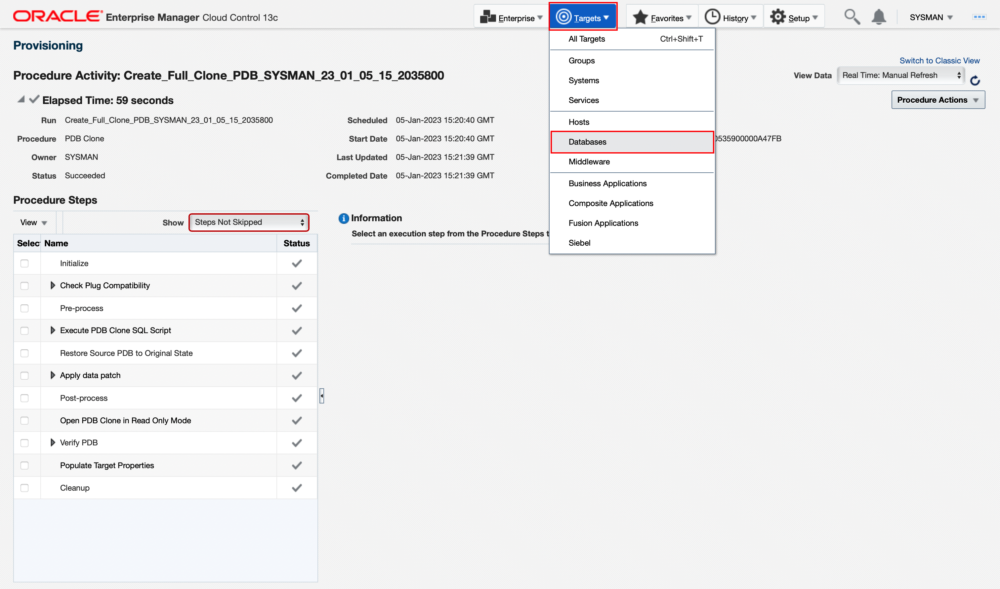

10. Click on the **hr.subnet.vcn.oraclevcn.com** CDB dropdown to see the pluggable    databases.

    We now see the **HR_CLONE** PDB is now available under **hr.subnet.vcn.oraclevcn.com** CDB


## Task 4: Patch (Update) an existing Pluggable Database (PDB)

1. In this lab, we will patch (update) Finance PDB - sales.subnet.vcn.oraclevcn.com_FINANCE, currently plugged to CDB sales.subnet.vcn.oraclevcn.com. Our goal is to patch Finance PDB to 19.23, by relocating it to Container database hr.subnet.vcn.oraclevcn.com.

      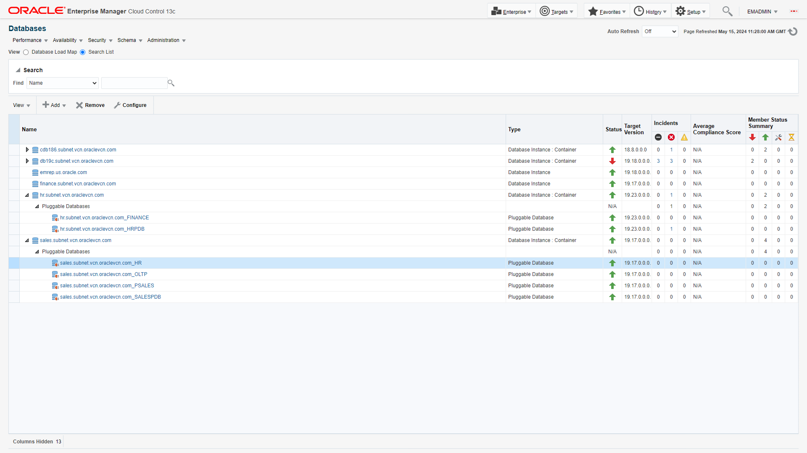        

2. From the Enterprise Manager menu bar, navigate to the ***Targets*** drop-down menu and then select ***Databases***

      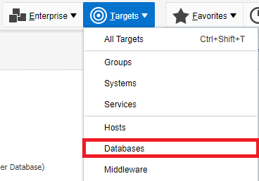

      and, then from ***Administration*** drop-down menu select ***Fleet Maintenance***

      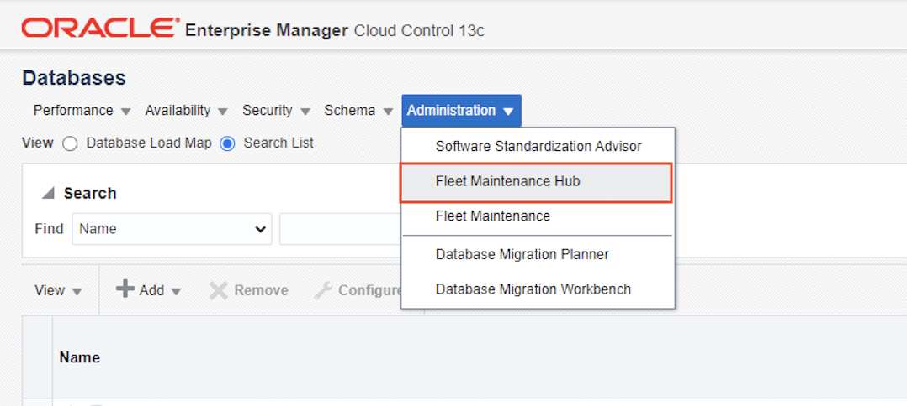


3.  Lets complete below steps to perform the pdb patching. Subscribe sales CDB to goldimage 19cDB-Linux-x64-APP.

    Under Target Subscription tab in Fleet Maintenance Hub, Click on **Subscribe** button. 
    
    Select filter 19 under Release. 
    
    From the dropdown select the goldimage - **19cDB-Linux-x64-APPS.** 
    
    From the list of databases, select **sales.subnet.vcn.oraclevcn.com.** 
    
    Click on subscribe at the top right corner.
    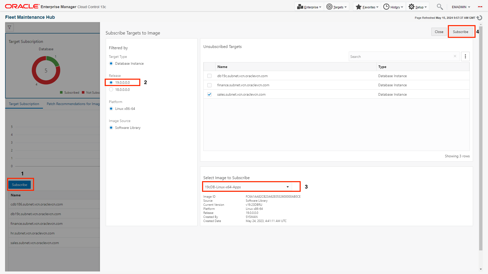

    Upon completion, click on close.

4. Navigate to Tile 3 - **Target Patch Compliance** in Fleet Maintenance Hub.
    Click on doner icon under Actions for sales CDB and select Update Pluggable Database. This will launch the operator UI of Fleet Maintenance.

    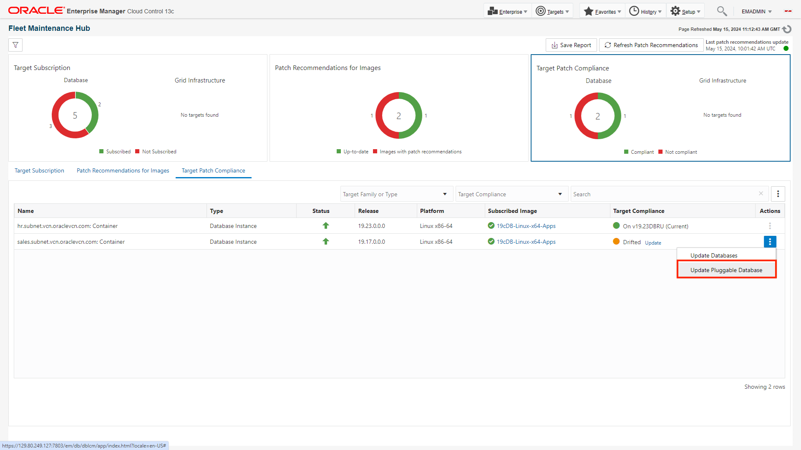

4.   In this page, we will select relevant ***Image Name***, ***Target Type*** and ***Operation***.
      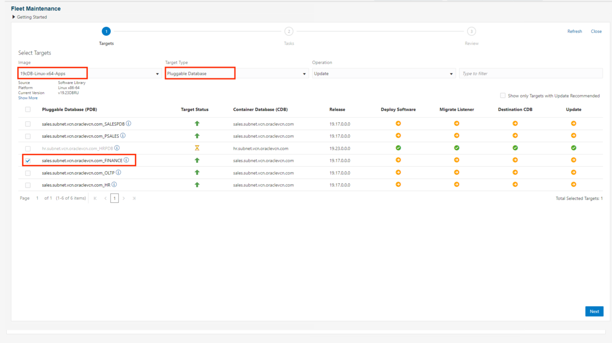
      Where:
      -  Image = We will select ***19cDB-Linux-x64-Apps***. Desired version of Oracle home, which our target database should run after successful completion of operation.
      -  Target Type = we will select ***Pluggable Database***. Desired target type, which can be Grid, RAC or SIDB.
      -  Operation = we will select ***Update***. Name of the operation, which can be update (patch) or upgrade.
      -  Type to filter = Optional, can be left blank. Selection criteria to highlight only those targets which qualify the selection, such as database naming.

      We will select check box for ***sales.subnet.vcn.oraclevcn.com_FINANCE***, as we want to patch it to higher version and select ***Next***.

5. In this page, we will select destination CDB as ***Attach Existing CDB***. Options Software Deployment and Migrate Listener will be greyed out as we already have the desired CDB in place, which is hr.subnet.vcn.oraclevcn.com.

      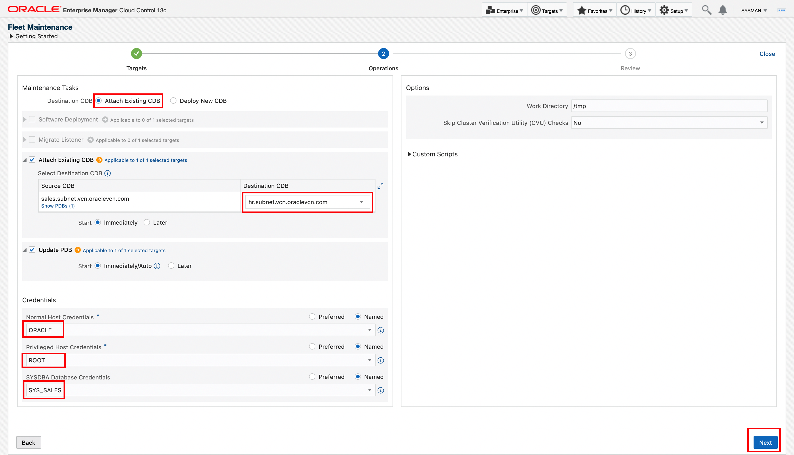

      Under Credentials (We have already created these credentials in Enterprise Manager for this workshop. Please choose Named for all the below three options and from the dropdown menu, you can opt for values as suggested below)    
      -  Normal Host Credentials as ***ORACLE***
      -  Privileged Host Credentials as ***ROOT***
      -  SYSDBA Database Credentials as ***SYS_SALES***     

      Under Options, we can use default value /tmp for Working Directory. This is the location where log files will be created.

      Select ***Next***.    

6. We can validate our entries (CDB details, log file location, credentials) provided in previous page and validate the desired operation. Validation acts as a precheck before we submit the main operation. Click on ***Validate***. This will open a new screen with two validation modes - Quick and Full. We can select either of these. Full validation mode submits a deployment procedure. In this case choose ***Quick validation mode***

      

7. Review the validation result.

      

      Incase of any error, we can fix it and choose revalidate. Select ***Close***.

8. ***Submit*** the operation.  We need to provide a name to the task, which will help us to view these tasks under Procedure Activity Page. Lets enter
      ```
      <copy>finance_pdb_patching</copy>
      ```
      
      Here, we can see that we have opted to attach existing CDB and update PDB.

      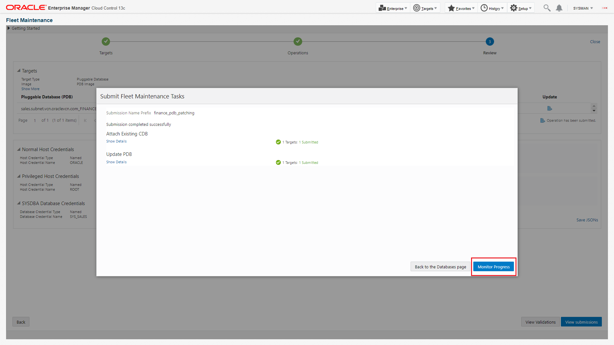    
      Clicking on Monitor Progress will take us to Procedure Activity Page. Alternate navigation to review the submitted deployment procedures is ***Enterprise >> Provisioning and Patching >> Procedure Activity***  

9. Review the Deployment Procedures (DP).

      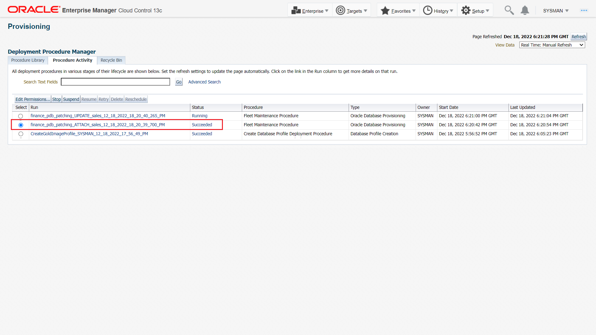

      We can see that one of the DP related to Attach operation has already completed. Lets click on it and find out the steps executed by this DP.

      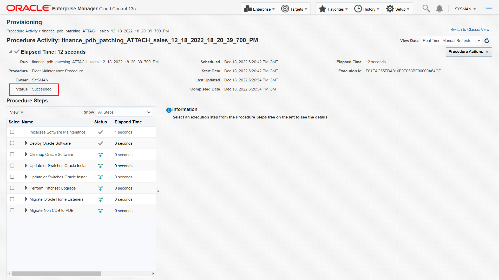
      Lets go back to the Procedure Activity page and review the other DP.

10.  We can see that second DP for update operation is running.
      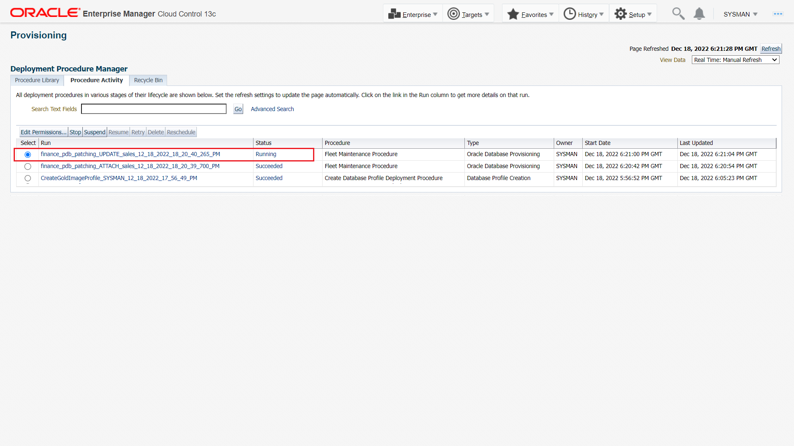

      Lets click on it and find out the steps executed by this DP.

      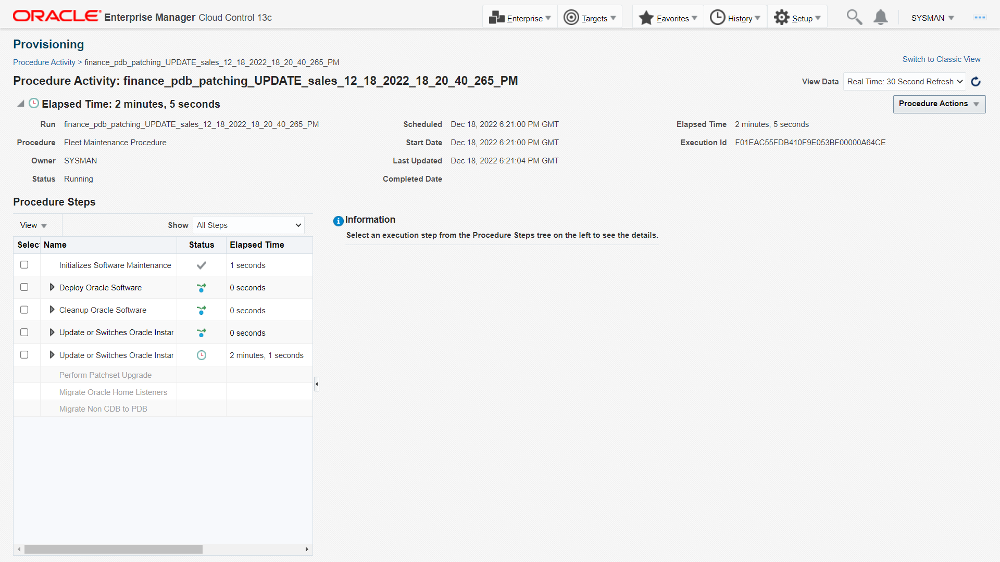

      We can see that attach DP completed successfully.
      

11.  Lets validate the location of ***finance*** pdb. In the upper toolbar, locate the ***Targets*** icon and click the drop-down menu and then select ***Databases***.

      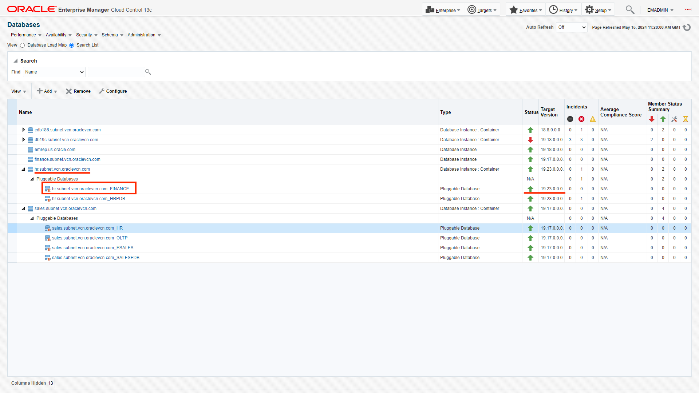

      We can see that Finance pdb is relocated to a new CDB - hr.subnet.vcn.oraclevcn.com.

## Task 5: Compliance Management for Pluggable Database

Center of Internet Security compliance(CIS) Standard
The Center for Internet Security compliance(CIS) is a set of Industry standards for IT systems and databases. CIS benchmark provides the baseline configurations to ensure oracle database compliance with CIS standards. A compliance standard is a collection of checks or rules that follow broadly accepted best practices. It is the Cloud Control representation of a compliance control that must be tested against some set of IT infrastructure to determine if the control is being followed. This ensures that IT infrastructure, applications, business services, and processes are organized, configured, managed, and monitored properly. A compliance standard evaluation can provide information related to platform compatibility, known issues affecting other customers with similar configurations, security vulnerabilities, patch recommendations, and more. A compliance standard is also used to define where to perform real-time change monitoring.

A compliance standard is mapped to one or more compliance standard rules and is associated with one or more targets that should be evaluated. Securing a provisioned Oracle Database is critical to protect your data. You need to safeguard that data with security controls that restrict access according to your policy by using either industry/regulatory standard benchmarks or custom policies. In this lab, we will use   *Oracle 19c Database CIS V1.0.0 - Level 1 - RDBMS using Unified Auditing for Oracle Pluggable Database* to secure configuration of provisioned database.


1. From the Enterprise menu, select **Compliance, then select Library**  to get started

    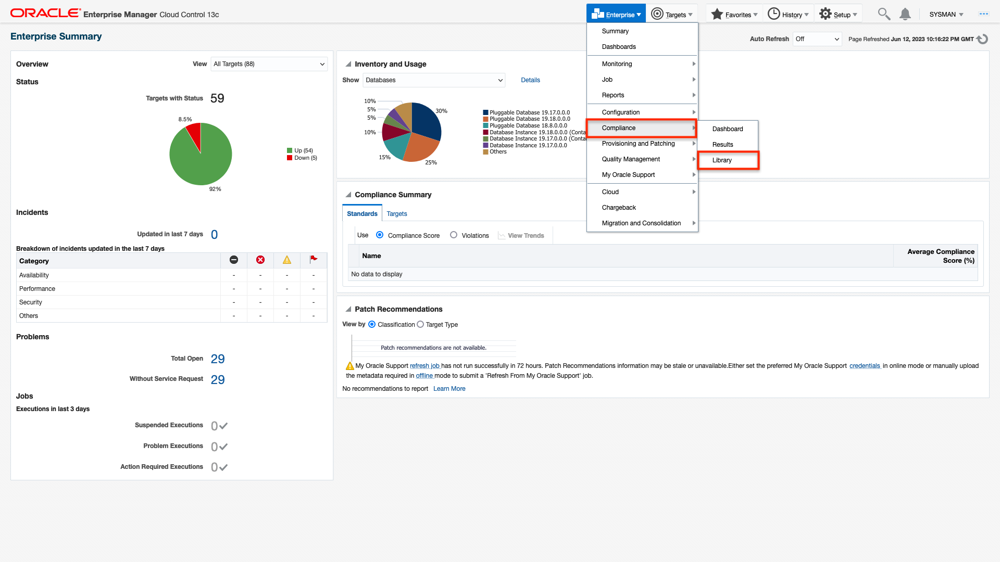


2. Click the **Compliance Standards** tab.

    In the Compliance Standard section type  "Oracle 19c Database CIS" as the key word and
    Applicable To section Drop down select **Pluggable Database** hit search.

    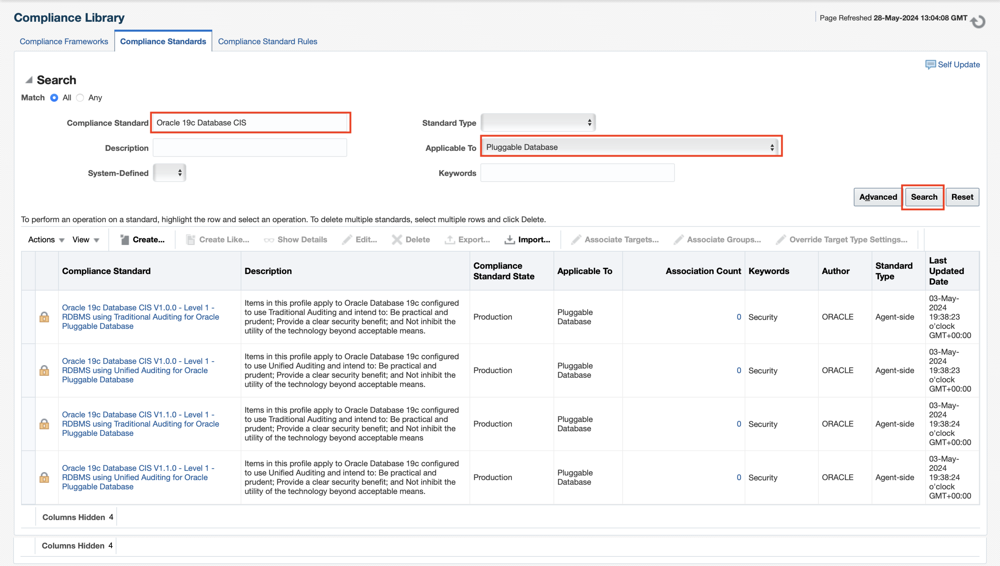

    Select the row **Oracle 19c Database CIS V1.1.0 - Level 1 - RDBMS using Unified Auditing for Oracle Pluggable Database**, and then Click the **Associate Targets** tab.

    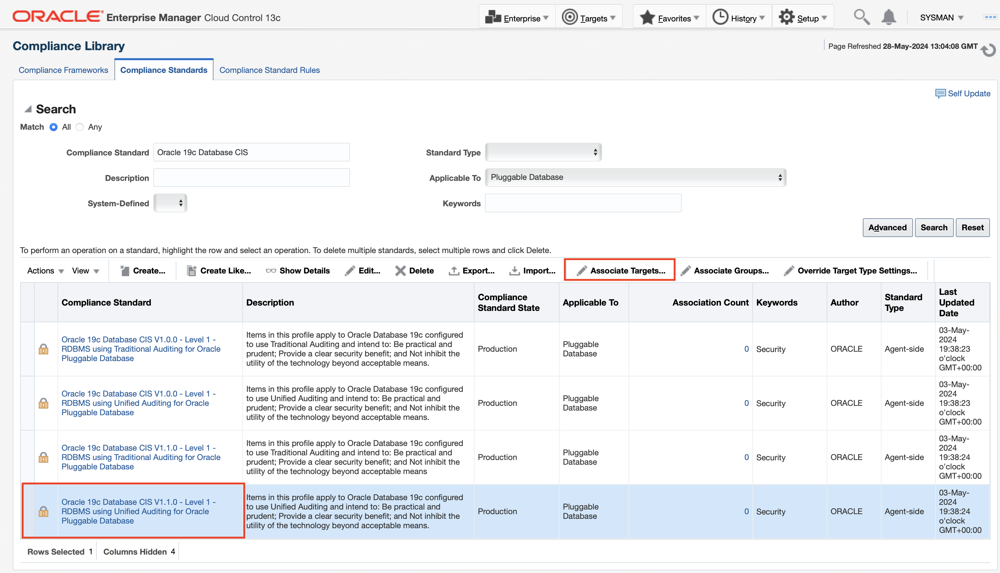

3.  Click Add and choose the row with your PDB you wish to associate. Choose _HRPDB, click **Select**.

    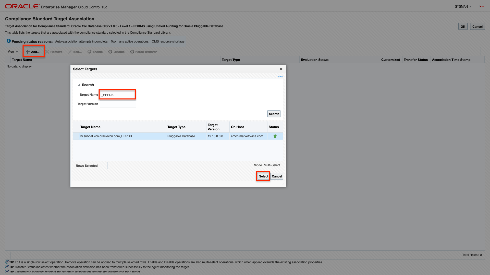

    Verify the PDB name is added and Click **OK**

    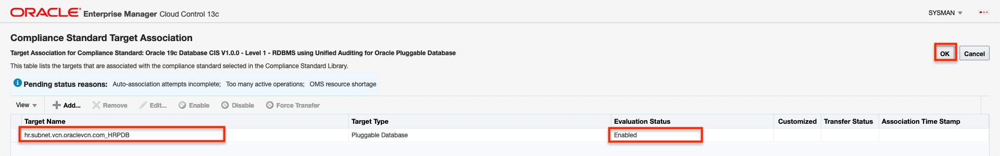

4. In the Save Association dialog box, Click Yes.

    

5. Click OK on the Information processing prompt.

    

6. Now Navigate to ***Enterprise >> Compliance >> Results***
    
    *Processing and displaying the results on the Compliance Results Page will take approximately 5 minutes to complete. 
    You may want to switch to the next 'Task 6: Self-Service to Request PDB Using PDBaaS complete step 20', then come back here to finish this task steps.* 

    

7. Click on **Oracle 19c Database CIS V1.0.0 - Level 1 - RDBMS using Unified Auditing for Oracle Pluggable Database** under Compliance Standards.

    

8.  The compliance result shows the target is with critical violations against the selected standard with multiple violations along with it's score along with evaluation date.

    

    Total violations you will see details each rule , target name, applicable to target type pluggable and severity of the rule under violation tab

    

9.  You can see failed CIS standard recommendations rules for each main category of CIS Standards  

    

10. Each recommendations violations rules can be further explored by clicking on each recommendation with violation events, status In case of each violations you will see details like violation details, name of the rule violated under the violation Events tab

    

11. In case of each violations you will see details like rule type, severity, compliance rule state, description and rationale for the violation under the Rule details tab

    

12. Compliance Management also provides you an option to have a dashboard view of compliance summary against all the associated targets. The Dashboard provides a brief summary of the violations, corrective actions and compliance standard score.

    From the home page Navigate to **Enterprise >> Compliance >> Dashboard**

    

    **Dashboard View**

    

13. You can also generate a comprehensive compliance report for

    A. Each compliance standard and all its associated targets.

    B. Each Target with all Compliance standard associated to it.

    Towards bottom of the page in the **Compliance Summary** section, click on the report against each Compliance standard or Targets.

    

    

    **Sample report**

    

    

    


 Now that you have gone through PDB life cycle operations, we will switch focus and cover the use case of building a private cloud using Enterprise Manager and how to quickly provision (with minimal inputs) and manage PDBs using PDB-as-a-service (PDBaaS). To proceed as a self service user, please logout as SYSMAN.

  

## Task 6: Self-Service to Request PDB Using PDBaaS

With the Self-Service Portal, cloud users can request a Pluggable Database through a simple process, monitor resource consumptions, and manage the pluggable database through an intuitive graphical user interface. PDBs are created with a predefined expiry time and is automatically deleted.

The PDBs are created using a precreated service template on CDBs which are virtually grouped as a pool.

1. Login into Enterprise Manager as a Self-Service User.

    Credentials : **cyrus/welcome1**

    

2. By default, you will see the Database Cloud Self Service Portal landing page as shown below.

    Click on  **Create Instance** button.

    

3.   
    Select **Provision New Empty Pluggable Database**.

      Note: There are two service templates pertaining to Pluggable Database

      -  **Provision New Empty Pluggable Database**: This     template enables users to create a new empty pluggable database in a container database configured by DBA.
       -  **Provision Pluggable Database with Data**: This template enables users to create a new pluggable database with data from non-container database.


    


4. In the **Pluggable Database Configuration** section,


      **Step 1**

      Enter PDB Name , Service and Size details:

      ```
      PDB Name: AS_PDB2
      ```
      ```
      Database Service Name : Service_AS_PDB2
      ```
      ```
      Workload Size: Small
      ```


      **Step 2**

      Enter the credentials as suggested below.

      ```
      Administrator Name: PDBADMIN
      ```
      ```
      Password : welcome1
      ```

      Tablespace name is auto populated.

      ```
      Tablespace name : pdb_tbs1
      ```


    **Step 3**

    **Instance Details**

    **Request Name** :  Auto filled with latest timestamp. Can be modified in case needed.

    **Zone** : Auto filled with default option, Sales Infra Zone.


    **Properties**  can help user locate an instance more quickly.
    Click on the dropdown to update.

      ```
      Contact: <copy>CYRUS</copy>
      ```
      ```
      Lifecycle Status: <copy>Test</copy>
      ```


    **Step 4**

      Instance Duration -

      Start: Accept the default (Immediately).

      Duration: Specify 4 hours from the current time by selecting the “Until” radio button, change to current date and specify time to be 4 hours from the current time.


    **Step 5**

    Validate all the details and Click on **Submit** button


    

  What do these options represent? In most cases the PDBaaS options are self-explanatory.
  The self-service user should be able to provision a PDB by entering minimal information.
  Fields with an ‘\*’ represent mandatory input fields.

  Please refer to the table listed below for a description of each option:

  | **Field**                   | **Description**                                                                                                                                                                                                                                                                                    |
|-----------------------------|----------------------------------------------------------------------------------------------------------------------------------------------------------------------------------------------------------------------------------------------------------------------------------------------------|
| Request Name                | By default, it is the Self-Service User Requestor name with timestamp. This field can be modified                                                                                                                                                                                                  |
| Zone                        | The Zone is a PaaS Zone that represents hosts/vm, where the PDB database will be deployed for this request. The zones are configured by the administrator. Self-service user need not know the host or platform details.                                                                           |
| PDB Name                    | PDB database with user defined will be created for the container database                                                                                                                                                                                                          |
| Database Service Name       | The user defined prefix for the database service or alias for this self-service PDB. The rest of the service name will be system generated and will be associated with a database resource management plan.                                                                                        |
| Workload Size               | The resources allocated to the Database Service. The database resource management plan is derived from this option. You can configure multiple workload sizes. Each service template will contain unique workload sizes. This typically depends on the roles assigned to self-service user.        |
| Schedule Request            | Self-service user has the ability to create a PDB database immediately or choose to create at a later time. In this lab exercise, the administrator has defined a policy, so a self- service user has to specify time duration. The PDB database will be automatically deleted after the duration. |
| Administrator Name/Password | A database user with required administrative privileges will be created on the provisioned PDB. A self-service user will be able to administer the PDB database by logging in as this database user.                                                                                               |

9.  Once you submit a request, you will be redirected back to the “**Database Cloud Services**” Page.


    Under “**Requests**” region, you should see 2 requests:
    “**Create**” and “**Delete**” request

    You will also notice the delete operation is scheduled for future (not started yet) time.

    Click on the **hourglass** icon under status column for the Create Pluggable Database step. You will see details of request.

    


11. PDB Provisioning perform the following actions:

    *  Create database roles and PDB

    *  Create a resource plan based on the workload size

    *  Create and register the database


    The request should take less than 5 minutes to complete.

    Click on refresh icon or as an alternative set Refresh to 30 seconds.

    The success status indicates that PDB database was successfully created.

    Click on Close button when the procedure is complete.

    

12.  The screen indicated the PDB creation is successful.

      

13. Click on the Home Icon. You will see new PDB instance.
(Incase the newly created PDB is not reflecting, hit refresh on the top right corner of the page ).
 Click on the PDB recently created.

    

  *Note*: Following widgets are shown on the Database Cloud Services landing Page

      * **Instances** show the number and status (Up/Down) of the DB/PDB Instances provisioned by the self-service user.
      * **Expiry**, shows the expiration summary of DB/PDB Instances.
      * **Usage**, resource usage status for the Self-Service user, status of the resource consumption for this user.
      * **Memory**, current memory consumption against the Quota for this user.
      * **Storage**, current storage consumption against the Quota for this user.

14. On the PDB details page you can use the connection details to connect to the PDB using SQL tools.

    Click on **Resize** button to resize a PDB instance.

    

15. Select **large** and click **resize**

    

    * Resize allows you to resize your instance to other available resource sizes.
    * We have 2 resource sizes available for Service Template. Small and Large.
    * Current size of PDB instance is Small, you can now resize it to large.

16. Once you click on **Resize**, a job will be submitted to resize instance.

    In few minutes instance resize is completed. Expand **Resource Usage** section on PDB Home page.

    This shows now new resource usage limits.

    EM compares the actual workload against the predefined configuration in the service template, also, notifies the user with a warning message to modify the thresholds accordingly.


      

17.  Next delete the database Instance:

      Go to the Database Cloud Services Home page by clicking on **Database Cloud Self Service Portal** link


      

18. Click on the action menu for new PDB and delete this instance.

    

19. While deleting instance you can preserve a backup and create a new instance in case required.
  Select check-box: **Preserve a backup of this instance**

    Click **Ok**

    

20.  Click **Close** to close the confirmation dialog box.

     The Instance has been successfully deleted.

     Click on the refresh icon on the top right in case the PDB is still seen on the page.
    

     *Note : Go back to Task 5, complete steps 6 to 13 before proceeding to Task 7: Setup PDB-as-a-Service (PDBaaS)*

  

## Task 7:  Setup  PDB-as-a-Service (PDBaaS)

Previous exercise demonstrated the process of Self-Service User requesting PDBs using available service templates. In this section, we will see the Administrative setup for PDBaaS.

  Logout as **Cyrus** user.


Login to the EM Console as super administrator **sysman/welcome1**


### **PaaS Infrastructure Zone**

1. On the EM Console, go to **Setup** ->> **Cloud** ->> **Database**.

    

2. Select **Pluggable Database** from the drop-down menu.

      

3. Click on **PaaS Infrastructure Zone**.

    Zone is a pool of Hosts where the PDBs can be provisioned.
      Click on **Sales Infra Zone**

      


4. You are taken to the Zone Home page; you can see all the details of a Zone such as the host members of this zone.

    You can explore more about the zone on this page.

      

### **Pluggable Database Pool**

5. On the EM Console, Click on **Setup** --> **Cloud** -->  **Database**.

      

6. Select **Pluggable Database** from the drop-down menu.
  


    Click on **Pluggable Database Pool**. A Pluggable Database Pool consists of a set of Container Databases on which PDBs will be provisioned.

    Click on name of the pool **pdbpool** to see more details.

    

7. You are taken to the Database pool. Explore the Memory allocation and CPU allocation details

    

   Scroll down to see details of Members and Service Templates.

    

### **Data Sources**

8. On the EM Console, Click on **Setup** --> **Cloud** -->  **Database**.

    Select Pluggable Database from the drop-down menu.

    


9. Click on **Data Sources**. Observe that the profile is based on Schema Export(s). This Data Profile will be used for provisioning a PDB with data.

    

10. Click on the row with profile to see more details.
    This will open a Provisioning Profile Dialog box with details of PDB name , tablespaces , and creation details.

    Once done, close the Provisioning Profile pop up box.


    


### **Service Templates**
10. From the Cloud Home page , Select Pluggable Database from the drop-down menu.                                                                                   
Click on **Service Templates**.

    There are two service templates pertaining to Pluggable Database

      * **Provision New Empty Pluggable Database**: This template enables the user to create a new empty pluggable database in a container database configured by DBA
      * **Provision Pluggable Database with Data**: This template enables user to create a new pluggable database with data from a non-container database.


    


11. Click on name of any template to explore more details.

    Once done, close the Service template Pop up window.


    


**This completes the Lab!**

You may now [proceed to the next lab](#next).

## Learn More
- [Oracle Enterprise Manager](https://www.oracle.com/enterprise-manager/)
- [Enterprise Manager Documentation Library](https://docs.oracle.com/en/enterprise-manager/index.html)
- [Database Lifecycle Management](https://docs.oracle.com/en/enterprise-manager/cloud-control/enterprise-manager-cloud-control/13.5/lifecycle.html)
- [Database Cloud Management](https://docs.oracle.com/en/enterprise-manager/cloud-control/enterprise-manager-cloud-control/13.5/cloud.html)

## Acknowledgements
  - **Author** - Harish Niddagatta, Oracle Enterprise Manager Product Management
  - **Contributors** -  Rene Fontcha
  - **Last Updated By/Date** - Sravanth Mouli, Oracle Enterprise Manager Product Management -  May 2024
