# Get Started with Real Application Testing
## Introduction
Oracle Real Application Testing option enables you to perform real-world testing of Oracle Database. By capturing production workloads and assessing the impact of system changes on these workloads before production deployment, Oracle Real Application Testing minimizes the risk of instabilities associated with system changes.

### Objectives
The objective of this lab is to become familiar with the basic usage of SQL Performance Analyzer and Database Replay.

*Estimated Time*: 55 minutes

Watch the video below for a quick walk-through of the lab.
[Get Started with Real Application Testing](videohub:1_afpg9qzg)

### Lab Timing (Estimated)

| **Step No.** | **Feature**                                   | **Approx. Time** | **Details**                                                                                                                                                                                                                    | **Value proposition**                                                                                                                                                                                                                                                                                                                                                                                                                                                                                                                                                      |
|--------|-----------------------------------------------|------------------|--------------------------------------------------------------------------------------------------------------------------------------------------------------------------------------------------------------------------------|-----------------------------------------------------------------------------------------------------------------------------------------------------------------------------------------------------------------------------------------------------------------------------------------------------------------------------------------------------------------------------------------------------------------------------------------------------------------------------------------------------------------------------------------------------------------------------|
| **1**  | SQL Performance Analyzer        | 15 minutes       | The objective of this activity is to demonstrate and use the SQL Performance Analyzer functionality of Real Application Testing capabilities using Enterprise Manager UI.                                                 | **Scenario:**    You've been asked to validate SQL performance before upgrade Database from 18.3 to 19.10. How each SQLs in the application's workload (Sales History) performs in new 19.10 upgrade. Sales History workload SQLs gathered in SQL Tuning Set SHSTS.                                                                                                                                                                                                                                                                                            |
| **2**  | Database Workload Replay - Capture Workload                          | 10 minutes       | The objective of this activity is to demonstrate how to performs  Workload Capture for Real Application Testing   Database Replay.                                                                                                         | **Scenario:**    You've been asked to Capture of  Database Workload before upgrade Database from 18.3 to 19.10 for Database Replay. The Workload simulated using SwingBench for 40 Concurrent Database Users.                                                                                                                                                                                                                                                                                                                                |
| **3**  | Database Workload Replay - Replay Workload                          | 15 minutes       | The objective of this activity is to demonstrate how to performs  Workload Capture for Real Application Testing   Database Replay.                                                                                                         | **Scenario:**    You've been asked to Replay of  Database Workload before upgrade Database from 18.3 to 19.10 for Database Replay. The Workload captured from previous Step*2 from 40 concurrent users workload.                                                                                                                                                                                                                                                                                                                                |
| **4**  | Database Workload Replay - API, import to Enterprise Manager (Optional)                      | 15 minutes       | The objective of this activity is to demonstrate and use the Database Replay functionality of Real Application Testing capabilities using API PLSQL mode and import Capture and Replay into Enterprise Manager.                                                                                                           | **Scenario:**    You've been asked to validate Database performance before upgrade Database from 18.3 to 19.10. How the application's workload (Order Entry) performs in new 19.3 upgrade. Database Replay enables realistic testing of system changes by essentially re-creating the production workload environment on a test system.                                                                                                                                                                                                                                                                                                                                 |
| **5**  | Database Replay - Consolidation Replay (EM) (Optional) | 20 minutes       | The objective of this activity is to demonstrate and use the Consolidation Database Replay using Enterprise Manager UI. | **Scenario:**    You've been asked to validate Database performance before upgrade Database from 18.3 to 19.10. The plan is also consolidation a couple of application workload from 2 different Database Captures (Order Entry and Sales History) from 18.3 into a single Database Replay in 19.10.                                                                                                                                         |
### Prerequisites
- A Free Tier, Paid or LiveLabs Oracle Cloud account
- You have completed:
    - Lab: Prepare Setup (*Free-tier* and *Paid Tenants* only)
    - Lab: Environment Setup
    - Lab: Initialize Environment

*Note*: This lab environment is setup with Enterprise Manager Cloud Control Release 13.5 and Database 19.10 as Oracle Management Repository. Workshop activities included in this lab will be executed on the Enterprise Manager console (browser)

## Task 1: SQL Performance Analyzer

1.  Log into an Enterprise Manager VM. The Enterprise Manager credentials are “sysman/welcome1”. **Click** on the Targets, then Databases. You will be directed to the list of Databases in EM.

    

    


2. Shutdown Databases cdb186.subnet.vcn.oraclevcn.com, finance.subnet.vcn.oraclevcn.com, hr.subnet.vcn.oraclevcn.com.

  

  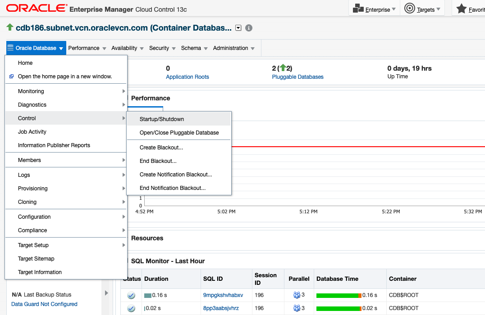

  

  

  

3. In this Lab, we use Databases db19c.subnet.vcn.oraclevcn.com, emrep.us.oracle.com, sales.subnet.vcn.oraclevcn.com. Check if Database db19c.subnet.vcn.oraclevcn.com is open and available. If it is down, please start Database db19c.subnet.vcn.oraclevcn.com. Open Pluggable Databases db19c.subnet.vcn.oraclevcn.com\_OLTP\_CL2, db19c.subnet.vcn.oraclevcn.com\_PSAL\_CL1.

   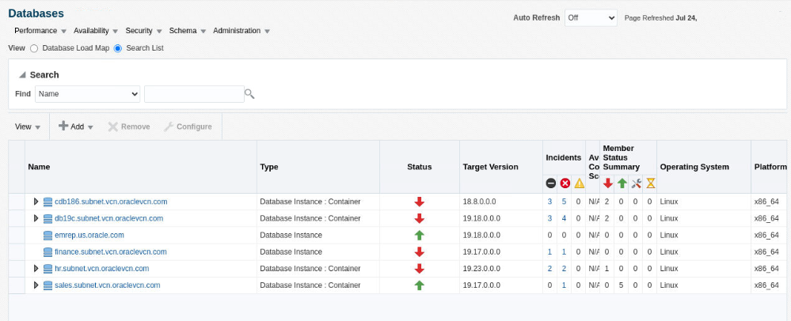

   

   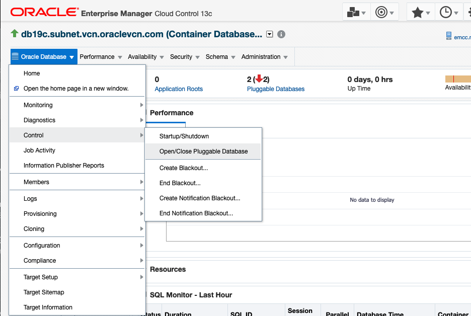

   

   

   

4. **Click** on the Targets, then Databases. You will be directed to the list of Databases in EM.

    

5. Here you will notice different databases listed, such as SALES, HR etc., we will work in pluggable database psales inside the sales container database. **Expand** the Sales database from the list, and **Click** sales.subnet.vcn.oraclevcn.com_PSALES

    

6. Go to SQL Tuning Set page by **Click** on Performance menu -> SQL -> SQL Tuning Set. Check "Named" on Credential and use SYS_SALES Credential Name from the database login screen

    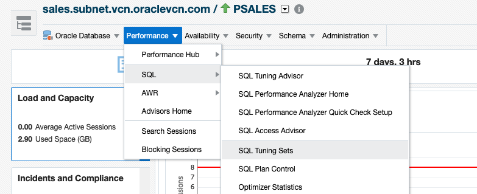

    

7. Pick SQL Tuning Set 'shsts1' and **Click** Copy To A Database button

    

8. Enter Copy SQL Tuning Set

       - Pick **db19c.subnet.vcn.oraclevcn.com\_PSAL\_CL1** for Destination Database
       - Pick **STSCOPY** for Directory Object
       - Pick **ORACLE** for both Source and Destination Credentials and **SYS_SALES** for Destination Database Credential
       - Click **Ok**

    

    

    

   View on job page to check status of the Copy STS job. It can take 1.5-2 minutes.

9. After the COPY STS job successfully finished, **Click** Target - Database

       - **Click** db19c.subnet.vcn.oraclevcn.com - PDB **PSAL_CLone1**
       - **Click** on menu Performance - SQL - SQL Performance Analyzer

    

    

    

10. In SPA (SQL Performance Analyzer) page, **Click** Guided Workflow

    

11. Step 1 Create SPA Task  based on STS

    

       - Enter Name for the Task Name : **SHSPATASK**
       - Enter Description : **Sales History SPA Task**
       - Pick STS : **SHSTS1**

    

       - **Click** Create and back to **Guided Workflow** page

12. Step 2 Create SQL Trial in Initial Environment

    

       - Enter SQL Trial Name : **SHSTS\_SQL\_TRIAL\_18C**
       - Enter Description : Sales History 18C run
       - Creation Method: **Execute SQLs Remotely**

    

       - Default per-SQL Time Limit
       - Click Create Database Link button

    

       - Enter Name :  **PSALES.SUBNET.VCN.ORACLEVCN.COM**
       - Enter Net Service Name :
      ```
      <copy>"(DESCRIPTION = (ADDRESS = (PROTOCOL = TCP)(HOST = emcc.marketplace.com)(PORT = 1523)) (CONNECT_DATA = (SERVER = DEDICATED) (SERVICE_NAME = psales.subnet.vcn.oraclevcn.com)))"</copy>
      ```
         (need to include double quote "")
       - Click on Public - This database link is available to all users
       - Pick Fixed User
       - Enter Username : **SYSTEM**
       - Password : **welcome1**
       - Click Ok

    

       - Click Search button then pick Database Link  **PSALES.SUBNET.VCN.ORACLEVCN.COM**

    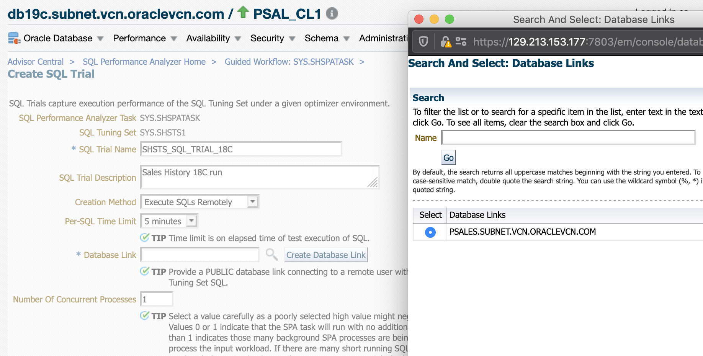

       - **Check** Trial environment established
       - **Click** Submit

13. Back to SQL Performance Analyzer Home page, to check the status of the task run.

    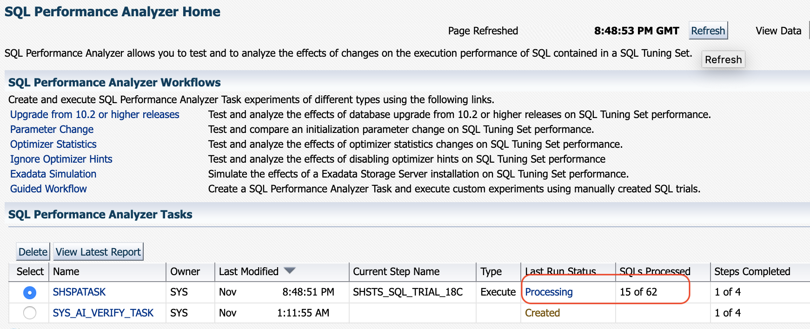

       - Continue the Workflow **Click** SHSPATASK

    

14. Continue Step 3 in SPA Guided Workflow **SHSPATASK**, and create SQL Trial in Changed Environment

    

       - Enter SQL Trial Name : **SHSTS\_SQL\_TRIAL\_19C**
       - Enter Description : Sales History 19C Run
       - Creation Method: **Execute SQLs Locally**
       - Default per-SQL Time Limit
       - **Check** Trial environment established
       - **Click** Submit

    

15. Back to SQL Performance Analyzer Home page, to check the status of the task run.

    

       - Continue the Workflow **Click** SHSPATASK

16. Continue Step 4 in SPA Guided Workflow **SHSPATASK**, and compare Step 2 and Step 3

    

       - Trial 1 Name : **SHSTS\_SQL\_TRIAL\_18C**
       - Trial 2 Name : **SHSTS\_SQL\_TRIAL\_19C**
       - Comparison Metric : **Buffer Get**
       - **Click** Submit

    

17. Continue Step 5 in SPA Guided Workflow **SHSPATASK**, View Trial Comparison report

    

    

       - **Click** one of the SQLID to check the detail of the SQL comparison

    

## Task 2: Workload Analysis

1. Click on the Targets, then Databases. You will be directed to the list of Databases in EM. Here you will notice different databases listed, such as SALES, HR etc. We will work the sales container database. Select the **Sales** database from the list and this will take you to the DB home page for this database.

    

    
    
2. Navigate to Workload Analysis from the Performance Menu or from Database home page. you can schedule Automated workload analysis by configuring automated   analysis task. In this lab, we will run One-Time analysis task, go to One-Time Analysis tab and click on Create Analysis Task.

     

     

3. Create task with the following inputs
   
       - Enter task Name : **WLA\_Test**
       - Enter Description : Comparing two workloads using Workload Analysis

   
       
4. Under Reference Workload, click on search icon to choose WLA\_STS1 from the dropdown menu. Later choose WLA\_STS2 from the Compared Workload search

     

5. In Comparison Metric, you can choose multiple options for the comparison report like Buffer Gets, Elapsed Time, CPU Time and Disk Reads. For now, let's choose Buffer Gets and Elapsed Time. Click on submit to submit the task. 

     
    
     

6. Refresh the page, to see the reports and click on any report to analyze, let's view **Elapsed Time Workload Analysis Report**.
    
     
    
     

     

7. Report shows regressed, improved, missing, new and plan changed SQLs, which helps in analyzing the workload.

     

8. Click on the New Plan in  SQL statements by Plan Change, to see the plans changed SQLs which are impacting the overall performance of the workload. Click on the SQLID which is regressed and has plan changed column "Yes"

     

     

     

9. Look for the plan changes and notice there is a index that is missing which is the root cause of the regression, hence the workload performance is regressed. Workload Analysis helps in analyzing the performance of the SQL by providing granular level details.

    

10. Click on the below listed links to view Workload Analysis videos

     [WLA Configure video](https://youtu.be/EVqcpEgneWE)

     [WLA Report Analysis video](https://youtu.be/HJ7wjl6oXrg)

## Task 3: Database Workload Replay - Capture Workload

1. Log into an Enterprise Manager VM (using provided IP). The Enterprise Manager credentials are “sysman/welcome1”.

      

2. Go to Enterprise - Job - Library

      

3. Pick Job Name **START\_SWINGBENCH\_LOAD** then click Submit

      

4. Click Submit, Swingbench workload starts with 40 concurrent users to Pluggable Database OLTP in **sales.subnet.vcn.oraclevcn.com**

     

5. Go to Enterprise menu - Quality Management - Database Replay

     

6. Click Create button in Capture Workloads Tab

     

7. Check both Capture Prerequisites, then Click Next

       

8. Click Add in Capture Databases list

       

9. Enter Capture Name **soecap**

     

10. Select Target Database with Target Name **sales.subnet.vcn.oraclevcn.com**

     

11. Pick OEM_SYS credential for Database Credential, and check Preferred for Database Host Credential, and click Browse for Database Capture Storage location

     

12. Go to Path **/home/oracle/scripts** and pick folder **CAPTURE**

     

    Click Ok then Next

     

     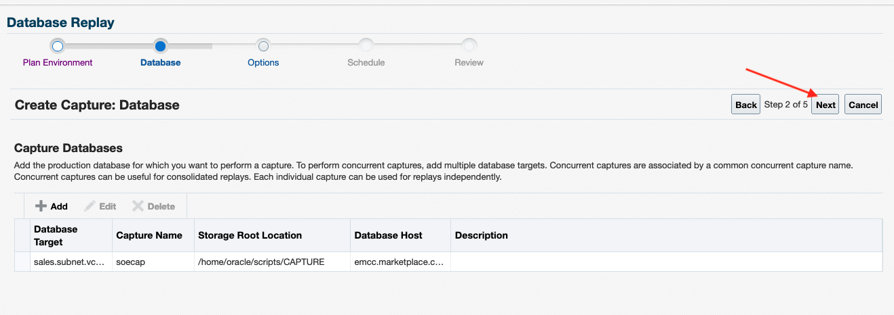


13. Use Default Option

       - Check on Capture SQL statements into a SQL Tuning Set during workload capture
       - PL/SQL capture mode : Top Level
       - Workload Filters : Exclusion Filter mode
       - Excluded Sessions : Program OMS and Module emagent%

     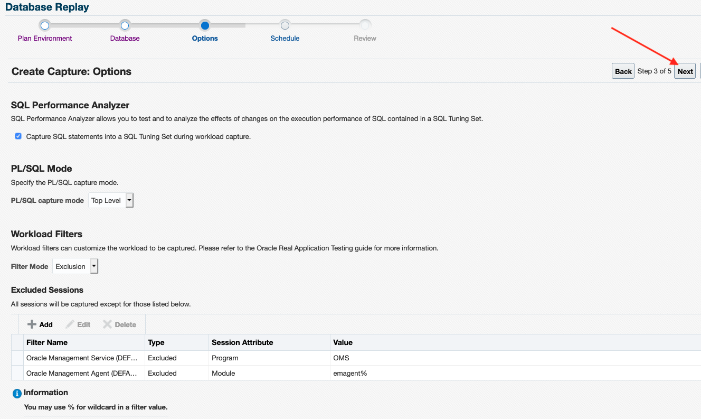    

    Click Next

14. Create Capture: Schedule, Start Immediately; Duration : 5 minutes
    AWR export Schedule to run after capture Completed

     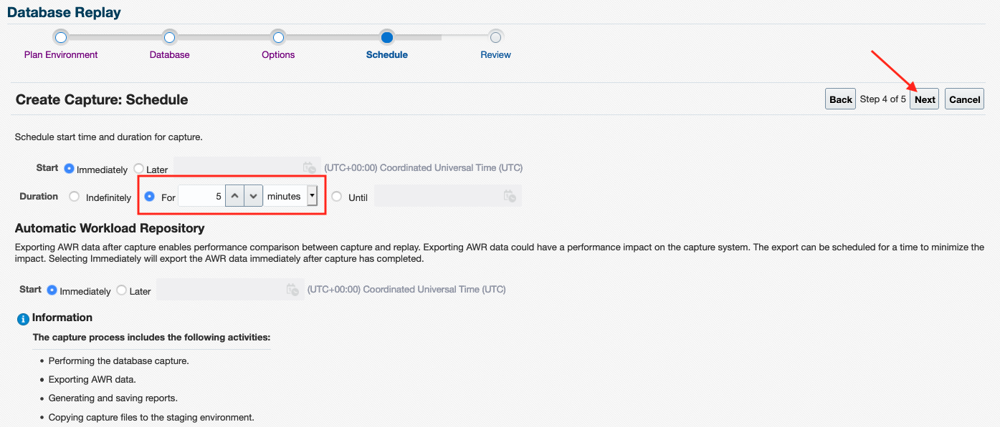

    Click Next

15. Create Capture: Review, Click Submit

     

    Click Submit

16. In Database Replay landing page, click on **soecap** ih Capture Workload

     

     

17. After 5 minutes, DB Capture finished (Succeeded)

     

18. Stop Swingbench Workload. Go to Enterprise - Job - library

     

19. Pick STOP\_SWINGBENCH\_WORKLOAD, click Submit

     

    Click Submit in the Job page

     

20. Review Capture Report. Go to Enterprise - Quality Management - DB Replay

     

21. In Workload Cature tab, select **soecap**

     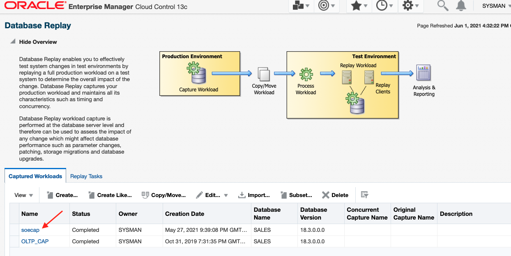

22. Click tab **Reports**

     

23. Click **View** button

     

24. Pop up window appear to show Capture's Report

    

    

## Task 4: Database Workload Replay - DB Replay

1. Log into an Enterprise Manager VM (using provided IP). The Enterprise Manager credentials are “sysman/welcome1”.

    

2. Go to Enterprise menu - Quality Management - Database Replay

    

3. Click **Replay Task** tab

    

4. Click **Create** button

    

5. Enter **soerep** for Replay Task Name and click **Add** button in workloads

    

6. Pick **soecap** from Search and Select workloads

    

7. Enter **soerep_1** in Replay Name and click on **Search** button

    

8. Select **db19c.subnet.vcn.oraclevcn.com**

    

9. Click **Submit** button

    

10. Click **Preprocess workload** task

    

11. Pick Named Credential **SYS_DB19C** for Database Credential and **ORACLE** for Database Host Credential, then click **Next**

    

12. Click **Next**

       

13. Click **Submit**

    

14. Click on highlighted Preprocess Job to monitor preprocess job

    

15. Click **refresh** until the status **Succeeded**

    

       - After status **Succeeded** click **soerep_1**

    

16. Click **Replay Workload** tasks

      

17. Pick Named Credential **SYS_DB19C** for Database Credential and **ORACLE** for Database Host Credential, then click **Next**

      

18. Click **Next** after validate the workload directory and **Retrieve Workload Information**

      

      

19. Remap replay connection using below connect string

      

   ````
   <copy>(DESCRIPTION = (ADDRESS = (PROTOCOL = TCP)(HOST = emcc.marketplace.com)(PORT = 1521))(CONNECT_DATA = (SERVICE_NAME = oltp_cl2.subnet.vcn.oraclevcn.com)(SERVER = DEDICATED)))</copy>
   ````

20. Click **Next** using default Replay's Options

      

21. Click **Add** in Replay Client hosts

        

22. Click **Search** in Host

        

23. Select **emcc.marketplace.com**

      

24. In Client Configuration page :

      -  Enter below connect string for Server Connection Identifier

    ```
     <copy>(DESCRIPTION = (ADDRESS = (PROTOCOL = TCP)(HOST = emcc.marketplace.com)(PORT = 1521))(CONNECT_DATA = (SERVICE_NAME = db19c.subnet.vcn.oraclevcn.com)(SERVER = DEDICATED)))</copy>
    ```

      -  Enter/Browse **/u01/app/database/product** for Client Oracle Home

      -  Click **Browse** for Client Replay Directory

      -  Select **DBReplayWorkload\_soecap\_2** in /home/oracle/script/CAPTURE

      -  Enter username : **system**  Password : **welcome1**

  
  
     

25. Click **Next**

      

26. Click **Start Clients**

      

      

27. Click **Submit**

      

      

28. Click **Refresh**

      

      

29. Click **Reports** tab

          

30. Review **Database Replay Report** to determine the quality of Replay.

      

      - Compare number of **User calls** between capture and replay

          

      - Review **Replay Divergence**

      

      Below 4% Divergence of the Total User Calls considered Replay to be a good workload representation for capture

      Fix Divergence Errors possibilities caused by mis-configuration of Test Replay Database

            

31. Review **Replay Compare Period Report** to review Database Performance comparison between Capture and Replay

      

      - Compare **Main Performance Statistics** Capture vs Replay

      

      - Compare **ADDM Comparison** Capture vs Replay

      

      - Compare ASH Wait Time Distribution Capture vs Replay

      

      - Compare SQL performance Capture vs Replay

      

      


## Task 5: Database Workload Replay - API

### Login to Host using SSH Key based authentication
In this lab, we are going to use a pre-captured workload of Sales History. The workload located in directory **/home/oracle/scripts/CAPTURE/lab4con/lab4SH**

1. Preprocess workload from API command

   **Terminal Session 1**

        - Open new Terminal Session in the Desktop
        - Set Environment variables for sales database **. 19c.env**
        - Run Sqlplus connect to Database using sysdba
        - Create DB Directory Object LAB3SOE
        - Pre-process the capture in 19C Database

    ``` sql
    . /home/oracle/19c.env
    sqlplus '/ as sysdba'
    SQL> create directory lab4sh as '/home/oracle/scripts/CAPTURE/lab4con/lab4SH';
    SQL> exec dbms_workload_replay.process_capture('LAB4SH')
    ```

      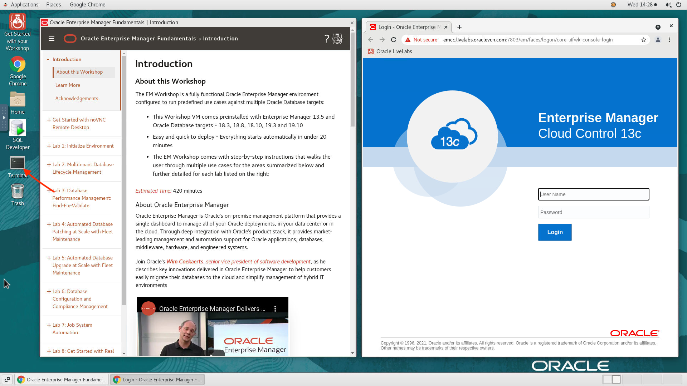

      

2. From the same sqlplus session run below command to Initialize the Replay

    ```` sql
    SQL> exec dbms_workload_replay.INITIALIZE_REPLAY (replay_name => 'lab4rep', replay_dir => 'LAB4SH');
    ````

3. Run below PLSQL anonymous block to remap the connections for replay

    ```
    <copy>begin
    for i in (select conn_id, capture_conn from dba_workload_connection_map m, dba_workload_replays r where replay_id = id and name = 'lab4rep')
    loop
      dbms_workload_replay.remap_connection(i.conn_id, '(DESCRIPTION = (ADDRESS = (PROTOCOL = TCP)(HOST = emcc.marketplace.com)(PORT = 1521))(CONNECT_DATA = (SERVER = DEDICATED)(SERVICE_NAME = psal_cl1.subnet.vcn.oraclevcn.com)))');
     end loop;
     commit;
      end;
      / </copy>
      ```
      

4. Continue in same sqlplus sessions and prepare the replay with TIME synchronization and query_only mode. Do not close the sqlplus session and the Terminal.

     ```` sql
     SQL> exec dbms_workload_replay.PREPARE_REPLAY (synchronization => 'TIME',query_only => TRUE);
     ````
      

5. Open a new Terminal Session to start **wrc** clients.

    **Terminal Session 2**

        - Set Environment variables for sales database **. 19c.env**
        - run wrc in the replay folder

     ``` sh
     . 19c.env
     cd /home/oracle/scripts/CAPTURE/lab4con/lab4SH
     wrc system/welcome1

     ```

      

     **Terminal Session 1**

     Start the replay in session 1

     ``` sql
     SQL> exec dbms_workload_replay.START_REPLAY
     ```

      


6. Import Completed Capture into EM

       - Log into your Enterprise Manager as **sysman** as indicated in the Prerequisites step if not already done.
       - Navigate from **Enterprise** to **Quality Management** top then **Database Replay**
       - **Click** Import button in Capture Workload  

     

       - Pick **Import a completed capture from a directory in file system** and click **Next**

       

       - Select **db19c.subnet.vcn.oraclevcn.com**

     

       - Use **SYS_DB19C** named credential for DB credential, use **ORACLE** for named credential for DB Host credential. Click Browse to enter **Workload Location**

     

       - Workload Location : **/home/oracle/scripts/CAPTURE/lab4con/lab4SH**

     

         

       - Click **Load Workload** button in Import Workload page, then click **Next**

     

         

       - Click **Submit**

     

       - The Import job might takes 2-3 minutes to be completed

7. Import Running Replay into EM    

       - **Click** Replay Tasks tab and **Click** Create button

     

       - **Enter** Name **shrep** in Create Task page
       - **Click** Add button in Workloads section

     

       - **Pick** SH click **Select**

         

       - **Uncheck** Create a new replay in Replays section
       - **Click** Submit

     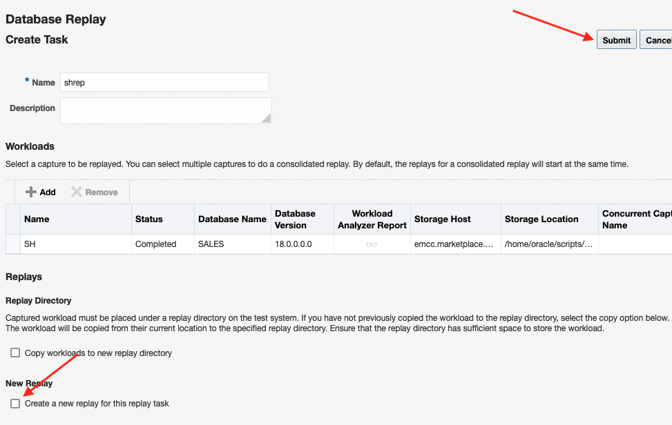

       - Back to **Database  Replay** main page
       - **Click** shrep replay task

     

       - In Replay Task page **click** Import button in Replays section

     

       - **Check** Attach to a replay of this replay task running in a database target

     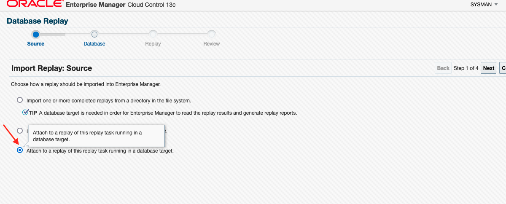

       - **Select** db19c.subnet.vcn.oraclevcn.com

     

       - Use **SYS_DB19C** named credential for DB credential, use **ORACLE** for named credential for DB Host credential

     

       - **Click** Discover Replay and **Next** button

     

     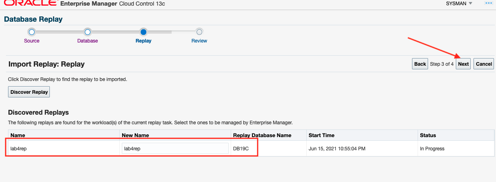   

       - **Click Submit**

     

       - Running Replay imported and monitored in EM

     

     

8. When we run this LiveLab use **Free Trial Credit**, the Replay will finish longer and the DBTime will be bigger than Capture.

     

     

     

     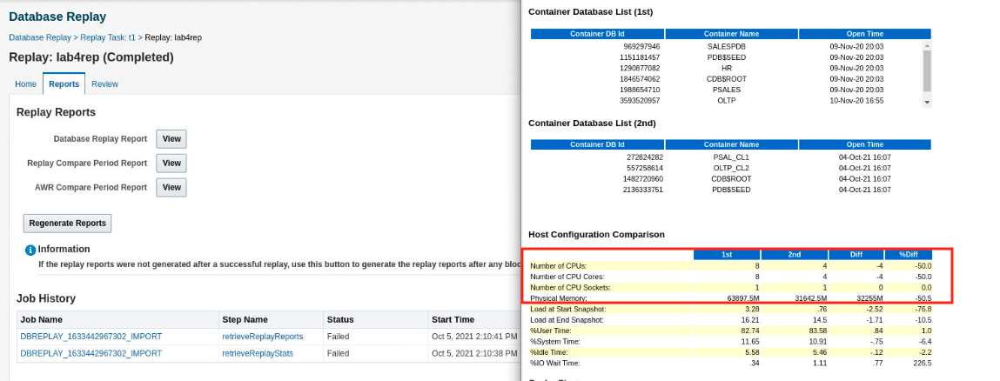

  The cause is the Replay with **Free Trial Credit** use lesser number of CPUs and Memory resource.


## Task 6: Database Consolidation Replay

1. Log into an Enterprise Manager VM (using provided IP). The Enterprise Manager credentials are “sysman/welcome1”.

     

2. Go to Enterprise menu - Quality Management - Database Replay

     

3. Click **Replay Task** tab

    

4. Click **Create** button

          

5. Create Consolidation Replay Task

    * Enter Name **lab5con**, Click **Add** button

    

    * Highlight **SH** and **soecap** and click **Select** button

    

    * Check Copy Workload to a new Replay Directory, then click **Set Credential**

    

    * Click **Ok**

    

    * Click search button to select Host target

    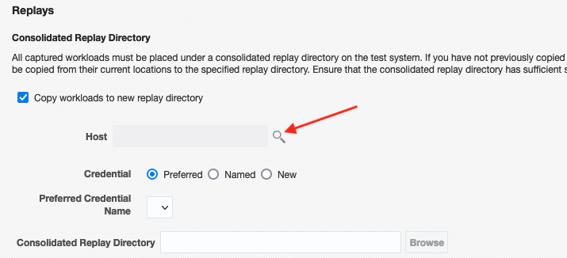

    * Pick **emcc.marketplace.com** and click **Select**

    

    * Check Named Credential, Credential Name **ORACLE**, Click **Browse** to enter path **/home/oracle/scripts/CAPTURE/lab5**

    

    

    * Enter Name: **lab5con_rep1** for new Replay

    

    * Click Search for Database Target, and Select **db19c.subnet.vcn.oraclevcn.com**

      

    * Click **Submit**

    


6. Click on Replay Workload Task

    

7. Pick Named Credential **SYS_DB19C** for Database Credential and **ORACLE** for Database Host Credential, then click **Next**

    

8. Check Use an existing directory object point to **/home/oracle/scripts/CAPTURE/lab5**, Click **Next**

    

9. Highlight Workloads **SH**, update Connect Descriptor

    ````
    <copy>(DESCRIPTION = (ADDRESS = (PROTOCOL = TCP)(HOST = emcc.marketplace.com)(PORT = 1521))(CONNECT_DATA = (SERVER = DEDICATED)(SERVICE_NAME = psal_cl1.subnet.vcn.oraclevcn.com)))</copy>
    ````

   

   Highlight Workloads **soecap**, update Connect Descriptor

    ````
    <copy>(DESCRIPTION = (ADDRESS = (PROTOCOL = TCP)(HOST = emcc.marketplace.com)(PORT = 1521))(CONNECT_DATA = (SERVER = DEDICATED)(SERVICE_NAME = oltp_cl2.subnet.vcn.oraclevcn.com)))</copy>
    ````

    

   **Click Next**

10. Click **Advanced Replay Schedule**

    

    Set 3 min Replay Delay for soecap

    

    **Click Next**

11. Click **Add** in Replay Client hosts

      

    * Click **Search** in Host

      

    * Select **emcc.marketplace.com**

    

    Enter below connect string for Server Connection Identifier

    ````
    <copy>(DESCRIPTION = (ADDRESS = (PROTOCOL = TCP)(HOST = emcc.marketplace.com)(PORT = 1521))(CONNECT_DATA = (SERVICE_NAME = db19c.subnet.vcn.oraclevcn.com)(SERVER = DEDICATED)))</copy>
    ````

    * Set **2** Number of Replay Clients

    * Enter/Browse **/u01/app/database/product** for Client Oracle Home

    * Click **Browse** for Client Replay Directory, set **/home/oracle/scripts/CAPTURE/lab5** for Client Replay Directory

    

    * Enter username : **System**  Password : **welcome1**

    

    * Click **Next**

    

12. Click **Start Clients** button

    

    * Click **Next**

    

13. Click Submit to start Consolidation Replay

    

      

    

14. In **Free Tier Credit** Image, the Consolidation Replay can take much longer time to finish. The same reason as in Task 4, the Capture for Sales History workload has more CPUs and memory resource in comparison with Replay enviroment. In **Free Tier** the Consolidation Replay estimated finish in 30 minutes. You can stop the Replay and finish the Lesson.

    

15. If you are able to finished the Consolidation Replay lab5con_rep1, you can review the report.


  


You have now learned how to work with Real Application Testing. As you can see there are Guided Workflows that will help you during your analysis and verify that you can implement new changes in production with confidence.


This completes the Lab

Thank You!

## Learn More

  - [Oracle Enterprise Manager](https://www.oracle.com/enterprise-manager/)
  - [Enterprise Manager Documentation Library](https://docs.oracle.com/en/enterprise-manager/index.html)
  - [SQL Performance Analyzer (UI)](https://docs.oracle.com/en/database/oracle/oracle-database/21/ratug/sql-performance-analyzer.html#GUID-8CE976A3-FB73-45FF-9B18-A6AB3F158A95)
  - [Database Replay Workload Capture (UI)](https://docs.oracle.com/en/database/oracle/oracle-database/21/ratug/capturing-a-database-workload.html#GUID-E774C161-98C0-43EF-8B78-DD74E2A2A219)
  - [Database Replay Workload Replay (UI)](https://docs.oracle.com/en/database/oracle/oracle-database/21/ratug/replaying-a-database-workload.html#GUID-1F638D8F-7168-492D-BAD6-39F4F36EAD9B)
  - [Database Replay Workload Replay (API)](https://docs.oracle.com/en/database/oracle/oracle-database/21/ratug/replaying-a-database-workload.html#GUID-0F8D20F3-A4A1-4A89-852A-449C2E7C9602)
  - [Database Replay Consolidated Replay (UI)](https://docs.oracle.com/en/database/oracle/oracle-database/21/ratug/using-consolidated-database-replay.html#GUID-62AAF505-1DD4-414A-9F1D-4386B59B7138)
  - [Database Lifecycle Management](https://docs.oracle.com/en/enterprise-manager/cloud-control/enterprise-manager-cloud-control/13.4/lifecycle.html)

## Acknowledgements
- **Author** - Daniel Suherman, Oracle Enterprise Manager Product Management
- **Adapted for Cloud by** -  Rene Fontcha, Master Principal Solutions Architect, NA Technology
- **Last Updated By/Date** - Anusha Vojjola - Enterprise Manager Product Management, August 2024
