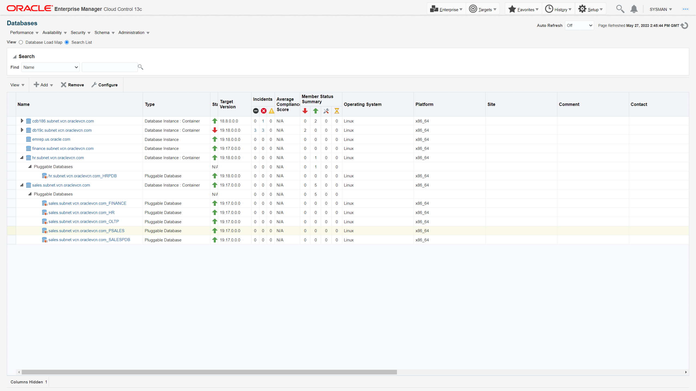

# Automated Database Update(Patching) at Scale with Fleet Maintenance Hub

## Introduction
In this workshop, you will experience the benefits of using the new Oracle Enterprise Manager Fleet Maintenance User Interface, which we call it as Fleet Maintenance Hub to automate the update(patching) of multiple Oracle Databases in one flow.

*Estimated Time*: 60 minutes

You can watch this video below for a quick walk-through of this lab.
[Video Walk-through](videohub:1_vyyju031)

### About key features of Fleet Maintenance Hub in Oracle Enterprise Manager

Fleet Maintenance Hub is a
- Powerful one-stop place for customers to get insight into vulnerabilities for database assets and apply patches to affected targets, and secure each of those
- Single pane of glass for vulnerabilities and patch operations


Starting with Enterprise Manager 13.5 RU16, Enterprise Manager offers a new interface - Fleet Maintenance Hub to ease automated update(patching), and upgrade of your database fleet.

Benefits of using the EM Fleet Maintenance Hub include:
- Identifying database assets, which are not subscribed to any gold image. Targets not subscribed to any image are ideal candidates for data breach.
- Patch recommendations for Images. Refresh gold images and apply those to subscribed targets to enhance your security posture.
- A single pane of glass for monitoring and managing the entire update(patching) and upgrade operations
- Ability to schedule/retry/suspend/resume operations
- Patch Oracle Databases across different infrastructure including engineered systems like Oracle ExaCC
- And make sure your targets are always compliant with your patch policies


Lets review various components of the Fleet Maintenance hub.


Fleet Maintenance works on Subscription based model, i.e. to patch a database or grid infrastructure, it should be subscribed to a gold image. Any database/grid, which is not subscribed to any image can not be patched and thus remains susceptible for any data breach. Its recommended that the databases should be patched with latest patch recommendations from Oracle. You can learn more about these recommendations by following Oracle's Security Alerts and Bulletins.

The first tile, ***Targets Not Subscribed*** gives you an insight about your weakest database and grid entities as the tile shows the unsubscribed databases and grids. The numbers 13 for database and 12 for grid implies that these assets are not part of any gold image. As a DBA, its paramount that these assets are subscribed to relevant gold image.

In the middle section, we see two graphs. These represents no of database and grid infrastructure based on versions. Eg, the highlighted blue bar for database shows 7 databases running under 19c.

The Table below the graphs lists out the databases and grid that are not subscribed to any image. You may choose filters to identify any particular database. Subscribe button allows you to subscribe the database or grid to an image. We will cover the subscription part when we update a database in this lab.


Tile 2, ***Patch Recommendations for Images***, lists out the health status of your images with respect to Oracle provided patch recommendations. Lets review the patch recommendation column and understand the actions required by an administrator.

- If you see a green check mark - ✔, it suggests that the gold image has all recommended patches. The image can be used for patching and any databases/grid subscribed to this image will have all the recommended patches post successful completion of update operation.
- If you see a yellow exclamation  mark - , it suggests that a new version in the image has all the recommended patches but it is not marked current. Hence, the updated version can't be used for update operation. Immediate next step for DBA is to mark the latest version as current.
- If you see a red exclamation  mark - , it suggests that current version of the image lacks recommended patches. The number of patches is displayed (in this case 6). If you click on the number, a new slideout will show you the details of the Oracle recommended patches. Immediate next step for DBA is to create a new version and include all the recommended patches and mark this new version as current.


Tile 3, ***Patch Compliance with Images***, list out the databases or grids that are subscribed to a gold image. If the image is not up-to-date,  a warning icon will be shown. Patch level will show following information.
- If the target is on current version,  show "Current"
- If the target is drifted, show 'Drifter'
- Otherwise,  you will see the image version that the target is on


#### Video Preview
Watch a preview of database patching using Oracle Enterprise Manager Fleet Maintenance:

[](youtube:JlspEvqebHE)

*Note: Interfaces in this video may look different from the interfaces you will see. For updated information, please see steps below.*


### Objectives

In this lab you will perform the following steps:
| Step No. | Feature                                                    | Approx. Time | Details                                                                                                                                                                    | Value Proposition |
|----------------------|------------------------------------------------------------|-------------|----------------------------------------------------------------------------------------------------------------------------------------------------------------------------|-------------------|
| 1                    | Detect targets which are not subscribed to any image                             | 5 minutes  | Analyze the database estate using Fleet Maintenance Hub                                                                                                                | Provides recommendation to subscribed databases and grid to gold image.                  |
| 2                    | Review Patch recommendations | 10  minutes  | Refresh Gold image with patch recommendations | Demonstrate with ease to determine which recommended patches are applicable to gold image.                  |
| 3                    | Patch a Pluggable Database with Fleet Maintenance | 45  minutes  | Update(Patch) a PDB using a Gold Image. As part of patching the Pluggable Database, unplug Oracle Pluggable Database in that Container Database and plug it to higher version Container Database. | Demonstrate key capabilities and features of Fleet Maintenance to update(patch) Oracle Pluggable Database.  

### Prerequisites
- A Free Tier, Paid or LiveLabs Oracle Cloud account
- You have completed:
    - Lab: Prepare Setup (*Free-tier* and *Paid Tenants* only)
    - Lab: Environment Setup
    - Lab: Initialize Environment

*Note*: This lab environment is setup with Enterprise Manager Cloud Control Release 13.5 and Database 19.10 as Oracle Management Repository. Workshop activities included in this lab will be executed both locally on the instance using Enterprise Manager Command Line Interface (EMCLI) or Rest APIs, and the Enterprise Manager console (browser)

## Task 1: Performed in Advance

To save time, the following steps were already completed.

1. A 19c Oracle home was created in test lab and its has been exported here. You can review the documentation on how to export and import Gold Images across various Enterprise Manager setups. We have created two images.

***19cDB-Linux-x64-ERP*** - with Versions  - v19.17DBRU (Current)
***19cDB-Linux-x64-Apps*** - with Versions , v19.17DBRU, v19.18DBRU (current) ,  v19.19DBRU

To ensure smooth execution of the use cases, we have pre-hosted the scripts to be used later at */home/oracle/fleet*

We will see details of gold images that we have created at a later point in this lab.

## Task 2: Review the target to be updated

In this lab activity, you will update one of the PDBs of ***sales.subnet.vcn.oraclevcn.com***. During the update process, Fleet maintenance will unplug the selected PDB and plug it to higher version CDB.
We will patch PDB - ***PSALES*** of CDB ***sales.subnet.vcn.oraclevcn.com*** from 19.17 to 19.18 (the PDB will be migrated to CDB ***hr.subnet.vcn.oraclevcn.com***)

<!--
  
-->
  

## Task 3: Database Server update(patching) with Fleet maintenance (Overview)

### **Database Fleet Maintenance**

Enterprise Manager Database Fleet Maintenance is a Gold Image Target subscription-based Out of Place patching solution. Out of Place patching is a method where patching is performed by creating a copy of the Oracle home, applying patches to the copied home, and then switching services to the copied home.

A gold image is the end of state software definition that contains information about the base software version plus the additional patches. Targets, to be patched, subscribe to a relevant Gold Image. Target subscription persists through the lifecycle of the Target or Gold Image unless modified by an administrator.

  <!--  -->
  

## Task 4: Create Gold Image *[Which has already been implemented]*

1. Imported Gold Image

    Gold Image represents a software end state. An Enterprise Manager Software Library Gold Image is a software archive created from a patched oracle home uploaded to EM Software Library.

    To create a Gold Image of the ‘recommended patch configuration’, you manually create an Oracle home as a pre-requisite step. The goal is to patch PDB at 19.17 version to 19.18. A reference Oracle home was created in a similar setup and fully patched to 19.18. This Oracle home was exported and imported in this setup. The imported file was used to create the two Oracle Homes we mentioned earlier. Once the gold Image was created, we had their respective image ids. To import other versions into the same gold image, we used the respective image ids.


2. We also have a 19c patched Oracle home. This patched reference Oracle home is discovered in Enterprise Manager. From the Enterprise Manager menu bar, navigate to the ***Targets*** drop-down menu and then select ***All Targets.***

    Then on the All Targets page, in the upper left search field, type or copy “*Orasidb19c\_home1\_2020\_05\_13\_04\_24\_10\_emcc.marketplace.com\_2953*” in the “Search Target Name” box. Click on Search icon.


    ```
    <copy>Orasidb19c_home1_2020_05_13_04_24_10_emcc.marketplace.com_2953</copy>
    ```
    
    In the results page click on the target name.

    

    However, we have not used this Oracle Home to create the gold images. This is just for reference. Instead of export-import, you can patch this Oracle Home to required patch sets and use emcli to create gold images.

## Task 5: Subscribe Database

1.  Before we start the update process, lets execute some scripts to ensure that the lab is fir to execute the required steps.
    Script 1 will be to unsubscribe	sales.subnet.vcn.oraclevcn.com database

Lets review tile 1 and find out details of databases which are not subscribed to any of the gold images.

  

    We see that the CDB ***sales.subnet.vcn.oraclevcn.com*** is not subscribed to any gold image. As we want to update one of its PDB to 19.18 version, lets subscribe the CDB to Gold image of 19.18 version. Currently, subscription at pluggable level is not supported.


2. Subscribe the CDB.

    Lets click on the Subscribe button at the top left section of the grid. Once done a new slide out appears.
    

    In the slideout, lets ensure that we have selected proper filtering criteria and from the image selection drop down, we select 19.18 gold image.

    Under Targets, lets select the CDB ***sales.subnet.vcn.oraclevcn.com***. Click on subscribe.

    

    Subscription of CDB completed successfully, and we can close the slideout. We can now see that the initial count of unsubscribe databases has reduced.
    

## Task 6: Review Image recommendations

1. In order to complete the deployment of new image, lets review if the gold image we selected in previous step has all the recommended patches. Lets click on tile 2, which is ***Patch recommendation for images***.

    

    If we examine the row which is related to the 19.18 gold image we selected, we see that patch recommendation for the image has a green checkmark, suggesting all recommended Oracle patches are part of the current version of the image.

    However, under patch compliance column, we see that the cigar bar has some red portion. This is due to the fact that we have subscribed the CDB which is not patched to the same version of this gold image. The bar suggests that there is a pending action to update the database.

## Task 7: Review Patch Compliance

1. Lets move to tile 3, which is ***Patch Compliance with Images***. From the bar chart we can see that the sales CDB is not complaint. In order to proceed with patching, from the actions column, lets select ***Update Pluggable Database***


## Task 8: Update PDB

1. In this page, we will select relevant ***Image Name***, ***Target Type*** and ***Operation***.
      
      Where:
      -  Image = We will select ***PDB Image***. Desired version of Oracle home, which our target database should run after successful completion of operation.
      -  Target Type = we will select ***Pluggable Database***. Desired target type, which can be Grid, RAC or SIDB.
      -  Operation = we will select ***Update***. Name of the operation, which can be update (patch) or upgrade.
      -  Type to filter = Optional, can be left blank. Selection criteria to highlight only those targets which qualify the selection, such as database naming.

      We will select check box for ***sales.subnet.vcn.oraclevcn.com_FINANCE***, as we want to patch it to higher version and select ***Next***.

2. In this page, we will select destination CDB as ***Attach Existing CDB***. Options Software Deployment and Migrate Listener will be greyed out as we already have the desired CDB in place, which is cdb186.subnet.vcn.oraclevcn.com.

      

      Under Credentials (We have already created these credentials in Enterprise Manager for this workshop. Please choose Named for all the below three options and from the dropdown menu, you can opt for values as suggested below)    
      -  Normal Host Credentials as ***ORACLE***
      -  Privileged Host Credentials as ***ROOT***
      -  SYSDBA Database Credentials as ***SYS_SALES***     

      Under Options, we can use default value /tmp for Working Directory. This is the location where log files will be created.

      Select ***Next***.    

3. We can validate our entries (CDB details, log file location, credentials) provided in previous page and validate the desired operation. Validation acts as a precheck before we submit the main operation. Click on ***Validate***. This will open a new screen with two validation modes - Quick and Full. We can select either of these. Full validation mode submits a deployment procedure. In this case choose ***Quick validation mode***

      

4. Review the validation result.

      

      Incase of any error, we can fix it and choose revalidate. Select ***Close***.

5. ***Submit*** the operation.  We need to provide a name to the task, which will help us to view these tasks under Procedure Activity Page. Lets enter
      ```
      <copy>finance_pdb_patching</copy>
      ```
      
      Here, we can see that we have opted to attach existing CDB and update PDB.

          
      Clicking on Monitor Progress will take us to Procedure Activity Page. Alternate navigation to review the submitted deployment procedures is ***Enterprise >> Provisioning and Patching >> Procedure Activity***  

6. Review the Deployment Procedures (DP).

      

      We can see that one of the DP related to Attach operation has already completed. Lets click on it and find out the steps executed by this DP.

      
      Lets go back to the Procedure Activity page and review the other DP.

7.  We can see that second DP for update operation is running.
      

      Lets click on it and find out the steps executed by this DP.

      

      We can see that attach DP completed successfully.
      

8.  Lets validate the location of ***finance*** pdb. In the upper toolbar, locate the ***Targets*** icon and click the drop-down menu and then select ***Databases***.

      

      We can see that Finance pdb is relocated to a new CDB - cdb186.subnet.vcn.oraclevcn.com.


That completes the Automated Database Patching at Scale with Fleet Maintenance HUB.

You may now proceed to the next lab.

## Learn More
  - [Oracle Enterprise Manager](https://www.oracle.com/enterprise-manager/)
  - [Oracle Enterprise Manager Fleet Maintenance](https://www.oracle.com/manageability/enterprise-manager/technologies/fleet-maintenance.html)
  - [Enterprise Manager Documentation Library](https://docs.oracle.com/en/enterprise-manager/index.html)
  - [Database Lifecycle Management](https://docs.oracle.com/en/enterprise-manager/cloud-control/enterprise-manager-cloud-control/13.5/lifecycle.html)
  - [Database Cloud Management](https://docs.oracle.com/en/enterprise-manager/cloud-control/enterprise-manager-cloud-control/13.5/cloud.html)
  - [Oracle Critical Patch Updates, Security Alerts and Bulletins](https://www.oracle.com/in/security-alerts/)

## Acknowledgements
  - **Authors**
    - Romit Acharya, Oracle Enterprise Manager Product Management
  - **Last Updated By/Date** -Romit Acharya, Oracle Enterprise Manager Product Management, June 2023
