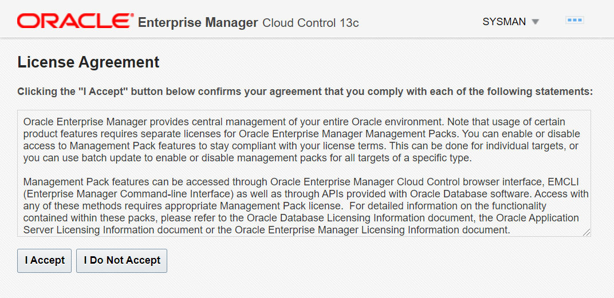
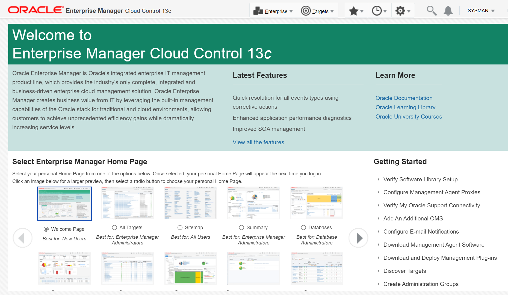
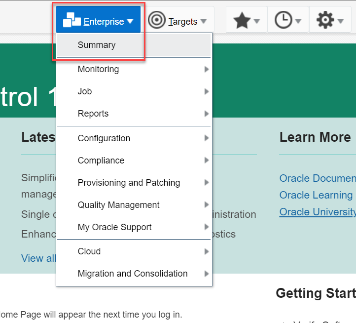
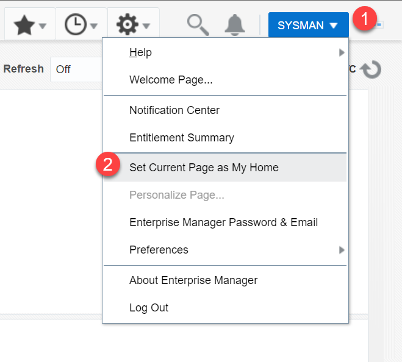

# Log in to Oracle EMCC

## Introduction

This lab shows how to log in to Oracle Enterprise Manager Cloud Control (Oracle EMCC) and access the home page.

*Estimated Time:* 5 minutes

### Objectives
Log in to Oracle EMCC and select a personal home page.

### Prerequisites
This lab assumes you have -
- A Free Tier, Paid or LiveLabs Oracle Cloud account
- You have completed -
    - Lab: Prepare Setup (*Free-tier* and *Paid Tenants* only)
    - Lab: Setup Compute Instance
    - Lab: Initialize Environment

## Task 1: Log in to Oracle EMCC
From Oracle EMCC, you can do various activities, such as view details of your Oracle Database, monitor the database, and perform administrative tasks.

1. From your remote desktop session and using the *Web Browser* window on the right preloaded with *Enterprise Manager*, click on the *Username* field and provide the credentials below to login if not already logged in during the previous labs.  

    ```
    User name: <copy>sysman</copy>
    ```
    ```
    Password: <copy>welcome1</copy>
    ```

    > **URL Syntax**  
    > The Oracle EMCC URL comprises the host name and the port number - `https://hostname:portnumber/em`.  
    For this lab, the host name for Oracle EMCC is *emcc* or *emcc.livelabs.oraclevcn.com* and the port number is *7803*.

2. The first time you log in to Oracle EMCC, the web browser displays a License Agreement. Click **I Accept** to confirm your compliance and continue to log in.

    

    Henceforth, the License Agreement does not appear on subsequent logins.

3. Oracle EMCC opens and displays the default landing page, the Welcome page.

    

    You can select a different home page from the given options and change the default home page.  

4. Open another page, for example the Enterprise Summary page, and set it as your home page. From the **Enterprise** menu, select **Summary**.

    

5. On the Enterprise Summary page from the account name menu, that is from **SYSMAN**, select **Set Current Page as My Home** to set the Enterprise Summary page as your default home page.

    

    The window displays a confirmation message that you have updated your home page. Your personal home page will appear from the next login onwards.

Congratulations! You have successfully logged in to Oracle EMCC and set your home page. You can explore Oracle EMCC and perform administrative tasks for your Oracle Database.

In this lab, you have learned how to log in to Oracle EMCC from a web browser and select a personal home page.

You may now **proceed to the next lab**.

## Acknowledgements

- **Author** - Manish Garodia, Principal User Assistance Developer, Database Technologies
- **Contributors** - Suresh Rajan, Kurt Engeleiter, Prakash Jashnani, Subhash Chandra, Steven Lemme, Ashwini R
- **Last Updated By/Date** - Rene Fontcha, LiveLabs Platform Lead, NA Technology, January 2022
