# Manage Targets - Oracle Database and Listener

## Introduction

This lab shows how to manage the targets discovered by Oracle EMCC. You can view details of Oracle Database and listener and administer them from Oracle EMCC as managed targets.

*Estimated Time:* 15 minutes

### Objectives

View the targets in Oracle EMCC. Add Oracle Database 21c and the Listener as targets in Oracle EMCC and remove them from managed targets. 

### Prerequisites
This lab assumes you have -
- A Free Tier, Paid or LiveLabs Oracle Cloud account
- You have completed -
    - Lab: Prepare Setup (*Free-tier* and *Paid Tenants* only)
    - Lab: Setup Compute Instance
    - Lab: Initialize Environment
    - Lab: Log in to Oracle EMCC

## Task 1: View targets in Oracle EMCC

After logging in to Oracle EMCC, you can view the existing targets from the All Targets page.

1.	From the **Targets** menu, select **All Targets** to open the All Targets page.

    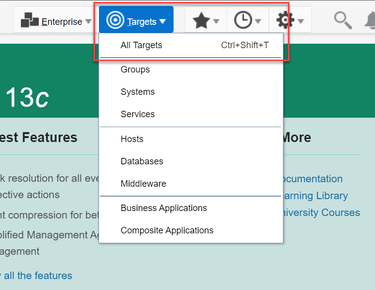

	The All Targets page displays a complete list of targets discovered by Oracle EMCC, such as Hosts, Oracle homes, Listeners, PDBs, and so on.   
    The values may differ depending on the system you are using.  

    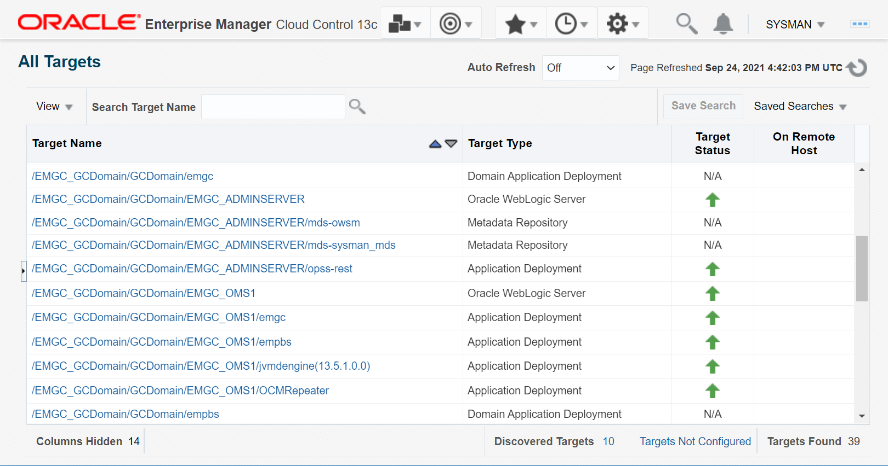

2. 	You can use the filters in the **Refine Search** pane on the left to view a specific target type.

    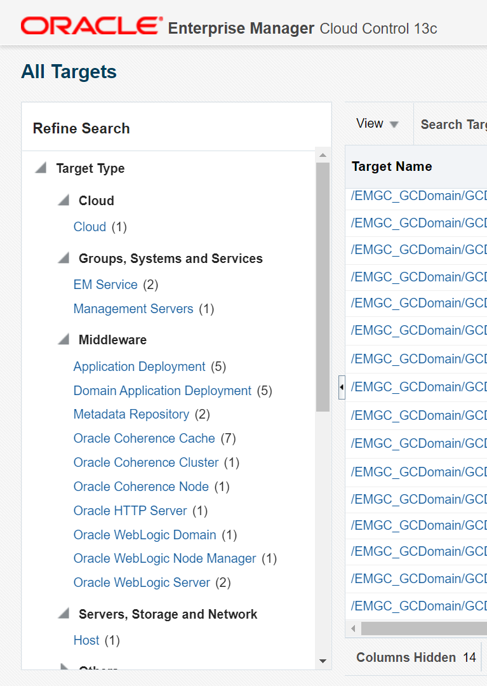

	Click on a target name to open its home page and view the details.

## Task 2: Add Oracle Database and Listener as targets

Add targets using the discovery process and perform database administration from Oracle EMCC. You can add Oracle Database and Listener as targets simultaneously in the same step.

For this lab, add one Oracle Database and one Listener as targets.

1.  From the **Setup** menu, select **Add Target** > **Add Targets Manually** to start adding the targets.

    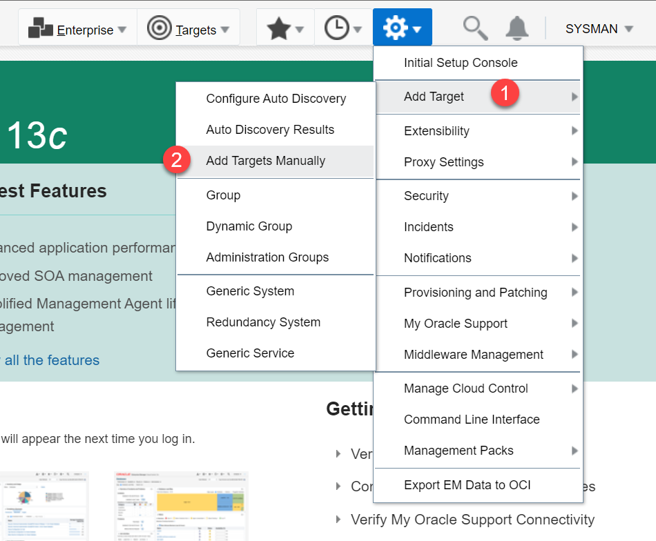

	Alternatively, you can add Oracle Database as a target from the Databases page. From the **Targets** menu, select **Databases**.

    

    On the Databases page, click **Add** > **Oracle Database**. Note that the **View** type selected is **Search list**.

    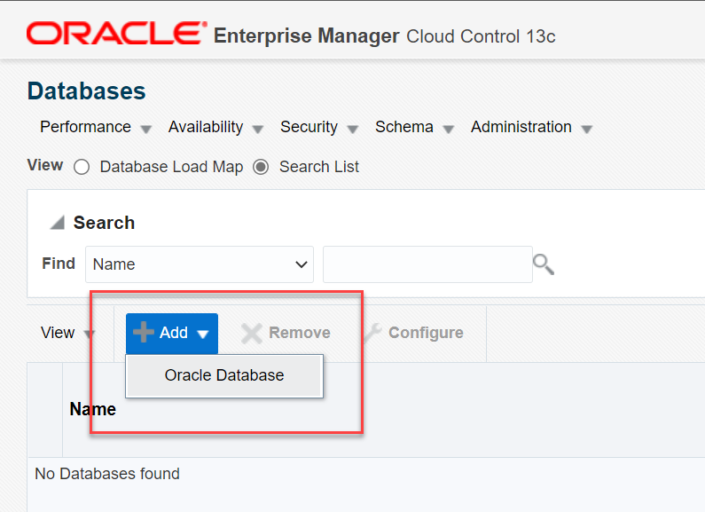

2.  In Oracle EMCC, you can add targets in different ways, such as, by installing an agent, using the guided process, or by adding the targets manually. For this lab, use the guided discovery process to add the target Oracle Database and the target listener.   

	On the Add Targets Manually page under **Add Non-Host Targets Using Guided Process**, click *Add Using Guided Process* to initiate the discovery.

    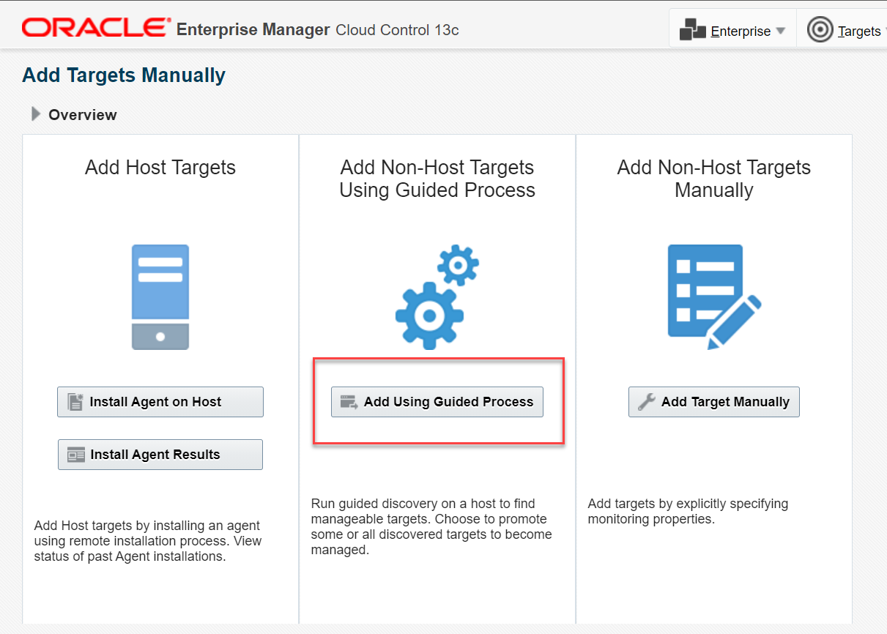

	- **Installing an agent** - This is an autodiscovery process where you install a management agent on an unmanaged host and convert it to a managed host. You can then search for targets on that host and add them.   
	  **Note**: With this process, if you add any new components to your infrastructure in the future, Oracle EMCC automatically finds and brings them under management.  

	- **Using guided process** - This process takes you through a discovery wizard that displays the specifications prefilled by default. The wizard searches for targets, such as Oracle Databases or other deployed components or applications, on the host and helps you promote these targets to managed status.
		> This is the *easy and quick way* to add targets in Oracle EMCC. 

	- **Adding manually** - This is a declarative process where you explicitly specify the monitoring properties required to discover the target Oracle Database.   
	 This process is useful if both autodiscovery and the guided process failed to discover the target.  

3.  Under Guided Discovery, select *Oracle Database, Listener and Automatic Storage Management* and click **Add**.

    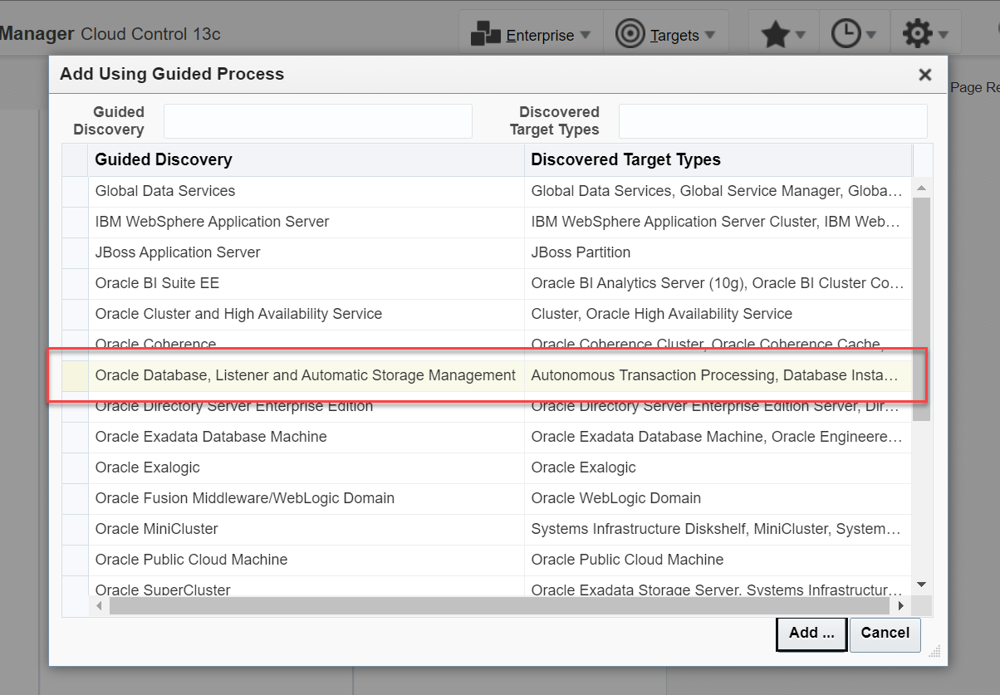

    The Discovered Target Types for Oracle Database is 'Autonomous Transaction processing, Database instance, Listener, Pluggable database, Cluster ASM, Automatic Storage Management, Cluster Database'.

4.  Specify the host or cluster where your Oracle Database resides. Click the search icon (magnifier) to look for the target Oracle Database.

    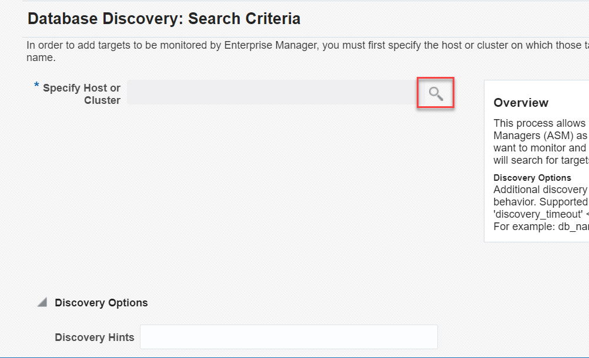

	It opens the **Search Target** diaglog box.

5.  In the status section of the **Select Targets** dialog box, locate your target, for example *localhost.example.com*. Click on it to highlight it and then click **Select**.   
    The values may differ depending on the system you are using.  

    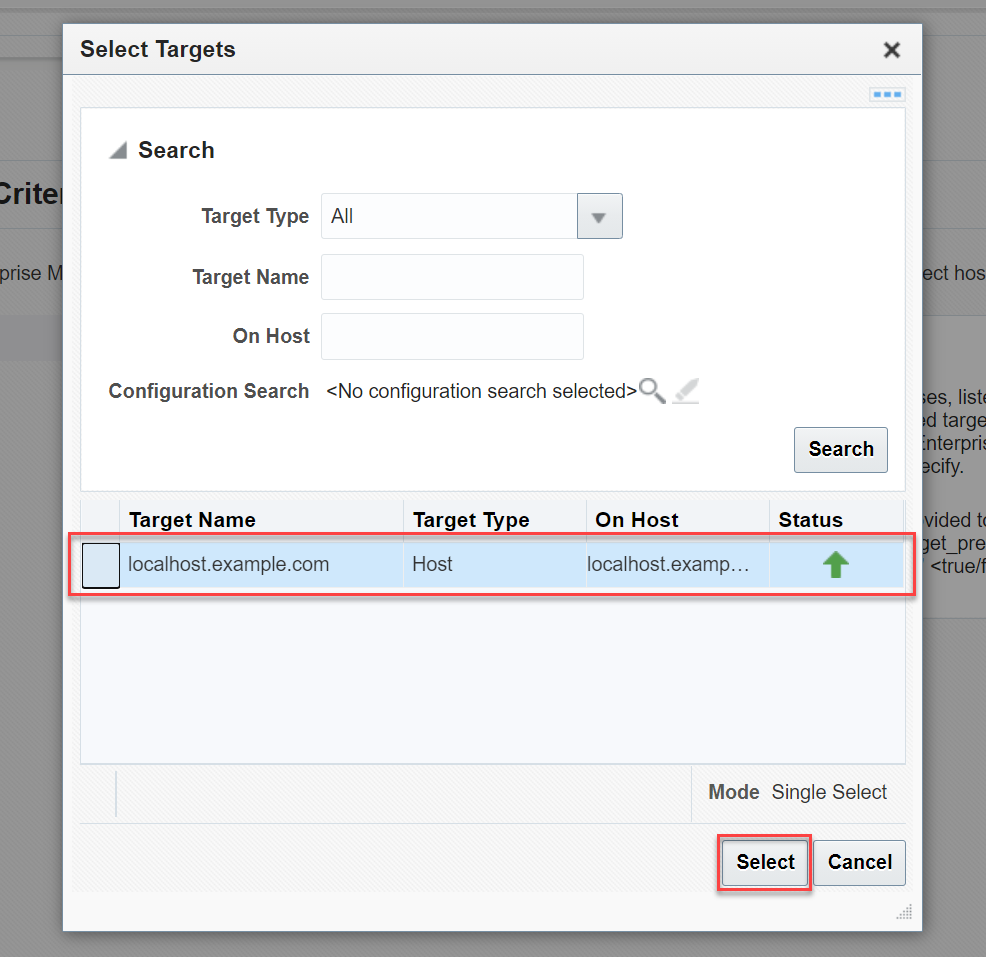

     > **Note:** The upward green arrow in the status indicates that the target host is up and available.  

    If the window shows multiple hosts or clusters, use the filters to search for the required target. 

6.  Verify that the **Specify Host or Cluster** field displays your target name, for example *localhost.example.com*. You may add discovery hints to change the default discovery behavior. Click **Next**.   
    The values may differ depending on the system you are using.  

    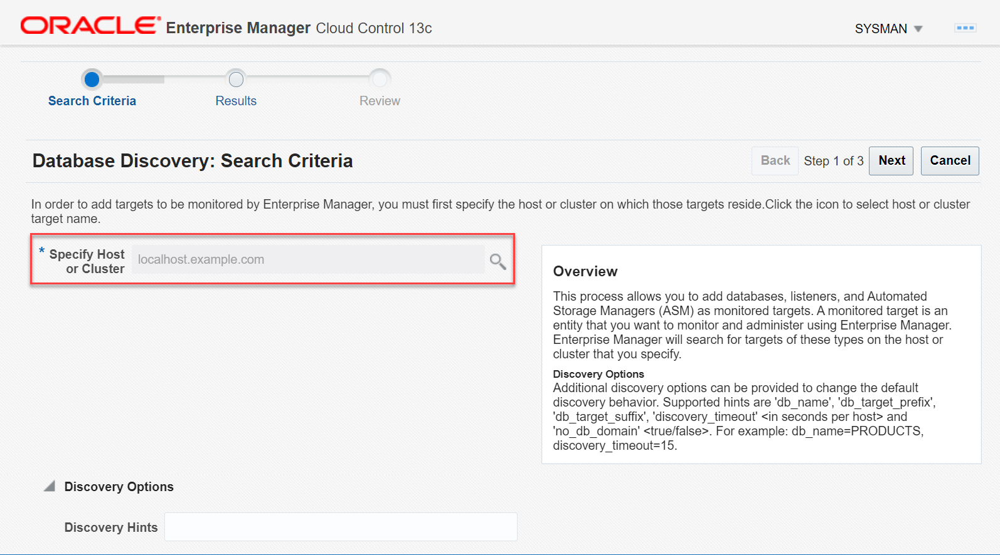

	The window displays a progress bar indicating target discovery as Oracle EMCC searches for targets on your host.

7.  The Results page displays all Oracle Databases, including CDBs and PDBs, and listeners discovered on your host system. The values may differ depending on the system you are using. 	  

    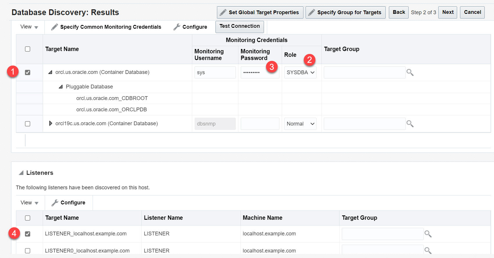

	For this lab, select one Oracle Database and one listener that you want to manage and specify the monitoring credentials as follows.  
     - **Target Name** - Select the checkbox for Oracle Database 21c, for example, *orcl.us.oracle.com (Container Database)*.   
     - **Role** - Select *SYSDBA*  
     The Monitoring Username changes to *sys* automatically.  
     - **Monitoring Password** - *We!come1*  
     - **Listeners** – Select the checbox for the listener, for example, *Listener_localhost.example.com*.  

    Notice how Oracle EMCC also includes all the associated and discovered PDBs. However, you can manually add more PDBs as targets or remove the selected PDBs.   
    If you have more CBDs and PDBs on your host, see [Oracle EMCC Documentation](https://docs.oracle.com/en/enterprise-manager/index.html).

	<!--
	With the Database Instance selected, click **Configure** to open the Database Instance Configure window.

    

	Under the **Pluggable Databases** tab, you can click **Add** to add more PDBs or click **Remove** to remove the PDBs selected for promotion and then click **Save**.

    
	-->

    Leave the defaults for the remaining options and click **Next**.

8.  Review the target Oracle Database and the related listener. Click **Save**.   
    The values may differ depending on the system you are using.  

    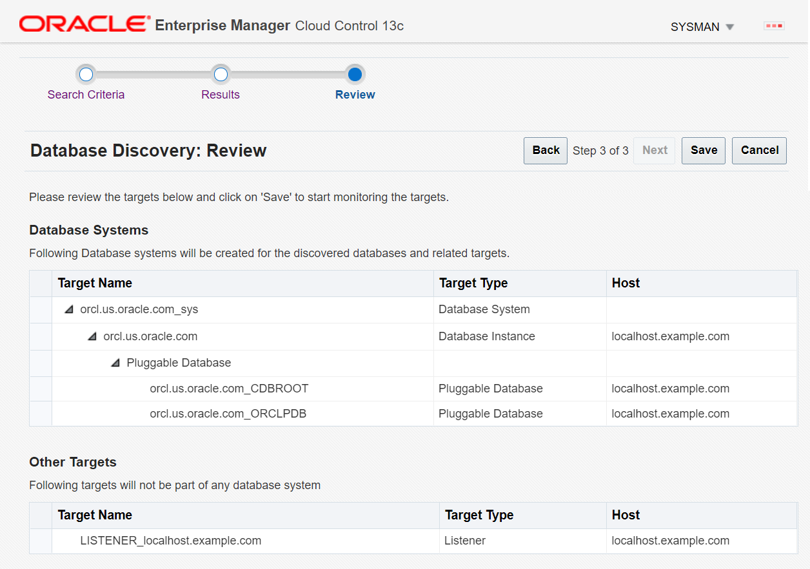

    The window displays a confirmation message about target saving.

    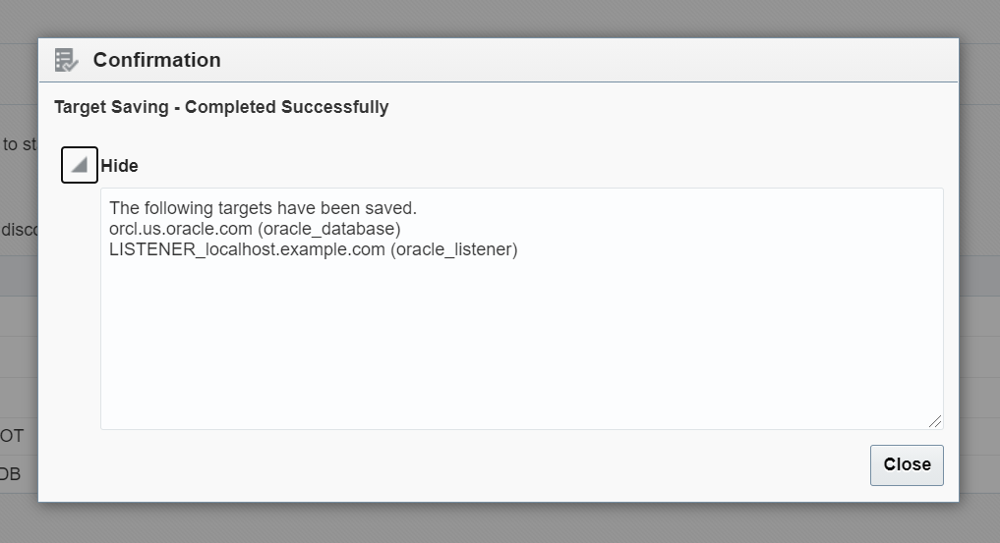

    Congratulations! You have added your Oracle Database and the listener as targets.  The Databases page displays the target Oracle Database, the Database Instance name, and the PDBs.   
    The values may differ depending on the system you are using.  

    

    You can start monitoring and managing your target Oracle Database and the target listener from Oracle EMCC.

    On the Databases page, you can change the **View** type to **Database Load Map** and display the target databases in a load map view.

    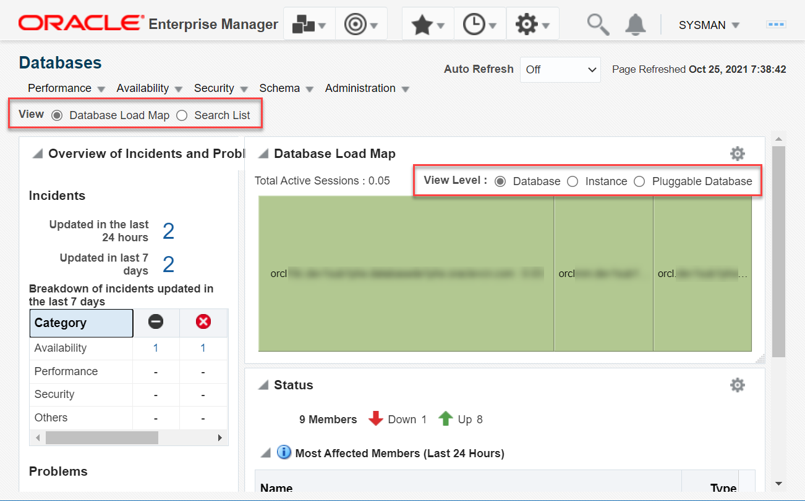

    In the load map view, you can select the **View Level** as:
    - **Database** - To display the target Oracle Databases.
    - **Instance** - To display the Database Instances.
    - **Pluggable Database** - To display the CDB and PDBs in each database.

    **Note:** For this workshop, keep the **View** type as **Search list** which displays the target databases in a list view.

## Task 3: Remove Oracle Database from managed targets

You can remove the Oracle Database Instance, Database System, CDB, and PDBs from managed targets in Oracle EMCC. After removing a target, you cannot manage it from Oracle EMCC anymore.

> **Note**: Removing a target Oracle Database from Oracle EMCC does not delete or deinstall the database from the host system. It also does not remove the target listener from Oracle EMCC automatically.

1.  On the Databases page, select the target Oracle Database that you want to remove and click **Remove**. Note that the **View** type selected is **Search list**.   
	For this lab, let us remove the Database Instance, *orcl.us.oracle.com*.   
	The values may differ depending on the system you are using.

    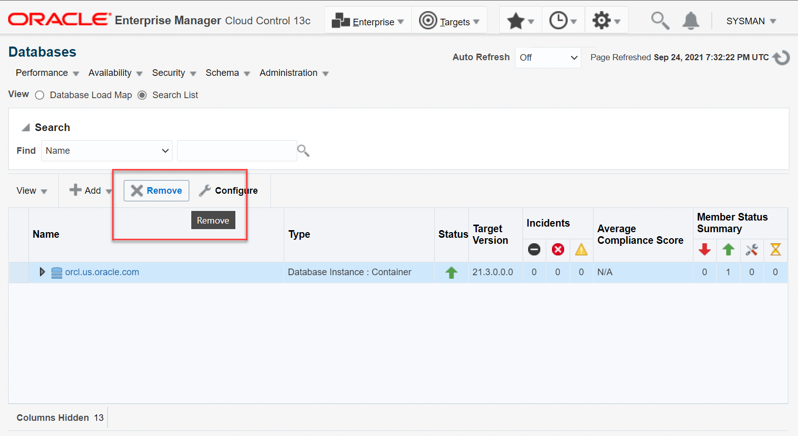

2.  The window displays a warning message. Click **Yes** to confirm the removal.   
    The values may differ depending on the system you are using.  

    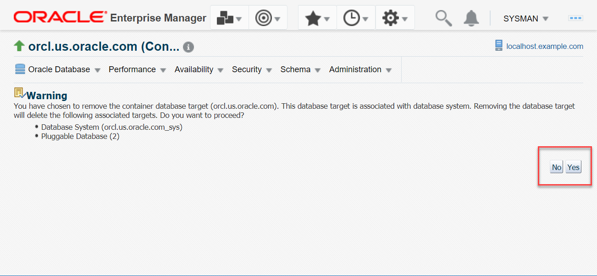

	Clicking **No** will cancel the delete operation and take you back to the Databases page. 

	If you remove all target databases from Oracle EMCC, the Databases page displays a message `No Databases found`. <!-- For this lab, Oracle EMCC had only one Oracle Database as a managed target. -->

    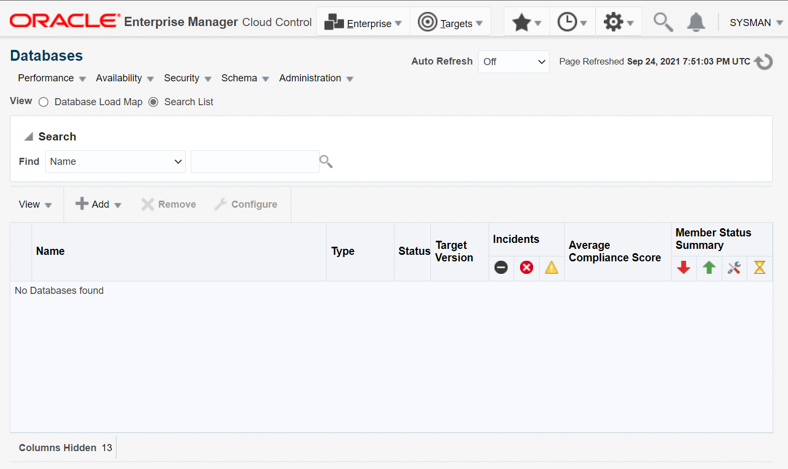

You have successfully removed the Oracle Database Instance from managed targets in Oracle EMCC. You can also remove a target Oracle Database from the All Targets page.

Removing an Oracle Database Instance or a Database System deletes the entire Oracle Database, including the CDB and PDBs, from managed targets in Oracle EMCC. Whereas, if you remove a specific CDB or a PDB, Oracle EMCC deletes only that target database and leaves the Database Instance, Database System, and other PDBs intact. 

The below screenshot gives an example of removing a target CDB, *CDB$ROOT*. The values may differ depending on the system you are using.  

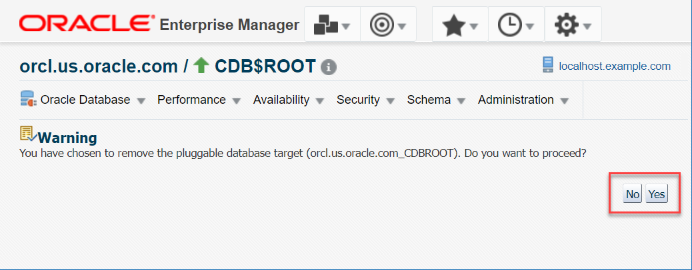

> **Note**: Oracle EMCC allows you to remove Oracle Databases or PDBs one at a time. You cannot remove multiple Oracle Databases together in a single step.

## Task 4: Remove Listener from managed targets

You can remove a listener from managed targets in Oracle EMCC. After removing a target, you cannot manage it from Oracle EMCC anymore.

> **Note**: Removing a target listener from Oracle EMCC does not delete the listener from the host system.

1.  From the **Targets** menu, select **All Targets** to open the All Targets page.

    

2.  On the All Targets page, select the listener you want to remove.  
    For this lab, remove the listener for `orcl.us.oracle.com`. Right-click *LISTENER_localhost.example.com* and select **Target Setup** > **Remove Target**.  
    The values may differ depending on the system you are using.

   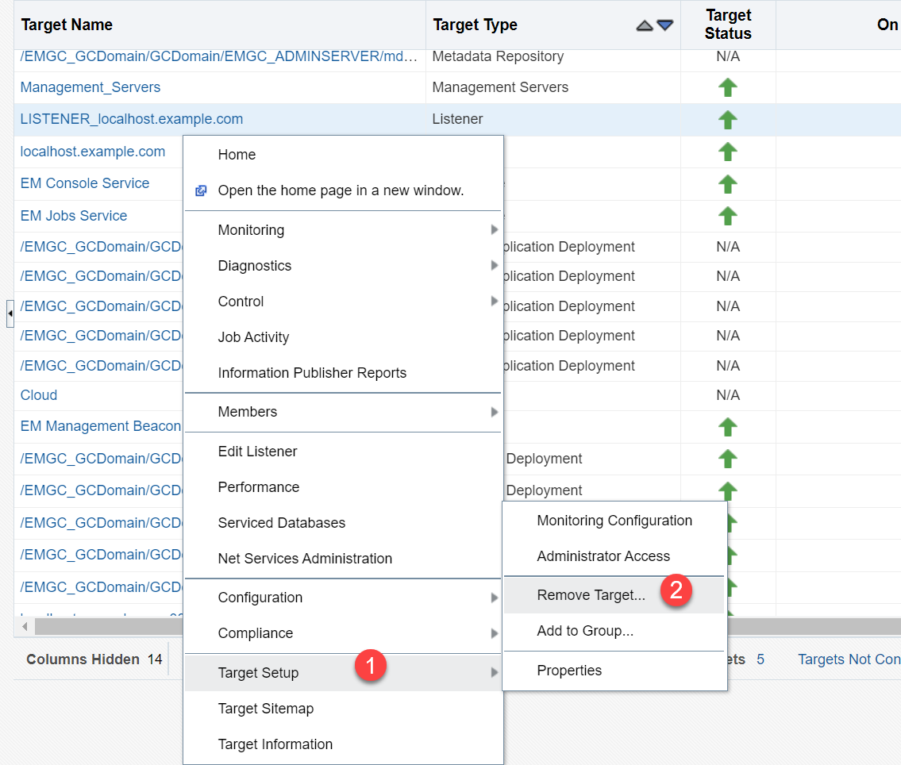

3.  The window displays a confirmation message. Click **Yes** to confirm the removal.   
    The values may differ depending on the system you are using.  

   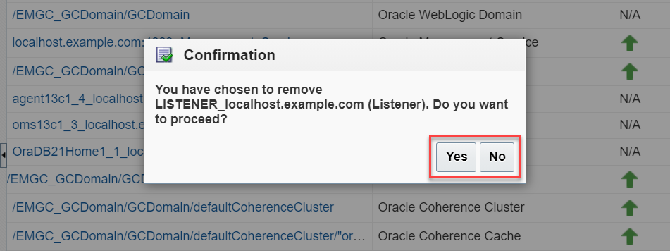

    Clicking **No** will cancel the delete operation and take you back to the All Targets page. 

   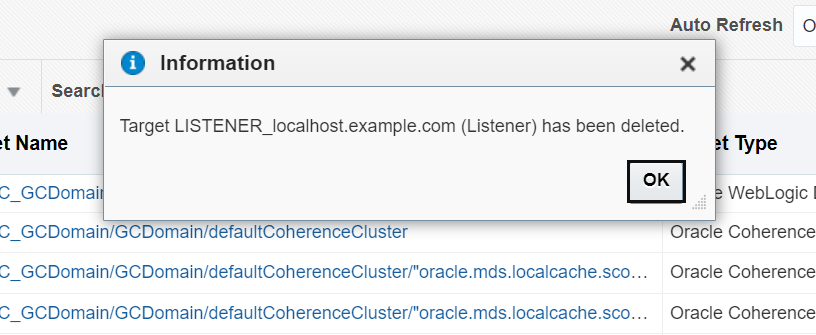

You have successfully removed the listener from managed targets in Oracle EMCC. When you remove a listener, Oracle EMCC does not delete the target Oracle Database automatically.

Oracle EMCC allows you to remove listeners one at a time. You cannot remove multiple listeners together in a single step.

> **Note**: To run the labs and tasks related to Oracle EMCC, you would need Oracle Database 21c and the listener as managed targets in Oracle EMCC. If you have removed the Oracle Database and the listener from Oracle EMCC as per the above tasks, add them again as managed targets as explained in *Task 2* of this lab.

In this lab, you have learned how to view your targets in Oracle EMCC, add and remove Oracle Databases and Listeners as managed targets.

You may now **proceed to the next lab**.

## Acknowledgements
- **Author** - Manish Garodia, Principal User Assistance Developer, Database Technologies
- **Contributors** - Suresh Rajan, Kurt Engeleiter, Subhash Chandra, Steven Lemme, Ashwini R
- **Last Updated By/Date** - Manish Garodia, December 2021
